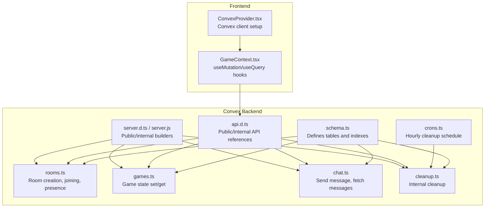
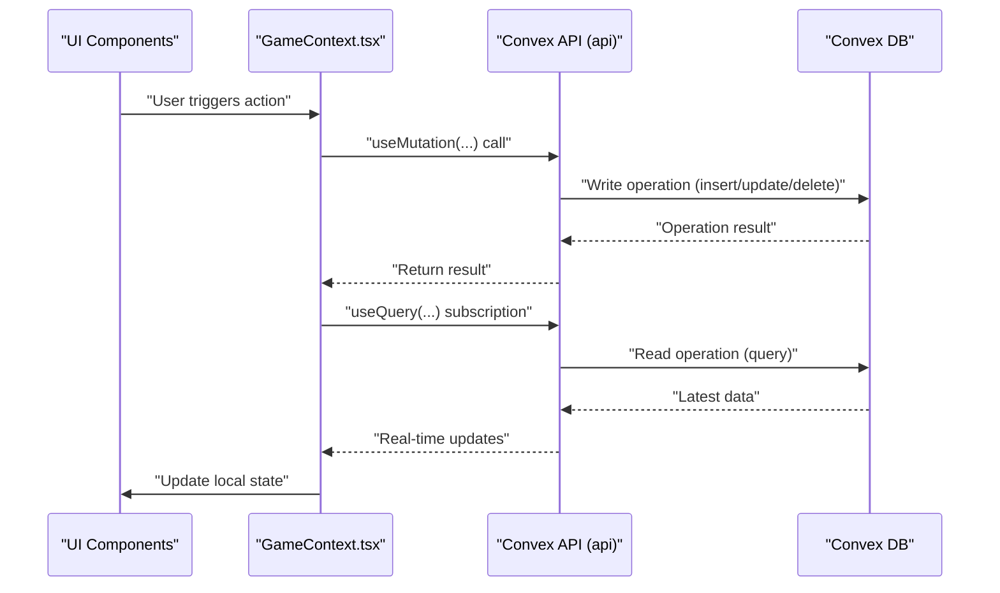
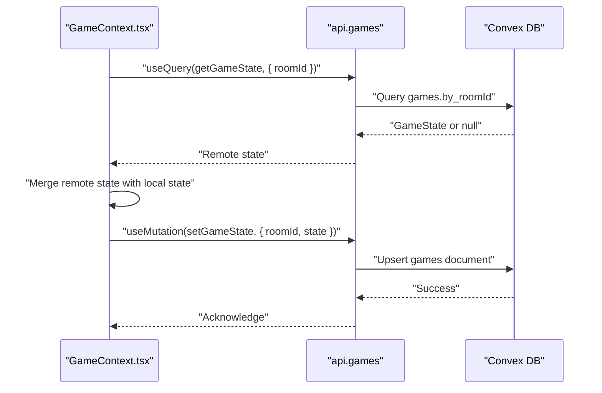
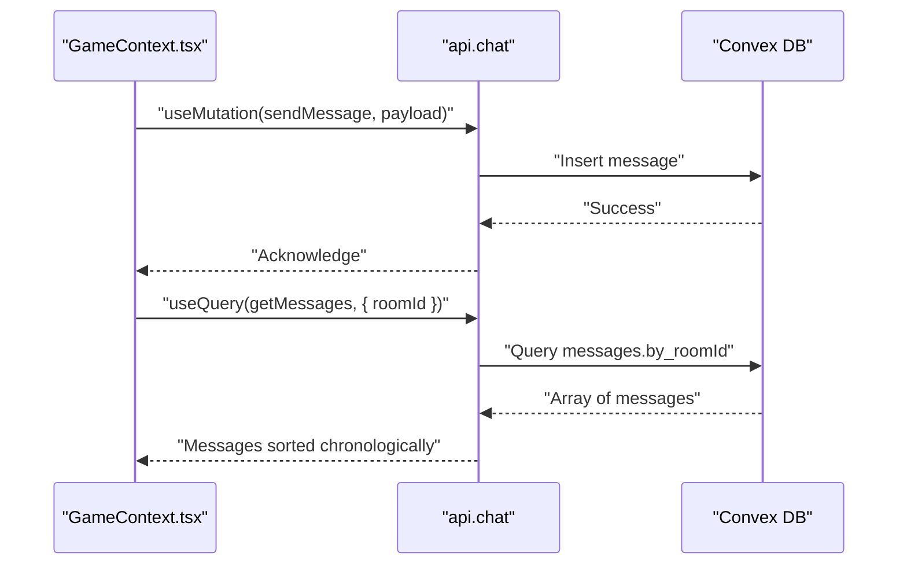
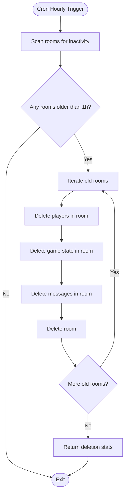
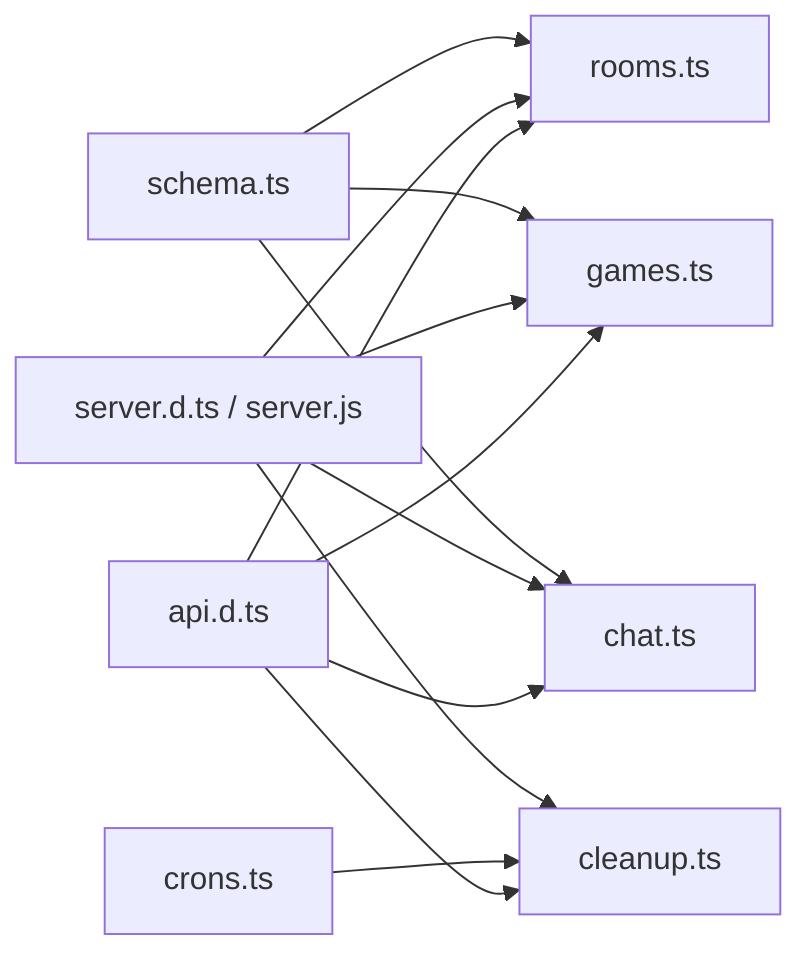

# API Endpoints

<cite>
**Referenced Files in This Document**
- [games.ts](file://convex/games.ts)
- [rooms.ts](file://convex/rooms.ts)
- [chat.ts](file://convex/chat.ts)
- [cleanup.ts](file://convex/cleanup.ts)
- [crons.ts](file://convex/crons.ts)
- [schema.ts](file://convex/schema.ts)
- [api.d.ts](file://convex/_generated/api.d.ts)
- [server.d.ts](file://convex/_generated/server.d.ts)
- [server.js](file://convex/_generated/server.js)
- [GameContext.tsx](file://src/context/GameContext.tsx)
- [ConvexProvider.tsx](file://src/ConvexProvider.tsx)
- [README.md](file://convex/README.md)
- [README.md](file://README.md)
</cite>

## Table of Contents
1. [Introduction](#introduction)
2. [Project Structure](#project-structure)
3. [Core Components](#core-components)
4. [Architecture Overview](#architecture-overview)
5. [Detailed Component Analysis](#detailed-component-analysis)
6. [Dependency Analysis](#dependency-analysis)
7. [Performance Considerations](#performance-considerations)
8. [Troubleshooting Guide](#troubleshooting-guide)
9. [Conclusion](#conclusion)
10. [Appendices](#appendices)

## Introduction
This document describes the Convex backend API endpoints used by the sen-web multiplayer card game. It covers:
- Public mutations and queries for rooms, games, and chat
- Real-time synchronization patterns using Convex query subscriptions
- Internal cron-triggered cleanup
- Authentication model, rate limiting considerations, error handling, and versioning
- Frontend usage patterns via Convex React hooks

## Project Structure
The Convex backend is organized under the convex/ directory with separate modules for rooms, games, chat, cleanup, and cron scheduling. The schema defines the data model and indexes. The frontend integrates with Convex through React hooks and a provider.

**Diagram sources**
- [schema.ts](file://convex/schema.ts#L1-L42)
- [rooms.ts](file://convex/rooms.ts#L1-L119)
- [games.ts](file://convex/games.ts#L1-L43)
- [chat.ts](file://convex/chat.ts#L1-L35)
- [cleanup.ts](file://convex/cleanup.ts#L1-L68)
- [crons.ts](file://convex/crons.ts#L1-L17)
- [api.d.ts](file://convex/_generated/api.d.ts#L1-L58)
- [server.d.ts](file://convex/_generated/server.d.ts#L1-L123)
- [server.js](file://convex/_generated/server.js#L1-L59)
- [GameContext.tsx](file://src/context/GameContext.tsx#L1-L200)
- [ConvexProvider.tsx](file://src/ConvexProvider.tsx#L1-L18)

**Section sources**
- [schema.ts](file://convex/schema.ts#L1-L42)
- [rooms.ts](file://convex/rooms.ts#L1-L119)
- [games.ts](file://convex/games.ts#L1-L43)
- [chat.ts](file://convex/chat.ts#L1-L35)
- [cleanup.ts](file://convex/cleanup.ts#L1-L68)
- [crons.ts](file://convex/crons.ts#L1-L17)
- [api.d.ts](file://convex/_generated/api.d.ts#L1-L58)
- [server.d.ts](file://convex/_generated/server.d.ts#L1-L123)
- [server.js](file://convex/_generated/server.js#L1-L59)
- [GameContext.tsx](file://src/context/GameContext.tsx#L1-L200)
- [ConvexProvider.tsx](file://src/ConvexProvider.tsx#L1-L18)

## Core Components
- Rooms module: createRoom, joinRoom, getRoom, getPlayers, updatePlayerPresence
- Games module: setGameState, getGameState
- Chat module: sendMessage, getMessages
- Cleanup module: cleanupOldRooms (internal)
- Cron scheduling: hourly cleanup job

Each endpoint is typed and validated using Convex’s type system. Public functions are exposed via the api namespace; internal functions via internal.

**Section sources**
- [rooms.ts](file://convex/rooms.ts#L1-L119)
- [games.ts](file://convex/games.ts#L1-L43)
- [chat.ts](file://convex/chat.ts#L1-L35)
- [cleanup.ts](file://convex/cleanup.ts#L1-L68)
- [api.d.ts](file://convex/_generated/api.d.ts#L1-L58)
- [server.d.ts](file://convex/_generated/server.d.ts#L1-L123)
- [server.js](file://convex/_generated/server.js#L1-L59)

## Architecture Overview
The frontend subscribes to remote state and messages via useQuery and updates local state. Mutations are invoked via useMutation to synchronize changes across clients.

**Diagram sources**
- [GameContext.tsx](file://src/context/GameContext.tsx#L560-L759)
- [api.d.ts](file://convex/_generated/api.d.ts#L1-L58)
- [server.d.ts](file://convex/_generated/server.d.ts#L1-L123)

## Detailed Component Analysis

### Rooms Module
- createRoom
  - Purpose: Create a new room and register the host as the first player.
  - Invocation pattern: useMutation(api.rooms.createRoom)
  - Request parameters:
    - roomId: string
    - hostId: string
    - hostName: string
  - Response: { success: boolean }
  - Behavior: Inserts a room record and a player record for the host; sets timestamps.

- joinRoom
  - Purpose: Add a player to an existing room or refresh their presence.
  - Invocation pattern: useMutation(api.rooms.joinRoom)
  - Request parameters:
    - roomId: string
    - playerId: string
    - name: string
  - Response: { success: boolean }
  - Behavior:
    - Validates room existence; throws an error if missing.
    - Updates lastSeenAt for existing players or inserts a new player.
    - Updates room lastUpdated timestamp.

- getRoom
  - Purpose: Retrieve room metadata by roomId.
  - Invocation pattern: useQuery(api.rooms.getRoom)
  - Request parameters: { roomId: string }
  - Response: Room document or null

- getPlayers
  - Purpose: List players in a room.
  - Invocation pattern: useQuery(api.rooms.getPlayers)
  - Request parameters: { roomId: string }
  - Response: Array of player documents

- updatePlayerPresence
  - Purpose: Refresh a player’s lastSeenAt timestamp.
  - Invocation pattern: useMutation(api.rooms.updatePlayerPresence)
  - Request parameters:
    - roomId: string
    - playerId: string
  - Response: void

Real-time presence tracking:
- Presence is computed by filtering players whose lastSeenAt is within a short window.
- Host-only auto-start behavior and opponent leave detection are handled in the frontend.

**Section sources**
- [rooms.ts](file://convex/rooms.ts#L1-L119)
- [schema.ts](file://convex/schema.ts#L1-L42)
- [GameContext.tsx](file://src/context/GameContext.tsx#L560-L759)

### Games Module
- setGameState
  - Purpose: Persist or update game state for a room.
  - Invocation pattern: useMutation(api.games.setGameState)
  - Request parameters:
    - roomId: string
    - state: any (GameState)
  - Response: { success: boolean }
  - Behavior: Upserts a game document with state and lastUpdated timestamp.

- getGameState
  - Purpose: Retrieve latest game state for a room.
  - Invocation pattern: useQuery(api.games.getGameState)
  - Request parameters: { roomId: string }
  - Response: GameState or null

Real-time synchronization:
- The frontend subscribes to getGameState and merges remote state into local state.
- During peeking, local peeked cards are preserved to prevent leaking opponent information.
- A guard prevents infinite loops by comparing serialized states before updating.

**Diagram sources**
- [games.ts](file://convex/games.ts#L1-L43)
- [GameContext.tsx](file://src/context/GameContext.tsx#L560-L759)

**Section sources**
- [games.ts](file://convex/games.ts#L1-L43)
- [schema.ts](file://convex/schema.ts#L1-L42)
- [GameContext.tsx](file://src/context/GameContext.tsx#L560-L759)

### Chat Module
- sendMessage
  - Purpose: Publish a chat message to a room.
  - Invocation pattern: useMutation(api.chat.sendMessage)
  - Request parameters:
    - roomId: string
    - senderId: string
    - senderName: string
    - message: string
  - Response: { success: boolean }
  - Behavior: Inserts a message document with timestamp.

- getMessages
  - Purpose: Fetch recent messages for a room.
  - Invocation pattern: useQuery(api.chat.getMessages)
  - Request parameters: { roomId: string }
  - Response: Array of message documents (up to 100, newest first)

Frontend behavior:
- Messages are appended locally immediately upon sending, then synchronized via subscription.
- The frontend converts Convex documents to a normalized ChatMessage type.

**Diagram sources**
- [chat.ts](file://convex/chat.ts#L1-L35)
- [GameContext.tsx](file://src/context/GameContext.tsx#L919-L953)

**Section sources**
- [chat.ts](file://convex/chat.ts#L1-L35)
- [schema.ts](file://convex/schema.ts#L1-L42)
- [GameContext.tsx](file://src/context/GameContext.tsx#L919-L953)

### Cleanup Module and Cron Scheduling
- cleanupOldRooms (internal)
  - Purpose: Remove old/abandoned rooms and associated data.
  - Invocation pattern: internal.mutation (scheduled)
  - Request parameters: none
  - Response: Object containing counts of deleted entities and timestamp
  - Behavior:
    - Identifies rooms older than 1 hour by lastUpdated.
    - Deletes all players, games, and messages for those rooms, then deletes the rooms themselves.

- cronJobs (hourly)
  - Purpose: Schedule cleanupOldRooms to run every hour at minute 0 UTC.
  - Invocation pattern: internal.cleanup.cleanupOldRooms

**Diagram sources**
- [cleanup.ts](file://convex/cleanup.ts#L1-L68)
- [crons.ts](file://convex/crons.ts#L1-L17)

**Section sources**
- [cleanup.ts](file://convex/cleanup.ts#L1-L68)
- [crons.ts](file://convex/crons.ts#L1-L17)
- [README.md](file://README.md#L55-L61)

## Dependency Analysis
- Public API surface: api.rooms, api.games, api.chat
- Internal API surface: internal.cleanup.cleanupOldRooms
- Builders: mutation, query, internalMutation, internalQuery
- Schema indexes: by_roomId, by_playerId, by_hostId, by_timestamp

**Diagram sources**
- [api.d.ts](file://convex/_generated/api.d.ts#L1-L58)
- [server.d.ts](file://convex/_generated/server.d.ts#L1-L123)
- [server.js](file://convex/_generated/server.js#L1-L59)
- [rooms.ts](file://convex/rooms.ts#L1-L119)
- [games.ts](file://convex/games.ts#L1-L43)
- [chat.ts](file://convex/chat.ts#L1-L35)
- [cleanup.ts](file://convex/cleanup.ts#L1-L68)
- [crons.ts](file://convex/crons.ts#L1-L17)
- [schema.ts](file://convex/schema.ts#L1-L42)

**Section sources**
- [api.d.ts](file://convex/_generated/api.d.ts#L1-L58)
- [server.d.ts](file://convex/_generated/server.d.ts#L1-L123)
- [server.js](file://convex/_generated/server.js#L1-L59)
- [schema.ts](file://convex/schema.ts#L1-L42)

## Performance Considerations
- Index usage:
  - by_roomId on rooms, players, games, messages enables efficient lookups.
  - by_timestamp on messages supports ordered retrieval.
- Query limits:
  - getMessages retrieves up to 100 most recent messages to bound payload size.
- Upsert pattern:
  - setGameState uses an upsert to minimize write operations.
- Subscription-driven updates:
  - Frontend subscribes to getGameState and getMessages to receive incremental updates rather than polling.

[No sources needed since this section provides general guidance]

## Troubleshooting Guide
- Room not found on join:
  - joinRoom throws an error if the room does not exist. Ensure the roomId is valid and the room still exists.
- Presence timeouts:
  - Presence is considered active if lastSeenAt is within a short threshold. If a player appears offline, verify updatePlayerPresence is being called periodically.
- Message ordering:
  - getMessages returns newest-first internally then reverses for chronological display. If ordering seems off, check the frontend conversion logic.
- Cleanup impact:
  - Rooms inactive for more than 1 hour are removed along with players, games, and messages. If data disappears unexpectedly, confirm the inactivity threshold and cron schedule.

**Section sources**
- [rooms.ts](file://convex/rooms.ts#L30-L75)
- [chat.ts](file://convex/chat.ts#L23-L33)
- [cleanup.ts](file://convex/cleanup.ts#L1-L68)
- [README.md](file://README.md#L55-L61)

## Conclusion
The Convex backend provides a clean separation between public and internal functions, enabling real-time collaboration through subscriptions and mutations. Rooms, games, and chat are modeled with explicit indexes and bounded reads. An hourly cleanup job maintains database hygiene. Frontend integration uses Convex React hooks to synchronize state and messages seamlessly.

[No sources needed since this section summarizes without analyzing specific files]

## Appendices

### HTTP-like Invocation Patterns
- Public mutations and queries are accessed via api.rooms.*, api.games.*, api.chat.*
- Internal mutations are accessed via internal.cleanup.cleanupOldRooms
- Example invocation patterns are demonstrated in the Convex README for useQuery and useMutation.

**Section sources**
- [api.d.ts](file://convex/_generated/api.d.ts#L1-L58)
- [README.md](file://convex/README.md#L1-L91)

### Frontend Hook Usage Examples
- Creating a room:
  - useMutation(api.rooms.createRoom)
- Joining a room:
  - useMutation(api.rooms.joinRoom)
- Broadcasting game state:
  - useMutation(api.games.setGameState)
- Sending a chat message:
  - useMutation(api.chat.sendMessage)
- Subscribing to game state:
  - useQuery(api.games.getGameState, { roomId })
- Subscribing to chat messages:
  - useQuery(api.chat.getMessages, { roomId })
- Subscribing to player presence:
  - useQuery(api.rooms.getPlayers, { roomId })

**Section sources**
- [GameContext.tsx](file://src/context/GameContext.tsx#L560-L759)
- [README.md](file://convex/README.md#L1-L91)

### Authentication and Security
- Public rooms: No authentication is enforced for public mutations and queries. Access control should be implemented at the application level if needed.
- Data validation: Convex’s type system validates function arguments and schema fields, preventing malformed writes.
- Rate limiting: Not configured in the backend; consider adding application-level rate limiting if needed.

**Section sources**
- [schema.ts](file://convex/schema.ts#L1-L42)
- [rooms.ts](file://convex/rooms.ts#L1-L119)
- [games.ts](file://convex/games.ts#L1-L43)
- [chat.ts](file://convex/chat.ts#L1-L35)

### Versioning Approach
- The API is versioned implicitly by the generated api.d.ts and server builders. Changes to function signatures or schema require redeploying Convex functions and regenerating types.

**Section sources**
- [api.d.ts](file://convex/_generated/api.d.ts#L1-L58)
- [server.d.ts](file://convex/_generated/server.d.ts#L1-L123)
- [server.js](file://convex/_generated/server.js#L1-L59)