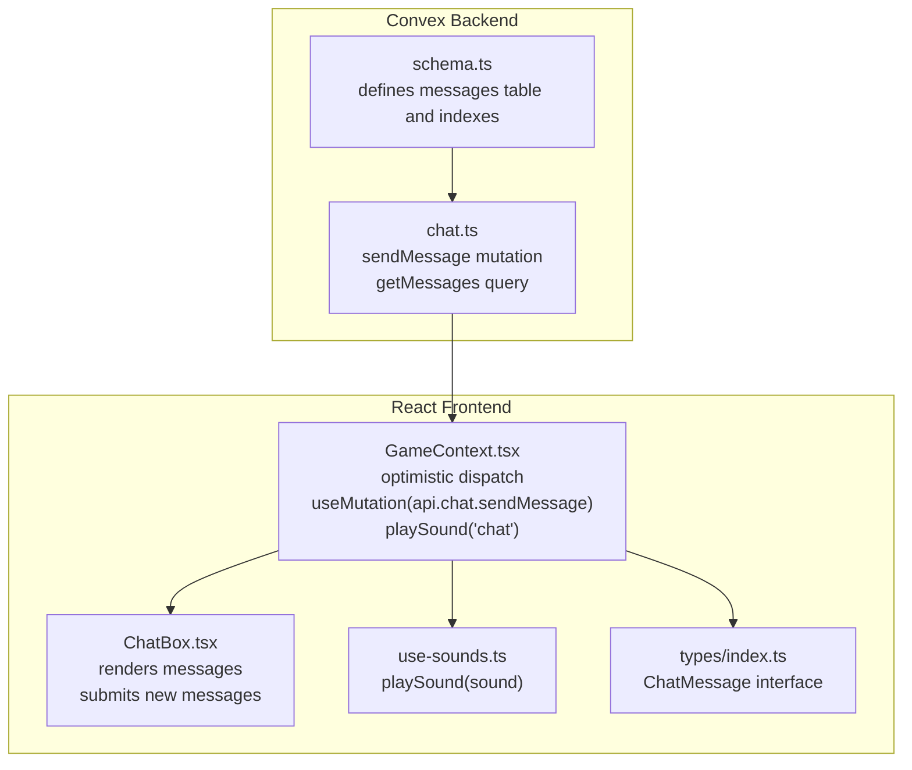
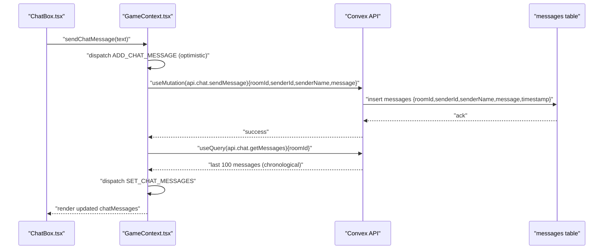
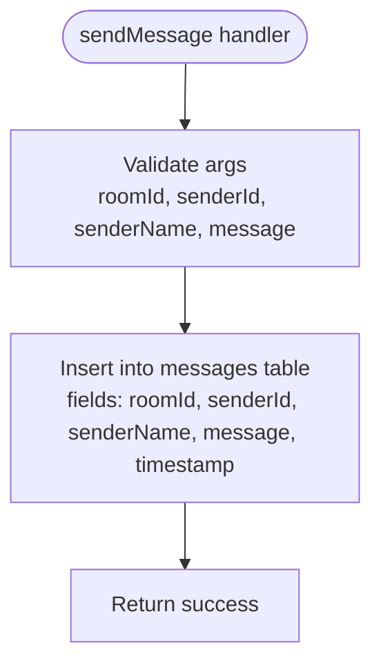
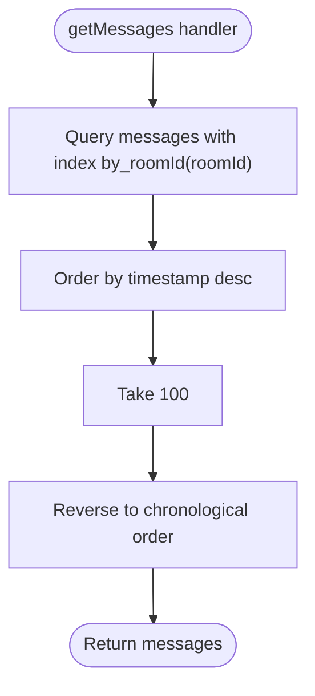
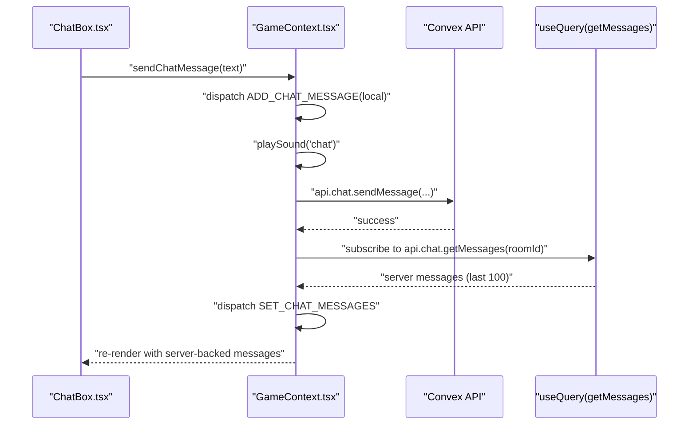
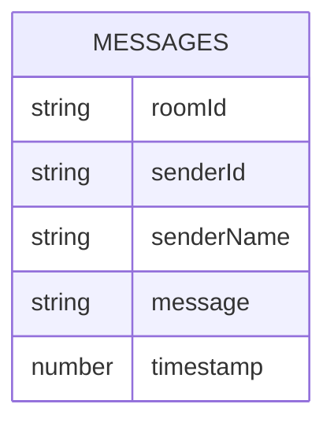
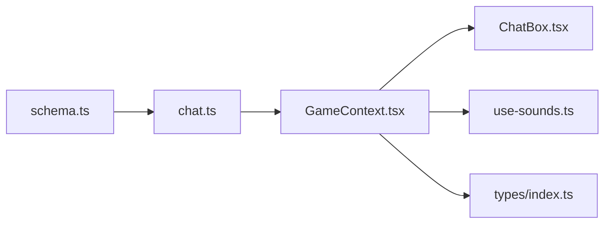

# Chat API

<cite>
**Referenced Files in This Document**
- [chat.ts](file://convex/chat.ts)
- [schema.ts](file://convex/schema.ts)
- [GameContext.tsx](file://src/context/GameContext.tsx)
- [ChatBox.tsx](file://src/components/ChatBox.tsx)
- [use-sounds.ts](file://src/hooks/use-sounds.ts)
- [index.ts](file://src/types/index.ts)
- [README.md](file://README.md)
</cite>

## Table of Contents
1. [Introduction](#introduction)
2. [Project Structure](#project-structure)
3. [Core Components](#core-components)
4. [Architecture Overview](#architecture-overview)
5. [Detailed Component Analysis](#detailed-component-analysis)
6. [Dependency Analysis](#dependency-analysis)
7. [Performance Considerations](#performance-considerations)
8. [Troubleshooting Guide](#troubleshooting-guide)
9. [Conclusion](#conclusion)
10. [Appendices](#appendices)

## Introduction
This document describes the Chat API that enables real-time messaging between players in the online mode of the game. It covers:
- The sendMessage mutation and its parameters, insertion into the messages table, and timestamp generation
- The getMessages query that retrieves messages using the by_roomId index, limits results to the last 100 messages, and reverses the order for chronological presentation
- Frontend integration via GameContext.tsx using useMutation(api.chat.sendMessage) and an optimistic dispatch pattern
- Performance implications of message limiting, potential for message loss during network failures, and sound feedback via playSound('chat')
- Data privacy considerations, content moderation possibilities, and extension points for richer message types or persistence policies

## Project Structure
The Chat API spans the backend Convex functions and the frontend React integration:
- Backend: Convex schema defines the messages table and indexes; chat.ts implements sendMessage and getMessages
- Frontend: GameContext.tsx orchestrates optimistic UI updates and mutation calls; ChatBox.tsx renders the chat UI; use-sounds.ts provides audio feedback; types/index.ts defines ChatMessage shape

**Diagram sources**
- [schema.ts](file://convex/schema.ts#L31-L40)
- [chat.ts](file://convex/chat.ts#L1-L35)
- [GameContext.tsx](file://src/context/GameContext.tsx#L587-L607)
- [ChatBox.tsx](file://src/components/ChatBox.tsx#L1-L68)
- [use-sounds.ts](file://src/hooks/use-sounds.ts#L1-L30)
- [index.ts](file://src/types/index.ts#L29-L35)

**Section sources**
- [README.md](file://README.md#L39-L54)
- [schema.ts](file://convex/schema.ts#L31-L40)
- [chat.ts](file://convex/chat.ts#L1-L35)
- [GameContext.tsx](file://src/context/GameContext.tsx#L587-L607)
- [ChatBox.tsx](file://src/components/ChatBox.tsx#L1-L68)
- [use-sounds.ts](file://src/hooks/use-sounds.ts#L1-L30)
- [index.ts](file://src/types/index.ts#L29-L35)

## Core Components
- sendMessage mutation
  - Parameters: roomId, senderId, senderName, message
  - Behavior: inserts a new record into the messages table with a timestamp generated at insertion time
- getMessages query
  - Parameters: roomId
  - Behavior: reads messages ordered by timestamp descending, takes the last 100, then reverses to chronological order for display

**Section sources**
- [chat.ts](file://convex/chat.ts#L4-L21)
- [chat.ts](file://convex/chat.ts#L23-L33)
- [schema.ts](file://convex/schema.ts#L31-L40)

## Architecture Overview
The Chat API follows a straightforward request-response pattern with optimistic UI updates:
- Frontend composes a ChatMessage object and dispatches it immediately to the local state
- Frontend triggers sendMessage mutation asynchronously
- Backend persists the message and returns success
- Frontend subscribes to getMessages to keep the UI synchronized

**Diagram sources**
- [GameContext.tsx](file://src/context/GameContext.tsx#L919-L953)
- [chat.ts](file://convex/chat.ts#L4-L21)
- [chat.ts](file://convex/chat.ts#L23-L33)
- [schema.ts](file://convex/schema.ts#L31-L40)

## Detailed Component Analysis

### sendMessage Mutation
- Purpose: Persist a new chat message for a given room
- Parameters:
  - roomId: string
  - senderId: string
  - senderName: string
  - message: string
- Implementation highlights:
  - Inserts a new document into the messages table
  - Generates a timestamp at insertion time
  - Returns a simple success indicator

**Diagram sources**
- [chat.ts](file://convex/chat.ts#L4-L21)

**Section sources**
- [chat.ts](file://convex/chat.ts#L4-L21)

### getMessages Query
- Purpose: Retrieve recent chat messages for a room
- Parameters:
  - roomId: string
- Implementation highlights:
  - Uses the by_roomId index to efficiently filter messages by room
  - Orders by timestamp descending
  - Limits to the last 100 messages
  - Reverses the array to present messages in chronological order

**Diagram sources**
- [chat.ts](file://convex/chat.ts#L23-L33)
- [schema.ts](file://convex/schema.ts#L31-L40)

**Section sources**
- [chat.ts](file://convex/chat.ts#L23-L33)
- [schema.ts](file://convex/schema.ts#L31-L40)

### Frontend Integration in GameContext.tsx
- Optimistic dispatch pattern:
  - On sending a message, the frontend creates a temporary ChatMessage with a local id and timestamp
  - Immediately dispatches ADD_CHAT_MESSAGE to update the UI
  - Calls sendMessageMutation with the same payload
  - On success, the subscription to getMessages will update the list; if the optimistic message differs, it will be replaced by the server-backed message
- Sound feedback:
  - playSound('chat') is invoked after dispatching the optimistic message

**Diagram sources**
- [GameContext.tsx](file://src/context/GameContext.tsx#L919-L953)
- [ChatBox.tsx](file://src/components/ChatBox.tsx#L26-L32)
- [use-sounds.ts](file://src/hooks/use-sounds.ts#L1-L30)

**Section sources**
- [GameContext.tsx](file://src/context/GameContext.tsx#L919-L953)
- [ChatBox.tsx](file://src/components/ChatBox.tsx#L26-L32)
- [use-sounds.ts](file://src/hooks/use-sounds.ts#L1-L30)
- [index.ts](file://src/types/index.ts#L29-L35)

### Data Model for Messages

**Diagram sources**
- [schema.ts](file://convex/schema.ts#L31-L40)

**Section sources**
- [schema.ts](file://convex/schema.ts#L31-L40)
- [index.ts](file://src/types/index.ts#L29-L35)

## Dependency Analysis
- Backend dependencies:
  - schema.ts defines the messages table and indexes (by_roomId, by_timestamp)
  - chat.ts depends on schema-defined indexes for efficient queries
- Frontend dependencies:
  - GameContext.tsx depends on Convex-generated API types and hooks
  - ChatBox.tsx depends on GameContext state and dispatch actions
  - use-sounds.ts provides playSound(sound) abstraction

**Diagram sources**
- [schema.ts](file://convex/schema.ts#L31-L40)
- [chat.ts](file://convex/chat.ts#L1-L35)
- [GameContext.tsx](file://src/context/GameContext.tsx#L587-L607)
- [ChatBox.tsx](file://src/components/ChatBox.tsx#L1-L68)
- [use-sounds.ts](file://src/hooks/use-sounds.ts#L1-L30)
- [index.ts](file://src/types/index.ts#L29-L35)

**Section sources**
- [schema.ts](file://convex/schema.ts#L31-L40)
- [chat.ts](file://convex/chat.ts#L1-L35)
- [GameContext.tsx](file://src/context/GameContext.tsx#L587-L607)
- [ChatBox.tsx](file://src/components/ChatBox.tsx#L1-L68)
- [use-sounds.ts](file://src/hooks/use-sounds.ts#L1-L30)
- [index.ts](file://src/types/index.ts#L29-L35)

## Performance Considerations
- Message limiting:
  - getMessages takes the last 100 messages and reverses them for display. This keeps UI rendering fast and reduces bandwidth.
  - The by_roomId index ensures efficient filtering by room.
- Ordering and pagination:
  - Ordering by timestamp desc and taking 100 is O(n log n) for sorting plus O(n) for collection; acceptable for small batches.
  - If needed, consider server-side pagination or cursor-based pagination for larger datasets.
- Network reliability:
  - The optimistic dispatch pattern improves perceived responsiveness but does not guarantee persistence until the mutation completes.
  - If the mutation fails, the optimistic message remains in the UI until corrected by the subscription response.
- Storage and cleanup:
  - The README mentions automatic cleanup of old rooms and their data, which helps prevent indefinite growth of the messages table.

**Section sources**
- [chat.ts](file://convex/chat.ts#L23-L33)
- [schema.ts](file://convex/schema.ts#L31-L40)
- [README.md](file://README.md#L55-L61)

## Troubleshooting Guide
- Messages not appearing:
  - Verify the room is online mode and roomId is set
  - Ensure the subscription to getMessages is active for the current roomId
- Sound feedback not playing:
  - playSound('chat') is currently a no-op due to CDN restrictions; see use-sounds.ts
- Optimistic message not updating:
  - If the mutation fails, the optimistic message remains; the subscription will reconcile on retry
- Message ordering anomalies:
  - getMessages returns messages in chronological order; if timestamps are equal, ordering may vary

**Section sources**
- [GameContext.tsx](file://src/context/GameContext.tsx#L919-L953)
- [use-sounds.ts](file://src/hooks/use-sounds.ts#L1-L30)
- [chat.ts](file://convex/chat.ts#L23-L33)

## Conclusion
The Chat API provides a simple, efficient mechanism for real-time messaging:
- sendMessage persists messages with a server-generated timestamp
- getMessages retrieves the latest 100 messages in chronological order using an index
- The frontend uses optimistic updates and a subscription to keep the UI consistent
- Performance is bounded by message limiting; future enhancements could include richer message types, moderation, and persistence policies

## Appendices

### API Definitions
- sendMessage
  - Inputs: roomId, senderId, senderName, message
  - Output: success indicator
  - Side effects: inserts a new message document
- getMessages
  - Inputs: roomId
  - Output: array of messages in chronological order (up to 100)
  - Index usage: by_roomId

**Section sources**
- [chat.ts](file://convex/chat.ts#L4-L21)
- [chat.ts](file://convex/chat.ts#L23-L33)
- [schema.ts](file://convex/schema.ts#L31-L40)

### Extension Points
- Rich message types:
  - Extend the messages table with fields like messageType, attachments, reactions
  - Update the ChatMessage interface accordingly
- Content moderation:
  - Add pre-mutation validation or moderation checks in sendMessage
  - Store moderation status and filtered content
- Persistence policies:
  - Implement retention windows and archival strategies
  - Consider partitioning by date or room for scalability

[No sources needed since this section provides general guidance]