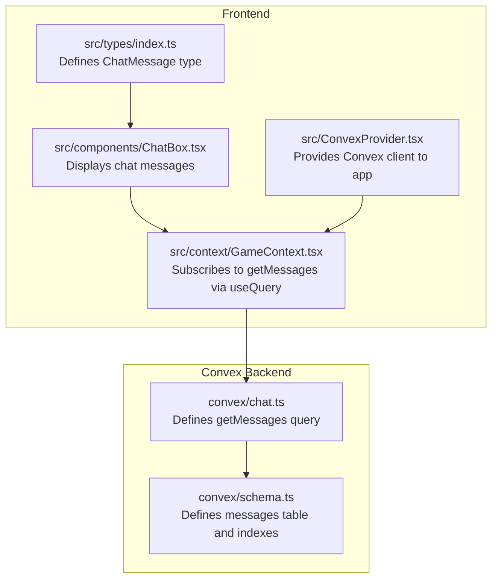
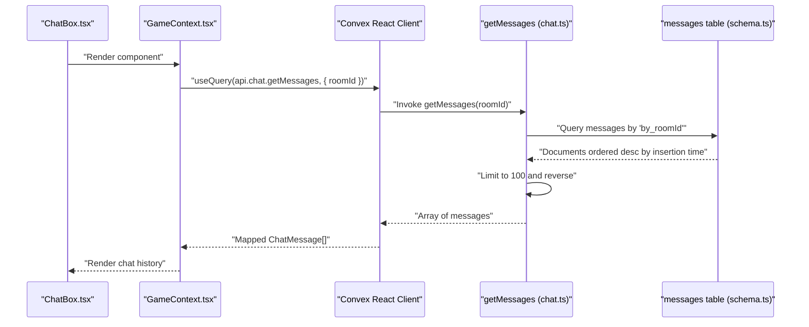
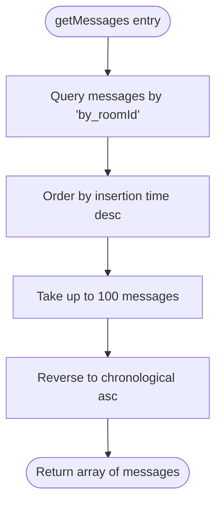
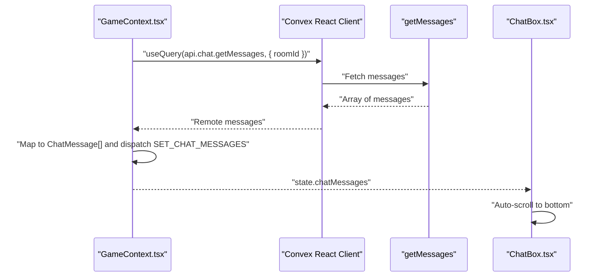
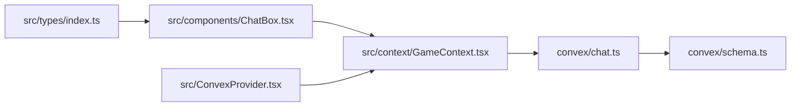

# Retrieve Messages Query

<cite>
**Referenced Files in This Document**
- [chat.ts](file://convex/chat.ts)
- [schema.ts](file://convex/schema.ts)
- [GameContext.tsx](file://src/context/GameContext.tsx)
- [ChatBox.tsx](file://src/components/ChatBox.tsx)
- [ConvexProvider.tsx](file://src/ConvexProvider.tsx)
- [index.ts](file://src/types/index.ts)
</cite>

## Table of Contents
1. [Introduction](#introduction)
2. [Project Structure](#project-structure)
3. [Core Components](#core-components)
4. [Architecture Overview](#architecture-overview)
5. [Detailed Component Analysis](#detailed-component-analysis)
6. [Dependency Analysis](#dependency-analysis)
7. [Performance Considerations](#performance-considerations)
8. [Troubleshooting Guide](#troubleshooting-guide)
9. [Conclusion](#conclusion)

## Introduction
This document explains the getMessages query used to retrieve chat history in chronological order for a given game room. It covers the query’s argument, database operation, post-processing, returned data model, frontend integration, and operational considerations such as scalability, pagination, caching, and real-time synchronization.

## Project Structure
The getMessages query is implemented in the Convex backend and consumed by the frontend through a React context and component.

**Diagram sources**
- [chat.ts](file://convex/chat.ts#L1-L35)
- [schema.ts](file://convex/schema.ts#L1-L42)
- [GameContext.tsx](file://src/context/GameContext.tsx#L562-L607)
- [ChatBox.tsx](file://src/components/ChatBox.tsx#L1-L68)
- [ConvexProvider.tsx](file://src/ConvexProvider.tsx#L1-L18)
- [index.ts](file://src/types/index.ts#L29-L35)

**Section sources**
- [chat.ts](file://convex/chat.ts#L1-L35)
- [schema.ts](file://convex/schema.ts#L1-L42)
- [GameContext.tsx](file://src/context/GameContext.tsx#L562-L607)
- [ChatBox.tsx](file://src/components/ChatBox.tsx#L1-L68)
- [ConvexProvider.tsx](file://src/ConvexProvider.tsx#L1-L18)
- [index.ts](file://src/types/index.ts#L29-L35)

## Core Components
- getMessages query: Reads messages for a specific room using a secondary index, sorts by insertion time, limits results, and reverses to chronological order.
- Frontend subscription: GameContext subscribes to getMessages via useQuery and maps results to ChatMessage for display.
- UI component: ChatBox renders the chat history and auto-scrolls to the latest message.

Key implementation references:
- Query definition and logic: [chat.ts](file://convex/chat.ts#L23-L33)
- Schema and indexes: [schema.ts](file://convex/schema.ts#L31-L40)
- Subscription and mapping: [GameContext.tsx](file://src/context/GameContext.tsx#L602-L607), [GameContext.tsx](file://src/context/GameContext.tsx#L684-L696)
- UI rendering: [ChatBox.tsx](file://src/components/ChatBox.tsx#L34-L67)
- Type contract: [index.ts](file://src/types/index.ts#L29-L35)

**Section sources**
- [chat.ts](file://convex/chat.ts#L23-L33)
- [schema.ts](file://convex/schema.ts#L31-L40)
- [GameContext.tsx](file://src/context/GameContext.tsx#L602-L607)
- [GameContext.tsx](file://src/context/GameContext.tsx#L684-L696)
- [ChatBox.tsx](file://src/components/ChatBox.tsx#L34-L67)
- [index.ts](file://src/types/index.ts#L29-L35)

## Architecture Overview
The getMessages flow connects the frontend to the backend and database:

**Diagram sources**
- [ChatBox.tsx](file://src/components/ChatBox.tsx#L1-L68)
- [GameContext.tsx](file://src/context/GameContext.tsx#L562-L607)
- [GameContext.tsx](file://src/context/GameContext.tsx#L684-L696)
- [chat.ts](file://convex/chat.ts#L23-L33)
- [schema.ts](file://convex/schema.ts#L31-L40)

## Detailed Component Analysis

### getMessages Query
- Purpose: Return chat messages for a given room in chronological order.
- Argument:
  - roomId: string — identifies the game room.
- Database operation:
  - Queries the messages table using the by_roomId secondary index.
  - Sorts results in descending order by insertion time.
  - Limits results to the most recent 100 messages.
  - Reverses the list to present messages in ascending chronological order.
- Returned shape: Array of message objects with fields:
  - senderId: string
  - senderName: string
  - message: string
  - timestamp: number

Implementation references:
- Query definition and logic: [chat.ts](file://convex/chat.ts#L23-L33)
- Schema and indexes: [schema.ts](file://convex/schema.ts#L31-L40)

**Diagram sources**
- [chat.ts](file://convex/chat.ts#L23-L33)

**Section sources**
- [chat.ts](file://convex/chat.ts#L23-L33)
- [schema.ts](file://convex/schema.ts#L31-L40)

### Frontend Integration
- Subscription:
  - GameContext.tsx subscribes to getMessages using useQuery with roomId.
  - When remote messages arrive, they are mapped to ChatMessage and dispatched to the reducer.
- Rendering:
  - ChatBox.tsx displays the chatMessages array and auto-scrolls to the bottom when new messages arrive.
- Provider:
  - ConvexProvider.tsx initializes the Convex client and makes it available to the app.

References:
- Subscription and mapping: [GameContext.tsx](file://src/context/GameContext.tsx#L602-L607), [GameContext.tsx](file://src/context/GameContext.tsx#L684-L696)
- UI rendering: [ChatBox.tsx](file://src/components/ChatBox.tsx#L34-L67)
- Provider setup: [ConvexProvider.tsx](file://src/ConvexProvider.tsx#L1-L18)
- Type contract: [index.ts](file://src/types/index.ts#L29-L35)

**Diagram sources**
- [GameContext.tsx](file://src/context/GameContext.tsx#L602-L607)
- [GameContext.tsx](file://src/context/GameContext.tsx#L684-L696)
- [ChatBox.tsx](file://src/components/ChatBox.tsx#L1-L68)

**Section sources**
- [GameContext.tsx](file://src/context/GameContext.tsx#L602-L607)
- [GameContext.tsx](file://src/context/GameContext.tsx#L684-L696)
- [ChatBox.tsx](file://src/components/ChatBox.tsx#L1-L68)
- [ConvexProvider.tsx](file://src/ConvexProvider.tsx#L1-L18)
- [index.ts](file://src/types/index.ts#L29-L35)

### Data Model of Returned Messages
The ChatMessage type defines the shape of each message consumed by the UI:

- Fields:
  - id: string — unique identifier for the message
  - senderId: string — author’s player identifier
  - senderName: string — author’s display name
  - message: string — content
  - timestamp: number — insertion time

References:
- Type definition: [index.ts](file://src/types/index.ts#L29-L35)

**Section sources**
- [index.ts](file://src/types/index.ts#L29-L35)

## Dependency Analysis
- Backend dependencies:
  - getMessages depends on the messages table and its by_roomId index.
- Frontend dependencies:
  - GameContext.tsx depends on Convex’s useQuery and the api.chat.getMessages endpoint.
  - ChatBox.tsx depends on GameContext state and the ChatMessage type.
- Provider dependency:
  - ConvexProvider.tsx initializes the Convex client used by GameContext.

**Diagram sources**
- [chat.ts](file://convex/chat.ts#L1-L35)
- [schema.ts](file://convex/schema.ts#L1-L42)
- [GameContext.tsx](file://src/context/GameContext.tsx#L562-L607)
- [ChatBox.tsx](file://src/components/ChatBox.tsx#L1-L68)
- [ConvexProvider.tsx](file://src/ConvexProvider.tsx#L1-L18)
- [index.ts](file://src/types/index.ts#L29-L35)

**Section sources**
- [chat.ts](file://convex/chat.ts#L1-L35)
- [schema.ts](file://convex/schema.ts#L1-L42)
- [GameContext.tsx](file://src/context/GameContext.tsx#L562-L607)
- [ChatBox.tsx](file://src/components/ChatBox.tsx#L1-L68)
- [ConvexProvider.tsx](file://src/ConvexProvider.tsx#L1-L18)
- [index.ts](file://src/types/index.ts#L29-L35)

## Performance Considerations
- Index usage: The query uses the by_roomId secondary index to efficiently filter messages by room.
- Sorting and limiting: Results are sorted by insertion time and limited to the most recent 100 messages to reduce network bandwidth and memory usage.
- Post-processing cost: Reversing a small array (up to 100 items) is inexpensive.
- Scalability:
  - Current limit of 100 messages balances performance and usability.
  - Future enhancement could introduce pagination (e.g., “load older messages”) to support larger histories.
- Cacheability:
  - Convex caches query results for subscribed clients. When a client subscribes with the same arguments, it receives cached results and subsequent updates automatically.
- Real-time synchronization:
  - Subscriptions are reactive; any new messages inserted by other clients will trigger updates to the subscribed component.

[No sources needed since this section provides general guidance]

## Troubleshooting Guide
- No messages displayed:
  - Ensure the roomId is set and valid in the current game mode.
  - Verify the subscription is active: the query is only executed when gameMode is online and roomId is present.
- Messages appear out of order:
  - The query returns messages in chronological order; if the UI shows reverse order, confirm the mapping and rendering logic.
- Network errors:
  - Check that VITE_CONVEX_URL is configured in the environment.
  - Confirm the Convex client is initialized via ConvexProvider.
- Sending vs. receiving:
  - Outgoing messages are added locally before being sent; incoming messages are received via the subscription.

References:
- Subscription gating: [GameContext.tsx](file://src/context/GameContext.tsx#L594-L607)
- Provider initialization: [ConvexProvider.tsx](file://src/ConvexProvider.tsx#L1-L18)

**Section sources**
- [GameContext.tsx](file://src/context/GameContext.tsx#L594-L607)
- [ConvexProvider.tsx](file://src/ConvexProvider.tsx#L1-L18)

## Conclusion
The getMessages query provides an efficient, indexed lookup of recent chat messages for a room, returning them in chronological order. The frontend integrates this via a Convex subscription, mapping results to a typed ChatMessage model and rendering them in a responsive UI. The current design prioritizes performance with a 100-message cap and leverages Convex caching and real-time updates. Future enhancements can consider pagination for larger histories while maintaining the existing performance characteristics.