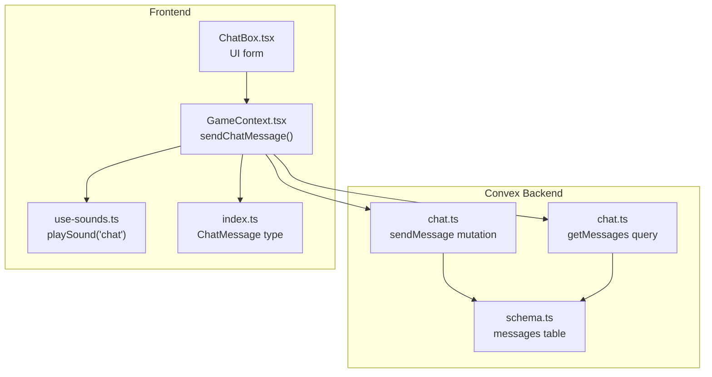
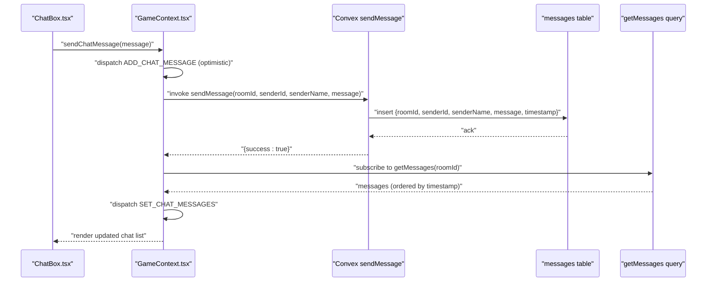
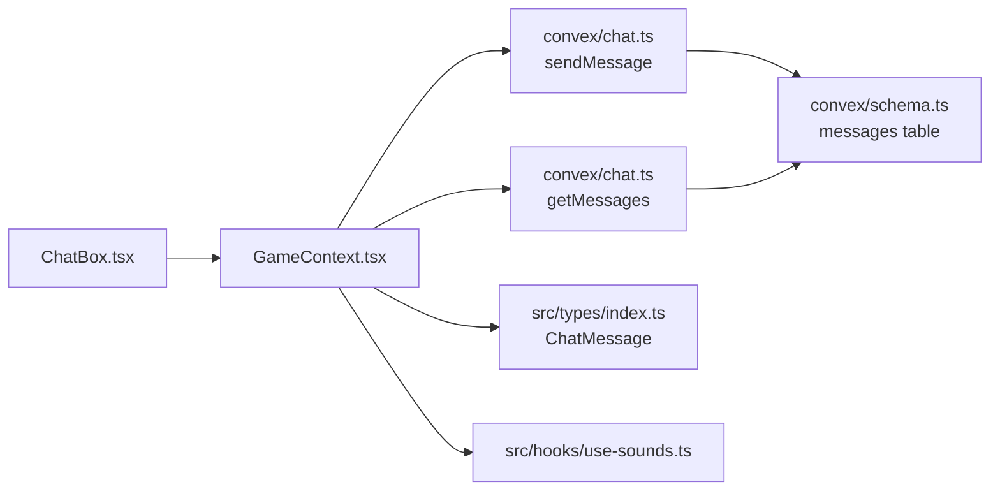

# Send Message Mutation

<cite>
**Referenced Files in This Document**
- [chat.ts](file://convex/chat.ts)
- [schema.ts](file://convex/schema.ts)
- [GameContext.tsx](file://src/context/GameContext.tsx)
- [ChatBox.tsx](file://src/components/ChatBox.tsx)
- [use-sounds.ts](file://src/hooks/use-sounds.ts)
- [index.ts](file://src/types/index.ts)
</cite>

## Table of Contents
1. [Introduction](#introduction)
2. [Project Structure](#project-structure)
3. [Core Components](#core-components)
4. [Architecture Overview](#architecture-overview)
5. [Detailed Component Analysis](#detailed-component-analysis)
6. [Dependency Analysis](#dependency-analysis)
7. [Performance Considerations](#performance-considerations)
8. [Troubleshooting Guide](#troubleshooting-guide)
9. [Conclusion](#conclusion)

## Introduction
This document provides detailed API documentation for the sendMessage mutation in the Chat API. It explains the mutation’s purpose for enabling real-time player communication within game rooms, documents all parameters, describes the backend logic for inserting messages into the database, and outlines frontend integration patterns. It also covers optimistic UI updates, error handling, security considerations via Convex values, and performance implications of optimistic updates.

## Project Structure
The Chat API consists of:
- Backend mutation and query definitions in Convex
- Database schema for the messages table
- Frontend integration in GameContext and ChatBox components
- Types for ChatMessage and sound integration hook

**Diagram sources**
- [chat.ts](file://convex/chat.ts#L1-L35)
- [schema.ts](file://convex/schema.ts#L31-L40)
- [GameContext.tsx](file://src/context/GameContext.tsx#L924-L953)
- [ChatBox.tsx](file://src/components/ChatBox.tsx#L1-L68)
- [use-sounds.ts](file://src/hooks/use-sounds.ts#L1-L30)
- [index.ts](file://src/types/index.ts#L29-L35)

**Section sources**
- [chat.ts](file://convex/chat.ts#L1-L35)
- [schema.ts](file://convex/schema.ts#L31-L40)
- [GameContext.tsx](file://src/context/GameContext.tsx#L924-L953)
- [ChatBox.tsx](file://src/components/ChatBox.tsx#L1-L68)
- [use-sounds.ts](file://src/hooks/use-sounds.ts#L1-L30)
- [index.ts](file://src/types/index.ts#L29-L35)

## Core Components
- sendMessage mutation: Validates and persists a chat message to the messages table with a timestamp generated on the server.
- getMessages query: Retrieves recent messages for a given room, ordered by timestamp.
- ChatMessage type: Defines the shape of messages in the UI and reducer.
- sendChatMessage in GameContext: Orchestrates optimistic UI updates and mutation execution.
- ChatBox component: Provides the UI for sending messages and displaying chat history.

**Section sources**
- [chat.ts](file://convex/chat.ts#L1-L35)
- [schema.ts](file://convex/schema.ts#L31-L40)
- [index.ts](file://src/types/index.ts#L29-L35)
- [GameContext.tsx](file://src/context/GameContext.tsx#L924-L953)
- [ChatBox.tsx](file://src/components/ChatBox.tsx#L1-L68)

## Architecture Overview
The sendMessage flow integrates frontend and backend components to enable real-time chat within game rooms.

**Diagram sources**
- [GameContext.tsx](file://src/context/GameContext.tsx#L924-L953)
- [chat.ts](file://convex/chat.ts#L1-L35)
- [schema.ts](file://convex/schema.ts#L31-L40)
- [ChatBox.tsx](file://src/components/ChatBox.tsx#L1-L68)

## Detailed Component Analysis

### sendMessage Mutation
Purpose:
- Persist a chat message to the messages table with a server-generated timestamp and return a success indicator.

Parameters:
- roomId: string, required for message routing and indexing
- senderId: string, player identifier
- senderName: string, displayed name
- message: string, content body

Backend logic:
- Uses Convex mutation with argument validation via Convex values (v.string()).
- Inserts a record into the messages table with fields: roomId, senderId, senderName, message, timestamp.
- Timestamp is generated using Date.now() on the server.
- Returns { success: true } upon completion.

Security considerations:
- Input validation is enforced by Convex values (v.string()), preventing invalid types from reaching the handler.
- Room-based routing ensures messages are associated with the correct room.

Response format:
- { success: true }

**Section sources**
- [chat.ts](file://convex/chat.ts#L1-L35)
- [schema.ts](file://convex/schema.ts#L31-L40)

### getMessages Query
Purpose:
- Retrieve recent messages for a given room, ordered by timestamp.

Behavior:
- Queries the messages table with an index on roomId.
- Orders results descending and takes up to 100 messages.
- Returns messages in chronological order by reversing the result.

**Section sources**
- [chat.ts](file://convex/chat.ts#L23-L33)
- [schema.ts](file://convex/schema.ts#L31-L40)

### Frontend Integration in GameContext
Purpose:
- Provide a cohesive API for sending chat messages with optimistic UI updates and error handling.

Key behaviors:
- Optimistic UI: Immediately dispatches an ADD_CHAT_MESSAGE action with a client-generated message ID and timestamp to render the message instantly.
- Sound feedback: Calls playSound('chat') to provide audio feedback.
- Mutation execution: Invokes useMutation(api.chat.sendMessage) with roomId, senderId, senderName, and message.
- Error handling: Wraps mutation in a try-catch block to log failures without crashing the UI.
- Remote synchronization: Subscribes to getMessages to update the UI with persisted messages from the server.

Client-side message ID generation:
- Generates a temporary client-side ID using a deterministic prefix and timestamp to ensure immediate rendering.

**Section sources**
- [GameContext.tsx](file://src/context/GameContext.tsx#L924-L953)
- [use-sounds.ts](file://src/hooks/use-sounds.ts#L1-L30)
- [index.ts](file://src/types/index.ts#L29-L35)

### ChatBox Component
Purpose:
- Provide a simple input form for sending messages and display the chat history.

Behavior:
- Reads state.chatMessages and renders each message with sender name and content.
- On submit, calls sendChatMessage(message.trim()) and clears the input field.

**Section sources**
- [ChatBox.tsx](file://src/components/ChatBox.tsx#L1-L68)

### API Definition and Usage
- The mutation is exposed via Convex and referenced as api.chat.sendMessage.
- Frontend invokes it through useMutation and integrates with the GameContext sendChatMessage function.

**Section sources**
- [GameContext.tsx](file://src/context/GameContext.tsx#L587-L593)
- [chat.ts](file://convex/chat.ts#L1-L35)

## Dependency Analysis
Relationships:
- GameContext.tsx depends on Convex mutations and queries for chat operations.
- ChatBox.tsx depends on GameContext to trigger sendChatMessage.
- chat.ts defines the sendMessage mutation and getMessages query.
- schema.ts defines the messages table and indexes used by getMessages.
- use-sounds.ts provides sound feedback integration.
- index.ts defines the ChatMessage type used across the UI and reducer.

**Diagram sources**
- [GameContext.tsx](file://src/context/GameContext.tsx#L587-L593)
- [chat.ts](file://convex/chat.ts#L1-L35)
- [schema.ts](file://convex/schema.ts#L31-L40)
- [ChatBox.tsx](file://src/components/ChatBox.tsx#L1-L68)
- [use-sounds.ts](file://src/hooks/use-sounds.ts#L1-L30)
- [index.ts](file://src/types/index.ts#L29-L35)

**Section sources**
- [GameContext.tsx](file://src/context/GameContext.tsx#L587-L593)
- [chat.ts](file://convex/chat.ts#L1-L35)
- [schema.ts](file://convex/schema.ts#L31-L40)
- [ChatBox.tsx](file://src/components/ChatBox.tsx#L1-L68)
- [use-sounds.ts](file://src/hooks/use-sounds.ts#L1-L30)
- [index.ts](file://src/types/index.ts#L29-L35)

## Performance Considerations
- Optimistic updates reduce perceived latency by rendering messages immediately, improving responsiveness.
- getMessages orders results by timestamp and limits to 100 messages, minimizing payload size and query cost.
- Client-side message IDs avoid network round-trips for UI rendering, but ensure uniqueness and deterministic ordering.
- Debouncing and minimal re-renders are achieved by dispatching only the new message optimistically and later synchronizing with server-provided IDs.

[No sources needed since this section provides general guidance]

## Troubleshooting Guide
Common issues and resolutions:
- Network failure during sendMessage:
  - Symptom: Message does not appear in chat history.
  - Resolution: The try-catch block logs the error and keeps the optimistic UI intact. On subsequent getMessages subscription updates, the server-provided message replaces the optimistic placeholder if persisted.
- Duplicate optimistic entries:
  - Symptom: Temporary client-side message appears alongside server-provided message.
  - Resolution: Ensure the reducer merges server messages with client IDs replaced by server IDs when synchronizing via getMessages.
- Sound feedback not playing:
  - Symptom: No audio feedback after sending a message.
  - Resolution: The sound hook currently disables playback due to CDN restrictions. Enable local sound files or adjust the hook to load assets from a supported source.

**Section sources**
- [GameContext.tsx](file://src/context/GameContext.tsx#L924-L953)
- [use-sounds.ts](file://src/hooks/use-sounds.ts#L1-L30)

## Conclusion
The sendMessage mutation enables real-time chat within game rooms by validating inputs, persisting messages with timestamps, and integrating seamlessly with frontend optimistic UI updates. Together with getMessages, GameContext orchestration, and ChatBox UI, it delivers a responsive and reliable chat experience. Security is ensured via Convex values, while performance is optimized through indexing and message limits. Error handling and sound feedback enhance the user experience, and future improvements can address CDN-related sound playback and refine optimistic update reconciliation.