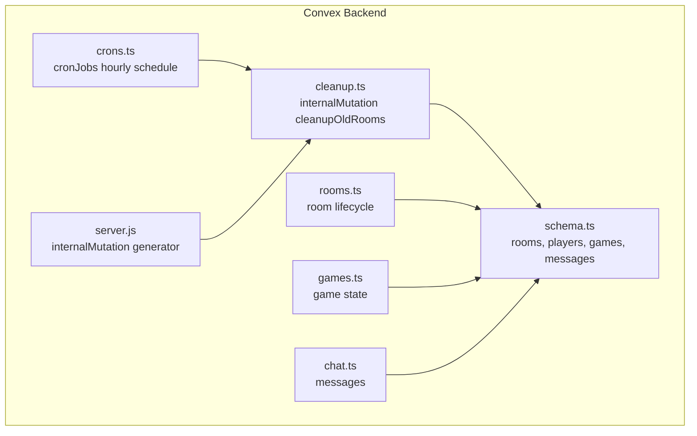
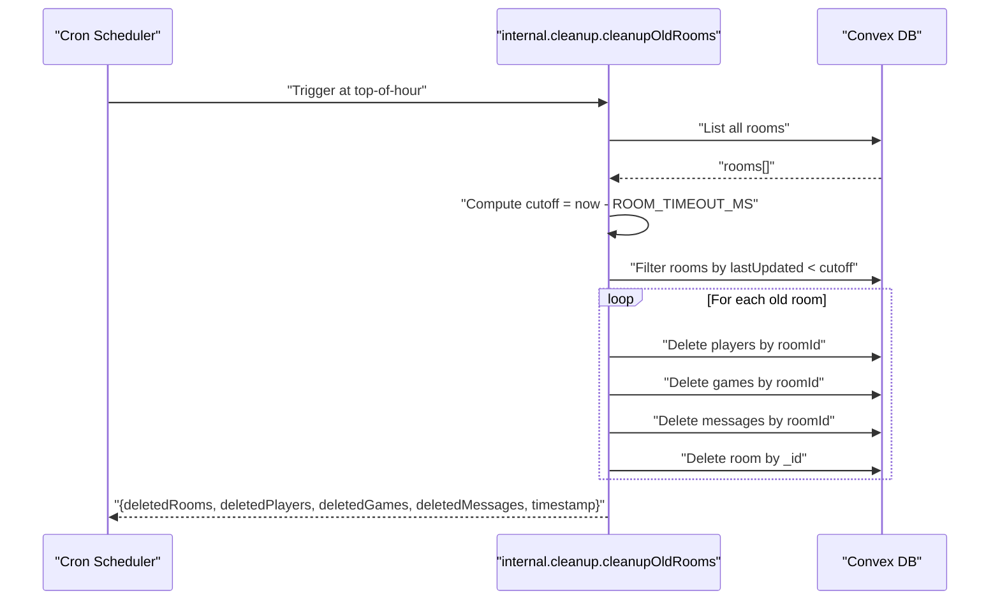
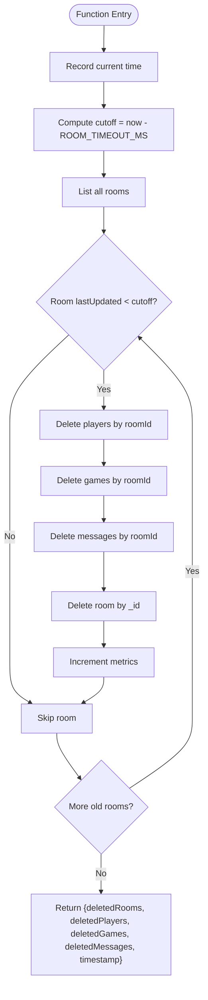
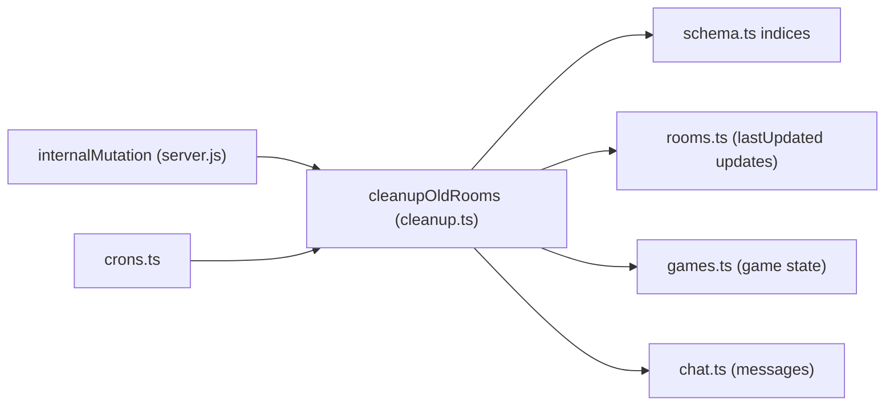

# Cleanup API

<cite>
**Referenced Files in This Document**
- [cleanup.ts](file://convex/cleanup.ts)
- [crons.ts](file://convex/crons.ts)
- [schema.ts](file://convex/schema.ts)
- [rooms.ts](file://convex/rooms.ts)
- [games.ts](file://convex/games.ts)
- [chat.ts](file://convex/chat.ts)
- [README.md](file://README.md)
- [server.js](file://convex/_generated/server.js)
</cite>

## Table of Contents
1. [Introduction](#introduction)
2. [Project Structure](#project-structure)
3. [Core Components](#core-components)
4. [Architecture Overview](#architecture-overview)
5. [Detailed Component Analysis](#detailed-component-analysis)
6. [Dependency Analysis](#dependency-analysis)
7. [Performance Considerations](#performance-considerations)
8. [Troubleshooting Guide](#troubleshooting-guide)
9. [Conclusion](#conclusion)

## Introduction
This document explains the cleanupOldRooms internal mutation that performs automatic resource cleanup for abandoned rooms in sen-web. It covers the serverless cron-triggered execution pattern, the ROOM_TIMEOUT_MS threshold, the systematic cleanup process, cascading deletion logic, metrics returned for observability, configuration considerations, operational best practices, and why this is an internal mutation with no frontend invocation.

## Project Structure
The cleanup mechanism spans a small set of Convex backend files:
- cleanup.ts defines the internal mutation that deletes old rooms and their associated data.
- crons.ts schedules cleanupOldRooms to run periodically.
- schema.ts defines the database tables and indices used by cleanup.
- rooms.ts, games.ts, and chat.ts implement the application’s room lifecycle and data models.

**Diagram sources**
- [cleanup.ts](file://convex/cleanup.ts#L1-L68)
- [crons.ts](file://convex/crons.ts#L1-L17)
- [schema.ts](file://convex/schema.ts#L1-L42)
- [rooms.ts](file://convex/rooms.ts#L1-L119)
- [games.ts](file://convex/games.ts#L1-L43)
- [chat.ts](file://convex/chat.ts#L1-L35)
- [_generated/server.js](file://convex/_generated/server.js#L1-L94)

**Section sources**
- [README.md](file://README.md#L55-L61)
- [schema.ts](file://convex/schema.ts#L1-L42)
- [cleanup.ts](file://convex/cleanup.ts#L1-L68)
- [crons.ts](file://convex/crons.ts#L1-L17)

## Core Components
- Internal mutation cleanupOldRooms: Identifies rooms older than ROOM_TIMEOUT_MS based on lastUpdated, then deletes associated players, game states, and chat messages before removing the room itself. Returns metrics for observability.
- Cron scheduling: Runs cleanupOldRooms hourly via cronJobs.
- Schema and indices: Provides the data model and indexes used by cleanup to efficiently query rooms and related entities by roomId.
- Room lifecycle: Creation, joining, and presence updates that keep lastUpdated fresh.

Key facts:
- Threshold: ROOM_TIMEOUT_MS is defined in cleanup.ts and used to compute the cutoff time for identifying old rooms.
- Execution cadence: Hourly cron job configured in crons.ts.
- Metrics: The mutation returns counts for deletedRooms, deletedPlayers, deletedGames, deletedMessages, plus a timestamp.

**Section sources**
- [cleanup.ts](file://convex/cleanup.ts#L1-L68)
- [crons.ts](file://convex/crons.ts#L1-L17)
- [schema.ts](file://convex/schema.ts#L1-L42)
- [rooms.ts](file://convex/rooms.ts#L1-L119)

## Architecture Overview
The cleanup API is a serverless, internal-only operation orchestrated by Convex cron jobs. It reads the database, applies a time-based filter, and performs cascading deletions to maintain referential integrity.

**Diagram sources**
- [crons.ts](file://convex/crons.ts#L1-L17)
- [cleanup.ts](file://convex/cleanup.ts#L1-L68)
- [schema.ts](file://convex/schema.ts#L1-L42)

## Detailed Component Analysis

### cleanupOldRooms Internal Mutation
Responsibilities:
- Compute cutoff time from ROOM_TIMEOUT_MS.
- Enumerate rooms and filter by lastUpdated < cutoff.
- For each old room, delete associated players, games, and messages.
- Delete the room itself.
- Return metrics and timestamp for observability.

Operational flow:
- Reads all rooms, filters by lastUpdated, iterates old rooms, and performs deletions in a deterministic order to preserve referential integrity.
- Uses indices by_roomId on players, games, and messages to efficiently locate related entities.

Metrics:
- deletedRooms: Count of rooms removed.
- deletedPlayers: Count of player records removed.
- deletedGames: Count of game state records removed.
- deletedMessages: Count of chat messages removed.
- timestamp: Unix milliseconds indicating when the cleanup ran.

**Diagram sources**
- [cleanup.ts](file://convex/cleanup.ts#L1-L68)

**Section sources**
- [cleanup.ts](file://convex/cleanup.ts#L1-L68)

### Cron Scheduling
- The hourly cron job runs at minute 0 UTC and invokes the internal mutation cleanupOldRooms.
- This ensures predictable, serverless cleanup cadence without manual intervention.

**Section sources**
- [crons.ts](file://convex/crons.ts#L1-L17)

### Data Model and Indices
- rooms: Stores roomId, hostId, hostName, createdAt, lastUpdated. Indexed by roomId and hostId.
- players: Stores roomId, playerId, name, lastSeenAt. Indexed by roomId and playerId.
- games: Stores roomId, state, lastUpdated. Indexed by roomId.
- messages: Stores roomId, senderId, senderName, message, timestamp. Indexed by roomId and timestamp.

These indices enable efficient filtering and deletion by roomId during cleanup.

**Section sources**
- [schema.ts](file://convex/schema.ts#L1-L42)

### Room Lifecycle Impact
- Room creation and joining update lastUpdated, preventing immediate cleanup.
- Presence updates keep lastSeenAt fresh for players.
- This design ensures rooms with active participants are not prematurely deleted.

**Section sources**
- [rooms.ts](file://convex/rooms.ts#L1-L119)

### Game State and Chat Data
- Games: setGameState and getGameState manage per-room game state; cleanup deletes these records.
- Chat: sendMessage and getMessages manage per-room messages; cleanup deletes these records.

**Section sources**
- [games.ts](file://convex/games.ts#L1-L43)
- [chat.ts](file://convex/chat.ts#L1-L35)

### Why an Internal Mutation
- Not exposed to clients: internalMutation is only callable from other Convex functions, preventing direct client invocation.
- Controlled execution: Ensures cleanup runs only via cron and maintains separation of concerns.
- Cost control: Prevents accidental or malicious client-triggered deletions that could inflate cleanup volume.

**Section sources**
- [server.js](file://convex/_generated/server.js#L51-L60)
- [cleanup.ts](file://convex/cleanup.ts#L1-L68)

## Dependency Analysis
The cleanup mutation depends on:
- Convex internalMutation generator for internal-only execution.
- Schema indices for efficient room and related-entity queries.
- Room lifecycle functions to keep lastUpdated current.

**Diagram sources**
- [server.js](file://convex/_generated/server.js#L51-L60)
- [cleanup.ts](file://convex/cleanup.ts#L1-L68)
- [schema.ts](file://convex/schema.ts#L1-L42)
- [rooms.ts](file://convex/rooms.ts#L1-L119)
- [games.ts](file://convex/games.ts#L1-L43)
- [chat.ts](file://convex/chat.ts#L1-L35)
- [crons.ts](file://convex/crons.ts#L1-L17)

**Section sources**
- [server.js](file://convex/_generated/server.js#L51-L60)
- [cleanup.ts](file://convex/cleanup.ts#L1-L68)
- [schema.ts](file://convex/schema.ts#L1-L42)
- [rooms.ts](file://convex/rooms.ts#L1-L119)
- [games.ts](file://convex/games.ts#L1-L43)
- [chat.ts](file://convex/chat.ts#L1-L35)
- [crons.ts](file://convex/crons.ts#L1-L17)

## Performance Considerations
- Threshold: ROOM_TIMEOUT_MS is defined in cleanup.ts. The current implementation sets a 1-hour timeout. Adjusting this value affects how aggressively cleanup removes inactive rooms.
- Query patterns: The mutation lists all rooms and filters by lastUpdated. On large datasets, consider:
  - Increasing the cleanup interval to reduce bulk scans.
  - Adding a compound index on (lastUpdated, roomId) if supported by the platform to optimize filtering.
  - Partitioning rooms by date ranges or hosts to limit scan scope.
- Deletion order: Players, games, messages are deleted before the room, minimizing orphaned references and simplifying referential integrity.

[No sources needed since this section provides general guidance]

## Troubleshooting Guide
Common issues and mitigations:
- Excessive deletions: Verify the ROOM_TIMEOUT_MS and cron frequency align with expected usage. If too aggressive, increase the timeout or reduce frequency.
- Connectivity edge cases: Players with brief outages may cause rooms to appear inactive. Ensure the timeout is long enough to tolerate short-term disconnections while still controlling storage growth.
- Monitoring: Observe the returned metrics (deletedRooms, deletedPlayers, deletedGames, deletedMessages) to track cleanup impact and adjust thresholds accordingly.
- Logs: Use Convex logs to inspect cron invocations and mutation outcomes. Confirm the hourly schedule is firing as expected.

Operational safeguards:
- Internal-only execution: The mutation is internal, preventing accidental client-triggered deletions.
- Idempotency: Running cleanup multiple times does not re-delete already-gone entities because the cutoff is computed per-run.
- Index usage: Ensure indices by_roomId exist and are used by the mutation to avoid expensive scans.

**Section sources**
- [cleanup.ts](file://convex/cleanup.ts#L1-L68)
- [crons.ts](file://convex/crons.ts#L1-L17)
- [schema.ts](file://convex/schema.ts#L1-L42)

## Conclusion
The cleanupOldRooms internal mutation provides a robust, serverless mechanism to reclaim storage by removing abandoned rooms and their associated data. Its hourly cron execution, time-based filtering, and cascading deletion logic ensure referential integrity while returning actionable metrics for observability. Configurable thresholds and operational practices help balance cost control with user experience, especially for players with temporary connectivity issues.