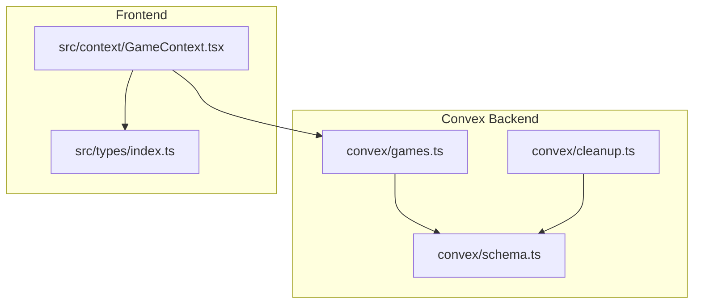
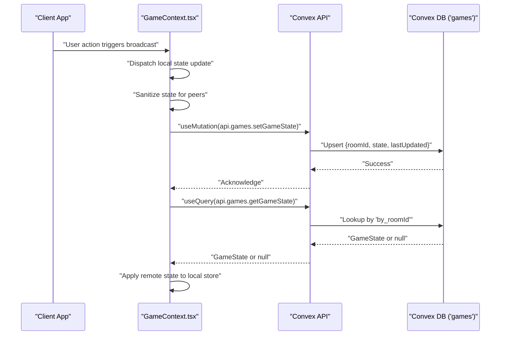
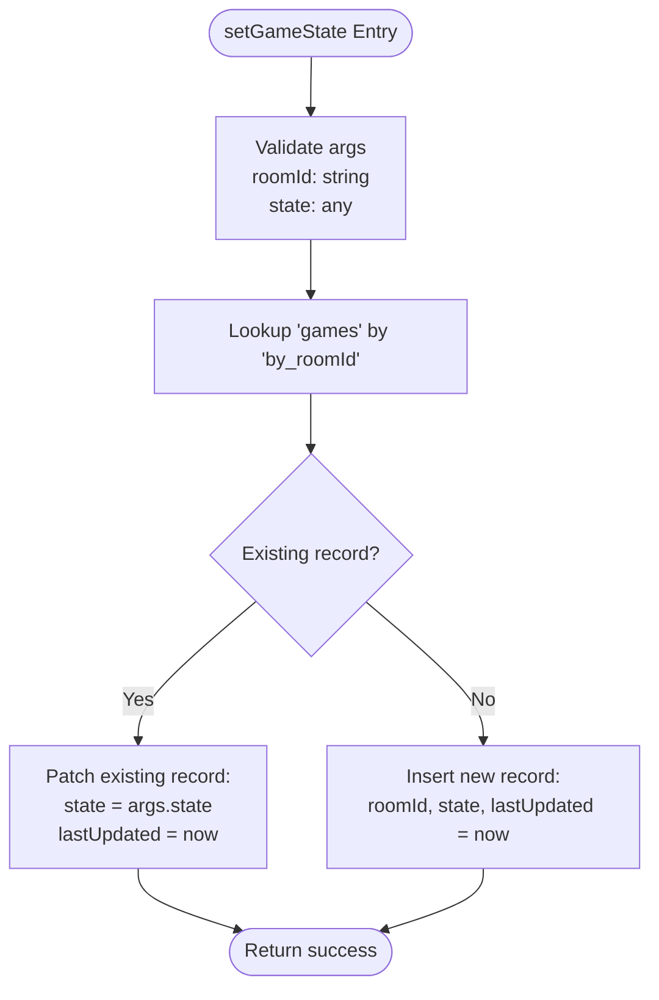
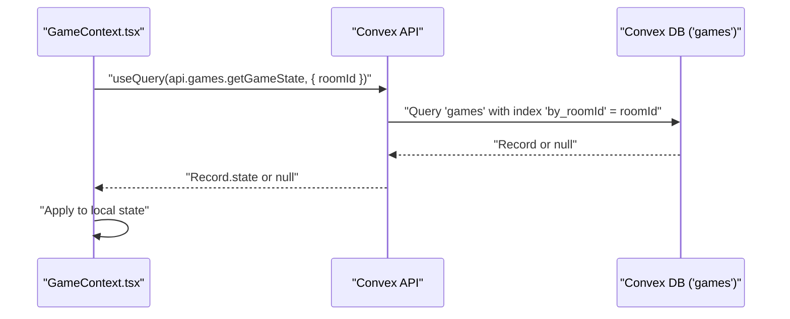
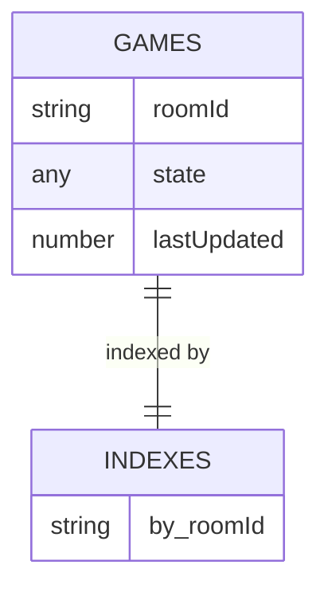
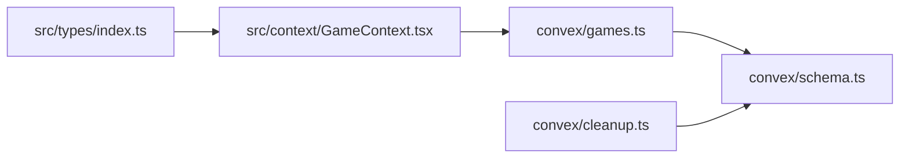

# Games API

<cite>
**Referenced Files in This Document**
- [games.ts](file://convex/games.ts)
- [schema.ts](file://convex/schema.ts)
- [cleanup.ts](file://convex/cleanup.ts)
- [GameContext.tsx](file://src/context/GameContext.tsx)
- [index.ts](file://src/types/index.ts)
</cite>

## Table of Contents
1. [Introduction](#introduction)
2. [Project Structure](#project-structure)
3. [Core Components](#core-components)
4. [Architecture Overview](#architecture-overview)
5. [Detailed Component Analysis](#detailed-component-analysis)
6. [Dependency Analysis](#dependency-analysis)
7. [Performance Considerations](#performance-considerations)
8. [Security Considerations](#security-considerations)
9. [Troubleshooting Guide](#troubleshooting-guide)
10. [Conclusion](#conclusion)

## Introduction
This document provides comprehensive API documentation for the Games module in sen-web, focusing on the setGameState and getGameState functions. These functions are central to real-time game state synchronization across clients using Convex query subscriptions. The documentation explains mutation parameters, data validation, upsert logic, query mechanisms, null fallback behavior, frontend integration patterns, performance considerations, and security implications.

## Project Structure
The Games API spans two primary areas:
- Convex backend (mutations and queries) for state persistence and retrieval
- Frontend React context that orchestrates state updates and subscriptions

**Diagram sources**
- [games.ts](file://convex/games.ts#L1-L43)
- [schema.ts](file://convex/schema.ts#L24-L30)
- [cleanup.ts](file://convex/cleanup.ts#L1-L68)
- [GameContext.tsx](file://src/context/GameContext.tsx#L587-L600)
- [index.ts](file://src/types/index.ts#L37-L79)

**Section sources**
- [games.ts](file://convex/games.ts#L1-L43)
- [schema.ts](file://convex/schema.ts#L24-L30)
- [GameContext.tsx](file://src/context/GameContext.tsx#L587-L600)

## Core Components
- setGameState mutation: Upserts the game state for a given room, updating lastUpdated timestamps and enabling cleanup operations.
- getGameState query: Retrieves the latest game state for a room using an indexed lookup and returns null when no state exists.

Key responsibilities:
- setGameState validates inputs and performs an upsert against the 'games' table using Convex’s typed validation and index-based lookup.
- getGameState uses the 'by_roomId' index to efficiently fetch the state and returns null when no record is present.

**Section sources**
- [games.ts](file://convex/games.ts#L4-L31)
- [games.ts](file://convex/games.ts#L32-L41)
- [schema.ts](file://convex/schema.ts#L24-L30)

## Architecture Overview
The Games API integrates with Convex’s typed schema and React’s Convex hooks to achieve real-time synchronization. Clients subscribe to getGameState and push updates via setGameState. The schema defines the 'games' table and its 'by_roomId' index. A cleanup job removes stale game records based on lastUpdated timestamps.

**Diagram sources**
- [games.ts](file://convex/games.ts#L4-L41)
- [schema.ts](file://convex/schema.ts#L24-L30)
- [GameContext.tsx](file://src/context/GameContext.tsx#L883-L922)
- [GameContext.tsx](file://src/context/GameContext.tsx#L594-L600)

## Detailed Component Analysis

### setGameState Mutation
Purpose:
- Persist or update the game state for a specific room.
- Maintain lastUpdated for cleanup and staleness checks.

Parameters:
- roomId: string (validated via Convex v.string())
- state: any (validated via Convex v.any()) representing GameState

Processing logic:
- Index-based lookup using 'by_roomId'
- If a record exists, patch it with the new state and update lastUpdated
- If no record exists, insert a new record with roomId, state, and lastUpdated
- Returns a success indicator

Data validation:
- Uses Convex typed validation for arguments and table fields.

Upsert behavior:
- Patches existing record if found; otherwise inserts a new record.

Timestamp semantics:
- lastUpdated is set to the current time on each write, enabling cleanup jobs to remove stale entries.

**Diagram sources**
- [games.ts](file://convex/games.ts#L4-L31)

**Section sources**
- [games.ts](file://convex/games.ts#L4-L31)
- [schema.ts](file://convex/schema.ts#L24-L30)

### getGameState Query
Purpose:
- Retrieve the latest game state for a given room.
- Provide null fallback when no state exists.

Mechanism:
- Uses the 'by_roomId' index to fetch the first matching record.
- Returns the state field if present; otherwise returns null.

Frontend integration:
- Used with Convex’s useQuery hook in GameContext.tsx to subscribe to real-time updates.
- The subscription is enabled only when gameMode is online and roomId is set.

**Diagram sources**
- [games.ts](file://convex/games.ts#L32-L41)
- [schema.ts](file://convex/schema.ts#L24-L30)
- [GameContext.tsx](file://src/context/GameContext.tsx#L594-L600)

**Section sources**
- [games.ts](file://convex/games.ts#L32-L41)
- [schema.ts](file://convex/schema.ts#L24-L30)
- [GameContext.tsx](file://src/context/GameContext.tsx#L594-L600)

### Frontend Integration Patterns
- useMutation(api.games.setGameState) is invoked from GameContext.tsx to persist local state changes.
- The provider sanitizes state during syncing to hide temporary peeked cards from opponents.
- Debounced synchronization prevents excessive writes and avoids loops by comparing local, remote, and last-synced states.
- The subscription to getGameState drives continuous updates across clients.

Example invocation locations (paths only):
- [GameContext.tsx](file://src/context/GameContext.tsx#L908-L914)
- [GameContext.tsx](file://src/context/GameContext.tsx#L1091-L1096)

State broadcasting patterns:
- Actions are processed locally via a reducer and then synced remotely using setGameState.
- Sanitization ensures privacy during peeking phases.

**Section sources**
- [GameContext.tsx](file://src/context/GameContext.tsx#L883-L922)
- [GameContext.tsx](file://src/context/GameContext.tsx#L842-L881)
- [GameContext.tsx](file://src/context/GameContext.tsx#L908-L914)
- [GameContext.tsx](file://src/context/GameContext.tsx#L1091-L1096)

### Data Model and Types
GameState structure and related types are defined in the frontend types file. The Convex schema serializes GameState into the 'games' table using v.any() for the state field.

**Diagram sources**
- [schema.ts](file://convex/schema.ts#L24-L30)
- [index.ts](file://src/types/index.ts#L37-L79)

**Section sources**
- [schema.ts](file://convex/schema.ts#L24-L30)
- [index.ts](file://src/types/index.ts#L37-L79)

## Dependency Analysis
- setGameState depends on:
  - Convex typed validation (v.string(), v.any())
  - Index-based lookup on 'games' table
  - Upsert logic (patch or insert)
- getGameState depends on:
  - Index-based lookup on 'games' table
  - Null fallback behavior
- Frontend integration depends on:
  - Convex React hooks (useMutation, useQuery)
  - GameState type definitions
  - Sanitization logic in GameContext.tsx

**Diagram sources**
- [index.ts](file://src/types/index.ts#L37-L79)
- [GameContext.tsx](file://src/context/GameContext.tsx#L587-L600)
- [games.ts](file://convex/games.ts#L1-L43)
- [schema.ts](file://convex/schema.ts#L24-L30)
- [cleanup.ts](file://convex/cleanup.ts#L1-L68)

**Section sources**
- [games.ts](file://convex/games.ts#L1-L43)
- [schema.ts](file://convex/schema.ts#L24-L30)
- [cleanup.ts](file://convex/cleanup.ts#L1-L68)
- [GameContext.tsx](file://src/context/GameContext.tsx#L587-L600)
- [index.ts](file://src/types/index.ts#L37-L79)

## Performance Considerations
- Query indexing:
  - The 'by_roomId' index on the 'games' table enables O(1) lookups for both setGameState and getGameState, minimizing latency and cost.
- Data transfer size:
  - GameState is a complex object; frequent full-state broadcasts increase bandwidth. Consider:
    - Partial state updates where feasible
    - Debouncing and batching to reduce redundant writes
    - Sanitization to avoid leaking sensitive peer information
- Write amplification:
  - Frequent small changes can cause repeated writes. The current debounce and comparison logic mitigate this by avoiding writes when local state equals remote state.
- Cleanup and storage:
  - lastUpdated timestamps enable periodic cleanup of stale game records, preventing unbounded growth of the 'games' table.

[No sources needed since this section provides general guidance]

## Security Considerations
- Allow state updates from any client:
  - setGameState accepts state from any client, which can lead to potential tampering.
  - Game logic validation is enforced client-side before mutation calls. The frontend reducer and sanitization ensure that only valid moves propagate to the server.
- Mitigations:
  - Validate actions before invoking setGameState (client-side)
  - Sanitize state during syncing to hide temporary peeked cards from opponents
  - Use roomId scoping to ensure updates are isolated to the correct room
- Additional hardening ideas (not implemented here):
  - Server-side validation of GameState transitions
  - Mutation signing or authentication to restrict who can write
  - Rate limiting for setGameState calls

**Section sources**
- [GameContext.tsx](file://src/context/GameContext.tsx#L818-L841)
- [GameContext.tsx](file://src/context/GameContext.tsx#L842-L881)
- [games.ts](file://convex/games.ts#L4-L31)

## Troubleshooting Guide
Common issues and remedies:
- No state received:
  - Ensure roomId is set and gameMode is online before subscribing to getGameState.
  - Verify that setGameState is being invoked with the correct roomId.
- Stale or inconsistent state:
  - Confirm that the debounced sync logic is not suppressing necessary updates.
  - Check that lastSyncedStateRef is being updated after successful writes.
- Cleanup removing active games:
  - lastUpdated is used by cleanup jobs. Ensure clients continue to update state regularly to avoid premature deletion.
- Sanitization side effects:
  - During peeking, confirm that sanitized state preserves local peeked cards for the current player while hiding them from opponents.

**Section sources**
- [GameContext.tsx](file://src/context/GameContext.tsx#L883-L922)
- [GameContext.tsx](file://src/context/GameContext.tsx#L842-L881)
- [cleanup.ts](file://convex/cleanup.ts#L1-L68)

## Conclusion
The Games API provides a robust foundation for real-time multiplayer state synchronization. setGameState and getGameState leverage Convex’s typed schema and indexing to deliver efficient, scalable updates. Frontend integration in GameContext.tsx ensures secure, client-side validation and sanitization, while debounced synchronization minimizes network overhead. Proper use of lastUpdated timestamps enables maintenance-free cleanup of stale data.