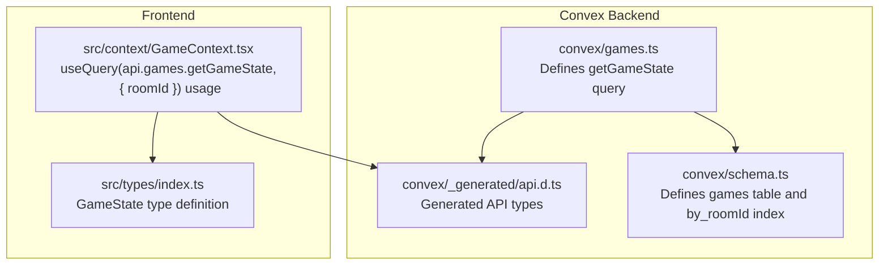
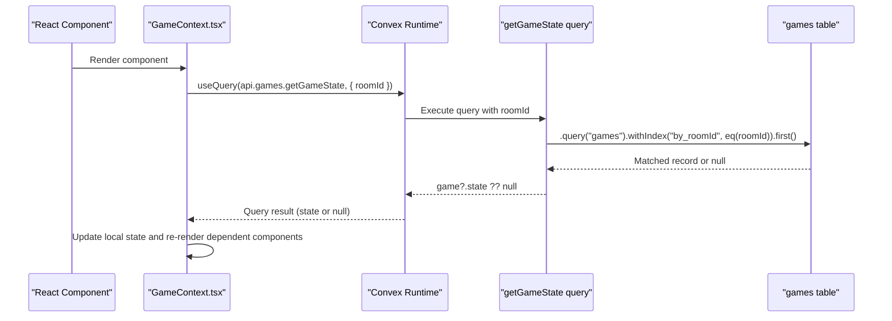
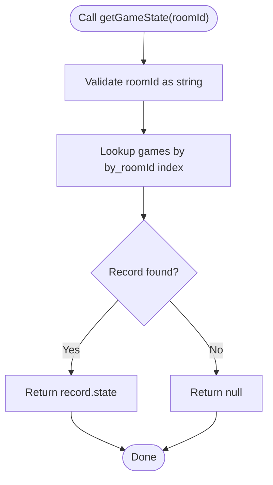
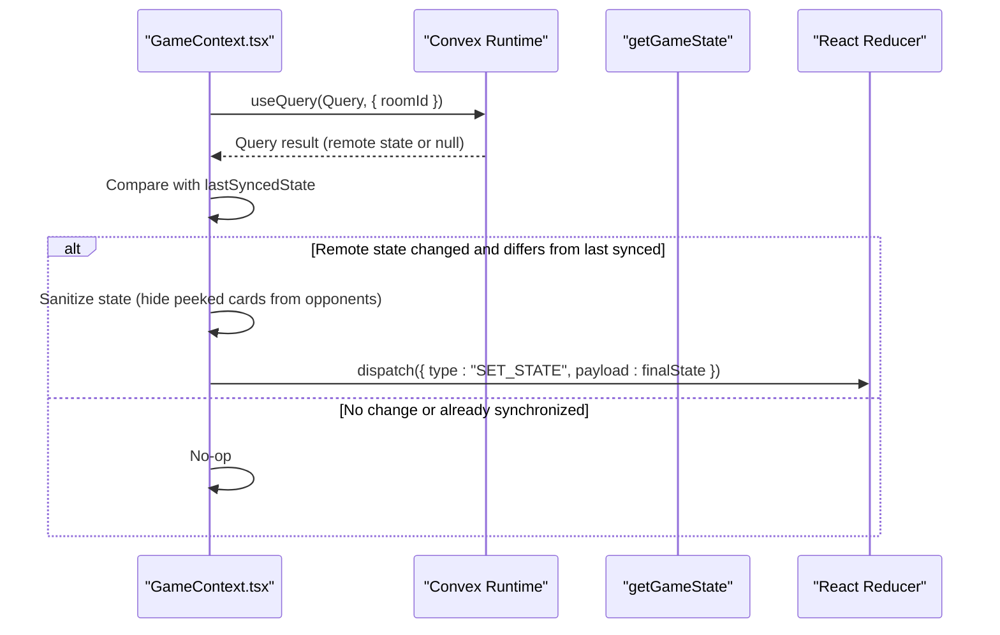
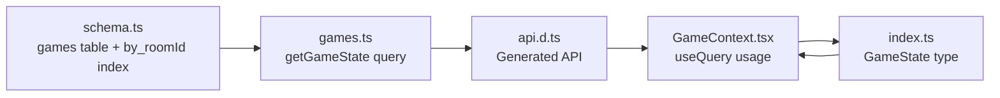

# getGameState Query

<cite>
**Referenced Files in This Document**
- [games.ts](file://convex/games.ts)
- [schema.ts](file://convex/schema.ts)
- [GameContext.tsx](file://src/context/GameContext.tsx)
- [api.d.ts](file://convex/_generated/api.d.ts)
- [index.ts](file://src/types/index.ts)
</cite>

## Table of Contents
1. [Introduction](#introduction)
2. [Project Structure](#project-structure)
3. [Core Components](#core-components)
4. [Architecture Overview](#architecture-overview)
5. [Detailed Component Analysis](#detailed-component-analysis)
6. [Dependency Analysis](#dependency-analysis)
7. [Performance Considerations](#performance-considerations)
8. [Troubleshooting Guide](#troubleshooting-guide)
9. [Conclusion](#conclusion)

## Introduction
This document provides comprehensive API documentation for the getGameState query in sen-web. It explains the query’s purpose as a Convex query function that retrieves the current game state for a given roomId from the games table. It details the single argument roomId (string), validation via v.string(), the query execution using the by_roomId index for efficient lookups, and the return value pattern game?.state ?? null. It also describes how this query integrates with React’s useQuery hook in GameContext.tsx to enable real-time synchronization of game state across clients via Convex subscriptions. Finally, it covers performance considerations, error handling, and edge cases.

## Project Structure
The getGameState query is implemented in the Convex backend module games.ts and is exposed through the generated API surface. The frontend consumes this query via Convex’s React bindings in GameContext.tsx. The schema defines the games table and its by_roomId index, which underpins the query’s performance characteristics.

**Diagram sources**
- [games.ts](file://convex/games.ts#L1-L41)
- [schema.ts](file://convex/schema.ts#L24-L30)
- [api.d.ts](file://convex/_generated/api.d.ts#L11-L23)
- [GameContext.tsx](file://src/context/GameContext.tsx#L594-L600)
- [index.ts](file://src/types/index.ts#L37-L79)

**Section sources**
- [games.ts](file://convex/games.ts#L1-L41)
- [schema.ts](file://convex/schema.ts#L24-L30)
- [api.d.ts](file://convex/_generated/api.d.ts#L11-L23)
- [GameContext.tsx](file://src/context/GameContext.tsx#L594-L600)
- [index.ts](file://src/types/index.ts#L37-L79)

## Core Components
- getGameState query: A Convex query that accepts a roomId string argument, validates it, performs an indexed lookup in the games table, and returns either the state field of the matched record or null.
- games table and by_roomId index: The schema defines the games table with a by_roomId index, enabling O(1) index-only lookups for a given roomId.
- Frontend integration: GameContext.tsx uses useQuery(api.games.getGameState, { roomId }) to subscribe to the remote game state and synchronize it with the local React state machine.

Key implementation references:
- Query definition and handler: [games.ts](file://convex/games.ts#L32-L41)
- Schema index definition: [schema.ts](file://convex/schema.ts#L24-L30)
- Frontend subscription: [GameContext.tsx](file://src/context/GameContext.tsx#L594-L600)

**Section sources**
- [games.ts](file://convex/games.ts#L32-L41)
- [schema.ts](file://convex/schema.ts#L24-L30)
- [GameContext.tsx](file://src/context/GameContext.tsx#L594-L600)

## Architecture Overview
The getGameState query enables real-time client synchronization by bridging the Convex backend and the React frontend. The frontend subscribes to the query result via useQuery, and any changes to the underlying games table trigger re-renders in components that depend on the returned state.

**Diagram sources**
- [games.ts](file://convex/games.ts#L32-L41)
- [schema.ts](file://convex/schema.ts#L24-L30)
- [GameContext.tsx](file://src/context/GameContext.tsx#L594-L600)

## Detailed Component Analysis

### getGameState Query
Purpose:
- Retrieve the current game state for a given roomId from the games table.

Arguments:
- roomId: string validated via v.string().

Execution:
- Uses the by_roomId index to efficiently locate a single record matching the roomId.
- Returns the state field of the matched record if found; otherwise returns null.

Return value pattern:
- game?.state ?? null ensures a clean interface for the frontend by unwrapping the state property or providing a null fallback.

Integration with React:
- GameContext.tsx subscribes to the query result using useQuery(api.games.getGameState, { roomId }), enabling automatic re-renders when the state changes.

Example usage reference:
- Subscription call site: [GameContext.tsx](file://src/context/GameContext.tsx#L594-L600)

**Diagram sources**
- [games.ts](file://convex/games.ts#L32-L41)
- [schema.ts](file://convex/schema.ts#L24-L30)

**Section sources**
- [games.ts](file://convex/games.ts#L32-L41)
- [schema.ts](file://convex/schema.ts#L24-L30)
- [GameContext.tsx](file://src/context/GameContext.tsx#L594-L600)

### Frontend Integration with useQuery
- Subscription: The GameContext.tsx component subscribes to the getGameState query using useQuery(api.games.getGameState, { roomId }) when the game mode is online and a roomId is present.
- Synchronization: The component compares the remote state with the last synced state and dispatches SET_STATE to update the local React state machine, ensuring real-time synchronization across clients.
- Safety checks: The component avoids infinite loops by comparing stringified states and skipping updates when unchanged.

Key references:
- Subscription and conditional skip: [GameContext.tsx](file://src/context/GameContext.tsx#L594-L600)
- Remote state handling and dispatch: [GameContext.tsx](file://src/context/GameContext.tsx#L616-L682)
- State sanitization during peeking: [GameContext.tsx](file://src/context/GameContext.tsx#L634-L674)

**Diagram sources**
- [GameContext.tsx](file://src/context/GameContext.tsx#L594-L682)

**Section sources**
- [GameContext.tsx](file://src/context/GameContext.tsx#L594-L682)

### Data Model and Types
- GameState: The shape of the state object stored in the games table. It includes gameMode, roomId, hostId, players, drawPile, discardPile, currentPlayerIndex, gamePhase, actionMessage, drawSource, roundWinnerName, gameWinnerName, turnCount, chatMessages, lastCallerId, peekingState, drawnCard, tempCards, swapState, lastRoundScores, and lastMove.
- The games table stores roomId, state (serialized GameState), and lastUpdated.

References:
- GameState interface: [index.ts](file://src/types/index.ts#L37-L79)
- games table schema: [schema.ts](file://convex/schema.ts#L24-L30)

**Section sources**
- [index.ts](file://src/types/index.ts#L37-L79)
- [schema.ts](file://convex/schema.ts#L24-L30)

## Dependency Analysis
- getGameState depends on:
  - games table schema with by_roomId index for fast lookups.
  - Generated API surface (api.games.getGameState) for frontend consumption.
- Frontend depends on:
  - useQuery hook to subscribe to the query result.
  - React reducer to manage local state transitions.
  - GameState type for type safety.

**Diagram sources**
- [schema.ts](file://convex/schema.ts#L24-L30)
- [games.ts](file://convex/games.ts#L32-L41)
- [api.d.ts](file://convex/_generated/api.d.ts#L11-L23)
- [GameContext.tsx](file://src/context/GameContext.tsx#L594-L600)
- [index.ts](file://src/types/index.ts#L37-L79)

**Section sources**
- [schema.ts](file://convex/schema.ts#L24-L30)
- [games.ts](file://convex/games.ts#L32-L41)
- [api.d.ts](file://convex/_generated/api.d.ts#L11-L23)
- [GameContext.tsx](file://src/context/GameContext.tsx#L594-L600)
- [index.ts](file://src/types/index.ts#L37-L79)

## Performance Considerations
- Index efficiency:
  - The by_roomId index allows O(1) index-only lookups for getGameState, minimizing database scan overhead.
- Data transfer size:
  - The state is serialized as a single field in the games table. Full state serialization can lead to larger payloads; consider pagination or partial updates if state grows significantly.
- Cacheability:
  - useQuery caches results locally and subscribes to changes. This reduces network usage and improves responsiveness.
- Network and CPU:
  - Frequent state updates can cause repeated re-renders. Debouncing and comparison logic (stringified state) help mitigate unnecessary updates.

[No sources needed since this section provides general guidance]

## Troubleshooting Guide
Common issues and edge cases:
- Missing room:
  - If no record exists for the given roomId, the query returns null. The frontend should handle null gracefully and initialize UI accordingly.
- Stale data:
  - The frontend compares stringified states to avoid applying identical updates. If state appears stale, verify that remoteGameState differs from lastSyncedState and that the comparison logic is functioning.
- Serialization differences:
  - Stringifying GameState for comparisons can mask subtle differences. Ensure deterministic serialization (e.g., stable ordering) to avoid false negatives.
- Presence and reconnection:
  - The GameContext.tsx handles reconnection and presence updates. If a player leaves unexpectedly, the context resets the game state and clears session storage.

References:
- Null handling and re-render logic: [GameContext.tsx](file://src/context/GameContext.tsx#L616-L682)
- Reconnection and presence: [GameContext.tsx](file://src/context/GameContext.tsx#L800-L816)

**Section sources**
- [GameContext.tsx](file://src/context/GameContext.tsx#L616-L682)
- [GameContext.tsx](file://src/context/GameContext.tsx#L800-L816)

## Conclusion
The getGameState query is central to maintaining consistent, real-time game state across clients in sen-web. By leveraging the by_roomId index and returning a clean state or null fallback, it enables efficient and predictable frontend integration via useQuery. Together with the GameContext.tsx synchronization logic, it ensures responsive updates, robust error handling, and a smooth multiplayer experience.

[No sources needed since this section summarizes without analyzing specific files]