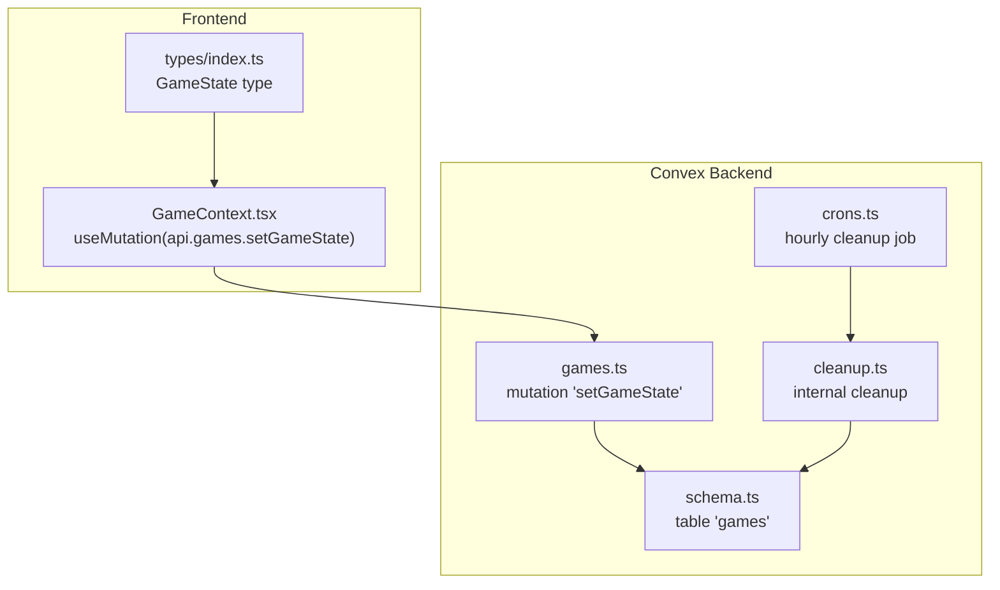
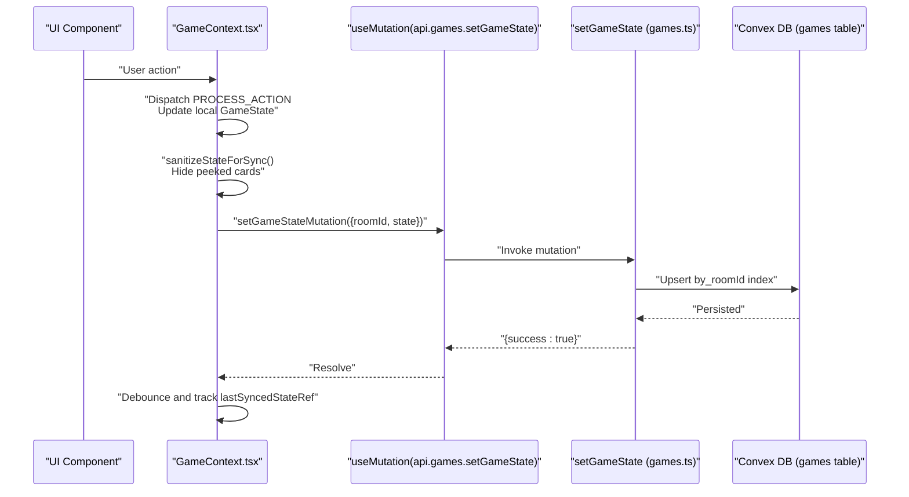
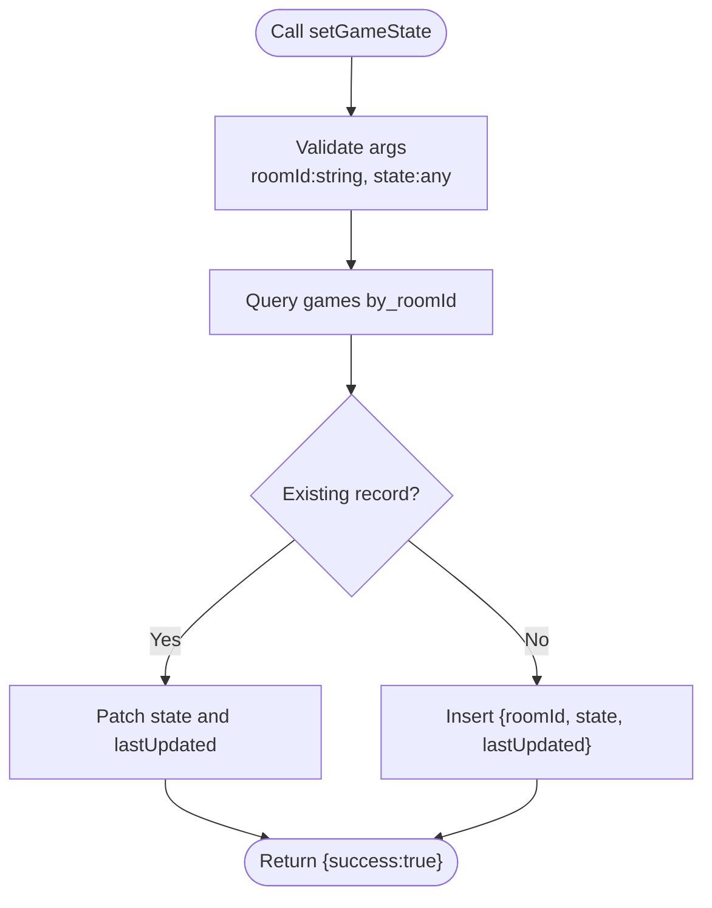
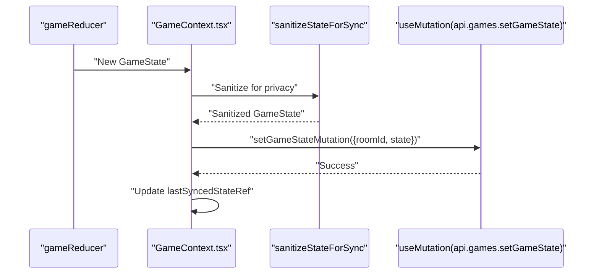
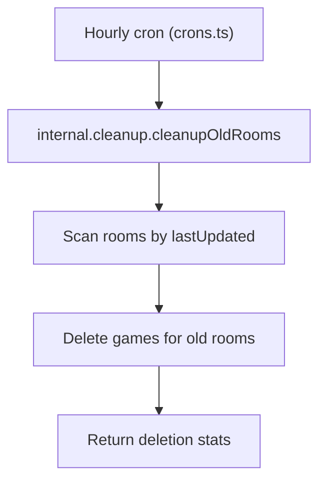
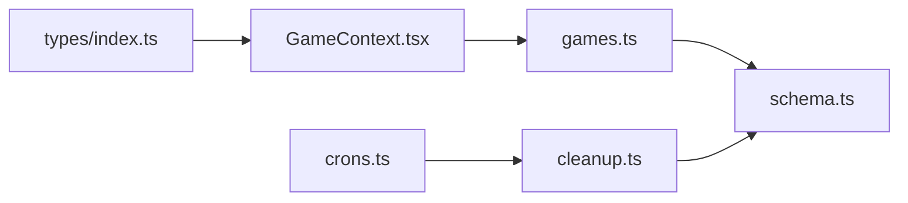

# setGameState Mutation

<cite>
**Referenced Files in This Document**
- [games.ts](file://convex/games.ts)
- [schema.ts](file://convex/schema.ts)
- [GameContext.tsx](file://src/context/GameContext.tsx)
- [index.ts](file://src/types/index.ts)
- [crons.ts](file://convex/crons.ts)
- [cleanup.ts](file://convex/cleanup.ts)
</cite>

## Table of Contents
1. [Introduction](#introduction)
2. [Project Structure](#project-structure)
3. [Core Components](#core-components)
4. [Architecture Overview](#architecture-overview)
5. [Detailed Component Analysis](#detailed-component-analysis)
6. [Dependency Analysis](#dependency-analysis)
7. [Performance Considerations](#performance-considerations)
8. [Troubleshooting Guide](#troubleshooting-guide)
9. [Conclusion](#conclusion)

## Introduction
This document provides comprehensive API documentation for the Convex mutation setGameState in sen-web. The mutation persists the current game state to the backend database and powers real-time synchronization across clients. It accepts a roomId and a state payload, validates arguments using Convex’s type system, and performs an upsert operation against the games table. The mutation integrates tightly with the frontend GameContext, which orchestrates local state updates and broadcasts actions that eventually trigger state persistence.

## Project Structure
The setGameState mutation resides in the Convex backend module and is consumed by the React frontend via Convex hooks. The GameState type definition lives in the frontend types module. Cleanup logic relies on the lastUpdated timestamp to identify stale game records.

**Diagram sources**
- [games.ts](file://convex/games.ts#L1-L41)
- [schema.ts](file://convex/schema.ts#L24-L29)
- [crons.ts](file://convex/crons.ts#L1-L17)
- [cleanup.ts](file://convex/cleanup.ts#L1-L68)
- [GameContext.tsx](file://src/context/GameContext.tsx#L883-L922)
- [index.ts](file://src/types/index.ts#L37-L79)

**Section sources**
- [games.ts](file://convex/games.ts#L1-L41)
- [schema.ts](file://convex/schema.ts#L24-L29)
- [GameContext.tsx](file://src/context/GameContext.tsx#L883-L922)
- [index.ts](file://src/types/index.ts#L37-L79)
- [crons.ts](file://convex/crons.ts#L1-L17)
- [cleanup.ts](file://convex/cleanup.ts#L1-L68)

## Core Components
- Convex mutation setGameState
  - Arguments: roomId (string), state (any)
  - Behavior: Upsert into the games table using by_roomId index
  - Returns: success indicator
- Frontend integration
  - useMutation(api.games.setGameState) invoked after local state updates
  - Sanitization of GameState before syncing to hide peeked cards from opponents
  - Debounced synchronization to reduce write frequency
- Backend schema
  - games table with fields: roomId, state (any), lastUpdated
  - Index by_roomId for efficient lookups
- Cleanup
  - Hourly cron triggers internal cleanup to delete abandoned game records

**Section sources**
- [games.ts](file://convex/games.ts#L1-L41)
- [schema.ts](file://convex/schema.ts#L24-L29)
- [GameContext.tsx](file://src/context/GameContext.tsx#L883-L922)
- [crons.ts](file://convex/crons.ts#L1-L17)
- [cleanup.ts](file://convex/cleanup.ts#L1-L68)

## Architecture Overview
The mutation acts as the central persistence point for online games. The frontend reducer computes the next GameState, sanitizes it for privacy, and invokes the mutation. The backend stores the serialized GameState and timestamps it. Other clients subscribe to getGameState and reconcile differences to maintain consistency.

**Diagram sources**
- [GameContext.tsx](file://src/context/GameContext.tsx#L817-L922)
- [games.ts](file://convex/games.ts#L1-L41)
- [schema.ts](file://convex/schema.ts#L24-L29)

## Detailed Component Analysis

### Convex Mutation: setGameState
- Purpose: Persist the current GameState to the backend for multiplayer synchronization.
- Signature and validation:
  - roomId: string validated with v.string()
  - state: any validated with v.any() to accept the complex GameState object
- Handler logic:
  - Queries the games table using by_roomId index to locate an existing record.
  - If found, patches the record with the new state and updates lastUpdated.
  - If not found, inserts a new record with roomId, state, and lastUpdated.
  - Returns a simple success response.
- Why v.any():
  - GameState is a complex nested object with arrays, enums, optional fields, and derived metadata. Using v.any() avoids strict schema validation at the mutation boundary, enabling seamless persistence of the entire GameState object. This trades explicit type safety for flexibility and simplicity in development and reduces friction when evolving the GameState shape.

**Diagram sources**
- [games.ts](file://convex/games.ts#L1-L41)
- [schema.ts](file://convex/schema.ts#L24-L29)

**Section sources**
- [games.ts](file://convex/games.ts#L1-L41)
- [schema.ts](file://convex/schema.ts#L24-L29)
- [index.ts](file://src/types/index.ts#L37-L79)

### Frontend Integration: GameContext.tsx
- Invocation pattern:
  - After local state updates (including after dispatching PROCESS_ACTION), the frontend debounces and calls setGameStateMutation with sanitized state.
  - Example invocation sites:
    - After starting a new round or initial game setup
    - After player joins and lobby state is updated
- Sanitization:
  - During the peeking phase, the frontend hides temporary peeked cards from opponents when syncing to prevent cheating.
  - The sanitized state is compared against lastSyncedStateRef and remoteGameState to avoid redundant writes.
- Debounce:
  - A short timeout prevents excessive writes during rapid UI updates.

**Diagram sources**
- [GameContext.tsx](file://src/context/GameContext.tsx#L817-L922)

**Section sources**
- [GameContext.tsx](file://src/context/GameContext.tsx#L817-L922)
- [GameContext.tsx](file://src/context/GameContext.tsx#L1080-L1097)
- [GameContext.tsx](file://src/context/GameContext.tsx#L762-L767)

### Cleanup and Automatic Expiration
- The cleanup job runs hourly and deletes rooms, players, messages, and game states for rooms inactive beyond a threshold.
- The games table’s lastUpdated field is used to detect stale game records.
- This design ensures that abandoned games are removed automatically, preventing storage bloat.

**Diagram sources**
- [crons.ts](file://convex/crons.ts#L1-L17)
- [cleanup.ts](file://convex/cleanup.ts#L1-L68)
- [schema.ts](file://convex/schema.ts#L24-L29)

**Section sources**
- [crons.ts](file://convex/crons.ts#L1-L17)
- [cleanup.ts](file://convex/cleanup.ts#L1-L68)
- [schema.ts](file://convex/schema.ts#L24-L29)

## Dependency Analysis
- Backend dependencies:
  - games.ts depends on Convex schema for the games table and uses the by_roomId index.
  - cleanup.ts depends on the games table to remove stale entries.
- Frontend dependencies:
  - GameContext.tsx depends on GameState type definitions and Convex hooks.
  - The mutation is invoked via useMutation(api.games.setGameState).

**Diagram sources**
- [index.ts](file://src/types/index.ts#L37-L79)
- [GameContext.tsx](file://src/context/GameContext.tsx#L883-L922)
- [games.ts](file://convex/games.ts#L1-L41)
- [schema.ts](file://convex/schema.ts#L24-L29)
- [crons.ts](file://convex/crons.ts#L1-L17)
- [cleanup.ts](file://convex/cleanup.ts#L1-L68)

**Section sources**
- [games.ts](file://convex/games.ts#L1-L41)
- [schema.ts](file://convex/schema.ts#L24-L29)
- [GameContext.tsx](file://src/context/GameContext.tsx#L883-L922)
- [index.ts](file://src/types/index.ts#L37-L79)
- [crons.ts](file://convex/crons.ts#L1-L17)
- [cleanup.ts](file://convex/cleanup.ts#L1-L68)

## Performance Considerations
- Write amplification:
  - Frequent local state updates can cause many setGameState calls. The frontend debounces writes and compares sanitized state to lastSyncedStateRef and remoteGameState to minimize redundant writes.
- Payload size:
  - GameState is a large, nested object. Persisting the entire object increases write volume. Consider partitioning or diffing strategies if performance becomes a bottleneck.
- Index usage:
  - The by_roomId index ensures efficient upsert lookups. Ensure this index remains aligned with the roomId field.
- Cleanup cadence:
  - Hourly cleanup helps reclaim storage. Tune the cleanup threshold if needed for your deployment.

[No sources needed since this section provides general guidance]

## Troubleshooting Guide
- Mutation fails to persist:
  - Verify that roomId is present and valid before invoking the mutation.
  - Confirm that the state object is serializable and does not contain cyclic references.
- Stale state across clients:
  - Ensure remoteGameState subscription is active and that the frontend reconciles differences using lastSyncedStateRef.
- Privacy concerns during peeking:
  - Confirm sanitizeStateForSync is applied before syncing to hide temporary peeked cards from opponents.
- Cleanup removes active games:
  - Adjust the cleanup threshold or ensure lastUpdated is refreshed by periodic client activity.

**Section sources**
- [GameContext.tsx](file://src/context/GameContext.tsx#L883-L922)
- [games.ts](file://convex/games.ts#L1-L41)
- [schema.ts](file://convex/schema.ts#L24-L29)

## Conclusion
The setGameState mutation is the backbone of real-time multiplayer persistence in sen-web. It accepts a flexible state payload, upserts efficiently using an indexed lookup, and integrates seamlessly with the frontend’s reducer and sanitization pipeline. While v.any() reduces type safety at the boundary, it enables straightforward persistence of the complex GameState structure. Together with hourly cleanup, this design balances simplicity, scalability, and correctness for online gameplay.