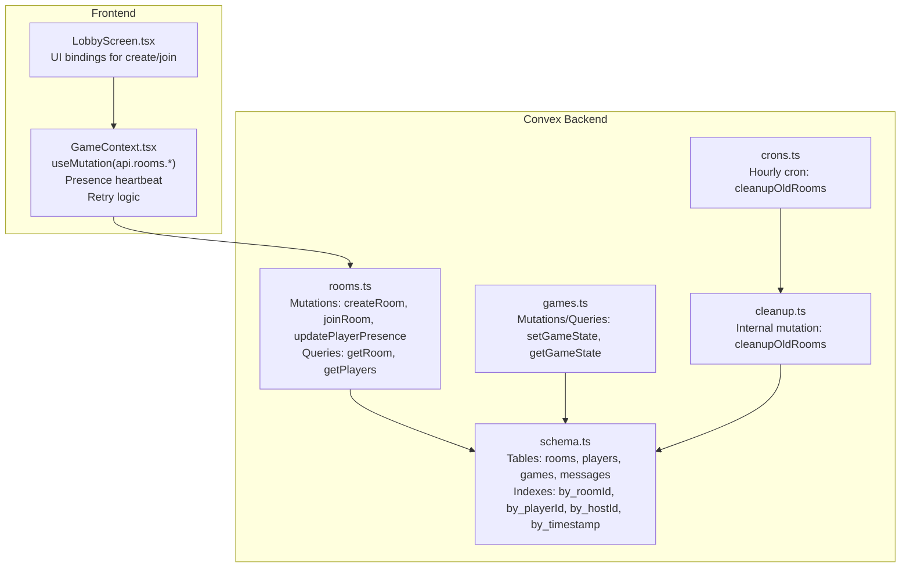
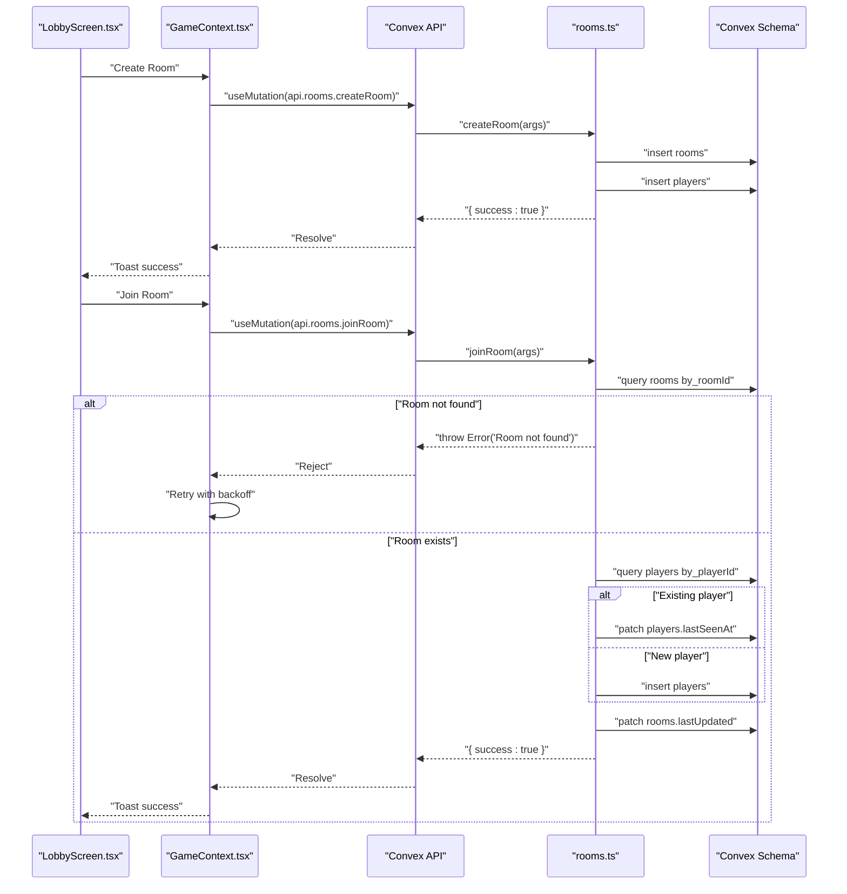
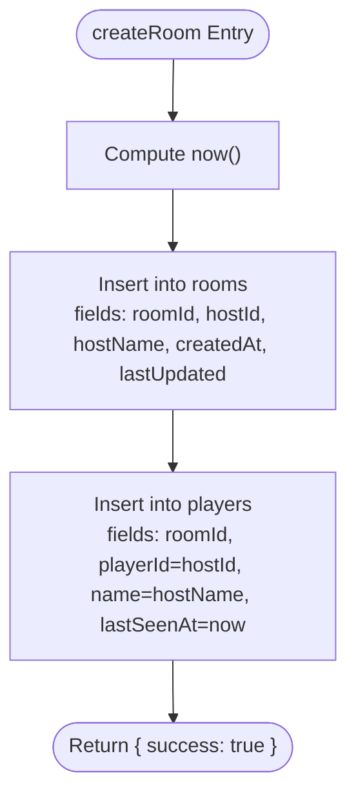
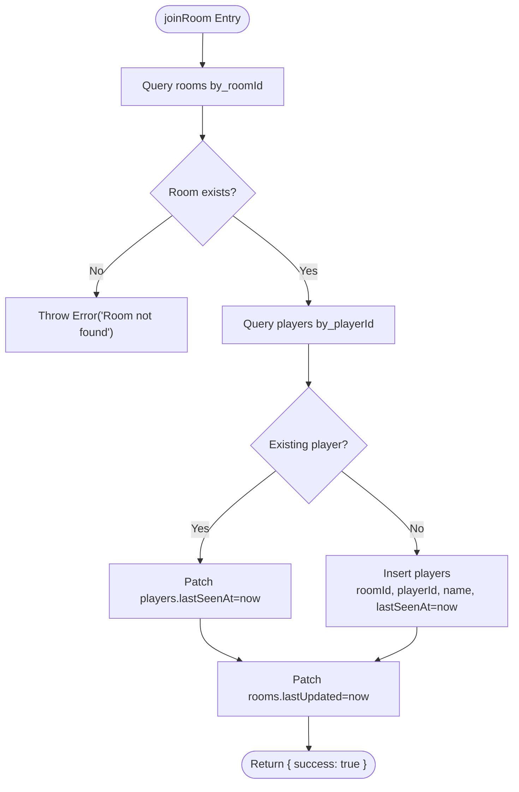
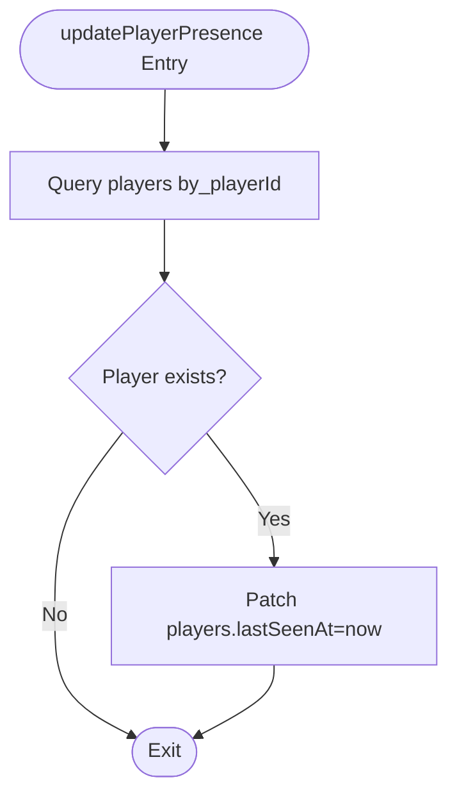
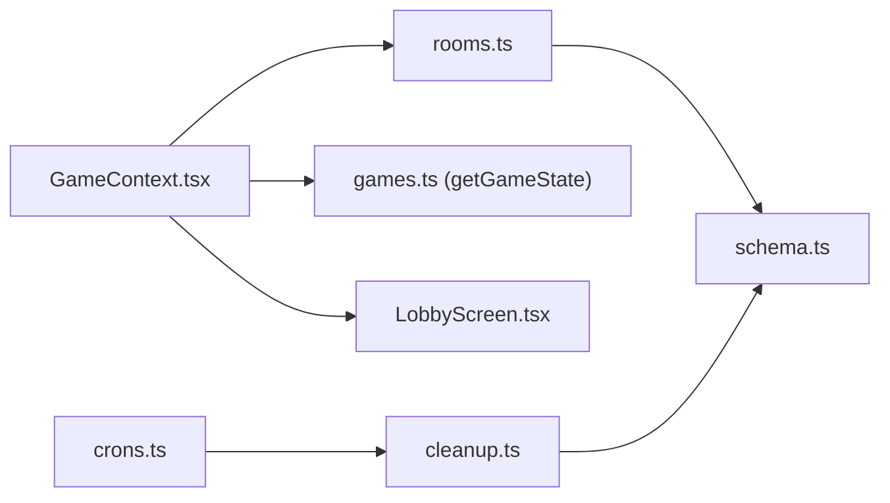

# Rooms API

<cite>
**Referenced Files in This Document**
- [rooms.ts](file://convex/rooms.ts)
- [schema.ts](file://convex/schema.ts)
- [cleanup.ts](file://convex/cleanup.ts)
- [crons.ts](file://convex/crons.ts)
- [games.ts](file://convex/games.ts)
- [GameContext.tsx](file://src/context/GameContext.tsx)
- [LobbyScreen.tsx](file://src/components/LobbyScreen.tsx)
</cite>

## Table of Contents
1. [Introduction](#introduction)
2. [Project Structure](#project-structure)
3. [Core Components](#core-components)
4. [Architecture Overview](#architecture-overview)
5. [Detailed Component Analysis](#detailed-component-analysis)
6. [Dependency Analysis](#dependency-analysis)
7. [Performance Considerations](#performance-considerations)
8. [Troubleshooting Guide](#troubleshooting-guide)
9. [Conclusion](#conclusion)

## Introduction
This document provides a comprehensive guide to the Rooms API module responsible for multiplayer room management in sen-web. It focuses on three mutations: createRoom, joinRoom, and updatePlayerPresence. It explains their parameters, business logic, database interactions, and how the frontend integrates them. It also covers presence tracking, retry mechanisms, scalability considerations, and data integrity enforced by Convex constraints.

## Project Structure
The Rooms API is implemented in Convex with a schema defining two primary tables: rooms and players. The GameContext frontend orchestrates room creation and joining, manages presence updates, and handles reconnection and retry logic. A periodic cleanup job removes abandoned rooms and their associated data.

**Diagram sources**
- [rooms.ts](file://convex/rooms.ts#L1-L119)
- [schema.ts](file://convex/schema.ts#L1-L42)
- [cleanup.ts](file://convex/cleanup.ts#L1-L68)
- [crons.ts](file://convex/crons.ts#L1-L15)
- [games.ts](file://convex/games.ts#L1-L43)
- [GameContext.tsx](file://src/context/GameContext.tsx#L587-L816)
- [LobbyScreen.tsx](file://src/components/LobbyScreen.tsx#L28-L73)

**Section sources**
- [rooms.ts](file://convex/rooms.ts#L1-L119)
- [schema.ts](file://convex/schema.ts#L1-L42)
- [cleanup.ts](file://convex/cleanup.ts#L1-L68)
- [crons.ts](file://convex/crons.ts#L1-L15)
- [games.ts](file://convex/games.ts#L1-L43)
- [GameContext.tsx](file://src/context/GameContext.tsx#L587-L816)
- [LobbyScreen.tsx](file://src/components/LobbyScreen.tsx#L28-L73)

## Core Components
- createRoom: Creates a room and initializes the host as the first player. It inserts records into rooms and players and sets timestamps.
- joinRoom: Validates room existence, checks for existing player identity, updates presence, and refreshes room timestamps. Throws a specific error when the room does not exist.
- updatePlayerPresence: Heartbeat mutation that updates a player’s lastSeenAt timestamp.
- Presence monitoring: Frontend detects active players based on lastSeenAt and triggers UI reactions (join/leave events).
- Retry mechanism: Frontend retries joining with backoff when encountering “Room not found”.
- Cleanup: Periodic internal mutation removes old/abandoned rooms and associated data.

**Section sources**
- [rooms.ts](file://convex/rooms.ts#L1-L119)
- [schema.ts](file://convex/schema.ts#L1-L42)
- [cleanup.ts](file://convex/cleanup.ts#L1-L68)
- [crons.ts](file://convex/crons.ts#L1-L15)
- [GameContext.tsx](file://src/context/GameContext.tsx#L698-L834)
- [LobbyScreen.tsx](file://src/components/LobbyScreen.tsx#L28-L73)

## Architecture Overview
The Rooms API sits at the intersection of frontend state management and backend persistence. The frontend uses Convex React hooks to call mutations and queries. The backend enforces data integrity via schema indexes and constraints. A cron job periodically cleans up stale rooms.

**Diagram sources**
- [rooms.ts](file://convex/rooms.ts#L1-L119)
- [schema.ts](file://convex/schema.ts#L1-L42)
- [GameContext.tsx](file://src/context/GameContext.tsx#L955-L1059)
- [LobbyScreen.tsx](file://src/components/LobbyScreen.tsx#L28-L73)

## Detailed Component Analysis

### createRoom
- Purpose: Create a new room and register the host as the first player.
- Parameters:
  - roomId: string
  - hostId: string
  - hostName: string
- Business logic:
  - Compute current timestamp.
  - Insert a new room record with timestamps.
  - Insert the host as a player with lastSeenAt set to current time.
- Database interactions:
  - Insert into rooms table.
  - Insert into players table.
- Timestamps:
  - createdAt and lastUpdated are set to the same timestamp for the room.
  - lastSeenAt is set for the host player.

**Diagram sources**
- [rooms.ts](file://convex/rooms.ts#L1-L28)
- [schema.ts](file://convex/schema.ts#L1-L42)

**Section sources**
- [rooms.ts](file://convex/rooms.ts#L1-L28)
- [schema.ts](file://convex/schema.ts#L1-L42)

### joinRoom
- Purpose: Add a player to an existing room or update an existing player’s presence.
- Parameters:
  - roomId: string
  - playerId: string
  - name: string
- Business logic:
  - Verify room existence using by_roomId index.
  - If room does not exist, throw an error indicating “Room not found”.
  - Check if a player with the given playerId already exists using by_playerId index.
  - If existing player: update lastSeenAt.
  - Else: insert a new player record.
  - Update room lastUpdated to the current timestamp.
- Database interactions:
  - Query rooms by by_roomId.
  - Query players by by_playerId.
  - Patch or insert into players.
  - Patch rooms.lastUpdated.
- Error handling:
  - Throws a specific error when the room is missing.

**Diagram sources**
- [rooms.ts](file://convex/rooms.ts#L30-L76)
- [schema.ts](file://convex/schema.ts#L1-L42)

**Section sources**
- [rooms.ts](file://convex/rooms.ts#L30-L76)
- [schema.ts](file://convex/schema.ts#L1-L42)

### updatePlayerPresence
- Purpose: Heartbeat to mark a player as active.
- Parameters:
  - roomId: string
  - playerId: string
- Business logic:
  - Query player by by_playerId.
  - If player exists, update lastSeenAt to current timestamp.
- Database interactions:
  - Query players by by_playerId.
  - Patch players.lastSeenAt.

**Diagram sources**
- [rooms.ts](file://convex/rooms.ts#L100-L119)
- [schema.ts](file://convex/schema.ts#L1-L42)

**Section sources**
- [rooms.ts](file://convex/rooms.ts#L100-L119)
- [schema.ts](file://convex/schema.ts#L1-L42)

### Frontend Integration and Usage
- createRoom usage:
  - Generates roomId and playerId.
  - Calls useMutation(api.rooms.createRoom) with roomId, hostId, hostName.
  - Stores identifiers in session storage and updates local state.
  - Example path: [GameContext.tsx](file://src/context/GameContext.tsx#L955-L994)
- joinRoom usage:
  - Generates a new playerId for joining players.
  - Calls useMutation(api.rooms.joinRoom) with roomId, playerId, name.
  - Implements retry logic with backoff when encountering “Room not found”.
  - Example path: [GameContext.tsx](file://src/context/GameContext.tsx#L998-L1059)
- Presence heartbeat:
  - Periodically calls updatePlayerPresence every 10 seconds.
  - Example path: [GameContext.tsx](file://src/context/GameContext.tsx#L782-L791)
- Presence monitoring:
  - Filters players whose lastSeenAt is within 30 seconds for active presence.
  - Detects leaving players with a 60-second threshold during gameplay.
  - Example path: [GameContext.tsx](file://src/context/GameContext.tsx#L698-L719)
- UI binding:
  - Buttons and forms trigger createRoom and joinRoom flows.
  - Example path: [LobbyScreen.tsx](file://src/components/LobbyScreen.tsx#L28-L73)

**Section sources**
- [GameContext.tsx](file://src/context/GameContext.tsx#L587-L816)
- [LobbyScreen.tsx](file://src/components/LobbyScreen.tsx#L28-L73)

## Dependency Analysis
- Rooms API depends on:
  - Convex schema indexes for efficient room and player lookups.
  - Cron jobs invoking cleanupOldRooms to remove stale rooms.
  - Games API for state synchronization (not part of this document’s scope).
- Frontend depends on:
  - Convex React hooks for mutations and queries.
  - GameContext orchestration for state transitions and presence.

**Diagram sources**
- [rooms.ts](file://convex/rooms.ts#L1-L119)
- [schema.ts](file://convex/schema.ts#L1-L42)
- [cleanup.ts](file://convex/cleanup.ts#L1-L68)
- [crons.ts](file://convex/crons.ts#L1-L15)
- [games.ts](file://convex/games.ts#L1-L43)
- [GameContext.tsx](file://src/context/GameContext.tsx#L587-L816)
- [LobbyScreen.tsx](file://src/components/LobbyScreen.tsx#L28-L73)

**Section sources**
- [rooms.ts](file://convex/rooms.ts#L1-L119)
- [schema.ts](file://convex/schema.ts#L1-L42)
- [cleanup.ts](file://convex/cleanup.ts#L1-L68)
- [crons.ts](file://convex/crons.ts#L1-L15)
- [games.ts](file://convex/games.ts#L1-L43)
- [GameContext.tsx](file://src/context/GameContext.tsx#L587-L816)
- [LobbyScreen.tsx](file://src/components/LobbyScreen.tsx#L28-L73)

## Performance Considerations
- Indexing:
  - by_roomId on rooms and players enables O(1) lookups for room and player queries.
  - by_playerId on players allows quick presence updates.
- Heartbeat cadence:
  - Frontend updates presence every 10 seconds, balancing accuracy with network overhead.
- Cleanup cadence:
  - Hourly cleanup reduces orphaned data growth and keeps the database lean.
- Scalability:
  - Room and player tables are indexed by roomId and playerId respectively, supporting horizontal scaling patterns.
  - Consider partitioning or sharding strategies if room counts grow significantly.

**Section sources**
- [schema.ts](file://convex/schema.ts#L1-L42)
- [cleanup.ts](file://convex/cleanup.ts#L1-L68)
- [crons.ts](file://convex/crons.ts#L1-L15)
- [GameContext.tsx](file://src/context/GameContext.tsx#L782-L791)

## Troubleshooting Guide
- “Room not found” during join:
  - Cause: joinRoom throws this error when the room does not exist.
  - Frontend behavior: Retry logic attempts up to five times with a short delay between attempts.
  - Example path: [GameContext.tsx](file://src/context/GameContext.tsx#L1002-L1059)
- Player appears offline unexpectedly:
  - Cause: lastSeenAt older than 30 seconds.
  - Frontend behavior: Presence filtering excludes inactive players.
  - Example path: [GameContext.tsx](file://src/context/GameContext.tsx#L698-L719)
- Opponent leaves during gameplay:
  - Detection: Long timeout threshold (60 seconds) used to confirm departure.
  - Frontend behavior: Resets lobby state and clears session storage.
  - Example path: [GameContext.tsx](file://src/context/GameContext.tsx#L711-L722)
- Reconnection:
  - Frontend attempts to reconnect using stored identifiers and retries joinRoom if needed.
  - Example path: [GameContext.tsx](file://src/context/GameContext.tsx#L800-L816)

**Section sources**
- [rooms.ts](file://convex/rooms.ts#L43-L45)
- [GameContext.tsx](file://src/context/GameContext.tsx#L698-L816)

## Conclusion
The Rooms API provides robust room lifecycle management with clear separation of concerns between creation, joining, and presence tracking. The backend enforces data integrity via schema indexes and constraints, while the frontend implements resilient retry logic and heartbeat-based presence monitoring. Together, these components support scalable multiplayer gameplay with predictable behavior and graceful error handling.