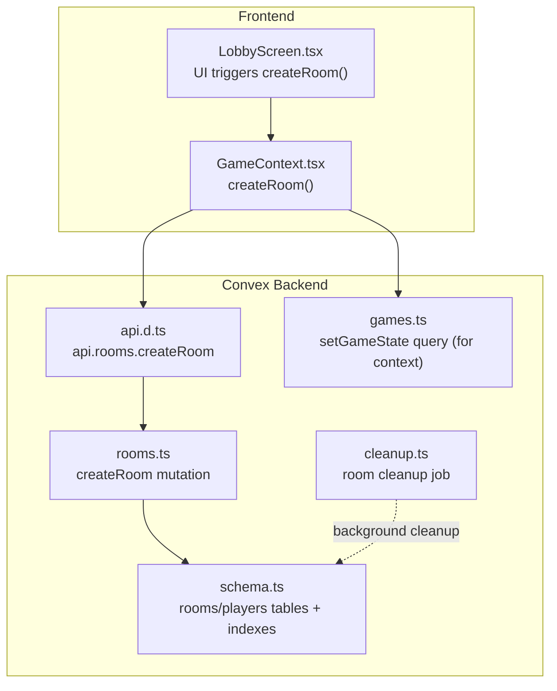
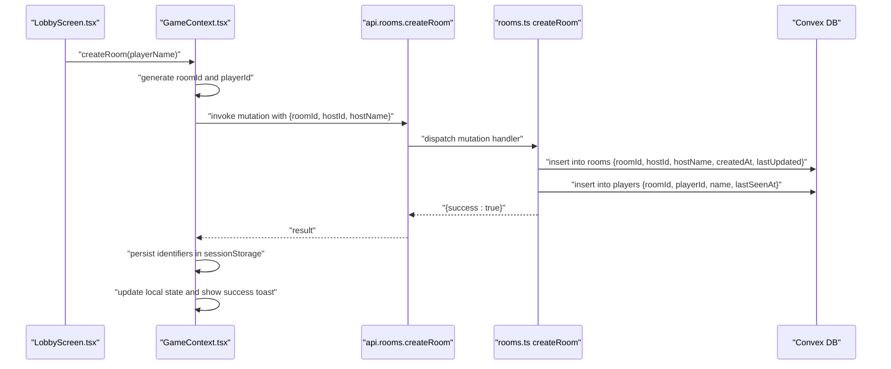
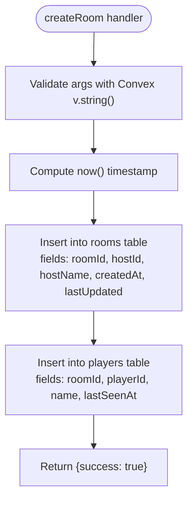
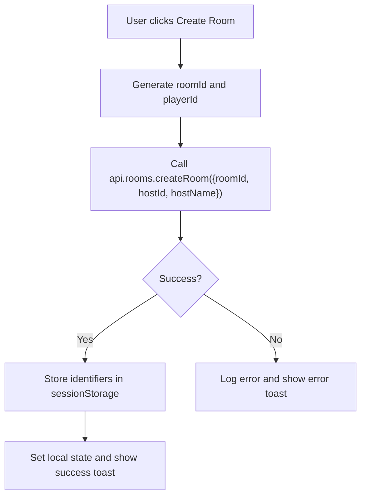
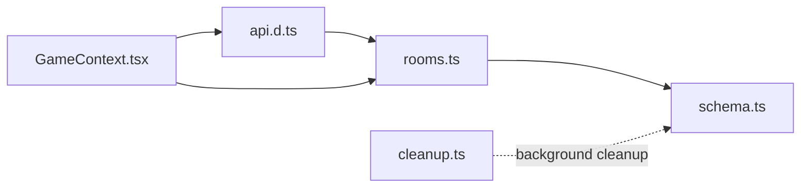

# createRoom Mutation

<cite>
**Referenced Files in This Document**
- [rooms.ts](file://convex/rooms.ts)
- [schema.ts](file://convex/schema.ts)
- [GameContext.tsx](file://src/context/GameContext.tsx)
- [LobbyScreen.tsx](file://src/components/LobbyScreen.tsx)
- [api.d.ts](file://convex/_generated/api.d.ts)
- [games.ts](file://convex/games.ts)
- [cleanup.ts](file://convex/cleanup.ts)
</cite>

## Table of Contents
1. [Introduction](#introduction)
2. [Project Structure](#project-structure)
3. [Core Components](#core-components)
4. [Architecture Overview](#architecture-overview)
5. [Detailed Component Analysis](#detailed-component-analysis)
6. [Dependency Analysis](#dependency-analysis)
7. [Performance Considerations](#performance-considerations)
8. [Troubleshooting Guide](#troubleshooting-guide)
9. [Conclusion](#conclusion)

## Introduction
This document explains the createRoom mutation in the Rooms API, detailing how the frontend generates identifiers, how the backend validates and persists data, and how the system maintains data integrity. It also covers frontend usage patterns, error handling, and operational considerations such as indexing, race conditions, and debugging.

## Project Structure
The createRoom flow spans the frontend GameContext and the backend Convex module for rooms, with supporting schema and generated API types.

**Diagram sources**
- [GameContext.tsx](file://src/context/GameContext.tsx#L587-L600)
- [LobbyScreen.tsx](file://src/components/LobbyScreen.tsx#L41-L73)
- [api.d.ts](file://convex/_generated/api.d.ts#L11-L42)
- [rooms.ts](file://convex/rooms.ts#L1-L28)
- [schema.ts](file://convex/schema.ts#L1-L42)
- [games.ts](file://convex/games.ts#L1-L41)
- [cleanup.ts](file://convex/cleanup.ts#L1-L41)

**Section sources**
- [rooms.ts](file://convex/rooms.ts#L1-L28)
- [schema.ts](file://convex/schema.ts#L1-L42)
- [GameContext.tsx](file://src/context/GameContext.tsx#L587-L600)
- [LobbyScreen.tsx](file://src/components/LobbyScreen.tsx#L41-L73)
- [api.d.ts](file://convex/_generated/api.d.ts#L11-L42)

## Core Components
- Frontend identifier generation and mutation invocation:
  - The frontend generates a room identifier and a player identifier, then calls the createRoom mutation with these values.
  - On success, it stores identifiers in session storage, sets local state, and displays a success toast.
- Backend validation and persistence:
  - The backend mutation accepts roomId, hostId, and hostName with Convex value validation.
  - It inserts a record into the rooms table and adds the host as the first player in the players table.
  - Both inserts initialize createdAt and lastUpdated timestamps.
- Schema and indexes:
  - The rooms table is indexed by roomId and hostId.
  - The players table is indexed by roomId and playerId.
  - These indexes enable efficient lookups for joinRoom and presence updates.

**Section sources**
- [GameContext.tsx](file://src/context/GameContext.tsx#L955-L1000)
- [rooms.ts](file://convex/rooms.ts#L1-L28)
- [schema.ts](file://convex/schema.ts#L1-L42)

## Architecture Overview
The createRoom flow connects UI actions to Convex mutations and database writes.

**Diagram sources**
- [LobbyScreen.tsx](file://src/components/LobbyScreen.tsx#L41-L73)
- [GameContext.tsx](file://src/context/GameContext.tsx#L955-L1000)
- [api.d.ts](file://convex/_generated/api.d.ts#L11-L42)
- [rooms.ts](file://convex/rooms.ts#L1-L28)

## Detailed Component Analysis

### Backend: createRoom Mutation
- Parameter validation:
  - Uses Convex value validators for string arguments: roomId, hostId, hostName.
- Persistence:
  - Inserts a row into the rooms table with timestamps createdAt and lastUpdated.
  - Inserts a row into the players table representing the host as the first player.
- Return value:
  - Returns a simple success object.

**Diagram sources**
- [rooms.ts](file://convex/rooms.ts#L1-L28)

**Section sources**
- [rooms.ts](file://convex/rooms.ts#L1-L28)

### Frontend: GameContext Integration
- Identifier generation:
  - Generates a room identifier and a player identifier before invoking the mutation.
- Invocation and error handling:
  - Calls the mutation with the generated identifiers and player name.
  - On success, stores identifiers in session storage, updates local state, and shows a success toast.
  - On failure, logs the error and shows an error toast.
- Passing identifiers to backend:
  - The mutation is invoked with the exact identifiers produced by the frontend.

**Diagram sources**
- [GameContext.tsx](file://src/context/GameContext.tsx#L955-L1000)

**Section sources**
- [GameContext.tsx](file://src/context/GameContext.tsx#L955-L1000)

### Example: useMutation(api.rooms.createRoom) in GameContext
- The GameContext initializes the mutation reference and wraps the mutation call with error handling and UI feedback.
- The mutation is invoked with the generated identifiers and player name.

**Section sources**
- [GameContext.tsx](file://src/context/GameContext.tsx#L587-L600)
- [GameContext.tsx](file://src/context/GameContext.tsx#L955-L1000)

### Data Integrity Constraints Enforced by Convex
- Schema-level constraints:
  - The rooms table requires roomId, hostId, hostName, createdAt, lastUpdated to be present and typed accordingly.
  - The players table requires roomId, playerId, name, lastSeenAt to be present and typed accordingly.
- Indexes:
  - rooms: by_roomId, by_hostId
  - players: by_roomId, by_playerId
- Implications:
  - Lookups for joinRoom and presence updates rely on these indexes.
  - The by_roomId index on rooms enables fast existence checks and room retrieval.
  - The by_playerId index on players enables presence updates and duplicate prevention at the application level.

**Section sources**
- [schema.ts](file://convex/schema.ts#L1-L42)
- [rooms.ts](file://convex/rooms.ts#L30-L76)

### Scalability Considerations for Room Indexing
- Current indexes:
  - rooms.by_roomId: supports O(1) lookups for room existence and retrieval.
  - rooms.by_hostId: supports host-centric queries.
  - players.by_roomId: supports listing players in a room.
  - players.by_playerId: supports presence updates and deduplication.
- Recommendations:
  - Keep indexes aligned with query patterns (room lookups, player presence).
  - Monitor query performance and adjust indexes if new access patterns emerge.

**Section sources**
- [schema.ts](file://convex/schema.ts#L1-L42)

### Race Conditions During Room Creation
- Scenario:
  - Two clients generate the same roomId and attempt to create rooms concurrently.
- Mitigation:
  - The rooms table does not declare a unique constraint on roomId in the schema.
  - To avoid duplicates, the frontend should ensure uniqueness (as implemented) and the backend should enforce uniqueness if needed.
  - Recommendation: add a unique index on rooms.roomId in the schema to prevent duplicate room IDs at the database level.

**Section sources**
- [schema.ts](file://convex/schema.ts#L1-L42)
- [rooms.ts](file://convex/rooms.ts#L1-L28)

### Debugging Common Issues
- Failed insertions:
  - Verify that the mutation is invoked with the correct argument types (Convex v.string()).
  - Confirm that the rooms and players tables exist and are indexed as expected.
- Duplicate room IDs:
  - If duplicates occur, add a unique index on rooms.roomId and handle conflicts gracefully.
- Presence and join issues:
  - Ensure the by_playerId index exists for presence updates.
  - Confirm that joinRoom throws a clear error when a room does not exist.

**Section sources**
- [rooms.ts](file://convex/rooms.ts#L30-L76)
- [schema.ts](file://convex/schema.ts#L1-L42)

## Dependency Analysis
The createRoom flow depends on the generated API and the rooms module.

**Diagram sources**
- [api.d.ts](file://convex/_generated/api.d.ts#L11-L42)
- [rooms.ts](file://convex/rooms.ts#L1-L28)
- [schema.ts](file://convex/schema.ts#L1-L42)
- [GameContext.tsx](file://src/context/GameContext.tsx#L587-L600)
- [cleanup.ts](file://convex/cleanup.ts#L1-L41)

**Section sources**
- [api.d.ts](file://convex/_generated/api.d.ts#L11-L42)
- [rooms.ts](file://convex/rooms.ts#L1-L28)
- [schema.ts](file://convex/schema.ts#L1-L42)
- [GameContext.tsx](file://src/context/GameContext.tsx#L587-L600)

## Performance Considerations
- Index usage:
  - The by_roomId index on rooms and players ensures efficient lookups for room existence and player presence.
- Timestamps:
  - createdAt and lastUpdated are set once during creation and updated on subsequent operations, minimizing write contention.
- Cleanup:
  - A background cleanup job removes abandoned rooms and related data, preventing index bloat and stale entries.

**Section sources**
- [schema.ts](file://convex/schema.ts#L1-L42)
- [rooms.ts](file://convex/rooms.ts#L1-L28)
- [cleanup.ts](file://convex/cleanup.ts#L1-L41)

## Troubleshooting Guide
- Room creation fails:
  - Ensure the mutation is called with the correct argument types.
  - Check that the rooms and players tables exist and are indexed.
- Duplicate room IDs:
  - Add a unique index on rooms.roomId to prevent duplicates.
- Join errors:
  - The joinRoom mutation throws a clear error when a room does not exist; handle this in the frontend with retries or user feedback.
- Presence not updating:
  - Verify the by_playerId index exists and that updatePlayerPresence is invoked periodically.

**Section sources**
- [rooms.ts](file://convex/rooms.ts#L30-L76)
- [schema.ts](file://convex/schema.ts#L1-L42)
- [cleanup.ts](file://convex/cleanup.ts#L1-L41)

## Conclusion
The createRoom mutation integrates cleanly between the frontend and backend, with Convex value validation and robust database persistence. The schema’s indexes support efficient lookups and presence tracking. To harden the system against race conditions, consider adding a unique index on rooms.roomId. The frontend provides clear error handling and user feedback through toasts, ensuring a smooth user experience.