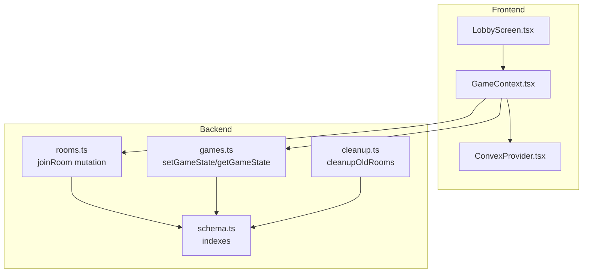
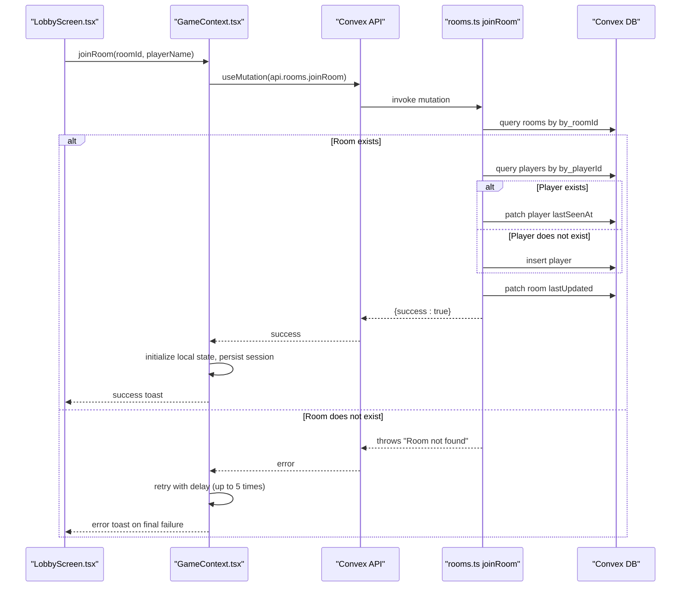
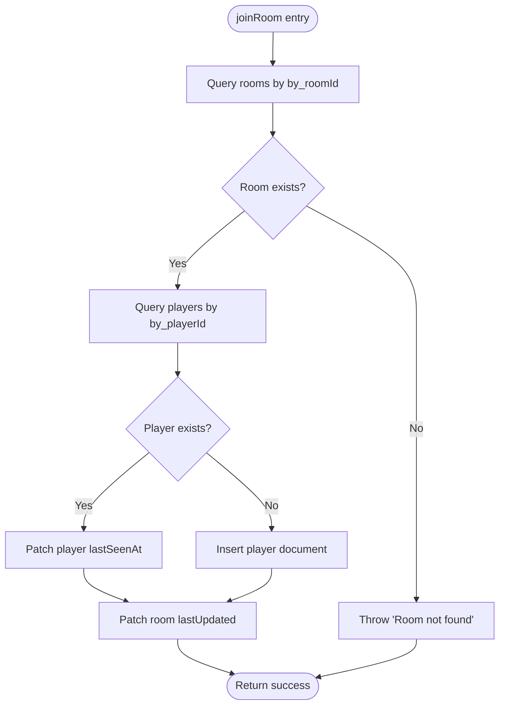
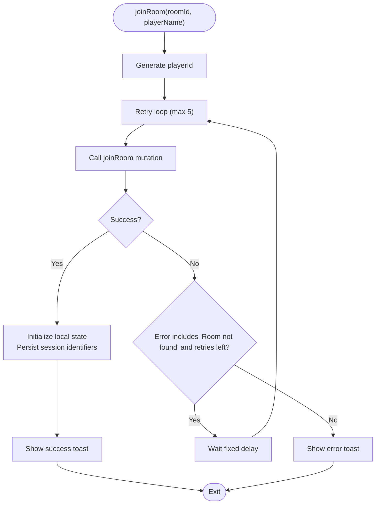
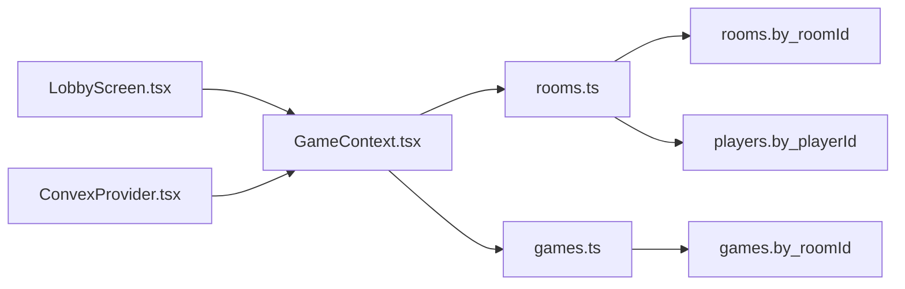

# joinRoom Mutation

<cite>
**Referenced Files in This Document**
- [rooms.ts](file://convex/rooms.ts)
- [schema.ts](file://convex/schema.ts)
- [GameContext.tsx](file://src/context/GameContext.tsx)
- [LobbyScreen.tsx](file://src/components/LobbyScreen.tsx)
- [games.ts](file://convex/games.ts)
- [cleanup.ts](file://convex/cleanup.ts)
- [ConvexProvider.tsx](file://src/ConvexProvider.tsx)
</cite>

## Table of Contents
1. [Introduction](#introduction)
2. [Project Structure](#project-structure)
3. [Core Components](#core-components)
4. [Architecture Overview](#architecture-overview)
5. [Detailed Component Analysis](#detailed-component-analysis)
6. [Dependency Analysis](#dependency-analysis)
7. [Performance Considerations](#performance-considerations)
8. [Troubleshooting Guide](#troubleshooting-guide)
9. [Conclusion](#conclusion)

## Introduction
This document explains the joinRoom mutation in the Rooms API, focusing on the business logic, error handling, frontend retry strategy, race condition guarantees, and performance characteristics. It also covers how the frontend surfaces errors and how the backend maintains data consistency.

## Project Structure
The joinRoom mutation is implemented in Convex and consumed by the React frontend. The relevant pieces are:
- Backend mutation and queries: convex/rooms.ts
- Schema and indexes: convex/schema.ts
- Frontend retry and error handling: src/context/GameContext.tsx
- Frontend UI integration: src/components/LobbyScreen.tsx
- Supporting game state persistence: convex/games.ts
- Background cleanup: convex/cleanup.ts
- Convex client provider: src/ConvexProvider.tsx

**Diagram sources**
- [rooms.ts](file://convex/rooms.ts#L30-L76)
- [schema.ts](file://convex/schema.ts#L1-L42)
- [games.ts](file://convex/games.ts#L1-L43)
- [cleanup.ts](file://convex/cleanup.ts#L1-L41)
- [ConvexProvider.tsx](file://src/ConvexProvider.tsx#L1-L16)

**Section sources**
- [rooms.ts](file://convex/rooms.ts#L30-L76)
- [schema.ts](file://convex/schema.ts#L1-L42)
- [GameContext.tsx](file://src/context/GameContext.tsx#L998-L1059)
- [LobbyScreen.tsx](file://src/components/LobbyScreen.tsx#L55-L73)
- [games.ts](file://convex/games.ts#L1-L43)
- [cleanup.ts](file://convex/cleanup.ts#L1-L41)
- [ConvexProvider.tsx](file://src/ConvexProvider.tsx#L1-L16)

## Core Components
- joinRoom mutation: Validates room existence via by_roomId index, checks for existing player via by_playerId index, inserts or updates player presence, and updates room lastUpdated.
- Frontend joinRoom wrapper: Implements a 5-retry loop with a fixed delay when “Room not found” occurs, initializes local state, persists session identifiers, and displays feedback.
- Frontend error handling: Uses toast notifications for join failures and general UX feedback.
- Indexes: by_roomId on rooms and players, by_playerId on players, and by_roomId on games.
- Cleanup: Periodic cleanup of old rooms and associated data.

**Section sources**
- [rooms.ts](file://convex/rooms.ts#L30-L76)
- [schema.ts](file://convex/schema.ts#L1-L42)
- [GameContext.tsx](file://src/context/GameContext.tsx#L998-L1059)
- [LobbyScreen.tsx](file://src/components/LobbyScreen.tsx#L55-L73)
- [cleanup.ts](file://convex/cleanup.ts#L1-L41)

## Architecture Overview
The join flow spans frontend and backend:
- The frontend calls a wrapper around the Convex joinRoom mutation.
- The backend validates room existence and player presence, performs a conditional insert/update, and updates the room’s lastUpdated timestamp.
- The frontend initializes local state and persists identifiers for reconnection.

**Diagram sources**
- [rooms.ts](file://convex/rooms.ts#L30-L76)
- [GameContext.tsx](file://src/context/GameContext.tsx#L998-L1059)
- [LobbyScreen.tsx](file://src/components/LobbyScreen.tsx#L55-L73)

## Detailed Component Analysis

### Backend: joinRoom Business Logic
- Room existence verification: Queries rooms with by_roomId index and throws an error if not found.
- Conditional player insertion or presence update: Queries players with by_playerId index; if present, updates lastSeenAt; otherwise inserts a new player document.
- LastUpdated propagation: Updates the room’s lastUpdated timestamp to the current time.
- Atomicity: The mutation runs as a single atomic operation in Convex, preventing partial writes.

**Diagram sources**
- [rooms.ts](file://convex/rooms.ts#L30-L76)

**Section sources**
- [rooms.ts](file://convex/rooms.ts#L30-L76)

### Frontend: joinRoom Wrapper and Retry Logic
- The wrapper generates a unique playerId and attempts to join the room via the Convex mutation.
- It retries up to five times with a fixed delay when encountering “Room not found,” then surfaces the error via toast.
- On success, it initializes local state, persists identifiers in session storage, and shows a success message.

**Diagram sources**
- [GameContext.tsx](file://src/context/GameContext.tsx#L998-L1059)

**Section sources**
- [GameContext.tsx](file://src/context/GameContext.tsx#L998-L1059)

### Frontend: Error Handling and UI Feedback
- The lobby screen triggers joinRoom and catches errors, displaying a toast with either the error message or a generic failure message.
- The wrapper also displays a success toast upon successful join.

**Section sources**
- [LobbyScreen.tsx](file://src/components/LobbyScreen.tsx#L55-L73)
- [GameContext.tsx](file://src/context/GameContext.tsx#L998-L1059)

### Supporting Components
- Presence updates: The frontend periodically updates player presence via updatePlayerPresence, keeping lastSeenAt fresh.
- Game state persistence: setGameState/getGameState manage game state synchronization and lastUpdated timestamps.
- Cleanup: Old rooms are cleaned up after inactivity, removing orphaned data.

**Section sources**
- [GameContext.tsx](file://src/context/GameContext.tsx#L782-L791)
- [games.ts](file://convex/games.ts#L1-L43)
- [cleanup.ts](file://convex/cleanup.ts#L1-L41)

## Dependency Analysis
- joinRoom depends on:
  - rooms.by_roomId index for room existence verification
  - players.by_playerId index for existing player detection
  - players.by_roomId index for listing players in a room
  - games.by_roomId index for game state persistence
- Frontend depends on ConvexProvider for client initialization and Convex hooks for mutations and queries.

**Diagram sources**
- [rooms.ts](file://convex/rooms.ts#L30-L76)
- [schema.ts](file://convex/schema.ts#L1-L42)
- [games.ts](file://convex/games.ts#L1-L43)
- [GameContext.tsx](file://src/context/GameContext.tsx#L998-L1059)
- [LobbyScreen.tsx](file://src/components/LobbyScreen.tsx#L55-L73)
- [ConvexProvider.tsx](file://src/ConvexProvider.tsx#L1-L16)

**Section sources**
- [rooms.ts](file://convex/rooms.ts#L30-L76)
- [schema.ts](file://convex/schema.ts#L1-L42)
- [games.ts](file://convex/games.ts#L1-L43)
- [GameContext.tsx](file://src/context/GameContext.tsx#L998-L1059)
- [LobbyScreen.tsx](file://src/components/LobbyScreen.tsx#L55-L73)
- [ConvexProvider.tsx](file://src/ConvexProvider.tsx#L1-L16)

## Performance Considerations
- Index queries:
  - by_roomId on rooms and players enables O(1) lookups for room existence and player listing.
  - by_playerId on players enables O(1) lookups for existing player detection.
- Atomic mutation:
  - Convex guarantees atomicity for a single mutation, minimizing partial writes and avoiding race conditions for this operation.
- Network and latency:
  - The frontend retry uses a fixed delay; consider exponential backoff for higher resilience under heavy contention.
- Cleanup:
  - Periodic cleanup reduces database bloat and improves query performance over time.

[No sources needed since this section provides general guidance]

## Troubleshooting Guide
Common issues and resolutions:
- Room not found:
  - Cause: The room may not exist yet or was cleaned up.
  - Resolution: The frontend retry loop handles this; if it still fails, verify the room ID and ensure the room exists.
- Stale player data:
  - Symptom: Player list appears outdated.
  - Cause: Remote presence updates lag behind.
  - Resolution: The frontend filters players based on lastSeenAt thresholds and periodically updates presence.
- Failed joins due to network latency:
  - Symptom: Intermittent failures when joining immediately after creation.
  - Resolution: The retry loop with a fixed delay addresses transient issues; consider increasing delay or adopting exponential backoff.
- Persistent session identifiers:
  - Ensure session storage keys are present for reconnection; the frontend clears them on reconnection failure.

**Section sources**
- [GameContext.tsx](file://src/context/GameContext.tsx#L998-L1059)
- [GameContext.tsx](file://src/context/GameContext.tsx#L782-L791)
- [cleanup.ts](file://convex/cleanup.ts#L1-L41)

## Conclusion
The joinRoom mutation provides a robust, indexed lookup and conditional insert/update mechanism guarded by Convex’s atomicity. The frontend implements a pragmatic retry loop with fixed delays and comprehensive error messaging. Together, these components deliver reliable room joining with predictable data consistency and user feedback.