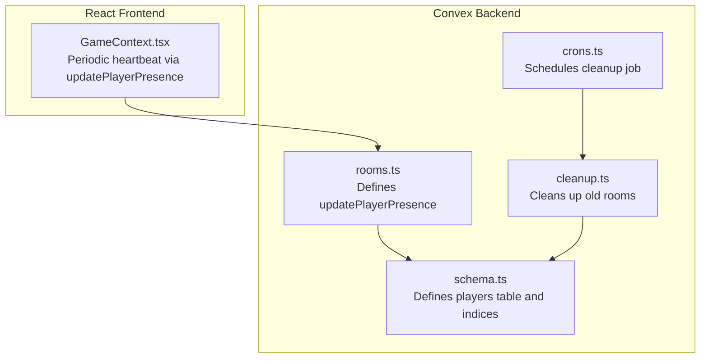
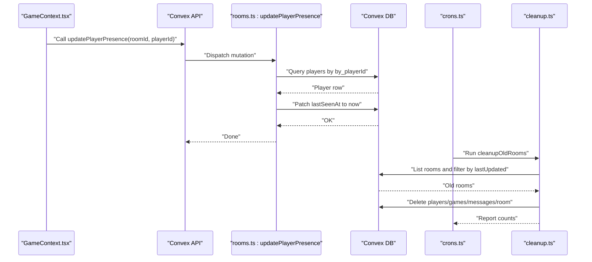
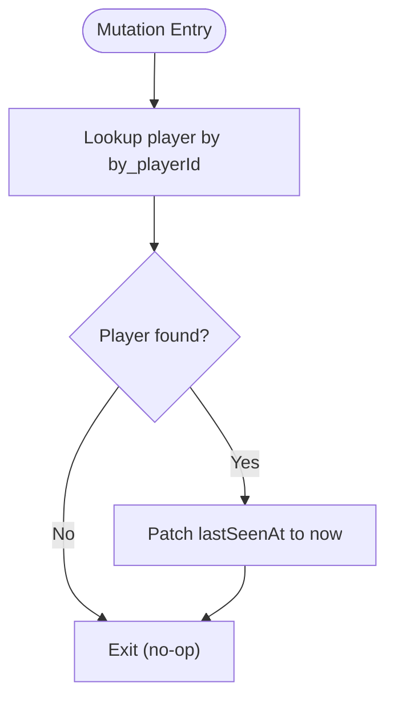
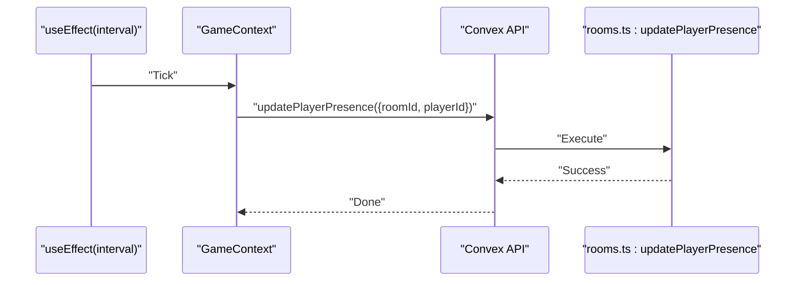
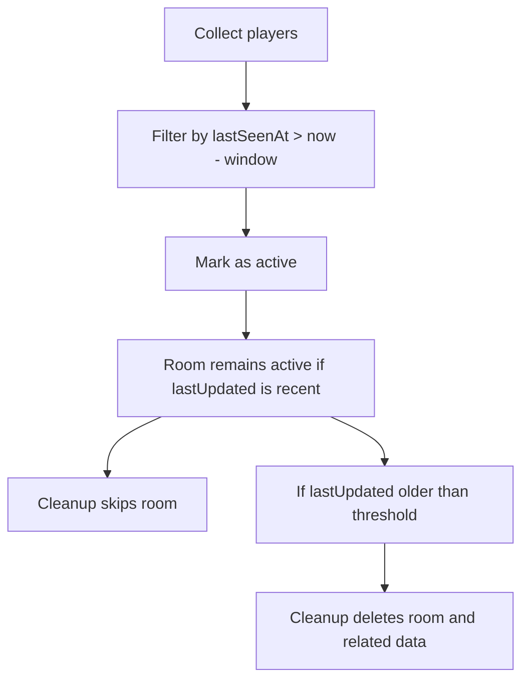
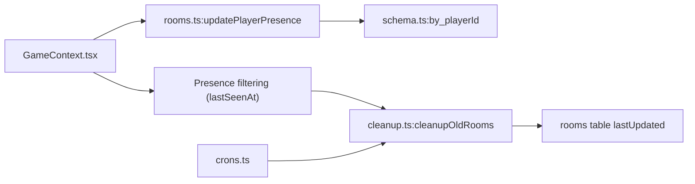

# updatePlayerPresence Mutation

<cite>
**Referenced Files in This Document**
- [rooms.ts](file://convex/rooms.ts)
- [schema.ts](file://convex/schema.ts)
- [cleanup.ts](file://convex/cleanup.ts)
- [crons.ts](file://convex/crons.ts)
- [GameContext.tsx](file://src/context/GameContext.tsx)
</cite>

## Table of Contents
1. [Introduction](#introduction)
2. [Project Structure](#project-structure)
3. [Core Components](#core-components)
4. [Architecture Overview](#architecture-overview)
5. [Detailed Component Analysis](#detailed-component-analysis)
6. [Dependency Analysis](#dependency-analysis)
7. [Performance Considerations](#performance-considerations)
8. [Troubleshooting Guide](#troubleshooting-guide)
9. [Conclusion](#conclusion)

## Introduction
This document explains the updatePlayerPresence mutation in the Rooms API and how it maintains player presence to prevent premature room cleanup. The mutation updates the lastSeenAt timestamp for a given player, enabling the client-side presence detection logic to consider the player active. It also describes how the periodic heartbeat is implemented in the frontend and how the backend cleanup job relies on room activity to avoid deleting active rooms.

## Project Structure
The presence tracking system spans the Convex backend (rooms, schema, cleanup, cron) and the React frontend (GameContext). The key files are:
- Backend: rooms.ts defines the mutation, schema.ts defines the players table and indices, cleanup.ts implements the hourly cleanup, and crons.ts schedules cleanup.
- Frontend: GameContext.tsx periodically invokes the mutation to keep presence fresh.

**Diagram sources**
- [rooms.ts](file://convex/rooms.ts#L100-L117)
- [schema.ts](file://convex/schema.ts#L15-L23)
- [cleanup.ts](file://convex/cleanup.ts#L1-L68)
- [crons.ts](file://convex/crons.ts#L1-L17)
- [GameContext.tsx](file://src/context/GameContext.tsx#L782-L791)

**Section sources**
- [rooms.ts](file://convex/rooms.ts#L100-L117)
- [schema.ts](file://convex/schema.ts#L15-L23)
- [cleanup.ts](file://convex/cleanup.ts#L1-L68)
- [crons.ts](file://convex/crons.ts#L1-L17)
- [GameContext.tsx](file://src/context/GameContext.tsx#L782-L791)

## Core Components
- updatePlayerPresence mutation: Updates a player’s lastSeenAt timestamp using the by_playerId index.
- Players table and indices: Provides efficient lookups by playerId and roomId.
- Cleanup job: Removes rooms inactive for more than one hour by checking rooms’ lastUpdated timestamps.
- Frontend heartbeat: Periodically calls updatePlayerPresence to keep presence fresh.

Key responsibilities:
- Backend: Locate player by playerId, update lastSeenAt, and rely on room lastUpdated to prevent cleanup.
- Frontend: Trigger heartbeat at a configured interval while online and in a room.

**Section sources**
- [rooms.ts](file://convex/rooms.ts#L100-L117)
- [schema.ts](file://convex/schema.ts#L15-L23)
- [cleanup.ts](file://convex/cleanup.ts#L1-L68)
- [crons.ts](file://convex/crons.ts#L1-L17)
- [GameContext.tsx](file://src/context/GameContext.tsx#L782-L791)

## Architecture Overview
The heartbeat mechanism ties together the frontend and backend:
- Frontend: Every N milliseconds, GameContext calls updatePlayerPresence with the current roomId and playerId.
- Backend: updatePlayerPresence finds the player by playerId and patches lastSeenAt to the current time.
- Presence detection: The frontend filters players whose lastSeenAt is within a recent window to mark them as active.
- Cleanup: An hourly cron job deletes rooms older than one hour by checking rooms’ lastUpdated timestamps.

**Diagram sources**
- [GameContext.tsx](file://src/context/GameContext.tsx#L782-L791)
- [rooms.ts](file://convex/rooms.ts#L100-L117)
- [schema.ts](file://convex/schema.ts#L15-L23)
- [crons.ts](file://convex/crons.ts#L1-L17)
- [cleanup.ts](file://convex/cleanup.ts#L1-L68)

## Detailed Component Analysis

### updatePlayerPresence Mutation
Purpose:
- Refresh a player’s lastSeenAt timestamp to indicate ongoing presence.

Implementation highlights:
- Index usage: Queries the players table using by_playerId to locate the player record efficiently.
- Patch operation: Updates only the lastSeenAt field to the current timestamp.
- Idempotency: Safe to call repeatedly; if the player does not exist, the mutation simply does nothing.

**Diagram sources**
- [rooms.ts](file://convex/rooms.ts#L100-L117)
- [schema.ts](file://convex/schema.ts#L15-L23)

**Section sources**
- [rooms.ts](file://convex/rooms.ts#L100-L117)
- [schema.ts](file://convex/schema.ts#L15-L23)

### Frontend Heartbeat in GameContext
Purpose:
- Periodically call updatePlayerPresence to keep presence fresh while the user is online and in a room.

Behavior:
- Interval: Every 10 seconds when gameMode is online, roomId and myPlayerId are set.
- Invocation: Calls the Convex mutation with the current roomId and playerId.

**Diagram sources**
- [GameContext.tsx](file://src/context/GameContext.tsx#L782-L791)
- [rooms.ts](file://convex/rooms.ts#L100-L117)

**Section sources**
- [GameContext.tsx](file://src/context/GameContext.tsx#L782-L791)

### Presence Detection and Room Cleanup
Purpose:
- Detect active players based on lastSeenAt.
- Prevent premature room deletion by keeping rooms active via room lastUpdated.

Mechanism:
- Presence detection: Filters players whose lastSeenAt is within a short window (e.g., 30 seconds) to consider them active.
- Room cleanup: An hourly cron job deletes rooms older than one hour by comparing lastUpdated to the current time.

**Diagram sources**
- [GameContext.tsx](file://src/context/GameContext.tsx#L698-L722)
- [cleanup.ts](file://convex/cleanup.ts#L1-L68)
- [crons.ts](file://convex/crons.ts#L1-L17)

**Section sources**
- [GameContext.tsx](file://src/context/GameContext.tsx#L698-L722)
- [cleanup.ts](file://convex/cleanup.ts#L1-L68)
- [crons.ts](file://convex/crons.ts#L1-L17)

## Dependency Analysis
- updatePlayerPresence depends on:
  - players table with by_playerId index for fast lookup.
  - Convex DB patch semantics to update lastSeenAt.
- Presence detection depends on:
  - Remote players list fetched from Convex.
  - lastSeenAt timestamps to compute activity windows.
- Cleanup depends on:
  - rooms table lastUpdated to determine inactivity.
  - Hourly cron scheduling via crons.ts.

**Diagram sources**
- [GameContext.tsx](file://src/context/GameContext.tsx#L698-L722)
- [rooms.ts](file://convex/rooms.ts#L100-L117)
- [schema.ts](file://convex/schema.ts#L15-L23)
- [cleanup.ts](file://convex/cleanup.ts#L1-L68)
- [crons.ts](file://convex/crons.ts#L1-L17)

**Section sources**
- [rooms.ts](file://convex/rooms.ts#L100-L117)
- [schema.ts](file://convex/schema.ts#L15-L23)
- [cleanup.ts](file://convex/cleanup.ts#L1-L68)
- [crons.ts](file://convex/crons.ts#L1-L17)
- [GameContext.tsx](file://src/context/GameContext.tsx#L698-L722)

## Performance Considerations
- Index usage:
  - The by_playerId index ensures O(1) lookup for updatePlayerPresence, minimizing database load.
- Update frequency:
  - The frontend heartbeat runs every 10 seconds. This is low overhead and avoids excessive writes.
- Room cleanup cadence:
  - Cleanup runs hourly, reducing operational overhead and preventing frequent deletions.
- Scalability:
  - With by_playerId and by_roomId indices, queries remain efficient even as player counts grow.
- Recommendations:
  - Keep heartbeat interval balanced: shorter intervals increase write volume; longer intervals risk false inactivity detection.
  - Monitor presence windows carefully to avoid false positives (e.g., 30–60 seconds for active detection).
  - Ensure clients handle network interruptions gracefully; the mutation is idempotent so repeated calls are safe.

[No sources needed since this section provides general guidance]

## Troubleshooting Guide
Common issues and resolutions:
- Player not appearing active:
  - Verify the frontend heartbeat is running (gameMode online, roomId and myPlayerId set).
  - Confirm updatePlayerPresence is being invoked at the expected interval.
  - Check that lastSeenAt is being updated in the database.
- Room prematurely deleted:
  - Ensure rooms are being updated frequently enough (room lastUpdated drives cleanup).
  - Confirm the hourly cleanup job is scheduled and running.
- Network interruptions:
  - The mutation is idempotent; intermittent failures do not cause data inconsistency.
  - Rely on retry logic in the frontend if needed, but repeated calls are safe.

**Section sources**
- [GameContext.tsx](file://src/context/GameContext.tsx#L782-L791)
- [rooms.ts](file://convex/rooms.ts#L100-L117)
- [cleanup.ts](file://convex/cleanup.ts#L1-L68)
- [crons.ts](file://convex/crons.ts#L1-L17)

## Conclusion
The updatePlayerPresence mutation is central to the player presence system. It refreshes lastSeenAt for a player using an index-backed lookup and is called periodically by the frontend to keep the player marked as active. Together with presence filtering and the hourly cleanup job, this design prevents premature room deletion while maintaining low operational overhead. Proper configuration of heartbeat intervals and monitoring presence windows ensures reliable connectivity detection and smooth gameplay.