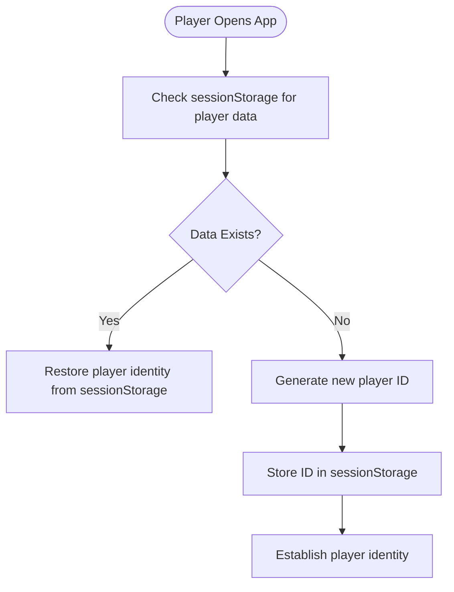
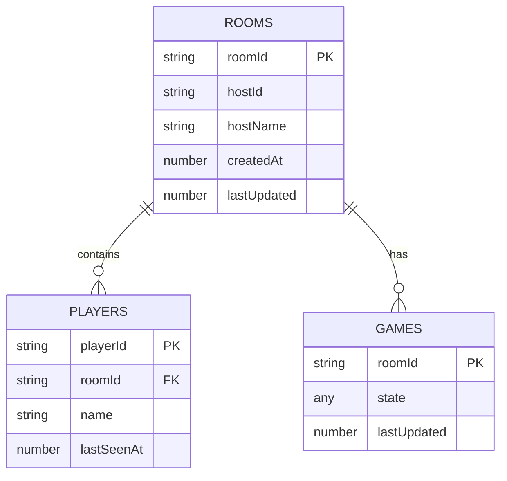
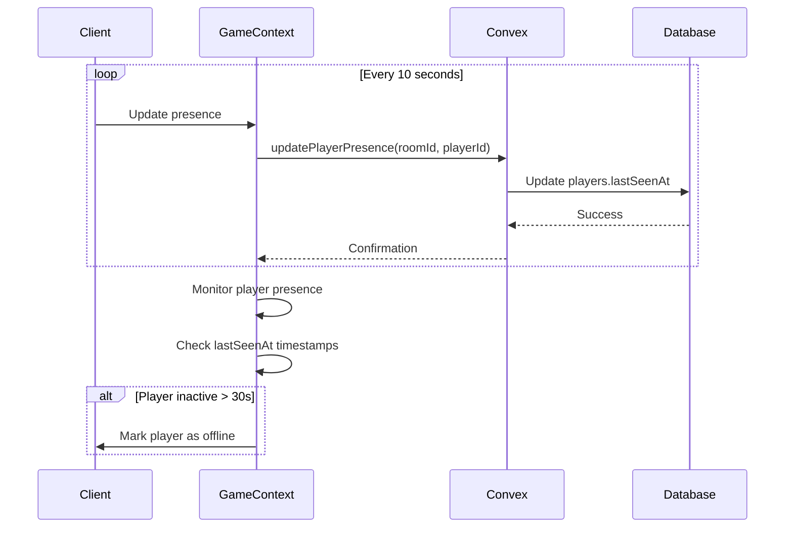
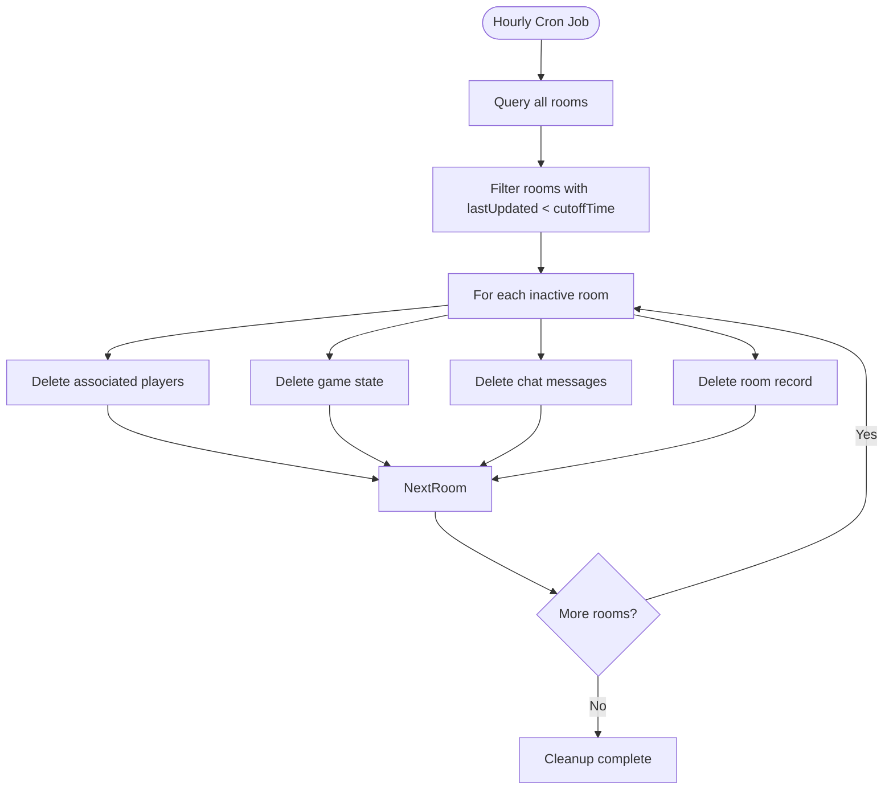
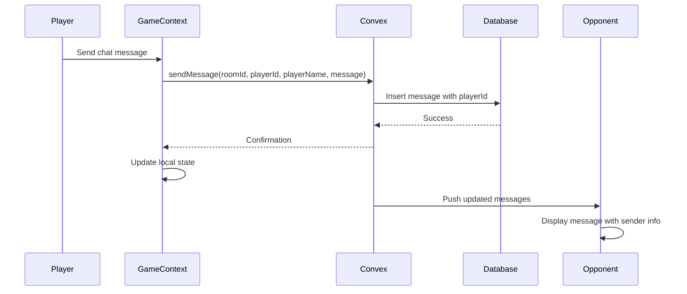
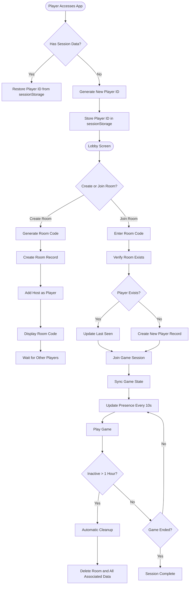

# Authentication Flow

<cite>
**Referenced Files in This Document**   
- [rooms.ts](file://convex/rooms.ts)
- [GameContext.tsx](file://src/context/GameContext.tsx)
- [schema.ts](file://convex/schema.ts)
- [cleanup.ts](file://convex/cleanup.ts)
- [crons.ts](file://convex/crons.ts)
- [chat.ts](file://convex/chat.ts)
- [games.ts](file://convex/games.ts)
- [LobbyScreen.tsx](file://src/components/LobbyScreen.tsx)
</cite>

## Table of Contents
1. [Introduction](#introduction)
2. [Player Identity Management](#player-identity-management)
3. [Room-Based Authentication](#room-based-authentication)
4. [Session State Management](#session-state-management)
5. [Security Considerations](#security-considerations)
6. [Anti-Abuse Measures](#anti-abuse-measures)
7. [Authenticated Actions](#authenticated-actions)
8. [Privacy and Data Minimization](#privacy-and-data-minimization)
9. [Flow Diagrams](#flow-diagrams)

## Introduction
The sen-web application implements a pseudonymous authentication system that allows players to join game rooms without traditional login credentials. Instead, players are identified through unique client-generated player IDs and join rooms using room codes. This document details the authentication and player identity management flow, focusing on how players establish identity, maintain session state, and interact securely within game rooms.

**Section sources**
- [rooms.ts](file://convex/rooms.ts)
- [GameContext.tsx](file://src/context/GameContext.tsx)

## Player Identity Management

### Client-Generated Player IDs
Player identity in sen-web is established through client-generated player IDs that are created when a player joins or creates a room. These IDs follow the format `player-{randomString}` where the random string is generated using `Math.random().toString(36).substr(2, 9)`.

The GameContext.tsx component manages player identity through localStorage persistence, storing three key pieces of information:
- `sen-playerId`: The unique player identifier
- `sen-roomId`: The current room identifier
- `sen-playerName`: The player's chosen name

When a player creates a room, a new player ID is generated and stored in sessionStorage, establishing their identity for the session. This approach eliminates the need for traditional authentication while maintaining a consistent player identity throughout the game session.

**Diagram sources**
- [GameContext.tsx](file://src/context/GameContext.tsx#L955-L1000)
- [LobbyScreen.tsx](file://src/components/LobbyScreen.tsx#L41-L53)

**Section sources**
- [GameContext.tsx](file://src/context/GameContext.tsx#L796-L800)
- [GameContext.tsx](file://src/context/GameContext.tsx#L955-L1000)

## Room-Based Authentication

### Room Code Generation and Joining
Players join games through unique room codes that follow the format `sen-{randomString}`, where the random string is generated using `Math.random().toString(36).substr(2, 6)`. This generates room codes with approximately 36^6 (2.17 billion) possible combinations, providing sufficient entropy to prevent guessing attacks.

The room creation and joining process involves the following steps:
1. Host creates a room with a randomly generated room code
2. Host shares the room code with other players
3. Players use the room code to join the same game session
4. The system verifies the room code and adds the player to the room

This approach enables seamless multiplayer gameplay without requiring account creation or password management.

### Room and Player Data Model
The authentication system relies on a data model with three primary entities:
- **rooms**: Stores room metadata including room ID, host ID, creation timestamp, and last update time
- **players**: Tracks player presence with player ID, room ID, name, and last seen timestamp
- **games**: Maintains game state for each room

The schema ensures efficient querying through indexed fields, particularly the `by_roomId` and `by_playerId` indexes that enable fast lookups during the join process.

**Diagram sources**
- [schema.ts](file://convex/schema.ts#L5-L40)
- [rooms.ts](file://convex/rooms.ts#L4-L27)

**Section sources**
- [rooms.ts](file://convex/rooms.ts#L4-L27)
- [schema.ts](file://convex/schema.ts#L5-L40)

## Session State Management

### Player Presence Tracking
The system maintains session state through a heartbeat mechanism that tracks player presence using the `lastSeenAt` timestamp in the players table. When a player joins a room or performs any action, their `lastSeenAt` timestamp is updated to the current time.

The GameContext component implements periodic presence updates by calling the `updatePlayerPresence` mutation every 10 seconds. This ensures that active players are marked as present while inactive players can be detected and handled appropriately.

### Inactive Session Detection
The client-side logic monitors player presence by comparing the `lastSeenAt` timestamp against a 30-second threshold. If a player's last seen time exceeds this threshold, they are considered inactive. For game sessions with only two players, if one player becomes inactive during gameplay (after the lobby phase), the system automatically resets the game to prevent indefinite waiting.

The host player receives notifications when new players join the room, enabling them to start the game when sufficient players are present. This presence system creates a dynamic player management interface without requiring explicit login/logout actions.

**Diagram sources**
- [rooms.ts](file://convex/rooms.ts#L100-L117)
- [GameContext.tsx](file://src/context/GameContext.tsx#L782-L791)
- [GameContext.tsx](file://src/context/GameContext.tsx#L700-L710)

**Section sources**
- [rooms.ts](file://convex/rooms.ts#L100-L117)
- [GameContext.tsx](file://src/context/GameContext.tsx#L782-L791)

## Security Considerations

### Player ID Collision Resistance
The player ID generation mechanism uses `Math.random().toString(36).substr(2, 9)` to create 9-character alphanumeric strings. With 36 possible characters (0-9, a-z) and 9 positions, this creates approximately 10^14 (100 trillion) possible combinations. This high entropy makes collisions extremely unlikely, even with thousands of concurrent players.

The system further mitigates collision risks by scoping player IDs to specific rooms. Even if two players across different rooms had the same ID (which is statistically improbable), they would not interfere with each other since all operations are room-scoped.

### Room Code Entropy
Room codes use `Math.random().toString(36).substr(2, 6)` to generate 6-character alphanumeric strings, providing approximately 2.17 billion possible combinations. While this is less than the player ID space, it remains sufficient for the application's threat model since:

1. Room codes are typically shared through private channels
2. Inactive rooms are automatically cleaned up after one hour
3. The system does not expose room enumeration endpoints
4. No sensitive data is associated with room access

The combination of moderate entropy and automated cleanup creates a practical balance between usability and security.

**Section sources**
- [GameContext.tsx](file://src/context/GameContext.tsx#L955-L956)
- [GameContext.tsx](file://src/context/GameContext.tsx#L999-L1000)

## Anti-Abuse Measures

### Automated Session Cleanup
The system implements automated cleanup of inactive sessions through a scheduled cron job that runs hourly. Rooms that have not been updated in the past hour (3,600,000 milliseconds) are considered abandoned and are removed along with all associated data.

The cleanup process removes:
- Room records from the rooms table
- Player records from the players table
- Game state from the games table
- Chat messages from the messages table

This automated cleanup prevents database bloat from abandoned game sessions and limits the window of opportunity for potential abuse.

**Diagram sources**
- [cleanup.ts](file://convex/cleanup.ts#L7-L65)
- [crons.ts](file://convex/crons.ts#L7-L13)

**Section sources**
- [cleanup.ts](file://convex/cleanup.ts#L7-L65)
- [crons.ts](file://convex/crons.ts#L7-L13)

## Authenticated Actions

### Action Authorization
All authenticated actions in the game are tied to the player's ID, ensuring that players can only perform actions within their authorized scope. When a player performs an action such as sending a chat message or making a game move, the system includes their player ID in the mutation request.

For example, when sending a chat message, the system includes the player ID, name, and message content in the `sendMessage` mutation. The backend stores this information, creating an audit trail of actions tied to specific player identities.

### Mutation Flow
The process for authenticated actions follows this pattern:
1. Client initiates action (e.g., sending chat message)
2. Client includes player ID in mutation parameters
3. Convex function processes the mutation
4. Database records the action with player ID
5. Changes are synchronized to all clients

This ensures that all game actions are attributable to specific players while maintaining the pseudonymous nature of the system.

**Diagram sources**
- [chat.ts](file://convex/chat.ts#L4-L20)
- [GameContext.tsx](file://src/context/GameContext.tsx#L591-L592)
- [GameContext.tsx](file://src/context/GameContext.tsx#L694-L695)

**Section sources**
- [chat.ts](file://convex/chat.ts#L4-L20)
- [games.ts](file://convex/games.ts#L4-L29)

## Privacy and Data Minimization

### Pseudonymous Design
The authentication system follows a strict data minimization principle by collecting only the essential information needed for gameplay:
- Player ID (client-generated)
- Player name (user-provided)
- Room ID (system-generated)
- Last seen timestamp (system-generated)

No personally identifiable information (PII) is required or stored. The player name is purely cosmetic and does not need to be a real name. This pseudonymous design protects user privacy while enabling social interaction within the game.

### Session Data Lifecycle
All session data follows a defined lifecycle:
1. Creation: Data is created when a player joins a room
2. Maintenance: Data is updated during active gameplay
3. Cleanup: Data is automatically removed after one hour of inactivity

The use of sessionStorage (rather than localStorage) ensures that player identity is cleared when the browser tab is closed, providing an additional privacy safeguard. Players can also manually clear their session data at any time.

**Section sources**
- [GameContext.tsx](file://src/context/GameContext.tsx#L717-L720)
- [GameContext.tsx](file://src/context/GameContext.tsx#L796-L798)

## Flow Diagrams

### Complete Authentication Flow
The following diagram illustrates the complete authentication and player identity management flow from initial access to game participation:

**Diagram sources**
- [GameContext.tsx](file://src/context/GameContext.tsx)
- [rooms.ts](file://convex/rooms.ts)
- [cleanup.ts](file://convex/cleanup.ts)

**Section sources**
- [GameContext.tsx](file://src/context/GameContext.tsx)
- [rooms.ts](file://convex/rooms.ts)
- [cleanup.ts](file://convex/cleanup.ts)