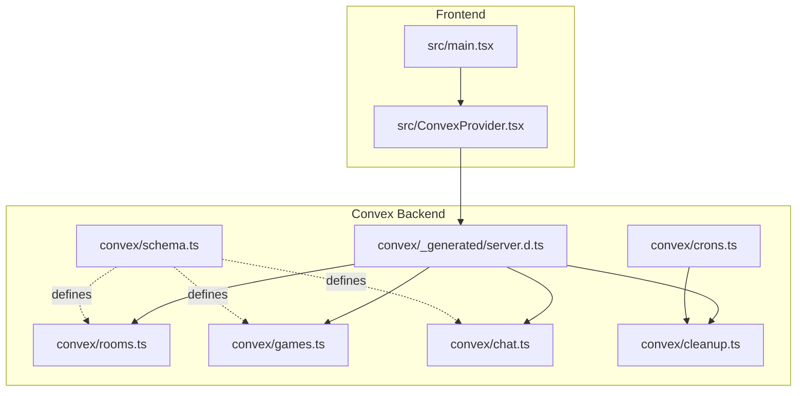
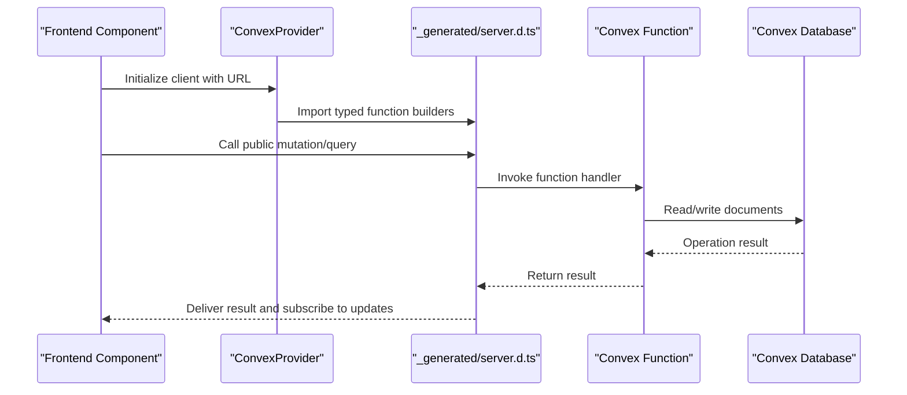
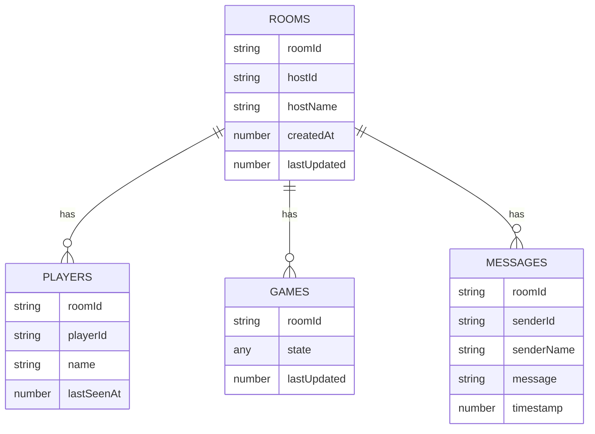
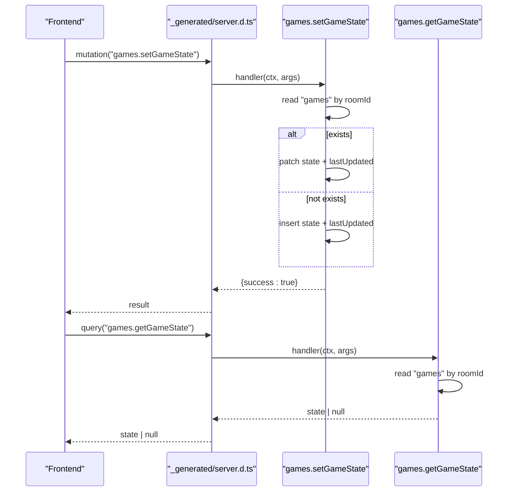
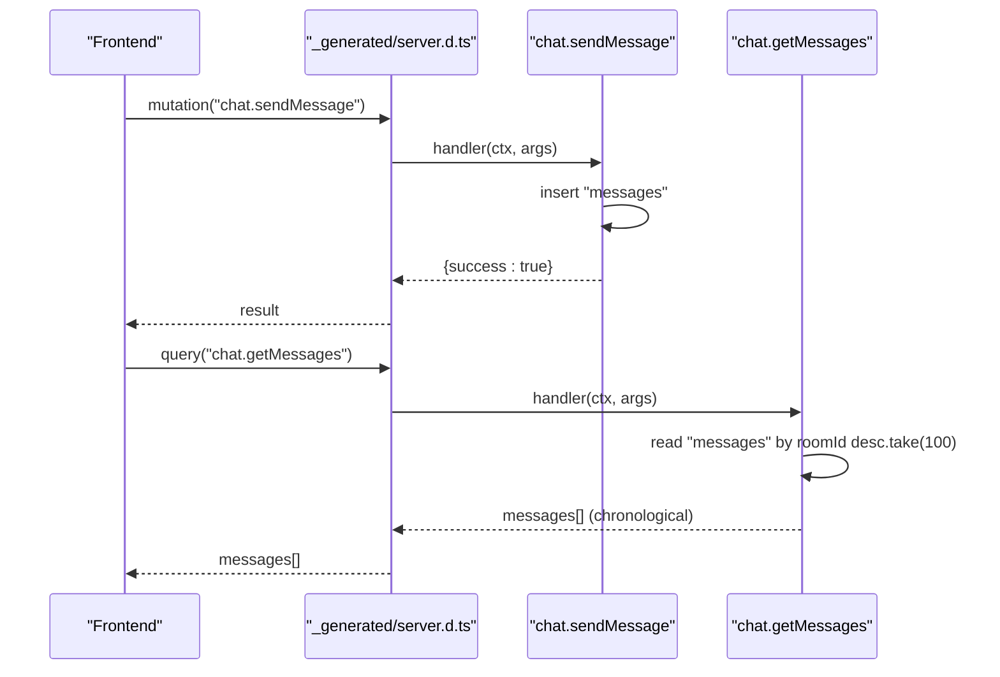
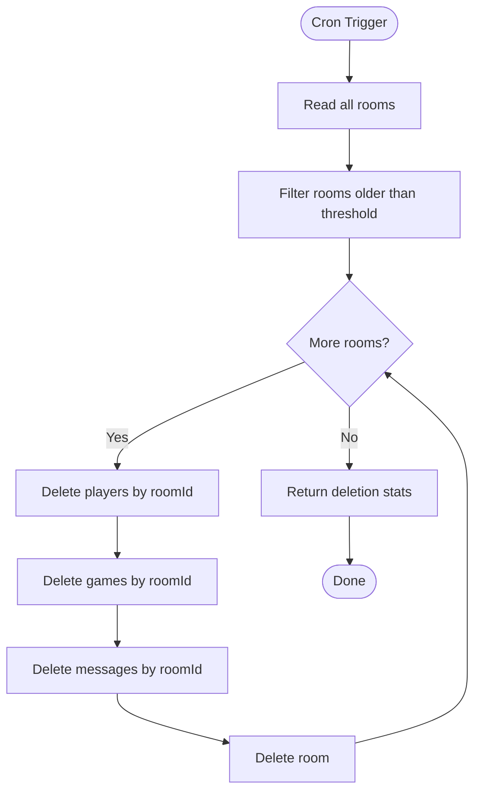
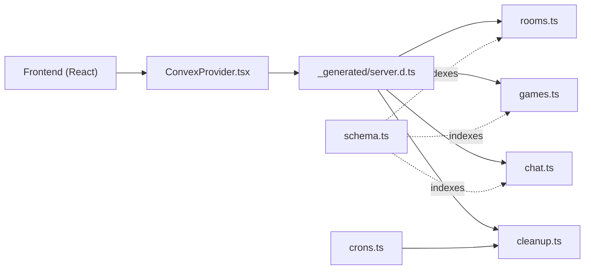

# Backend Architecture

<cite>
**Referenced Files in This Document**
- [schema.ts](file://convex/schema.ts)
- [rooms.ts](file://convex/rooms.ts)
- [games.ts](file://convex/games.ts)
- [chat.ts](file://convex/chat.ts)
- [cleanup.ts](file://convex/cleanup.ts)
- [crons.ts](file://convex/crons.ts)
- [_generated/server.d.ts](file://convex/_generated/server.d.ts)
- [ConvexProvider.tsx](file://src/ConvexProvider.tsx)
- [main.tsx](file://src/main.tsx)
- [package.json](file://package.json)
- [vercel.json](file://vercel.json)
</cite>

## Table of Contents
1. [Introduction](#introduction)
2. [Project Structure](#project-structure)
3. [Core Components](#core-components)
4. [Architecture Overview](#architecture-overview)
5. [Detailed Component Analysis](#detailed-component-analysis)
6. [Dependency Analysis](#dependency-analysis)
7. [Performance Considerations](#performance-considerations)
8. [Troubleshooting Guide](#troubleshooting-guide)
9. [Conclusion](#conclusion)
10. [Appendices](#appendices)

## Introduction
This document describes the backend architecture of sen-web, centered around Convex as a real-time backend and database. The backend is organized into serverless functions that expose public mutations and queries for the frontend to consume. Data is modeled declaratively in schema.ts, and real-time synchronization is achieved through Convex’s query subscriptions. The backend is composed of focused modules:
- rooms.ts: Room lifecycle management (creation, joining, presence updates)
- games.ts: Game state persistence and retrieval
- chat.ts: Message sending and retrieval
- cleanup.ts: Internal cleanup of abandoned rooms and related data
- crons.ts: Scheduling of periodic cleanup tasks

The frontend integrates with Convex via a React provider and uses Convex hooks to subscribe to real-time updates.

## Project Structure
The backend lives under convex/ and is composed of:
- Schema definition for tables and indexes
- Public and internal serverless functions for mutations and queries
- Cron scheduling for periodic maintenance
- Generated server typings for type-safe function definitions



**Diagram sources**
- [schema.ts](file://convex/schema.ts#L1-L42)
- [rooms.ts](file://convex/rooms.ts#L1-L119)
- [games.ts](file://convex/games.ts#L1-L43)
- [chat.ts](file://convex/chat.ts#L1-L35)
- [cleanup.ts](file://convex/cleanup.ts#L1-L68)
- [crons.ts](file://convex/crons.ts#L1-L17)
- [_generated/server.d.ts](file://convex/_generated/server.d.ts#L1-L144)
- [ConvexProvider.tsx](file://src/ConvexProvider.tsx#L1-L18)
- [main.tsx](file://src/main.tsx#L1-L21)

**Section sources**
- [schema.ts](file://convex/schema.ts#L1-L42)
- [rooms.ts](file://convex/rooms.ts#L1-L119)
- [games.ts](file://convex/games.ts#L1-L43)
- [chat.ts](file://convex/chat.ts#L1-L35)
- [cleanup.ts](file://convex/cleanup.ts#L1-L68)
- [crons.ts](file://convex/crons.ts#L1-L17)
- [_generated/server.d.ts](file://convex/_generated/server.d.ts#L1-L144)
- [ConvexProvider.tsx](file://src/ConvexProvider.tsx#L1-L18)
- [main.tsx](file://src/main.tsx#L1-L21)

## Core Components
- Schema: Declares rooms, players, games, and messages tables with appropriate secondary indexes for efficient reads.
- Rooms module: Public mutations and queries for room creation, joining, presence updates, and listing players.
- Games module: Public mutations and queries for persisting and retrieving game state per room.
- Chat module: Public mutations and queries for sending and retrieving recent messages per room.
- Cleanup module: Internal mutation to delete stale rooms and their associated data.
- Cron scheduler: Hourly trigger invoking the cleanup job.

**Section sources**
- [schema.ts](file://convex/schema.ts#L1-L42)
- [rooms.ts](file://convex/rooms.ts#L1-L119)
- [games.ts](file://convex/games.ts#L1-L43)
- [chat.ts](file://convex/chat.ts#L1-L35)
- [cleanup.ts](file://convex/cleanup.ts#L1-L68)
- [crons.ts](file://convex/crons.ts#L1-L17)

## Architecture Overview
The system follows a serverless, real-time architecture:
- Frontend initializes a Convex client and wraps the app in a provider.
- Frontend components call public mutations and queries to mutate and read data.
- Convex executes functions serverlessly, writes to the database, and streams real-time updates to subscribed clients.
- Periodic cleanup runs internally to remove stale resources.



**Diagram sources**
- [ConvexProvider.tsx](file://src/ConvexProvider.tsx#L1-L18)
- [_generated/server.d.ts](file://convex/_generated/server.d.ts#L1-L144)
- [rooms.ts](file://convex/rooms.ts#L1-L119)
- [games.ts](file://convex/games.ts#L1-L43)
- [chat.ts](file://convex/chat.ts#L1-L35)
- [cleanup.ts](file://convex/cleanup.ts#L1-L68)

## Detailed Component Analysis

### Schema and Data Model
The schema defines four tables with indexes:
- rooms: indexed by roomId and hostId
- players: indexed by roomId and playerId
- games: indexed by roomId
- messages: indexed by roomId and timestamp

These indexes enable efficient lookups for room-centric operations and message pagination.



**Diagram sources**
- [schema.ts](file://convex/schema.ts#L1-L42)

**Section sources**
- [schema.ts](file://convex/schema.ts#L1-L42)

### Rooms Module
Responsibilities:
- Create a room and automatically add the host as a player
- Join a room, updating presence or adding a new player
- Retrieve room and player lists
- Update player presence timestamps

Key patterns:
- Index-based reads for roomId and playerId
- Atomic updates to room and player records
- Error handling for missing rooms during join

```mermaid
sequenceDiagram
participant FE as "Frontend"
participant Gen as "_generated/server.d.ts"
participant Create as "rooms.createRoom"
participant Join as "rooms.joinRoom"
participant GetR as "rooms.getRoom"
participant GetP as "rooms.getPlayers"
FE->>Gen : mutation("rooms.createRoom")
Gen->>Create : handler(ctx, args)
Create->>Create : insert "rooms" + "players"
Create-->>Gen : {success : true}
Gen-->>FE : result
FE->>Gen : mutation("rooms.joinRoom")
Gen->>Join : handler(ctx, args)
Join->>Join : read "rooms" by roomId
Join->>Join : read "players" by playerId
Join->>Join : upsert "players" + patch "rooms"
Join-->>Gen : {success : true}
Gen-->>FE : result
FE->>Gen : query("rooms.getRoom")
Gen->>GetR : handler(ctx, args)
GetR->>GetR : read "rooms" by roomId
GetR-->>Gen : room
Gen-->>FE : room
FE->>Gen : query("rooms.getPlayers")
Gen->>GetP : handler(ctx, args)
GetP->>GetP : collect "players" by roomId
GetP-->>Gen : players[]
Gen-->>FE : players[]
```

**Diagram sources**
- [rooms.ts](file://convex/rooms.ts#L1-L119)
- [_generated/server.d.ts](file://convex/_generated/server.d.ts#L1-L144)

**Section sources**
- [rooms.ts](file://convex/rooms.ts#L1-L119)

### Games Module
Responsibilities:
- Persist or update game state per room
- Retrieve current game state for a room

Key patterns:
- Upsert logic for game state keyed by roomId
- Timestamping for lastUpdated



**Diagram sources**
- [games.ts](file://convex/games.ts#L1-L43)
- [_generated/server.d.ts](file://convex/_generated/server.d.ts#L1-L144)

**Section sources**
- [games.ts](file://convex/games.ts#L1-L43)

### Chat Module
Responsibilities:
- Send messages with sender metadata and timestamp
- Retrieve recent messages for a room, ordered chronologically

Key patterns:
- Index by roomId for fast retrieval
- Order by timestamp descending and take a bounded count
- Reverse to return chronological order



**Diagram sources**
- [chat.ts](file://convex/chat.ts#L1-L35)
- [_generated/server.d.ts](file://convex/_generated/server.d.ts#L1-L144)

**Section sources**
- [chat.ts](file://convex/chat.ts#L1-L35)

### Cleanup Module and Cron
Responsibilities:
- Internal cleanup of rooms inactive beyond a threshold
- Deletion cascade across players, games, and messages
- Reporting counts of deleted entities

Cron scheduling:
- Hourly trigger at minute 0 UTC invoking the cleanup job



**Diagram sources**
- [cleanup.ts](file://convex/cleanup.ts#L1-L68)
- [crons.ts](file://convex/crons.ts#L1-L17)

**Section sources**
- [cleanup.ts](file://convex/cleanup.ts#L1-L68)
- [crons.ts](file://convex/crons.ts#L1-L17)

## Dependency Analysis
- Frontend depends on Convex client initialization and typed function builders.
- Functions depend on generated server typing for type-safe signatures.
- Modules are loosely coupled via shared schema and indexes.
- Cron jobs depend on internal cleanup functions.



**Diagram sources**
- [ConvexProvider.tsx](file://src/ConvexProvider.tsx#L1-L18)
- [_generated/server.d.ts](file://convex/_generated/server.d.ts#L1-L144)
- [rooms.ts](file://convex/rooms.ts#L1-L119)
- [games.ts](file://convex/games.ts#L1-L43)
- [chat.ts](file://convex/chat.ts#L1-L35)
- [cleanup.ts](file://convex/cleanup.ts#L1-L68)
- [crons.ts](file://convex/crons.ts#L1-L17)
- [schema.ts](file://convex/schema.ts#L1-L42)

**Section sources**
- [ConvexProvider.tsx](file://src/ConvexProvider.tsx#L1-L18)
- [_generated/server.d.ts](file://convex/_generated/server.d.ts#L1-L144)
- [rooms.ts](file://convex/rooms.ts#L1-L119)
- [games.ts](file://convex/games.ts#L1-L43)
- [chat.ts](file://convex/chat.ts#L1-L35)
- [cleanup.ts](file://convex/cleanup.ts#L1-L68)
- [crons.ts](file://convex/crons.ts#L1-L17)
- [schema.ts](file://convex/schema.ts#L1-L42)

## Performance Considerations
- Index usage: Queries leverage secondary indexes (by_roomId, by_hostId, by_playerId, by_timestamp) to minimize scans.
- Bounded reads: Message retrieval limits results to a small window to keep latency predictable.
- Atomic writes: Mutations are atomic within a single function invocation, preventing partial state.
- Real-time subscriptions: Frontend subscribes to query results, reducing polling overhead.
- Scheduled cleanup: Prevents unbounded growth of stale data by removing inactive rooms and related entities.

[No sources needed since this section provides general guidance]

## Troubleshooting Guide
Common issues and mitigations:
- Missing Convex URL: The provider warns if the environment variable is not set. Ensure VITE_CONVEX_URL is configured.
- Room not found on join: The join mutation throws when a room does not exist; verify room creation precedes joins.
- Presence updates: Presence timestamps are updated on join and via dedicated presence updates; ensure clients call presence updates periodically.
- Cleanup timing: Cleanup runs hourly; verify cron scheduling and that rooms exceed the timeout threshold.

**Section sources**
- [ConvexProvider.tsx](file://src/ConvexProvider.tsx#L1-L18)
- [rooms.ts](file://convex/rooms.ts#L1-L119)
- [cleanup.ts](file://convex/cleanup.ts#L1-L68)
- [crons.ts](file://convex/crons.ts#L1-L17)

## Conclusion
The backend leverages Convex to provide a scalable, real-time foundation for room management, game state synchronization, and chat. The schema-driven design, combined with public mutations and queries and internal cleanup, ensures a clean separation of concerns and predictable performance. The frontend integrates seamlessly through a typed provider and subscriptions, enabling reactive UI updates.

[No sources needed since this section summarizes without analyzing specific files]

## Appendices

### Frontend Integration Notes
- The React app initializes a Convex client and wraps the application tree with a provider.
- Dependencies include the Convex client library.
- Deployment is handled by Vercel with a build command that deploys Convex functions alongside the static site.

**Section sources**
- [main.tsx](file://src/main.tsx#L1-L21)
- [ConvexProvider.tsx](file://src/ConvexProvider.tsx#L1-L18)
- [package.json](file://package.json#L1-L91)
- [vercel.json](file://vercel.json#L1-L11)