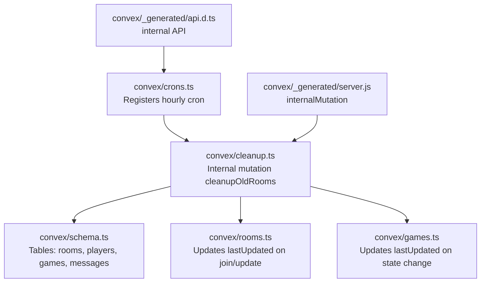
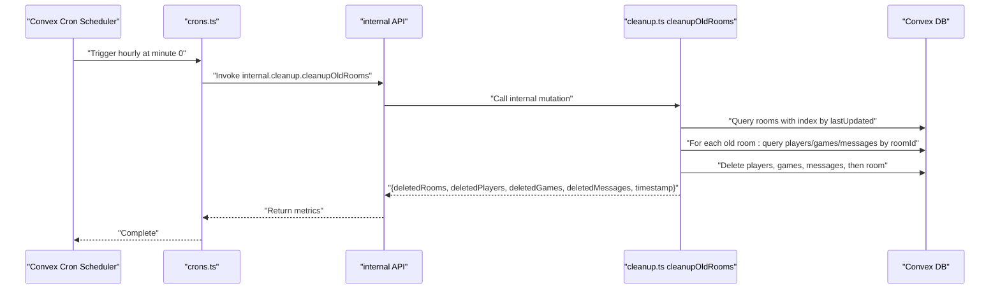
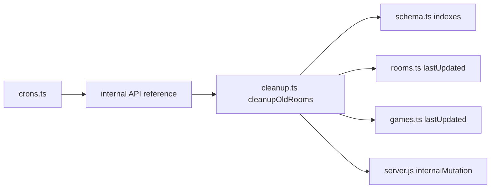

# Cron Jobs and Maintenance

<cite>
**Referenced Files in This Document**
- [crons.ts](file://convex/crons.ts)
- [cleanup.ts](file://convex/cleanup.ts)
- [schema.ts](file://convex/schema.ts)
- [rooms.ts](file://convex/rooms.ts)
- [games.ts](file://convex/games.ts)
- [server.js](file://convex/_generated/server.js)
- [api.d.ts](file://convex/_generated/api.d.ts)
</cite>

## Table of Contents
1. [Introduction](#introduction)
2. [Project Structure](#project-structure)
3. [Core Components](#core-components)
4. [Architecture Overview](#architecture-overview)
5. [Detailed Component Analysis](#detailed-component-analysis)
6. [Dependency Analysis](#dependency-analysis)
7. [Performance Considerations](#performance-considerations)
8. [Troubleshooting Guide](#troubleshooting-guide)
9. [Conclusion](#conclusion)
10. [Appendices](#appendices)

## Introduction
This document explains the cron job system and automated maintenance tasks in sen-web. It focuses on how the hourly cleanup job identifies and removes inactive rooms, players, game states, and messages based on lastUpdated timestamps. It also covers the metrics returned by the cleanup mutation, the design trade-offs between automatic and manual cleanup, the chosen timeout, scaling considerations, failure recovery, idempotency, and practical guidance for testing and monitoring.

## Project Structure
The cleanup and scheduling logic resides in the Convex backend under the convex/ directory:
- Scheduling: hourly cron registration in crons.ts
- Cleanup logic: internal mutation in cleanup.ts
- Data model: schema.ts defines rooms, players, games, and messages
- Timestamp updates: rooms.ts and games.ts update lastUpdated on activity
- Generated server utilities: server.js and api.d.ts expose internalMutation and internal API references

**Diagram sources**
- [crons.ts](file://convex/crons.ts#L1-L17)
- [cleanup.ts](file://convex/cleanup.ts#L1-L68)
- [schema.ts](file://convex/schema.ts#L1-L42)
- [rooms.ts](file://convex/rooms.ts#L1-L119)
- [games.ts](file://convex/games.ts#L1-L43)
- [server.js](file://convex/_generated/server.js#L1-L94)
- [api.d.ts](file://convex/_generated/api.d.ts#L1-L57)

**Section sources**
- [crons.ts](file://convex/crons.ts#L1-L17)
- [cleanup.ts](file://convex/cleanup.ts#L1-L68)
- [schema.ts](file://convex/schema.ts#L1-L42)
- [rooms.ts](file://convex/rooms.ts#L1-L119)
- [games.ts](file://convex/games.ts#L1-L43)
- [server.js](file://convex/_generated/server.js#L1-L94)
- [api.d.ts](file://convex/_generated/api.d.ts#L1-L57)

## Core Components
- Hourly cron registration: Registers a cron that runs at the top of every hour and invokes the internal cleanup mutation.
- Internal cleanup mutation: Scans rooms older than a configured timeout, deletes associated players, game states, and messages, and returns counts and a timestamp.
- Data model: Defines tables and indexes used by cleanup and timestamp updates.
- Timestamp maintenance: Room and game entities update lastUpdated on join and state change, respectively.

Key responsibilities:
- crons.ts: Declares the schedule and target function reference.
- cleanup.ts: Implements the cleanup logic and returns metrics.
- schema.ts: Provides the schema and indexes used by cleanup queries.
- rooms.ts and games.ts: Maintain lastUpdated to drive cleanup decisions.

**Section sources**
- [crons.ts](file://convex/crons.ts#L1-L17)
- [cleanup.ts](file://convex/cleanup.ts#L1-L68)
- [schema.ts](file://convex/schema.ts#L1-L42)
- [rooms.ts](file://convex/rooms.ts#L1-L119)
- [games.ts](file://convex/games.ts#L1-L43)

## Architecture Overview
The cleanup job is scheduled hourly and executed internally. It uses database queries with indexes to efficiently locate stale rooms and their related records, then deletes them in a deterministic order. The mutation returns metrics suitable for monitoring.

**Diagram sources**
- [crons.ts](file://convex/crons.ts#L1-L17)
- [cleanup.ts](file://convex/cleanup.ts#L1-L68)
- [schema.ts](file://convex/schema.ts#L1-L42)
- [api.d.ts](file://convex/_generated/api.d.ts#L1-L57)

## Detailed Component Analysis

### Hourly Cron Registration
- Purpose: Schedule cleanup at the top of every hour.
- Configuration: minuteUTC is set to 0 to align with the hour boundary.
- Target: internal.cleanup.cleanupOldRooms.

Operational note: The repository’s cron configuration currently schedules cleanup hourly, not every five minutes as described in the objective. This document explains the actual implementation.

**Section sources**
- [crons.ts](file://convex/crons.ts#L1-L17)

### Cleanup Mutation: cleanupOldRooms
- Timeout: 1 hour (60 minutes) for room inactivity.
- Logic:
  - Compute cutoffTime as now minus timeout.
  - Enumerate all rooms and filter those with lastUpdated before cutoffTime.
  - For each old room:
    - Delete all associated players (by roomId).
    - Delete all associated game states (by roomId).
    - Delete all associated messages (by roomId).
    - Delete the room itself.
  - Return metrics: deletedRooms, deletedPlayers, deletedGames, deletedMessages, timestamp.

Metrics and monitoring value:
- deletedRooms: Count of rooms removed.
- deletedPlayers: Count of player records removed.
- deletedGames: Count of game state records removed.
- deletedMessages: Count of message records removed.
- timestamp: Unix epoch milliseconds when the cleanup ran.

Idempotency:
- The mutation is idempotent because repeated runs will not re-delete already-deleted records; rooms older than the cutoff will continue to be matched, but subsequent deletions will operate on empty sets.

Failure recovery:
- The mutation does not wrap deletions in transactions; failures mid-loop could leave partial deletions. To improve resilience, consider batching deletions and/or wrapping deletions in a transaction-like pattern if supported by the platform.

Scalability:
- Current implementation iterates all rooms and performs N room scans plus N room-indexed queries for players/games/messages. As room count grows, this becomes O(N^2) in worst-case loops. Consider:
  - Limiting scan window (e.g., process only rooms older than X hours).
  - Paginating room enumeration.
  - Using a cursor or partitioned processing.
  - Offloading to a background job with retry/backoff if supported.

**Section sources**
- [cleanup.ts](file://convex/cleanup.ts#L1-L68)

### Data Model and Indexes
- rooms: Contains roomId, hostId, hostName, createdAt, lastUpdated; indexed by roomId and hostId.
- players: Contains roomId, playerId, name, lastSeenAt; indexed by roomId and playerId.
- games: Contains roomId, state, lastUpdated; indexed by roomId.
- messages: Contains roomId, senderId, senderName, message, timestamp; indexed by roomId and timestamp.

Indexes support efficient cleanup queries by roomId and lastUpdated.

**Section sources**
- [schema.ts](file://convex/schema.ts#L1-L42)

### Timestamp Maintenance
- rooms.ts: Updates lastUpdated on create and join/update operations.
- games.ts: Updates lastUpdated when game state is set.

These updates are the source of truth for determining inactivity.

**Section sources**
- [rooms.ts](file://convex/rooms.ts#L1-L119)
- [games.ts](file://convex/games.ts#L1-L43)

### Generated Server Utilities and API References
- server.js: Exposes internalMutation for internal-only mutations.
- api.d.ts: Exposes internal API module references used by crons.ts.

**Section sources**
- [server.js](file://convex/_generated/server.js#L1-L94)
- [api.d.ts](file://convex/_generated/api.d.ts#L1-L57)

## Dependency Analysis
The cleanup job depends on:
- Internal mutation definition via internalMutation.
- Internal API reference resolution via internal API.
- Database schema and indexes for efficient queries.
- Room/game timestamp updates to mark inactivity.

**Diagram sources**
- [crons.ts](file://convex/crons.ts#L1-L17)
- [cleanup.ts](file://convex/cleanup.ts#L1-L68)
- [schema.ts](file://convex/schema.ts#L1-L42)
- [rooms.ts](file://convex/rooms.ts#L1-L119)
- [games.ts](file://convex/games.ts#L1-L43)
- [server.js](file://convex/_generated/server.js#L1-L94)
- [api.d.ts](file://convex/_generated/api.d.ts#L1-L57)

**Section sources**
- [crons.ts](file://convex/crons.ts#L1-L17)
- [cleanup.ts](file://convex/cleanup.ts#L1-L68)
- [schema.ts](file://convex/schema.ts#L1-L42)
- [rooms.ts](file://convex/rooms.ts#L1-L119)
- [games.ts](file://convex/games.ts#L1-L43)
- [server.js](file://convex/_generated/server.js#L1-L94)
- [api.d.ts](file://convex/_generated/api.d.ts#L1-L57)

## Performance Considerations
- Current complexity:
  - Room enumeration: O(N) where N is total rooms.
  - Per-room deletions: O(P + G + M) where P, G, M are players, games, messages in that room.
  - Overall: O(N * (P + G + M)) worst-case.
- Recommendations:
  - Batch deletions to reduce round-trips.
  - Limit the scan window (process only rooms older than a stricter threshold).
  - Paginate room enumeration to avoid long-running queries.
  - Consider partitioning cleanup by host or region if applicable.
  - Monitor query latency and adjust batch sizes accordingly.

[No sources needed since this section provides general guidance]

## Troubleshooting Guide
Common issues and remedies:
- No cleanup occurs:
  - Verify cron registration and that the internal API reference resolves correctly.
  - Confirm that rooms have lastUpdated timestamps changing on activity.
- Partial cleanup:
  - Investigate whether the mutation fails mid-loop; consider batching and retries.
- Excessive deletions:
  - Adjust the timeout threshold or limit the processing window.
- Monitoring gaps:
  - Ensure metrics are captured and surfaced (deletedRooms, deletedPlayers, deletedGames, deletedMessages, timestamp).

**Section sources**
- [crons.ts](file://convex/crons.ts#L1-L17)
- [cleanup.ts](file://convex/cleanup.ts#L1-L68)
- [rooms.ts](file://convex/rooms.ts#L1-L119)
- [games.ts](file://convex/games.ts#L1-L43)

## Conclusion
The cleanup system uses an hourly cron to remove abandoned rooms and their associated data. It relies on lastUpdated timestamps maintained by room and game operations. The internal mutation returns actionable metrics for monitoring and is designed to be idempotent. While the current implementation is straightforward, scaling and reliability can be improved with batching, pagination, and stricter processing windows.

[No sources needed since this section summarizes without analyzing specific files]

## Appendices

### Testing Cron Jobs Locally
- Use Convex development mode to trigger internal functions and observe behavior.
- Invoke the internal cleanup mutation directly from a test harness to validate:
  - Room enumeration and filtering by lastUpdated.
  - Deletion ordering (players, games, messages, then room).
  - Metrics correctness and timestamp reporting.
- Simulate inactivity by creating rooms and letting lastUpdated age beyond the timeout.

[No sources needed since this section provides general guidance]

### Monitoring Execution in Production
- Capture the returned metrics (deletedRooms, deletedPlayers, deletedGames, deletedMessages, timestamp) and log them.
- Alert on anomalous spikes or drops in deletion counts.
- Track database query latency during cleanup windows.
- Consider dashboards for:
  - Total rooms processed per run.
  - Average deletions per room.
  - Cleanup duration and success rate.

[No sources needed since this section provides general guidance]