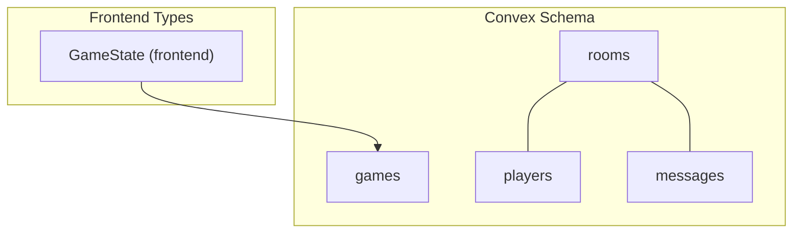
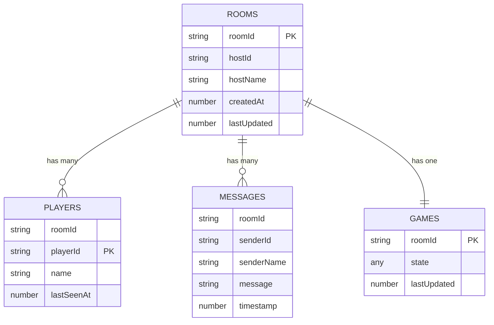
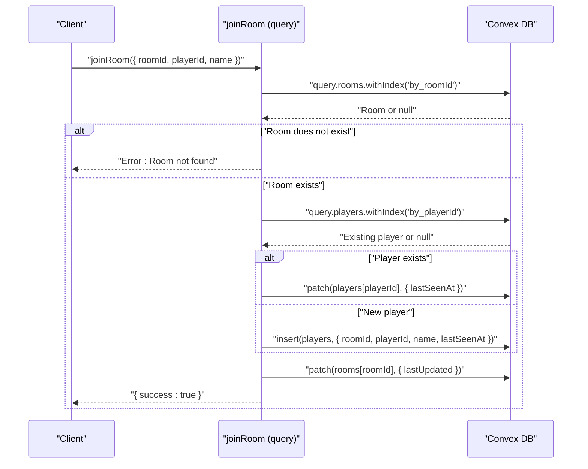
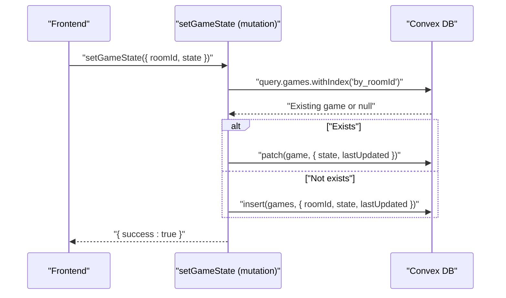
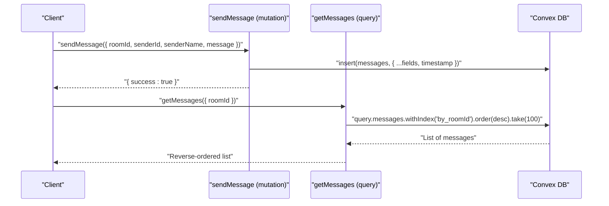
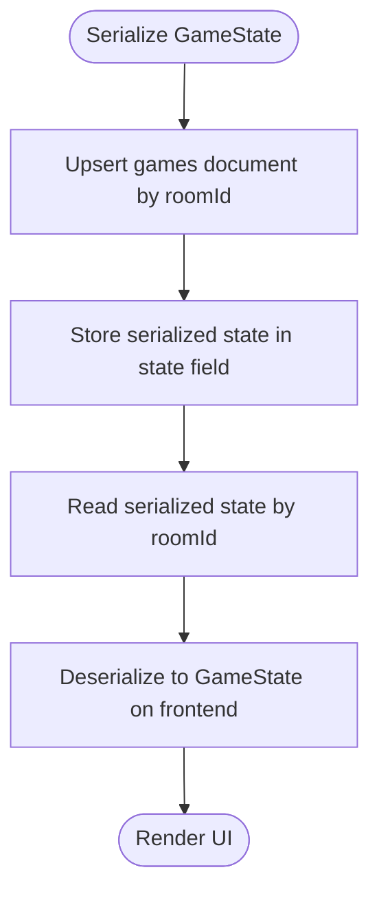
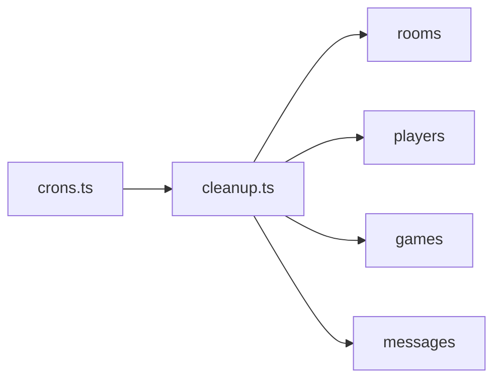

# Data Models

<cite>
**Referenced Files in This Document**
- [schema.ts](file://convex/schema.ts)
- [rooms.ts](file://convex/rooms.ts)
- [games.ts](file://convex/games.ts)
- [chat.ts](file://convex/chat.ts)
- [cleanup.ts](file://convex/cleanup.ts)
- [crons.ts](file://convex/crons.ts)
- [dataModel.d.ts](file://convex/_generated/dataModel.d.ts)
- [index.ts](file://src/types/index.ts)
</cite>

## Table of Contents
1. [Introduction](#introduction)
2. [Project Structure](#project-structure)
3. [Core Components](#core-components)
4. [Architecture Overview](#architecture-overview)
5. [Detailed Component Analysis](#detailed-component-analysis)
6. [Dependency Analysis](#dependency-analysis)
7. [Performance Considerations](#performance-considerations)
8. [Troubleshooting Guide](#troubleshooting-guide)
9. [Conclusion](#conclusion)
10. [Appendices](#appendices)

## Introduction
This document describes the Convex database schema and data models used by the multiplayer card game in sen-web. It focuses on the entity relationships among rooms, players, games, and messages, and explains how the frontend GameState interface maps to backend storage. It also covers indexes, constraints, validation rules enforced by Convex’s type system, mutation invariants, data access patterns, lifecycle policies, and security considerations.

## Project Structure
The Convex schema defines four collections: rooms, players, games, and messages. Each collection has explicit indexes to support efficient queries by roomId and other fields. Frontend types define the GameState shape, which is serialized and stored in the games collection.

**Diagram sources**
- [schema.ts](file://convex/schema.ts#L1-L42)
- [index.ts](file://src/types/index.ts#L37-L80)

**Section sources**
- [schema.ts](file://convex/schema.ts#L1-L42)
- [dataModel.d.ts](file://convex/_generated/dataModel.d.ts#L1-L61)

## Core Components
This section documents each collection, its fields, data types, indexes, and constraints.

- rooms
  - Purpose: Stores room metadata and ownership.
  - Fields:
    - roomId: string
    - hostId: string
    - hostName: string
    - createdAt: number (Unix timestamp)
    - lastUpdated: number (Unix timestamp)
  - Indexes:
    - by_roomId: ["roomId"]
    - by_hostId: ["hostId"]
  - Constraints:
    - No explicit uniqueness constraints beyond indexes. roomId is expected to be unique by application logic; hostId is unique per room by convention.

- players
  - Purpose: Tracks players in a room, including presence.
  - Fields:
    - roomId: string
    - playerId: string
    - name: string
    - lastSeenAt: number (Unix timestamp)
  - Indexes:
    - by_roomId: ["roomId"]
    - by_playerId: ["playerId"]
  - Constraints:
    - No explicit uniqueness constraints. Application logic ensures a given playerId appears only once per roomId.

- games
  - Purpose: Stores serialized GameState for a room.
  - Fields:
    - roomId: string
    - state: any (serialized GameState)
    - lastUpdated: number (Unix timestamp)
  - Indexes:
    - by_roomId: ["roomId"]
  - Constraints:
    - No explicit uniqueness constraints. There is one GameState document per roomId.

- messages
  - Purpose: Stores chat messages for a room.
  - Fields:
    - roomId: string
    - senderId: string
    - senderName: string
    - message: string
    - timestamp: number (Unix timestamp)
  - Indexes:
    - by_roomId: ["roomId"]
    - by_timestamp: ["timestamp"]
  - Constraints:
    - No explicit uniqueness constraints. Messages are ordered by timestamp.

Validation and constraints are enforced by Convex’s type system via argument validators and by application logic in mutations and queries.

**Section sources**
- [schema.ts](file://convex/schema.ts#L1-L42)

## Architecture Overview
The data model centers around rooms. Players belong to rooms, messages are scoped to rooms, and a single GameState document is stored per room. Queries leverage indexes to efficiently fetch room-scoped data. A scheduled cleanup job removes stale rooms and their associated data.

**Diagram sources**
- [schema.ts](file://convex/schema.ts#L1-L42)

## Detailed Component Analysis

### Rooms Collection
- Purpose: Manage room lifecycle and ownership.
- Key operations:
  - Create room: inserts a room and adds the host as a player.
  - Join room: validates room existence, deduplicates players by playerId, updates presence timestamps, and refreshes room lastUpdated.
  - Get room: fetches a room by roomId.
  - List players: lists all players in a room.
  - Update player presence: refreshes lastSeenAt for a player.
- Index usage:
  - by_roomId for room lookup and player listing.
  - by_hostId for host-based queries (if used elsewhere).
- Invariants:
  - HostId is treated as unique per room by application logic.
  - lastUpdated is refreshed on join and presence updates.

**Diagram sources**
- [rooms.ts](file://convex/rooms.ts#L30-L75)

**Section sources**
- [rooms.ts](file://convex/rooms.ts#L1-L119)

### Games Collection
- Purpose: Persist serialized GameState for a room.
- Key operations:
  - Set game state: upserts a GameState document per roomId.
  - Get game state: retrieves the serialized state for a room.
- Index usage:
  - by_roomId for state lookup.
- Invariants:
  - The state field stores a serialized GameState object. The frontend GameState type is defined separately and mapped to this storage.

**Diagram sources**
- [games.ts](file://convex/games.ts#L1-L30)

**Section sources**
- [games.ts](file://convex/games.ts#L1-L43)
- [index.ts](file://src/types/index.ts#L37-L80)

### Messages Collection
- Purpose: Store chat messages scoped to a room.
- Key operations:
  - Send message: inserts a message with a timestamp.
  - Get messages: fetches recent messages for a room, ordered chronologically.
- Index usage:
  - by_roomId for room-scoped retrieval.
  - by_timestamp for ordering and potential future analytics.
- Pagination:
  - Fetch limits to the latest 100 messages per request and reverses order for chronological display.

**Diagram sources**
- [chat.ts](file://convex/chat.ts#L1-L35)

**Section sources**
- [chat.ts](file://convex/chat.ts#L1-L35)

### Data Model Mapping: Frontend GameState to Backend Storage
- Frontend GameState definition:
  - The GameState interface includes nested structures such as players, cards, chat messages, and action-specific state.
  - It is defined in the frontend types module.
- Backend storage:
  - The games collection stores a serialized GameState object under the state field.
  - The serialization is performed by the frontend and deserialized when read back.
- Atomic persistence:
  - The setGameState mutation performs an upsert per roomId, persisting the entire GameState atomically in a single document write.

**Diagram sources**
- [games.ts](file://convex/games.ts#L1-L30)
- [index.ts](file://src/types/index.ts#L37-L80)

**Section sources**
- [games.ts](file://convex/games.ts#L1-L43)
- [index.ts](file://src/types/index.ts#L1-L100)

## Dependency Analysis
- Internal dependencies:
  - The cron job invokes an internal cleanup mutation hourly.
  - The cleanup mutation reads and deletes documents across rooms, players, games, and messages.
- External dependencies:
  - The generated data model types provide strongly typed identifiers and document shapes for type-safe usage in functions.

**Diagram sources**
- [crons.ts](file://convex/crons.ts#L1-L17)
- [cleanup.ts](file://convex/cleanup.ts#L1-L68)

**Section sources**
- [crons.ts](file://convex/crons.ts#L1-L17)
- [cleanup.ts](file://convex/cleanup.ts#L1-L68)
- [dataModel.d.ts](file://convex/_generated/dataModel.d.ts#L1-L61)

## Performance Considerations
- Index usage:
  - by_roomId is used across rooms, players, games, and messages to limit scans to a single room.
  - by_playerId is used to quickly locate a player by their globally unique id.
  - by_timestamp is used for ordering messages.
- Query efficiency:
  - Room-scoped reads are O(1) with index lookups.
  - Presence updates and room updates are single-document writes.
- Pagination:
  - Message retrieval limits results to the latest 100 messages and orders by descending timestamp, then reverses for chronological display.
- Concurrency:
  - Upserts in setGameState and joinRoom are single-document operations, minimizing contention.
- Cost:
  - The cleanup job runs hourly to prevent unbounded growth of orphaned data.

[No sources needed since this section provides general guidance]

## Troubleshooting Guide
- Room not found on join:
  - Symptom: joinRoom throws an error when the room does not exist.
  - Cause: by_roomId lookup returns null.
  - Resolution: Ensure the room is created before joining or pass the correct roomId.
- Duplicate player entries:
  - Symptom: Multiple entries for the same playerId in a room.
  - Cause: Missing by_playerId index usage or race conditions.
  - Resolution: The join logic checks by_playerId and updates lastSeenAt; ensure the index exists and the mutation is invoked consistently.
- Stale data after cleanup:
  - Symptom: Rooms disappear after inactivity.
  - Cause: Cleanup job removes rooms inactive for more than one hour.
  - Resolution: Re-create the room or keep activity flowing to update lastUpdated.
- Message history missing:
  - Symptom: Only the latest 100 messages are returned.
  - Cause: getMessages limits to 100 and orders by timestamp.
  - Resolution: Implement client-side pagination or adjust the take limit if appropriate.

**Section sources**
- [rooms.ts](file://convex/rooms.ts#L30-L75)
- [cleanup.ts](file://convex/cleanup.ts#L1-L68)
- [chat.ts](file://convex/chat.ts#L23-L35)

## Conclusion
The Convex schema models a room-centric system with clear indexes enabling efficient room-scoped queries. The GameState is persisted as a serialized object per room, allowing atomic updates. A scheduled cleanup job maintains database hygiene by removing inactive rooms and their associated data. Validation and invariants are enforced through Convex’s type system and application logic in mutations and queries.

[No sources needed since this section summarizes without analyzing specific files]

## Appendices

### Appendix A: Field Reference and Indexes
- rooms
  - Fields: roomId, hostId, hostName, createdAt, lastUpdated
  - Indexes: by_roomId, by_hostId
- players
  - Fields: roomId, playerId, name, lastSeenAt
  - Indexes: by_roomId, by_playerId
- games
  - Fields: roomId, state, lastUpdated
  - Indexes: by_roomId
- messages
  - Fields: roomId, senderId, senderName, message, timestamp
  - Indexes: by_roomId, by_timestamp

**Section sources**
- [schema.ts](file://convex/schema.ts#L1-L42)

### Appendix B: Lifecycle Policies
- Room cleanup:
  - Policy: Remove rooms inactive for more than 1 hour.
  - Mechanism: Internal cleanup mutation invoked by cron job.
  - Scope: Deletes players, games, messages, and the room itself.
- Retention:
  - Messages: Stored until the room is cleaned up; no separate retention policy configured.
  - Players: Removed when their room is cleaned up.
  - Games: Removed when their room is cleaned up.

**Section sources**
- [cleanup.ts](file://convex/cleanup.ts#L1-L68)
- [crons.ts](file://convex/crons.ts#L1-L17)

### Appendix C: Security and Access Control Notes
- Public database:
  - The schema and functions are public; there are no explicit access control checks in the provided files.
- Privacy considerations:
  - Player identity fields (playerId, name) are stored in plaintext. Consider hashing identifiers or anonymizing data if privacy requirements increase.
  - Chat messages are stored as plain text; consider encryption at rest or transport if sensitive content is expected.
- Recommendations:
  - Enforce authentication and authorization at the Convex function level if access control is needed.
  - Apply data minimization: store only necessary fields and consider retention policies for personal data.

[No sources needed since this section provides general guidance]