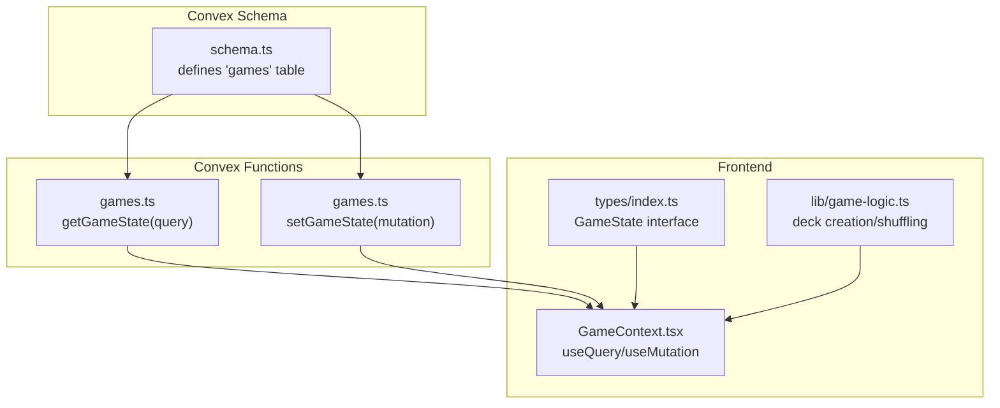
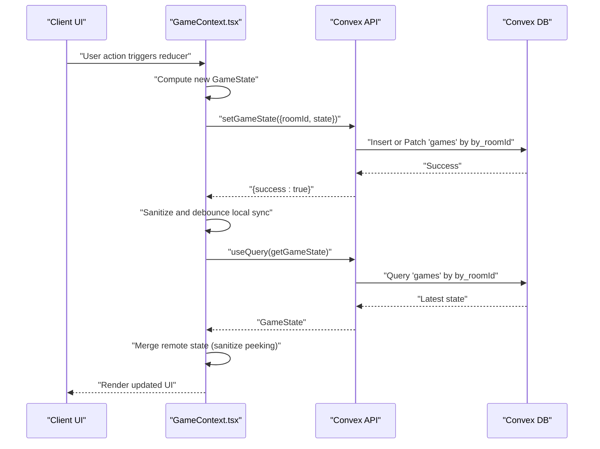
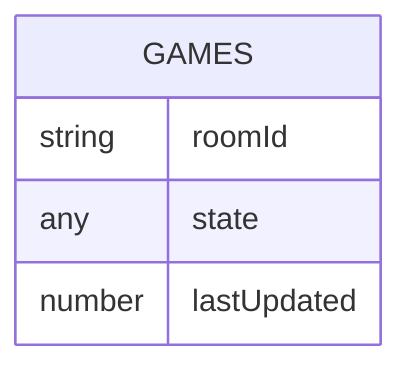
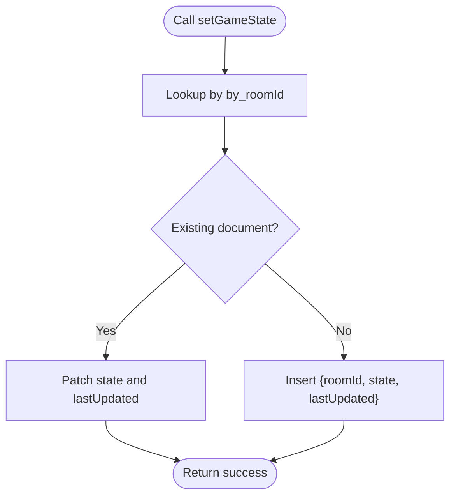
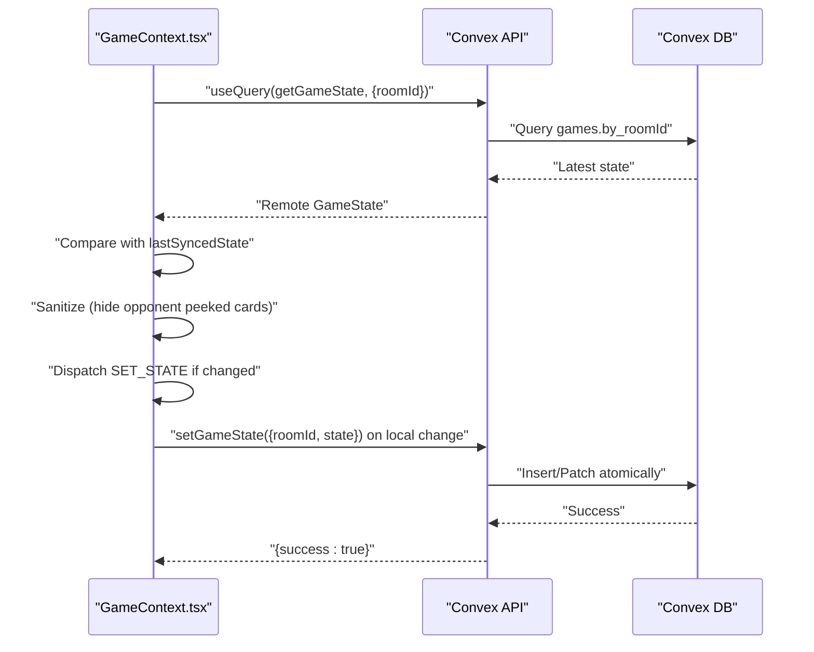
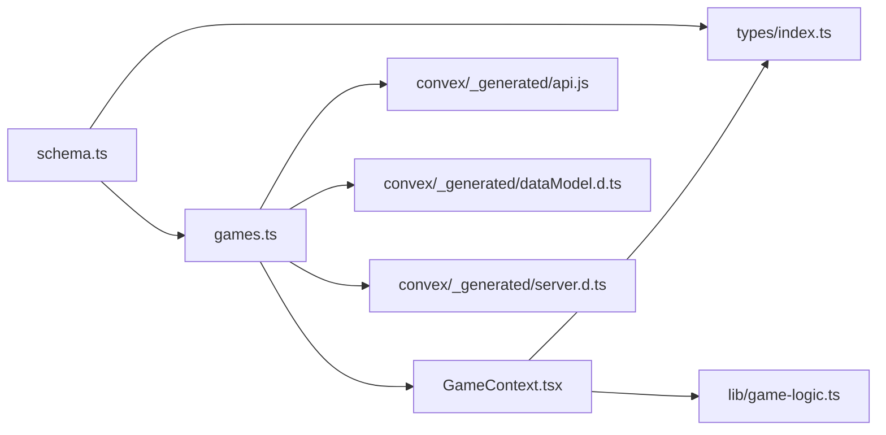

# Games Collection

<cite>
**Referenced Files in This Document**
- [schema.ts](file://convex/schema.ts)
- [games.ts](file://convex/games.ts)
- [index.ts](file://src/types/index.ts)
- [GameContext.tsx](file://src/context/GameContext.tsx)
- [game-logic.ts](file://src/lib/game-logic.ts)
- [gamerules.md](file://gamerules.md)
- [server.d.ts](file://convex/_generated/server.d.ts)
- [dataModel.d.ts](file://convex/_generated/dataModel.d.ts)
- [api.js](file://convex/_generated/api.js)
</cite>

## Table of Contents
1. [Introduction](#introduction)
2. [Project Structure](#project-structure)
3. [Core Components](#core-components)
4. [Architecture Overview](#architecture-overview)
5. [Detailed Component Analysis](#detailed-component-analysis)
6. [Dependency Analysis](#dependency-analysis)
7. [Performance Considerations](#performance-considerations)
8. [Troubleshooting Guide](#troubleshooting-guide)
9. [Conclusion](#conclusion)
10. [Appendices](#appendices)

## Introduction
This document explains the “games” collection in the Convex database, which persists serialized game state for online multiplayer sessions. It covers the schema definition, the GameState interface mapping, the atomic update pattern, real-time synchronization via query subscriptions, performance implications of large nested objects, reconnection and recovery, trade-offs of schema flexibility, and practical debugging techniques.

## Project Structure
The “games” collection is defined in the Convex schema and accessed through typed Convex functions. Frontend state transitions are handled by a React context that serializes GameState objects and persists them atomically.

**Diagram sources**
- [schema.ts](file://convex/schema.ts#L1-L42)
- [games.ts](file://convex/games.ts#L1-L43)
- [GameContext.tsx](file://src/context/GameContext.tsx#L562-L600)
- [index.ts](file://src/types/index.ts#L37-L79)
- [game-logic.ts](file://src/lib/game-logic.ts#L1-L63)

**Section sources**
- [schema.ts](file://convex/schema.ts#L1-L42)
- [games.ts](file://convex/games.ts#L1-L43)
- [GameContext.tsx](file://src/context/GameContext.tsx#L562-L600)
- [index.ts](file://src/types/index.ts#L37-L79)
- [game-logic.ts](file://src/lib/game-logic.ts#L1-L63)

## Core Components
- Games table schema
  - Fields:
    - roomId: string (foreign key to rooms)
    - state: v.any() (serialized GameState object)
    - lastUpdated: number (timestamp)
  - Index: by_roomId(roomId) for efficient per-room retrieval
- Convex functions
  - getGameState: reads the latest GameState for a given roomId
  - setGameState: inserts or patches the GameState atomically
- Frontend state lifecycle
  - GameState interface defines nested structures players, drawPile, discardPile, chatMessages, and more
  - React context orchestrates local state transitions and syncs to Convex

**Section sources**
- [schema.ts](file://convex/schema.ts#L24-L30)
- [games.ts](file://convex/games.ts#L1-L43)
- [index.ts](file://src/types/index.ts#L37-L79)
- [GameContext.tsx](file://src/context/GameContext.tsx#L562-L600)

## Architecture Overview
The system uses optimistic concurrency control: mutations update the entire GameState object atomically, and clients subscribe to the latest state to keep all participants synchronized in real time.

**Diagram sources**
- [games.ts](file://convex/games.ts#L1-L43)
- [GameContext.tsx](file://src/context/GameContext.tsx#L616-L709)
- [GameContext.tsx](file://src/context/GameContext.tsx#L883-L922)
- [server.d.ts](file://convex/_generated/server.d.ts#L125-L143)

## Detailed Component Analysis

### Games Table Schema and Index
- Definition
  - roomId: string
  - state: v.any() (serialized GameState)
  - lastUpdated: number
- Index
  - by_roomId: ["roomId"] for O(1) lookup by room

**Diagram sources**
- [schema.ts](file://convex/schema.ts#L24-L30)

**Section sources**
- [schema.ts](file://convex/schema.ts#L24-L30)

### GameState Interface Mapping
The state field stores a serialized GameState object. The interface includes:
- gameMode, roomId, hostId
- drawPile, discardPile (arrays of Card)
- players (array of Player)
- currentPlayerIndex, gamePhase
- actionMessage, drawSource, roundWinnerName, gameWinnerName
- turnCount
- chatMessages (array of ChatMessage)
- lastCallerId, peekingState, drawnCard, tempCards, swapState
- lastRoundScores, lastMove

Nested structures:
- Card: id, value, isSpecial, specialAction?
- Player: id, name, hand (array of { card, isFaceUp, hasBeenPeeked }), score
- ChatMessage: id, senderId, senderName, message, timestamp
- lastMove: action metadata with timestamps and optional targets

**Section sources**
- [index.ts](file://src/types/index.ts#L1-L100)

### Atomic Update Pattern
- setGameState mutation
  - Reads existing document by by_roomId
  - Inserts with lastUpdated timestamp if missing
  - Patches existing document with new state and updated lastUpdated
- Convex guarantees atomicity within a single mutation, preventing partial writes

**Diagram sources**
- [games.ts](file://convex/games.ts#L1-L43)
- [server.d.ts](file://convex/_generated/server.d.ts#L125-L143)

**Section sources**
- [games.ts](file://convex/games.ts#L1-L43)
- [server.d.ts](file://convex/_generated/server.d.ts#L125-L143)

### Real-Time Access Patterns with Query Subscriptions
- Frontend subscribes to getGameState via useQuery
- Remote state is merged into local state with safeguards:
  - Prevents loops by comparing JSON strings
  - Sanitizes peeking phase to hide opponent peeked cards
  - Preserves local peeked cards for the current player
- Local changes are debounced and synced back to Convex only when different from remote

**Diagram sources**
- [GameContext.tsx](file://src/context/GameContext.tsx#L616-L709)
- [GameContext.tsx](file://src/context/GameContext.tsx#L883-L922)
- [games.ts](file://convex/games.ts#L1-L43)

**Section sources**
- [GameContext.tsx](file://src/context/GameContext.tsx#L616-L709)
- [GameContext.tsx](file://src/context/GameContext.tsx#L883-L922)
- [games.ts](file://convex/games.ts#L1-L43)

### State Transitions During Gameplay
Representative transitions (derived from reducer logic):
- Draw from deck: pop from drawPile, set drawnCard, set gamePhase to holding_card, record lastMove
- Draw from discard: pop from discardPile, set drawnCard, set gamePhase to holding_card, record lastMove
- Discard held card: push drawnCard to discardPile, advance turn
- Swap held card: replace player’s hand card with drawnCard, push discarded card to discardPile, advance turn
- Use special action:
  - Peek 1: reveal one card for one player, then advance turn
  - Swap 2: exchange two cards between players, then advance turn
  - Take 2: draw two cards, choose one, discard the other, then continue playing
- Round end: compute scores, apply penalties, determine round/game winner, reset for next round or end game
- Start new round: rebuild deck, deal new hands, set peeking phase

These transitions are reflected in the GameState structure and persisted atomically.

**Section sources**
- [GameContext.tsx](file://src/context/GameContext.tsx#L47-L174)
- [GameContext.tsx](file://src/context/GameContext.tsx#L255-L351)
- [GameContext.tsx](file://src/context/GameContext.tsx#L352-L407)
- [GameContext.tsx](file://src/context/GameContext.tsx#L408-L475)
- [GameContext.tsx](file://src/context/GameContext.tsx#L476-L498)
- [GameContext.tsx](file://src/context/GameContext.tsx#L499-L540)
- [gamerules.md](file://gamerules.md#L40-L97)

### Debugging Serialized State
- Inspect remote state in subscriptions
- Compare JSON strings to detect changes and prevent loops
- Sanitize state before syncing to hide sensitive peeked cards
- Use logs around mutation calls to track failures
- Verify index usage by roomId for fast retrieval

Practical tips:
- Log remoteGameState and local state before merging
- Temporarily disable sanitization to confirm visibility issues
- Confirm lastUpdated timestamps reflect recent changes

**Section sources**
- [GameContext.tsx](file://src/context/GameContext.tsx#L616-L709)
- [GameContext.tsx](file://src/context/GameContext.tsx#L842-L881)
- [GameContext.tsx](file://src/context/GameContext.tsx#L883-L922)

## Dependency Analysis
- Schema depends on Convex values (v) and defines tables and indexes
- Games functions depend on the generated Convex API and DataModel
- Frontend depends on GameState types and uses React hooks for subscriptions and mutations
- Game logic helpers support deck construction and shuffling

**Diagram sources**
- [schema.ts](file://convex/schema.ts#L1-L42)
- [games.ts](file://convex/games.ts#L1-L43)
- [api.js](file://convex/_generated/api.js#L1-L23)
- [dataModel.d.ts](file://convex/_generated/dataModel.d.ts#L1-L61)
- [server.d.ts](file://convex/_generated/server.d.ts#L1-L42)
- [GameContext.tsx](file://src/context/GameContext.tsx#L562-L600)
- [index.ts](file://src/types/index.ts#L37-L79)
- [game-logic.ts](file://src/lib/game-logic.ts#L1-L63)

**Section sources**
- [schema.ts](file://convex/schema.ts#L1-L42)
- [games.ts](file://convex/games.ts#L1-L43)
- [api.js](file://convex/_generated/api.js#L1-L23)
- [dataModel.d.ts](file://convex/_generated/dataModel.d.ts#L1-L61)
- [server.d.ts](file://convex/_generated/server.d.ts#L1-L42)
- [GameContext.tsx](file://src/context/GameContext.tsx#L562-L600)
- [index.ts](file://src/types/index.ts#L37-L79)
- [game-logic.ts](file://src/lib/game-logic.ts#L1-L63)

## Performance Considerations
- Payload size
  - GameState is a large nested object; storing it whole minimizes fragmentation but increases bandwidth and storage
  - Strategies:
    - Sanitize state before syncing to hide peeked cards from opponents
    - Debounce frequent updates (as implemented)
    - Avoid sending unnecessary metadata; keep only essential fields
- Index usage
  - by_roomId ensures O(1) lookup by roomId
- Concurrency
  - Atomic mutations prevent partial writes and reduce conflict handling overhead
- Network
  - Real-time subscriptions keep clients in sync; minimize churn by comparing JSON strings before updating

[No sources needed since this section provides general guidance]

## Troubleshooting Guide
- Symptom: Infinite loops in UI updates
  - Cause: Local state changes trigger remote updates, which feed back to local state
  - Fix: Compare JSON strings of remote/local state and only dispatch when changed
- Symptom: Opponents see peeked cards
  - Cause: Missing sanitization during sync
  - Fix: Sanitize during both remote merge and local sync
- Symptom: Stale state after reconnection
  - Cause: No explicit re-fetch after reconnect
  - Fix: Use subscriptions; ensure roomId is present before subscribing
- Symptom: Mutation fails silently
  - Cause: Network errors or invalid state shape
  - Fix: Add try/catch around setGameState and log errors

**Section sources**
- [GameContext.tsx](file://src/context/GameContext.tsx#L616-L709)
- [GameContext.tsx](file://src/context/GameContext.tsx#L842-L881)
- [GameContext.tsx](file://src/context/GameContext.tsx#L883-L922)
- [games.ts](file://convex/games.ts#L1-L43)

## Conclusion
The “games” collection provides a robust, atomic persistence mechanism for serialized GameState objects. Together with typed Convex functions and React subscriptions, it enables real-time multiplayer gameplay with strong consistency guarantees. While v.any() offers flexibility, business logic in mutations and frontend sanitization enforce integrity and privacy. Careful attention to payload size, indexing, and update debouncing yields responsive, scalable gameplay.

[No sources needed since this section summarizes without analyzing specific files]

## Appendices

### Appendix A: Field Reference
- roomId: string (foreign key to rooms)
- state: any (serialized GameState)
- lastUpdated: number (timestamp)

**Section sources**
- [schema.ts](file://convex/schema.ts#L24-L30)

### Appendix B: Example Nested Structures
- Card: id, value, isSpecial, specialAction?
- Player: id, name, hand[{ card, isFaceUp, hasBeenPeeked }], score
- ChatMessage: id, senderId, senderName, message, timestamp

**Section sources**
- [index.ts](file://src/types/index.ts#L1-L100)

### Appendix C: How to Verify Index Usage
- Ensure by_roomId is used in queries and mutations
- Confirm that getGameState and setGameState both rely on by_roomId

**Section sources**
- [schema.ts](file://convex/schema.ts#L24-L30)
- [games.ts](file://convex/games.ts#L1-L43)