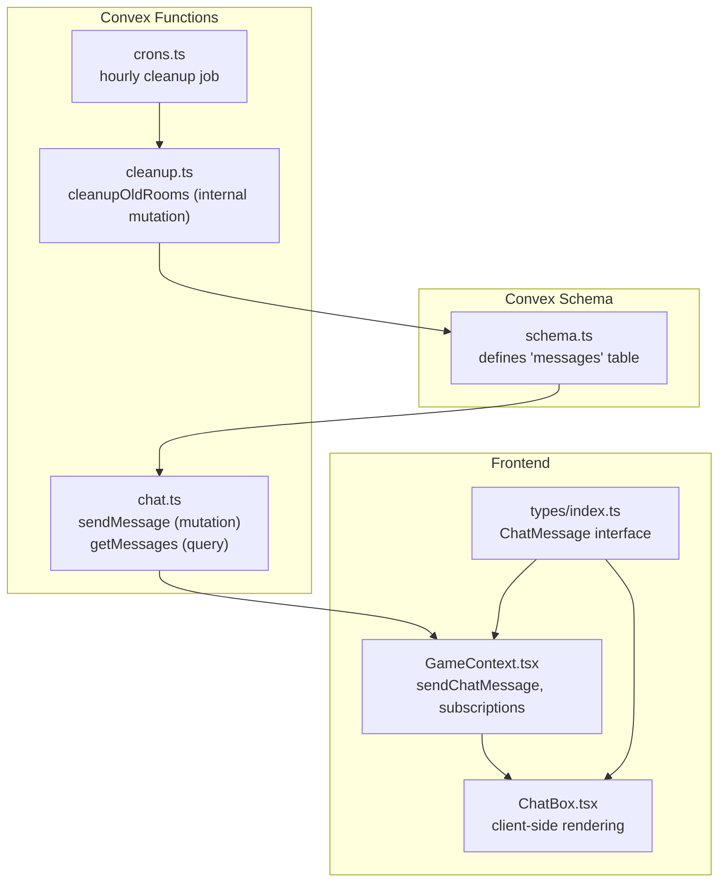
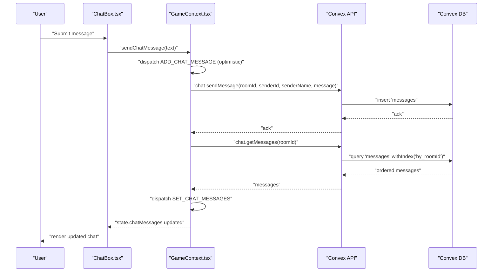
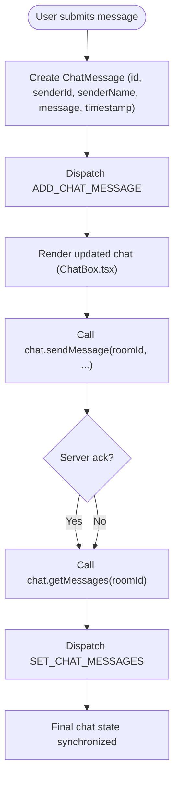
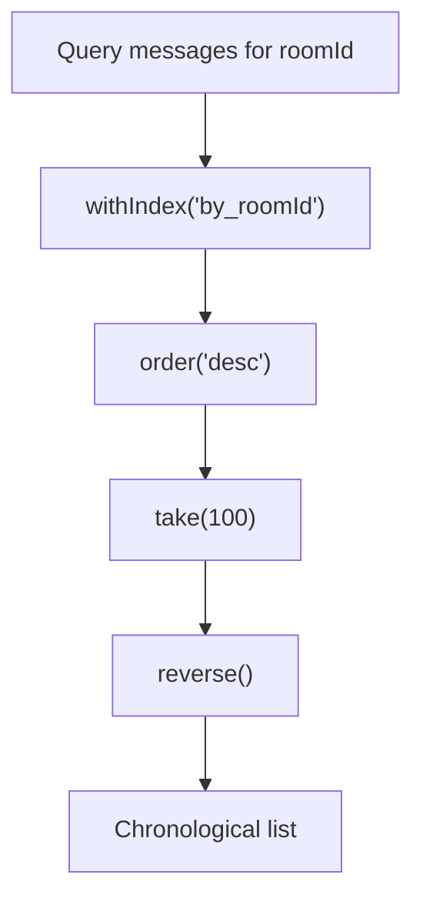
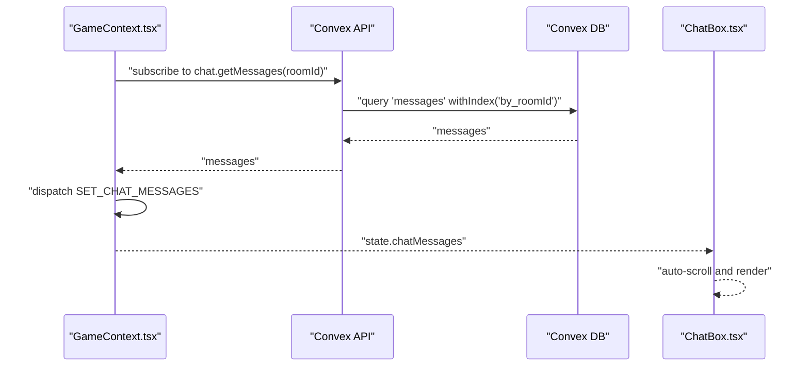
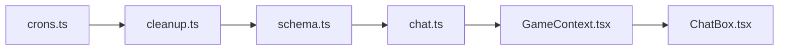

# Messages Collection

<cite>
**Referenced Files in This Document**
- [schema.ts](file://convex/schema.ts)
- [chat.ts](file://convex/chat.ts)
- [index.ts](file://src/types/index.ts)
- [GameContext.tsx](file://src/context/GameContext.tsx)
- [ChatBox.tsx](file://src/components/ChatBox.tsx)
- [cleanup.ts](file://convex/cleanup.ts)
- [crons.ts](file://convex/crons.ts)
</cite>

## Table of Contents
1. [Introduction](#introduction)
2. [Project Structure](#project-structure)
3. [Core Components](#core-components)
4. [Architecture Overview](#architecture-overview)
5. [Detailed Component Analysis](#detailed-component-analysis)
6. [Dependency Analysis](#dependency-analysis)
7. [Performance Considerations](#performance-considerations)
8. [Security Considerations](#security-considerations)
9. [Troubleshooting Guide](#troubleshooting-guide)
10. [Conclusion](#conclusion)

## Introduction
This document describes the messages collection used for chat functionality in the sen-web application. It explains the schema fields, the ChatMessage interface, how messages are appended to GameState.chatMessages, the indexes used for efficient queries, and how real-time synchronization works via Convex subscriptions. It also covers common operations, client-side rendering, performance considerations, security aspects, and backend integration.

## Project Structure
The messages collection is defined in the Convex schema and exposed through chat functions. Frontend components render messages and trigger sending via Convex mutations and queries. Cleanup jobs remove stale rooms and their associated messages.

**Diagram sources**
- [schema.ts](file://convex/schema.ts#L31-L40)
- [chat.ts](file://convex/chat.ts#L1-L35)
- [cleanup.ts](file://convex/cleanup.ts#L1-L68)
- [crons.ts](file://convex/crons.ts#L1-L15)
- [index.ts](file://src/types/index.ts#L29-L35)
- [GameContext.tsx](file://src/context/GameContext.tsx#L590-L700)
- [ChatBox.tsx](file://src/components/ChatBox.tsx#L1-L68)

**Section sources**
- [schema.ts](file://convex/schema.ts#L31-L40)
- [chat.ts](file://convex/chat.ts#L1-L35)
- [index.ts](file://src/types/index.ts#L29-L35)
- [GameContext.tsx](file://src/context/GameContext.tsx#L590-L700)
- [ChatBox.tsx](file://src/components/ChatBox.tsx#L1-L68)
- [cleanup.ts](file://convex/cleanup.ts#L1-L68)
- [crons.ts](file://convex/crons.ts#L1-L15)

## Core Components
- Messages table schema with fields: roomId, senderId, senderName, message, timestamp.
- Indexes: by_roomId for room-scoped queries and by_timestamp for ordering.
- ChatMessage interface in types/index.ts aligns with stored fields plus an id.
- Frontend state management appends messages to GameState.chatMessages.
- Convex chat functions insert new messages and return recent messages for a room.

**Section sources**
- [schema.ts](file://convex/schema.ts#L31-L40)
- [index.ts](file://src/types/index.ts#L29-L35)
- [chat.ts](file://convex/chat.ts#L1-L35)

## Architecture Overview
Real-time chat relies on Convex subscriptions. The frontend subscribes to messages for the current room and updates local state. Sending a message first optimistically appends to local chatMessages and then persists via a mutation.

**Diagram sources**
- [ChatBox.tsx](file://src/components/ChatBox.tsx#L1-L68)
- [GameContext.tsx](file://src/context/GameContext.tsx#L590-L700)
- [chat.ts](file://convex/chat.ts#L1-L35)

## Detailed Component Analysis

### Messages Table Schema and Fields
- roomId: string. Room identifier used to scope messages.
- senderId: string. Player identifier of the author.
- senderName: string. Player display name.
- message: string. Plain-text chat content.
- timestamp: number. Unix milliseconds for ordering.

Indexes:
- by_roomId: ["roomId"] enables fast room-scoped queries.
- by_timestamp: ["timestamp"] enables chronological ordering.

These indexes support:
- Retrieving chat history within a room efficiently.
- Ordering messages chronologically for display.

**Section sources**
- [schema.ts](file://convex/schema.ts#L31-L40)

### ChatMessage Interface
The ChatMessage interface defines the shape used in client-side state:
- id: string. Unique client-side identifier for DOM keys and optimistic updates.
- senderId: string. Matches stored senderId.
- senderName: string. Matches stored senderName.
- message: string. Matches stored message.
- timestamp: number. Matches stored timestamp.

GameState.chatMessages is an array of ChatMessage used by ChatBox.tsx to render messages.

**Section sources**
- [index.ts](file://src/types/index.ts#L29-L35)
- [GameContext.tsx](file://src/context/GameContext.tsx#L47-L61)

### Appending Messages to GameState.chatMessages
- Optimistic append: When a user submits a message, GameContext.tsx creates a ChatMessage with a client-generated id and dispatches ADD_CHAT_MESSAGE to append it immediately.
- Remote sync: Convex subscriptions fetch getMessages(roomId) and replace chatMessages with the latest server-backed array, ensuring eventual consistency.

**Diagram sources**
- [GameContext.tsx](file://src/context/GameContext.tsx#L919-L953)
- [chat.ts](file://convex/chat.ts#L1-L35)

**Section sources**
- [GameContext.tsx](file://src/context/GameContext.tsx#L47-L61)
- [GameContext.tsx](file://src/context/GameContext.tsx#L684-L700)
- [GameContext.tsx](file://src/context/GameContext.tsx#L919-L953)

### Two Indexes: by_roomId and by_timestamp
- by_roomId: Enables querying messages for a specific room and ordering by descending timestamp, then reversing to chronological order.
- by_timestamp: Enables ordering by timestamp for chronological presentation.

**Diagram sources**
- [chat.ts](file://convex/chat.ts#L23-L33)

**Section sources**
- [schema.ts](file://convex/schema.ts#L38-L39)
- [chat.ts](file://convex/chat.ts#L23-L33)

### Common Operations
- Insert a new message:
  - Client: dispatch ADD_CHAT_MESSAGE with a client-generated id.
  - Server: chat.sendMessage inserts into messages with timestamp set to Date.now().
- Query the last N messages:
  - chat.getMessages uses by_roomId, orders desc, takes 100, then reverses to chronological order.

Notes:
- The current limit is 100 messages per room. Adjustments would require changes to getMessages and potentially pagination on the client.

**Section sources**
- [chat.ts](file://convex/chat.ts#L1-L35)
- [GameContext.tsx](file://src/context/GameContext.tsx#L919-L953)

### Real-time Synchronization and Client-side Rendering
- Subscriptions: GameContext.tsx subscribes to chat.getMessages(roomId) and replaces chatMessages with the returned array.
- Rendering: ChatBox.tsx maps chatMessages to DOM nodes, auto-scrolling to the bottom when new messages arrive.

**Diagram sources**
- [GameContext.tsx](file://src/context/GameContext.tsx#L590-L700)
- [ChatBox.tsx](file://src/components/ChatBox.tsx#L1-L68)

**Section sources**
- [GameContext.tsx](file://src/context/GameContext.tsx#L590-L700)
- [ChatBox.tsx](file://src/components/ChatBox.tsx#L1-L68)

## Dependency Analysis
- schema.ts defines the messages table and indexes.
- chat.ts exposes sendMessage and getMessages.
- GameContext.tsx orchestrates subscriptions and message sending.
- ChatBox.tsx renders messages and triggers sending.
- cleanup.ts and crons.ts remove old rooms and their messages.

**Diagram sources**
- [schema.ts](file://convex/schema.ts#L31-L40)
- [chat.ts](file://convex/chat.ts#L1-L35)
- [GameContext.tsx](file://src/context/GameContext.tsx#L590-L700)
- [ChatBox.tsx](file://src/components/ChatBox.tsx#L1-L68)
- [crons.ts](file://convex/crons.ts#L1-L15)
- [cleanup.ts](file://convex/cleanup.ts#L1-L68)

**Section sources**
- [schema.ts](file://convex/schema.ts#L31-L40)
- [chat.ts](file://convex/chat.ts#L1-L35)
- [GameContext.tsx](file://src/context/GameContext.tsx#L590-L700)
- [ChatBox.tsx](file://src/components/ChatBox.tsx#L1-L68)
- [cleanup.ts](file://convex/cleanup.ts#L1-L68)
- [crons.ts](file://convex/crons.ts#L1-L15)

## Performance Considerations
- Current limit: getMessages returns up to 100 messages per room. This bounds memory and network usage for clients.
- Pagination: Not implemented at the backend level. If needed, extend getMessages to accept page size and cursor-like parameters and adjust client-side pagination.
- Message retention: cleanupOldRooms removes rooms older than 1 hour and deletes associated messages, preventing database bloat.
- Scalability: The by_roomId index supports efficient room-scoped queries. The by_timestamp index supports chronological ordering. Consider sharding by room or partitioning older data if rooms grow very large.

[No sources needed since this section provides general guidance]

## Security Considerations
- XSS prevention: Stored messages are plain text. While this reduces XSS risk, client-side rendering should still sanitize content if HTML is ever allowed. Currently, messages are treated as plain text.
- Rate limiting: No explicit rate limiting is implemented in the backend. Consider adding rate limiting on sendMessage to prevent spam. Options include per-user or per-room limits with Redis or Convex internal functions.
- Validation: Input validation occurs at the Convex schema level (string types). Consider trimming and length checks on the client before sending to reduce unnecessary writes.

[No sources needed since this section provides general guidance]

## Troubleshooting Guide
- Messages not appearing:
  - Verify room subscription is active (gameMode online and roomId present).
  - Check that getMessages returns messages for the current room.
- Duplicate or out-of-order messages:
  - Ensure client-side optimistic append is followed by SET_CHAT_MESSAGES from subscriptions.
- Stale messages after room cleanup:
  - cleanupOldRooms removes messages for inactive rooms. If a room was cleaned, historical messages are gone.

**Section sources**
- [GameContext.tsx](file://src/context/GameContext.tsx#L590-L700)
- [cleanup.ts](file://convex/cleanup.ts#L1-L68)

## Conclusion
The messages collection provides a simple, efficient chat mechanism with a clear schema, indexes, and straightforward client-server integration. The by_roomId index enables fast room-scoped queries, and by_timestamp supports chronological ordering. Real-time synchronization is handled via Convex subscriptions, and client-side rendering updates instantly. For production, consider adding rate limiting, pagination, and stricter input validation to improve robustness and scalability.