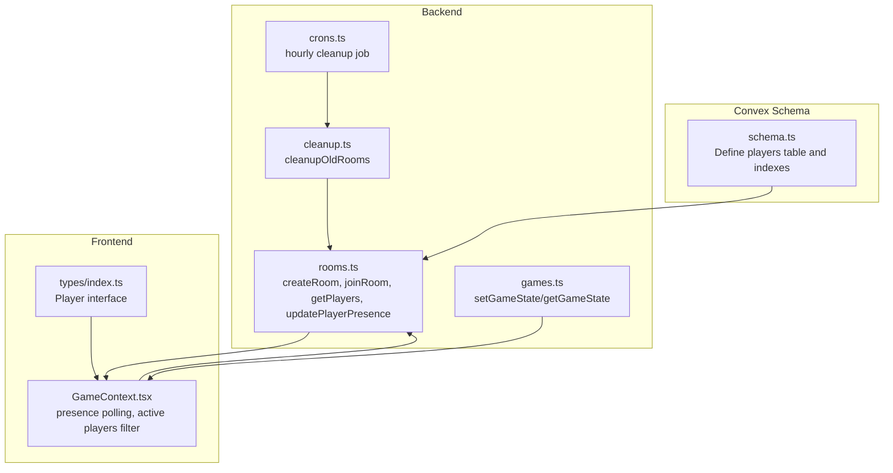
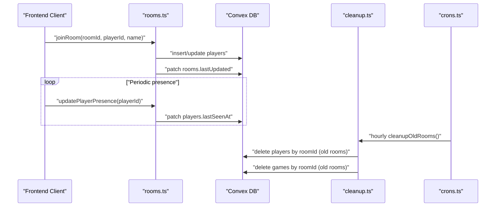
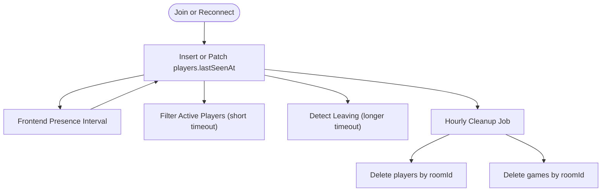
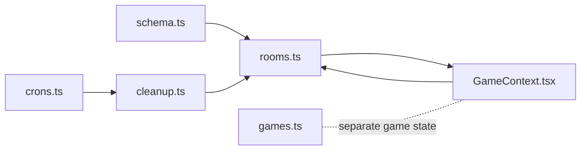

# Players Collection

<cite>
**Referenced Files in This Document**
- [schema.ts](file://convex/schema.ts)
- [rooms.ts](file://convex/rooms.ts)
- [cleanup.ts](file://convex/cleanup.ts)
- [crons.ts](file://convex/crons.ts)
- [games.ts](file://convex/games.ts)
- [GameContext.tsx](file://src/context/GameContext.tsx)
- [index.ts](file://src/types/index.ts)
</cite>

## Table of Contents
1. [Introduction](#introduction)
2. [Project Structure](#project-structure)
3. [Core Components](#core-components)
4. [Architecture Overview](#architecture-overview)
5. [Detailed Component Analysis](#detailed-component-analysis)
6. [Dependency Analysis](#dependency-analysis)
7. [Performance Considerations](#performance-considerations)
8. [Troubleshooting Guide](#troubleshooting-guide)
9. [Conclusion](#conclusion)
10. [Appendices](#appendices)

## Introduction
This document describes the “players” collection in the Convex database and how it tracks player presence within a room. It explains each field’s role, the relationship to the Player interface in the frontend, how presence detection works with lastSeenAt, and how cleanup logic removes stale data. It also provides usage examples, performance tips for batch operations during room joins, and privacy considerations for storing player names and session-based identifiers.

## Project Structure
The “players” collection is defined in the Convex schema and used by backend mutations and queries. Frontend presence updates are triggered by periodic intervals and integrated with lobby/game logic.

**Diagram sources**
- [schema.ts](file://convex/schema.ts#L1-L42)
- [rooms.ts](file://convex/rooms.ts#L1-L119)
- [cleanup.ts](file://convex/cleanup.ts#L1-L68)
- [crons.ts](file://convex/crons.ts#L1-L17)
- [games.ts](file://convex/games.ts#L1-L43)
- [GameContext.tsx](file://src/context/GameContext.tsx#L676-L834)
- [index.ts](file://src/types/index.ts#L1-L20)

**Section sources**
- [schema.ts](file://convex/schema.ts#L1-L42)
- [rooms.ts](file://convex/rooms.ts#L1-L119)
- [cleanup.ts](file://convex/cleanup.ts#L1-L68)
- [crons.ts](file://convex/crons.ts#L1-L17)
- [games.ts](file://convex/games.ts#L1-L43)
- [GameContext.tsx](file://src/context/GameContext.tsx#L676-L834)
- [index.ts](file://src/types/index.ts#L1-L20)

## Core Components
- players table definition and indexes
- backend mutations and queries for player lifecycle
- frontend presence polling and active player filtering
- cleanup job removing abandoned rooms and associated players

Key responsibilities:
- Track room membership and identity of players
- Detect active/inactive players via lastSeenAt
- Enable efficient queries by roomId and by playerId
- Integrate with room cleanup and game state synchronization

**Section sources**
- [schema.ts](file://convex/schema.ts#L15-L22)
- [rooms.ts](file://convex/rooms.ts#L1-L119)
- [cleanup.ts](file://convex/cleanup.ts#L1-L68)
- [crons.ts](file://convex/crons.ts#L1-L17)
- [GameContext.tsx](file://src/context/GameContext.tsx#L676-L834)

## Architecture Overview
The players collection underpins presence tracking and room membership. Backend mutations insert or update player records, while frontend code periodically refreshes lastSeenAt. Room cleanup removes stale rooms and cascades to remove players and game state.

**Diagram sources**
- [rooms.ts](file://convex/rooms.ts#L30-L75)
- [rooms.ts](file://convex/rooms.ts#L100-L117)
- [cleanup.ts](file://convex/cleanup.ts#L1-L68)
- [crons.ts](file://convex/crons.ts#L1-L17)

## Detailed Component Analysis

### Players Collection Fields and Roles
- roomId: string
  - Identifies the room to which a player belongs.
  - Used to query all players in a room and to clean up players when a room is removed.
- playerId: string
  - Session-based identifier for the player (e.g., browser session or device token).
  - Used to deduplicate joins and to update presence.
- name: string
  - Player’s display name.
  - Stored in the players collection; used in lobby UI and chat.
- lastSeenAt: number
  - Unix timestamp of the player’s last presence update.
  - Used to detect active players and to prune inactive sessions.

Indexes:
- by_roomId: ["roomId"]
  - Efficiently retrieves all players in a given room.
- by_playerId: ["playerId"]
  - Enables quick lookups for presence updates and reconnections.

Relationship to Player interface:
- The Player interface in the frontend defines hand and score for gameplay state.
- These fields are stored in the games collection, not in players.
- The players collection stores only identity and presence metadata.

**Section sources**
- [schema.ts](file://convex/schema.ts#L15-L22)
- [rooms.ts](file://convex/rooms.ts#L1-L27)
- [rooms.ts](file://convex/rooms.ts#L30-L75)
- [rooms.ts](file://convex/rooms.ts#L100-L117)
- [games.ts](file://convex/games.ts#L1-L43)
- [index.ts](file://src/types/index.ts#L8-L14)

### Presence Detection and Cleanup Integration
- Presence detection:
  - Frontend sends periodic presence updates to keep lastSeenAt fresh.
  - Active players are filtered client-side using a short timeout window.
  - Longer timeout thresholds help detect when a player likely left mid-game.
- Cleanup:
  - An hourly cron triggers cleanupOldRooms.
  - The cleanup routine deletes players whose rooms are considered abandoned.
  - This prevents orphaned player records and keeps the database tidy.

**Diagram sources**
- [rooms.ts](file://convex/rooms.ts#L53-L75)
- [rooms.ts](file://convex/rooms.ts#L100-L117)
- [GameContext.tsx](file://src/context/GameContext.tsx#L676-L749)
- [cleanup.ts](file://convex/cleanup.ts#L1-L68)
- [crons.ts](file://convex/crons.ts#L1-L17)

**Section sources**
- [rooms.ts](file://convex/rooms.ts#L53-L75)
- [rooms.ts](file://convex/rooms.ts#L100-L117)
- [GameContext.tsx](file://src/context/GameContext.tsx#L676-L749)
- [cleanup.ts](file://convex/cleanup.ts#L1-L68)
- [crons.ts](file://convex/crons.ts#L1-L17)

### Usage Examples
- Adding a new player:
  - Use the joinRoom mutation to insert a new player record with the current timestamp for lastSeenAt.
  - Reference: [rooms.ts](file://convex/rooms.ts#L30-L75)
- Updating lastSeenAt on connection:
  - Use the updatePlayerPresence mutation to refresh lastSeenAt periodically.
  - Reference: [rooms.ts](file://convex/rooms.ts#L100-L117)
- Querying active players:
  - Use getPlayers to fetch all players in a room.
  - Filter by lastSeenAt on the client to compute active players.
  - References: [rooms.ts](file://convex/rooms.ts#L89-L98), [GameContext.tsx](file://src/context/GameContext.tsx#L676-L709)

**Section sources**
- [rooms.ts](file://convex/rooms.ts#L30-L75)
- [rooms.ts](file://convex/rooms.ts#L89-L98)
- [rooms.ts](file://convex/rooms.ts#L100-L117)
- [GameContext.tsx](file://src/context/GameContext.tsx#L676-L709)

### Privacy Considerations
- Player names are stored in the players collection and are visible to other players in the room.
- playerId is a session-based identifier used for presence tracking and deduplication.
- Consider minimizing sensitive data and ensuring compliance with privacy policies when collecting or displaying names.

**Section sources**
- [schema.ts](file://convex/schema.ts#L15-L22)
- [rooms.ts](file://convex/rooms.ts#L1-L27)

## Dependency Analysis
The players collection depends on:
- schema.ts for table definition and indexes
- rooms.ts for player lifecycle operations
- cleanup.ts for room-level pruning
- crons.ts for scheduling cleanup
- games.ts for game state storage (not player state)
- GameContext.tsx for presence polling and active player computation

**Diagram sources**
- [schema.ts](file://convex/schema.ts#L1-L42)
- [rooms.ts](file://convex/rooms.ts#L1-L119)
- [cleanup.ts](file://convex/cleanup.ts#L1-L68)
- [crons.ts](file://convex/crons.ts#L1-L17)
- [games.ts](file://convex/games.ts#L1-L43)
- [GameContext.tsx](file://src/context/GameContext.tsx#L676-L834)

**Section sources**
- [schema.ts](file://convex/schema.ts#L1-L42)
- [rooms.ts](file://convex/rooms.ts#L1-L119)
- [cleanup.ts](file://convex/cleanup.ts#L1-L68)
- [crons.ts](file://convex/crons.ts#L1-L17)
- [games.ts](file://convex/games.ts#L1-L43)
- [GameContext.tsx](file://src/context/GameContext.tsx#L676-L834)

## Performance Considerations
- Batch operations during room joins:
  - Prefer a single joinRoom call to insert or update a player and refresh lastSeenAt atomically.
  - Avoid issuing separate insert and patch calls; rely on the existing conditional logic in joinRoom.
  - Reference: [rooms.ts](file://convex/rooms.ts#L30-L75)
- Index usage:
  - Ensure queries leverage by_roomId for fetching all players in a room.
  - Use by_playerId for presence updates and reconnections.
  - References: [schema.ts](file://convex/schema.ts#L15-L22), [rooms.ts](file://convex/rooms.ts#L89-L98), [rooms.ts](file://convex/rooms.ts#L100-L117)
- Presence polling cadence:
  - Frontend updates lastSeenAt every 10 seconds; adjust based on traffic and latency.
  - Reference: [GameContext.tsx](file://src/context/GameContext.tsx#L789-L834)
- Cleanup overhead:
  - Cleanup runs hourly; ensure room activity thresholds are appropriate to avoid excessive deletions.
  - Reference: [crons.ts](file://convex/crons.ts#L1-L17), [cleanup.ts](file://convex/cleanup.ts#L1-L68)

**Section sources**
- [rooms.ts](file://convex/rooms.ts#L30-L75)
- [schema.ts](file://convex/schema.ts#L15-L22)
- [GameContext.tsx](file://src/context/GameContext.tsx#L789-L834)
- [crons.ts](file://convex/crons.ts#L1-L17)
- [cleanup.ts](file://convex/cleanup.ts#L1-L68)

## Troubleshooting Guide
- Player not appearing in lobby:
  - Verify getPlayers returns the expected list for the room.
  - Confirm lastSeenAt timestamps are recent; otherwise, the player may be filtered out as inactive.
  - References: [rooms.ts](file://convex/rooms.ts#L89-L98), [GameContext.tsx](file://src/context/GameContext.tsx#L676-L709)
- Frequent disconnect/reconnect:
  - Ensure updatePlayerPresence is invoked periodically; otherwise, the player may appear inactive.
  - Reference: [rooms.ts](file://convex/rooms.ts#L100-L117), [GameContext.tsx](file://src/context/GameContext.tsx#L789-L834)
- Abandoned room cleanup:
  - If a room disappears, confirm cleanupOldRooms ran and removed players and game state.
  - Reference: [cleanup.ts](file://convex/cleanup.ts#L1-L68), [crons.ts](file://convex/crons.ts#L1-L17)

**Section sources**
- [rooms.ts](file://convex/rooms.ts#L89-L98)
- [rooms.ts](file://convex/rooms.ts#L100-L117)
- [GameContext.tsx](file://src/context/GameContext.tsx#L676-L709)
- [cleanup.ts](file://convex/cleanup.ts#L1-L68)
- [crons.ts](file://convex/crons.ts#L1-L17)

## Conclusion
The players collection provides lightweight, presence-driven room membership tracking. Its schema and indexes enable efficient queries, while frontend presence polling and cleanup jobs keep the dataset healthy. Player state (hand, score) is intentionally stored separately in the games collection, aligning with separation of concerns and simplifying data ownership.

## Appendices

### Field Reference
- roomId: string — room membership
- playerId: string — session-based identity
- name: string — display name
- lastSeenAt: number — timestamp for presence detection

**Section sources**
- [schema.ts](file://convex/schema.ts#L15-L22)

### Index Reference
- by_roomId: ["roomId"] — list players in a room
- by_playerId: ["playerId"] — fast presence updates and lookups

**Section sources**
- [schema.ts](file://convex/schema.ts#L15-L22)