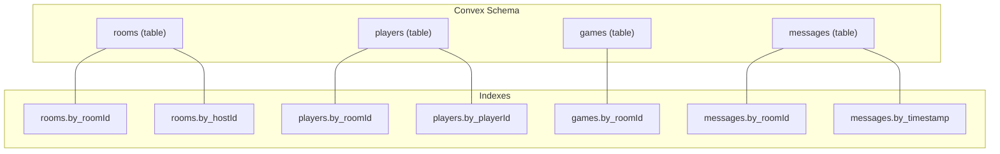
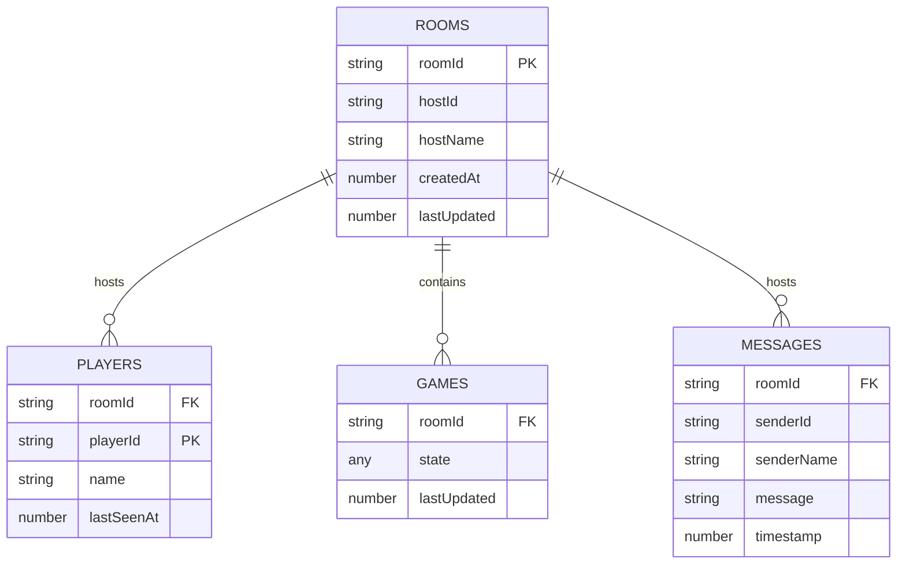
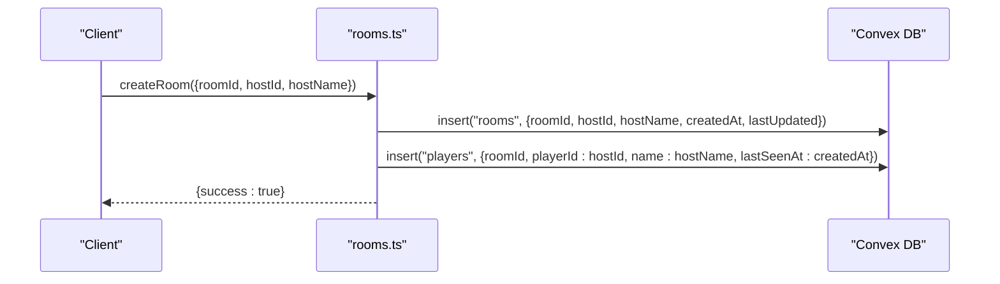
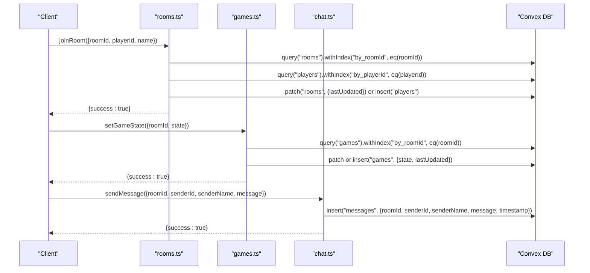
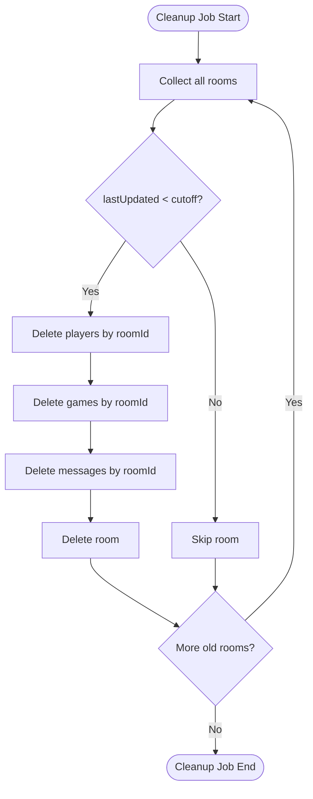
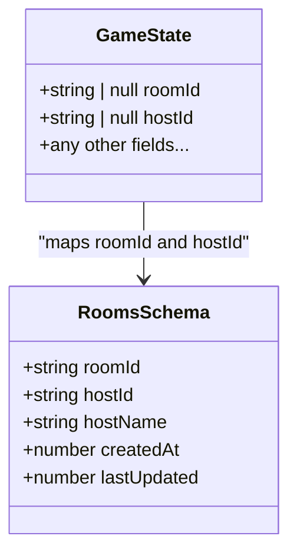
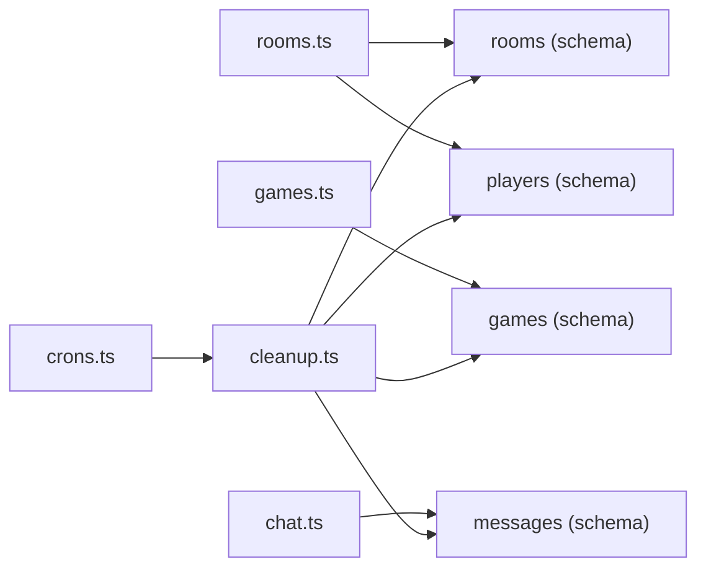

# Rooms Collection

<cite>
**Referenced Files in This Document**
- [schema.ts](file://convex/schema.ts)
- [rooms.ts](file://convex/rooms.ts)
- [games.ts](file://convex/games.ts)
- [chat.ts](file://convex/chat.ts)
- [cleanup.ts](file://convex/cleanup.ts)
- [crons.ts](file://convex/crons.ts)
- [index.ts](file://src/types/index.ts)
- [README.md](file://README.md)
</cite>

## Table of Contents
1. [Introduction](#introduction)
2. [Project Structure](#project-structure)
3. [Core Components](#core-components)
4. [Architecture Overview](#architecture-overview)
5. [Detailed Component Analysis](#detailed-component-analysis)
6. [Dependency Analysis](#dependency-analysis)
7. [Performance Considerations](#performance-considerations)
8. [Troubleshooting Guide](#troubleshooting-guide)
9. [Conclusion](#conclusion)
10. [Appendices](#appendices)

## Introduction
This document provides comprehensive data model documentation for the rooms collection in the Convex database. It explains the schema definition, field semantics, and constraints; describes how rooms act as the root container for multiplayer sessions and link to players, games, and messages via roomId; documents the indexes used for efficient lookups; maps room metadata to the GameState interface; and outlines common queries, performance considerations, lifecycle management via a cleanup cron job, and security implications.

## Project Structure
The rooms collection is part of the Convex backend schema and is closely integrated with related collections for players, games, and messages. The cleanup process and scheduling are implemented separately and orchestrated via cron jobs.

**Diagram sources**
- [schema.ts](file://convex/schema.ts#L1-L42)

**Section sources**
- [schema.ts](file://convex/schema.ts#L1-L42)

## Core Components
The rooms collection defines the core entity representing a multiplayer session. It includes identifiers and timestamps that enable efficient lookups and lifecycle management.

- Field: roomId
  - Type: string
  - Purpose: Unique identifier for the room; primary key for room-level operations
  - Constraints: Indexed via by_roomId; used to link players, games, and messages
  - Example usage: Creating a room, joining a room, querying by room ID

- Field: hostId
  - Type: string
  - Purpose: Identifier of the room’s creator/host
  - Constraints: Indexed via by_hostId; enables host-based queries
  - Example usage: Finding rooms hosted by a specific user

- Field: hostName
  - Type: string
  - Purpose: Public display name of the host
  - Constraints: No explicit validation; stored as-is
  - Security note: Publicly visible; consider moderation or sanitization if used in public listings

- Field: createdAt
  - Type: number (Unix timestamp)
  - Purpose: Creation time of the room
  - Constraints: Immutable after creation; used for sorting and cleanup decisions

- Field: lastUpdated
  - Type: number (Unix timestamp)
  - Purpose: Last activity timestamp for the room
  - Constraints: Updated on join and periodic presence updates; used by cleanup job

Indexes:
- by_roomId: Efficient room lookups and cross-table joins
- by_hostId: Host-based queries for listing rooms hosted by a user

**Section sources**
- [schema.ts](file://convex/schema.ts#L1-L42)
- [rooms.ts](file://convex/rooms.ts#L1-L119)

## Architecture Overview
Rooms serve as the central hub for multiplayer sessions. They coordinate:
- Player enrollment and presence tracking
- Game state persistence
- Chat message history

**Diagram sources**
- [schema.ts](file://convex/schema.ts#L1-L42)

## Detailed Component Analysis

### Rooms Schema and Indexes
- Schema definition and indexes are declared in the Convex schema.
- The rooms table is indexed on roomId and hostId to support fast lookups.

Common operations:
- Create room: Inserts a new room record and adds the host as a player.
- Join room: Validates room existence, manages player presence, and updates room lastUpdated.
- Get room: Fetches a room by roomId using the by_roomId index.
- Get players: Lists all players in a room using the players.by_roomId index.
- Update player presence: Updates lastSeenAt for a given player.

**Diagram sources**
- [rooms.ts](file://convex/rooms.ts#L1-L28)

**Section sources**
- [schema.ts](file://convex/schema.ts#L1-L42)
- [rooms.ts](file://convex/rooms.ts#L1-L119)

### Cross-Collection Relationships
- Players: Linked to rooms via roomId; indexed by roomId and playerId.
- Games: Linked to rooms via roomId; stores serialized GameState.
- Messages: Linked to rooms via roomId; indexed by roomId and timestamp.

**Diagram sources**
- [rooms.ts](file://convex/rooms.ts#L30-L75)
- [games.ts](file://convex/games.ts#L1-L43)
- [chat.ts](file://convex/chat.ts#L1-L33)

**Section sources**
- [rooms.ts](file://convex/rooms.ts#L30-L75)
- [games.ts](file://convex/games.ts#L1-L43)
- [chat.ts](file://convex/chat.ts#L1-L33)

### Data Lifecycle Management via Cleanup
Inactive rooms are removed by a scheduled cleanup job that:
- Identifies rooms older than a threshold based on lastUpdated
- Deletes associated players, games, and messages
- Removes the room itself

**Diagram sources**
- [cleanup.ts](file://convex/cleanup.ts#L1-L68)
- [crons.ts](file://convex/crons.ts#L1-L17)

**Section sources**
- [cleanup.ts](file://convex/cleanup.ts#L1-L68)
- [crons.ts](file://convex/crons.ts#L1-L17)

### Mapping Room Metadata to GameState
The GameState interface includes roomId and hostId fields that align with the rooms collection:
- roomId: string | null
- hostId: string | null

These fields are populated during room creation and used to synchronize game state across clients.

**Diagram sources**
- [index.ts](file://src/types/index.ts#L37-L79)
- [schema.ts](file://convex/schema.ts#L1-L42)

**Section sources**
- [index.ts](file://src/types/index.ts#L37-L79)
- [schema.ts](file://convex/schema.ts#L1-L42)

## Dependency Analysis
The rooms collection depends on and interacts with other tables and functions:

- rooms.ts depends on:
  - rooms.by_roomId for room lookups
  - players.by_playerId for player presence checks
- games.ts depends on:
  - games.by_roomId for game state persistence
- chat.ts depends on:
  - messages.by_roomId for message retrieval
  - messages.by_timestamp for ordering
- cleanup.ts depends on:
  - rooms.lastUpdated to determine inactivity
  - players.by_roomId, games.by_roomId, messages.by_roomId to cascade-delete related records

**Diagram sources**
- [rooms.ts](file://convex/rooms.ts#L1-L119)
- [games.ts](file://convex/games.ts#L1-L43)
- [chat.ts](file://convex/chat.ts#L1-L33)
- [cleanup.ts](file://convex/cleanup.ts#L1-L68)
- [crons.ts](file://convex/crons.ts#L1-L17)
- [schema.ts](file://convex/schema.ts#L1-L42)

**Section sources**
- [rooms.ts](file://convex/rooms.ts#L1-L119)
- [games.ts](file://convex/games.ts#L1-L43)
- [chat.ts](file://convex/chat.ts#L1-L33)
- [cleanup.ts](file://convex/cleanup.ts#L1-L68)
- [crons.ts](file://convex/crons.ts#L1-L17)
- [schema.ts](file://convex/schema.ts#L1-L42)

## Performance Considerations
- Index usage:
  - by_roomId: Essential for room-scoped queries (getRoom, getPlayers, setGameState/getGameState, getMessages).
  - by_hostId: Enables host-based filtering for listing rooms hosted by a user.
  - players.by_playerId: Supports presence updates and deduplication.
- Query efficiency:
  - Prefer index-backed queries over full scans for room and player lookups.
  - Use withIndex for exact equality filters to leverage indexes effectively.
- Cleanup cadence:
  - Hourly cleanup reduces database bloat and maintains query performance by removing stale data.
- Timestamp fields:
  - createdAt and lastUpdated are numeric timestamps; ensure consistent time sources across clients.

[No sources needed since this section provides general guidance]

## Troubleshooting Guide
- Room not found errors:
  - Occur when attempting to join a room that does not exist or has been cleaned up.
  - Clients should handle this gracefully and prompt users to create a new room or confirm the room ID.
- Presence and activity:
  - If a room appears empty despite recent activity, verify that lastUpdated is being refreshed on join and presence updates.
- Cleanup timing:
  - Rooms inactive for longer than the configured timeout are removed along with associated data. Confirm cron schedule alignment with operational requirements.

**Section sources**
- [rooms.ts](file://convex/rooms.ts#L30-L75)
- [cleanup.ts](file://convex/cleanup.ts#L1-L68)
- [crons.ts](file://convex/crons.ts#L1-L17)

## Conclusion
The rooms collection is the central entity for multiplayer sessions, linking players, games, and messages through roomId. Its schema and indexes enable efficient lookups, while the cleanup cron job ensures data hygiene by removing inactive rooms and their related records. The GameState interface aligns with room metadata to synchronize game state across clients. Proper index usage and lifecycle management contribute to predictable performance and reliability.

[No sources needed since this section summarizes without analyzing specific files]

## Appendices

### Common Queries and Examples
- Find a room by ID:
  - Use getRoom with by_roomId index.
  - Reference: [rooms.ts](file://convex/rooms.ts#L78-L87)
- Retrieve all rooms hosted by a user:
  - Query rooms by hostId using by_hostId index.
  - Reference: [schema.ts](file://convex/schema.ts#L1-L42)
- List players in a room:
  - Use getPlayers with players.by_roomId index.
  - Reference: [rooms.ts](file://convex/rooms.ts#L89-L98)
- Get recent chat messages for a room:
  - Use getMessages with messages.by_roomId and order by timestamp.
  - Reference: [chat.ts](file://convex/chat.ts#L1-L33)

**Section sources**
- [rooms.ts](file://convex/rooms.ts#L78-L98)
- [chat.ts](file://convex/chat.ts#L1-L33)
- [schema.ts](file://convex/schema.ts#L1-L42)

### Security Implications and Abuse Mitigation
- Public display of hostName:
  - Storing hostName in the rooms collection makes it publicly visible. Consider moderation or sanitization if used in public listings.
- Room enumeration:
  - Use by_hostId to limit exposure of room IDs to authorized users only.
- Cleanup policy:
  - Automatic removal of inactive rooms helps prevent long-lived abandoned sessions from accumulating.
- Operational notes:
  - The README highlights automatic room cleanup and maintenance via cron jobs.
  - Reference: [README.md](file://README.md#L1-L68)

**Section sources**
- [schema.ts](file://convex/schema.ts#L1-L42)
- [cleanup.ts](file://convex/cleanup.ts#L1-L68)
- [crons.ts](file://convex/crons.ts#L1-L17)
- [README.md](file://README.md#L1-L68)