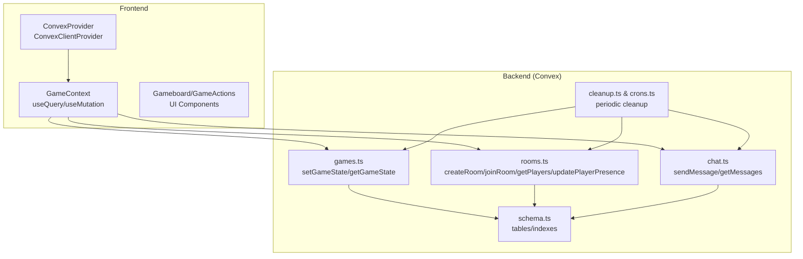
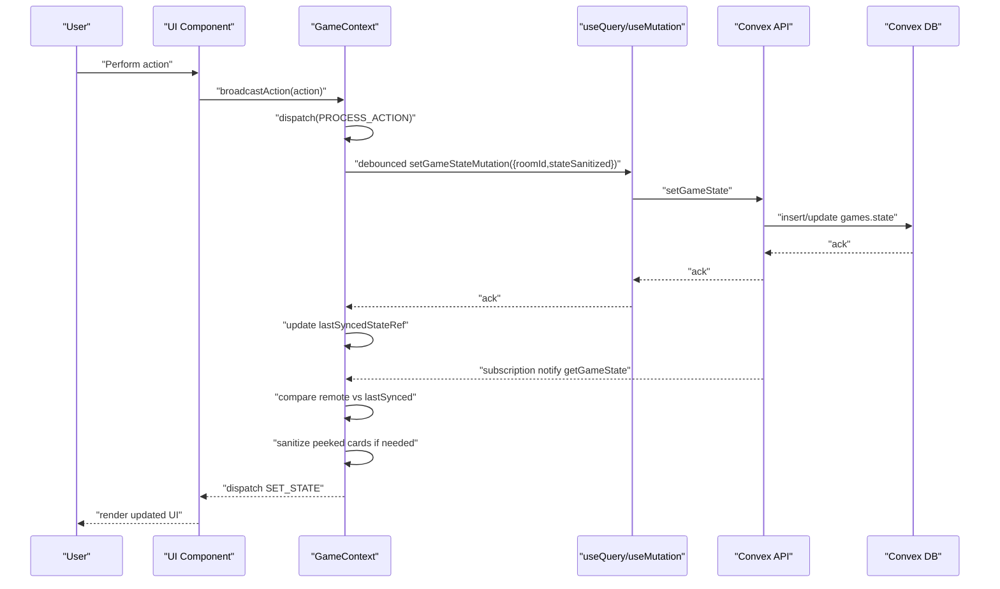
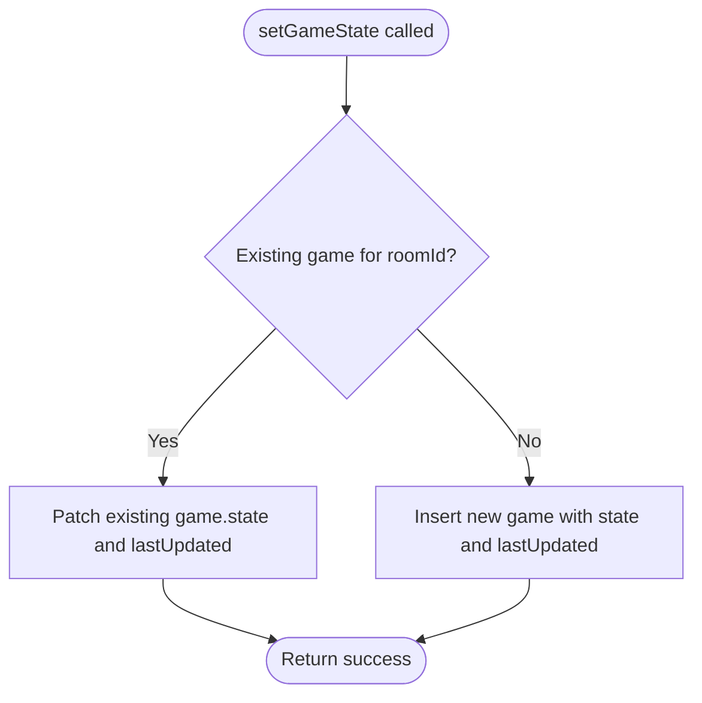
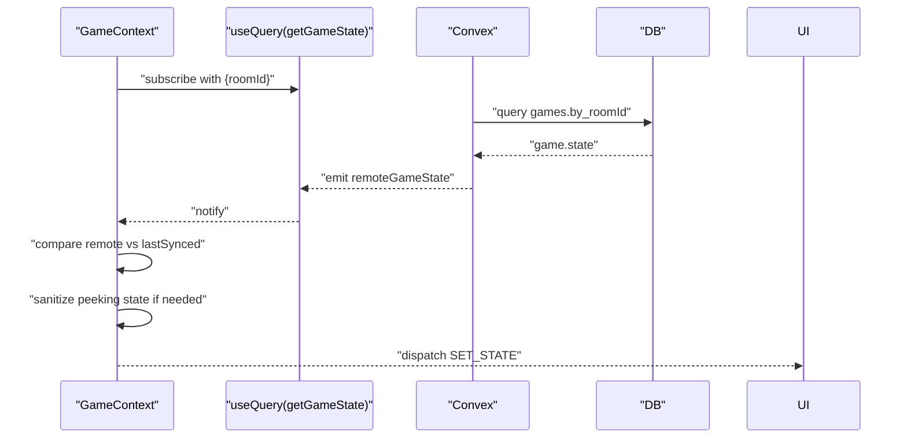
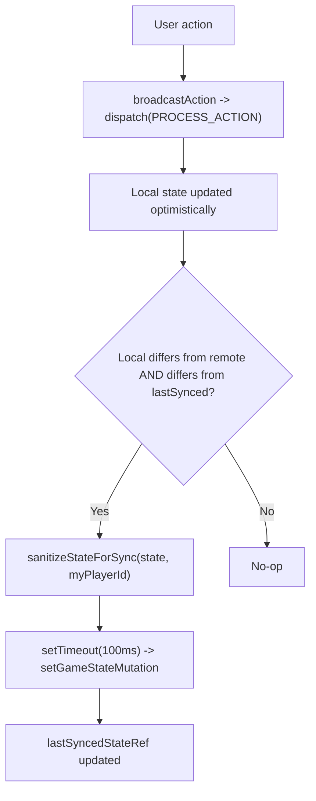
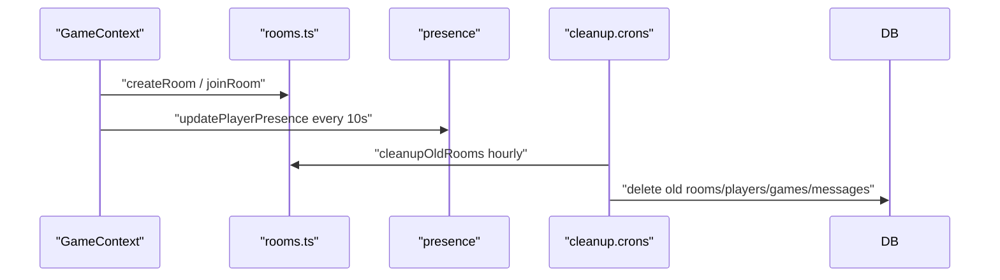
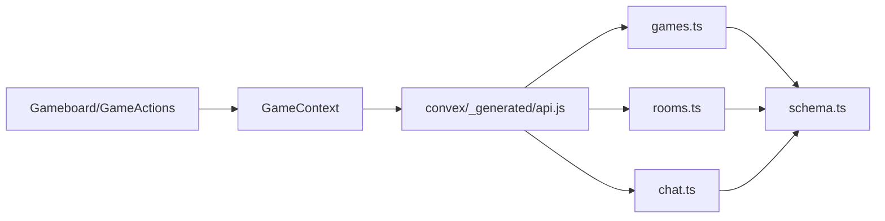

# Real-time Synchronization

<cite>
**Referenced Files in This Document**
- [README.md](file://README.md)
- [convex/games.ts](file://convex/games.ts)
- [convex/schema.ts](file://convex/schema.ts)
- [convex/rooms.ts](file://convex/rooms.ts)
- [convex/chat.ts](file://convex/chat.ts)
- [convex/cleanup.ts](file://convex/cleanup.ts)
- [convex/crons.ts](file://convex/crons.ts)
- [src/context/GameContext.tsx](file://src/context/GameContext.tsx)
- [src/ConvexProvider.tsx](file://src/ConvexProvider.tsx)
- [src/components/Gameboard.tsx](file://src/components/Gameboard.tsx)
- [src/components/GameActions.tsx](file://src/components/GameActions.tsx)
- [convex/_generated/api.js](file://convex/_generated/api.js)
- [convex/_generated/server.js](file://convex/_generated/server.js)
- [convex/_generated/server.d.ts](file://convex/_generated/server.d.ts)
</cite>

## Table of Contents
1. [Introduction](#introduction)
2. [Project Structure](#project-structure)
3. [Core Components](#core-components)
4. [Architecture Overview](#architecture-overview)
5. [Detailed Component Analysis](#detailed-component-analysis)
6. [Dependency Analysis](#dependency-analysis)
7. [Performance Considerations](#performance-considerations)
8. [Troubleshooting Guide](#troubleshooting-guide)
9. [Conclusion](#conclusion)

## Introduction
This document explains the real-time synchronization system in sen-web. It focuses on how Convex query subscriptions enable automatic UI updates when game state changes, with emphasis on the getGameState query and its integration with React’s useQuery hook. It documents the end-to-end flow from user action to mutation, database update, subscription notification, and UI refresh. It also covers synchronization latency characteristics, conflict resolution (last-write-wins via setGameState), offline behavior, concurrent updates from multiple players, consistency across clients, performance considerations, and debugging guidance.

## Project Structure
The real-time synchronization spans the frontend React application and the Convex backend:
- Frontend:
  - Convex provider setup and React hooks usage
  - GameContext orchestrating state transitions and synchronization
  - UI components consuming synchronized state
- Backend:
  - Convex functions for game state, rooms, chat, and cleanup
  - Schema defining tables and indexes used by subscriptions

**Diagram sources**
- [src/ConvexProvider.tsx](file://src/ConvexProvider.tsx#L1-L18)
- [src/context/GameContext.tsx](file://src/context/GameContext.tsx#L574-L1152)
- [convex/games.ts](file://convex/games.ts#L1-L43)
- [convex/rooms.ts](file://convex/rooms.ts#L1-L119)
- [convex/chat.ts](file://convex/chat.ts#L1-L35)
- [convex/schema.ts](file://convex/schema.ts#L1-L42)
- [convex/cleanup.ts](file://convex/cleanup.ts#L1-L41)
- [convex/crons.ts](file://convex/crons.ts#L1-L15)

**Section sources**
- [README.md](file://README.md#L39-L70)
- [src/ConvexProvider.tsx](file://src/ConvexProvider.tsx#L1-L18)
- [src/context/GameContext.tsx](file://src/context/GameContext.tsx#L574-L787)
- [convex/schema.ts](file://convex/schema.ts#L1-L42)

## Core Components
- ConvexProvider: Initializes the Convex client from environment configuration and wraps the app.
- GameContext: Centralizes game state, orchestrates local actions, and manages synchronization with Convex.
- Convex functions:
  - setGameState: Last-write-wins mutation that persists the latest game state for a room.
  - getGameState: Subscription-backed query that returns the current game state for a room.
  - Rooms and chat functions: Support room lifecycle and chat subscriptions.
- UI components: Render synchronized state and trigger actions that propagate through the system.

Key integration points:
- useQuery(api.games.getGameState, { roomId }) subscribes to game state changes.
- useMutation(api.games.setGameState) pushes local changes to the backend.
- Presence and chat subscriptions keep the UI responsive and up to date.

**Section sources**
- [src/ConvexProvider.tsx](file://src/ConvexProvider.tsx#L1-L18)
- [src/context/GameContext.tsx](file://src/context/GameContext.tsx#L574-L787)
- [convex/games.ts](file://convex/games.ts#L1-L43)
- [convex/rooms.ts](file://convex/rooms.ts#L1-L119)
- [convex/chat.ts](file://convex/chat.ts#L1-L35)

## Architecture Overview
The system uses optimistic UI with eventual consistency:
- Local actions update the React state immediately.
- A debounced effect compares local state to remote state and last-synced state, sanitizing sensitive cards during peeking, then writes via setGameState.
- Subscriptions to getGameState notify all clients when the database changes, and GameContext applies the remote state to the UI.

**Diagram sources**
- [src/context/GameContext.tsx](file://src/context/GameContext.tsx#L883-L953)
- [src/context/GameContext.tsx](file://src/context/GameContext.tsx#L616-L709)
- [convex/games.ts](file://convex/games.ts#L1-L43)
- [convex/schema.ts](file://convex/schema.ts#L24-L30)

## Detailed Component Analysis

### Convex getGameState and setGameState
- getGameState: Reads the serialized GameState from the games table by roomId index and returns it to subscribers.
- setGameState: Upserts the game document for a roomId with the provided state and lastUpdated timestamp. This enables last-write-wins semantics.

**Diagram sources**
- [convex/games.ts](file://convex/games.ts#L1-L43)

**Section sources**
- [convex/games.ts](file://convex/games.ts#L1-L43)
- [convex/schema.ts](file://convex/schema.ts#L24-L30)

### React useQuery subscription to getGameState
- GameContext subscribes to getGameState with roomId when online and the room is known.
- On subscription updates, it compares remote state to lastSynced state and applies SET_STATE to the UI.
- During peeking, it merges local peeked cards with remote state to preserve visibility of cards the current player peeked locally.

**Diagram sources**
- [src/context/GameContext.tsx](file://src/context/GameContext.tsx#L594-L709)
- [convex/games.ts](file://convex/games.ts#L32-L41)
- [convex/schema.ts](file://convex/schema.ts#L24-L30)

**Section sources**
- [src/context/GameContext.tsx](file://src/context/GameContext.tsx#L594-L709)

### Local action processing and optimistic updates
- UI components call broadcastAction, which dispatches PROCESS_ACTION to update local state immediately.
- A debounced effect detects that local state differs from remote and lastSynced, sanitizes state (especially peeked cards), and calls setGameState to persist.

**Diagram sources**
- [src/context/GameContext.tsx](file://src/context/GameContext.tsx#L818-L953)
- [src/context/GameContext.tsx](file://src/context/GameContext.tsx#L883-L953)

**Section sources**
- [src/context/GameContext.tsx](file://src/context/GameContext.tsx#L818-L953)

### Room lifecycle and presence
- Rooms support creation, joining, and presence updates.
- Presence updates occur periodically to detect player activity and disconnections.
- Cleanup jobs remove old rooms and their data.

**Diagram sources**
- [convex/rooms.ts](file://convex/rooms.ts#L1-L119)
- [convex/cleanup.ts](file://convex/cleanup.ts#L1-L41)
- [convex/crons.ts](file://convex/crons.ts#L1-L15)

**Section sources**
- [convex/rooms.ts](file://convex/rooms.ts#L1-L119)
- [convex/cleanup.ts](file://convex/cleanup.ts#L1-L41)
- [convex/crons.ts](file://convex/crons.ts#L1-L15)

### Chat and lobby synchronization
- Chat messages are subscribed to and rendered in the UI.
- Player presence drives lobby updates and auto-start behavior.

**Section sources**
- [src/context/GameContext.tsx](file://src/context/GameContext.tsx#L602-L709)
- [convex/chat.ts](file://convex/chat.ts#L1-L35)

## Dependency Analysis
- Frontend depends on Convex React client and generated API bindings.
- GameContext depends on:
  - useQuery/useMutation for getGameState/setGameState
  - rooms and chat queries/mutations for lobby and chat
  - schema indexes for efficient querying
- Backend depends on schema indexes for fast reads and writes.

**Diagram sources**
- [src/context/GameContext.tsx](file://src/context/GameContext.tsx#L574-L787)
- [convex/_generated/api.js](file://convex/_generated/api.js#L1-L24)
- [convex/games.ts](file://convex/games.ts#L1-L43)
- [convex/rooms.ts](file://convex/rooms.ts#L1-L119)
- [convex/chat.ts](file://convex/chat.ts#L1-L35)
- [convex/schema.ts](file://convex/schema.ts#L1-L42)

**Section sources**
- [convex/_generated/api.js](file://convex/_generated/api.js#L1-L24)
- [convex/_generated/server.js](file://convex/_generated/server.js#L1-L59)
- [convex/_generated/server.d.ts](file://convex/_generated/server.d.ts#L44-L123)

## Performance Considerations
- Subscription batching and debounce:
  - A 100ms debounce prevents rapid bursts of setGameState from flooding the backend and UI.
  - The comparison logic avoids redundant updates by checking remote vs lastSynced and current vs remote.
- Network efficiency:
  - Sanitization hides temporary peeked cards from opponents, reducing unnecessary diffs.
  - Indexes on games.by_roomId and rooms.by_roomId/chat indexes minimize query latency.
- Connection resilience:
  - Periodic presence updates (every 10s) help detect disconnections and maintain lobby state.
  - Reconnection logic attempts to rejoin a stored session on startup.
- Latency characteristics:
  - Optimistic UI reduces perceived latency by updating immediately.
  - Subscription notifications propagate changes near-realtime after setGameState completes.

[No sources needed since this section provides general guidance]

## Troubleshooting Guide
Common issues and remedies:
- No Convex URL configured:
  - Symptom: Convex features disabled warnings.
  - Fix: Set VITE_CONVEX_URL in environment.
  - Section sources
    - [src/ConvexProvider.tsx](file://src/ConvexProvider.tsx#L1-L18)
- Room not found when joining:
  - Symptom: Join mutation throws “Room not found”.
  - Fix: Ensure room exists or create it first; the UI retries with backoff.
  - Section sources
    - [convex/rooms.ts](file://convex/rooms.ts#L30-L75)
    - [src/context/GameContext.tsx](file://src/context/GameContext.tsx#L998-L1059)
- Stale UI after remote changes:
  - Symptom: UI does not reflect remote state.
  - Fix: Verify getGameState subscription is active and remote state differs from lastSynced; check sanitize logic for peeking.
  - Section sources
    - [src/context/GameContext.tsx](file://src/context/GameContext.tsx#L616-L709)
    - [src/context/GameContext.tsx](file://src/context/GameContext.tsx#L842-L917)
- Conflicts and lost updates:
  - Symptom: Local changes overwritten by others.
  - Behavior: setGameState is last-write-wins; ensure debouncing and comparisons are functioning.
  - Section sources
    - [convex/games.ts](file://convex/games.ts#L1-L43)
    - [src/context/GameContext.tsx](file://src/context/GameContext.tsx#L883-L953)
- Offline behavior:
  - Symptom: No updates while disconnected.
  - Behavior: Optimistic updates continue locally; reconnection resumes subscriptions and sync.
  - Section sources
    - [src/context/GameContext.tsx](file://src/context/GameContext.tsx#L789-L834)
- Excessive network traffic:
  - Symptom: Frequent re-renders or frequent setGameState calls.
  - Fix: Confirm debounce and diff checks are active; avoid unnecessary state churn.
  - Section sources
    - [src/context/GameContext.tsx](file://src/context/GameContext.tsx#L883-L953)
- Monitoring production:
  - Use Convex CLI to inspect deployments, logs, and function metadata.
  - Section sources
    - [README.md](file://README.md#L62-L93)

**Section sources**
- [src/ConvexProvider.tsx](file://src/ConvexProvider.tsx#L1-L18)
- [convex/rooms.ts](file://convex/rooms.ts#L30-L75)
- [src/context/GameContext.tsx](file://src/context/GameContext.tsx#L789-L834)
- [src/context/GameContext.tsx](file://src/context/GameContext.tsx#L883-L953)
- [README.md](file://README.md#L62-L93)

## Conclusion
The sen-web real-time synchronization system combines optimistic UI with Convex subscriptions and last-write-wins persistence. getGameState provides near-realtime updates, while setGameState ensures eventual consistency across clients. The system handles concurrent updates by accepting the latest state, sanitizes sensitive data during peeking, and maintains resilience through presence updates and reconnection logic. Performance is optimized via debouncing, diff checks, and schema indexes.