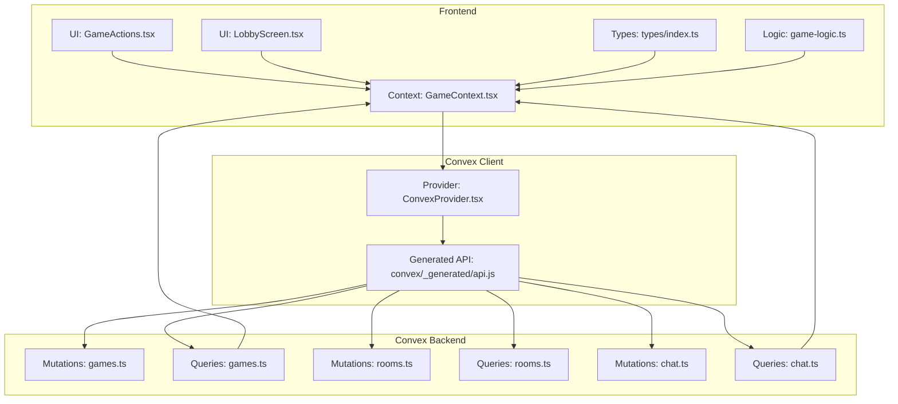
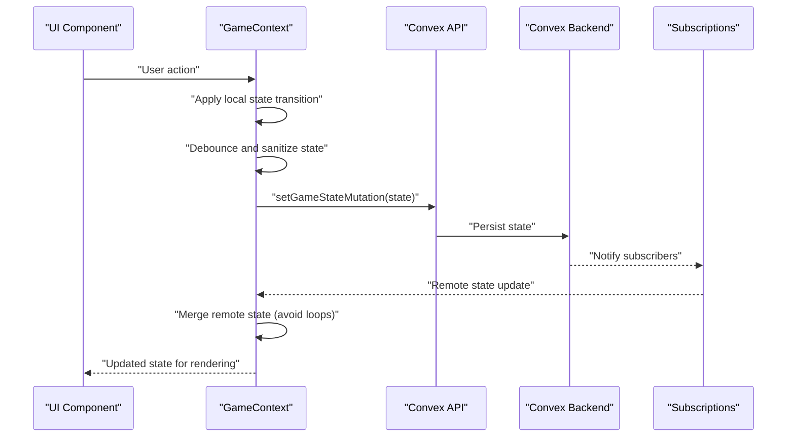
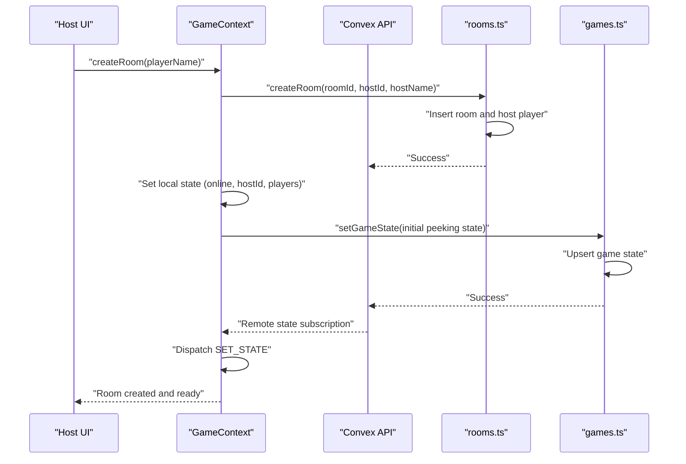
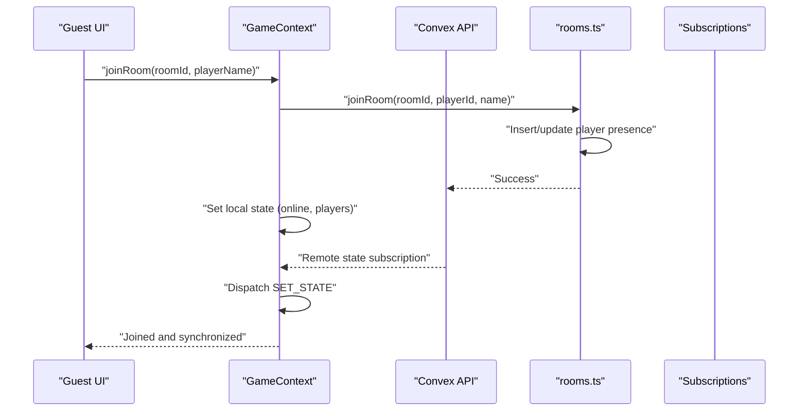
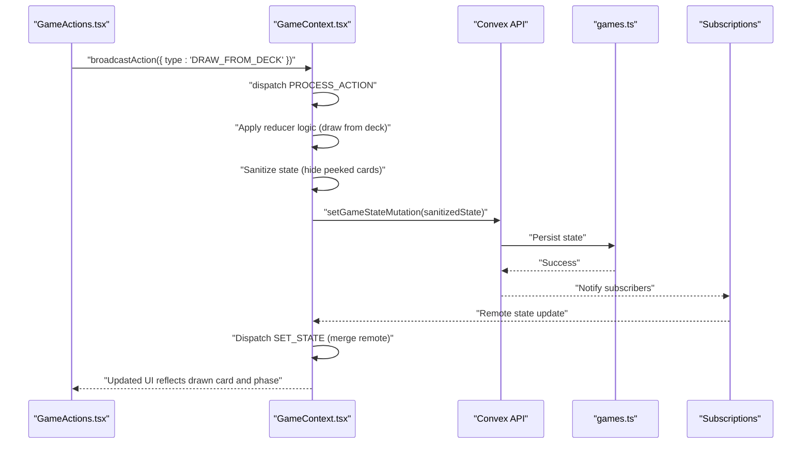
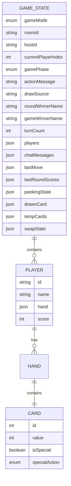
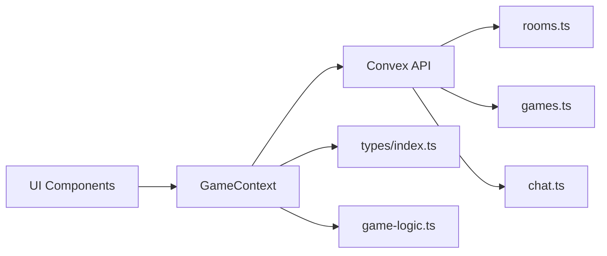

# Data Flow Between Layers

<cite>
**Referenced Files in This Document**
- [GameContext.tsx](file://src/context/GameContext.tsx)
- [GameActions.tsx](file://src/components/GameActions.tsx)
- [LobbyScreen.tsx](file://src/components/LobbyScreen.tsx)
- [games.ts](file://convex/games.ts)
- [rooms.ts](file://convex/rooms.ts)
- [chat.ts](file://convex/chat.ts)
- [ConvexProvider.tsx](file://src/ConvexProvider.tsx)
- [index.ts](file://src/types/index.ts)
- [game-logic.ts](file://src/lib/game-logic.ts)
</cite>

## Table of Contents
1. [Introduction](#introduction)
2. [Project Structure](#project-structure)
3. [Core Components](#core-components)
4. [Architecture Overview](#architecture-overview)
5. [Detailed Component Analysis](#detailed-component-analysis)
6. [Dependency Analysis](#dependency-analysis)
7. [Performance Considerations](#performance-considerations)
8. [Troubleshooting Guide](#troubleshooting-guide)
9. [Conclusion](#conclusion)

## Introduction
This document explains the complete data flow between the frontend and backend layers in sen-web. It traces how user interactions propagate from UI components through React context to Convex mutations, which update the database and broadcast changes to all connected clients via query subscriptions. It also covers specific workflows such as room creation, joining a game, and making a move, along with edge cases like network interruptions, concurrent modifications, and conflict resolution. Finally, it outlines performance optimizations such as optimistic updates and debouncing, and provides troubleshooting guidance for common synchronization issues.

## Project Structure
The data flow spans three primary layers:
- Frontend React components and context
- Convex client bindings and generated API
- Convex backend mutations and queries

**Diagram sources**
- [GameActions.tsx](file://src/components/GameActions.tsx#L1-L109)
- [LobbyScreen.tsx](file://src/components/LobbyScreen.tsx#L1-L413)
- [GameContext.tsx](file://src/context/GameContext.tsx#L574-L1152)
- [ConvexProvider.tsx](file://src/ConvexProvider.tsx#L1-L18)
- [games.ts](file://convex/games.ts#L1-L43)
- [rooms.ts](file://convex/rooms.ts#L1-L119)
- [chat.ts](file://convex/chat.ts#L1-L35)
- [index.ts](file://src/types/index.ts#L1-L100)
- [game-logic.ts](file://src/lib/game-logic.ts#L1-L63)

**Section sources**
- [GameContext.tsx](file://src/context/GameContext.tsx#L574-L1152)
- [ConvexProvider.tsx](file://src/ConvexProvider.tsx#L1-L18)

## Core Components
- GameContext manages the global game state, orchestrates local processing, and synchronizes with Convex. It exposes methods to create/join rooms, start games, broadcast actions, and send chat messages.
- GameActions is a UI component that reads the current state and triggers context methods for user actions.
- ConvexProvider initializes the Convex client and wraps the app.
- Convex modules define mutations and queries for rooms, games, and chat.

Key responsibilities:
- Local state transitions and optimistic UI updates
- Sanitization of state for multiplayer privacy
- Debounced synchronization to the backend
- Presence updates and reconnection logic
- Room lifecycle and player presence

**Section sources**
- [GameContext.tsx](file://src/context/GameContext.tsx#L574-L1152)
- [GameActions.tsx](file://src/components/GameActions.tsx#L1-L109)
- [ConvexProvider.tsx](file://src/ConvexProvider.tsx#L1-L18)

## Architecture Overview
The system follows a unidirectional data flow:
- UI components read from GameContext and call context methods.
- Context applies local state transitions and schedules a debounced sync to Convex.
- Convex mutations persist state and broadcast changes via subscriptions.
- Subscriptions push updates back to all clients, which reconcile with local state.

**Diagram sources**
- [GameContext.tsx](file://src/context/GameContext.tsx#L883-L953)
- [games.ts](file://convex/games.ts#L1-L43)

## Detailed Component Analysis

### Room Creation Workflow
This sequence shows how a host creates a room, initializes local state, and starts the lobby.

**Diagram sources**
- [GameContext.tsx](file://src/context/GameContext.tsx#L955-L1006)
- [rooms.ts](file://convex/rooms.ts#L1-L27)
- [games.ts](file://convex/games.ts#L1-L30)

**Section sources**
- [GameContext.tsx](file://src/context/GameContext.tsx#L955-L1006)
- [rooms.ts](file://convex/rooms.ts#L1-L27)
- [games.ts](file://convex/games.ts#L1-L30)

### Joining a Game Workflow
This sequence shows how a player joins a room, initializes local state, and waits for synchronization.

**Diagram sources**
- [GameContext.tsx](file://src/context/GameContext.tsx#L998-L1058)
- [rooms.ts](file://convex/rooms.ts#L30-L75)

**Section sources**
- [GameContext.tsx](file://src/context/GameContext.tsx#L998-L1058)
- [rooms.ts](file://convex/rooms.ts#L30-L75)

### Making a Move: DRAW_FROM_DECK
This sequence illustrates the end-to-end flow for a typical move, focusing on the “DRAW_FROM_DECK” action.

Notes:
- The reducer handles drawing from the deck, advancing turns, and transitioning phases.
- Sanitization ensures opponents cannot see temporarily peeked cards.
- Debounce prevents excessive writes.

**Diagram sources**
- [GameActions.tsx](file://src/components/GameActions.tsx#L67-L105)
- [GameContext.tsx](file://src/context/GameContext.tsx#L818-L953)
- [games.ts](file://convex/games.ts#L1-L30)

**Section sources**
- [GameActions.tsx](file://src/components/GameActions.tsx#L67-L105)
- [GameContext.tsx](file://src/context/GameContext.tsx#L818-L953)
- [games.ts](file://convex/games.ts#L1-L30)

### Data Model and Types
The game state and actions are strongly typed to ensure correctness across layers.

**Diagram sources**
- [index.ts](file://src/types/index.ts#L1-L100)

**Section sources**
- [index.ts](file://src/types/index.ts#L1-L100)

## Dependency Analysis
- UI components depend on GameContext for state and actions.
- GameContext depends on Convex for mutations and queries.
- Convex modules encapsulate persistence and broadcasting.
- Game logic utilities support deterministic deck creation and shuffling.

**Diagram sources**
- [GameContext.tsx](file://src/context/GameContext.tsx#L574-L1152)
- [rooms.ts](file://convex/rooms.ts#L1-L119)
- [games.ts](file://convex/games.ts#L1-L43)
- [chat.ts](file://convex/chat.ts#L1-L35)
- [index.ts](file://src/types/index.ts#L1-L100)
- [game-logic.ts](file://src/lib/game-logic.ts#L1-L63)

**Section sources**
- [GameContext.tsx](file://src/context/GameContext.tsx#L574-L1152)
- [rooms.ts](file://convex/rooms.ts#L1-L119)
- [games.ts](file://convex/games.ts#L1-L43)
- [chat.ts](file://convex/chat.ts#L1-L35)
- [index.ts](file://src/types/index.ts#L1-L100)
- [game-logic.ts](file://src/lib/game-logic.ts#L1-L63)

## Performance Considerations
- Optimistic updates: Actions are applied locally immediately, providing instant feedback. Remote reconciliation occurs via subscriptions.
- Debouncing: Synchronization to the backend is debounced to batch rapid state changes and reduce write pressure.
- Sanitization: During peeking, sensitive cards are hidden from opponents to preserve fairness and privacy.
- Presence updates: Periodic presence updates keep the lobby responsive and detect disconnections.
- Reconnection: On mount, the client attempts to reconnect using stored session identifiers.

Practical tips:
- Prefer immediate UI feedback for user actions; rely on subscriptions to reconcile eventual consistency.
- Avoid frequent manual polling; leverage subscriptions for real-time updates.
- Keep mutation payloads minimal; sanitize state before writing to reduce payload size.

**Section sources**
- [GameContext.tsx](file://src/context/GameContext.tsx#L883-L953)
- [GameContext.tsx](file://src/context/GameContext.tsx#L842-L881)
- [GameContext.tsx](file://src/context/GameContext.tsx#L782-L834)
- [GameContext.tsx](file://src/context/GameContext.tsx#L793-L834)

## Troubleshooting Guide
Common issues and resolutions:
- Network interruptions
  - Symptom: UI stops updating; chat messages fail to send.
  - Resolution: Presence updates and reconnection logic attempt to restore connectivity. Persisted session storage is used to reconnect automatically.
  - Evidence: Reconnection effect and periodic presence updates.
  
  **Section sources**
  - [GameContext.tsx](file://src/context/GameContext.tsx#L793-L834)
  - [GameContext.tsx](file://src/context/GameContext.tsx#L800-L816)

- Concurrent modifications and conflicts
  - Symptom: Conflicting state after simultaneous moves.
  - Resolution: Debounced synchronization and remote state merging prevent loops. The system compares local vs. remote vs. last synced state to avoid redundant writes and loops.
  
  **Section sources**
  - [GameContext.tsx](file://src/context/GameContext.tsx#L616-L682)
  - [GameContext.tsx](file://src/context/GameContext.tsx#L883-L953)

- Privacy leaks during peeking
  - Symptom: Opponents can see temporarily peeked cards.
  - Resolution: Sanitization hides peeked cards from opponents during peeking; local peeked cards remain visible to the current player.
  
  **Section sources**
  - [GameContext.tsx](file://src/context/GameContext.tsx#L842-L881)

- Room join failures
  - Symptom: Join fails with “Room not found.”
  - Resolution: Retry logic with backoff attempts to handle race conditions when creating rooms.
  
  **Section sources**
  - [GameContext.tsx](file://src/context/GameContext.tsx#L1002-L1058)
  - [rooms.ts](file://convex/rooms.ts#L30-L75)

- Player presence anomalies
  - Symptom: Opponent appears disconnected or reappears unexpectedly.
  - Resolution: Presence updates and timeouts distinguish between short disconnections and actual leaves. Long timeout logic resets the game if a player leaves mid-round.
  
  **Section sources**
  - [GameContext.tsx](file://src/context/GameContext.tsx#L698-L749)
  - [rooms.ts](file://convex/rooms.ts#L100-L118)

- Chat message delivery
  - Symptom: Messages not appearing for others.
  - Resolution: Local dispatch precedes mutation to provide optimistic feedback; errors are logged for diagnostics.
  
  **Section sources**
  - [GameContext.tsx](file://src/context/GameContext.tsx#L924-L953)
  - [chat.ts](file://convex/chat.ts#L1-L21)

## Conclusion
The data flow in sen-web is designed for responsiveness and correctness:
- UI actions are processed optimistically in GameContext.
- Changes are sanitized and debounced before persisting to Convex.
- Subscriptions propagate updates to all clients, enabling real-time multiplayer.
- Robust mechanisms handle network interruptions, concurrent edits, and privacy concerns.

By leveraging these patterns, developers can extend functionality while maintaining a smooth, reliable user experience.