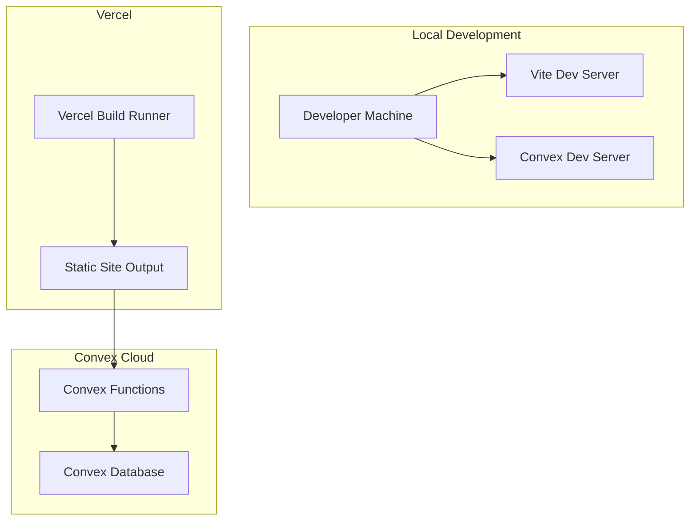
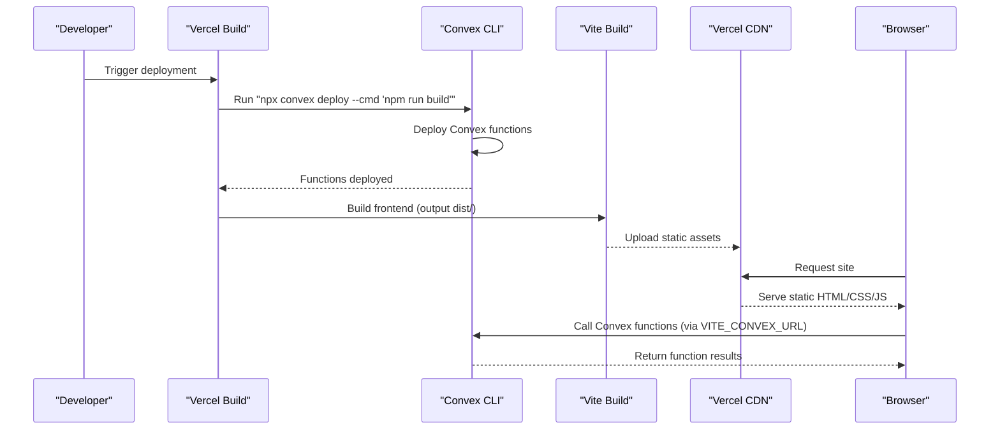
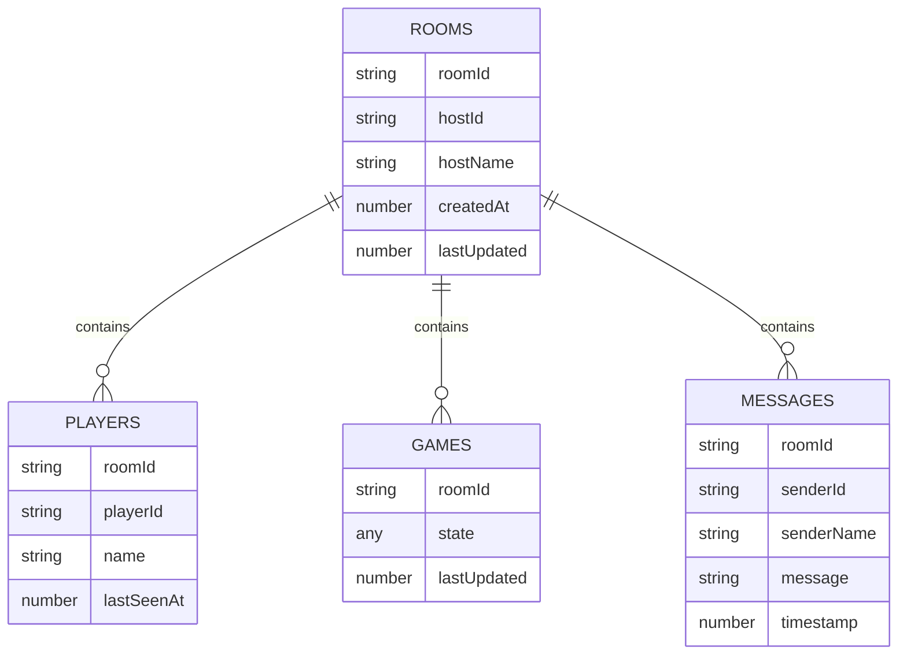
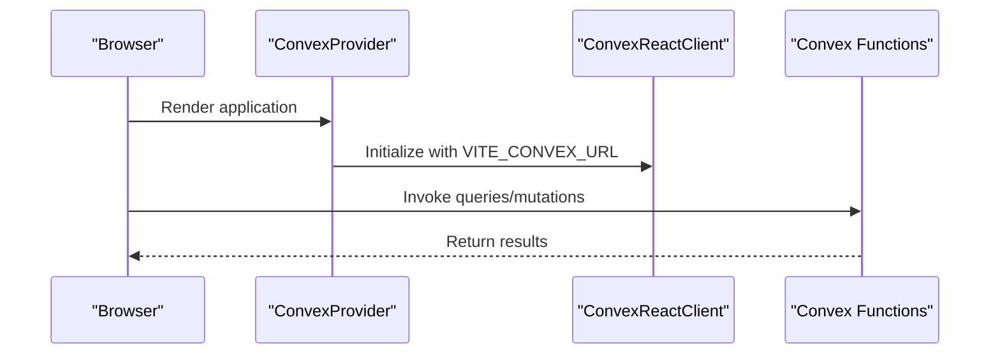
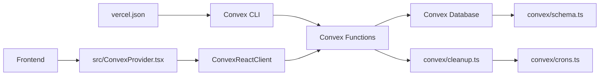

# Deployment Architecture

<cite>
**Referenced Files in This Document**
- [vercel.json](file://vercel.json)
- [README.md](file://README.md)
- [package.json](file://package.json)
- [vite.config.ts](file://vite.config.ts)
- [src/ConvexProvider.tsx](file://src/ConvexProvider.tsx)
- [convex/schema.ts](file://convex/schema.ts)
- [convex/rooms.ts](file://convex/rooms.ts)
- [convex/cleanup.ts](file://convex/cleanup.ts)
- [convex/crons.ts](file://convex/crons.ts)
- [convex/_generated/api.d.ts](file://convex/_generated/api.d.ts)
</cite>

## Table of Contents
1. [Introduction](#introduction)
2. [Project Structure](#project-structure)
3. [Core Components](#core-components)
4. [Architecture Overview](#architecture-overview)
5. [Detailed Component Analysis](#detailed-component-analysis)
6. [Dependency Analysis](#dependency-analysis)
7. [Performance Considerations](#performance-considerations)
8. [Troubleshooting Guide](#troubleshooting-guide)
9. [Conclusion](#conclusion)
10. [Appendices](#appendices)

## Introduction
This document describes the deployment architecture for sen-web, focusing on how the frontend is hosted on Vercel and the backend services are powered by Convex. It explains the deployment workflow, environment variables, integration between Vercel and Convex, and operational concerns such as rollback, environment promotion, and monitoring. It also covers performance considerations around cold starts and CDN caching, and provides troubleshooting guidance for common deployment issues.

## Project Structure
The deployment pipeline centers on:
- Frontend built with Vite and hosted on Vercel
- Backend functions managed by Convex, including schema, queries, mutations, and scheduled tasks
- Environment variables consumed by the frontend and deployment tooling

**Diagram sources**
- [vercel.json](file://vercel.json#L1-L11)
- [README.md](file://README.md#L77-L93)
- [src/ConvexProvider.tsx](file://src/ConvexProvider.tsx#L1-L18)
- [convex/schema.ts](file://convex/schema.ts#L1-L42)

**Section sources**
- [vercel.json](file://vercel.json#L1-L11)
- [README.md](file://README.md#L77-L93)
- [src/ConvexProvider.tsx](file://src/ConvexProvider.tsx#L1-L18)

## Core Components
- Vercel configuration orchestrating the build and deployment order
- Convex backend with schema, functions, and cron jobs
- Frontend provider that connects to Convex using environment variables

Key responsibilities:
- vercel.json: Defines the build command to deploy Convex functions before building the frontend, sets the output directory, framework, and SPA rewrites.
- Convex schema and functions: Define the data model and backend capabilities used by the frontend.
- ConvexProvider: Initializes the Convex client using VITE_CONVEX_URL for runtime connectivity.

**Section sources**
- [vercel.json](file://vercel.json#L1-L11)
- [convex/schema.ts](file://convex/schema.ts#L1-L42)
- [convex/rooms.ts](file://convex/rooms.ts#L1-L119)
- [convex/cleanup.ts](file://convex/cleanup.ts#L1-L68)
- [convex/crons.ts](file://convex/crons.ts#L1-L15)
- [src/ConvexProvider.tsx](file://src/ConvexProvider.tsx#L1-L18)

## Architecture Overview
The deployment architecture integrates Vercel and Convex as follows:
- Vercel executes a build command that deploys Convex functions and then builds the frontend.
- The frontend is served statically by Vercel’s CDN.
- The frontend communicates with Convex functions via the Convex client initialized with VITE_CONVEX_URL.
- Convex manages the database and schedules periodic cleanup tasks.

**Diagram sources**
- [vercel.json](file://vercel.json#L1-L11)
- [README.md](file://README.md#L77-L93)
- [src/ConvexProvider.tsx](file://src/ConvexProvider.tsx#L1-L18)

## Detailed Component Analysis

### Vercel Build and Rewrites
- Build command: The build command deploys Convex functions and then builds the frontend, ensuring backend availability before serving the site.
- Output directory: The frontend is built into the dist directory for static hosting.
- Framework: Vite is recognized for optimal build performance.
- Rewrites: All routes are rewritten to index.html to support client-side routing.

Operational impact:
- Ensures functions are ready before the frontend attempts to call them.
- SPA routing works seamlessly with Vercel’s rewrites.

**Section sources**
- [vercel.json](file://vercel.json#L1-L11)

### Convex Schema and Functions
- Schema defines tables and indexes used by the application (rooms, players, games, messages).
- Functions implement room lifecycle operations (create, join, presence updates) and expose queries for retrieving room and player data.
- Cleanup and cron jobs manage automatic pruning of stale data to prevent database bloat.

**Diagram sources**
- [convex/schema.ts](file://convex/schema.ts#L1-L42)

**Section sources**
- [convex/schema.ts](file://convex/schema.ts#L1-L42)
- [convex/rooms.ts](file://convex/rooms.ts#L1-L119)
- [convex/cleanup.ts](file://convex/cleanup.ts#L1-L68)
- [convex/crons.ts](file://convex/crons.ts#L1-L15)

### Frontend Convex Integration
- The frontend initializes a Convex client using VITE_CONVEX_URL.
- If VITE_CONVEX_URL is missing, a warning is logged and a placeholder URL is used, preventing runtime errors while indicating misconfiguration.

**Diagram sources**
- [src/ConvexProvider.tsx](file://src/ConvexProvider.tsx#L1-L18)

**Section sources**
- [src/ConvexProvider.tsx](file://src/ConvexProvider.tsx#L1-L18)

### Build and Runtime Scripts
- The project uses Vite for development and production builds.
- The build script compiles TypeScript and bundles the frontend.
- Vercel’s build command invokes the Convex CLI to deploy functions prior to building the frontend.

**Section sources**
- [package.json](file://package.json#L1-L91)
- [vite.config.ts](file://vite.config.ts#L1-L16)
- [vercel.json](file://vercel.json#L1-L11)

## Dependency Analysis
- Frontend depends on Convex client initialization via VITE_CONVEX_URL.
- Convex CLI is invoked during Vercel builds to deploy backend functions.
- Convex functions depend on the schema and indexes defined in the schema module.
- Cron jobs schedule cleanup tasks that operate on the schema-defined tables.

**Diagram sources**
- [vercel.json](file://vercel.json#L1-L11)
- [convex/schema.ts](file://convex/schema.ts#L1-L42)
- [convex/rooms.ts](file://convex/rooms.ts#L1-L119)
- [convex/cleanup.ts](file://convex/cleanup.ts#L1-L68)
- [convex/crons.ts](file://convex/crons.ts#L1-L15)
- [src/ConvexProvider.tsx](file://src/ConvexProvider.tsx#L1-L18)

**Section sources**
- [vercel.json](file://vercel.json#L1-L11)
- [convex/schema.ts](file://convex/schema.ts#L1-L42)
- [convex/rooms.ts](file://convex/rooms.ts#L1-L119)
- [convex/cleanup.ts](file://convex/cleanup.ts#L1-L68)
- [convex/crons.ts](file://convex/crons.ts#L1-L15)
- [src/ConvexProvider.tsx](file://src/ConvexProvider.tsx#L1-L18)

## Performance Considerations
- Cold starts:
  - Convex functions may experience cold starts on first invocation after idle periods. Plan for initial latency in interactive features.
  - Minimize cold start impact by keeping function logic efficient and avoiding heavy initialization in hot paths.
- CDN caching:
  - Vercel serves static assets via CDN. Ensure cache headers are appropriate for assets that change with deployments.
  - For dynamic content (Convex function responses), rely on browser and CDN caching policies aligned with your application’s needs.
- SPA routing:
  - Vercel rewrites ensure client-side routing works. Verify that redirects and rewrites remain consistent across environments.

[No sources needed since this section provides general guidance]

## Troubleshooting Guide
Common deployment issues and resolutions:
- Missing VITE_CONVEX_URL:
  - Symptom: Frontend warns about missing Convex URL and falls back to a placeholder.
  - Resolution: Set VITE_CONVEX_URL in your environment to the Convex deployment URL.
- Missing CONVEX_DEPLOYMENT or incorrect CONVEX_URL:
  - Symptom: Convex CLI cannot deploy functions or reports missing deployment configuration.
  - Resolution: Ensure CONVEX_DEPLOYMENT and CONVEX_URL are configured in Vercel project settings as documented.
- Build fails due to Convex CLI:
  - Symptom: Build command fails during function deployment.
  - Resolution: Verify Convex CLI installation and credentials; confirm the build command order deploys functions before building the frontend.
- SPA routing issues:
  - Symptom: Refreshing pages returns a 404.
  - Resolution: Confirm Vercel rewrites are enabled and route all paths to index.html.

**Section sources**
- [README.md](file://README.md#L77-L93)
- [src/ConvexProvider.tsx](file://src/ConvexProvider.tsx#L1-L18)
- [vercel.json](file://vercel.json#L1-L11)

## Conclusion
sen-web’s deployment architecture leverages Vercel for robust frontend hosting and Convex for scalable backend services. The build pipeline prioritizes function deployment before frontend compilation, ensuring backend readiness. Environment variables drive runtime connectivity and deployment configuration. Operational practices such as monitoring, rollback, and environment promotion should be integrated with Vercel and Convex capabilities to maintain reliability and performance.

[No sources needed since this section summarizes without analyzing specific files]

## Appendices

### Step-by-Step Deployment Instructions

- Development environment:
  - Install dependencies and start Convex dev server to generate types and deploy functions.
  - Set VITE_CONVEX_URL to the Convex deployment URL provided by the dev server.
  - Run the development server locally.

- Production environment (Vercel):
  - Import the repository into Vercel.
  - Add the following environment variables in Vercel project settings:
    - CONVEX_DEPLOYMENT: Your Convex deployment name (e.g., dev:your-project-name).
    - CONVEX_URL: Your Convex deployment URL (e.g., https://your-project-name.convex.cloud).
  - Vercel will execute the build command that deploys Convex functions and then builds the frontend.

- Verification:
  - Confirm that the frontend loads and can call Convex functions using the configured VITE_CONVEX_URL.
  - Validate that SPA routing works via Vercel rewrites.

**Section sources**
- [README.md](file://README.md#L77-L93)
- [src/ConvexProvider.tsx](file://src/ConvexProvider.tsx#L1-L18)
- [vercel.json](file://vercel.json#L1-L11)

### Rollback Procedures
- Vercel:
  - Use Vercel’s interface to revert to a previous successful deployment.
  - For staged rollbacks, promote a known-good version to production.
- Convex:
  - Use Convex CLI commands to manage deployments and potentially roll back function versions if supported by your deployment workflow.
  - Keep a record of deployment names and timestamps for quick identification.

[No sources needed since this section provides general guidance]

### Environment Promotion
- Promote changes by moving a tagged commit or branch through environments (development → staging → production).
- Maintain separate Vercel projects or preview branches for staging.
- Keep environment variables distinct per environment (CONVEX_DEPLOYMENT, CONVEX_URL) to avoid cross-environment interference.

[No sources needed since this section provides general guidance]

### Monitoring
- Monitor Vercel deployment logs for build and runtime errors.
- Track Convex function performance and logs via the Convex dashboard.
- Observe SPA routing behavior and CDN response codes.

[No sources needed since this section provides general guidance]