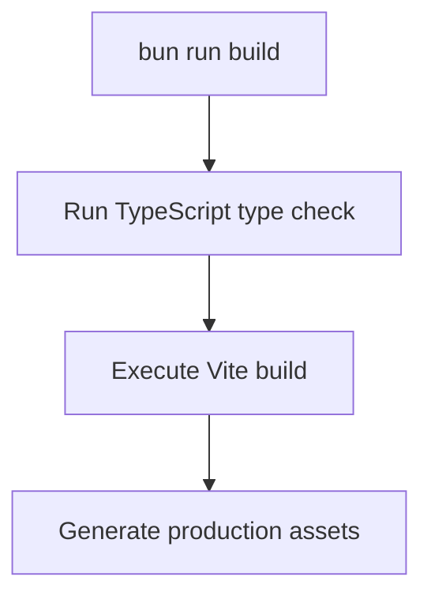
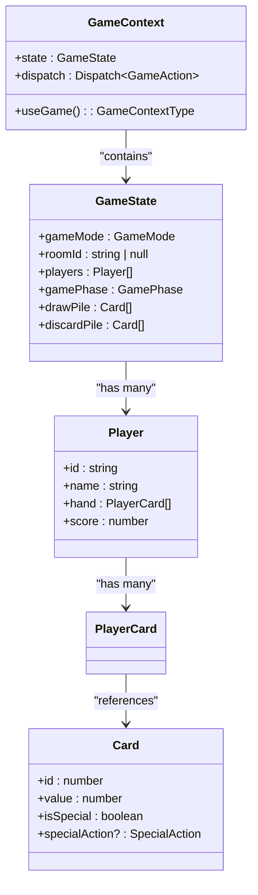

# Developer Onboarding Guide

<cite>
**Referenced Files in This Document**   
- [README.md](file://README.md)
- [AGENTS.md](file://AGENTS.md)
- [package.json](file://package.json)
- [vite.config.ts](file://vite.config.ts)
- [tsconfig.json](file://tsconfig.json)
- [eslint.config.js](file://eslint.config.js)
- [tailwind.config.js](file://tailwind.config.js)
- [src/main.tsx](file://src/main.tsx)
- [src/App.tsx](file://src/App.tsx)
- [src/ConvexProvider.tsx](file://src/ConvexProvider.tsx)
- [src/types/index.ts](file://src/types/index.ts)
- [src/components/ui/button.tsx](file://src/components/ui/button.tsx)
- [convex/schema.ts](file://convex/schema.ts)
- [convex/README.md](file://convex/README.md)
</cite>

## Table of Contents
1. [Getting Started](#getting-started)
2. [Development Commands](#development-commands)
3. [Project Conventions](#project-conventions)
4. [Troubleshooting](#troubleshooting)
5. [Performance Tips](#performance-tips)

## Getting Started

This guide provides step-by-step instructions to set up the sen-web development environment. Follow these steps to get the project running locally.

### Install Dependencies
First, install all project dependencies using Bun:
```bash
bun install
```

### Set Up Convex Backend
Initialize and start the Convex development server:
```bash
bunx convex dev
```
This command will:
- Create a Convex project if one doesn't exist
- Generate TypeScript types for Convex functions
- Deploy your backend functions
- Provide your Convex deployment URL

### Configure Environment Variables
Create a `.env` file in the project root with the following content:
```
VITE_CONVEX_URL=<your-convex-deployment-url>
```
The Convex URL will be provided in the output when you run `bunx convex dev`.

### Start Development Server
Once Convex is running and your environment is configured, start the frontend development server:
```bash
bun run dev
```
The application will be available at `http://localhost:5173`.

**Section sources**
- [README.md](file://README.md#L7-L31)
- [src/ConvexProvider.tsx](file://src/ConvexProvider.tsx#L4-L12)

## Development Commands

The project includes several npm scripts for development, build, and quality assurance tasks.

### Available Commands
- **Development Server**: `bun run dev` - Starts Vite development server with hot module replacement
- **Build**: `bun run build` - Compiles TypeScript and creates production build using Vite
- **Lint**: `bun run lint` - Runs ESLint to check code quality and style
- **Preview**: `bun run preview` - Locally previews the production build

The build process first runs a TypeScript type check (`tsc -b`) followed by the Vite build process, ensuring type safety before compilation.



**Diagram sources**
- [package.json](file://package.json#L8)
- [tsconfig.json](file://tsconfig.json#L3-L5)

**Section sources**
- [AGENTS.md](file://AGENTS.md#L4-L7)
- [package.json](file://package.json#L8-L10)

## Project Conventions

This section outlines the coding standards and conventions used throughout the sen-web project.

### Import Conventions
The project uses absolute imports with the `@/` prefix for all source files. This is configured in `tsconfig.json` and `vite.config.ts`:

```json
// tsconfig.json
{
  "compilerOptions": {
    "baseUrl": ".",
    "paths": {
      "@/*": ["./src/*"]
    }
  }
}
```

This allows imports like:
```typescript
import { Button } from "@/components/ui/button";
import { useGame } from "@/context/GameContext";
```

### Component Naming
All React components use PascalCase for both file names and component names:
- Component files: `LobbyScreen.tsx`, `Gameboard.tsx`, `ChatBox.tsx`
- Component names: `LobbyScreen`, `Gameboard`, `ChatBox`

UI components in the `src/components/ui/` directory follow shadcn/ui patterns and are built with Radix UI primitives and Tailwind CSS.

### TypeScript Practices
The project enforces strict TypeScript configuration:
- All components use appropriate TypeScript types
- Component props are properly typed with interfaces
- Shared types are defined in `src/types/index.ts`
- The project uses React with TypeScript best practices

Key TypeScript configuration includes:
- Project references in `tsconfig.json` for better build performance
- Strict type checking enabled
- Proper module resolution configuration



**Diagram sources**
- [src/types/index.ts](file://src/types/index.ts#L1-L100)
- [src/context/GameContext.tsx](file://src/context/GameContext.tsx)
- [src/main.tsx](file://src/main.tsx#L7)

**Section sources**
- [AGENTS.md](file://AGENTS.md#L12-L24)
- [vite.config.ts](file://vite.config.ts#L7-L10)
- [tsconfig.json](file://tsconfig.json#L9-L10)
- [src/types/index.ts](file://src/types/index.ts)

## Troubleshooting

This section addresses common setup issues and their solutions.

### Missing Dependencies
If you encounter module resolution errors after `bun install`, try:
1. Clear Bun's cache: `bun pm cache clean`
2. Reinstall dependencies: `bun install`
3. Verify Bun version compatibility

### Convex Configuration Issues
If the Convex development server fails to start:
- Ensure you have Node.js installed (Convex CLI requires Node)
- Check that your internet connection is stable
- Verify that the Convex CLI can authenticate
- If you see type generation errors, run `bunx convex dev` again

### Environment Variable Problems
If the application cannot connect to Convex:
- Verify that `.env` file exists in the project root
- Check that `VITE_CONVEX_URL` is correctly set with the URL from `bunx convex dev`
- Ensure the environment variable uses the `VITE_` prefix to be exposed to the frontend
- Restart the development server after making changes to `.env`

### Common Error Messages
- **"VITE_CONVEX_URL is not set"**: This warning appears when the environment variable is missing. Create a `.env` file with the correct Convex URL.
- **TypeScript compilation errors**: Run `bun run build` to identify type issues, then fix the reported errors in the relevant files.
- **Module not found**: Verify the import path is correct and uses the `@/` prefix for src directory imports.

**Section sources**
- [README.md](file://README.md#L21-L26)
- [src/ConvexProvider.tsx](file://src/ConvexProvider.tsx#L6-L10)

## Performance Tips

Optimize your development workflow with these performance recommendations.

### Leveraging Vite's Hot Module Replacement
The project uses Vite as the development server, which provides fast hot module replacement (HMR). To make the most of this:
- Edit CSS and component logic freely - changes appear instantly without full reload
- When modifying context providers or global state, you may need a full reload
- HMR preserves component state when possible, maintaining your testing state

### Development Workflow Optimization
- Use `bun run lint` regularly to catch issues early
- Take advantage of TypeScript's incremental compilation during development
- Use the Vite preview server (`bun run preview`) to test production builds locally before deployment
- Leverage editor TypeScript integration for real-time type checking

### Build Performance
The build process is optimized with:
- TypeScript project references for faster type checking
- Vite's efficient bundling algorithm
- Proper code splitting configuration

Monitor build performance and adjust `vite.config.ts` if needed for your development environment.

**Section sources**
- [package.json](file://package.json#L7-L10)
- [vite.config.ts](file://vite.config.ts)
- [tsconfig.json](file://tsconfig.json)