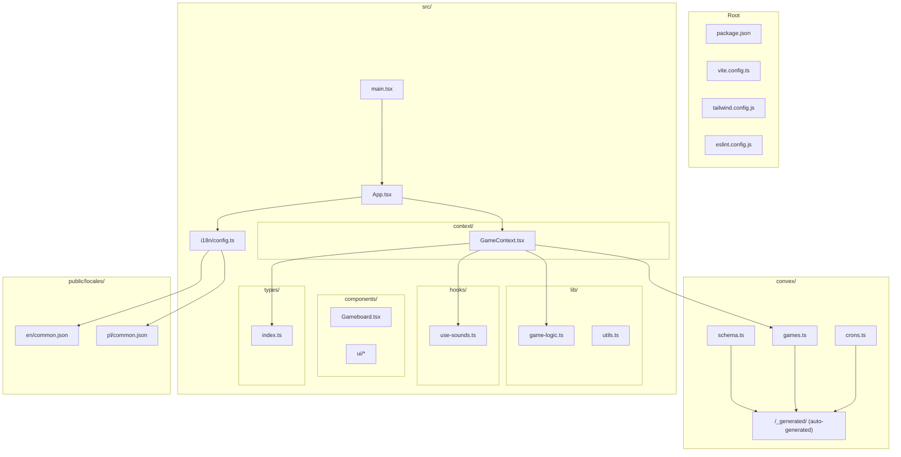
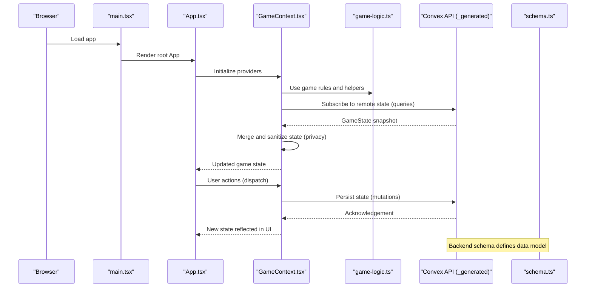
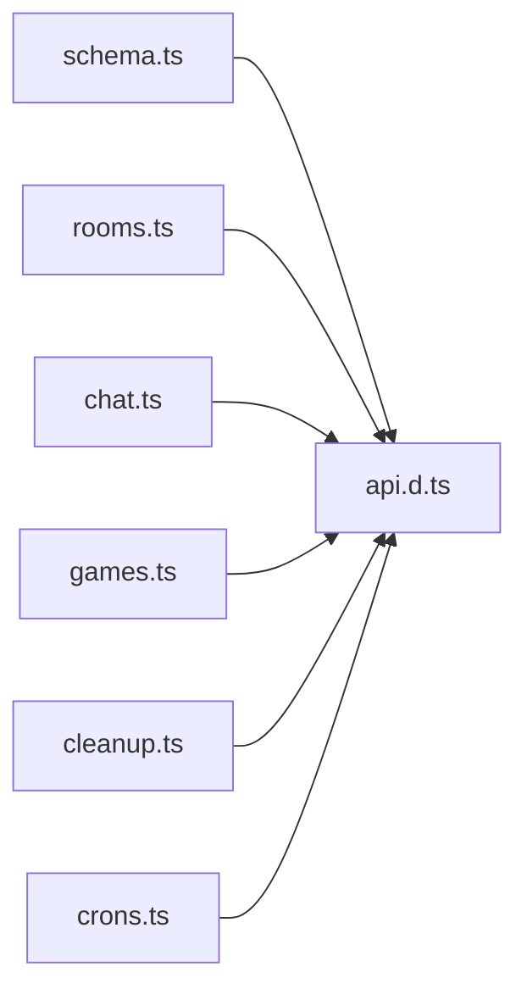
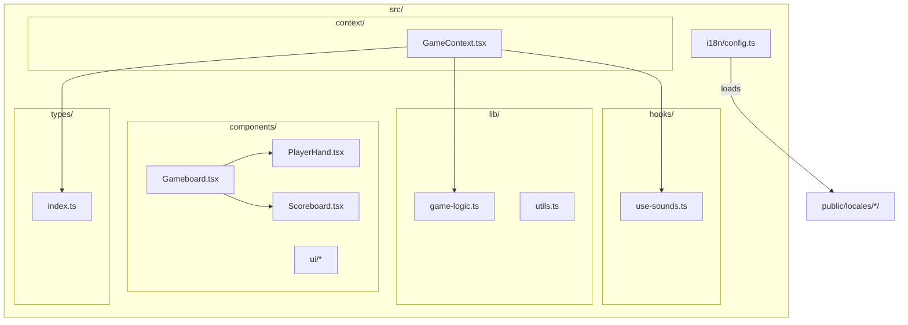
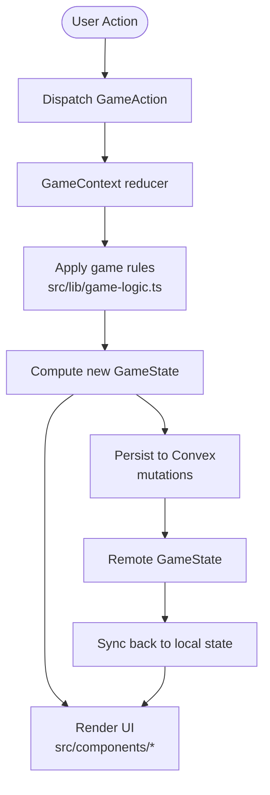
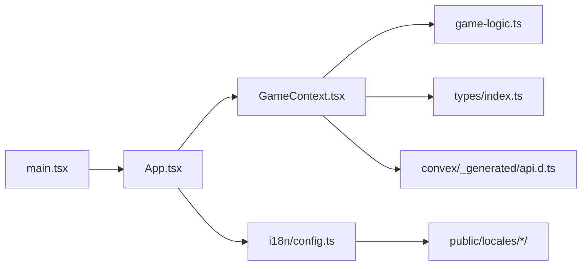

# Directory Structure Breakdown

<cite>
**Referenced Files in This Document**
- [schema.ts](file://convex/schema.ts)
- [games.ts](file://convex/games.ts)
- [crons.ts](file://convex/crons.ts)
- [api.d.ts](file://convex/_generated/api.d.ts)
- [App.tsx](file://src/App.tsx)
- [main.tsx](file://src/main.tsx)
- [GameContext.tsx](file://src/context/GameContext.tsx)
- [Gameboard.tsx](file://src/components/Gameboard.tsx)
- [game-logic.ts](file://src/lib/game-logic.ts)
- [index.ts](file://src/types/index.ts)
- [config.ts](file://src/i18n/config.ts)
- [common.json](file://public/locales/en/common.json)
- [use-sounds.ts](file://src/hooks/use-sounds.ts)
- [utils.ts](file://src/lib/utils.ts)
- [package.json](file://package.json)
</cite>

## Table of Contents
1. [Introduction](#introduction)
2. [Project Structure](#project-structure)
3. [Core Components](#core-components)
4. [Architecture Overview](#architecture-overview)
5. [Detailed Component Analysis](#detailed-component-analysis)
6. [Dependency Analysis](#dependency-analysis)
7. [Performance Considerations](#performance-considerations)
8. [Troubleshooting Guide](#troubleshooting-guide)
9. [Conclusion](#conclusion)
10. [Appendices](#appendices)

## Introduction
This document explains the project’s directory organization and how it supports separation of concerns between frontend UI, game logic, and backend Convex functions. It also outlines where to place new files when extending the application and why the current structure works well for maintainability and scalability.

## Project Structure
At a high level:
- convex/: Backend functions, schema, and generated types for Convex
- src/: Frontend React application code
- public/locales/: Internationalization resources
- Root-level configuration files: Vite, Tailwind, ESLint, and package metadata

**Diagram sources**
- [main.tsx](file://src/main.tsx#L1-L21)
- [App.tsx](file://src/App.tsx#L1-L80)
- [GameContext.tsx](file://src/context/GameContext.tsx#L1-L120)
- [Gameboard.tsx](file://src/components/Gameboard.tsx#L1-L60)
- [schema.ts](file://convex/schema.ts#L1-L42)
- [games.ts](file://convex/games.ts#L1-L43)
- [crons.ts](file://convex/crons.ts#L1-L17)
- [api.d.ts](file://convex/_generated/api.d.ts#L1-L58)
- [game-logic.ts](file://src/lib/game-logic.ts#L1-L63)
- [index.ts](file://src/types/index.ts#L1-L100)
- [config.ts](file://src/i18n/config.ts#L1-L33)
- [common.json](file://public/locales/en/common.json#L1-L25)

**Section sources**
- [package.json](file://package.json#L1-L91)
- [main.tsx](file://src/main.tsx#L1-L21)
- [App.tsx](file://src/App.tsx#L1-L80)

## Core Components
- convex/: Defines the backend schema, exposes Convex queries and mutations, and schedules periodic cleanup jobs. Generated types live under convex/_generated/.
- src/: React application entrypoint, UI components, game logic, contexts, hooks, and shared types.
- public/locales/: Internationalization resources loaded by the i18n configuration.
- Root-level configuration: Vite, Tailwind, ESLint, and package metadata.

Key separation:
- Backend logic and data model live in convex/.
- Frontend rendering and interactions live in src/.
- Internationalization resources live in public/locales/.

**Section sources**
- [schema.ts](file://convex/schema.ts#L1-L42)
- [games.ts](file://convex/games.ts#L1-L43)
- [crons.ts](file://convex/crons.ts#L1-L17)
- [api.d.ts](file://convex/_generated/api.d.ts#L1-L58)
- [config.ts](file://src/i18n/config.ts#L1-L33)
- [common.json](file://public/locales/en/common.json#L1-L25)

## Architecture Overview
The frontend initializes providers, renders the App shell, and delegates game state to GameContext. GameContext orchestrates:
- Local game logic from src/lib/game-logic.ts
- Remote state synchronization via Convex queries and mutations
- UI updates through React components in src/components/

**Diagram sources**
- [main.tsx](file://src/main.tsx#L1-L21)
- [App.tsx](file://src/App.tsx#L1-L80)
- [GameContext.tsx](file://src/context/GameContext.tsx#L1-L120)
- [game-logic.ts](file://src/lib/game-logic.ts#L1-L63)
- [games.ts](file://convex/games.ts#L1-L43)
- [api.d.ts](file://convex/_generated/api.d.ts#L1-L58)
- [schema.ts](file://convex/schema.ts#L1-L42)

## Detailed Component Analysis

### Top-Level Directories and Their Roles
- convex/: Contains backend schema, server-side functions, and scheduled jobs. Auto-generated types under convex/_generated/ enable type-safe client calls.
- src/: Frontend code organized by feature and concern:
  - components/: Presentational UI and composite screens (e.g., Gameboard).
  - context/: Application-wide state providers (e.g., GameContext).
  - hooks/: Reusable frontend logic (e.g., sound playback).
  - lib/: Pure game logic and utilities (e.g., deck creation/shuffling).
  - types/: Shared TypeScript interfaces and enums.
  - i18n/: Internationalization initialization and resource loading.
- public/locales/: Language resources consumed by i18n.
- Root-level configuration: Build tooling, styling, linting, and dependencies.

**Section sources**
- [schema.ts](file://convex/schema.ts#L1-L42)
- [games.ts](file://convex/games.ts#L1-L43)
- [crons.ts](file://convex/crons.ts#L1-L17)
- [api.d.ts](file://convex/_generated/api.d.ts#L1-L58)
- [Gameboard.tsx](file://src/components/Gameboard.tsx#L1-L60)
- [GameContext.tsx](file://src/context/GameContext.tsx#L1-L120)
- [game-logic.ts](file://src/lib/game-logic.ts#L1-L63)
- [index.ts](file://src/types/index.ts#L1-L100)
- [config.ts](file://src/i18n/config.ts#L1-L33)
- [common.json](file://public/locales/en/common.json#L1-L25)

### Convex-Specific Structure
- Schema: Defines tables and indexes for rooms, players, games, and messages.
- Functions: Mutations and queries for game state and chat.
- Generated Types: api.d.ts exposes a typed API surface for frontend consumption.
- Scheduled Jobs: crons.ts schedules cleanup tasks.

**Diagram sources**
- [schema.ts](file://convex/schema.ts#L1-L42)
- [api.d.ts](file://convex/_generated/api.d.ts#L1-L58)
- [games.ts](file://convex/games.ts#L1-L43)
- [crons.ts](file://convex/crons.ts#L1-L17)

**Section sources**
- [schema.ts](file://convex/schema.ts#L1-L42)
- [games.ts](file://convex/games.ts#L1-L43)
- [crons.ts](file://convex/crons.ts#L1-L17)
- [api.d.ts](file://convex/_generated/api.d.ts#L1-L58)

### Frontend Organization Within src/
- components/: UI building blocks and screens. Example: Gameboard.tsx composes PlayerHand, Scoreboard, and other UI elements.
- context/: Application state providers. Example: GameContext.tsx manages game state transitions and integrates with Convex.
- hooks/: Reusable logic. Example: use-sounds.ts encapsulates audio playback.
- lib/: Pure logic and utilities. Example: game-logic.ts creates and shuffles decks; utils.ts merges Tailwind classes.
- types/: Shared types. Example: index.ts defines Card, Player, GameState, and GameAction.
- i18n/: Internationalization setup. Example: config.ts loads translations from public/locales.

**Diagram sources**
- [Gameboard.tsx](file://src/components/Gameboard.tsx#L1-L60)
- [GameContext.tsx](file://src/context/GameContext.tsx#L1-L120)
- [game-logic.ts](file://src/lib/game-logic.ts#L1-L63)
- [index.ts](file://src/types/index.ts#L1-L100)
- [use-sounds.ts](file://src/hooks/use-sounds.ts#L1-L33)
- [utils.ts](file://src/lib/utils.ts#L1-L7)
- [config.ts](file://src/i18n/config.ts#L1-L33)
- [common.json](file://public/locales/en/common.json#L1-L25)

**Section sources**
- [Gameboard.tsx](file://src/components/Gameboard.tsx#L1-L60)
- [GameContext.tsx](file://src/context/GameContext.tsx#L1-L120)
- [game-logic.ts](file://src/lib/game-logic.ts#L1-L63)
- [index.ts](file://src/types/index.ts#L1-L100)
- [use-sounds.ts](file://src/hooks/use-sounds.ts#L1-L33)
- [utils.ts](file://src/lib/utils.ts#L1-L7)
- [config.ts](file://src/i18n/config.ts#L1-L33)
- [common.json](file://public/locales/en/common.json#L1-L25)

### Example: Game Logic Separation
- Game logic resides in src/lib/game-logic.ts (e.g., deck creation and shuffling).
- UI components live in src/components/ (e.g., Gameboard.tsx renders piles, hands, and actions).
- GameContext.tsx coordinates between logic, state, and remote storage.

**Diagram sources**
- [GameContext.tsx](file://src/context/GameContext.tsx#L1-L120)
- [game-logic.ts](file://src/lib/game-logic.ts#L1-L63)
- [games.ts](file://convex/games.ts#L1-L43)

**Section sources**
- [GameContext.tsx](file://src/context/GameContext.tsx#L1-L120)
- [game-logic.ts](file://src/lib/game-logic.ts#L1-L63)
- [games.ts](file://convex/games.ts#L1-L43)

## Dependency Analysis
- Frontend depends on Convex-generated types for type-safe calls.
- GameContext imports game-logic and types, and uses Convex queries/mutations.
- Internationalization is initialized early in the app bootstrap and consumes public/locales resources.

**Diagram sources**
- [main.tsx](file://src/main.tsx#L1-L21)
- [App.tsx](file://src/App.tsx#L1-L80)
- [GameContext.tsx](file://src/context/GameContext.tsx#L1-L120)
- [game-logic.ts](file://src/lib/game-logic.ts#L1-L63)
- [index.ts](file://src/types/index.ts#L1-L100)
- [api.d.ts](file://convex/_generated/api.d.ts#L1-L58)
- [config.ts](file://src/i18n/config.ts#L1-L33)
- [common.json](file://public/locales/en/common.json#L1-L25)

**Section sources**
- [main.tsx](file://src/main.tsx#L1-L21)
- [App.tsx](file://src/App.tsx#L1-L80)
- [GameContext.tsx](file://src/context/GameContext.tsx#L1-L120)
- [api.d.ts](file://convex/_generated/api.d.ts#L1-L58)
- [config.ts](file://src/i18n/config.ts#L1-L33)

## Performance Considerations
- Keep game logic pure and deterministic in src/lib/ to simplify testing and reduce side effects.
- Minimize re-renders by structuring state updates efficiently in GameContext and using memoized selectors where appropriate.
- Use lazy loading and suspense boundaries for heavy components.
- Offload heavy computations to web workers if needed.

[No sources needed since this section provides general guidance]

## Troubleshooting Guide
- If Convex types are missing or outdated, regenerate them by running the development server so that convex/_generated/ is updated.
- If translations do not load, verify the i18n configuration and ensure public/locales files exist and are named correctly.
- If UI flickers or unexpected state appears, inspect GameContext synchronization logic and ensure remote state merging preserves local privacy (e.g., peeked cards).

**Section sources**
- [api.d.ts](file://convex/_generated/api.d.ts#L1-L58)
- [config.ts](file://src/i18n/config.ts#L1-L33)
- [common.json](file://public/locales/en/common.json#L1-L25)
- [GameContext.tsx](file://src/context/GameContext.tsx#L600-L720)

## Conclusion
The project’s directory layout cleanly separates backend and frontend concerns, with clear boundaries between UI, logic, and data. The Convex schema and generated types enable type-safe integrations, while src/lib keeps game logic isolated from UI. Adding new features follows predictable patterns: extend Convex functions in convex/, add types in src/types/, implement logic in src/lib/, and compose UI in src/components/.

[No sources needed since this section summarizes without analyzing specific files]

## Appendices

### Where to Place New Files When Extending the Application
- Add backend logic in convex/:
  - Define new tables or indexes in convex/schema.ts
  - Implement mutations and queries in new files under convex/
  - Export generated types via convex/_generated/
- Add frontend logic in src/:
  - Pure logic in src/lib/
  - UI components in src/components/
  - State in src/context/
  - Hooks in src/hooks/
  - Shared types in src/types/
  - Internationalization resources in public/locales/
- Root-level configuration:
  - Add tooling or dependency changes in package.json, vite.config.ts, tailwind.config.js, or eslint.config.js

**Section sources**
- [schema.ts](file://convex/schema.ts#L1-L42)
- [api.d.ts](file://convex/_generated/api.d.ts#L1-L58)
- [package.json](file://package.json#L1-L91)