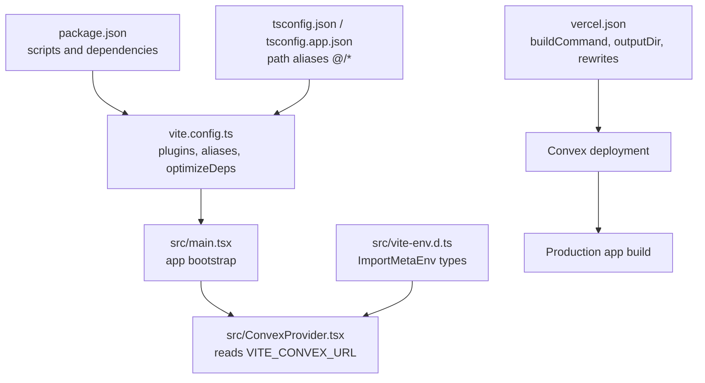
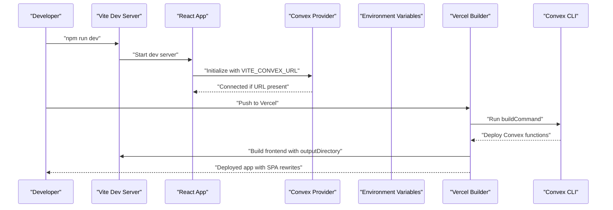
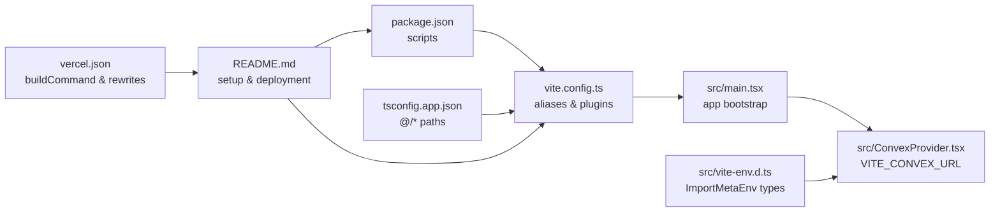

# Environment Configuration

<cite>
**Referenced Files in This Document**
- [vercel.json](file://vercel.json)
- [vite.config.ts](file://vite.config.ts)
- [package.json](file://package.json)
- [src/ConvexProvider.tsx](file://src/ConvexProvider.tsx)
- [src/vite-env.d.ts](file://src/vite-env.d.ts)
- [src/main.tsx](file://src/main.tsx)
- [README.md](file://README.md)
- [tsconfig.json](file://tsconfig.json)
- [tsconfig.app.json](file://tsconfig.app.json)
</cite>

## Table of Contents
1. [Introduction](#introduction)
2. [Project Structure](#project-structure)
3. [Core Components](#core-components)
4. [Architecture Overview](#architecture-overview)
5. [Detailed Component Analysis](#detailed-component-analysis)
6. [Dependency Analysis](#dependency-analysis)
7. [Performance Considerations](#performance-considerations)
8. [Troubleshooting Guide](#troubleshooting-guide)
9. [Conclusion](#conclusion)

## Introduction
This section explains how environment configuration works in sen-web, focusing on:
- Build-time configuration via Vite and package scripts
- Runtime configuration via environment variables consumed by the frontend
- Deployment automation using Vercel and Convex

It covers the purpose and usage of key files, required environment variables, and step-by-step setup for development and production.

## Project Structure
The environment configuration spans several files:
- Vite build configuration and aliases
- Package scripts for local development and building
- Runtime environment variable typing and usage
- Vercel deployment automation
- TypeScript path aliases for imports

**Diagram sources**
- [package.json](file://package.json#L1-L30)
- [vite.config.ts](file://vite.config.ts#L1-L16)
- [src/main.tsx](file://src/main.tsx#L1-L21)
- [src/ConvexProvider.tsx](file://src/ConvexProvider.tsx#L1-L18)
- [src/vite-env.d.ts](file://src/vite-env.d.ts#L1-L36)
- [vercel.json](file://vercel.json#L1-L11)
- [tsconfig.json](file://tsconfig.json#L1-L15)
- [tsconfig.app.json](file://tsconfig.app.json#L1-L30)

**Section sources**
- [package.json](file://package.json#L1-L30)
- [vite.config.ts](file://vite.config.ts#L1-L16)
- [src/main.tsx](file://src/main.tsx#L1-L21)
- [src/ConvexProvider.tsx](file://src/ConvexProvider.tsx#L1-L18)
- [src/vite-env.d.ts](file://src/vite-env.d.ts#L1-L36)
- [vercel.json](file://vercel.json#L1-L11)
- [tsconfig.json](file://tsconfig.json#L1-L15)
- [tsconfig.app.json](file://tsconfig.app.json#L1-L30)

## Core Components
- Vite configuration: defines plugins, path aliases, and dependency optimization settings.
- Package scripts: define development, build, lint, and preview commands.
- Runtime environment variables: typed via Vite’s ImportMetaEnv and consumed by the Convex provider.
- Vercel configuration: automates Convex deployment prior to building the frontend and sets SPA rewrites.
- TypeScript path aliases: enable clean imports using the @ prefix.

Key responsibilities:
- vite.config.ts: configure React plugin, path aliases, and optimizeDeps to improve dev/build performance.
- package.json: define scripts for dev/build/preview and declare Vite as a dev dependency.
- src/vite-env.d.ts: declare environment variable types for Vite to recognize them at compile time.
- src/ConvexProvider.tsx: reads VITE_CONVEX_URL at runtime and initializes the Convex client.
- vercel.json: orchestrates Convex deployment before building and enables SPA routing.

**Section sources**
- [vite.config.ts](file://vite.config.ts#L1-L16)
- [package.json](file://package.json#L1-L30)
- [src/vite-env.d.ts](file://src/vite-env.d.ts#L1-L36)
- [src/ConvexProvider.tsx](file://src/ConvexProvider.tsx#L1-L18)
- [vercel.json](file://vercel.json#L1-L11)
- [tsconfig.json](file://tsconfig.json#L1-L15)
- [tsconfig.app.json](file://tsconfig.app.json#L1-L30)

## Architecture Overview
The environment configuration integrates local development, runtime initialization, and production deployment:

**Diagram sources**
- [package.json](file://package.json#L1-L30)
- [src/ConvexProvider.tsx](file://src/ConvexProvider.tsx#L1-L18)
- [vercel.json](file://vercel.json#L1-L11)

## Detailed Component Analysis

### Vite Configuration (vite.config.ts)
Purpose:
- Enable React plugin for JSX/TSX support.
- Define path aliases to simplify imports using the @ prefix.
- Exclude specific dependencies from optimizeDeps to reduce startup overhead.

Key behaviors:
- Plugins: loads the React plugin.
- Resolve.alias: maps @ to the src directory for cleaner imports.
- optimizeDeps.exclude: excludes heavy dependencies from pre-bundling during dev.

Performance implications:
- Path aliases reduce module resolution overhead.
- Excluding large dependencies from optimizeDeps can speed up cold starts.

**Section sources**
- [vite.config.ts](file://vite.config.ts#L1-L16)
- [tsconfig.app.json](file://tsconfig.app.json#L1-L30)

### Package Scripts (package.json)
Purpose:
- Provide standardized commands for development, building, linting, and previewing.

Key scripts:
- dev: starts the Vite dev server.
- build: compiles TypeScript and runs Vite build.
- lint: runs ESLint across the project.
- preview: serves the built assets locally.

How this affects environment configuration:
- The build script ensures Vite builds the app with environment variables available at build time.
- Preview allows verifying production-like behavior locally.

**Section sources**
- [package.json](file://package.json#L1-L30)

### Runtime Environment Variables (src/vite-env.d.ts and src/ConvexProvider.tsx)
Purpose:
- Type environment variables recognized by Vite so they are accessible at runtime.
- Initialize the Convex client using a URL provided via an environment variable.

Required runtime variable:
- VITE_CONVEX_URL: The URL of the Convex deployment used by the frontend to connect to the backend.

Behavior:
- The Convex provider reads VITE_CONVEX_URL from import.meta.env.
- If the variable is missing, a warning is logged and a placeholder URL is used to keep the app running while highlighting the misconfiguration.

Type declarations:
- src/vite-env.d.ts declares ImportMetaEnv with VITE_SUPABASE_URL and VITE_SUPABASE_ANON_KEY, indicating how to type environment variables for Vite projects.

Note:
- The project currently declares Supabase variables in the type declaration, but the runtime code consumes VITE_CONVEX_URL. Ensure your environment variables match the variables your app actually uses.

**Section sources**
- [src/vite-env.d.ts](file://src/vite-env.d.ts#L1-L36)
- [src/ConvexProvider.tsx](file://src/ConvexProvider.tsx#L1-L18)

### Vercel Deployment Automation (vercel.json)
Purpose:
- Automate Convex function deployment before building the frontend.
- Configure the output directory and SPA rewrites for single-page applications.

Key settings:
- buildCommand: runs the Convex deploy command with npm run build.
- outputDirectory: specifies dist as the build output folder.
- framework: marks the project as a Vite app.
- rewrites: routes all unmatched paths to index.html for SPA routing.

Impact:
- Ensures backend functions are deployed alongside the frontend.
- Simplifies production deployment by centralizing build and rewrite rules.

**Section sources**
- [vercel.json](file://vercel.json#L1-L11)

### TypeScript Path Aliases (tsconfig.json and tsconfig.app.json)
Purpose:
- Enable importing files using the @ prefix, improving readability and maintainability.

Behavior:
- tsconfig.json references tsconfig.app.json and tsconfig.node.json.
- tsconfig.app.json defines baseUrl and paths to map @/* to ./src/*.

Integration:
- Works with vite.config.ts resolve.alias to ensure consistent import behavior across tooling.

**Section sources**
- [tsconfig.json](file://tsconfig.json#L1-L15)
- [tsconfig.app.json](file://tsconfig.app.json#L1-L30)

## Dependency Analysis
The environment configuration components depend on each other as follows:

**Diagram sources**
- [package.json](file://package.json#L1-L30)
- [vite.config.ts](file://vite.config.ts#L1-L16)
- [tsconfig.app.json](file://tsconfig.app.json#L1-L30)
- [src/main.tsx](file://src/main.tsx#L1-L21)
- [src/ConvexProvider.tsx](file://src/ConvexProvider.tsx#L1-L18)
- [src/vite-env.d.ts](file://src/vite-env.d.ts#L1-L36)
- [README.md](file://README.md#L1-L93)
- [vercel.json](file://vercel.json#L1-L11)

**Section sources**
- [package.json](file://package.json#L1-L30)
- [vite.config.ts](file://vite.config.ts#L1-L16)
- [tsconfig.app.json](file://tsconfig.app.json#L1-L30)
- [src/main.tsx](file://src/main.tsx#L1-L21)
- [src/ConvexProvider.tsx](file://src/ConvexProvider.tsx#L1-L18)
- [src/vite-env.d.ts](file://src/vite-env.d.ts#L1-L36)
- [README.md](file://README.md#L1-L93)
- [vercel.json](file://vercel.json#L1-L11)

## Performance Considerations
- Vite optimizeDeps.exclude: Excluding heavy dependencies reduces pre-bundling overhead during development.
- Path aliases: Using @/* improves module resolution performance and reduces bundle size by avoiding deep relative paths.
- Build command orchestration: Running Convex deploy before building ensures the backend is ready, preventing runtime errors and retries.
- SPA rewrites: Proper rewrites prevent unnecessary server requests and improve perceived performance for navigation.

[No sources needed since this section provides general guidance]

## Troubleshooting Guide
Common issues and resolutions:

- Missing VITE_CONVEX_URL
  - Symptom: Warning about VITE_CONVEX_URL not being set; Convex features unavailable.
  - Resolution: Add VITE_CONVEX_URL to your environment. For local development, create a .env file and set VITE_CONVEX_URL to the URL provided by the Convex dev server. For production on Vercel, set CONVEX_URL in project settings; the build pipeline expects this variable to be present.

- Incorrect Convex URL
  - Symptom: Frontend cannot connect to backend; network errors or blank UI.
  - Resolution: Verify the URL matches the Convex deployment endpoint. Obtain the URL by running the Convex dev command and copying the provided URL. Ensure HTTPS is used for production deployments.

- Environment variable mismatch
  - Symptom: Type errors or undefined variables in TypeScript.
  - Resolution: Ensure the environment variables declared in src/vite-env.d.ts match the variables your app actually uses. Remove unused entries and add new ones as needed.

- Vercel build failures
  - Symptom: Build fails due to missing environment variables or Convex deployment issues.
  - Resolution: Confirm CONVEX_DEPLOYMENT and CONVEX_URL are configured in Vercel. The buildCommand in vercel.json runs the Convex deploy command before building; ensure credentials and project name are correct.

- SPA routing issues
  - Symptom: Refreshing pages or direct navigation leads to 404.
  - Resolution: Ensure rewrites in vercel.json route all paths to index.html. This is essential for single-page applications.

Step-by-step setup instructions:
- Development
  - Install dependencies and start Convex dev to obtain the deployment URL.
  - Create a .env file with VITE_CONVEX_URL set to the Convex URL.
  - Run the development server using the package script.
- Production (Vercel)
  - Import the repository into Vercel.
  - Add environment variables in Vercel settings: CONVEX_DEPLOYMENT and CONVEX_URL.
  - Trigger a build; Vercel will run the Convex deploy command before building the frontend.

**Section sources**
- [src/ConvexProvider.tsx](file://src/ConvexProvider.tsx#L1-L18)
- [src/vite-env.d.ts](file://src/vite-env.d.ts#L1-L36)
- [vercel.json](file://vercel.json#L1-L11)
- [README.md](file://README.md#L1-L93)

## Conclusion
sen-web’s environment configuration combines Vite’s build-time settings, TypeScript path aliases, and runtime environment variables to deliver a robust development and production experience. The Convex provider consumes VITE_CONVEX_URL to connect the frontend to the backend, while Vercel’s vercel.json automates Convex deployment and frontend build. Following the setup steps and troubleshooting guidance ensures reliable operation across environments.

[No sources needed since this section summarizes without analyzing specific files]