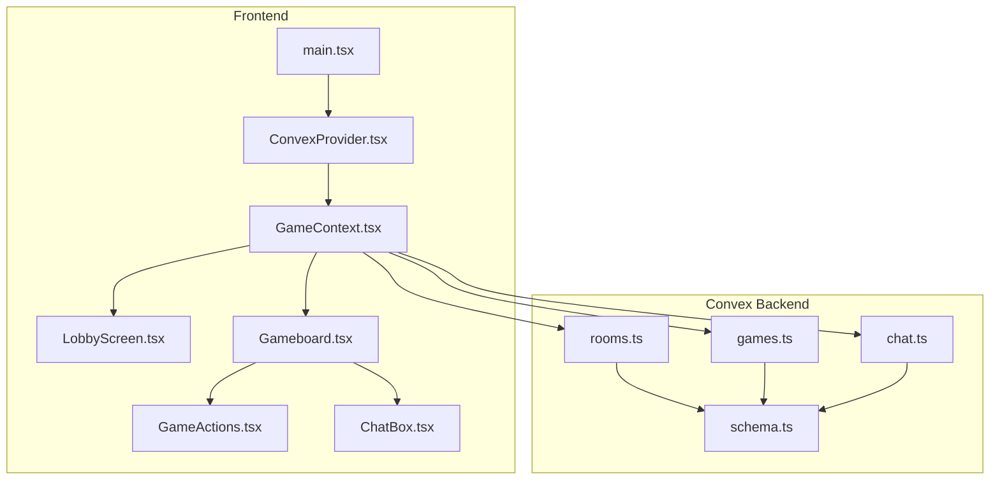
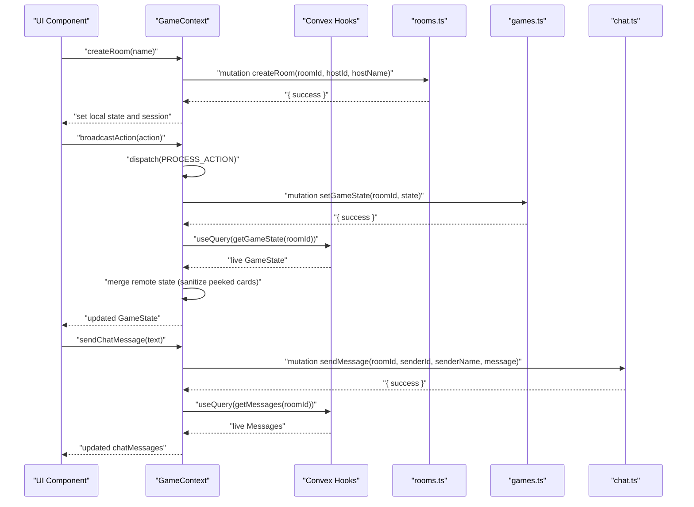
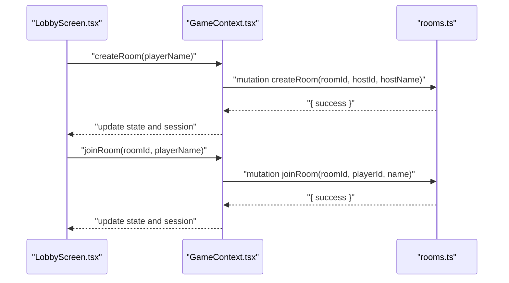
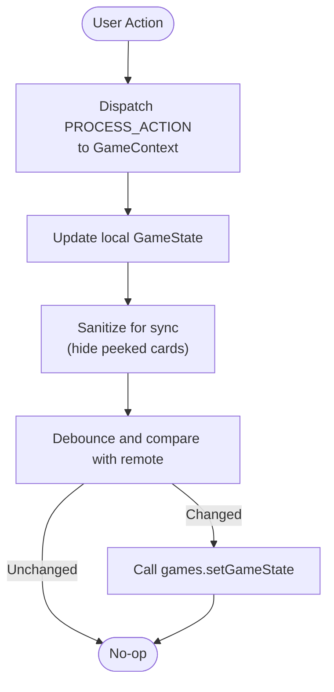
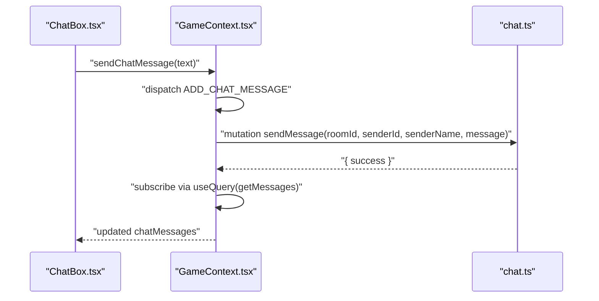
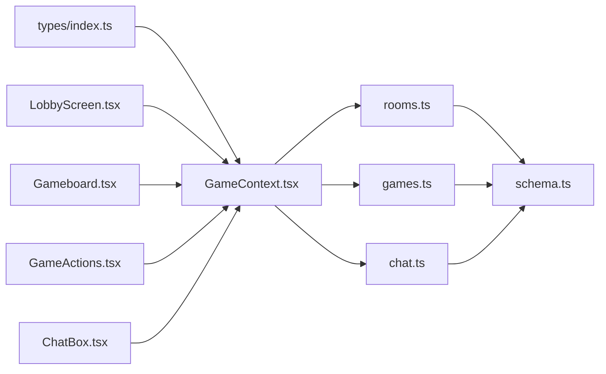

# API Clients

<cite>
**Referenced Files in This Document**
- [main.tsx](file://src/main.tsx)
- [ConvexProvider.tsx](file://src/ConvexProvider.tsx)
- [GameContext.tsx](file://src/context/GameContext.tsx)
- [schema.ts](file://convex/schema.ts)
- [rooms.ts](file://convex/rooms.ts)
- [games.ts](file://convex/games.ts)
- [chat.ts](file://convex/chat.ts)
- [LobbyScreen.tsx](file://src/components/LobbyScreen.tsx)
- [Gameboard.tsx](file://src/components/Gameboard.tsx)
- [GameActions.tsx](file://src/components/GameActions.tsx)
- [ChatBox.tsx](file://src/components/ChatBox.tsx)
- [index.ts](file://src/types/index.ts)
</cite>

## Table of Contents
1. [Introduction](#introduction)
2. [Project Structure](#project-structure)
3. [Core Components](#core-components)
4. [Architecture Overview](#architecture-overview)
5. [Detailed Component Analysis](#detailed-component-analysis)
6. [Dependency Analysis](#dependency-analysis)
7. [Performance Considerations](#performance-considerations)
8. [Troubleshooting Guide](#troubleshooting-guide)
9. [Security Considerations](#security-considerations)
10. [Client Implementation Guidelines](#client-implementation-guidelines)
11. [Conclusion](#conclusion)

## Introduction
This document describes the frontend API clients in sen-web and how they integrate with Convex to provide real-time, collaborative gameplay. It explains how ConvexClientProvider wraps the application to enable live database access, how frontend components use Convex hooks to subscribe to live data (game state, chat messages), and how mutations propagate player actions and messages. It also details the backend modules and their exposed functions, provides protocol examples for broadcasting actions and handling errors, and outlines security and performance best practices for extending the API.

## Project Structure
The frontend initializes Convex and wires up the GameContext provider at the root. Components then consume Convex queries and mutations through GameContext to render live game state and chat, and to submit actions and messages.

**Diagram sources**
- [main.tsx](file://src/main.tsx#L1-L21)
- [ConvexProvider.tsx](file://src/ConvexProvider.tsx#L1-L18)
- [GameContext.tsx](file://src/context/GameContext.tsx#L1-L120)
- [schema.ts](file://convex/schema.ts#L1-L42)
- [rooms.ts](file://convex/rooms.ts#L1-L119)
- [games.ts](file://convex/games.ts#L1-L43)
- [chat.ts](file://convex/chat.ts#L1-L35)

**Section sources**
- [main.tsx](file://src/main.tsx#L1-L21)
- [ConvexProvider.tsx](file://src/ConvexProvider.tsx#L1-L18)

## Core Components
- ConvexClientProvider: Creates a ConvexReactClient from environment configuration and wraps the app so all components can use Convex hooks.
- GameContext: Centralizes game state, exposes APIs for room lifecycle, starting games, broadcasting actions, sending chat messages, and managing presence. It subscribes to live data via Convex queries and writes changes via Convex mutations.

Key responsibilities:
- Live subscriptions: game state, chat messages, and player presence.
- Action propagation: converts UI actions into broadcastAction, which updates local state and syncs to the backend.
- Presence: periodically updates lastSeenAt to detect player activity.
- Reconnection: restores session on reload and re-joins the room.

**Section sources**
- [ConvexProvider.tsx](file://src/ConvexProvider.tsx#L1-L18)
- [GameContext.tsx](file://src/context/GameContext.tsx#L1-L120)
- [GameContext.tsx](file://src/context/GameContext.tsx#L587-L615)

## Architecture Overview
The frontend uses Convex hooks to subscribe to live data and mutations to persist changes. GameContext orchestrates:
- Subscriptions to rooms, games, and chat.
- Local state updates and sanitization for privacy.
- Controlled synchronization to the backend with debouncing and conflict avoidance.
- UI-driven actions mapped to backend mutations.

**Diagram sources**
- [GameContext.tsx](file://src/context/GameContext.tsx#L587-L615)
- [rooms.ts](file://convex/rooms.ts#L1-L27)
- [games.ts](file://convex/games.ts#L1-L29)
- [chat.ts](file://convex/chat.ts#L1-L21)

## Detailed Component Analysis

### ConvexClientProvider
- Creates a ConvexReactClient using the VITE_CONVEX_URL environment variable.
- Provides the client to the app tree so downstream components can use useQuery and useMutation.
- Logs a warning if the URL is missing.

Implementation highlights:
- Uses environment variable for URL.
- Falls back to a placeholder if unset.

**Section sources**
- [ConvexProvider.tsx](file://src/ConvexProvider.tsx#L1-L18)

### GameContext
- Exposes:
  - Room lifecycle: createRoom, joinRoom, startHotseatGame, startGame.
  - Action pipeline: broadcastAction, sendChatMessage.
  - Presence: update presence periodically.
  - State: current GameState, myPlayerId, and helpers.
- Subscriptions:
  - useQuery(api.games.getGameState, { roomId }) for live game state.
  - useQuery(api.chat.getMessages, { roomId }) for live chat.
  - useQuery(api.rooms.getPlayers, { roomId }) for presence and lobby updates.
- Mutations:
  - useMutation(api.rooms.createRoom), joinRoom, updatePlayerPresence.
  - useMutation(api.games.setGameState).
  - useMutation(api.chat.sendMessage).

Live synchronization:
- Remote state is merged into local state with sanitization to hide peeked cards from opponents.
- Local changes are sanitized and debounced before syncing to avoid loops and reduce network traffic.
- Presence updates occur every 10 seconds to keep the lobby responsive.

Reconnection:
- On mount, attempts to restore session from localStorage and rejoin the room.

**Section sources**
- [GameContext.tsx](file://src/context/GameContext.tsx#L1-L120)
- [GameContext.tsx](file://src/context/GameContext.tsx#L587-L615)
- [GameContext.tsx](file://src/context/GameContext.tsx#L616-L780)
- [GameContext.tsx](file://src/context/GameContext.tsx#L883-L922)
- [GameContext.tsx](file://src/context/GameContext.tsx#L924-L953)
- [GameContext.tsx](file://src/context/GameContext.tsx#L955-L1059)
- [GameContext.tsx](file://src/context/GameContext.tsx#L1061-L1098)
- [GameContext.tsx](file://src/context/GameContext.tsx#L1099-L1131)
- [GameContext.tsx](file://src/context/GameContext.tsx#L800-L817)

### Backend Modules

#### rooms.ts
Exposed functions:
- createRoom(args: { roomId, hostId, hostName }): mutation
  - Inserts a room and adds the host as a player.
- joinRoom(args: { roomId, playerId, name }): mutation
  - Validates room existence, updates or inserts player presence, and refreshes room timestamps.
- getRoom(args: { roomId }): query -> Room
- getPlayers(args: { roomId }): query -> Player[]
- updatePlayerPresence(args: { roomId, playerId }): mutation
  - Updates lastSeenAt for a player.

Data model references:
- rooms table with indices by roomId and hostId.
- players table with indices by roomId and playerId.

**Section sources**
- [rooms.ts](file://convex/rooms.ts#L1-L119)
- [schema.ts](file://convex/schema.ts#L1-L42)

#### games.ts
Exposed functions:
- setGameState(args: { roomId, state }): mutation
  - Upserts game state keyed by roomId with lastUpdated timestamp.
- getGameState(args: { roomId }): query -> GameState | null

Data model references:
- games table indexed by roomId.

**Section sources**
- [games.ts](file://convex/games.ts#L1-L43)
- [schema.ts](file://convex/schema.ts#L1-L42)

#### chat.ts
Exposed functions:
- sendMessage(args: { roomId, senderId, senderName, message }): mutation
  - Inserts a message with timestamp.
- getMessages(args: { roomId }): query -> Message[] (last 100, chronological)

Data model references:
- messages table indexed by roomId and timestamp.

**Section sources**
- [chat.ts](file://convex/chat.ts#L1-L35)
- [schema.ts](file://convex/schema.ts#L1-L42)

### Frontend Integration Patterns

#### Room Lifecycle
- Creating a room:
  - UI calls GameContext.createRoom with a player name.
  - GameContext creates a roomId and hostId, persists session, and calls rooms.createRoom.
  - Local state reflects the new room and host role.
- Joining a room:
  - UI calls GameContext.joinRoom with roomId and player name.
  - GameContext retries on “Room not found” with short delays.
  - Session is persisted and local state initialized.

**Diagram sources**
- [LobbyScreen.tsx](file://src/components/LobbyScreen.tsx#L41-L73)
- [GameContext.tsx](file://src/context/GameContext.tsx#L955-L1059)
- [rooms.ts](file://convex/rooms.ts#L1-L75)

**Section sources**
- [LobbyScreen.tsx](file://src/components/LobbyScreen.tsx#L41-L73)
- [GameContext.tsx](file://src/context/GameContext.tsx#L955-L1059)
- [rooms.ts](file://convex/rooms.ts#L1-L75)

#### Broadcasting Actions (GameContext.broadcastAction)
- UI triggers an action (e.g., draw, swap, special action).
- GameContext.processAndBroadcastAction dispatches a local PROCESS_ACTION to update state immediately.
- A controlled debounce in GameContext.sync logic sends setGameState(roomId, sanitizedState) to the backend.
- Remote subscribers receive live updates and merge them into their local state with sanitization.

**Diagram sources**
- [GameContext.tsx](file://src/context/GameContext.tsx#L818-L841)
- [GameContext.tsx](file://src/context/GameContext.tsx#L883-L922)
- [games.ts](file://convex/games.ts#L1-L29)

**Section sources**
- [GameActions.tsx](file://src/components/GameActions.tsx#L1-L109)
- [Gameboard.tsx](file://src/components/Gameboard.tsx#L74-L97)
- [GameContext.tsx](file://src/context/GameContext.tsx#L818-L841)
- [GameContext.tsx](file://src/context/GameContext.tsx#L883-L922)

#### Live Chat Subscriptions
- UI renders ChatBox, which displays messages from GameContext.state.chatMessages.
- GameContext subscribes to chat messages via useQuery(api.chat.getMessages, { roomId }).
- When a user submits a message, GameContext.sendChatMessage dispatches locally and calls chat.sendMessage, then updates the subscription.

**Diagram sources**
- [ChatBox.tsx](file://src/components/ChatBox.tsx#L1-L68)
- [GameContext.tsx](file://src/context/GameContext.tsx#L924-L953)
- [chat.ts](file://convex/chat.ts#L1-L35)

**Section sources**
- [ChatBox.tsx](file://src/components/ChatBox.tsx#L1-L68)
- [GameContext.tsx](file://src/context/GameContext.tsx#L602-L607)
- [GameContext.tsx](file://src/context/GameContext.tsx#L924-L953)

## Dependency Analysis
- GameContext depends on:
  - Convex API bindings (api.rooms, api.games, api.chat).
  - Types for GameState, Player, Card, ChatMessage, and GameAction.
- Backend modules depend on the schema for table definitions and indexing.
- Frontend components depend on GameContext for state and actions.

**Diagram sources**
- [index.ts](file://src/types/index.ts#L1-L100)
- [GameContext.tsx](file://src/context/GameContext.tsx#L1-L120)
- [rooms.ts](file://convex/rooms.ts#L1-L119)
- [games.ts](file://convex/games.ts#L1-L43)
- [chat.ts](file://convex/chat.ts#L1-L35)
- [schema.ts](file://convex/schema.ts#L1-L42)
- [LobbyScreen.tsx](file://src/components/LobbyScreen.tsx#L1-L413)
- [Gameboard.tsx](file://src/components/Gameboard.tsx#L1-L355)
- [GameActions.tsx](file://src/components/GameActions.tsx#L1-L109)
- [ChatBox.tsx](file://src/components/ChatBox.tsx#L1-L68)

**Section sources**
- [index.ts](file://src/types/index.ts#L1-L100)
- [GameContext.tsx](file://src/context/GameContext.tsx#L1-L120)
- [rooms.ts](file://convex/rooms.ts#L1-L119)
- [games.ts](file://convex/games.ts#L1-L43)
- [chat.ts](file://convex/chat.ts#L1-L35)
- [schema.ts](file://convex/schema.ts#L1-L42)

## Performance Considerations
- Debounce and deduplicate state sync:
  - GameContext debounces setGameState calls and compares sanitized state with last synced and remote state to avoid redundant writes.
- Efficient queries:
  - Use skip conditions for queries when not in online mode to avoid unnecessary subscriptions.
  - Limit chat history to recent messages to reduce payload size.
- Presence updates:
  - Update presence every 10 seconds to balance responsiveness and bandwidth.
- Local sanitization:
  - Hide peeked cards from opponents during sync to minimize data leakage and reduce payload size.

[No sources needed since this section provides general guidance]

## Troubleshooting Guide
Common issues and remedies:
- Network failures:
  - Room creation/joining and chat sending wrap mutations in try/catch and log errors. UI surfaces toast notifications for user feedback.
  - Reconnection logic attempts to restore session on mount and rejoin the room.
- Room not found:
  - joinRoom includes retry logic with short delays when the room does not exist yet.
- Presence timeouts:
  - If a player has not sent presence for a while, they are considered inactive. In two-player games, absence may trigger a reset to lobby state.

**Section sources**
- [GameContext.tsx](file://src/context/GameContext.tsx#L924-L953)
- [GameContext.tsx](file://src/context/GameContext.tsx#L998-L1059)
- [GameContext.tsx](file://src/context/GameContext.tsx#L794-L817)

## Security Considerations
- Input validation:
  - Backend functions validate inputs and enforce constraints (e.g., room existence, player presence).
- Rate limiting:
  - Presence updates occur at fixed intervals to limit write frequency.
- Authentication patterns:
  - Player identity is represented by playerId. While the Convex client is initialized without explicit auth, the backend relies on client-provided identifiers. Consider integrating Convex authentication for production deployments to bind actions to verified identities.
- Privacy:
  - GameContext sanitizes game state during sync to hide peeked cards from opponents.

[No sources needed since this section provides general guidance]

## Client Implementation Guidelines
Adding new API endpoints:
- Define Convex mutations/queries in the appropriate backend module (rooms.ts, games.ts, chat.ts) and export them.
- Add types to the schema.ts and ensure proper indexing for efficient queries.
- Import the generated API in GameContext and use useMutation/useQuery accordingly.
- Wire UI components to call GameContext methods that encapsulate the new API.

Handling loading states:
- Use the effectiveLoading pattern shown in LobbyScreen to reflect async operations (creating/joining rooms, starting games).
- Disable buttons and inputs during loading to prevent concurrent operations.

Optimizing data fetching:
- Structure queries to return minimal data (e.g., limit chat messages).
- Use skip conditions for offline or lobby modes to avoid unnecessary subscriptions.
- Debounce and coalesce frequent updates to reduce network load.

Error handling:
- Wrap mutations in try/catch and surface user-friendly messages via toasts.
- Implement retry logic for transient failures (e.g., room not found).
- Log errors for debugging and monitoring.

[No sources needed since this section provides general guidance]

## Conclusion
The frontend integrates Convex through ConvexClientProvider and GameContext to deliver a seamless, real-time multiplayer experience. GameContext centralizes subscriptions and mutations, manages presence, and ensures secure, sanitized synchronization of game state and chat. By following the patterns outlined here—using Convex hooks, sanitizing sensitive data, and implementing robust error handling—you can safely extend the API with new features while maintaining performance and reliability.