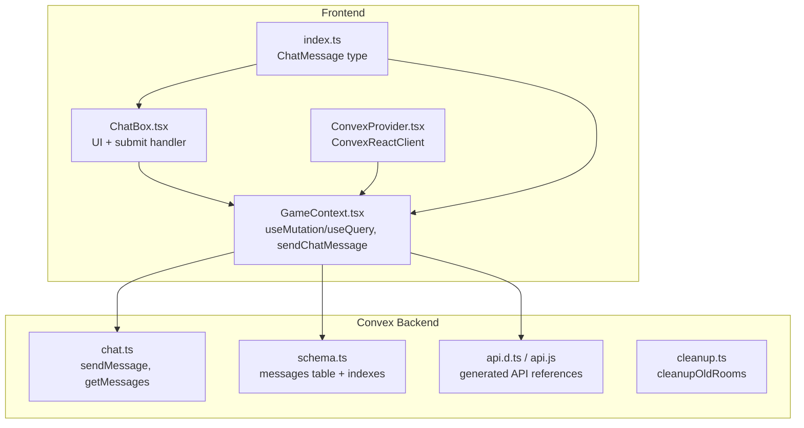
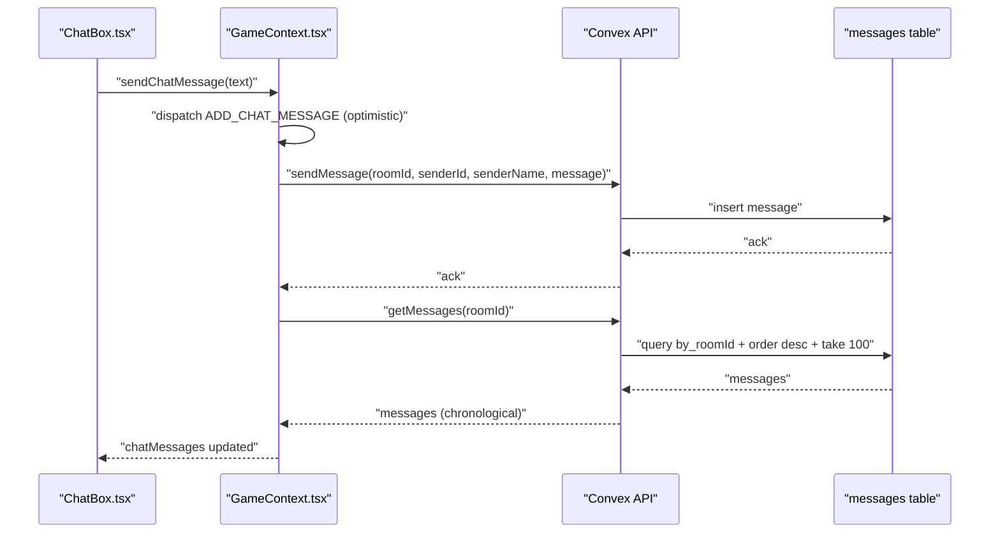
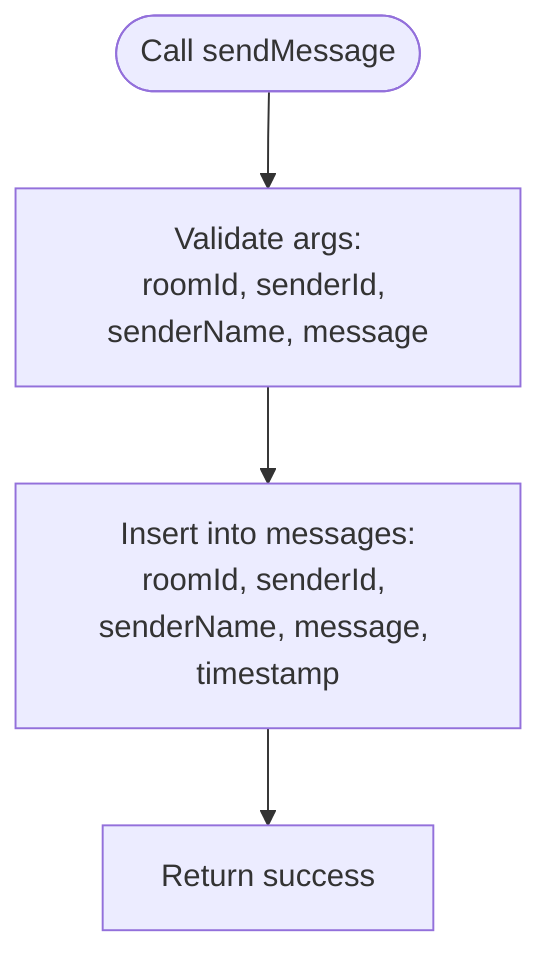
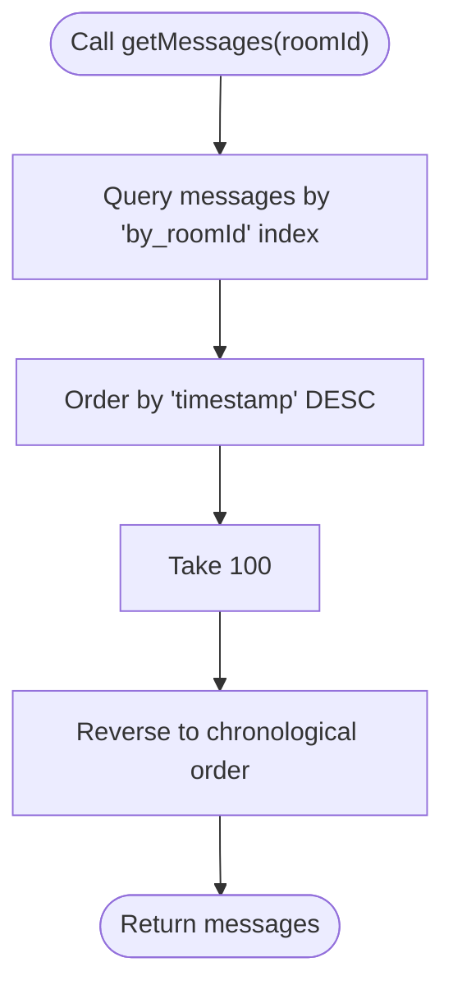
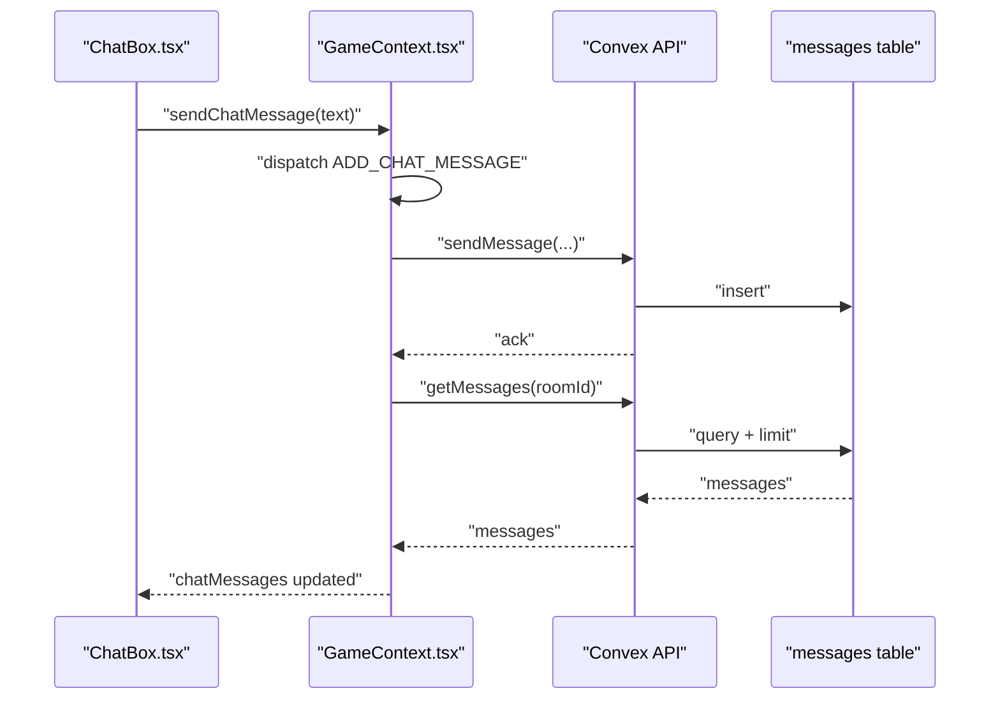
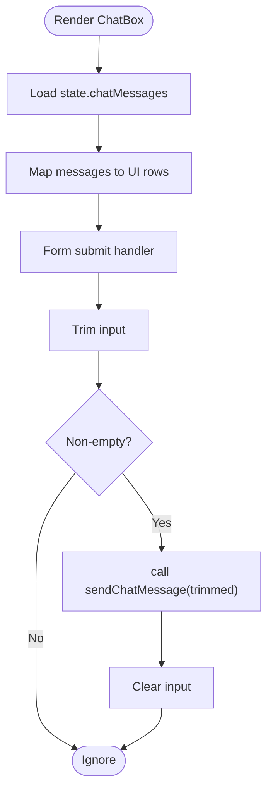
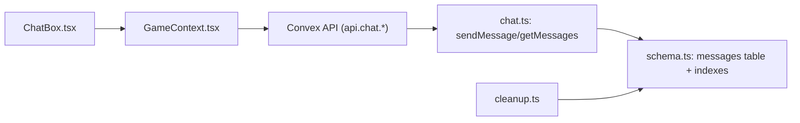

# Chat API Client

<cite>
**Referenced Files in This Document**
- [chat.ts](file://convex/chat.ts)
- [schema.ts](file://convex/schema.ts)
- [api.d.ts](file://convex/_generated/api.d.ts)
- [api.js](file://convex/_generated/api.js)
- [cleanup.ts](file://convex/cleanup.ts)
- [rooms.ts](file://convex/rooms.ts)
- [GameContext.tsx](file://src/context/GameContext.tsx)
- [ChatBox.tsx](file://src/components/ChatBox.tsx)
- [index.ts](file://src/types/index.ts)
- [ConvexProvider.tsx](file://src/ConvexProvider.tsx)
</cite>

## Table of Contents
1. [Introduction](#introduction)
2. [Project Structure](#project-structure)
3. [Core Components](#core-components)
4. [Architecture Overview](#architecture-overview)
5. [Detailed Component Analysis](#detailed-component-analysis)
6. [Dependency Analysis](#dependency-analysis)
7. [Performance Considerations](#performance-considerations)
8. [Security Considerations](#security-considerations)
9. [Troubleshooting Guide](#troubleshooting-guide)
10. [Best Practices and Extensions](#best-practices-and-extensions)
11. [Conclusion](#conclusion)

## Introduction
This document provides comprehensive API documentation for the Chat API client in sen-web. It focuses on the sendMessage mutation and getMessages query, detailing how the chat system integrates with the real-time Convex backend to synchronize messages across players in a room. It explains the message retention policy (last 100 messages), performance characteristics, and practical implementation patterns for sending and receiving messages in ChatBox.tsx. It also covers security aspects such as input sanitization, rate limiting strategies, and privacy considerations, along with best practices for extending the chat system with richer features while maintaining performance and scalability.

## Project Structure
The chat functionality spans two primary areas:
- Convex backend (server-side functions and schema)
- Frontend React components and context that consume the Convex API

Key files:
- Convex chat functions and schema define the API surface and storage model
- GameContext orchestrates chat state and integrates with Convex
- ChatBox renders the chat UI and triggers message sending
- Types define the ChatMessage shape used across the app

**Diagram sources**
- [chat.ts](file://convex/chat.ts#L1-L35)
- [schema.ts](file://convex/schema.ts#L1-L42)
- [api.d.ts](file://convex/_generated/api.d.ts#L1-L58)
- [api.js](file://convex/_generated/api.js#L1-L24)
- [cleanup.ts](file://convex/cleanup.ts#L1-L68)
- [GameContext.tsx](file://src/context/GameContext.tsx#L1-L1152)
- [ChatBox.tsx](file://src/components/ChatBox.tsx#L1-L68)
- [ConvexProvider.tsx](file://src/ConvexProvider.tsx#L1-L18)
- [index.ts](file://src/types/index.ts#L1-L100)

**Section sources**
- [chat.ts](file://convex/chat.ts#L1-L35)
- [schema.ts](file://convex/schema.ts#L1-L42)
- [api.d.ts](file://convex/_generated/api.d.ts#L1-L58)
- [api.js](file://convex/_generated/api.js#L1-L24)
- [cleanup.ts](file://convex/cleanup.ts#L1-L68)
- [GameContext.tsx](file://src/context/GameContext.tsx#L1-L1152)
- [ChatBox.tsx](file://src/components/ChatBox.tsx#L1-L68)
- [ConvexProvider.tsx](file://src/ConvexProvider.tsx#L1-L18)
- [index.ts](file://src/types/index.ts#L1-L100)

## Core Components
- sendMessage mutation: Inserts a new chat message with sender metadata and timestamp into the messages table.
- getMessages query: Retrieves the most recent 100 messages for a given room ordered chronologically using an indexed lookup by roomId.
- ChatMessage type: Defines the shape of messages stored and transmitted.
- GameContext integration: Provides a sendChatMessage helper that dispatches a local optimistic update and then calls the Convex mutation.
- ChatBox UI: Renders messages and submits new messages via the GameContext hook.

**Section sources**
- [chat.ts](file://convex/chat.ts#L1-L35)
- [schema.ts](file://convex/schema.ts#L1-L42)
- [index.ts](file://src/types/index.ts#L1-L100)
- [GameContext.tsx](file://src/context/GameContext.tsx#L800-L1152)
- [ChatBox.tsx](file://src/components/ChatBox.tsx#L1-L68)

## Architecture Overview
The chat system uses a real-time, reactive architecture:
- Frontend subscribes to messages via a Convex query.
- When a user submits a message, the frontend dispatches an optimistic update to the UI and calls the Convex mutation.
- The mutation writes the message to the database.
- The subscription re-fetches messages, and the UI updates automatically.

**Diagram sources**
- [ChatBox.tsx](file://src/components/ChatBox.tsx#L1-L68)
- [GameContext.tsx](file://src/context/GameContext.tsx#L800-L1152)
- [chat.ts](file://convex/chat.ts#L1-L35)
- [schema.ts](file://convex/schema.ts#L1-L42)

## Detailed Component Analysis

### sendMessage Mutation
Purpose:
- Store a single chat message with sender identity and timestamp.

Behavior:
- Validates arguments and inserts a record into the messages table.
- Sets the timestamp to the current time.
- Returns a success indicator.

Data model:
- Uses the messages table with indexes on roomId and timestamp.

**Diagram sources**
- [chat.ts](file://convex/chat.ts#L1-L35)
- [schema.ts](file://convex/schema.ts#L1-L42)

**Section sources**
- [chat.ts](file://convex/chat.ts#L1-L35)
- [schema.ts](file://convex/schema.ts#L1-L42)

### getMessages Query
Purpose:
- Retrieve the most recent 100 messages for a room in chronological order.

Behavior:
- Performs an indexed lookup by roomId.
- Orders by descending timestamp.
- Limits to 100 messages.
- Reverses the result to return chronological order.

Retention policy:
- Enforced by taking only the last 100 messages.

**Diagram sources**
- [chat.ts](file://convex/chat.ts#L23-L33)
- [schema.ts](file://convex/schema.ts#L1-L42)

**Section sources**
- [chat.ts](file://convex/chat.ts#L23-L33)
- [schema.ts](file://convex/schema.ts#L1-L42)

### ChatMessage Type
Defines the shape of messages used across the UI and context.

Fields:
- id: unique identifier
- senderId: player identifier
- senderName: player display name
- message: text content
- timestamp: insertion time

**Section sources**
- [index.ts](file://src/types/index.ts#L1-L100)

### GameContext Integration
Role:
- Exposes sendChatMessage to the UI.
- Dispatches an optimistic update to the local state before calling the mutation.
- Subscribes to messages via getMessages and updates local state.

Implementation highlights:
- Optimistic UI update: Adds the message to chatMessages immediately.
- Real-time sync: useEffect listens to remoteMessages and replaces local chatMessages.
- Presence and room awareness: Requires online mode and a valid roomId.

**Diagram sources**
- [GameContext.tsx](file://src/context/GameContext.tsx#L800-L1152)
- [chat.ts](file://convex/chat.ts#L1-L35)
- [schema.ts](file://convex/schema.ts#L1-L42)

**Section sources**
- [GameContext.tsx](file://src/context/GameContext.tsx#L800-L1152)

### ChatBox.tsx Implementation
Role:
- Presents a scrollable list of messages.
- Provides an input field and submit handler.
- Auto-scrolls to the latest message.

Key behaviors:
- Uses useGame to access sendChatMessage and state.chatMessages.
- Triggers sendChatMessage on form submission after trimming whitespace.
- Renders messages with sender identity and alignment based on the current player.

**Diagram sources**
- [ChatBox.tsx](file://src/components/ChatBox.tsx#L1-L68)
- [GameContext.tsx](file://src/context/GameContext.tsx#L800-L1152)

**Section sources**
- [ChatBox.tsx](file://src/components/ChatBox.tsx#L1-L68)
- [GameContext.tsx](file://src/context/GameContext.tsx#L800-L1152)

## Dependency Analysis
Relationships:
- ChatBox depends on GameContext for state and sendChatMessage.
- GameContext depends on Convex API (api.chat.*) for sendMessage and getMessages.
- Convex API references are generated from chat.ts and schema.ts.
- cleanup.ts can remove messages when rooms expire.

**Diagram sources**
- [ChatBox.tsx](file://src/components/ChatBox.tsx#L1-L68)
- [GameContext.tsx](file://src/context/GameContext.tsx#L1-L1152)
- [chat.ts](file://convex/chat.ts#L1-L35)
- [schema.ts](file://convex/schema.ts#L1-L42)
- [cleanup.ts](file://convex/cleanup.ts#L1-L68)

**Section sources**
- [api.d.ts](file://convex/_generated/api.d.ts#L1-L58)
- [api.js](file://convex/_generated/api.js#L1-L24)
- [chat.ts](file://convex/chat.ts#L1-L35)
- [schema.ts](file://convex/schema.ts#L1-L42)
- [cleanup.ts](file://convex/cleanup.ts#L1-L68)

## Performance Considerations
- Message limit: getMessages takes only the last 100 messages, reducing payload size and query cost.
- Indexed lookups: Queries use by_roomId index to efficiently filter by room.
- Ordering: Descending sort plus reverse avoids scanning the entire table.
- Payload size: Keep message length reasonable; consider truncation or previews if needed.
- Network efficiency: Optimistic UI updates reduce perceived latency; Convex subscriptions handle real-time updates.
- Cleanup: cleanupOldRooms removes orphaned messages when rooms expire, preventing unbounded growth.

**Section sources**
- [chat.ts](file://convex/chat.ts#L23-L33)
- [schema.ts](file://convex/schema.ts#L1-L42)
- [cleanup.ts](file://convex/cleanup.ts#L1-L68)

## Security Considerations
- Input sanitization: The backend does not perform explicit sanitization in sendMessage. Consider applying sanitization at ingestion time to prevent XSS or injection attacks.
- Rate limiting: There is no built-in rate limiting in the provided code. Implement rate limiting at the Convex mutation level to prevent spam.
- Privacy: Messages are stored with senderId and senderName. Ensure sensitive data is not included. Consider redaction policies and encryption at rest if needed.
- Authentication: The provided code does not enforce sender identity beyond passing senderId. Ensure the UI sets senderId from the authenticated player context and that the backend validates access to the room.
- Cross-room isolation: Ensure getMessages is only called with the current room’s roomId to prevent cross-room leakage.

[No sources needed since this section provides general guidance]

## Troubleshooting Guide
Common issues and resolutions:
- No messages appear:
  - Verify gameMode is online and roomId is set.
  - Ensure getMessages is called with the current roomId.
  - Confirm the subscription is active and not skipped.
- Messages not updating in real time:
  - Check that ConvexProvider is configured with a valid VITE_CONVEX_URL.
  - Verify the subscription to getMessages is active.
- Sending fails:
  - Check that sendChatMessage is invoked only in online mode with a valid roomId and myPlayerId.
  - Inspect network errors and logs from the mutation call.
- Room cleanup:
  - cleanupOldRooms removes messages when rooms expire. If messages disappear unexpectedly, confirm room activity thresholds.

**Section sources**
- [GameContext.tsx](file://src/context/GameContext.tsx#L800-L1152)
- [ConvexProvider.tsx](file://src/ConvexProvider.tsx#L1-L18)
- [cleanup.ts](file://convex/cleanup.ts#L1-L68)

## Best Practices and Extensions
Extending the chat system while preserving performance and scalability:
- Message types:
  - Add a messageKind field to distinguish text, system, whisper, etc.
  - Use separate indexes if querying by kind becomes frequent.
- Attachments:
  - Store attachment URLs or identifiers instead of raw binary data.
  - Consider pre-signed URLs and CDN delivery.
- Rich content:
  - Sanitize HTML on the backend before storing.
  - Use preview thumbnails and size limits.
- Rate limiting:
  - Implement per-user rate limits in the mutation handler.
  - Consider sliding window counters.
- Pagination:
  - For very large histories, introduce pagination with cursor-based queries.
- Privacy:
  - Redact sensitive fields; encrypt at rest if required.
  - Respect user preferences for message visibility.
- Monitoring:
  - Track mutation latency and error rates.
  - Observe query counts and index usage.

[No sources needed since this section provides general guidance]

## Conclusion
The Chat API client in sen-web provides a clean, real-time chat experience powered by Convex. sendMessage persists messages with sender metadata and timestamps, while getMessages retrieves the last 100 messages in chronological order using efficient indexed lookups. GameContext optimistically updates the UI and synchronizes with Convex subscriptions for immediate updates across players. By following the performance and security recommendations and adopting the extension practices outlined, you can evolve the chat system to support richer features while maintaining responsiveness and reliability.