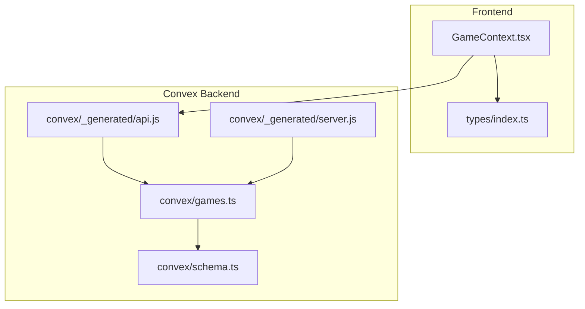
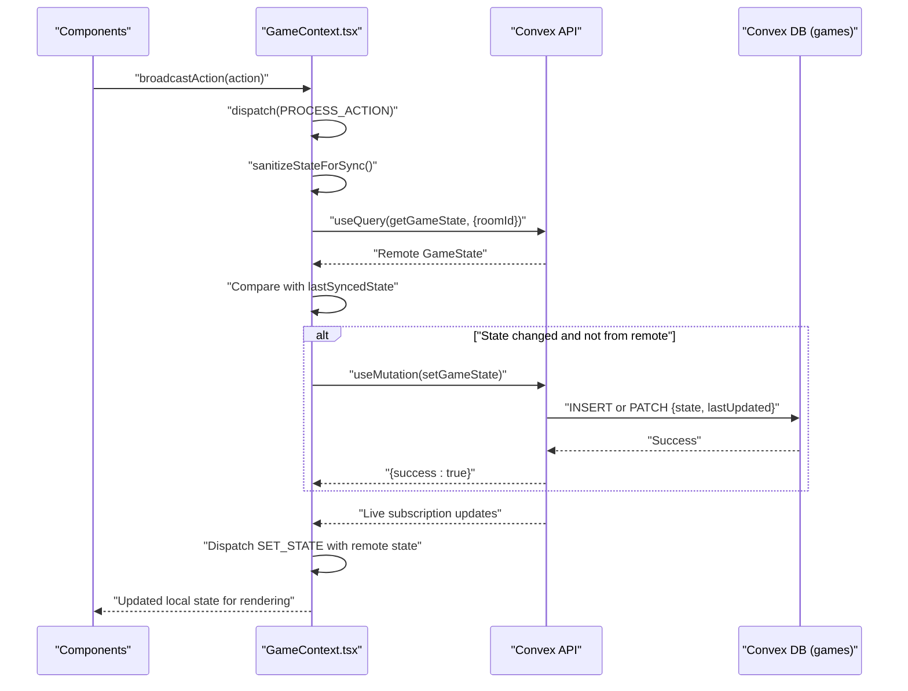
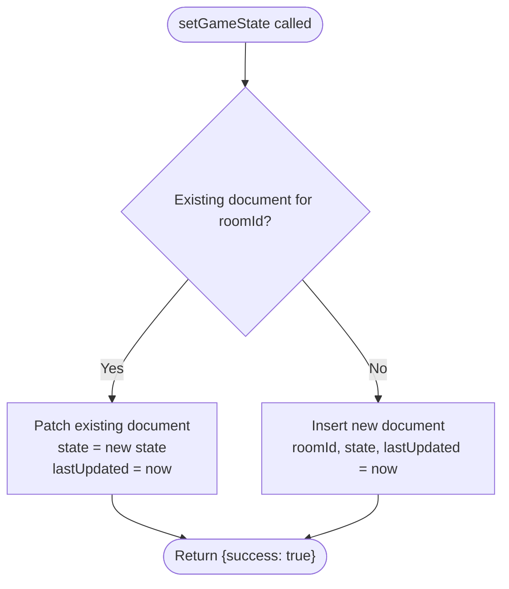
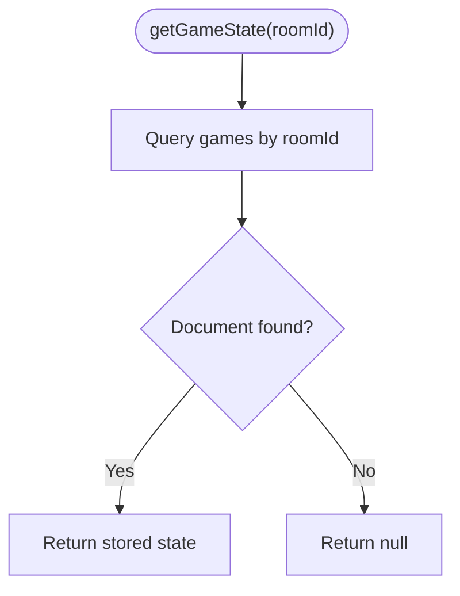
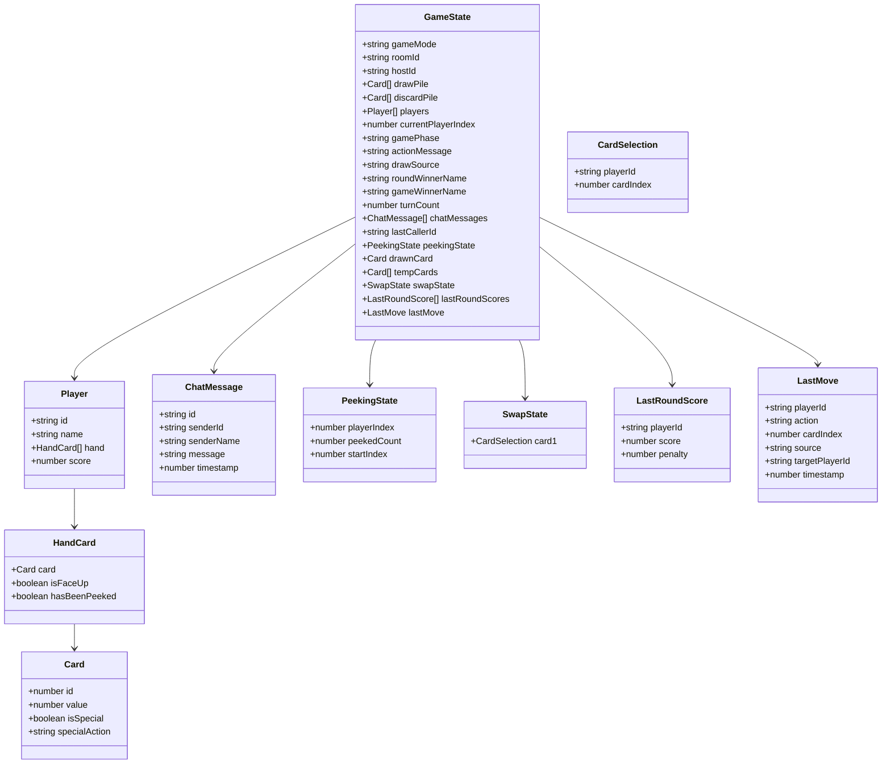
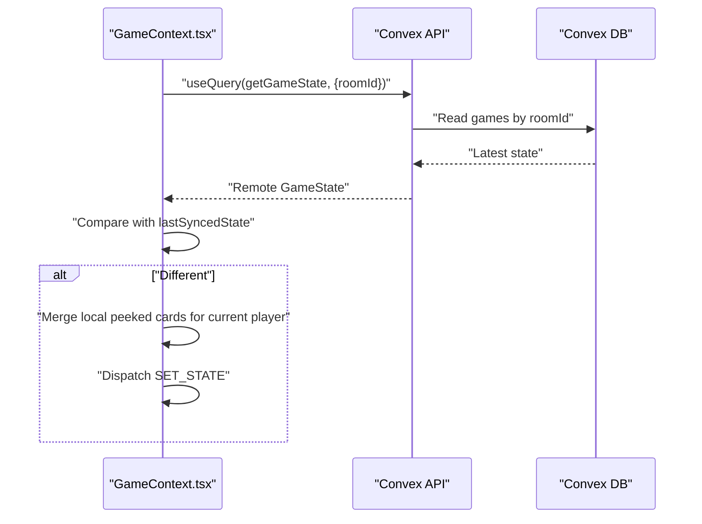
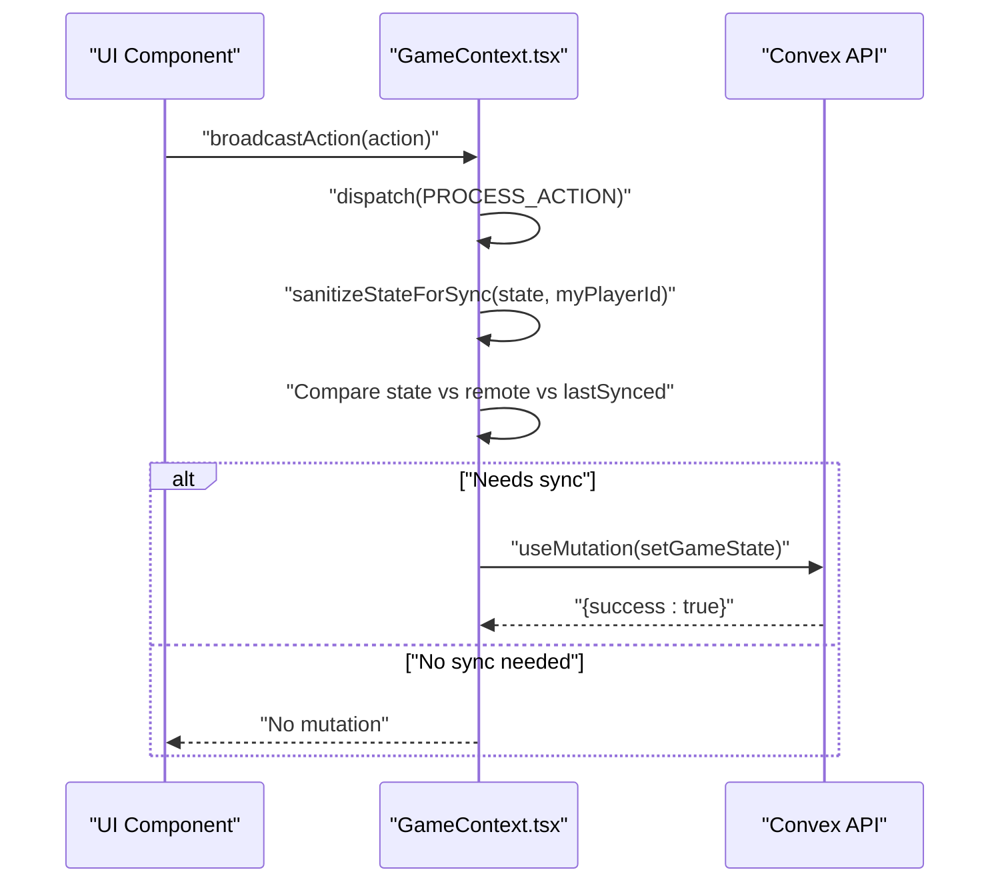
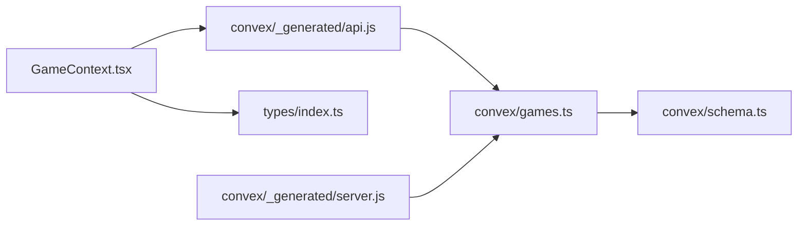

# Games API Client

<cite>
**Referenced Files in This Document**
- [GameContext.tsx](file://src/context/GameContext.tsx)
- [games.ts](file://convex/games.ts)
- [schema.ts](file://convex/schema.ts)
- [index.ts](file://src/types/index.ts)
- [api.js](file://convex/_generated/api.js)
- [server.js](file://convex/_generated/server.js)
</cite>

## Table of Contents
1. [Introduction](#introduction)
2. [Project Structure](#project-structure)
3. [Core Components](#core-components)
4. [Architecture Overview](#architecture-overview)
5. [Detailed Component Analysis](#detailed-component-analysis)
6. [Dependency Analysis](#dependency-analysis)
7. [Performance Considerations](#performance-considerations)
8. [Troubleshooting Guide](#troubleshooting-guide)
9. [Conclusion](#conclusion)

## Introduction
This document provides detailed API documentation for the Games API client in sen-web. It focuses on the two primary functions in the Convex backend that enable real-time synchronization of the complete game state across clients:
- setGameState: persists and synchronizes the complete game state (including player hands, scores, and game phase) to the Convex database.
- getGameState: retrieves the current state by roomId.

It explains how these functions integrate with Convex’s reactive query subscriptions to keep all clients in sync, details the GameState data structure and its serialization pattern, and describes how frequent updates are optimized using lastUpdated timestamps. It also covers how GameContext.tsx triggers setGameState mutations via broadcastAction and subscribes to live game state changes, along with error handling strategies, security considerations, and performance guidance.

## Project Structure
The Games API client spans both the frontend React context and the Convex backend functions:
- Frontend: GameContext.tsx orchestrates local state, broadcasts actions, sanitizes state for privacy, debounces and deduplicates updates, and subscribes to remote state via Convex queries.
- Backend: convex/games.ts defines setGameState and getGameState, which read/write the “games” table in convex/schema.ts.
- Types: src/types/index.ts defines GameState and related types used across the app.

**Diagram sources**
- [GameContext.tsx](file://src/context/GameContext.tsx#L588-L607)
- [games.ts](file://convex/games.ts#L1-L41)
- [schema.ts](file://convex/schema.ts#L24-L30)
- [api.js](file://convex/_generated/api.js#L11-L21)
- [server.js](file://convex/_generated/server.js#L11-L20)

**Section sources**
- [GameContext.tsx](file://src/context/GameContext.tsx#L588-L607)
- [games.ts](file://convex/games.ts#L1-L41)
- [schema.ts](file://convex/schema.ts#L24-L30)
- [api.js](file://convex/_generated/api.js#L11-L21)
- [server.js](file://convex/_generated/server.js#L11-L20)

## Core Components
- setGameState (mutation)
  - Persists the complete GameState to the “games” table keyed by roomId.
  - Updates lastUpdated to the current timestamp on each write.
  - Inserts a new document if roomId does not exist; otherwise patches the existing document.
- getGameState (query)
  - Retrieves the persisted GameState for a given roomId.
  - Returns null if no document exists for the roomId.

These functions are generated and exposed via Convex’s public API and consumed by the frontend through Convex React hooks.

**Section sources**
- [games.ts](file://convex/games.ts#L1-L41)
- [schema.ts](file://convex/schema.ts#L24-L30)

## Architecture Overview
The real-time synchronization architecture relies on:
- Frontend: GameContext.tsx maintains a local GameState and uses Convex React hooks to subscribe to getGameState(roomId).
- Backend: setGameState persists the state and updates lastUpdated; getGameState returns the latest state for a roomId.
- Privacy: sanitizeStateForSync hides temporary peeked cards from opponents during the peeking phase before syncing.

**Diagram sources**
- [GameContext.tsx](file://src/context/GameContext.tsx#L588-L607)
- [GameContext.tsx](file://src/context/GameContext.tsx#L883-L922)
- [GameContext.tsx](file://src/context/GameContext.tsx#L842-L881)
- [games.ts](file://convex/games.ts#L1-L41)

## Detailed Component Analysis

### setGameState (mutation)
- Purpose: Persist the complete GameState to the “games” table and update lastUpdated.
- Behavior:
  - Reads the existing document by roomId.
  - Patches the existing document with state and lastUpdated if it exists.
  - Inserts a new document with state and lastUpdated if it does not exist.
  - Returns a success indicator.
- Serialization pattern:
  - The state argument is typed as v.any() in the backend, indicating the full GameState object is serialized and stored as-is.
  - On the frontend, state is sanitized before sending to hide temporary peeked cards from opponents.

**Diagram sources**
- [games.ts](file://convex/games.ts#L1-L41)

**Section sources**
- [games.ts](file://convex/games.ts#L1-L41)

### getGameState (query)
- Purpose: Retrieve the persisted GameState for a given roomId.
- Behavior:
  - Queries the “games” table by roomId.
  - Returns the stored state or null if no document exists.
- Subscription:
  - Frontend subscribes to this query via Convex React hooks, enabling reactive updates as setGameState writes occur.

**Diagram sources**
- [games.ts](file://convex/games.ts#L32-L41)

**Section sources**
- [games.ts](file://convex/games.ts#L32-L41)

### GameState data structure and serialization
- Definition: The GameState interface includes gameMode, roomId, hostId, drawPile, discardPile, players, currentPlayerIndex, gamePhase, actionMessage, drawSource, roundWinnerName, gameWinnerName, turnCount, chatMessages, lastCallerId, peekingState, drawnCard, tempCards, swapState, lastRoundScores, and lastMove.
- Serialization pattern:
  - Stored as v.any() in the backend schema, meaning the entire GameState object is serialized and stored in the state field.
  - Frontend sanitization ensures privacy during peeking by hiding temporary peeked cards from opponents before syncing.

**Diagram sources**
- [index.ts](file://src/types/index.ts#L1-L100)

**Section sources**
- [index.ts](file://src/types/index.ts#L37-L79)
- [schema.ts](file://convex/schema.ts#L24-L30)

### Real-time synchronization with Convex reactive queries
- Subscription:
  - GameContext.tsx subscribes to getGameState using useQuery with roomId when in online mode.
  - Subscriptions automatically re-run when the underlying data changes, keeping the UI in sync.
- Local state reconciliation:
  - The frontend compares the remote state with the last synced state to avoid infinite loops.
  - During the peeking phase, the frontend merges local peeked cards with the remote state to preserve visibility of cards the current player peeked locally.

**Diagram sources**
- [GameContext.tsx](file://src/context/GameContext.tsx#L595-L600)
- [GameContext.tsx](file://src/context/GameContext.tsx#L616-L682)
- [GameContext.tsx](file://src/context/GameContext.tsx#L842-L881)

**Section sources**
- [GameContext.tsx](file://src/context/GameContext.tsx#L595-L600)
- [GameContext.tsx](file://src/context/GameContext.tsx#L616-L682)
- [GameContext.tsx](file://src/context/GameContext.tsx#L842-L881)

### How broadcastAction triggers setGameState mutations
- broadcastAction:
  - Plays sound effects based on action type.
  - Dispatches a PROCESS_ACTION to update local state.
  - The useEffect that watches state and remoteGameState triggers a debounced setGameState mutation when local state differs from both the last synced state and the remote state.
- Sanitization:
  - sanitizeStateForSync hides temporary peeked cards from opponents during peeking before sending to the backend.

**Diagram sources**
- [GameContext.tsx](file://src/context/GameContext.tsx#L818-L846)
- [GameContext.tsx](file://src/context/GameContext.tsx#L883-L922)
- [GameContext.tsx](file://src/context/GameContext.tsx#L842-L881)

**Section sources**
- [GameContext.tsx](file://src/context/GameContext.tsx#L818-L846)
- [GameContext.tsx](file://src/context/GameContext.tsx#L883-L922)
- [GameContext.tsx](file://src/context/GameContext.tsx#L842-L881)

### Security considerations
- State sanitization:
  - During the peeking phase, sanitizeStateForSync ensures that temporary peeked cards are hidden from opponents when syncing to the backend, preserving game fairness.
- Privacy enforcement:
  - Remote subscribers only receive sanitized state; the frontend merges local peeked cards back into the remote state for the current player’s view.
- Consistency:
  - The reducer enforces game-phase transitions and action validity, reducing the risk of inconsistent state propagation.

**Section sources**
- [GameContext.tsx](file://src/context/GameContext.tsx#L842-L881)
- [GameContext.tsx](file://src/context/GameContext.tsx#L634-L682)

### Error handling strategies
- Network failures:
  - setGameState mutation calls are wrapped in try/catch blocks; failures are logged and the UI remains functional.
  - Join room attempts include retry logic with backoff for transient errors like “Room not found.”
- Consistency checks:
  - The frontend avoids syncing when state equals remote state to prevent loops.
  - A debounce mechanism reduces rapid-fire updates.

**Section sources**
- [GameContext.tsx](file://src/context/GameContext.tsx#L907-L917)
- [GameContext.tsx](file://src/context/GameContext.tsx#L1006-L1049)

## Dependency Analysis
- Frontend dependencies:
  - GameContext.tsx depends on Convex React hooks (useQuery, useMutation) and the generated api object to call setGameState and getGameState.
  - It depends on GameState and related types from src/types/index.ts.
- Backend dependencies:
  - convex/games.ts depends on Convex server utilities and schema.ts for the “games” table.
  - The “games” table stores roomId, state, and lastUpdated.

**Diagram sources**
- [GameContext.tsx](file://src/context/GameContext.tsx#L588-L607)
- [api.js](file://convex/_generated/api.js#L11-L21)
- [games.ts](file://convex/games.ts#L1-L41)
- [schema.ts](file://convex/schema.ts#L24-L30)
- [server.js](file://convex/_generated/server.js#L11-L20)

**Section sources**
- [GameContext.tsx](file://src/context/GameContext.tsx#L588-L607)
- [api.js](file://convex/_generated/api.js#L11-L21)
- [games.ts](file://convex/games.ts#L1-L41)
- [schema.ts](file://convex/schema.ts#L24-L30)
- [server.js](file://convex/_generated/server.js#L11-L20)

## Performance Considerations
- Minimizing unnecessary state updates:
  - Compare JSON strings of sanitized state against lastSyncedState and remote state before invoking setGameState.
  - Debounce rapid updates with a short timeout to batch changes.
- Efficient data retrieval:
  - Use Convex reactive queries to subscribe to getGameState; the framework handles caching and incremental updates.
- Serialization overhead:
  - Storing the entire GameState as v.any() simplifies updates but increases payload size. Consider optimizing by storing only diffs if needed, balancing simplicity and bandwidth.
- Privacy filtering:
  - sanitizeStateForSync runs on the frontend before syncing, avoiding extra backend computation.

[No sources needed since this section provides general guidance]

## Troubleshooting Guide
- Symptom: No live updates on other clients
  - Verify that useQuery(getGameState, {roomId}) is active and that roomId is set.
  - Confirm that setGameState is being invoked after local state changes.
- Symptom: Opponents see temporary peeked cards
  - Ensure sanitizeStateForSync is applied before syncing during peeking.
- Symptom: Frequent network requests
  - Check that debounce and comparison logic are functioning (state vs remote vs lastSynced).
- Symptom: Room join fails intermittently
  - Review retry logic and error messages; “Room not found” is retried with backoff.

**Section sources**
- [GameContext.tsx](file://src/context/GameContext.tsx#L595-L600)
- [GameContext.tsx](file://src/context/GameContext.tsx#L883-L922)
- [GameContext.tsx](file://src/context/GameContext.tsx#L842-L881)
- [GameContext.tsx](file://src/context/GameContext.tsx#L1006-L1049)

## Conclusion
The Games API client in sen-web leverages Convex’s mutation and query primitives to achieve robust, real-time synchronization of the complete game state. setGameState persists the GameState and updates lastUpdated, while getGameState provides a reactive subscription for live updates. GameContext.tsx coordinates local state, sanitizes sensitive information, debounces updates, and reconciles remote state to maintain consistency and fairness. With careful error handling and performance strategies, the system delivers responsive multiplayer gameplay.