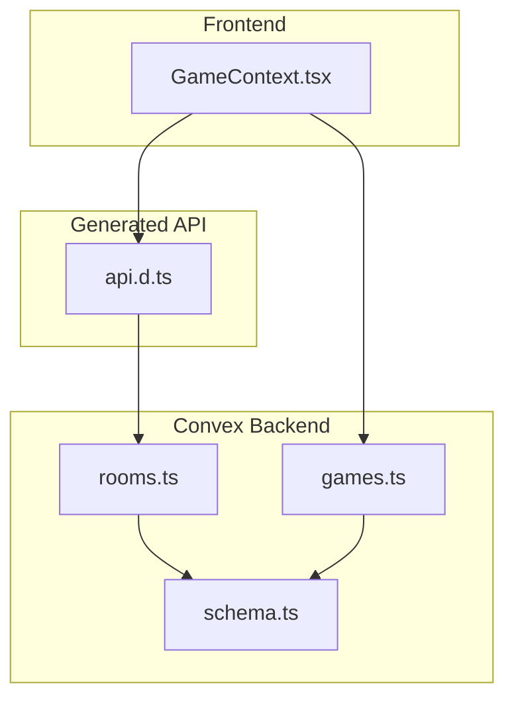
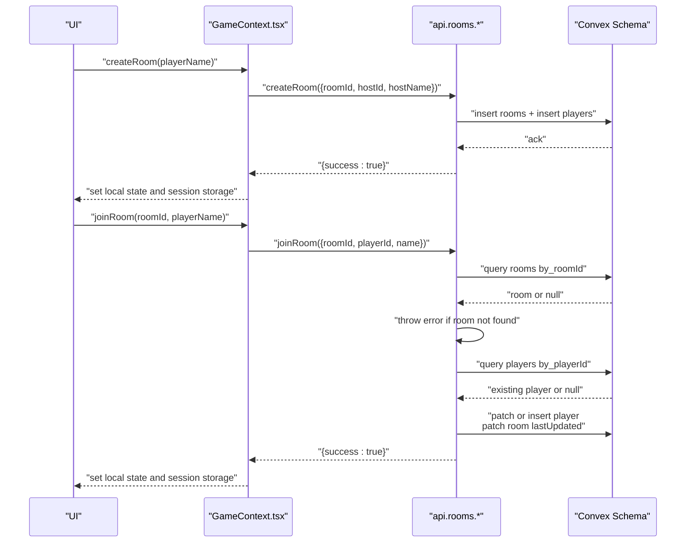
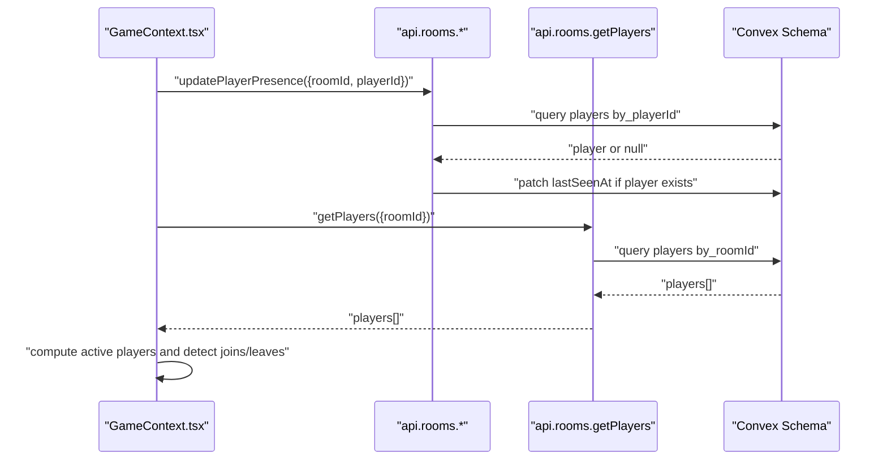
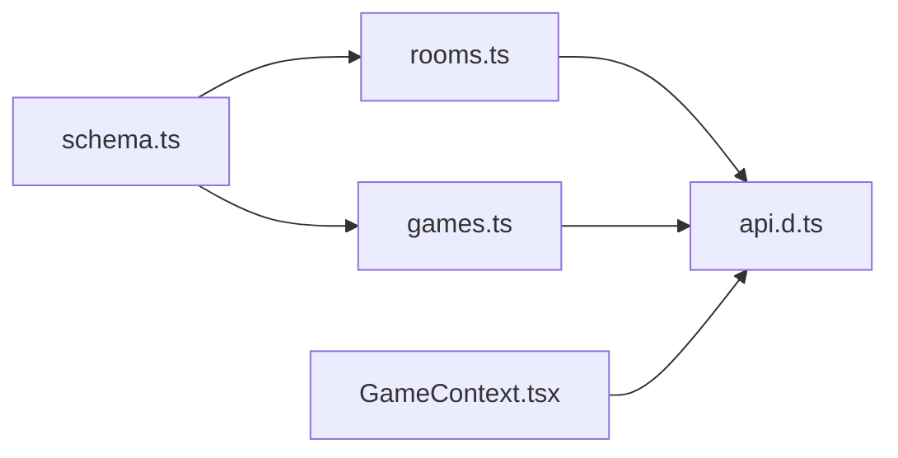

# Rooms API Client

<cite>
**Referenced Files in This Document**
- [rooms.ts](file://convex/rooms.ts)
- [schema.ts](file://convex/schema.ts)
- [api.d.ts](file://convex/_generated/api.d.ts)
- [GameContext.tsx](file://src/context/GameContext.tsx)
- [games.ts](file://convex/games.ts)
- [index.ts](file://src/types/index.ts)
</cite>

## Table of Contents
1. [Introduction](#introduction)
2. [Project Structure](#project-structure)
3. [Core Components](#core-components)
4. [Architecture Overview](#architecture-overview)
5. [Detailed Component Analysis](#detailed-component-analysis)
6. [Dependency Analysis](#dependency-analysis)
7. [Performance Considerations](#performance-considerations)
8. [Troubleshooting Guide](#troubleshooting-guide)
9. [Conclusion](#conclusion)
10. [Appendices](#appendices)

## Introduction
This document provides comprehensive API documentation for the Rooms API client in sen-web. It focuses on the functions exposed in convex/rooms.ts and how they are consumed through Convex’s mutation and query system from the frontend. It explains the Room and Player entities, their fields and relationships, and demonstrates how GameContext orchestrates room creation and joining workflows. It also covers error handling, input validation, rate limiting considerations, security patterns, and performance optimizations using indexed queries.

## Project Structure
The Rooms API is implemented in Convex and consumed by the React frontend via Convex’s generated API utilities. The relevant files are:
- convex/rooms.ts: Exposes mutations and queries for room lifecycle and player presence
- convex/schema.ts: Defines the data model and indexes used for efficient queries
- convex/_generated/api.d.ts: Provides strongly-typed references to Convex functions
- src/context/GameContext.tsx: Frontend orchestration for room creation/joining and presence updates
- convex/games.ts: Related game state persistence and retrieval
- src/types/index.ts: Shared types used across the app, including Player and GameState

**Diagram sources**
- [rooms.ts](file://convex/rooms.ts#L1-L119)
- [schema.ts](file://convex/schema.ts#L1-L42)
- [api.d.ts](file://convex/_generated/api.d.ts#L1-L58)
- [GameContext.tsx](file://src/context/GameContext.tsx#L1-L1152)
- [games.ts](file://convex/games.ts#L1-L43)

**Section sources**
- [rooms.ts](file://convex/rooms.ts#L1-L119)
- [schema.ts](file://convex/schema.ts#L1-L42)
- [api.d.ts](file://convex/_generated/api.d.ts#L1-L58)
- [GameContext.tsx](file://src/context/GameContext.tsx#L1-L1152)
- [games.ts](file://convex/games.ts#L1-L43)

## Core Components
- createRoom: Initializes a new game room and registers the host as the first player
- joinRoom: Adds a player to an existing room, validates room existence, and maintains presence
- getRoom: Retrieves room metadata by roomId
- getPlayers: Fetches all players in a given room
- updatePlayerPresence: Updates a player’s lastSeenAt timestamp to mark activity

These functions are typed and exported via Convex’s generated API module and consumed by GameContext using Convex’s React hooks.

**Section sources**
- [rooms.ts](file://convex/rooms.ts#L1-L119)
- [api.d.ts](file://convex/_generated/api.d.ts#L1-L58)
- [GameContext.tsx](file://src/context/GameContext.tsx#L562-L600)

## Architecture Overview
The Rooms API integrates with the broader game state system. Room creation and joining are handled by Convex mutations, while room metadata and player lists are retrieved via Convex queries. Presence updates are periodic and help detect inactive players. Game state synchronization uses a separate module.

**Diagram sources**
- [rooms.ts](file://convex/rooms.ts#L1-L119)
- [schema.ts](file://convex/schema.ts#L1-L42)
- [GameContext.tsx](file://src/context/GameContext.tsx#L955-L1058)

## Detailed Component Analysis

### createRoom
Purpose:
- Create a new room with host information and register the host as the first player
- Set timestamps for createdAt and lastUpdated

Inputs:
- roomId: string
- hostId: string
- hostName: string

Behavior:
- Inserts a new room record with timestamps
- Inserts a new player record for the host with lastSeenAt set to now
- Returns a success indicator

Frontend consumption:
- Called from GameContext.createRoom
- Stores identifiers in session storage and initializes local state

Error handling:
- No explicit error thrown here; errors in downstream flows (e.g., joinRoom) may bubble up

**Section sources**
- [rooms.ts](file://convex/rooms.ts#L1-L28)
- [GameContext.tsx](file://src/context/GameContext.tsx#L955-L994)

### joinRoom
Purpose:
- Allow a player to join an existing room
- Validate room existence
- Manage player presence (create/update lastSeenAt)
- Update room lastUpdated

Inputs:
- roomId: string
- playerId: string
- name: string

Behavior:
- Queries rooms by roomId using an index
- Throws an error if room does not exist
- Queries players by playerId using an index
- If player exists, updates lastSeenAt; otherwise inserts a new player
- Patches room lastUpdated

Frontend consumption:
- Called from GameContext.joinRoom with retry logic for “Room not found”
- Initializes local state and session storage on success

Error handling:
- Throws “Room not found” when the room does not exist
- GameContext.joinRoom retries a few times with short delays before giving up

**Section sources**
- [rooms.ts](file://convex/rooms.ts#L30-L76)
- [GameContext.tsx](file://src/context/GameContext.tsx#L998-L1058)

### getRoom
Purpose:
- Retrieve room metadata by roomId

Inputs:
- roomId: string

Behavior:
- Queries rooms by roomId using an index
- Returns the room record or null

Frontend consumption:
- Used indirectly via GameContext reconnection and room metadata flows

**Section sources**
- [rooms.ts](file://convex/rooms.ts#L78-L87)
- [schema.ts](file://convex/schema.ts#L1-L42)

### getPlayers
Purpose:
- Fetch all players in a given room

Inputs:
- roomId: string

Behavior:
- Queries players by roomId using an index
- Collects all matching records

Frontend consumption:
- Consumed by GameContext to compute active players and detect joins/leaves

**Section sources**
- [rooms.ts](file://convex/rooms.ts#L89-L98)
- [schema.ts](file://convex/schema.ts#L1-L42)
- [GameContext.tsx](file://src/context/GameContext.tsx#L698-L780)

### updatePlayerPresence
Purpose:
- Maintain active player status by updating lastSeenAt

Inputs:
- roomId: string
- playerId: string

Behavior:
- Queries players by playerId using an index
- Patches lastSeenAt if the player exists

Frontend consumption:
- Periodic updates every 10 seconds in GameContext

**Section sources**
- [rooms.ts](file://convex/rooms.ts#L100-L117)
- [schema.ts](file://convex/schema.ts#L1-L42)
- [GameContext.tsx](file://src/context/GameContext.tsx#L782-L791)

### Data Models

#### Room entity
Fields:
- roomId: string
- hostId: string
- hostName: string
- createdAt: number
- lastUpdated: number

Indexes:
- by_roomId: [roomId]
- by_hostId: [hostId]

Relationships:
- One room contains many players via players.roomId

**Section sources**
- [schema.ts](file://convex/schema.ts#L1-L42)

#### Player entity
Fields:
- roomId: string
- playerId: string
- name: string
- lastSeenAt: number

Indexes:
- by_roomId: [roomId]
- by_playerId: [playerId]

Relationships:
- Many players belong to one room via roomId
- Presence maintained by lastSeenAt

**Section sources**
- [schema.ts](file://convex/schema.ts#L1-L42)

#### GameState and Player relationship
- Player is part of GameState.players
- Player.hand contains cards with visibility flags used during peeking

**Section sources**
- [index.ts](file://src/types/index.ts#L1-L100)

### How GameContext Uses Rooms API
- Room creation:
  - Generates roomId and playerId
  - Calls createRoom mutation
  - Sets session storage and local state
- Room joining:
  - Generates playerId
  - Calls joinRoom mutation
  - Initializes local state and session storage
  - Implements retry logic for “Room not found”
- Presence maintenance:
  - Periodically calls updatePlayerPresence every 10 seconds
- Player presence detection:
  - Subscribes to players via getPlayers
  - Filters players based on lastSeenAt thresholds to detect joins/leaves

**Diagram sources**
- [GameContext.tsx](file://src/context/GameContext.tsx#L698-L791)
- [rooms.ts](file://convex/rooms.ts#L89-L117)
- [schema.ts](file://convex/schema.ts#L1-L42)

**Section sources**
- [GameContext.tsx](file://src/context/GameContext.tsx#L562-L600)
- [GameContext.tsx](file://src/context/GameContext.tsx#L782-L791)
- [GameContext.tsx](file://src/context/GameContext.tsx#L955-L1058)

## Dependency Analysis
- Convex modules:
  - rooms.ts depends on schema.ts indexes for efficient queries
  - games.ts depends on schema.ts indexes for room-scoped state
- Frontend:
  - GameContext.tsx consumes api.rooms.* via Convex React hooks
  - api.d.ts exposes typed references to rooms module functions

**Diagram sources**
- [schema.ts](file://convex/schema.ts#L1-L42)
- [rooms.ts](file://convex/rooms.ts#L1-L119)
- [games.ts](file://convex/games.ts#L1-L43)
- [api.d.ts](file://convex/_generated/api.d.ts#L1-L58)
- [GameContext.tsx](file://src/context/GameContext.tsx#L1-L1152)

**Section sources**
- [schema.ts](file://convex/schema.ts#L1-L42)
- [rooms.ts](file://convex/rooms.ts#L1-L119)
- [games.ts](file://convex/games.ts#L1-L43)
- [api.d.ts](file://convex/_generated/api.d.ts#L1-L58)
- [GameContext.tsx](file://src/context/GameContext.tsx#L1-L1152)

## Performance Considerations
- Indexed queries:
  - rooms: by_roomId, by_hostId
  - players: by_roomId, by_playerId
  - games: by_roomId
  These indexes enable O(1) lookups for room and player queries, minimizing latency in multiplayer interactions.
- Presence updates:
  - updatePlayerPresence runs every 10 seconds to keep lastSeenAt fresh
  - Frontend filters players based on lastSeenAt thresholds to detect joins/leaves efficiently
- Data fetching strategies:
  - Use getPlayers to compute active players and avoid polling the entire room state
  - Use getRoom for metadata checks before joinRoom to reduce error retries

**Section sources**
- [schema.ts](file://convex/schema.ts#L1-L42)
- [rooms.ts](file://convex/rooms.ts#L30-L76)
- [rooms.ts](file://convex/rooms.ts#L89-L117)
- [GameContext.tsx](file://src/context/GameContext.tsx#L698-L791)

## Troubleshooting Guide
Common issues and resolutions:
- Room not found during join:
  - Symptom: Error message indicating room not found
  - Resolution: GameContext.joinRoom retries a few times with short delays; ensure the roomId is correct and the room exists
- Player presence timeouts:
  - Symptom: Opponent appears to leave unexpectedly
  - Resolution: Adjust thresholds in GameContext presence filtering; consider longer timeouts for initial join scenarios
- Duplicate joins:
  - Symptom: Multiple entries for the same playerId
  - Resolution: joinRoom checks by_playerId and updates lastSeenAt; ensure playerId is unique per session
- Session reconnection:
  - Symptom: Cannot reconnect after refresh
  - Resolution: GameContext.reconnect attempts to join using stored identifiers; clears session storage on failure

**Section sources**
- [rooms.ts](file://convex/rooms.ts#L30-L76)
- [GameContext.tsx](file://src/context/GameContext.tsx#L800-L816)
- [GameContext.tsx](file://src/context/GameContext.tsx#L998-L1058)
- [GameContext.tsx](file://src/context/GameContext.tsx#L698-L791)

## Conclusion
The Rooms API provides a robust foundation for room lifecycle and player presence in sen-web. Its indexed queries and minimal mutation surface enable responsive multiplayer experiences. GameContext coordinates room creation and joining, manages presence updates, and integrates with the broader game state system. Following the guidance in this document will help ensure reliable, performant, and secure multiplayer gameplay.

## Appendices

### API Reference

- createRoom
  - Mutation
  - Inputs: roomId, hostId, hostName
  - Behavior: Creates room and registers host as player
  - Frontend usage: Called from GameContext.createRoom

- joinRoom
  - Mutation
  - Inputs: roomId, playerId, name
  - Behavior: Validates room existence, creates/updates player presence, updates room lastUpdated
  - Frontend usage: Called from GameContext.joinRoom with retry logic

- getRoom
  - Query
  - Inputs: roomId
  - Behavior: Returns room metadata by roomId
  - Frontend usage: Used for metadata checks and reconnection

- getPlayers
  - Query
  - Inputs: roomId
  - Behavior: Returns all players in a room
  - Frontend usage: Computes active players and detects joins/leaves

- updatePlayerPresence
  - Mutation
  - Inputs: roomId, playerId
  - Behavior: Updates player lastSeenAt
  - Frontend usage: Periodic updates every 10 seconds

**Section sources**
- [rooms.ts](file://convex/rooms.ts#L1-L119)
- [GameContext.tsx](file://src/context/GameContext.tsx#L562-L600)
- [GameContext.tsx](file://src/context/GameContext.tsx#L782-L791)
- [GameContext.tsx](file://src/context/GameContext.tsx#L955-L1058)

### Security and Rate Limiting Guidance
- Authentication and authorization:
  - The Rooms API does not enforce authorization checks in the provided code. Consider adding server-side guards to ensure only authorized players can join or modify rooms.
- Rate limiting:
  - Presence updates occur every 10 seconds; consider throttling join attempts and limiting bulk operations to prevent abuse.
- Input validation:
  - Validate roomId and playerId lengths and formats before invoking mutations.
  - Enforce non-empty names and reasonable length limits.

[No sources needed since this section provides general guidance]