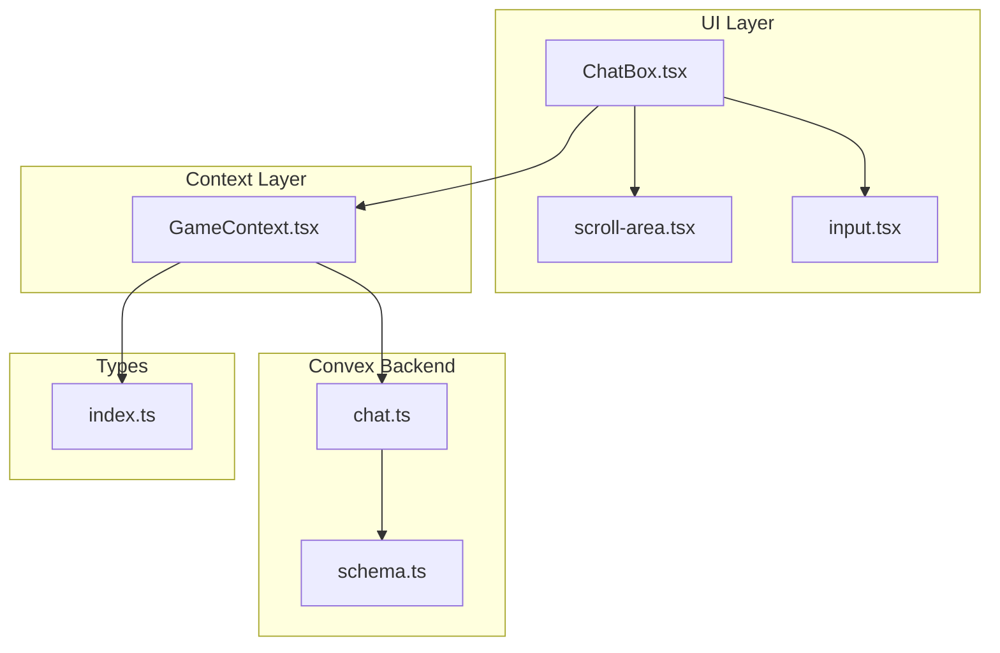
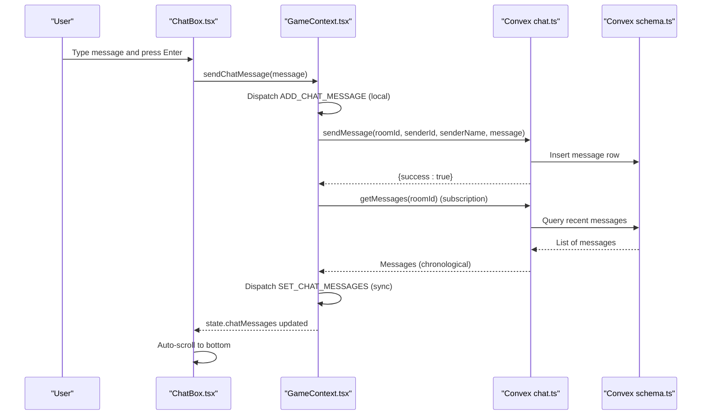
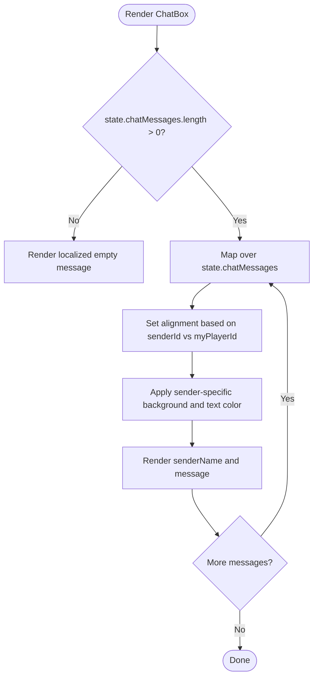
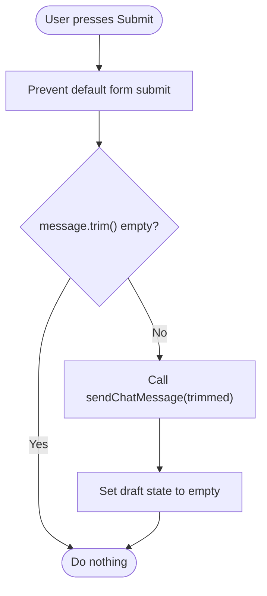
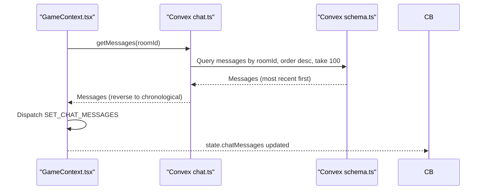
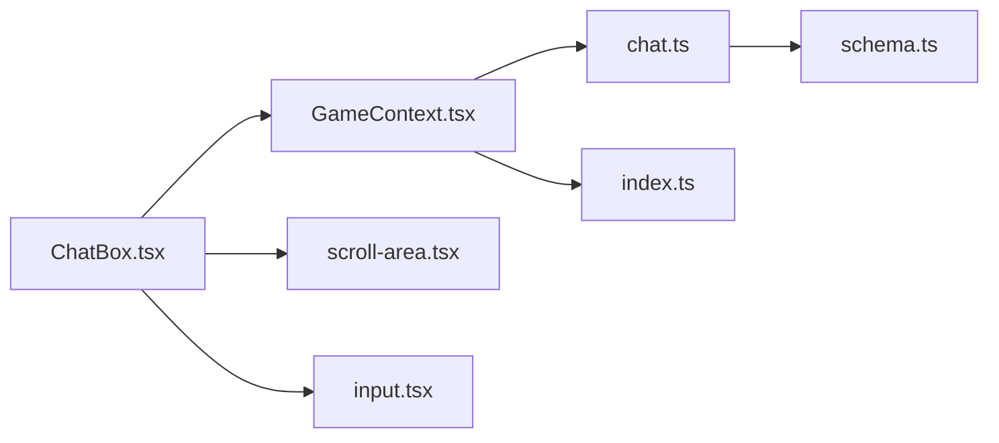

# Chat Box

<cite>
**Referenced Files in This Document**
- [ChatBox.tsx](file://src/components/ChatBox.tsx)
- [GameContext.tsx](file://src/context/GameContext.tsx)
- [scroll-area.tsx](file://src/components/ui/scroll-area.tsx)
- [chat.ts](file://convex/chat.ts)
- [schema.ts](file://convex/schema.ts)
- [index.ts](file://src/types/index.ts)
- [utils.ts](file://src/lib/utils.ts)
- [input.tsx](file://src/components/ui/input.tsx)
- [index.css](file://src/index.css)
</cite>

## Table of Contents
1. [Introduction](#introduction)
2. [Project Structure](#project-structure)
3. [Core Components](#core-components)
4. [Architecture Overview](#architecture-overview)
5. [Detailed Component Analysis](#detailed-component-analysis)
6. [Dependency Analysis](#dependency-analysis)
7. [Performance Considerations](#performance-considerations)
8. [Troubleshooting Guide](#troubleshooting-guide)
9. [Conclusion](#conclusion)
10. [Appendices](#appendices)

## Introduction
This document explains the ChatBox component that powers real-time chat among players. It covers how messages are rendered with sender alignment and visual differentiation, how the input form handles submission and state, and how the component integrates with the Convex backend via GameContext. It also addresses accessibility, mobile behavior, message length considerations, and XSS safety.

## Project Structure
The ChatBox is a UI component that renders a scrollable message list and an input form. It relies on:
- GameContext for state and the sendChatMessage function
- Convex chat module for persistence and synchronization
- Radix UI ScrollArea for overflow handling and scrollbar behavior
- Tailwind utility classes for layout and theming

**Diagram sources**
- [ChatBox.tsx](file://src/components/ChatBox.tsx#L1-L68)
- [scroll-area.tsx](file://src/components/ui/scroll-area.tsx#L1-L49)
- [input.tsx](file://src/components/ui/input.tsx#L1-L22)
- [GameContext.tsx](file://src/context/GameContext.tsx#L924-L953)
- [chat.ts](file://convex/chat.ts#L1-L35)
- [schema.ts](file://convex/schema.ts#L1-L42)
- [index.ts](file://src/types/index.ts#L1-L100)

**Section sources**
- [ChatBox.tsx](file://src/components/ChatBox.tsx#L1-L68)
- [GameContext.tsx](file://src/context/GameContext.tsx#L924-L953)
- [scroll-area.tsx](file://src/components/ui/scroll-area.tsx#L1-L49)
- [chat.ts](file://convex/chat.ts#L1-L35)
- [schema.ts](file://convex/schema.ts#L1-L42)
- [index.ts](file://src/types/index.ts#L1-L100)

## Core Components
- ChatBox: Renders messages, handles input, and auto-scrolls to the latest message.
- GameContext: Provides sendChatMessage and manages chatMessages state.
- Convex chat module: Persists messages and serves recent messages to clients.
- ScrollArea: Provides overflow handling and scrollbar behavior.
- Types: Defines ChatMessage and GameState shapes.

Key responsibilities:
- Message rendering: Sender alignment and visual differentiation
- Form submission: Draft state management and validation
- Real-time sync: Updates from Convex queries and reducer actions
- Accessibility: Keyboard navigation and ARIA considerations

**Section sources**
- [ChatBox.tsx](file://src/components/ChatBox.tsx#L1-L68)
- [GameContext.tsx](file://src/context/GameContext.tsx#L924-L953)
- [chat.ts](file://convex/chat.ts#L1-L35)
- [scroll-area.tsx](file://src/components/ui/scroll-area.tsx#L1-L49)
- [index.ts](file://src/types/index.ts#L1-L100)

## Architecture Overview
The ChatBox subscribes to chat messages via Convex queries and updates its local state through a reducer. When a user submits a message, the component dispatches a local ADD_CHAT_MESSAGE action and calls sendChatMessage, which persists the message via Convex and triggers a re-query that updates chatMessages across clients.

**Diagram sources**
- [ChatBox.tsx](file://src/components/ChatBox.tsx#L1-L68)
- [GameContext.tsx](file://src/context/GameContext.tsx#L684-L696)
- [GameContext.tsx](file://src/context/GameContext.tsx#L924-L953)
- [chat.ts](file://convex/chat.ts#L1-L35)
- [schema.ts](file://convex/schema.ts#L1-L42)

## Detailed Component Analysis

### ChatBox Component
Responsibilities:
- Render a header with an icon and localized label
- Render a scrollable message list with sender alignment and visual styles
- Show an empty-state message when there are no messages
- Provide an input form with submit handling and draft state management
- Auto-scroll to the latest message when the message list changes

Implementation highlights:
- Uses ScrollArea for overflow handling and scrollbar behavior
- Applies Tailwind classes via cn for responsive layout and theming
- Uses i18n for labels and placeholders
- Uses refs to access the Radix viewport element for auto-scroll

Accessibility and UX:
- Input has autocomplete disabled to reduce browser suggestions
- Placeholder text is localized
- No explicit ARIA live region is present in the component itself

Common issues addressed:
- Auto-scroll on new messages via a useEffect watching chatMessages
- Empty-state message when chatMessages is empty
- Draft state cleared after successful submission

**Section sources**
- [ChatBox.tsx](file://src/components/ChatBox.tsx#L1-L68)
- [scroll-area.tsx](file://src/components/ui/scroll-area.tsx#L1-L49)
- [utils.ts](file://src/lib/utils.ts#L1-L7)
- [input.tsx](file://src/components/ui/input.tsx#L1-L22)

### Message Rendering Logic
- Sender alignment: Messages from the current player are right-aligned; others are left-aligned
- Visual differentiation: Current player messages use primary palette; others use secondary palette
- Sender identity: Displays senderName above message content
- Break-word handling: Long messages wrap appropriately
- Empty state: When chatMessages is empty, a localized message is shown

**Diagram sources**
- [ChatBox.tsx](file://src/components/ChatBox.tsx#L1-L68)
- [index.ts](file://src/types/index.ts#L1-L100)

**Section sources**
- [ChatBox.tsx](file://src/components/ChatBox.tsx#L1-L68)
- [index.ts](file://src/types/index.ts#L1-L100)

### Form Submission and State Management
- Draft state: Controlled input bound to a local state variable
- Validation: Submits only non-empty trimmed messages
- Submission flow: Prevent default, trim, call sendChatMessage, clear draft
- Focus behavior: No explicit focus management after submit in the component

**Diagram sources**
- [ChatBox.tsx](file://src/components/ChatBox.tsx#L1-L68)
- [GameContext.tsx](file://src/context/GameContext.tsx#L924-L953)

**Section sources**
- [ChatBox.tsx](file://src/components/ChatBox.tsx#L1-L68)
- [GameContext.tsx](file://src/context/GameContext.tsx#L924-L953)

### Real-Time Synchronization with Convex
- Subscription: GameContext subscribes to chat messages via a Convex query
- Sync: On receiving remote messages, GameContext dispatches SET_CHAT_MESSAGES to update local state
- Persistence: sendChatMessage dispatches a local ADD_CHAT_MESSAGE and calls sendMessage mutation
- Ordering: Convex returns messages in chronological order; ChatBox does not reverse again

**Diagram sources**
- [GameContext.tsx](file://src/context/GameContext.tsx#L684-L696)
- [chat.ts](file://convex/chat.ts#L1-L35)
- [schema.ts](file://convex/schema.ts#L1-L42)

**Section sources**
- [GameContext.tsx](file://src/context/GameContext.tsx#L684-L696)
- [chat.ts](file://convex/chat.ts#L1-L35)
- [schema.ts](file://convex/schema.ts#L1-L42)

### Accessibility Features
Current state in the component:
- Keyboard navigation: Standard form submission on Enter is supported
- Focus management: No explicit focus restoration after submit
- ARIA labels: No aria-live regions or roles are set in the component

Recommendations (general guidance):
- Add an aria-live region to announce new messages
- Restore focus to the input after successful submission
- Ensure labels for the input and button are descriptive

[No sources needed since this section provides general guidance]

### Mobile Device Behavior
Observed behavior:
- Input placeholder is localized
- Input component is standard HTML input with default mobile attributes
- No explicit mobile-specific props or event handlers in the component

Recommendations (general guidance):
- Consider adding input mode hints if needed
- Ensure adequate tap targets and spacing on small screens

**Section sources**
- [ChatBox.tsx](file://src/components/ChatBox.tsx#L1-L68)
- [input.tsx](file://src/components/ui/input.tsx#L1-L22)
- [index.css](file://src/index.css#L211-L279)

### Message Length Limitations and XSS Prevention
- Message length: There is no explicit client-side length limit in the component
- XSS prevention: The component renders message content directly. While the backend stores messages safely, the component does not sanitize HTML before rendering

Recommendations (general guidance):
- Enforce a reasonable client-side length limit
- Sanitize or escape HTML on the client before rendering
- Consider using a library to strip dangerous tags or encode content

**Section sources**
- [ChatBox.tsx](file://src/components/ChatBox.tsx#L1-L68)
- [chat.ts](file://convex/chat.ts#L1-L35)

## Dependency Analysis
- ChatBox depends on:
  - GameContext for state and sendChatMessage
  - ScrollArea for overflow handling
  - Tailwind utility function cn
  - i18n for localization
- GameContext depends on:
  - Convex queries and mutations for chat
  - GameState and ChatMessage types
- Convex chat module depends on:
  - schema for table definitions

**Diagram sources**
- [ChatBox.tsx](file://src/components/ChatBox.tsx#L1-L68)
- [GameContext.tsx](file://src/context/GameContext.tsx#L924-L953)
- [scroll-area.tsx](file://src/components/ui/scroll-area.tsx#L1-L49)
- [input.tsx](file://src/components/ui/input.tsx#L1-L22)
- [chat.ts](file://convex/chat.ts#L1-L35)
- [schema.ts](file://convex/schema.ts#L1-L42)
- [index.ts](file://src/types/index.ts#L1-L100)

**Section sources**
- [ChatBox.tsx](file://src/components/ChatBox.tsx#L1-L68)
- [GameContext.tsx](file://src/context/GameContext.tsx#L924-L953)
- [chat.ts](file://convex/chat.ts#L1-L35)
- [schema.ts](file://convex/schema.ts#L1-L42)
- [index.ts](file://src/types/index.ts#L1-L100)

## Performance Considerations
- Auto-scroll: The component scrolls to the bottom on every change to chatMessages. For very frequent updates, consider debouncing or checking if the user is near the bottom before auto-scrolling.
- Rendering: ChatBox maps over chatMessages for each render. If messages grow large, consider virtualization or pagination.
- Network: Convex query returns up to 100 messages. This keeps memory bounded but may drop older messages.

[No sources needed since this section provides general guidance]

## Troubleshooting Guide
- Messages not appearing:
  - Verify online mode and valid roomId
  - Confirm subscription to getMessages is active
- Auto-scroll not working:
  - Ensure the ref points to the ScrollArea and the viewport element exists
  - Check that the effect runs when chatMessages change
- Input not clearing:
  - Confirm handleSubmit clears the draft state after calling sendChatMessage
- Mobile input issues:
  - Test keyboard behavior and tap targets on small screens
- Accessibility concerns:
  - Add aria-live region for dynamic updates
  - Restore focus to input after submit

**Section sources**
- [ChatBox.tsx](file://src/components/ChatBox.tsx#L1-L68)
- [GameContext.tsx](file://src/context/GameContext.tsx#L684-L696)
- [index.css](file://src/index.css#L211-L279)

## Conclusion
The ChatBox component provides a straightforward, real-time chat experience. It leverages Radix UI ScrollArea for overflow handling, maintains a simple input form with draft state, and integrates tightly with GameContext and Convex for persistence and synchronization. Enhancements around accessibility, mobile behavior, message length limits, and XSS safety would improve robustness and user experience.

## Appendices

### API Definitions
- sendChatMessage(message: string): Persists a message and updates local state
- getMessages(roomId: string): Returns recent messages in chronological order

**Section sources**
- [GameContext.tsx](file://src/context/GameContext.tsx#L924-L953)
- [chat.ts](file://convex/chat.ts#L1-L35)