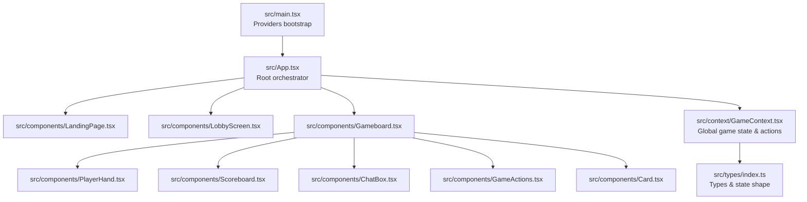
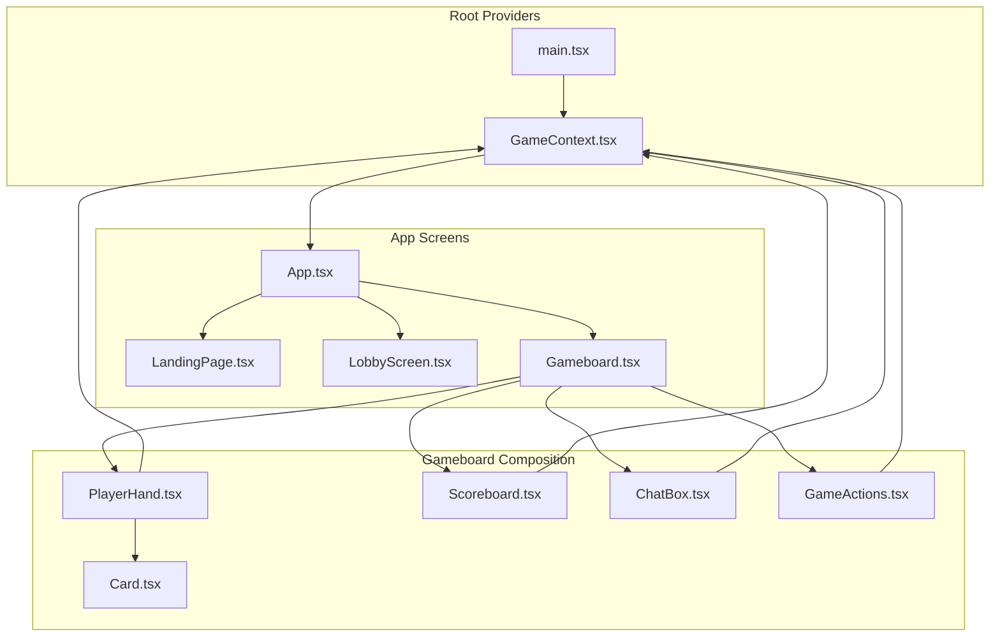
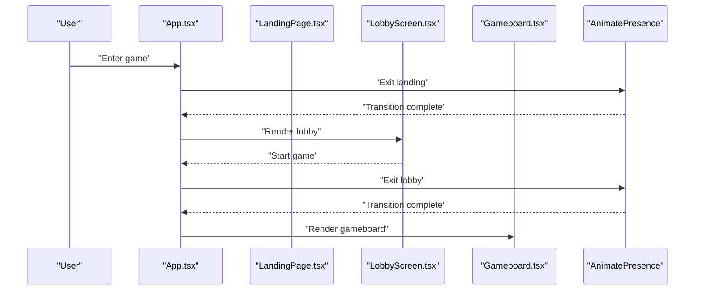
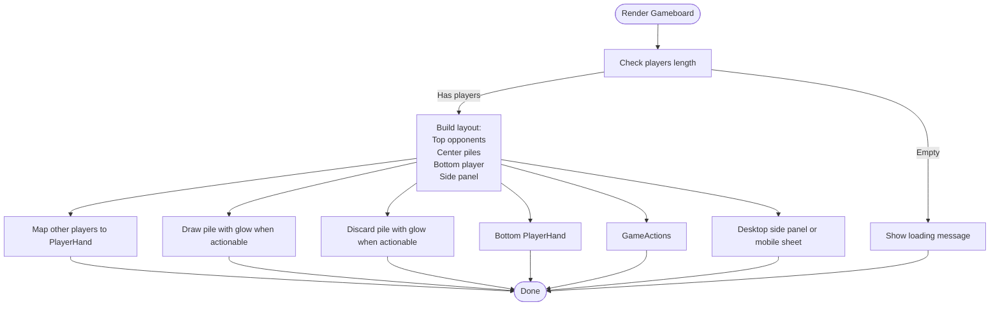
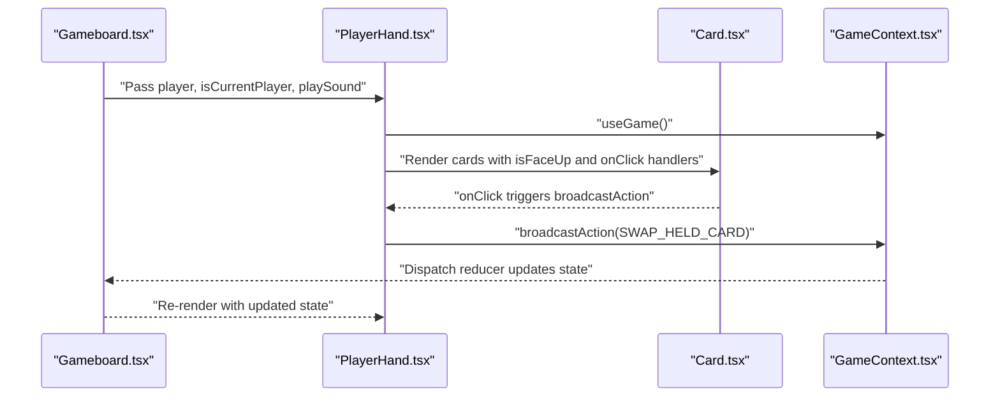
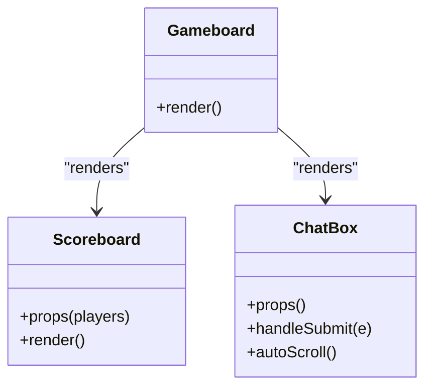
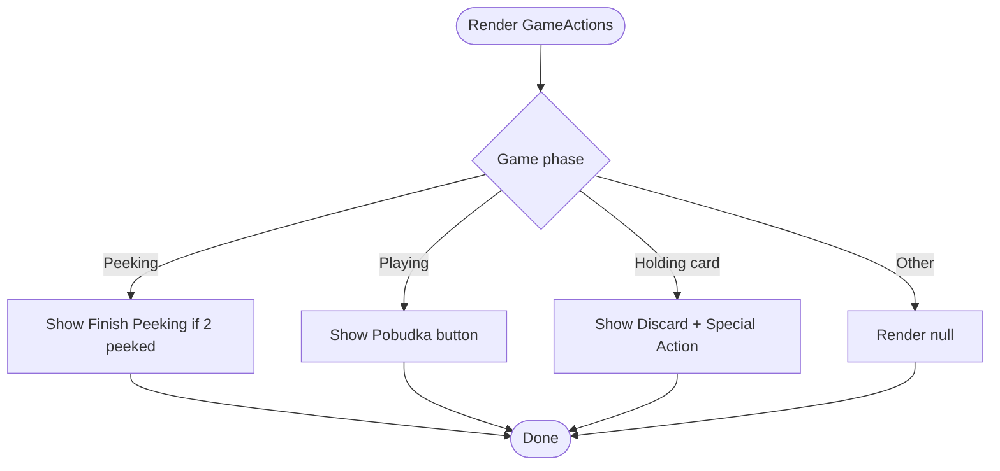
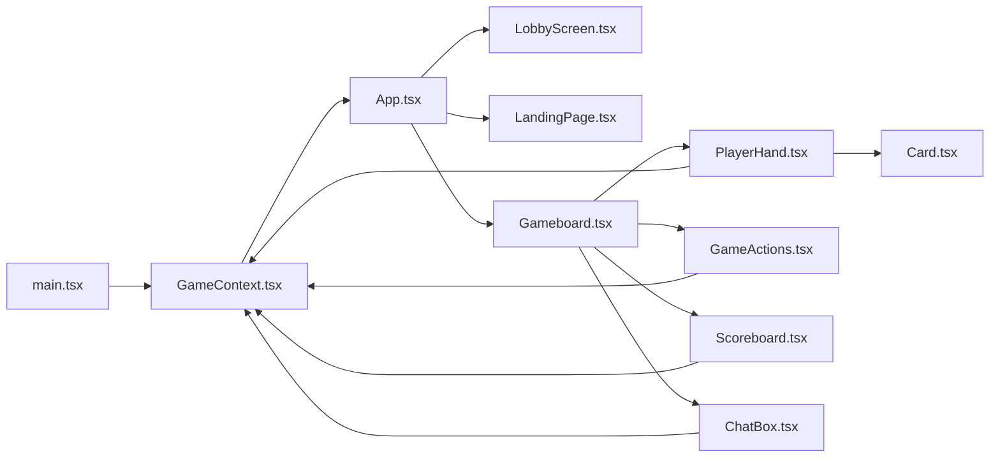

# Component Tree

<cite>
**Referenced Files in This Document**
- [App.tsx](file://src/App.tsx)
- [main.tsx](file://src/main.tsx)
- [LandingPage.tsx](file://src/components/LandingPage.tsx)
- [LobbyScreen.tsx](file://src/components/LobbyScreen.tsx)
- [Gameboard.tsx](file://src/components/Gameboard.tsx)
- [PlayerHand.tsx](file://src/components/PlayerHand.tsx)
- [Scoreboard.tsx](file://src/components/Scoreboard.tsx)
- [ChatBox.tsx](file://src/components/ChatBox.tsx)
- [GameActions.tsx](file://src/components/GameActions.tsx)
- [Card.tsx](file://src/components/Card.tsx)
- [GameContext.tsx](file://src/context/GameContext.tsx)
- [types/index.ts](file://src/types/index.ts)
- [tailwind.config.js](file://tailwind.config.js)
</cite>

## Table of Contents
1. [Introduction](#introduction)
2. [Project Structure](#project-structure)
3. [Core Components](#core-components)
4. [Architecture Overview](#architecture-overview)
5. [Detailed Component Analysis](#detailed-component-analysis)
6. [Dependency Analysis](#dependency-analysis)
7. [Performance Considerations](#performance-considerations)
8. [Troubleshooting Guide](#troubleshooting-guide)
9. [Conclusion](#conclusion)
10. [Appendices](#appendices)

## Introduction
This document explains the frontend component tree of sen-web, starting from the root App.tsx that orchestrates three major UI states: landing, lobby, and gameboard. It details how Gameboard composes PlayerHand, Scoreboard, ChatBox, and GameActions into a cohesive central game interface. The layout strategy uses responsive flexbox and grid systems with Tailwind breakpoints, and accessibility is addressed through ARIA labels and keyboard-friendly interactions. Practical examples demonstrate component composition patterns, context-based prop drilling, and conditional rendering based on game state. Guidance is also provided for extending the component tree while preserving architectural consistency.

## Project Structure
The application initializes providers and renders App, which conditionally renders LandingPage, LobbyScreen, or Gameboard based on game state. Gameboard is the central hub that composes PlayerHand for card displays, Scoreboard for scoring, ChatBox for messaging, and GameActions for turn-based interactions.

**Diagram sources**
- [main.tsx](file://src/main.tsx#L1-L21)
- [App.tsx](file://src/App.tsx#L1-L80)
- [LandingPage.tsx](file://src/components/LandingPage.tsx#L1-L136)
- [LobbyScreen.tsx](file://src/components/LobbyScreen.tsx#L1-L413)
- [Gameboard.tsx](file://src/components/Gameboard.tsx#L1-L355)
- [PlayerHand.tsx](file://src/components/PlayerHand.tsx#L1-L276)
- [Scoreboard.tsx](file://src/components/Scoreboard.tsx#L1-L56)
- [ChatBox.tsx](file://src/components/ChatBox.tsx#L1-L68)
- [GameActions.tsx](file://src/components/GameActions.tsx#L1-L109)
- [Card.tsx](file://src/components/Card.tsx#L1-L187)
- [GameContext.tsx](file://src/context/GameContext.tsx#L1-L1152)
- [types/index.ts](file://src/types/index.ts#L1-L100)

**Section sources**
- [main.tsx](file://src/main.tsx#L1-L21)
- [App.tsx](file://src/App.tsx#L1-L80)

## Core Components
- App.tsx: Orchestrates UI states using React Suspense and AnimatePresence for smooth transitions between landing, lobby, and gameboard. It manages theme persistence and toggling, and renders global UI elements like language switcher and theme toggle.
- Gameboard.tsx: Central game interface that arranges opponents’ hands, center piles (draw/discard), current player’s hand, and side panel (scoreboard, chat, action log). It handles recent move animations and responsive layouts.
- PlayerHand.tsx: Renders a player’s hand with interactive card slots, animations for recent moves, and contextual interactions based on game phase.
- Scoreboard.tsx: Displays player scores in a responsive table.
- ChatBox.tsx: Real-time chat with auto-scroll and message formatting.
- GameActions.tsx: Turn-based action buttons (discard, special action, finish peeking, pobudka) tailored to the current game phase.
- Card.tsx: Animated card component with 3D flip, special card glow effects, and hover overlays.
- GameContext.tsx: Global game state provider with reducer, Convex integration, and sound playback.
- types/index.ts: Defines GameState, Player, Card, GameAction, and GamePhase types.

**Section sources**
- [App.tsx](file://src/App.tsx#L1-L80)
- [Gameboard.tsx](file://src/components/Gameboard.tsx#L1-L355)
- [PlayerHand.tsx](file://src/components/PlayerHand.tsx#L1-L276)
- [Scoreboard.tsx](file://src/components/Scoreboard.tsx#L1-L56)
- [ChatBox.tsx](file://src/components/ChatBox.tsx#L1-L68)
- [GameActions.tsx](file://src/components/GameActions.tsx#L1-L109)
- [Card.tsx](file://src/components/Card.tsx#L1-L187)
- [GameContext.tsx](file://src/context/GameContext.tsx#L1-L1152)
- [types/index.ts](file://src/types/index.ts#L1-L100)

## Architecture Overview
The component tree is rooted at App.tsx, which conditionally renders one of three screens. Gameboard composes subcomponents that share state via GameContext. PlayerHand and GameActions are tightly coupled to game phase and current player logic. Card encapsulates presentation and animation. Tailwind utilities and responsive breakpoints define layout behavior.

**Diagram sources**
- [main.tsx](file://src/main.tsx#L1-L21)
- [GameContext.tsx](file://src/context/GameContext.tsx#L1-L1152)
- [App.tsx](file://src/App.tsx#L1-L80)
- [LandingPage.tsx](file://src/components/LandingPage.tsx#L1-L136)
- [LobbyScreen.tsx](file://src/components/LobbyScreen.tsx#L1-L413)
- [Gameboard.tsx](file://src/components/Gameboard.tsx#L1-L355)
- [PlayerHand.tsx](file://src/components/PlayerHand.tsx#L1-L276)
- [Scoreboard.tsx](file://src/components/Scoreboard.tsx#L1-L56)
- [ChatBox.tsx](file://src/components/ChatBox.tsx#L1-L68)
- [GameActions.tsx](file://src/components/GameActions.tsx#L1-L109)
- [Card.tsx](file://src/components/Card.tsx#L1-L187)

## Detailed Component Analysis

### App.tsx: Root Orchestrator
- Conditional rendering:
  - Landing page shown until the user enters the lobby.
  - Lobby screen shown when the game phase is lobby.
  - Gameboard shown otherwise.
- Suspense fallback ensures smooth loading.
- AnimatePresence with mode="wait" coordinates transitions between screens.
- Theme management persists to localStorage and adapts document root classes.
- Fixed UI elements (language switcher, theme toggle) appear above the main content.

**Diagram sources**
- [App.tsx](file://src/App.tsx#L1-L80)
- [LandingPage.tsx](file://src/components/LandingPage.tsx#L1-L136)
- [LobbyScreen.tsx](file://src/components/LobbyScreen.tsx#L1-L413)
- [Gameboard.tsx](file://src/components/Gameboard.tsx#L1-L355)

**Section sources**
- [App.tsx](file://src/App.tsx#L1-L80)

### Gameboard.tsx: Central Game Interface
- Layout strategy:
  - Flex column on small screens, flex row on large screens for main content.
  - Opponents area at the top with horizontal scrolling and responsive spacing.
  - Center area with draw and discard piles, animated drawn card display when applicable.
  - Bottom player area with PlayerHand and GameActions.
  - Side panel for desktop and a collapsible sheet for mobile.
- Responsive design:
  - Uses Tailwind utilities with responsive variants (sm, md, lg) for padding, gaps, and card sizes.
  - Mobile-first approach with hidden-on-desktop side panel and sheet trigger.
- Accessibility:
  - ARIA labels and roles are present on interactive elements (buttons, inputs).
  - Keyboard navigation supported by native button and form semantics.
- State-driven composition:
  - Players are arranged with the bottom always representing the current player (online vs hotseat).
  - Conditional rendering for empty opponents area and recent move notifications.
  - Action modal and tutorial integration.

**Diagram sources**
- [Gameboard.tsx](file://src/components/Gameboard.tsx#L1-L355)

**Section sources**
- [Gameboard.tsx](file://src/components/Gameboard.tsx#L1-L355)
- [tailwind.config.js](file://tailwind.config.js#L1-L101)

### PlayerHand.tsx: Hand Rendering and Interactions
- Props:
  - player: Player object with hand, name, score.
  - isCurrentPlayer: Whether this is the current turn holder.
  - isOpponent: Whether this is an opponent’s hand.
  - playSound: Sound effect callback.
- Behavior:
  - Recent move animations for draw, swap, and targeted actions.
  - Conditional interactions based on game phase:
    - Peeking phase: allow selecting two face-down cards.
    - Holding card phase: allow swapping held card with a hand card.
    - Special action phases: allow peek-1 or swap-2 targeting.
  - Visual indicators for “you” tag, glowing borders, and targeted cards.
  - Card back asset and card front rendering via Card component.

**Diagram sources**
- [PlayerHand.tsx](file://src/components/PlayerHand.tsx#L1-L276)
- [Card.tsx](file://src/components/Card.tsx#L1-L187)
- [GameContext.tsx](file://src/context/GameContext.tsx#L1-L1152)

**Section sources**
- [PlayerHand.tsx](file://src/components/PlayerHand.tsx#L1-L276)
- [Card.tsx](file://src/components/Card.tsx#L1-L187)

### Scoreboard.tsx and ChatBox.tsx
- Scoreboard.tsx:
  - Renders a responsive table of players and scores.
  - Uses UI table components and Tailwind utilities for styling.
- ChatBox.tsx:
  - Displays chat messages with sender identification and auto-scroll.
  - Provides a form to submit new messages.
  - Uses ScrollArea for overflow handling.

**Diagram sources**
- [Scoreboard.tsx](file://src/components/Scoreboard.tsx#L1-L56)
- [ChatBox.tsx](file://src/components/ChatBox.tsx#L1-L68)
- [Gameboard.tsx](file://src/components/Gameboard.tsx#L1-L355)

**Section sources**
- [Scoreboard.tsx](file://src/components/Scoreboard.tsx#L1-L56)
- [ChatBox.tsx](file://src/components/ChatBox.tsx#L1-L68)

### GameActions.tsx: Turn-Based Controls
- Behavior:
  - Finish peeking button appears during peeking when two cards are selected.
  - Pobudka button appears for current player in playing phase.
  - Discard and Special Action buttons appear when holding a drawn card.
  - Disabled states reflect game rules (e.g., must swap when drawing from discard).
- Accessibility:
  - Buttons use appropriate sizes and labels for keyboard navigation.

**Diagram sources**
- [GameActions.tsx](file://src/components/GameActions.tsx#L1-L109)

**Section sources**
- [GameActions.tsx](file://src/components/GameActions.tsx#L1-L109)

### Card.tsx: Animated Card Presentation
- Features:
  - 3D flip animation using Framer Motion.
  - Special card glow on reveal and continuous hover overlay.
  - Responsive sizing with Tailwind utilities.
  - Optional external glow and persistent peek indicator.
- Interaction:
  - onClick triggers sound and propagates to parent handlers.

**Section sources**
- [Card.tsx](file://src/components/Card.tsx#L1-L187)

### GameContext.tsx and Types
- GameContext.tsx:
  - Provides GameState via useReducer and exposes actions (createRoom, joinRoom, startGame, broadcastAction, sendChatMessage).
  - Integrates with Convex for remote state synchronization and presence.
  - Manages sound playback and merges local peeked cards with remote state during peeking.
- Types:
  - Defines Card, Player, GameState, GameAction, and GamePhase with precise shapes.

**Section sources**
- [GameContext.tsx](file://src/context/GameContext.tsx#L1-L1152)
- [types/index.ts](file://src/types/index.ts#L1-L100)

## Dependency Analysis
- Provider stack:
  - main.tsx wraps the app with ConvexClientProvider, GameProvider, and TutorialProvider.
  - App.tsx consumes GameContext to determine which screen to render.
- Component dependencies:
  - Gameboard depends on PlayerHand, Scoreboard, ChatBox, GameActions, and Card.
  - PlayerHand and GameActions depend on GameContext for state and actions.
  - Card is a leaf component used by PlayerHand and piles.
- State flow:
  - GameContext reducer updates state in response to GameAction events.
  - Remote state from Convex is synchronized and merged with local peeked cards.

**Diagram sources**
- [main.tsx](file://src/main.tsx#L1-L21)
- [GameContext.tsx](file://src/context/GameContext.tsx#L1-L1152)
- [App.tsx](file://src/App.tsx#L1-L80)
- [Gameboard.tsx](file://src/components/Gameboard.tsx#L1-L355)
- [PlayerHand.tsx](file://src/components/PlayerHand.tsx#L1-L276)
- [GameActions.tsx](file://src/components/GameActions.tsx#L1-L109)
- [Scoreboard.tsx](file://src/components/Scoreboard.tsx#L1-L56)
- [ChatBox.tsx](file://src/components/ChatBox.tsx#L1-L68)
- [Card.tsx](file://src/components/Card.tsx#L1-L187)

**Section sources**
- [main.tsx](file://src/main.tsx#L1-L21)
- [GameContext.tsx](file://src/context/GameContext.tsx#L1-L1152)

## Performance Considerations
- Re-render performance:
  - Use memoization for derived values (e.g., recent move labels) to minimize unnecessary renders.
  - Keep child components pure and pass only required props to reduce re-renders.
- Z-index stacking context:
  - Gameboard uses layered z-index values for overlays (recent move, side panel, tutorial). Ensure new overlays maintain consistent stacking to avoid visual regressions.
- Responsive overflow handling:
  - PlayerHand uses horizontal scrolling with overflow-x-auto and padding to prevent clipping on small screens. Maintain consistent spacing and card sizing across breakpoints.
- Animation costs:
  - Limit concurrent animations (e.g., special card glow) and prefer lightweight transitions for frequent interactions.
- Lazy loading:
  - Keep Suspense fallback minimal and fast to avoid perceived lag during screen transitions.

[No sources needed since this section provides general guidance]

## Troubleshooting Guide
- Transitions not smooth:
  - Verify AnimatePresence is configured with mode="wait" and keys are unique per screen.
- Chat not updating:
  - Ensure remote chat messages are fetched and dispatched to the reducer; confirm subscription is active in online mode.
- Cards not flipping:
  - Confirm isFaceUp prop is toggled and Card component receives onClick handler.
- Mobile side panel not opening:
  - Check Sheet and SheetTrigger usage; ensure ScrollArea inside SheetContent scrolls independently.
- Accessibility issues:
  - Add aria-labels to interactive elements and ensure keyboard focus order is logical.
- Reconnection resets:
  - GameContext resets state when a player leaves unexpectedly; confirm presence intervals and session storage usage.

**Section sources**
- [App.tsx](file://src/App.tsx#L1-L80)
- [Gameboard.tsx](file://src/components/Gameboard.tsx#L1-L355)
- [ChatBox.tsx](file://src/components/ChatBox.tsx#L1-L68)
- [GameContext.tsx](file://src/context/GameContext.tsx#L1-L1152)

## Conclusion
The sen-web component tree centers on App.tsx orchestrating three distinct screens, with Gameboard as the primary hub for gameplay. Composition relies on shared state via GameContext, enabling clean separation of concerns and predictable UI updates. Responsive design and accessibility are integrated through Tailwind utilities and semantic markup. Extending the tree involves adding new subcomponents under Gameboard or introducing new screens in App.tsx, while preserving context-based prop drilling and state-driven rendering.

[No sources needed since this section summarizes without analyzing specific files]

## Appendices

### Layout Strategy and Breakpoints
- Mobile-first design with responsive variants (sm, md, lg) for paddings, gaps, and card widths.
- Flexbox for main content and grid-like arrangements for player areas.
- Tailwind utilities manage overflow, shadows, and backgrounds for readability.

**Section sources**
- [Gameboard.tsx](file://src/components/Gameboard.tsx#L1-L355)
- [tailwind.config.js](file://tailwind.config.js#L1-L101)

### Accessibility Checklist
- Ensure all interactive elements have accessible names and roles.
- Provide keyboard navigation support for forms and buttons.
- Maintain sufficient color contrast for text and overlays.
- Use ARIA attributes where custom controls are introduced.

[No sources needed since this section provides general guidance]