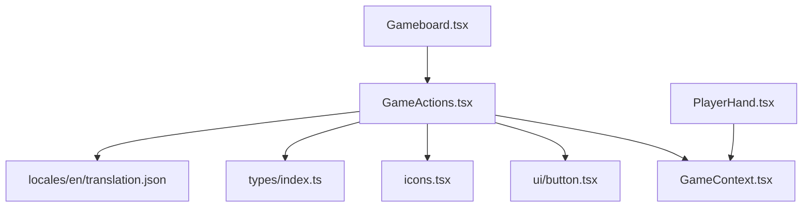
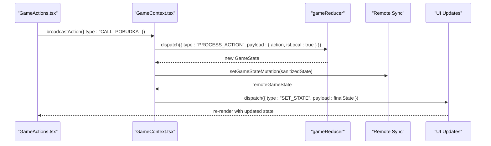
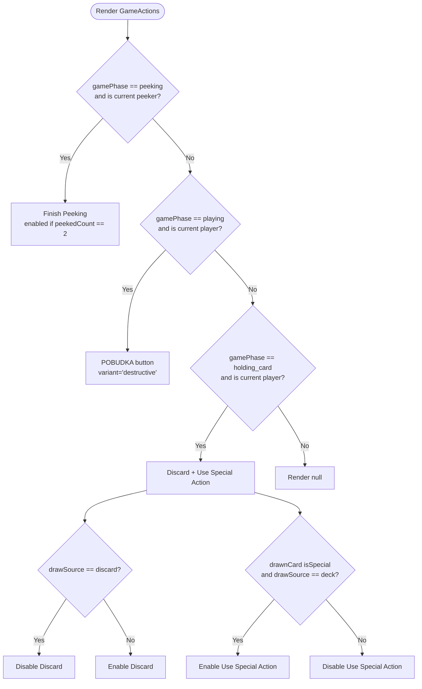
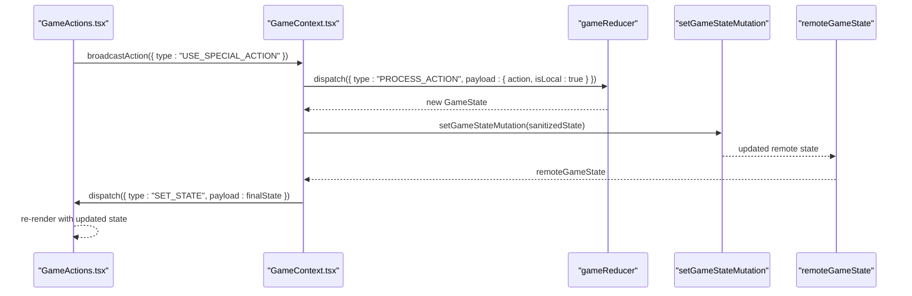
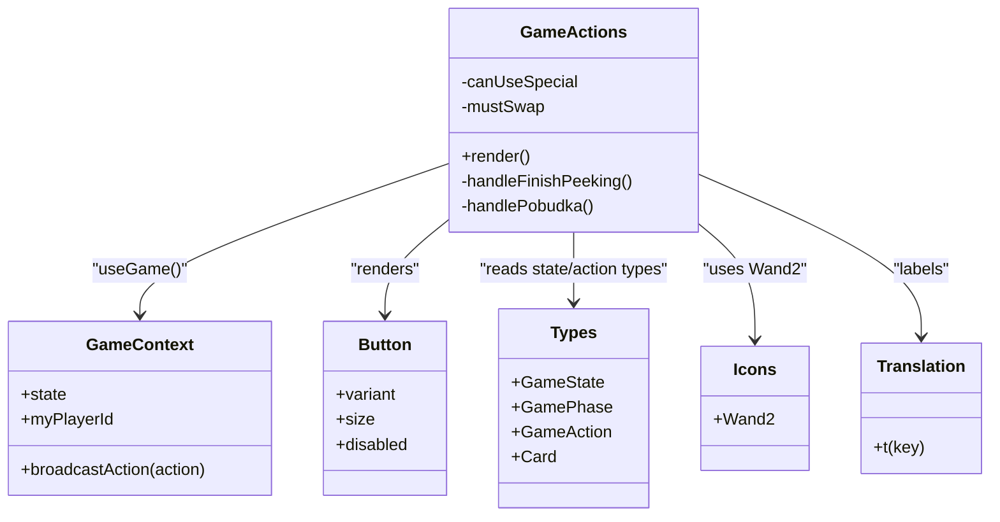
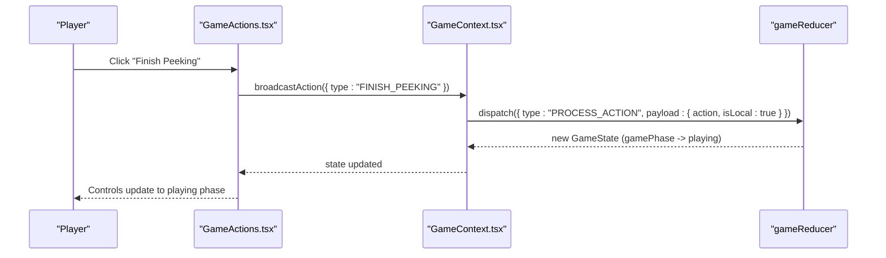
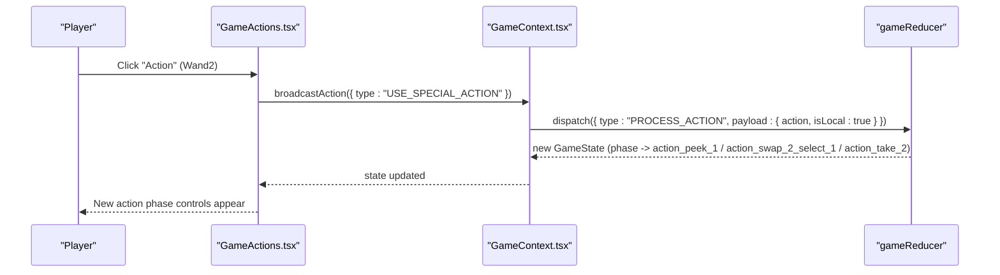

# Game Actions

<cite>
**Referenced Files in This Document**
- [GameActions.tsx](file://src/components/GameActions.tsx)
- [GameContext.tsx](file://src/context/GameContext.tsx)
- [button.tsx](file://src/components/ui/button.tsx)
- [icons.tsx](file://src/components/icons.tsx)
- [index.ts](file://src/types/index.ts)
- [translation.json](file://public/locales/en/translation.json)
- [Gameboard.tsx](file://src/components/Gameboard.tsx)
- [PlayerHand.tsx](file://src/components/PlayerHand.tsx)
</cite>

## Table of Contents
1. [Introduction](#introduction)
2. [Project Structure](#project-structure)
3. [Core Components](#core-components)
4. [Architecture Overview](#architecture-overview)
5. [Detailed Component Analysis](#detailed-component-analysis)
6. [Dependency Analysis](#dependency-analysis)
7. [Performance Considerations](#performance-considerations)
8. [Troubleshooting Guide](#troubleshooting-guide)
9. [Conclusion](#conclusion)
10. [Appendices](#appendices)

## Introduction
This document explains the GameActions component, which provides interactive controls for a player’s turn. It covers conditional rendering based on game phase (peeking, playing, holding_card) and player context (current player status). It documents the three primary states:
- Finish peeking button during the peeking phase
- Pobudka action button during the playing phase
- Discard/use special action buttons when holding a card

It also describes the business logic for determining action availability, including validation rules such as requiring two cards to be peeked before finishing, or requiring a special card drawn from the deck to use special actions. The visual design is described with appropriately sized buttons and iconography (Wand2 for special actions), accessibility considerations for button states and focus management, and responsive design for different screen sizes.

## Project Structure
GameActions is a small, focused component that reads the global game state and renders the appropriate action controls for the current player. It integrates with GameContext to dispatch actions and uses shared UI primitives for consistent styling.

**Diagram sources**
- [GameActions.tsx](file://src/components/GameActions.tsx#L1-L109)
- [GameContext.tsx](file://src/context/GameContext.tsx#L562-L600)
- [button.tsx](file://src/components/ui/button.tsx#L1-L58)
- [icons.tsx](file://src/components/icons.tsx#L1-L17)
- [index.ts](file://src/types/index.ts#L1-L100)
- [translation.json](file://public/locales/en/translation.json#L52-L78)
- [Gameboard.tsx](file://src/components/Gameboard.tsx#L1-L49)
- [PlayerHand.tsx](file://src/components/PlayerHand.tsx#L119-L167)

**Section sources**
- [GameActions.tsx](file://src/components/GameActions.tsx#L1-L109)
- [GameContext.tsx](file://src/context/GameContext.tsx#L562-L600)
- [button.tsx](file://src/components/ui/button.tsx#L1-L58)
- [icons.tsx](file://src/components/icons.tsx#L1-L17)
- [index.ts](file://src/types/index.ts#L1-L100)
- [translation.json](file://public/locales/en/translation.json#L52-L78)
- [Gameboard.tsx](file://src/components/Gameboard.tsx#L1-L49)
- [PlayerHand.tsx](file://src/components/PlayerHand.tsx#L119-L167)

## Core Components
- GameActions: Renders the correct action controls based on gamePhase and player context. It uses broadcastAction to submit actions and translates button labels via i18n.
- GameContext: Provides the global game state, action dispatching, and synchronization for online multiplayer. It also sanitizes peeked cards visibility for opponents.
- UI Button: Shared button component with variants, sizes, and focus-visible styles.
- Types: Defines GameState, GamePhase, GameAction, and Card shapes used across the app.
- Icons: Provides iconography used by the UI (Wand2 is used for special actions).
- Translation: Provides localized labels for action buttons and messages.

Key responsibilities:
- Conditional rendering of action buttons based on gamePhase and current player status
- Validation rules for enabling/disabling actions
- Integration with GameContext to dispatch actions
- Responsive sizing and consistent visual design
- Accessibility via focus-visible styles and disabled states

**Section sources**
- [GameActions.tsx](file://src/components/GameActions.tsx#L1-L109)
- [GameContext.tsx](file://src/context/GameContext.tsx#L47-L85)
- [button.tsx](file://src/components/ui/button.tsx#L1-L58)
- [index.ts](file://src/types/index.ts#L1-L100)
- [translation.json](file://public/locales/en/translation.json#L52-L78)

## Architecture Overview
GameActions reads from GameContext and conditionally renders action buttons. It does not mutate state directly; instead, it calls broadcastAction to enqueue actions. GameContext’s reducer processes actions and transitions the game state accordingly.

**Diagram sources**
- [GameActions.tsx](file://src/components/GameActions.tsx#L1-L109)
- [GameContext.tsx](file://src/context/GameContext.tsx#L836-L846)
- [GameContext.tsx](file://src/context/GameContext.tsx#L884-L922)
- [GameContext.tsx](file://src/context/GameContext.tsx#L616-L682)

## Detailed Component Analysis

### Conditional Rendering and States
GameActions renders different sets of controls depending on the game phase and whether the current player is the active peeker or current player.

- Peek Phase:
  - Only the current peeker sees the Finish Peeking button.
  - The button is enabled only when two cards have been peeked.
- Playing Phase:
  - Only the current player sees the Pobudka button.
  - The button is enabled only on the current player’s turn.
- Holding Card Phase:
  - Only the current player sees the controls.
  - Two buttons: Discard and Use Special Action.
  - Discard is disabled when the drawn card came from the discard pile (mustSwap).
  - Use Special Action is enabled only when the drawn card is a special card and was drawn from the deck.

**Diagram sources**
- [GameActions.tsx](file://src/components/GameActions.tsx#L46-L105)

**Section sources**
- [GameActions.tsx](file://src/components/GameActions.tsx#L1-L109)

### Business Logic and Validation Rules
- Finish Peeking:
  - Only allowed during peeking phase.
  - Only allowed for the current peeker.
  - Enabled when exactly two cards have been peeked.
- Pobudka:
  - Only allowed during playing phase.
  - Only allowed on the current player’s turn.
- Holding Card:
  - Discard:
    - Always available unless mustSwap is true.
    - mustSwap is true when a card was drawn from the discard pile.
  - Use Special Action:
    - Only allowed when the drawn card is a special card.
    - Only allowed when the drawn card came from the deck.
    - The reducer validates these conditions before applying the action.

These rules are enforced both in the UI (disabled/enabled states) and in the reducer (validation before state transitions).

**Section sources**
- [GameActions.tsx](file://src/components/GameActions.tsx#L27-L45)
- [GameContext.tsx](file://src/context/GameContext.tsx#L255-L300)
- [GameContext.tsx](file://src/context/GameContext.tsx#L301-L351)
- [GameContext.tsx](file://src/context/GameContext.tsx#L352-L407)

### Visual Design and Responsiveness
- Buttons:
  - Uses the shared Button component with variants and sizes.
  - Sizes increase on small screens (sm) for better touch targets.
  - Disabled state uses opacity and pointer-events-none via shared button styles.
- Iconography:
  - Wand2 icon is shown alongside the “Action” label for special actions.
- Responsive sizing:
  - Tailwind utilities define min-w and min-h for different breakpoints (sm).
  - Font sizes scale from base to lg/sm on larger screens.
- Accessibility:
  - Focus-visible ring classes are provided by the shared Button component.
  - Disabled buttons are not interactive and clearly indicated by reduced opacity.

**Section sources**
- [button.tsx](file://src/components/ui/button.tsx#L1-L58)
- [GameActions.tsx](file://src/components/GameActions.tsx#L56-L105)
- [icons.tsx](file://src/components/icons.tsx#L1-L17)

### Integration with GameContext and broadcastAction
- GameActions obtains state and broadcastAction from GameContext.
- It calls broadcastAction with specific action types (e.g., FINISH_PEEKING, CALL_POBUDKA, DISCARD_HELD_CARD, USE_SPECIAL_ACTION).
- GameContext’s reducer processes these actions and advances the game state accordingly.
- Online multiplayer:
  - broadcastAction dispatches locally and then syncs to the remote state via a mutation.
  - Remote state is sanitized to hide peeked cards from opponents.
  - The component re-renders when the remote state updates.

**Diagram sources**
- [GameActions.tsx](file://src/components/GameActions.tsx#L1-L109)
- [GameContext.tsx](file://src/context/GameContext.tsx#L836-L846)
- [GameContext.tsx](file://src/context/GameContext.tsx#L884-L922)
- [GameContext.tsx](file://src/context/GameContext.tsx#L616-L682)

**Section sources**
- [GameActions.tsx](file://src/components/GameActions.tsx#L1-L109)
- [GameContext.tsx](file://src/context/GameContext.tsx#L836-L846)
- [GameContext.tsx](file://src/context/GameContext.tsx#L884-L922)
- [GameContext.tsx](file://src/context/GameContext.tsx#L616-L682)

### Accessibility Considerations
- Focus management:
  - The shared Button component applies focus-visible ring styles, ensuring keyboard navigation is visible.
- Disabled states:
  - Disabled buttons are non-interactive and visually distinct via shared disabled styles.
- Role and semantics:
  - Buttons use native button semantics; icons inside buttons are treated as presentational via shared button styles.
- Screen reader labels:
  - Button text is localized and provided via i18n keys.

**Section sources**
- [button.tsx](file://src/components/ui/button.tsx#L1-L58)
- [translation.json](file://public/locales/en/translation.json#L52-L78)

### Responsive Design
- Breakpoint-aware sizing:
  - min-w and min-h classes adjust for small screens (sm).
  - Text sizes scale from base to lg/sm for improved readability.
- Touch-friendly targets:
  - Larger min-h/min-w values improve tap targets on mobile devices.
- Layout:
  - Special action button includes an inline icon to reduce reliance on color alone.

**Section sources**
- [GameActions.tsx](file://src/components/GameActions.tsx#L56-L105)

## Dependency Analysis
GameActions depends on:
- GameContext for state and action dispatch
- UI Button for consistent styling and accessibility
- Types for shape validation
- Icons for visual cues
- Translation for labels

**Diagram sources**
- [GameActions.tsx](file://src/components/GameActions.tsx#L1-L109)
- [GameContext.tsx](file://src/context/GameContext.tsx#L562-L600)
- [button.tsx](file://src/components/ui/button.tsx#L1-L58)
- [index.ts](file://src/types/index.ts#L1-L100)
- [icons.tsx](file://src/components/icons.tsx#L1-L17)
- [translation.json](file://public/locales/en/translation.json#L52-L78)

**Section sources**
- [GameActions.tsx](file://src/components/GameActions.tsx#L1-L109)
- [GameContext.tsx](file://src/context/GameContext.tsx#L562-L600)
- [button.tsx](file://src/components/ui/button.tsx#L1-L58)
- [index.ts](file://src/types/index.ts#L1-L100)
- [icons.tsx](file://src/components/icons.tsx#L1-L17)
- [translation.json](file://public/locales/en/translation.json#L52-L78)

## Performance Considerations
- Rendering cost:
  - GameActions is lightweight and only re-renders when state changes.
- Event handlers:
  - Handlers are simple and avoid heavy computations.
- Disabled states:
  - Disabling buttons avoids unnecessary event handling and reduces re-renders.
- Online sync:
  - Debouncing and comparison checks prevent redundant network writes.

[No sources needed since this section provides general guidance]

## Troubleshooting Guide
Common issues and resolutions:
- Button appears enabled but action does nothing:
  - Verify gamePhase and current player context. Ensure the reducer allows the action given the current state.
  - Check mustSwap and canUseSpecial conditions.
- Duplicate actions submitted:
  - Ensure the UI disables buttons when actions are invalid. The reducer also guards against invalid actions.
- Disabled state not updating:
  - Confirm that state updates propagate to the component. In online mode, wait for remote state to settle.
- Special action not available:
  - Ensure the drawn card is a special card and was drawn from the deck.
- Pobudka not visible:
  - Ensure the current player is the active player and the game is in the playing phase.

**Section sources**
- [GameActions.tsx](file://src/components/GameActions.tsx#L27-L45)
- [GameContext.tsx](file://src/context/GameContext.tsx#L352-L407)
- [GameContext.tsx](file://src/context/GameContext.tsx#L255-L300)

## Conclusion
GameActions encapsulates turn-based interactions with clear conditional rendering and robust validation. It integrates tightly with GameContext to ensure actions are dispatched safely and consistently, with responsive design and accessibility baked in. The component’s simplicity and strong separation of concerns make it easy to maintain and extend.

[No sources needed since this section summarizes without analyzing specific files]

## Appendices

### Example Workflows

#### Finish Peeking Workflow

**Diagram sources**
- [GameActions.tsx](file://src/components/GameActions.tsx#L27-L31)
- [GameContext.tsx](file://src/context/GameContext.tsx#L208-L254)

#### Use Special Action Workflow

**Diagram sources**
- [GameActions.tsx](file://src/components/GameActions.tsx#L94-L103)
- [GameContext.tsx](file://src/context/GameContext.tsx#L352-L407)

### Accessibility Checklist
- Ensure focus rings are visible for keyboard navigation.
- Provide meaningful aria-labels if needed (buttons already have text).
- Avoid relying solely on color to indicate enabled/disabled states.
- Test with screen readers to confirm labels are announced.

**Section sources**
- [button.tsx](file://src/components/ui/button.tsx#L1-L58)
- [translation.json](file://public/locales/en/translation.json#L52-L78)