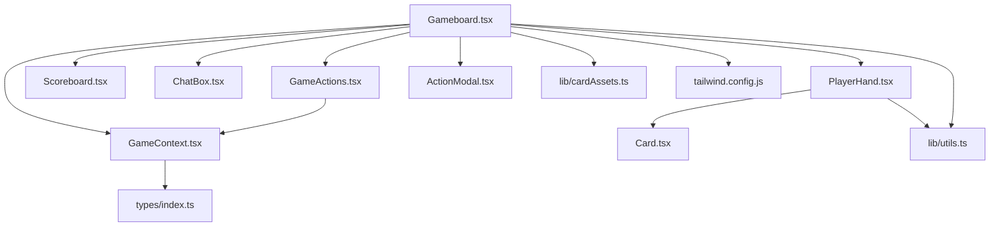
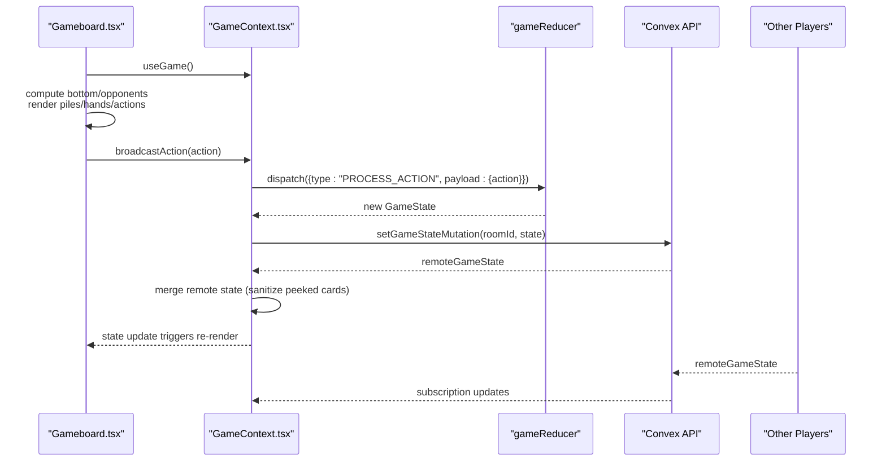
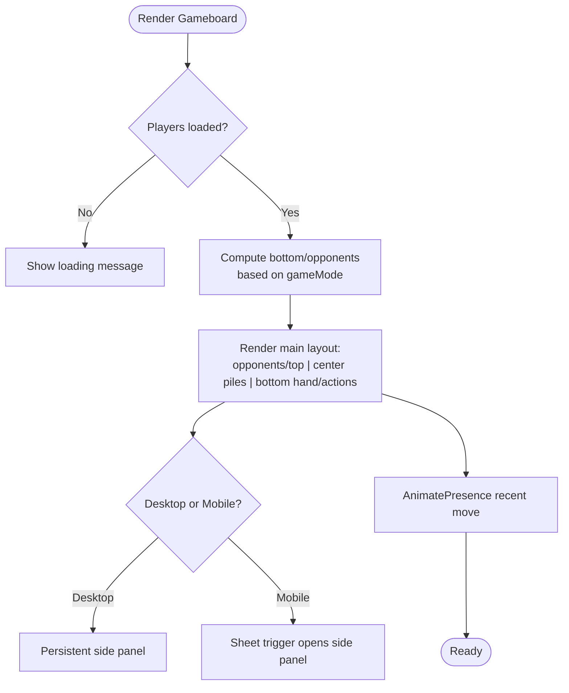
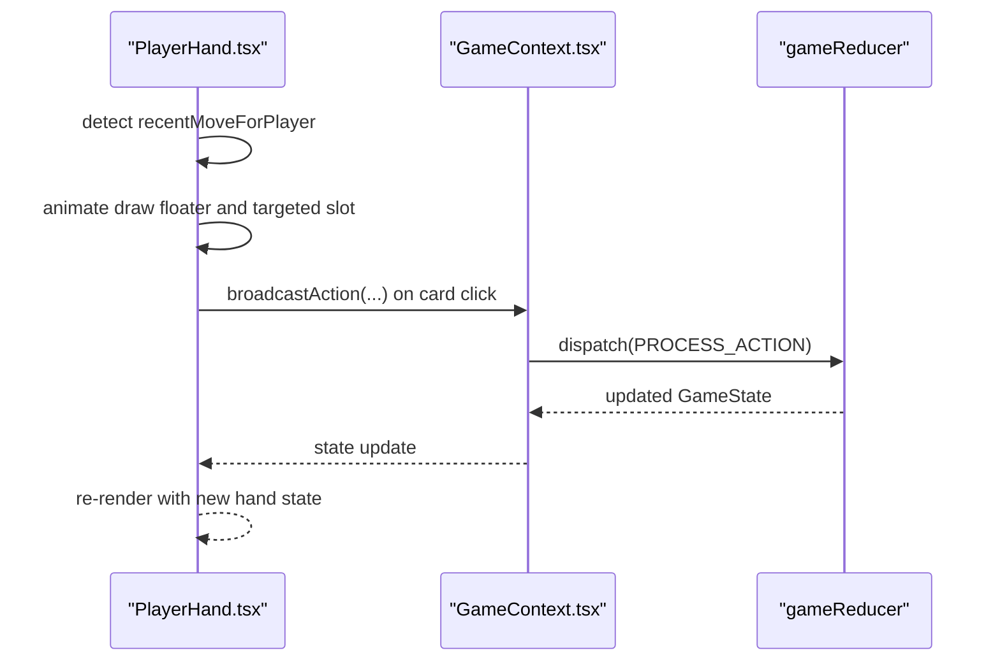
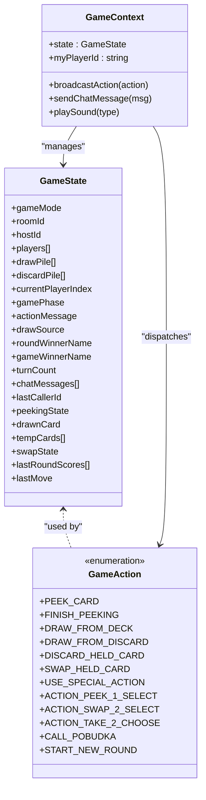
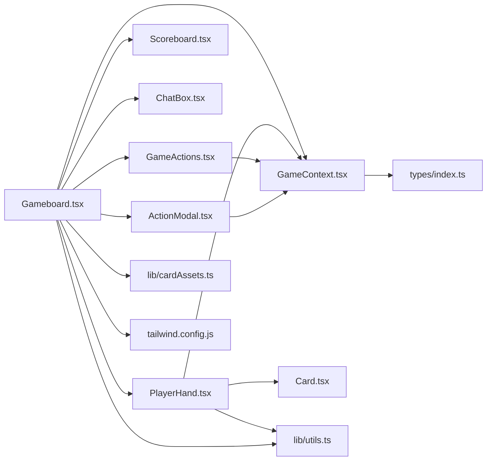

# Gameboard

<cite>
**Referenced Files in This Document**
- [Gameboard.tsx](file://src/components/Gameboard.tsx)
- [GameContext.tsx](file://src/context/GameContext.tsx)
- [PlayerHand.tsx](file://src/components/PlayerHand.tsx)
- [Scoreboard.tsx](file://src/components/Scoreboard.tsx)
- [ChatBox.tsx](file://src/components/ChatBox.tsx)
- [GameActions.tsx](file://src/components/GameActions.tsx)
- [ActionModal.tsx](file://src/components/ActionModal.tsx)
- [Card.tsx](file://src/components/Card.tsx)
- [index.ts](file://src/types/index.ts)
- [cardAssets.ts](file://src/lib/cardAssets.ts)
- [utils.ts](file://src/lib/utils.ts)
- [tailwind.config.js](file://tailwind.config.js)
</cite>

## Table of Contents
1. [Introduction](#introduction)
2. [Project Structure](#project-structure)
3. [Core Components](#core-components)
4. [Architecture Overview](#architecture-overview)
5. [Detailed Component Analysis](#detailed-component-analysis)
6. [Dependency Analysis](#dependency-analysis)
7. [Performance Considerations](#performance-considerations)
8. [Troubleshooting Guide](#troubleshooting-guide)
9. [Conclusion](#conclusion)

## Introduction
Gameboard is the central container for the Sen game interface. It orchestrates the main gameplay layout with responsive design principles using Tailwind CSS grid and flexbox systems. It manages player positioning so that the bottom player is always the current player (online mode shows the local player; hotseat mode shows the current human player), with other players arranged around the top area. It integrates key subcomponents:
- PlayerHand for displaying and interacting with hands
- Scoreboard for live scoring
- ChatBox for communication (online mode)
- GameActions for turn controls and special actions

It also uses Framer Motion for smooth transitions between game states and AnimatePresence for dynamic UI elements like recent move notifications. Gameboard responds to game state changes from GameContext, handles player actions through broadcastAction, and implements accessibility features like ARIA-friendly labels and keyboard navigation. It addresses common issues such as mobile responsiveness, z-index conflicts with overlays, and performance optimization for animations during high-frequency state updates.

## Project Structure
Gameboard lives under src/components and coordinates several sibling components and the GameContext provider. The layout is built with Tailwind’s flexbox and responsive utilities, and animations leverage Framer Motion.

**Diagram sources**
- [Gameboard.tsx](file://src/components/Gameboard.tsx#L1-L355)
- [GameContext.tsx](file://src/context/GameContext.tsx#L1-L200)
- [PlayerHand.tsx](file://src/components/PlayerHand.tsx#L1-L281)
- [Scoreboard.tsx](file://src/components/Scoreboard.tsx#L1-L56)
- [ChatBox.tsx](file://src/components/ChatBox.tsx#L1-L68)
- [GameActions.tsx](file://src/components/GameActions.tsx#L1-L109)
- [ActionModal.tsx](file://src/components/ActionModal.tsx#L1-L153)
- [Card.tsx](file://src/components/Card.tsx#L1-L187)
- [index.ts](file://src/types/index.ts#L1-L100)
- [cardAssets.ts](file://src/lib/cardAssets.ts#L1-L58)
- [utils.ts](file://src/lib/utils.ts#L1-L7)
- [tailwind.config.js](file://tailwind.config.js#L1-L101)

**Section sources**
- [Gameboard.tsx](file://src/components/Gameboard.tsx#L1-L355)
- [tailwind.config.js](file://tailwind.config.js#L1-L101)

## Core Components
- Gameboard: Central layout and orchestration, responsive grid/flex, player positioning, recent move notifications, side panel, and mobile sheet.
- PlayerHand: Displays a player’s hand, handles interactions (peeking, swapping, targeting), and shows recent move indicators.
- Scoreboard: Live ranking table for players’ scores.
- ChatBox: Real-time chat for online games.
- GameActions: Turn controls (draw, discard, special action, Pobudka).
- ActionModal: Modal dialogs for Take 2 selection, round end summary, and game over screen.
- GameContext: Global game state, reducer, and broadcastAction pipeline.

**Section sources**
- [Gameboard.tsx](file://src/components/Gameboard.tsx#L1-L355)
- [PlayerHand.tsx](file://src/components/PlayerHand.tsx#L1-L281)
- [Scoreboard.tsx](file://src/components/Scoreboard.tsx#L1-L56)
- [ChatBox.tsx](file://src/components/ChatBox.tsx#L1-L68)
- [GameActions.tsx](file://src/components/GameActions.tsx#L1-L109)
- [ActionModal.tsx](file://src/components/ActionModal.tsx#L1-L153)
- [GameContext.tsx](file://src/context/GameContext.tsx#L1-L200)

## Architecture Overview
Gameboard subscribes to GameContext for state and actions. It computes player positions based on gameMode and current player, renders the center piles (draw/discard), bottom player hand and actions, and side panel content. Subcomponents react to state changes and emit actions via broadcastAction, which GameContext processes through its reducer and syncs with the backend.

**Diagram sources**
- [Gameboard.tsx](file://src/components/Gameboard.tsx#L1-L355)
- [GameContext.tsx](file://src/context/GameContext.tsx#L574-L820)

## Detailed Component Analysis

### Gameboard: Layout, Positioning, and Transitions
- Responsive layout:
  - Flex column on small screens, switching to flex row on larger screens for main content and side panel.
  - Opponents area uses horizontal scrolling with gap and padding for readability.
  - Center piles are vertically centered with gap spacing and responsive sizing.
  - Bottom player area reserves space for hand and actions.
- Player positioning:
  - Hotseat: bottom player is the current player; others ordered relative to current player.
  - Online: bottom player is the local player identified by myPlayerId; others ordered relative to local player.
- Recent move notifications:
  - Uses AnimatePresence/motion to show a floating notification when a recent move occurs.
  - Labels are localized and contextualized based on action type and source.
- Side panel:
  - Desktop: persistent sidebar with action log, scoreboard, and chat (online).
  - Mobile: Sheet trigger opens a scrollable panel with the same content.
- Background and overlays:
  - Fixed background image with light/dark overlays for readability.
- Accessibility:
  - Uses semantic headings and labels; relies on subcomponents for keyboard focus and ARIA roles.
- Interactions:
  - Draw from deck/discard triggers broadcastAction when it is the current player’s turn and gamePhase is playing.
  - Room ID copy button with toast feedback.

**Diagram sources**
- [Gameboard.tsx](file://src/components/Gameboard.tsx#L1-L355)

**Section sources**
- [Gameboard.tsx](file://src/components/Gameboard.tsx#L1-L355)

### PlayerHand: Hand Rendering, Interaction, and Feedback
- Renders a player’s hand with card images and labels.
- Interaction logic:
  - Peeking phase: allows clicking face-down cards to peek (limited to two per turn).
  - Holding card phase: allows swapping held card with a hand card.
  - Special actions: targets other players’ hands during Peek 1 and Swap 2.
- Visual feedback:
  - Recent move indicators float above the hand for draw actions.
  - Animations highlight targeted slots and “placed” text for swaps.
  - Persistent glow for cards that have been peeked.
- Responsiveness:
  - Uses responsive width classes for card sizing across breakpoints.
- Accessibility:
  - Uses hover overlays and focus states; relies on parent contexts for keyboard navigation.

**Diagram sources**
- [PlayerHand.tsx](file://src/components/PlayerHand.tsx#L1-L281)
- [GameContext.tsx](file://src/context/GameContext.tsx#L1-L200)

**Section sources**
- [PlayerHand.tsx](file://src/components/PlayerHand.tsx#L1-L281)
- [Card.tsx](file://src/components/Card.tsx#L1-L187)

### Scoreboard: Live Ranking
- Displays a table of players and their scores.
- Uses Tailwind utilities for responsive typography and borders.
- Integrated into the side panel content.

**Section sources**
- [Scoreboard.tsx](file://src/components/Scoreboard.tsx#L1-L56)

### ChatBox: Communication (Online Mode)
- Shows chat messages with sender name and message text.
- Auto-scrolls to the latest message.
- Provides a form to submit new messages.

**Section sources**
- [ChatBox.tsx](file://src/components/ChatBox.tsx#L1-L68)

### GameActions: Turn Controls and Special Actions
- Buttons adapt to the current gamePhase and turn ownership:
  - Peeking phase: Finish Peeking when two cards have been peeked.
  - Playing phase: Pobudka button.
  - Holding card phase: Discard and Special Action buttons.
- Enforces game rules: disables actions when illegal (e.g., must swap if drew from discard).

**Section sources**
- [GameActions.tsx](file://src/components/GameActions.tsx#L1-L109)

### ActionModal: Round End and Game Over
- Modal content varies by gamePhase:
  - Take 2: Choose one of two temporary cards.
  - Round end: Summarize last round scores and penalties.
  - Game over: Announce winner and final rankings.
- Triggers START_NEW_ROUND after round end.

**Section sources**
- [ActionModal.tsx](file://src/components/ActionModal.tsx#L1-L153)

### GameContext: State, Reducer, and Broadcast Pipeline
- Maintains GameState with players, piles, current player, gamePhase, chat, and lastMove.
- Reducer implements all game logic transitions:
  - Drawing from deck/discard, discarding held card, swapping held card, special actions (Peek 1, Swap 2, Take 2).
  - Peeking phase progression and finishing.
  - Round end and game over logic with scoring and penalties.
- Broadcast pipeline:
  - broadcastAction sends actions to the reducer and persists state via Convex mutation.
  - Remote state synchronization with sanitization for peeked cards visibility.
- Presence and lobby:
  - Tracks player presence and handles joining/leaving scenarios.
  - Host-only auto-start removed; explicit start button required.

**Diagram sources**
- [index.ts](file://src/types/index.ts#L1-L100)
- [GameContext.tsx](file://src/context/GameContext.tsx#L549-L700)

**Section sources**
- [GameContext.tsx](file://src/context/GameContext.tsx#L1-L200)
- [index.ts](file://src/types/index.ts#L1-L100)

## Dependency Analysis
- Gameboard depends on:
  - GameContext for state and actions
  - PlayerHand, Scoreboard, ChatBox, GameActions, ActionModal for subcomponents
  - Framer Motion for animations and AnimatePresence for conditional rendering
  - Tailwind utilities for responsive layout and shadows
  - cardAssets for background and card visuals
  - utils for class merging
- PlayerHand depends on:
  - GameContext for state and broadcastAction
  - Card for rendering individual cards
  - Framer Motion for animations
- GameActions depends on:
  - GameContext for state and broadcastAction
- ActionModal depends on:
  - GameContext for state and broadcastAction
- GameContext depends on:
  - Types for GameState and GameAction
  - Convex APIs for persistence and chat
  - useSounds for audio cues

**Diagram sources**
- [Gameboard.tsx](file://src/components/Gameboard.tsx#L1-L355)
- [GameContext.tsx](file://src/context/GameContext.tsx#L574-L820)
- [PlayerHand.tsx](file://src/components/PlayerHand.tsx#L1-L281)
- [GameActions.tsx](file://src/components/GameActions.tsx#L1-L109)
- [ActionModal.tsx](file://src/components/ActionModal.tsx#L1-L153)
- [Card.tsx](file://src/components/Card.tsx#L1-L187)
- [index.ts](file://src/types/index.ts#L1-L100)
- [cardAssets.ts](file://src/lib/cardAssets.ts#L1-L58)
- [utils.ts](file://src/lib/utils.ts#L1-L7)
- [tailwind.config.js](file://tailwind.config.js#L1-L101)

**Section sources**
- [Gameboard.tsx](file://src/components/Gameboard.tsx#L1-L355)
- [GameContext.tsx](file://src/context/GameContext.tsx#L574-L820)

## Performance Considerations
- Animation optimization:
  - Use AnimatePresence to mount/unmount elements efficiently.
  - Limit animation-heavy components to necessary paths (e.g., disable special animation on discard pile).
  - Keep motion durations short for frequent state updates.
- Rendering:
  - Memoize derived values (e.g., recent move labels) to avoid unnecessary recomputation.
  - Use responsive utilities to reduce layout thrashing on resize.
- Network updates:
  - Debounce or deduplicate remote state updates to prevent loops.
  - Sanitize sensitive information (e.g., opponent peeked cards) before rendering.
- Mobile:
  - Prefer Sheet for side panel on small screens to avoid layout shifts.
  - Ensure touch targets are sufficiently sized for gestures.

[No sources needed since this section provides general guidance]

## Troubleshooting Guide
- Mobile responsiveness:
  - Verify that the side panel switches from desktop to Sheet on smaller screens.
  - Ensure horizontal scrolling for opponents’ hands does not overflow the viewport.
- Z-index conflicts:
  - Gameboard uses relative z-index stacking; ensure overlays (sheet, modal) are above the main content.
  - Confirm that AnimatePresence elements do not overlap with fixed-position overlays unintentionally.
- Animation performance:
  - Reduce motion where possible for low-end devices.
  - Avoid animating large lists frequently; consider throttling updates.
- Accessibility:
  - Ensure focus order is logical across piles, hands, and actions.
  - Provide clear labels for interactive elements (buttons, cards).
- State synchronization:
  - If a player leaves unexpectedly, verify presence timeouts and lobby state resets.
  - Confirm that peeked cards remain private to the local player during peeking.

**Section sources**
- [Gameboard.tsx](file://src/components/Gameboard.tsx#L1-L355)
- [GameContext.tsx](file://src/context/GameContext.tsx#L616-L720)

## Conclusion
Gameboard orchestrates the Sen game interface with a clean separation of concerns. It leverages Tailwind for responsive layout, Framer Motion for fluid transitions, and GameContext for robust state management. Its design accommodates both online and hotseat modes, integrates essential subcomponents, and remains extensible for future enhancements. By following the performance and accessibility recommendations, developers can maintain a smooth, inclusive gaming experience across devices.