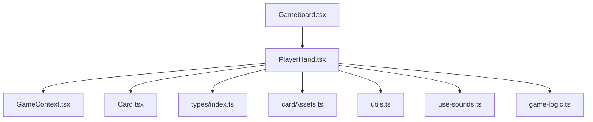
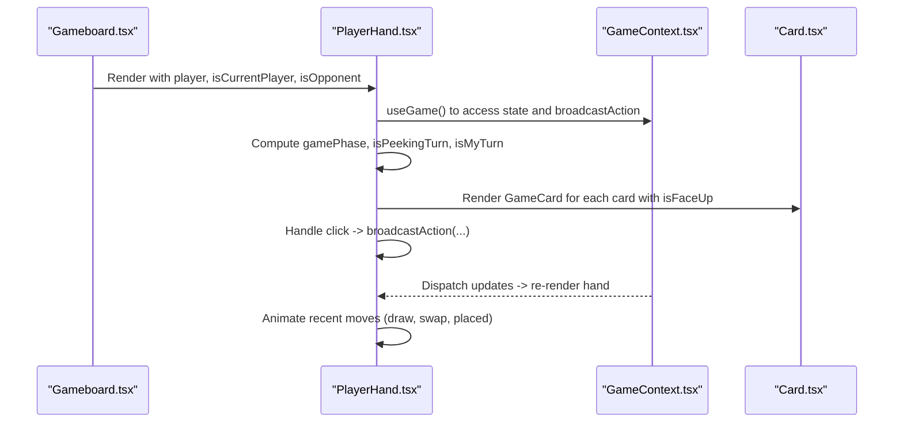
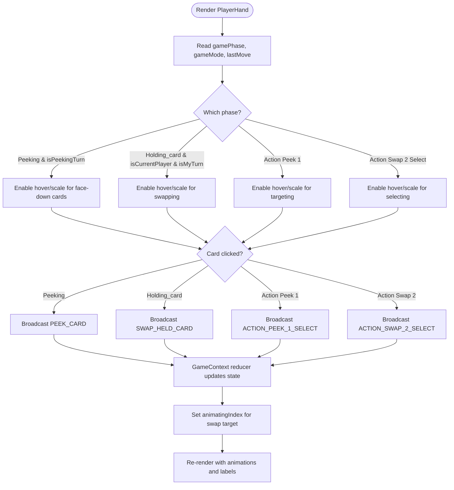
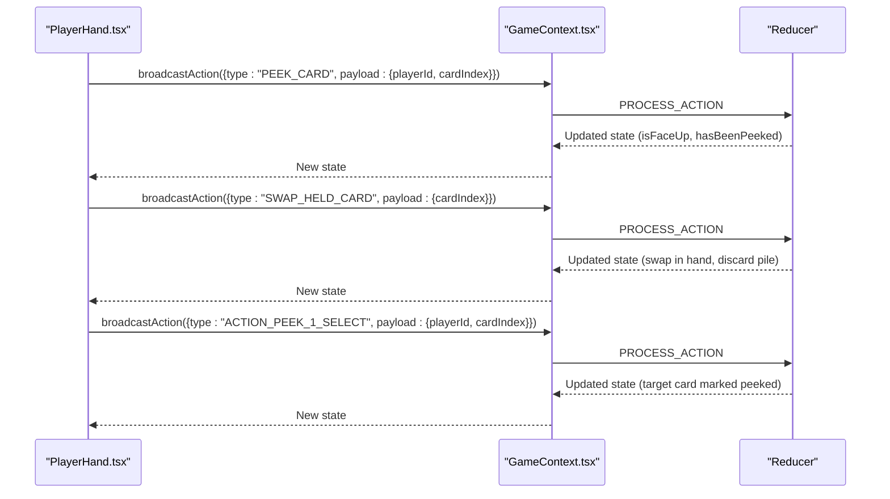
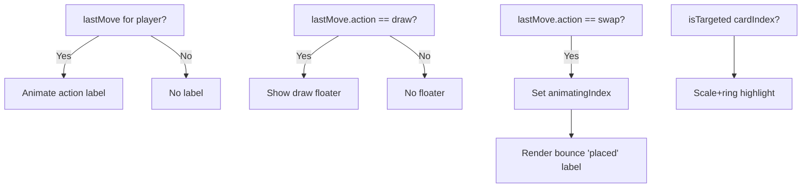
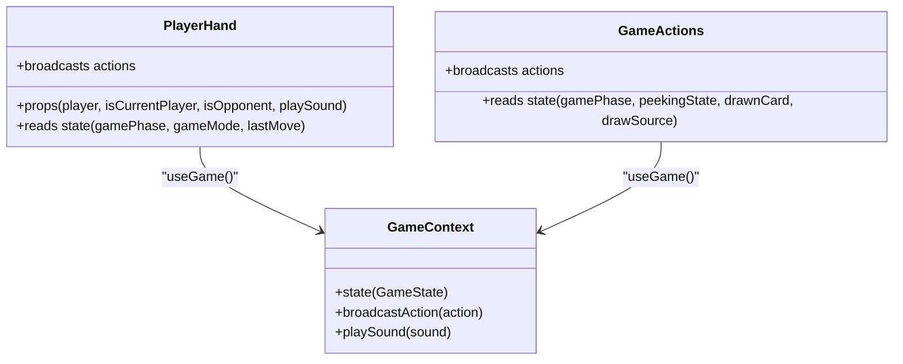
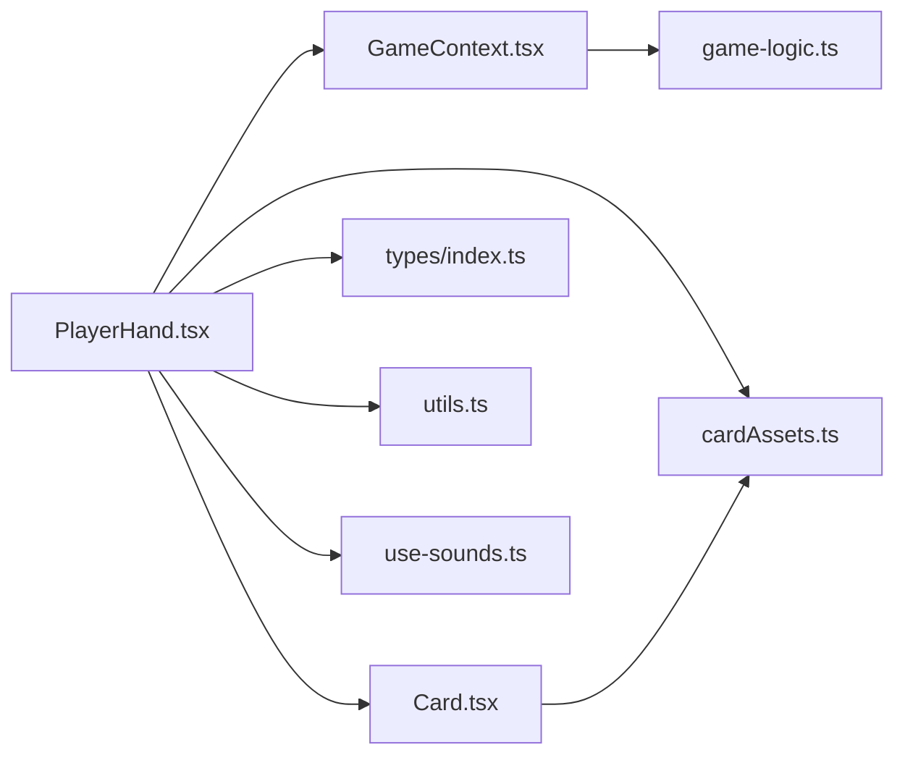

# Player Hand

<cite>
**Referenced Files in This Document**
- [PlayerHand.tsx](file://src/components/PlayerHand.tsx)
- [Gameboard.tsx](file://src/components/Gameboard.tsx)
- [GameContext.tsx](file://src/context/GameContext.tsx)
- [Card.tsx](file://src/components/Card.tsx)
- [types/index.ts](file://src/types/index.ts)
- [cardAssets.ts](file://src/lib/cardAssets.ts)
- [utils.ts](file://src/lib/utils.ts)
- [use-sounds.ts](file://src/hooks/use-sounds.ts)
- [game-logic.ts](file://src/lib/game-logic.ts)
- [GameActions.tsx](file://src/components/GameActions.tsx)
</cite>

## Table of Contents
1. [Introduction](#introduction)
2. [Project Structure](#project-structure)
3. [Core Components](#core-components)
4. [Architecture Overview](#architecture-overview)
5. [Detailed Component Analysis](#detailed-component-analysis)
6. [Dependency Analysis](#dependency-analysis)
7. [Performance Considerations](#performance-considerations)
8. [Troubleshooting Guide](#troubleshooting-guide)
9. [Conclusion](#conclusion)
10. [Appendices](#appendices)

## Introduction
This document explains the PlayerHand component, which renders a player’s hand of cards and orchestrates interactive gameplay. It covers conditional rendering based on game phase (peeking, playing, holding_card, special actions), player context (current player vs opponent), card interaction logic (click to peek, swap held cards, special actions), visual feedback with Framer Motion animations, responsive design with dynamic card sizing, integration with GameContext for state access and action broadcasting, accessibility considerations, and performance optimizations.

## Project Structure
PlayerHand lives under src/components and is integrated into the main game board layout. It composes GameCard for individual card rendering and uses shared utilities for assets, animations, and state.

**Diagram sources**
- [Gameboard.tsx](file://src/components/Gameboard.tsx#L200-L300)
- [PlayerHand.tsx](file://src/components/PlayerHand.tsx#L1-L277)
- [GameContext.tsx](file://src/context/GameContext.tsx#L550-L620)
- [Card.tsx](file://src/components/Card.tsx#L1-L187)
- [types/index.ts](file://src/types/index.ts#L1-L100)
- [cardAssets.ts](file://src/lib/cardAssets.ts#L1-L58)
- [utils.ts](file://src/lib/utils.ts#L1-L7)
- [use-sounds.ts](file://src/hooks/use-sounds.ts#L1-L30)
- [game-logic.ts](file://src/lib/game-logic.ts#L1-L63)

**Section sources**
- [Gameboard.tsx](file://src/components/Gameboard.tsx#L200-L300)
- [PlayerHand.tsx](file://src/components/PlayerHand.tsx#L1-L277)

## Core Components
- PlayerHand: Renders a player’s hand, applies conditional interactions, and provides visual feedback for recent moves.
- GameCard: Renders a single card with flipping animation, special action hints, and responsive sizing.
- GameContext: Provides global game state, action broadcasting, and synchronization for online play.
- Types: Defines game state, phases, actions, and player/card structures.
- Utilities: Shared helpers for class merging and card asset resolution.

Key responsibilities:
- Conditional rendering and interaction logic based on gamePhase and player role.
- Broadcasting actions to the GameContext reducer.
- Managing recent move animations and notifications.
- Responsive card sizing for different screen sizes and opponent views.

**Section sources**
- [PlayerHand.tsx](file://src/components/PlayerHand.tsx#L1-L277)
- [Card.tsx](file://src/components/Card.tsx#L1-L187)
- [GameContext.tsx](file://src/context/GameContext.tsx#L550-L620)
- [types/index.ts](file://src/types/index.ts#L1-L100)

## Architecture Overview
PlayerHand sits within Gameboard, receiving props for the player, current player status, and whether the player is an opponent. It reads the global GameState from GameContext to determine interactions and visual feedback. PlayerHand delegates card rendering to GameCard and uses Framer Motion for animations.

**Diagram sources**
- [Gameboard.tsx](file://src/components/Gameboard.tsx#L200-L300)
- [PlayerHand.tsx](file://src/components/PlayerHand.tsx#L1-L277)
- [GameContext.tsx](file://src/context/GameContext.tsx#L550-L620)
- [Card.tsx](file://src/components/Card.tsx#L1-L187)

## Detailed Component Analysis

### PlayerHand Implementation
- Props and context:
  - Receives player, isCurrentPlayer, optional isOpponent, and playSound callback.
  - Uses GameContext to read state (gamePhase, gameMode, lastMove) and broadcast actions.
- Conditional rendering:
  - During peeking phase, only the peeking player can click face-down cards to peek.
  - During holding_card, only the current player can swap a hand card for the drawn card.
  - Special actions: Peek 1, Swap 2 selection, and Take 2 selection are enabled under specific phases and ownership.
- Interaction logic:
  - Click handlers broadcast appropriate actions to the GameContext reducer.
  - Legal interactions are indicated by hover scaling and pointer cursor.
- Visual feedback:
  - Recent move labels appear with Framer Motion enter/exit.
  - Floating “draw” notification appears above the hand when a card is drawn.
  - “Placed” bounce indicator appears above the targeted card slot during swaps.
  - Scale and ring highlighting for the targeted card during recent moves.
- Responsive design:
  - Dynamic card width classes adapt to screen size and opponent view.
  - Tailwind utilities adjust padding and spacing for small screens.

**Diagram sources**
- [PlayerHand.tsx](file://src/components/PlayerHand.tsx#L78-L166)
- [PlayerHand.tsx](file://src/components/PlayerHand.tsx#L180-L277)
- [GameContext.tsx](file://src/context/GameContext.tsx#L176-L254)
- [GameContext.tsx](file://src/context/GameContext.tsx#L317-L351)
- [GameContext.tsx](file://src/context/GameContext.tsx#L408-L433)
- [GameContext.tsx](file://src/context/GameContext.tsx#L434-L475)

**Section sources**
- [PlayerHand.tsx](file://src/components/PlayerHand.tsx#L1-L277)

### Card Interaction Logic
- Peeking phase:
  - Only the current peeking player can click face-down cards.
  - Broadcasts PEEK_CARD with player id and card index.
- Swapping held card:
  - Only the current player in holding_card phase can swap.
  - Broadcasts SWAP_HELD_CARD with the selected card index.
- Special actions:
  - Peek 1: Broadcast ACTION_PEEK_1_SELECT with target player and card index; shows localized info toast.
  - Swap 2: Two-phase selection; broadcasts ACTION_SWAP_2_SELECT twice; reducer performs the swap.
- Legal interaction indicators:
  - getCardInteractionClass adds hover/scale classes only when the interaction is allowed.

**Diagram sources**
- [PlayerHand.tsx](file://src/components/PlayerHand.tsx#L83-L131)
- [GameContext.tsx](file://src/context/GameContext.tsx#L176-L254)
- [GameContext.tsx](file://src/context/GameContext.tsx#L317-L351)
- [GameContext.tsx](file://src/context/GameContext.tsx#L408-L433)

**Section sources**
- [PlayerHand.tsx](file://src/components/PlayerHand.tsx#L83-L131)
- [GameContext.tsx](file://src/context/GameContext.tsx#L176-L254)
- [GameContext.tsx](file://src/context/GameContext.tsx#L317-L351)
- [GameContext.tsx](file://src/context/GameContext.tsx#L408-L433)

### Visual Feedback System with Framer Motion
- Recent move labels:
  - Animated appear/disappear when lastMove belongs to the player and is recent.
- Floating draw notification:
  - Appears above the hand when a card is drawn, showing deck or discard origin.
- Placed indicator:
  - Bouncing “placed” label appears above the targeted card slot during swaps.
- Target highlighting:
  - Scale and ring highlight for the targeted card during recent moves.
- Card-level animations:
  - GameCard provides flipping animation and special card pulsing effect when revealed.

**Diagram sources**
- [PlayerHand.tsx](file://src/components/PlayerHand.tsx#L36-L75)
- [PlayerHand.tsx](file://src/components/PlayerHand.tsx#L211-L231)
- [PlayerHand.tsx](file://src/components/PlayerHand.tsx#L240-L244)
- [PlayerHand.tsx](file://src/components/PlayerHand.tsx#L246-L269)
- [Card.tsx](file://src/components/Card.tsx#L95-L109)

**Section sources**
- [PlayerHand.tsx](file://src/components/PlayerHand.tsx#L36-L75)
- [PlayerHand.tsx](file://src/components/PlayerHand.tsx#L211-L231)
- [PlayerHand.tsx](file://src/components/PlayerHand.tsx#L240-L244)
- [PlayerHand.tsx](file://src/components/PlayerHand.tsx#L246-L269)
- [Card.tsx](file://src/components/Card.tsx#L95-L109)

### Responsive Design and Dynamic Card Sizing
- Dynamic widths:
  - PlayerHand applies responsive width classes to GameCard based on screen size and opponent view.
- Spacing and padding:
  - Adjusts gaps and paddings for small screens to fit multiple cards comfortably.
- Opponent view:
  - Smaller cards are used for opponents’ hands to improve readability and reduce clutter.

**Section sources**
- [PlayerHand.tsx](file://src/components/PlayerHand.tsx#L262-L267)
- [PlayerHand.tsx](file://src/components/PlayerHand.tsx#L181-L194)

### Integration with GameContext and State Access
- State access:
  - Reads gamePhase, gameMode, lastMove, currentPlayerIndex, and peekingState.
- Action broadcasting:
  - Calls broadcastAction with appropriate GameAction types.
- Online synchronization:
  - GameContext merges remote state and preserves local peeked cards during peeking.

**Diagram sources**
- [PlayerHand.tsx](file://src/components/PlayerHand.tsx#L24-L31)
- [GameActions.tsx](file://src/components/GameActions.tsx#L1-L26)
- [GameContext.tsx](file://src/context/GameContext.tsx#L550-L620)

**Section sources**
- [PlayerHand.tsx](file://src/components/PlayerHand.tsx#L24-L31)
- [GameActions.tsx](file://src/components/GameActions.tsx#L1-L26)
- [GameContext.tsx](file://src/context/GameContext.tsx#L550-L620)

### Accessibility Considerations
- Pointer cursor:
  - Only clickable cards receive hover/scale and pointer cursor classes.
- Focus and keyboard:
  - Cards are interactive via click; consider adding explicit tabindex and keyboard handlers for improved accessibility.
- Touch targets:
  - Hover scaling increases perceived target size; ensure minimum touch target size for mobile devices.
- Visual cues:
  - Glowing overlays and animations provide clear affordances for interactions.

**Section sources**
- [PlayerHand.tsx](file://src/components/PlayerHand.tsx#L133-L165)
- [Card.tsx](file://src/components/Card.tsx#L155-L171)

### Performance Optimizations
- Memoization:
  - actionLabel computed via useMemo to avoid unnecessary recalculations.
  - cardBackAsset memoized to reuse asset reference.
- Animation timers:
  - Cleanup timeouts to prevent lingering state after animations.
- Conditional rendering:
  - AnimatePresence wraps labels and floater to optimize DOM changes.
- Asset resolution:
  - getCardAsset and getCardBackAsset centralized to avoid repeated imports.

**Section sources**
- [PlayerHand.tsx](file://src/components/PlayerHand.tsx#L52-L75)
- [PlayerHand.tsx](file://src/components/PlayerHand.tsx#L76-L77)
- [PlayerHand.tsx](file://src/components/PlayerHand.tsx#L43-L51)
- [PlayerHand.tsx](file://src/components/PlayerHand.tsx#L196-L209)
- [PlayerHand.tsx](file://src/components/PlayerHand.tsx#L211-L231)
- [cardAssets.ts](file://src/lib/cardAssets.ts#L38-L46)

## Dependency Analysis
- PlayerHand depends on:
  - GameContext for state and actions.
  - GameCard for rendering individual cards.
  - Types for shape definitions.
  - cardAssets for card images.
  - utils for class merging.
  - use-sounds for audio callbacks.
- GameCard depends on:
  - cardAssets for front/back images.
  - Framer Motion for flip and pulse animations.
- GameContext depends on:
  - game-logic for deck creation/shuffling.
  - Convex APIs for online state synchronization.

**Diagram sources**
- [PlayerHand.tsx](file://src/components/PlayerHand.tsx#L1-L277)
- [Card.tsx](file://src/components/Card.tsx#L1-L187)
- [GameContext.tsx](file://src/context/GameContext.tsx#L550-L620)
- [types/index.ts](file://src/types/index.ts#L1-L100)
- [cardAssets.ts](file://src/lib/cardAssets.ts#L1-L58)
- [utils.ts](file://src/lib/utils.ts#L1-L7)
- [use-sounds.ts](file://src/hooks/use-sounds.ts#L1-L30)
- [game-logic.ts](file://src/lib/game-logic.ts#L1-L63)

**Section sources**
- [PlayerHand.tsx](file://src/components/PlayerHand.tsx#L1-L277)
- [Card.tsx](file://src/components/Card.tsx#L1-L187)
- [GameContext.tsx](file://src/context/GameContext.tsx#L550-L620)
- [types/index.ts](file://src/types/index.ts#L1-L100)
- [cardAssets.ts](file://src/lib/cardAssets.ts#L1-L58)
- [utils.ts](file://src/lib/utils.ts#L1-L7)
- [use-sounds.ts](file://src/hooks/use-sounds.ts#L1-L30)
- [game-logic.ts](file://src/lib/game-logic.ts#L1-L63)

## Performance Considerations
- Prefer memoization for derived values (e.g., actionLabel, cardBackAsset).
- Limit animation scope to recent moves only (short-lived timers).
- Use AnimatePresence to efficiently mount/unmount animated elements.
- Avoid heavy computations inside render; compute outside or with useMemo/useCallback.
- Keep card assets pre-resolved to minimize re-renders.

[No sources needed since this section provides general guidance]

## Troubleshooting Guide
- Clicks not registering:
  - Ensure the current gamePhase allows the intended interaction and that isCurrentPlayer/isMyTurn conditions are met.
- Animations not appearing:
  - Verify lastMove timestamps and that the player id matches the current player.
- Z-index stacking:
  - “Placed” label uses z-20; ensure parent containers do not clip or lower z-index.
- Mobile touch targets:
  - Increase hover scale to improve tap targets; consider adding explicit touch-friendly hit areas.
- Animation conflicts:
  - Avoid overlapping animations on the same element; coordinate with recentMoveForPlayer lifecycle.

**Section sources**
- [PlayerHand.tsx](file://src/components/PlayerHand.tsx#L36-L75)
- [PlayerHand.tsx](file://src/components/PlayerHand.tsx#L240-L244)
- [PlayerHand.tsx](file://src/components/PlayerHand.tsx#L246-L269)

## Conclusion
PlayerHand encapsulates the interactive hand display with robust conditional logic, precise visual feedback, and responsive design. Its tight integration with GameContext enables seamless multiplayer synchronization and a smooth user experience across devices. By leveraging memoization, controlled animations, and clear interaction rules, PlayerHand delivers an accessible and performant interface for card-based gameplay.

[No sources needed since this section summarizes without analyzing specific files]

## Appendices

### Game Phases and Interactions Reference
- peeking: Only the peeking player can click face-down cards; broadcasts PEEK_CARD.
- holding_card: Current player can swap a hand card for the drawn card; broadcasts SWAP_HELD_CARD.
- action_peek_1: Current player can select a card to peek at; broadcasts ACTION_PEEK_1_SELECT.
- action_swap_2_select_1/select_2: Current player selects two cards to swap; broadcasts ACTION_SWAP_2_SELECT twice.
- round_end/game_over: All cards face up; interactions disabled.

**Section sources**
- [types/index.ts](file://src/types/index.ts#L17-L27)
- [GameContext.tsx](file://src/context/GameContext.tsx#L176-L254)
- [GameContext.tsx](file://src/context/GameContext.tsx#L317-L351)
- [GameContext.tsx](file://src/context/GameContext.tsx#L408-L433)
- [GameContext.tsx](file://src/context/GameContext.tsx#L434-L475)