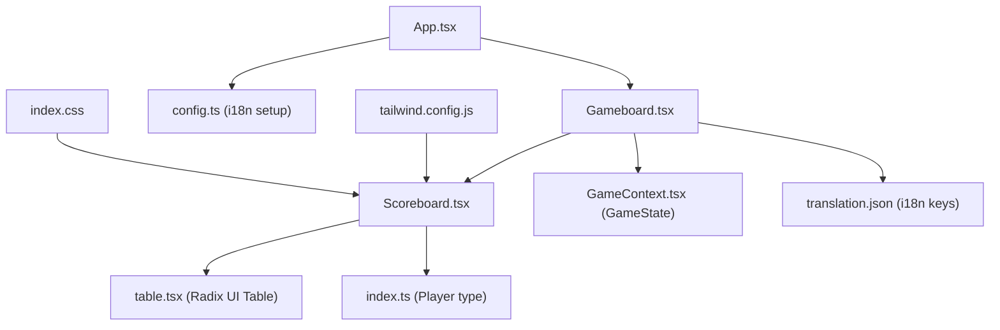
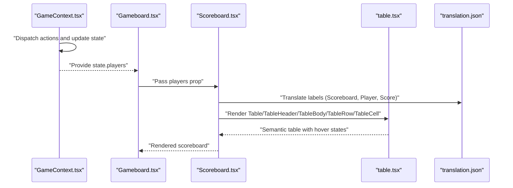
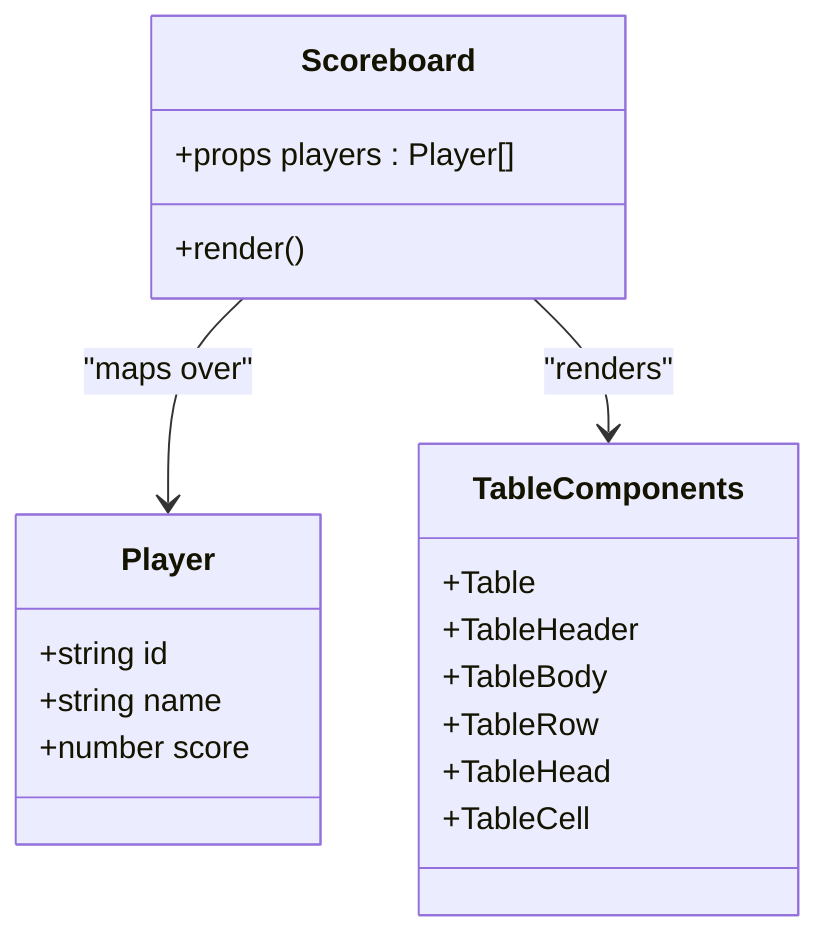
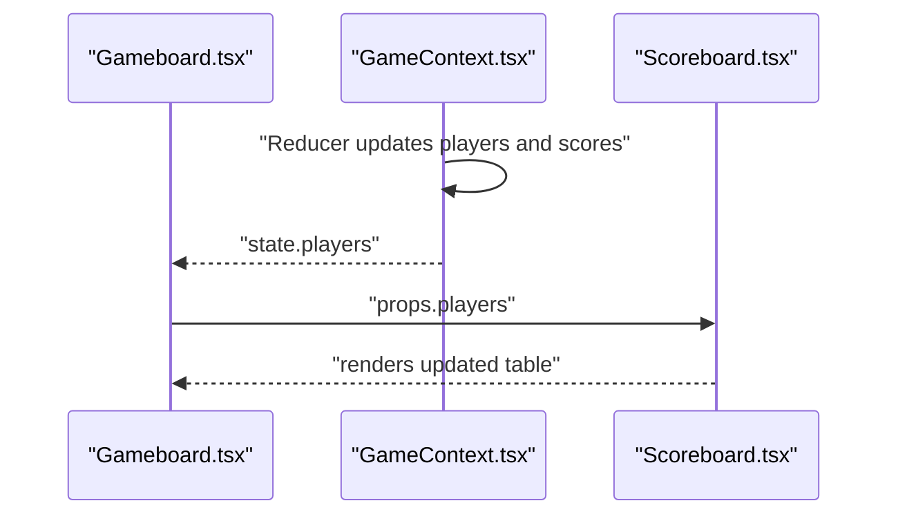
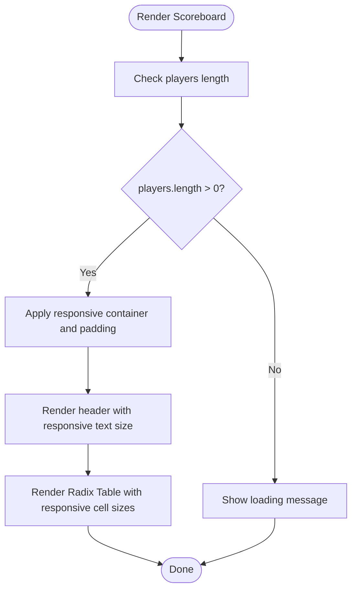
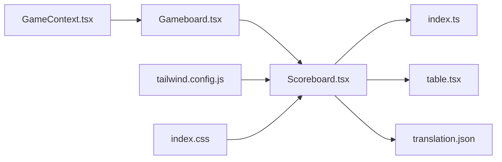

# Scoreboard

<cite>
**Referenced Files in This Document**
- [Scoreboard.tsx](file://src/components/Scoreboard.tsx)
- [Gameboard.tsx](file://src/components/Gameboard.tsx)
- [table.tsx](file://src/components/ui/table.tsx)
- [index.ts](file://src/types/index.ts)
- [GameContext.tsx](file://src/context/GameContext.tsx)
- [translation.json](file://public/locales/en/translation.json)
- [config.ts](file://src/i18n/config.ts)
- [index.css](file://src/index.css)
- [tailwind.config.js](file://tailwind.config.js)
</cite>

## Table of Contents
1. [Introduction](#introduction)
2. [Project Structure](#project-structure)
3. [Core Components](#core-components)
4. [Architecture Overview](#architecture-overview)
5. [Detailed Component Analysis](#detailed-component-analysis)
6. [Dependency Analysis](#dependency-analysis)
7. [Performance Considerations](#performance-considerations)
8. [Troubleshooting Guide](#troubleshooting-guide)
9. [Conclusion](#conclusion)
10. [Appendices](#appendices)

## Introduction
This document explains the Scoreboard component that displays player scores in a tabular format. It covers how it integrates with the Gameboard, how it receives player data from the game state, and how it renders dynamic content including player names and scores. It also documents the semantic HTML structure, accessibility features, responsive design across breakpoints, and the dreamy visual styling using gradients and borders. Internationalization support through i18next translation keys is included, along with guidance on customization, common issues, and best practices for color contrast in both light and dark themes.

## Project Structure
The Scoreboard is a presentational component that composes Radix UI Table primitives and is rendered inside the Gameboard panel. It receives a players array prop and renders a table with player names and scores. The game state that supplies the players array is managed by the GameContext provider.

**Diagram sources**
- [Gameboard.tsx](file://src/components/Gameboard.tsx#L100-L123)
- [Scoreboard.tsx](file://src/components/Scoreboard.tsx#L1-L56)
- [table.tsx](file://src/components/ui/table.tsx#L1-L121)
- [index.ts](file://src/types/index.ts#L1-L20)
- [GameContext.tsx](file://src/context/GameContext.tsx#L1-L120)
- [translation.json](file://public/locales/en/translation.json#L42-L60)
- [config.ts](file://src/i18n/config.ts#L1-L33)
- [index.css](file://src/index.css#L1-L120)
- [tailwind.config.js](file://tailwind.config.js#L1-L101)

**Section sources**
- [Gameboard.tsx](file://src/components/Gameboard.tsx#L100-L123)
- [Scoreboard.tsx](file://src/components/Scoreboard.tsx#L1-L56)
- [table.tsx](file://src/components/ui/table.tsx#L1-L121)
- [index.ts](file://src/types/index.ts#L1-L20)
- [GameContext.tsx](file://src/context/GameContext.tsx#L1-L120)
- [translation.json](file://public/locales/en/translation.json#L42-L60)
- [config.ts](file://src/i18n/config.ts#L1-L33)
- [index.css](file://src/index.css#L1-L120)
- [tailwind.config.js](file://tailwind.config.js#L1-L101)

## Core Components
- Scoreboard: Renders a styled table of players and their scores, with i18n labels and responsive typography.
- Radix UI Table: Provides semantic table markup and hover/focus behavior.
- Player type: Defines the shape of each player object (id, name, hand, score).
- GameContext: Supplies the players array and other game state to the Scoreboard via Gameboard.
- i18n: Provides translation keys for labels such as “Scoreboard”, “Player”, and “Score”.

Key responsibilities:
- Receive players prop from Gameboard.
- Render a semantic table with headers and rows.
- Apply gradient backgrounds and border treatments consistent with the dreamy aesthetic.
- Use responsive typography and spacing.
- Provide accessible hover states via Radix Table components.

**Section sources**
- [Scoreboard.tsx](file://src/components/Scoreboard.tsx#L1-L56)
- [table.tsx](file://src/components/ui/table.tsx#L1-L121)
- [index.ts](file://src/types/index.ts#L1-L20)
- [GameContext.tsx](file://src/context/GameContext.tsx#L1-L120)
- [translation.json](file://public/locales/en/translation.json#L42-L60)

## Architecture Overview
The Scoreboard is embedded in the Gameboard’s side panel and updates automatically as the game state changes. The GameContext manages the GameState, including the players array. The Scoreboard consumes the players prop and renders a table with i18n labels.

**Diagram sources**
- [GameContext.tsx](file://src/context/GameContext.tsx#L1-L120)
- [Gameboard.tsx](file://src/components/Gameboard.tsx#L100-L123)
- [Scoreboard.tsx](file://src/components/Scoreboard.tsx#L1-L56)
- [table.tsx](file://src/components/ui/table.tsx#L1-L121)
- [translation.json](file://public/locales/en/translation.json#L42-L60)

## Detailed Component Analysis

### Scoreboard Implementation
- Props: Receives a players array of Player objects.
- Rendering: Uses Radix UI Table components to render a semantic table with header row and data rows.
- Accessibility: Leverages Radix Table’s built-in hover and focus behavior; the table is wrapped in a scrollable container for small screens.
- Styling: Gradient background and soft borders; responsive typography scales from small to large screens.
- Internationalization: Uses i18n keys for labels and content.

**Diagram sources**
- [Scoreboard.tsx](file://src/components/Scoreboard.tsx#L1-L56)
- [index.ts](file://src/types/index.ts#L1-L20)
- [table.tsx](file://src/components/ui/table.tsx#L1-L121)

**Section sources**
- [Scoreboard.tsx](file://src/components/Scoreboard.tsx#L1-L56)
- [table.tsx](file://src/components/ui/table.tsx#L1-L121)
- [index.ts](file://src/types/index.ts#L1-L20)

### Integration with Game State Lifecycle
- Gameboard passes the current players array to Scoreboard.
- As the game progresses, the GameContext reducer updates the GameState, including players’ scores.
- The Scoreboard re-renders with the updated players prop.

**Diagram sources**
- [Gameboard.tsx](file://src/components/Gameboard.tsx#L100-L123)
- [GameContext.tsx](file://src/context/GameContext.tsx#L1-L120)
- [Scoreboard.tsx](file://src/components/Scoreboard.tsx#L1-L56)

**Section sources**
- [Gameboard.tsx](file://src/components/Gameboard.tsx#L100-L123)
- [GameContext.tsx](file://src/context/GameContext.tsx#L1-L120)
- [Scoreboard.tsx](file://src/components/Scoreboard.tsx#L1-L56)

### Responsive Design and Typography
- Breakpoints: The component uses responsive utilities (sm, md, lg) to adjust font sizes and paddings.
- Small screens: The table is wrapped in a horizontally scrollable container to prevent horizontal overflow.
- Typography: Font sizes increase progressively from small to large screens for both headers and cells.
- Spacing: Padding and gaps adapt across breakpoints for readability.

**Diagram sources**
- [Scoreboard.tsx](file://src/components/Scoreboard.tsx#L1-L56)
- [table.tsx](file://src/components/ui/table.tsx#L1-L121)

**Section sources**
- [Scoreboard.tsx](file://src/components/Scoreboard.tsx#L1-L56)
- [table.tsx](file://src/components/ui/table.tsx#L1-L121)

### Visual Styling and Aesthetic
- Gradient background: Soft gradient from light purple to pink with transparency for a dreamy feel.
- Borders: Subtle borders with low opacity to maintain a light, airy appearance.
- Hover states: Rows have a soft hover background to improve interactivity.
- Fonts: Uses heading fonts and monospace for scores to enhance readability.

**Section sources**
- [Scoreboard.tsx](file://src/components/Scoreboard.tsx#L1-L56)
- [index.css](file://src/index.css#L1-L120)
- [tailwind.config.js](file://tailwind.config.js#L1-L101)

### Internationalization Support
- Translation keys: The component uses i18n keys for “Scoreboard”, “Player”, and “Score”.
- Setup: i18n is initialized with supported languages and namespaces.
- Keys: Found under the “game” namespace in translation files.

**Section sources**
- [Scoreboard.tsx](file://src/components/Scoreboard.tsx#L1-L56)
- [translation.json](file://public/locales/en/translation.json#L42-L60)
- [config.ts](file://src/i18n/config.ts#L1-L33)

## Dependency Analysis
- Scoreboard depends on:
  - Player type for props typing.
  - Radix UI Table components for semantic table rendering.
  - i18n for labels.
  - Tailwind utilities for responsive styles.
  - Gameboard for passing the players prop.
- GameContext supplies the players array and updates it during gameplay.

**Diagram sources**
- [Scoreboard.tsx](file://src/components/Scoreboard.tsx#L1-L56)
- [index.ts](file://src/types/index.ts#L1-L20)
- [table.tsx](file://src/components/ui/table.tsx#L1-L121)
- [translation.json](file://public/locales/en/translation.json#L42-L60)
- [Gameboard.tsx](file://src/components/Gameboard.tsx#L100-L123)
- [GameContext.tsx](file://src/context/GameContext.tsx#L1-L120)
- [tailwind.config.js](file://tailwind.config.js#L1-L101)
- [index.css](file://src/index.css#L1-L120)

**Section sources**
- [Scoreboard.tsx](file://src/components/Scoreboard.tsx#L1-L56)
- [table.tsx](file://src/components/ui/table.tsx#L1-L121)
- [index.ts](file://src/types/index.ts#L1-L20)
- [Gameboard.tsx](file://src/components/Gameboard.tsx#L100-L123)
- [GameContext.tsx](file://src/context/GameContext.tsx#L1-L120)
- [translation.json](file://public/locales/en/translation.json#L42-L60)
- [tailwind.config.js](file://tailwind.config.js#L1-L101)
- [index.css](file://src/index.css#L1-L120)

## Performance Considerations
- Rendering cost: The table maps over the players array; keep the array reasonably sized for smooth rendering.
- Memoization: If the players array is expensive to compute, memoize it at the Gameboard level to avoid unnecessary re-renders.
- Virtualization: For very large player lists, consider virtualizing the table rows to reduce DOM nodes.
- CSS: Prefer Tailwind utilities for consistent performance; avoid heavy custom CSS that triggers layout thrashing.

[No sources needed since this section provides general guidance]

## Troubleshooting Guide
- Long player names: The table cells wrap text by default; ensure the container is wide enough or consider truncating names with ellipsis in custom variants.
- Horizontal scrolling on small screens: The table is wrapped in a scrollable container; verify that the parent container allows horizontal overflow.
- Color contrast: Verify contrast ratios for both light and dark themes; adjust colors if needed to meet accessibility guidelines.
- i18n not updating: Ensure i18n is initialized and the keys exist in the translation files.
- Hover states: If hover states appear inconsistent, confirm Radix Table’s hover classes are applied and Tailwind utilities are not overriding them.

**Section sources**
- [Scoreboard.tsx](file://src/components/Scoreboard.tsx#L1-L56)
- [table.tsx](file://src/components/ui/table.tsx#L1-L121)
- [translation.json](file://public/locales/en/translation.json#L42-L60)
- [config.ts](file://src/i18n/config.ts#L1-L33)
- [index.css](file://src/index.css#L1-L120)

## Conclusion
The Scoreboard component provides a clean, accessible, and responsive display of player scores using Radix UI Table. It integrates seamlessly with the Gameboard and GameContext, receiving dynamic player data and rendering it with i18n labels and a dreamy visual style. By leveraging responsive utilities and semantic markup, it remains usable across devices while maintaining a cohesive design language.

[No sources needed since this section summarizes without analyzing specific files]

## Appendices

### Customization Options
- Styling: Adjust gradient colors, border opacity, and hover backgrounds via Tailwind classes on the container and table components.
- Typography: Modify responsive text sizes using sm/md/lg utilities on headers and cells.
- Layout: Change padding and spacing to fit different screen sizes or layouts.
- Accessibility: Ensure hover and focus states remain visible and consistent across themes.

**Section sources**
- [Scoreboard.tsx](file://src/components/Scoreboard.tsx#L1-L56)
- [table.tsx](file://src/components/ui/table.tsx#L1-L121)
- [tailwind.config.js](file://tailwind.config.js#L1-L101)
- [index.css](file://src/index.css#L1-L120)