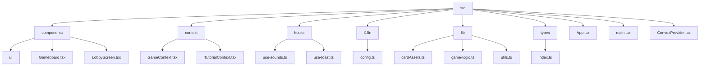
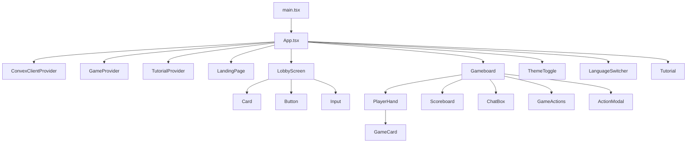
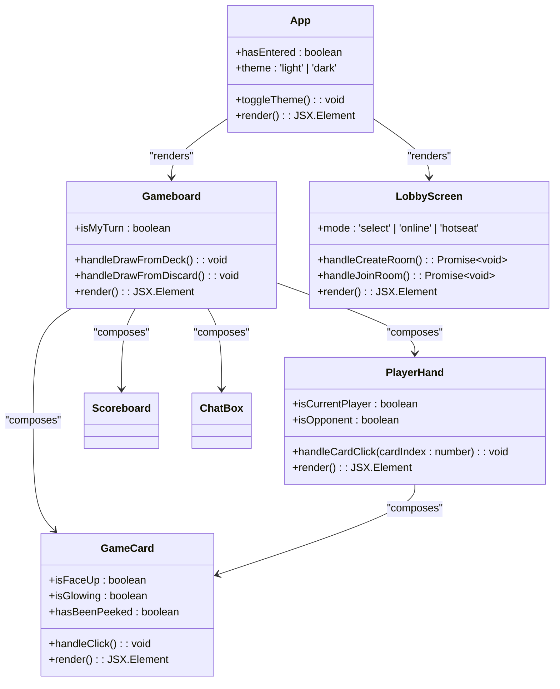
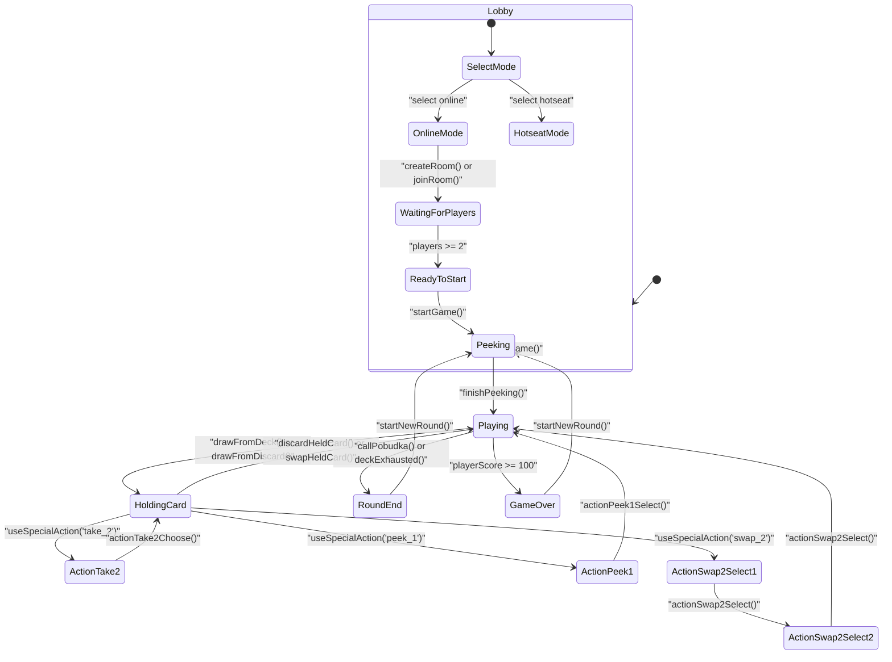
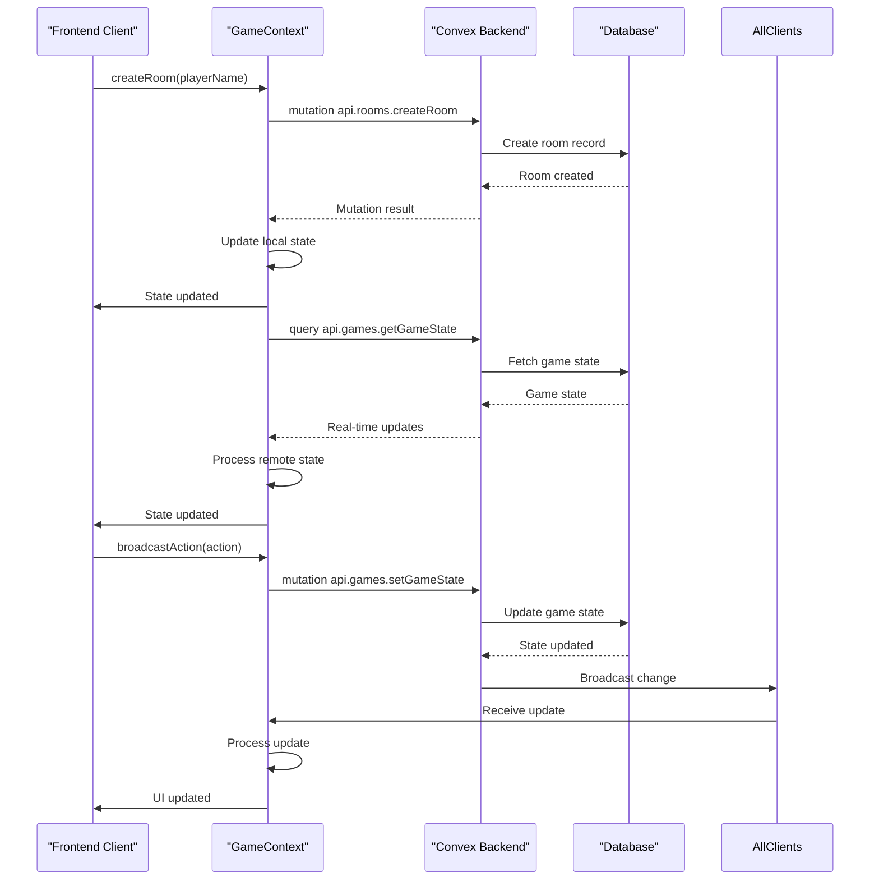
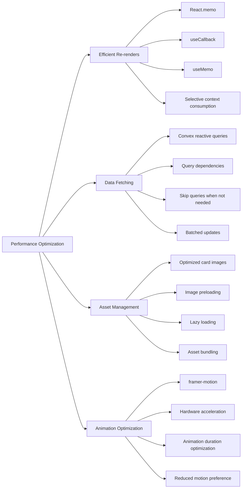

# Frontend Architecture

<cite>
**Referenced Files in This Document**   
- [App.tsx](file://src/App.tsx)
- [main.tsx](file://src/main.tsx)
- [GameContext.tsx](file://src/context/GameContext.tsx)
- [ConvexProvider.tsx](file://src/ConvexProvider.tsx)
- [LobbyScreen.tsx](file://src/components/LobbyScreen.tsx)
- [Gameboard.tsx](file://src/components/Gameboard.tsx)
- [ThemeToggle.tsx](file://src/components/ThemeToggle.tsx)
- [LanguageSwitcher.tsx](file://src/components/LanguageSwitcher.tsx)
- [TutorialContext.tsx](file://src/context/TutorialContext.tsx)
- [index.ts](file://src/types/index.ts)
- [config.ts](file://src/i18n/config.ts)
- [game-logic.ts](file://src/lib/game-logic.ts)
- [use-sounds.ts](file://src/hooks/use-sounds.ts)
- [PlayerHand.tsx](file://src/components/PlayerHand.tsx)
- [Card.tsx](file://src/components/Card.tsx)
</cite>

## Table of Contents
1. [Introduction](#introduction)
2. [Project Structure](#project-structure)
3. [Component Hierarchy](#component-hierarchy)
4. [Architectural Patterns](#architectural-patterns)
5. [State Management](#state-management)
6. [Backend Integration](#backend-integration)
7. [Cross-Cutting Concerns](#cross-cutting-concerns)
8. [Performance Considerations](#performance-considerations)
9. [Conclusion](#conclusion)

## Introduction
The sen-web frontend is a React with TypeScript application that implements a card game called "Sen" with both online multiplayer and local hotseat modes. The architecture follows modern React patterns with a focus on component composition, global state management through context, and real-time data synchronization with a backend via Convex. The application features a responsive design with smooth animations, internationalization support, and accessibility considerations. This document provides a comprehensive overview of the frontend architecture, detailing the component hierarchy, state management patterns, and integration points with backend services.

## Project Structure
The project follows a feature-based organization with clear separation of concerns. The main structure organizes components, context providers, hooks, and utilities into dedicated directories. The application leverages modern tooling including Vite for bundling, Tailwind CSS for styling, and Convex for backend integration. The internationalization resources are organized by language in the public/locales directory, while the Convex backend definitions are colocated in the convex directory.



**Diagram sources**
- [src](file://src)
- [components](file://src/components)
- [context](file://src/context)
- [hooks](file://src/hooks)
- [i18n](file://src/i18n)
- [lib](file://src/lib)
- [types](file://src/types)

**Section sources**
- [src](file://src)
- [public/locales](file://public/locales)
- [convex](file://convex)

## Component Hierarchy
The component hierarchy starts with main.tsx as the entry point, which renders App.tsx wrapped in multiple context providers. The App component serves as the main orchestrator, managing the application's primary state and routing between different views based on the game state. The component tree flows from the App component to specialized screens like LobbyScreen and Gameboard, which in turn compose smaller UI components to create the complete user interface.



**Diagram sources**
- [main.tsx](file://src/main.tsx)
- [App.tsx](file://src/App.tsx)
- [LobbyScreen.tsx](file://src/components/LobbyScreen.tsx)
- [Gameboard.tsx](file://src/components/Gameboard.tsx)
- [PlayerHand.tsx](file://src/components/PlayerHand.tsx)
- [Card.tsx](file://src/components/Card.tsx)

**Section sources**
- [main.tsx](file://src/main.tsx#L1-L21)
- [App.tsx](file://src/App.tsx#L1-L80)
- [LobbyScreen.tsx](file://src/components/LobbyScreen.tsx#L1-L413)
- [Gameboard.tsx](file://src/components/Gameboard.tsx#L1-L355)

## Architectural Patterns
The application employs several key architectural patterns to manage complexity and ensure maintainability. Component composition is used extensively to build complex UIs from smaller, reusable parts. The React Context API provides global state management for game state, tutorial state, and UI preferences. Custom hooks encapsulate reusable logic such as sound management and toast notifications. The application follows a unidirectional data flow pattern where state changes are handled through a reducer pattern in the GameContext, ensuring predictable state transitions.



**Diagram sources**
- [App.tsx](file://src/App.tsx#L14-L79)
- [Gameboard.tsx](file://src/components/Gameboard.tsx#L26-L354)
- [LobbyScreen.tsx](file://src/components/LobbyScreen.tsx#L18-L412)
- [PlayerHand.tsx](file://src/components/PlayerHand.tsx#L19-L275)
- [Card.tsx](file://src/components/Card.tsx#L19-L186)

**Section sources**
- [App.tsx](file://src/App.tsx#L1-L80)
- [Gameboard.tsx](file://src/components/Gameboard.tsx#L1-L355)
- [LobbyScreen.tsx](file://src/components/LobbyScreen.tsx#L1-L413)
- [PlayerHand.tsx](file://src/components/PlayerHand.tsx#L1-L276)
- [Card.tsx](file://src/components/Card.tsx#L1-L187)

## State Management
The application uses React Context API as the primary mechanism for global state management. The GameContext provides a centralized store for game state, implemented using the useReducer hook for predictable state transitions. The context exposes actions for creating rooms, joining games, and broadcasting game actions, while maintaining the current game state including player information, card piles, and game phase. The TutorialContext manages the onboarding experience, tracking the current step and providing methods to navigate through the tutorial. Local component state is used for UI-specific state like form inputs and animation states.



**Diagram sources**
- [GameContext.tsx](file://src/context/GameContext.tsx#L19-L547)
- [types/index.ts](file://src/types/index.ts#L17-L27)
- [LobbyScreen.tsx](file://src/components/LobbyScreen.tsx#L21-L412)

**Section sources**
- [GameContext.tsx](file://src/context/GameContext.tsx#L1-L1152)
- [types/index.ts](file://src/types/index.ts#L1-L100)
- [TutorialContext.tsx](file://src/context/TutorialContext.tsx#L1-L88)

## Backend Integration
The frontend integrates with the backend through the ConvexClientProvider, which establishes a connection to the Convex backend and provides access to queries and mutations. Real-time data synchronization is achieved through Convex's reactive queries, which automatically update the UI when data changes on the server. The GameContext subscribes to game state, chat messages, and player presence, ensuring that all clients see the same game state. Mutations are used to send actions to the backend, which then broadcasts them to all connected clients. The integration handles reconnection logic and presence detection to provide a robust multiplayer experience.



**Diagram sources**
- [ConvexProvider.tsx](file://src/ConvexProvider.tsx#L1-L18)
- [GameContext.tsx](file://src/context/GameContext.tsx#L587-L800)
- [convex](file://convex)

**Section sources**
- [ConvexProvider.tsx](file://src/ConvexProvider.tsx#L1-L18)
- [GameContext.tsx](file://src/context/GameContext.tsx#L587-L800)
- [convex](file://convex)

## Cross-Cutting Concerns
The application addresses several cross-cutting concerns including theming, internationalization, accessibility, and sound feedback. The ThemeToggle component manages the light/dark theme preference, storing the selection in localStorage and applying it to the document root. The LanguageSwitcher component uses react-i18next to provide multi-language support, with translations stored in JSON files. Accessibility is considered throughout the UI with proper ARIA labels, keyboard navigation support, and screen reader optimizations. The use-sounds custom hook provides audio feedback for game actions, enhancing the user experience with appropriate sound effects.

```mermaid
flowchart TD
A[User Interaction] --> B{Theming}
A --> C{Internationalization}
A --> D{Accessibility}
A --> E{Sound Feedback}
B --> F[ThemeToggle]
F --> G[localStorage]
G --> H[document.documentElement]
H --> I[CSS classes]
C --> J[LanguageSwitcher]
J --> K[i18n instance]
K --> L[HTTP Backend]
L --> M[/locales/en/translation.json]
L --> N[/locales/pl/translation.json]
D --> O[ARIA labels]
D --> P[Keyboard navigation]
D --> Q[Screen reader support]
D --> R[Focus management]
E --> S[use-sounds hook]
S --> T[Howl instances]
T --> U[Sound effects]
U --> V[flip, draw, click, win, lose, chat, pobudka]
```

**Diagram sources**
- [ThemeToggle.tsx](file://src/components/ThemeToggle.tsx#L1-L50)
- [LanguageSwitcher.tsx](file://src/components/LanguageSwitcher.tsx#L1-L40)
- [use-sounds.ts](file://src/hooks/use-sounds.ts#L1-L33)
- [config.ts](file://src/i18n/config.ts#L1-L33)

**Section sources**
- [ThemeToggle.tsx](file://src/components/ThemeToggle.tsx#L1-L50)
- [LanguageSwitcher.tsx](file://src/components/LanguageSwitcher.tsx#L1-L40)
- [use-sounds.ts](file://src/hooks/use-sounds.ts#L1-L33)
- [config.ts](file://src/i18n/config.ts#L1-L33)

## Performance Considerations
The application employs several performance optimization strategies to ensure a smooth user experience. React.memo is used to prevent unnecessary re-renders of components that receive the same props. The useReducer hook with careful state management minimizes re-renders by only updating the UI when necessary. The integration with Convex uses selective queries that only subscribe to data relevant to the current game state, reducing network overhead. The use of React.Suspense and lazy loading ensures that components are only loaded when needed. Animations are optimized using framer-motion with hardware acceleration, and images are efficiently managed through asset optimization and lazy loading.



**Diagram sources**
- [GameContext.tsx](file://src/context/GameContext.tsx#L574-L800)
- [PlayerHand.tsx](file://src/components/PlayerHand.tsx#L19-L275)
- [Card.tsx](file://src/components/Card.tsx#L19-L186)
- [Gameboard.tsx](file://src/components/Gameboard.tsx#L26-L354)

**Section sources**
- [GameContext.tsx](file://src/context/GameContext.tsx#L574-L800)
- [PlayerHand.tsx](file://src/components/PlayerHand.tsx#L1-L276)
- [Card.tsx](file://src/components/Card.tsx#L1-L187)
- [Gameboard.tsx](file://src/components/Gameboard.tsx#L1-L355)

## Conclusion
The sen-web frontend architecture demonstrates a well-structured React application with TypeScript that effectively implements a complex card game with both online and local multiplayer capabilities. The architecture leverages modern React patterns including context-based state management, custom hooks, and component composition to create a maintainable and scalable codebase. The integration with Convex provides real-time data synchronization with minimal boilerplate, while the thoughtful implementation of cross-cutting concerns like theming, internationalization, and accessibility ensures a high-quality user experience. The performance optimizations and careful state management contribute to a responsive and smooth gameplay experience. This architecture serves as a solid foundation for future enhancements and demonstrates best practices in modern frontend development.