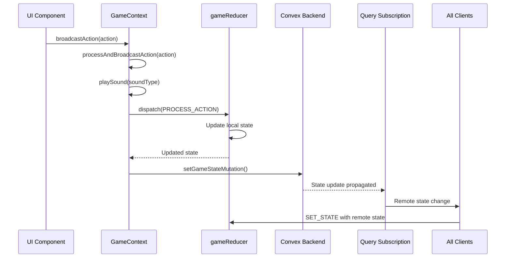
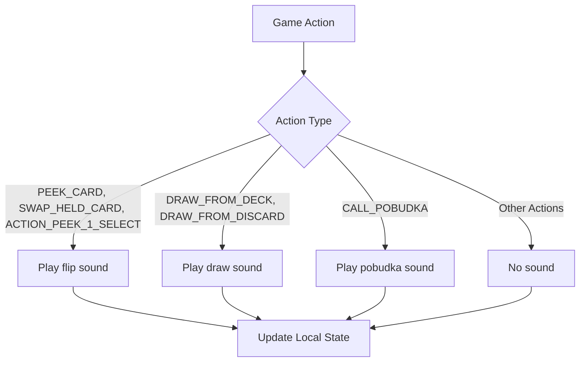
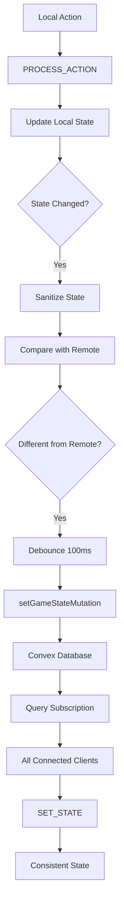

# Action Broadcasting Mechanism

<cite>
**Referenced Files in This Document**   
- [GameContext.tsx](file://src/context/GameContext.tsx)
- [use-sounds.ts](file://src/hooks/use-sounds.ts)
- [games.ts](file://convex/games.ts)
- [index.ts](file://src/types/index.ts)
- [GameActions.tsx](file://src/components/GameActions.tsx)
- [ActionModal.tsx](file://src/components/ActionModal.tsx)
- [PlayerHand.tsx](file://src/components/PlayerHand.tsx)
</cite>

## Table of Contents
1. [Introduction](#introduction)
2. [Core Components](#core-components)
3. [Action Broadcasting Flow](#action-broadcasting-flow)
4. [Sound Effects Integration](#sound-effects-integration)
5. [State Synchronization Mechanism](#state-synchronization-mechanism)
6. [Race Condition Handling](#race-condition-handling)
7. [Error Handling and Edge Cases](#error-handling-and-edge-cases)
8. [Best Practices for New Action Types](#best-practices-for-new-action-types)
9. [Conclusion](#conclusion)

## Introduction
The action broadcasting system in sen-web serves as the central mechanism for coordinating user interactions and maintaining synchronized game state across all clients. This system enables real-time multiplayer gameplay by bridging UI components with backend state management through Convex. The core of this mechanism is the `processAndBroadcastAction` function, which handles the complete lifecycle of game actions from user input to global state synchronization. This document provides a comprehensive analysis of how user actions are processed, how sound feedback is integrated, and how consistency is maintained across distributed clients.

## Core Components

The action broadcasting system relies on several key components working in concert to maintain game state consistency and provide responsive user feedback. The system is built around React's context API for state management, Convex for backend synchronization, and a well-defined action processing pipeline.

**Section sources**
- [GameContext.tsx](file://src/context/GameContext.tsx#L1-L1152)
- [index.ts](file://src/types/index.ts#L1-L100)

## Action Broadcasting Flow

The action broadcasting mechanism follows a well-defined sequence from UI interaction to global state synchronization. When a user performs an action in the game interface, the flow begins with UI components calling the `broadcastAction` function provided by the GameContext. This function is actually an alias for the `processAndBroadcastAction` useCallback hook, which orchestrates the entire action processing pipeline.

The process begins when UI components like GameActions.tsx or PlayerHand.tsx dispatch actions in response to user interactions. For example, when a player clicks the "Pobudka" button, the GameActions component calls `broadcastAction({ type: "CALL_POBUDKA" })`. Similarly, when a player clicks on a card in their hand during the "holding_card" phase, the PlayerHand component dispatches a `SWAP_HELD_CARD` action.

**Diagram sources**
- [GameContext.tsx](file://src/context/GameContext.tsx#L830-L846)
- [GameActions.tsx](file://src/components/GameActions.tsx#L1-L109)
- [PlayerHand.tsx](file://src/components/PlayerHand.tsx#L78-L117)

**Section sources**
- [GameContext.tsx](file://src/context/GameContext.tsx#L830-L846)
- [GameActions.tsx](file://src/components/GameActions.tsx#L1-L109)

## Sound Effects Integration

The action broadcasting system integrates sound effects to provide immediate auditory feedback to user interactions. This is accomplished through the useSounds hook, which is consumed by the processAndBroadcastAction function to play appropriate sounds based on the action type being processed.

The sound system maps specific game actions to corresponding sound effects, creating an immersive audio experience that reinforces gameplay mechanics. The current implementation defines three primary sound categories: flip, draw, and pobudka. The flip sound is triggered by card manipulation actions such as PEEK_CARD, SWAP_HELD_CARD, and ACTION_PEEK_1_SELECT. The draw sound plays when players draw cards from either the deck or discard pile through DRAW_FROM_DECK and DRAW_FROM_DISCARD actions. The distinctive pobudka sound is reserved for the high-stakes CALL_POBUDKA action, providing dramatic audio feedback when a player ends the round.

**Diagram sources**
- [GameContext.tsx](file://src/context/GameContext.tsx#L830-L834)
- [use-sounds.ts](file://src/hooks/use-sounds.ts#L1-L30)

**Section sources**
- [GameContext.tsx](file://src/context/GameContext.tsx#L830-L834)
- [use-sounds.ts](file://src/hooks/use-sounds.ts#L1-L30)

## State Synchronization Mechanism

The state synchronization mechanism ensures consistent game state across all connected clients through Convex's real-time query subscriptions. After processing an action locally, the system synchronizes the updated state with the backend, which then propagates the changes to all connected clients.

The synchronization process begins with the processAndBroadcastAction function dispatching a PROCESS_ACTION with the isLocal flag set to true. This triggers the gameReducer to update the local state immediately, providing instant feedback to the user. The updated state is then sanitized by the sanitizeStateForSync function, which ensures that sensitive information like peeked cards is hidden from opponents during the peeking phase.

The actual synchronization occurs through an useEffect hook that monitors state changes and compares them with the remote state from Convex. When a local state change is detected that differs from both the last synced state and the current remote state, the system debounces the update and calls setGameStateMutation to persist the state to the backend. This mutation stores the game state in the Convex database, where it becomes available to all clients through the getGameState query subscription.

**Diagram sources**
- [GameContext.tsx](file://src/context/GameContext.tsx#L884-L922)
- [games.ts](file://convex/games.ts#L1-L43)

**Section sources**
- [GameContext.tsx](file://src/context/GameContext.tsx#L884-L922)
- [games.ts](file://convex/games.ts#L1-L43)

## Race Condition Handling

The action broadcasting system implements several mechanisms to prevent race conditions and ensure data consistency in a real-time multiplayer environment. The primary defense against race conditions is the state comparison logic that prevents unnecessary or conflicting state updates.

The system uses a lastSyncedStateRef to track the most recently synchronized state, comparing both the current local state and the remote state before initiating a sync operation. This three-way comparison (current local state vs. last synced state vs. current remote state) ensures that only genuine local changes are propagated to the backend, preventing loops where a client would continuously sync its own changes.

Additionally, the system employs a 100ms debounce on state synchronization to handle rapid successive actions. This prevents overwhelming the backend with frequent updates during fast-paced gameplay while still maintaining real-time responsiveness. The debounce timeout is cleared if another state change occurs before the mutation is executed, ensuring that only the most recent state is synchronized.

The gameReducer itself is designed to be idempotent and deterministic, always producing the same output state for a given input state and action. This functional approach to state management eliminates many potential race conditions by ensuring that state transitions are predictable and consistent across all clients.

**Section sources**
- [GameContext.tsx](file://src/context/GameContext.tsx#L884-L922)

## Error Handling and Edge Cases

The action broadcasting system includes comprehensive error handling for various edge cases and failure scenarios. The system gracefully handles network failures, player disconnections, and invalid actions through a combination of client-side validation and server-side resilience.

When a state synchronization fails, the system logs the error but continues functioning with the local state, relying on the real-time subscription to eventually receive the correct state from other clients. This approach ensures that temporary network issues don't disrupt gameplay, as the system will automatically reconcile state differences when connectivity is restored.

Player presence is tracked through periodic updatePresenceMutation calls every 10 seconds. If a player disconnects, the system detects their absence after 60 seconds and resets the game for the remaining player in two-player games. This prevents games from becoming stuck when a player leaves unexpectedly.

The system also handles reconnection scenarios by storing player credentials in sessionStorage. When a player refreshes the page or temporarily loses connection, the reconnection useEffect attempts to restore their session automatically, minimizing disruption to the gameplay experience.

**Section sources**
- [GameContext.tsx](file://src/context/GameContext.tsx#L782-L791)
- [GameContext.tsx](file://src/context/GameContext.tsx#L794-L800)

## Best Practices for New Action Types

When adding new action types to the sen-web application, several best practices should be followed to ensure compatibility with the existing action broadcasting system. First, new actions should be added to the GameAction union type in the types/index.ts file with appropriate payload definitions that include all necessary data for state processing.

Each new action should be handled in the gameReducer's switch statement with proper validation of preconditions, such as checking the current game phase and player eligibility. The action handler should return the current state unchanged if the action is invalid or cannot be performed in the current context, maintaining the reducer's purity.

For actions that should trigger sound effects, the processAndBroadcastAction function should be updated to include the appropriate playSound call in the switch statement. The sound type should be selected based on the nature of the action to maintain consistency with the existing audio feedback system.

New actions that modify game state should update the lastMove property in the state to provide a record of player actions, which can be useful for debugging and gameplay analysis. The action message should also be updated using i18n.t() to provide appropriate feedback to players in their preferred language.

Finally, any new action that requires special state synchronization handling should be considered in the sanitizeStateForSync function to ensure that sensitive information is properly protected during multiplayer games.

**Section sources**
- [index.ts](file://src/types/index.ts#L81-L99)
- [GameContext.tsx](file://src/context/GameContext.tsx#L47-L548)

## Conclusion
The action broadcasting system in sen-web provides a robust foundation for real-time multiplayer gameplay by effectively coordinating user interactions with backend state management. Through the processAndBroadcastAction function, the system seamlessly integrates immediate local state updates with eventual consistency across all clients via Convex's real-time subscriptions. The thoughtful integration of sound effects enhances the user experience by providing immediate auditory feedback, while the state sanitization and synchronization mechanisms ensure fair and consistent gameplay. By following the established patterns for action handling and state management, developers can extend the system with new features while maintaining the integrity and responsiveness of the multiplayer experience.