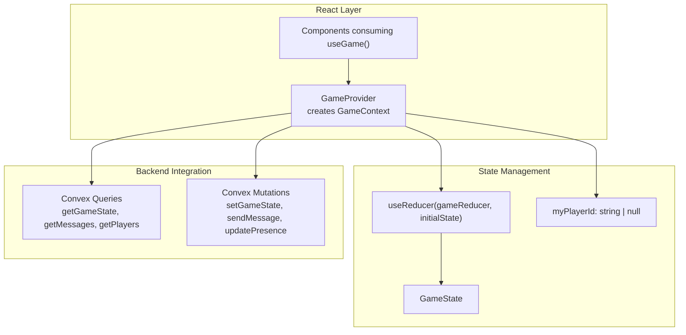
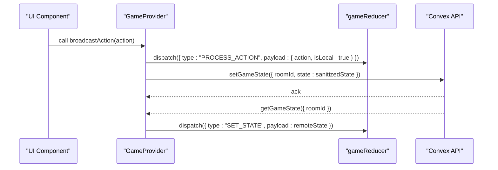
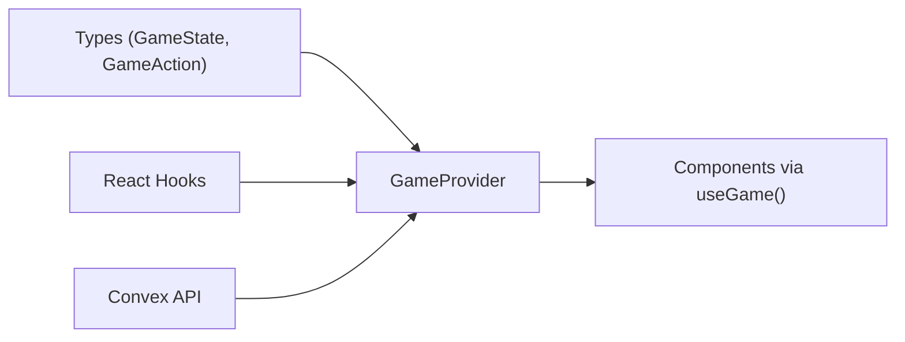

# GameContext Interface

<cite>
**Referenced Files in This Document**
- [GameContext.tsx](file://src/context/GameContext.tsx)
- [index.ts](file://src/types/index.ts)
- [App.tsx](file://src/App.tsx)
- [LobbyScreen.tsx](file://src/components/LobbyScreen.tsx)
- [Gameboard.tsx](file://src/components/Gameboard.tsx)
- [GameActions.tsx](file://src/components/GameActions.tsx)
- [games.ts](file://convex/games.ts)
</cite>

## Table of Contents
1. [Introduction](#introduction)
2. [Project Structure](#project-structure)
3. [Core Components](#core-components)
4. [Architecture Overview](#architecture-overview)
5. [Detailed Component Analysis](#detailed-component-analysis)
6. [Dependency Analysis](#dependency-analysis)
7. [Performance Considerations](#performance-considerations)
8. [Troubleshooting Guide](#troubleshooting-guide)
9. [Conclusion](#conclusion)

## Introduction
This document explains the GameContext interface and its role in the sen-web game state management system. It focuses on the GameContextType contract, how it is implemented and typed, and how components consume it via the useGame hook. It also covers the reducer-driven state model, asynchronous and synchronous operations, TypeScript generics for type safety, and best practices for handling null myPlayerId during initialization and avoiding memory leaks with async functions.

## Project Structure
GameContext is implemented as a React Context provider that encapsulates:
- A reducer-managed GameState
- A myPlayerId state
- Action methods for room creation/joining, starting games, broadcasting actions, sending chat messages, and playing sounds
- Real-time synchronization with a backend via Convex queries and mutations

**Diagram sources**
- [GameContext.tsx](file://src/context/GameContext.tsx#L562-L600)
- [games.ts](file://convex/games.ts#L1-L41)

**Section sources**
- [GameContext.tsx](file://src/context/GameContext.tsx#L1-L45)
- [index.ts](file://src/types/index.ts#L37-L100)

## Core Components
- GameContextType: The contract for the context value, including state, myPlayerId, and action methods.
- GameProvider: Provides the context value and manages state transitions, synchronization, and side effects.
- useGame: Hook that consumers use to access the context.

Key properties of GameContextType:
- state: GameState (fully typed)
- myPlayerId: string | null (nullable until initialized)
- createRoom(playerName): Promise<void>
- joinRoom(roomId, playerName): Promise<void>
- startHotseatGame(playerNames[]): void
- startGame(): Promise<void>
- broadcastAction(action): void
- sendChatMessage(message: string): void
- playSound(sound: SoundType): void

**Section sources**
- [GameContext.tsx](file://src/context/GameContext.tsx#L550-L561)
- [GameContext.tsx](file://src/context/GameContext.tsx#L562-L600)
- [index.ts](file://src/types/index.ts#L37-L100)

## Architecture Overview
The GameContext architecture combines local state management with real-time synchronization:
- Local state is managed by a reducer and a typed GameState.
- Online mode syncs with Convex via queries and mutations.
- Actions are dispatched locally and broadcast to peers; remote updates are merged safely.

**Diagram sources**
- [GameContext.tsx](file://src/context/GameContext.tsx#L789-L834)
- [GameContext.tsx](file://src/context/GameContext.tsx#L883-L953)
- [games.ts](file://convex/games.ts#L1-L41)

## Detailed Component Analysis

### GameContextType Contract
GameContextType defines the shape of the context value exposed to components. It ensures:
- Strong typing for state and action methods
- Nullability for myPlayerId during initialization
- Consistent signatures for async and sync methods

Implementation highlights:
- Initial context value sets state to initialState and myPlayerId to null
- Placeholder functions are provided for type safety before wiring to real logic
- The provider assigns concrete implementations for all methods

**Section sources**
- [GameContext.tsx](file://src/context/GameContext.tsx#L550-L561)
- [GameContext.tsx](file://src/context/GameContext.tsx#L562-L600)

### GameProvider Implementation
Responsibilities:
- Manage local state with useReducer and a typed GameState
- Track myPlayerId and persist it to session storage
- Synchronize with Convex:
  - Subscribe to remote game state and chat messages
  - Sanitize state for online multiplayer privacy
  - Debounced writes to avoid loops and excessive network traffic
- Handle reconnection and presence updates
- Expose action methods to consumers

Asynchronous vs synchronous operations:
- Async methods: createRoom, joinRoom, startGame, sendChatMessage, processAndBroadcastAction
- Sync methods: startHotseatGame, broadcastAction (dispatches locally), playSound

TypeScript generics:
- The context is created with a generic GameContextType to enforce strong typing across the app
- The reducer action union is typed to ensure only valid actions mutate state

Null handling for myPlayerId:
- myPlayerId starts as null and is set after successful room creation or joining
- Many methods guard against null myPlayerId to prevent invalid operations

**Section sources**
- [GameContext.tsx](file://src/context/GameContext.tsx#L562-L600)
- [GameContext.tsx](file://src/context/GameContext.tsx#L789-L834)
- [GameContext.tsx](file://src/context/GameContext.tsx#L883-L953)
- [GameContext.tsx](file://src/context/GameContext.tsx#L955-L1151)

### Reducer and GameState
The reducer handles:
- Setting state from remote or local sources
- Adding chat messages
- Processing game actions and advancing turns
- Ending rounds and games with scoring logic

GameState includes:
- Game mode, room metadata, host, and player arrays
- Draw/discard piles, current player index, and game phase
- Turn count, action messages, chat messages, and auxiliary state for special actions

**Section sources**
- [GameContext.tsx](file://src/context/GameContext.tsx#L47-L85)
- [index.ts](file://src/types/index.ts#L37-L100)

### Backend Integration (Convex)
- getGameState: fetches remote game state for online mode
- setGameState: persists local state to the database
- getMessages: subscribes to chat messages
- updatePresence: keeps track of active players

Sanitization and privacy:
- During peeking, the provider merges local peeked cards with remote state to hide opponent peeked cards while preserving local visibility

**Section sources**
- [games.ts](file://convex/games.ts#L1-L41)
- [GameContext.tsx](file://src/context/GameContext.tsx#L602-L637)
- [GameContext.tsx](file://src/context/GameContext.tsx#L842-L881)

### Consumers Using useGame Hook
Components consume the context via useGame to:
- Read state and myPlayerId
- Dispatch actions (createRoom, joinRoom, startGame, broadcastAction, sendChatMessage)
- Play sound effects

Examples from the codebase:
- App reads state to decide which screen to render
- LobbyScreen uses createRoom, joinRoom, startHotseatGame, startGame
- Gameboard reads state and uses broadcastAction and playSound
- GameActions conditionally renders buttons based on state and myPlayerId

**Section sources**
- [App.tsx](file://src/App.tsx#L14-L16)
- [LobbyScreen.tsx](file://src/components/LobbyScreen.tsx#L18-L21)
- [Gameboard.tsx](file://src/components/Gameboard.tsx#L26-L30)
- [GameActions.tsx](file://src/components/GameActions.tsx#L6-L10)

### Type-Safe Action Dispatching
The reducer accepts a discriminated union of actions, ensuring:
- Only valid actions mutate state
- Payloads are strongly typed
- Game logic remains centralized and predictable

**Section sources**
- [GameContext.tsx](file://src/context/GameContext.tsx#L19-L27)
- [index.ts](file://src/types/index.ts#L81-L100)

### Asynchronous Operations and Callbacks
- Async methods (createRoom, joinRoom, startGame, sendChatMessage) perform network operations and update state accordingly
- processAndBroadcastAction is a useCallback wrapper that plays sounds and dispatches locally
- sendChatMessage adds a local message before attempting to persist remotely

Callback typing:
- All callbacks are wrapped with useCallback to stabilize references and avoid unnecessary re-renders
- Methods accept typed payloads (e.g., GameAction) and return void or Promise<void>

**Section sources**
- [GameContext.tsx](file://src/context/GameContext.tsx#L789-L834)
- [GameContext.tsx](file://src/context/GameContext.tsx#L924-L953)
- [GameContext.tsx](file://src/context/GameContext.tsx#L1061-L1097)

### Handling myPlayerId Initialization
- myPlayerId is null initially and becomes available after room creation or joining
- Consumers should guard operations that require myPlayerId (e.g., sending chat messages)
- The provider persists myPlayerId to session storage for reconnection

Common pitfalls:
- Calling sendChatMessage before myPlayerId is set
- Assuming myPlayerId is always present in lobby screens

**Section sources**
- [GameContext.tsx](file://src/context/GameContext.tsx#L562-L600)
- [GameContext.tsx](file://src/context/GameContext.tsx#L924-L953)
- [GameContext.tsx](file://src/context/GameContext.tsx#L789-L834)

### Memory Leaks and Async Cleanup
- The provider uses refs to track last synced state and timeouts to debounce updates
- Effects clean up intervals and timeouts to prevent leaks
- Debouncing avoids rapid repeated writes to Convex

Best practices:
- Always clear timeouts and intervals in effect cleanup
- Avoid adding state to effect dependencies if it causes loops
- Use refs to capture current state when needed inside effects

**Section sources**
- [GameContext.tsx](file://src/context/GameContext.tsx#L574-L586)
- [GameContext.tsx](file://src/context/GameContext.tsx#L789-L834)
- [GameContext.tsx](file://src/context/GameContext.tsx#L883-L953)

## Dependency Analysis
The GameContext depends on:
- Types: GameState, Player, Card, ChatMessage, GameAction
- Hooks: useReducer, useState, useEffect, useCallback, useRef, useContext
- Convex: queries and mutations for online synchronization
- Utilities: game logic helpers and sound effects

**Diagram sources**
- [GameContext.tsx](file://src/context/GameContext.tsx#L1-L45)
- [index.ts](file://src/types/index.ts#L37-L100)
- [games.ts](file://convex/games.ts#L1-L41)

**Section sources**
- [GameContext.tsx](file://src/context/GameContext.tsx#L1-L45)
- [index.ts](file://src/types/index.ts#L37-L100)
- [games.ts](file://convex/games.ts#L1-L41)

## Performance Considerations
- Debounce remote writes to reduce network load and avoid sync loops
- Sanitize state before syncing to minimize payload size and protect privacy
- Use useCallback for action handlers to prevent unnecessary re-renders
- Avoid adding state to effect dependencies unnecessarily; use refs instead

[No sources needed since this section provides general guidance]

## Troubleshooting Guide
Common issues and resolutions:
- myPlayerId is null: Ensure room creation or joining has completed before invoking actions that require myPlayerId
- No remote updates: Verify online mode and that roomId is set; check presence and reconnection logic
- Chat not appearing: Confirm sendChatMessage is invoked with valid state and that remote messages are subscribed
- Stale state after reconnection: The provider clears state and resets when a player leaves; ensure session storage is cleared on failure

**Section sources**
- [GameContext.tsx](file://src/context/GameContext.tsx#L789-L834)
- [GameContext.tsx](file://src/context/GameContext.tsx#L924-L953)
- [GameContext.tsx](file://src/context/GameContext.tsx#L602-L637)

## Conclusion
GameContextType provides a robust, type-safe contract for managing the entire game state lifecycle. Through a reducer-driven model, strict typing, and careful synchronization with Convex, it enables reliable multiplayer gameplay and a responsive UI. Components consume the context via useGame to access state and actions uniformly, while the provider safeguards against race conditions, memory leaks, and privacy issues.