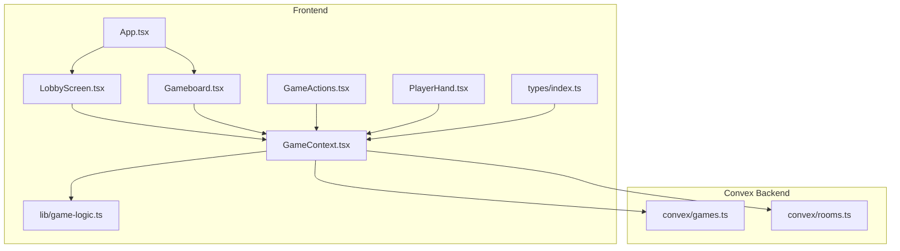
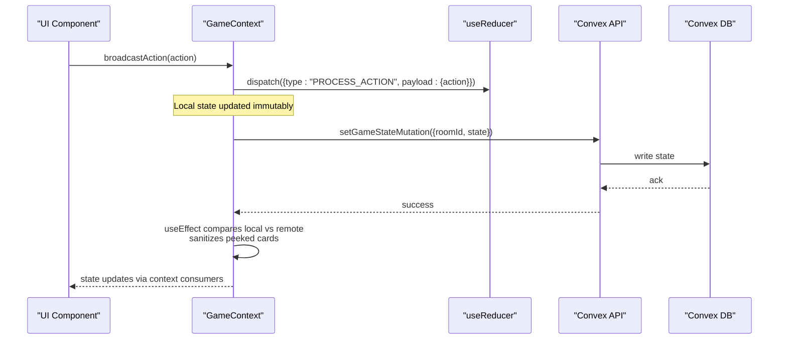
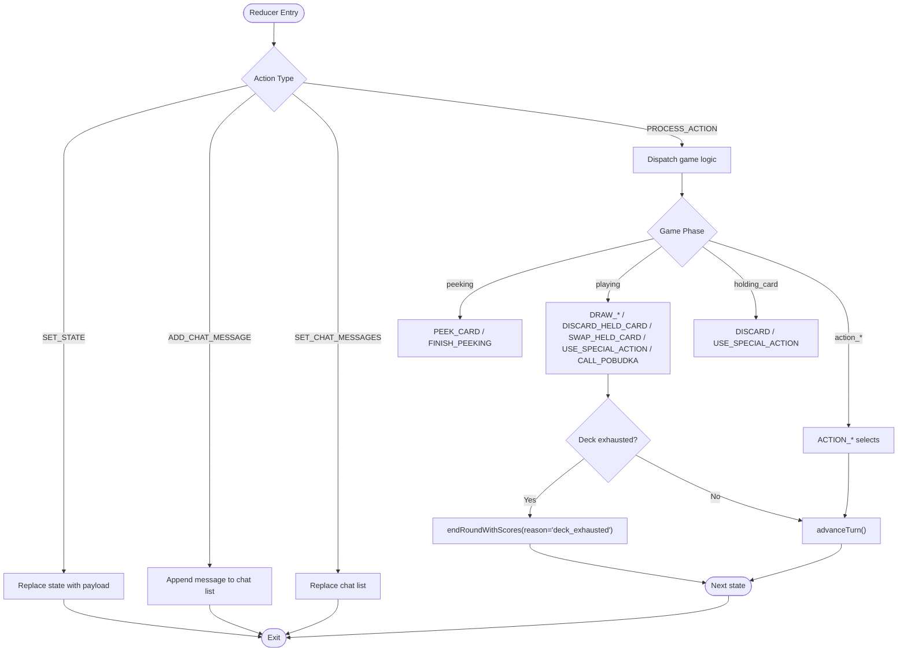
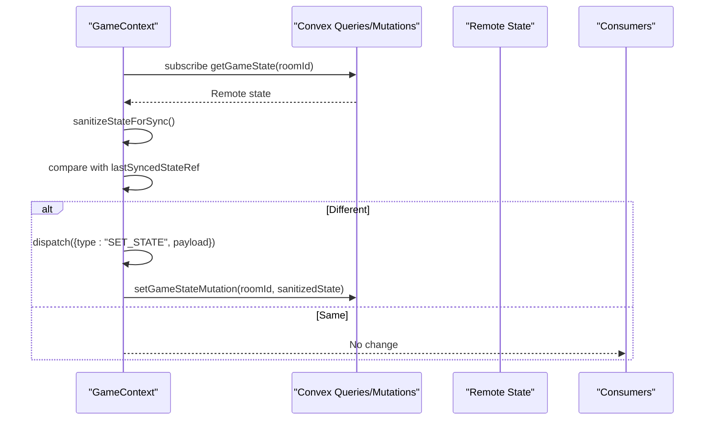
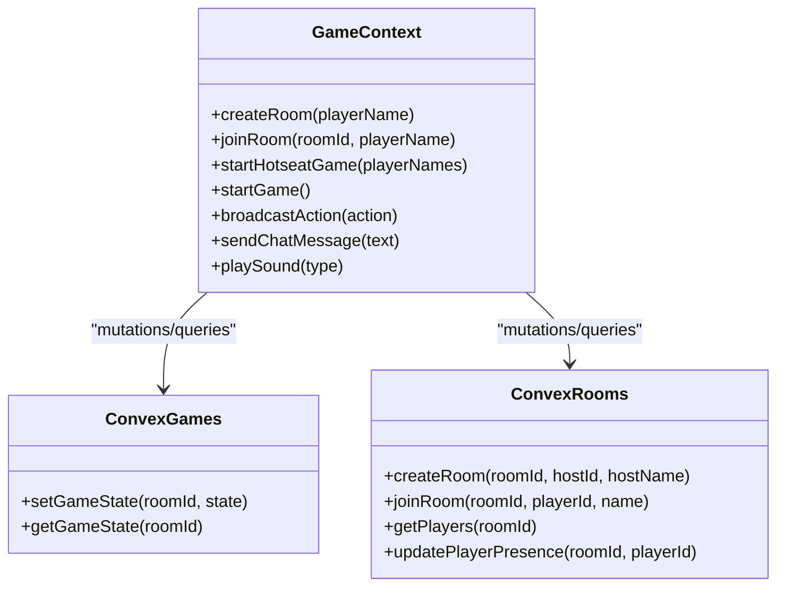
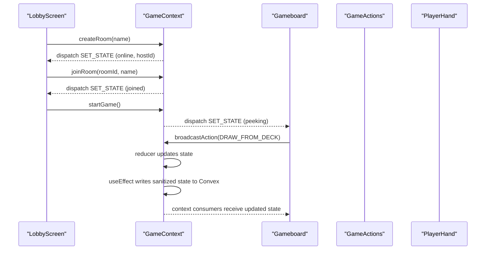
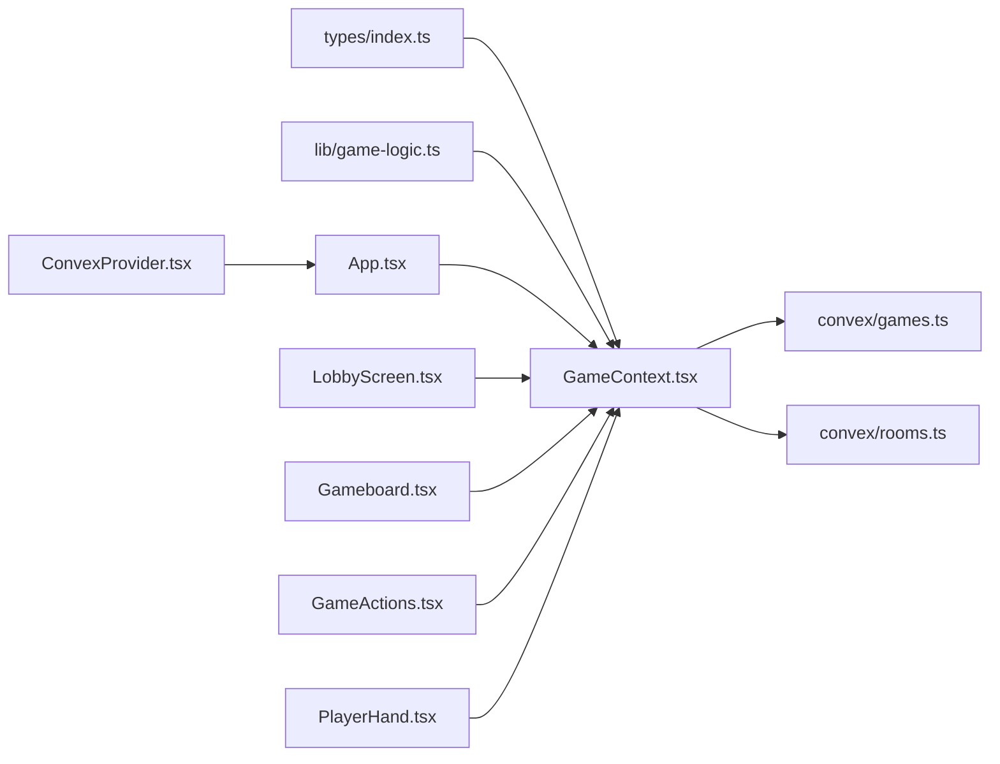

# State Management

<cite>
**Referenced Files in This Document**
- [GameContext.tsx](file://src/context/GameContext.tsx)
- [types/index.ts](file://src/types/index.ts)
- [games.ts](file://convex/games.ts)
- [rooms.ts](file://convex/rooms.ts)
- [App.tsx](file://src/App.tsx)
- [ConvexProvider.tsx](file://src/ConvexProvider.tsx)
- [LobbyScreen.tsx](file://src/components/LobbyScreen.tsx)
- [Gameboard.tsx](file://src/components/Gameboard.tsx)
- [GameActions.tsx](file://src/components/GameActions.tsx)
- [PlayerHand.tsx](file://src/components/PlayerHand.tsx)
- [game-logic.ts](file://src/lib/game-logic.ts)
</cite>

## Table of Contents
1. [Introduction](#introduction)
2. [Project Structure](#project-structure)
3. [Core Components](#core-components)
4. [Architecture Overview](#architecture-overview)
5. [Detailed Component Analysis](#detailed-component-analysis)
6. [Dependency Analysis](#dependency-analysis)
7. [Performance Considerations](#performance-considerations)
8. [Troubleshooting Guide](#troubleshooting-guide)
9. [Conclusion](#conclusion)

## Introduction
This document explains the state management system in sen-web, centered on React’s Context API and useReducer pattern. The GameContext orchestrates global game state, including players, cards, phases, and room information. It uses a reducer to enforce predictable, immutable state transitions and integrates with Convex backend mutations to synchronize state across clients. Functions exposed by the context enable creating/joining rooms, starting games, broadcasting actions, and sending chat messages. The document also covers frontend-backend synchronization, common pitfalls, and optimization strategies.

## Project Structure
The state management spans frontend context and backend Convex modules:
- Frontend context and types define the GameState model, GameAction union, and the reducer logic.
- Convex mutations and queries persist and stream the game state and room/player presence.
- UI components consume the context to render and trigger state changes.

**Diagram sources**
- [GameContext.tsx](file://src/context/GameContext.tsx#L562-L600)
- [types/index.ts](file://src/types/index.ts#L37-L100)
- [games.ts](file://convex/games.ts#L1-L43)
- [rooms.ts](file://convex/rooms.ts#L1-L119)
- [App.tsx](file://src/App.tsx#L1-L80)
- [LobbyScreen.tsx](file://src/components/LobbyScreen.tsx#L1-L413)
- [Gameboard.tsx](file://src/components/Gameboard.tsx#L1-L355)
- [GameActions.tsx](file://src/components/GameActions.tsx#L1-L109)
- [PlayerHand.tsx](file://src/components/PlayerHand.tsx#L1-L277)
- [game-logic.ts](file://src/lib/game-logic.ts#L1-L63)

**Section sources**
- [GameContext.tsx](file://src/context/GameContext.tsx#L562-L600)
- [types/index.ts](file://src/types/index.ts#L37-L100)
- [games.ts](file://convex/games.ts#L1-L43)
- [rooms.ts](file://convex/rooms.ts#L1-L119)
- [App.tsx](file://src/App.tsx#L1-L80)

## Core Components
- GameContext and useGame: Provide a global state container and a hook to consume it. The provider initializes state, wires up reducers, and manages side effects.
- useReducer pattern: A reducer handles immutable state updates via typed actions, encapsulating game logic transitions.
- GameState and GameAction types: Strongly typed models for game state, phases, and actions.
- Convex integration: Mutations and queries synchronize state across clients and persist room/player presence.

Key responsibilities:
- Initialization and lifecycle: createRoom, joinRoom, startGame, startHotseatGame.
- Action broadcasting: broadcastAction triggers local reducer updates and backend synchronization.
- Synchronization: useEffect subscribers reconcile remote state and chat messages, sanitize peeked cards, and debounce writes.
- Presence and reconnection: periodic presence updates and session-based reconnection.

**Section sources**
- [GameContext.tsx](file://src/context/GameContext.tsx#L562-L600)
- [types/index.ts](file://src/types/index.ts#L37-L100)

## Architecture Overview
The system follows a predictable flow:
- UI components call GameContext functions (e.g., broadcastAction).
- The context dispatches reducer actions locally.
- A debounced effect compares local vs remote state and sanitizes sensitive peeked cards before writing to Convex.
- Convex queries stream remote state and chat messages back to the UI.
- Presence updates keep player lists accurate and detect disconnections.

**Diagram sources**
- [GameContext.tsx](file://src/context/GameContext.tsx#L883-L922)
- [games.ts](file://convex/games.ts#L1-L43)

## Detailed Component Analysis

### GameContext Provider and Reducer
- Initial state: Defines default gameMode, room identifiers, hostId, players, piles, current player index, gamePhase, actionMessage, turnCount, chatMessages, drawSource, lastCallerId, lastMove, and optional round/game winners.
- Reducer actions:
  - SET_STATE: Replace state with a new GameState snapshot.
  - ADD_CHAT_MESSAGE and SET_CHAT_MESSAGES: Manage chat history.
  - PROCESS_ACTION: Implements game logic transitions, including peeking, drawing, discarding, swapping, special actions, and round/game end conditions.
- Game logic:
  - endRoundWithScores computes scores, penalties, and determines round/game winners.
  - advanceTurn advances the turn counter and resets temporary state.
  - Special actions: peek_1, swap_2, take_2 are modeled with dedicated phases and state fields.
- Sanitization:
  - sanitizeStateForSync hides temporarily peeked cards from opponents during peeking.
  - Remote state merging preserves local peeked cards for the current player.

**Diagram sources**
- [GameContext.tsx](file://src/context/GameContext.tsx#L47-L548)

**Section sources**
- [GameContext.tsx](file://src/context/GameContext.tsx#L28-L174)
- [GameContext.tsx](file://src/context/GameContext.tsx#L176-L548)
- [types/index.ts](file://src/types/index.ts#L37-L100)

### Context Initialization and Side Effects
- Initialization:
  - createRoom sets gameMode to online, assigns hostId, initializes players, and persists to Convex.
  - joinRoom stores session identifiers, initializes local state, and waits for remote sync.
  - startHotseatGame initializes a hotseat game with multiple AI/local players.
- Synchronization:
  - useEffect subscribes to remote game state and chat messages via Convex queries.
  - Remote state is sanitized and merged to preserve local peeked cards for the current player.
  - Debounced setGameStateMutation writes local changes to Convex only when needed.
- Presence and reconnection:
  - Periodic updatePlayerPresence keeps player presence fresh.
  - Reconnection loads session data and re-joins the room.

**Diagram sources**
- [GameContext.tsx](file://src/context/GameContext.tsx#L616-L682)
- [GameContext.tsx](file://src/context/GameContext.tsx#L883-L922)
- [games.ts](file://convex/games.ts#L1-L43)

**Section sources**
- [GameContext.tsx](file://src/context/GameContext.tsx#L883-L922)
- [GameContext.tsx](file://src/context/GameContext.tsx#L616-L682)
- [rooms.ts](file://convex/rooms.ts#L1-L119)

### Backend Integration: Convex Mutations and Queries
- Games:
  - setGameState persists or updates the game state for a room.
  - getGameState retrieves the current state for subscription.
- Rooms:
  - createRoom creates a room and adds the host as a player.
  - joinRoom adds or refreshes a player’s presence and updates room timestamps.
  - getPlayers returns active players for lobby UI and presence checks.
  - updatePlayerPresence refreshes lastSeenAt for heartbeat.

**Diagram sources**
- [GameContext.tsx](file://src/context/GameContext.tsx#L955-L1151)
- [games.ts](file://convex/games.ts#L1-L43)
- [rooms.ts](file://convex/rooms.ts#L1-L119)

**Section sources**
- [games.ts](file://convex/games.ts#L1-L43)
- [rooms.ts](file://convex/rooms.ts#L1-L119)

### UI Integration and Usage Patterns
- App renders different screens based on gamePhase.
- LobbyScreen drives room creation/joining and starts online games.
- Gameboard displays piles, hands, and action panels; it consumes broadcastAction from the context.
- GameActions and PlayerHand translate user interactions into GameAction payloads.

**Diagram sources**
- [App.tsx](file://src/App.tsx#L1-L80)
- [LobbyScreen.tsx](file://src/components/LobbyScreen.tsx#L1-L413)
- [Gameboard.tsx](file://src/components/Gameboard.tsx#L1-L355)
- [GameActions.tsx](file://src/components/GameActions.tsx#L1-L109)
- [PlayerHand.tsx](file://src/components/PlayerHand.tsx#L1-L277)
- [GameContext.tsx](file://src/context/GameContext.tsx#L955-L1151)

**Section sources**
- [App.tsx](file://src/App.tsx#L1-L80)
- [LobbyScreen.tsx](file://src/components/LobbyScreen.tsx#L1-L413)
- [Gameboard.tsx](file://src/components/Gameboard.tsx#L1-L355)
- [GameActions.tsx](file://src/components/GameActions.tsx#L1-L109)
- [PlayerHand.tsx](file://src/components/PlayerHand.tsx#L1-L277)

## Dependency Analysis
- Internal dependencies:
  - GameContext depends on types for GameState and GameAction, on game-logic for deck creation/shuffling, and on Convex APIs for mutations and queries.
  - UI components depend on GameContext for state and actions.
- External dependencies:
  - ConvexProvider wraps the app to enable Convex hooks.
  - i18n and sound hooks influence UX feedback.

**Diagram sources**
- [GameContext.tsx](file://src/context/GameContext.tsx#L562-L600)
- [types/index.ts](file://src/types/index.ts#L37-L100)
- [game-logic.ts](file://src/lib/game-logic.ts#L1-L63)
- [games.ts](file://convex/games.ts#L1-L43)
- [rooms.ts](file://convex/rooms.ts#L1-L119)
- [App.tsx](file://src/App.tsx#L1-L80)
- [ConvexProvider.tsx](file://src/ConvexProvider.tsx#L1-L18)

**Section sources**
- [GameContext.tsx](file://src/context/GameContext.tsx#L562-L600)
- [ConvexProvider.tsx](file://src/ConvexProvider.tsx#L1-L18)

## Performance Considerations
- Minimize context re-renders:
  - Memoize the context value object to avoid recreating it on every render. The provider constructs a stable object with functions bound via useCallback where appropriate.
  - Avoid passing large or frequently changing objects inside state; keep state flat and minimal.
- Debounce and deduplicate writes:
  - The sync effect compares local, remote, and last-synced states before writing to Convex, preventing redundant writes.
- Selective re-renders:
  - Split UI into smaller components and only subscribe to the parts of state they need via selectors or derived state.
- Immutable updates:
  - The reducer returns new objects and arrays, preventing accidental shared-state bugs.
- Avoid unnecessary object creation:
  - Use refs for current state snapshots and callbacks for event handlers to reduce prop churn.
- Debugging:
  - Use React DevTools Profiler to identify expensive renders.
  - Inspect Convex queries/mutations timing and network logs.

[No sources needed since this section provides general guidance]

## Troubleshooting Guide
Common issues and resolutions:
- Context re-renders:
  - Symptom: Components re-render excessively.
  - Fix: Ensure the context value is stable and not recreated on each render; memoize callbacks and split state into smaller slices.
- Asynchronous operations within context:
  - Symptom: Race conditions or stale state after async calls.
  - Fix: Use refs for current state and sanitize state before syncing; rely on useEffect to reconcile remote state.
- Sanitization of peeked cards:
  - Symptom: Opponents see temporarily peeked cards.
  - Fix: sanitizeStateForSync hides peeked cards during peeking; merge local peeked cards back into remote state for the current player.
- Backend synchronization loops:
  - Symptom: Infinite loops updating state.
  - Fix: Compare serialized states and skip if unchanged; avoid dispatching when remote equals local.
- Presence and disconnection:
  - Symptom: Players appear missing or game resets unexpectedly.
  - Fix: Presence updates and long-timer checks detect leaving; reconnection logic restores session and rejoins the room.

**Section sources**
- [GameContext.tsx](file://src/context/GameContext.tsx#L616-L682)
- [GameContext.tsx](file://src/context/GameContext.tsx#L883-L922)
- [rooms.ts](file://convex/rooms.ts#L1-L119)

## Conclusion
The state management system in sen-web combines React Context and useReducer to provide a robust, predictable, and scalable foundation for managing global game state. By integrating with Convex, it achieves real-time synchronization across clients while preserving privacy of temporarily peeked cards. The design emphasizes immutability, debounced writes, and careful reconciliation of remote state, resulting in a responsive and resilient gaming experience. Following the optimization and troubleshooting recommendations will help maintain performance and reliability as the application evolves.