# Action Processing

<cite>
**Referenced Files in This Document**
- [GameContext.tsx](file://src/context/GameContext.tsx)
- [types/index.ts](file://src/types/index.ts)
- [game-logic.ts](file://src/lib/game-logic.ts)
- [GameActions.tsx](file://src/components/GameActions.tsx)
- [PlayerHand.tsx](file://src/components/PlayerHand.tsx)
- [ActionModal.tsx](file://src/components/ActionModal.tsx)
</cite>

## Table of Contents
1. [Introduction](#introduction)
2. [Project Structure](#project-structure)
3. [Core Components](#core-components)
4. [Architecture Overview](#architecture-overview)
5. [Detailed Component Analysis](#detailed-component-analysis)
6. [Dependency Analysis](#dependency-analysis)
7. [Performance Considerations](#performance-considerations)
8. [Troubleshooting Guide](#troubleshooting-guide)
9. [Conclusion](#conclusion)

## Introduction
This document explains the action processing mechanism inside the gameReducer function, focusing on how the reducer interprets and applies each action type defined in the GameAction union. It covers validation checks, state transitions, immutability enforcement, and edge-case handling such as empty draw piles and invalid moves. It also provides guidance on extending the reducer safely with new action types while preserving type safety and consistency.

## Project Structure
The action processing lives in the GameContext’s reducer, with UI components dispatching typed actions that the reducer validates and transforms into immutable state updates. Supporting logic for deck creation and shuffling resides in a dedicated module.

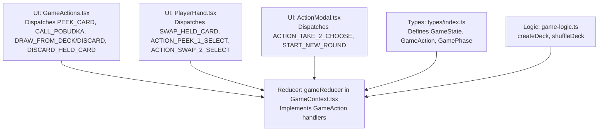

**Diagram sources**
- [GameContext.tsx](file://src/context/GameContext.tsx#L47-L548)
- [types/index.ts](file://src/types/index.ts#L81-L100)
- [game-logic.ts](file://src/lib/game-logic.ts#L1-L63)
- [GameActions.tsx](file://src/components/GameActions.tsx#L1-L109)
- [PlayerHand.tsx](file://src/components/PlayerHand.tsx#L83-L131)
- [ActionModal.tsx](file://src/components/ActionModal.tsx#L1-L153)

**Section sources**
- [GameContext.tsx](file://src/context/GameContext.tsx#L47-L548)
- [types/index.ts](file://src/types/index.ts#L37-L100)
- [game-logic.ts](file://src/lib/game-logic.ts#L1-L63)
- [GameActions.tsx](file://src/components/GameActions.tsx#L1-L109)
- [PlayerHand.tsx](file://src/components/PlayerHand.tsx#L83-L131)
- [ActionModal.tsx](file://src/components/ActionModal.tsx#L1-L153)

## Core Components
- gameReducer: Central reducer that accepts a typed action and returns a new GameState. It enforces game-phase validation, performs immutable updates, and advances turns or ends rounds when appropriate.
- GameAction union: Defines all valid actions, including PEEK_CARD, DRAW_FROM_DECK, DRAW_FROM_DISCARD, DISCARD_HELD_CARD, SWAP_HELD_CARD, USE_SPECIAL_ACTION, ACTION_PEEK_1_SELECT, ACTION_SWAP_2_SELECT, ACTION_TAKE_2_CHOOSE, CALL_POBUDKA, and START_NEW_ROUND.
- GameState: Encapsulates the entire game state, including draw/discard piles, players, current player index, game phase, and auxiliary fields for special actions and round scoring.
- UI dispatchers: Components translate user interactions into typed actions and dispatch them to the reducer.

Key responsibilities:
- Validate game phase and preconditions before applying state changes.
- Maintain immutability by cloning arrays and objects before mutation.
- Manage special actions and multi-step flows (e.g., swap_2 selection, take_2 choice).
- Gracefully handle edge cases like empty draw piles and invalid moves.

**Section sources**
- [GameContext.tsx](file://src/context/GameContext.tsx#L47-L548)
- [types/index.ts](file://src/types/index.ts#L37-L100)

## Architecture Overview
The reducer is invoked by dispatching a typed action. The reducer branches on action.type and applies immutable transformations. Some actions trigger immediate state changes; others transition the game into a special phase requiring subsequent user input.

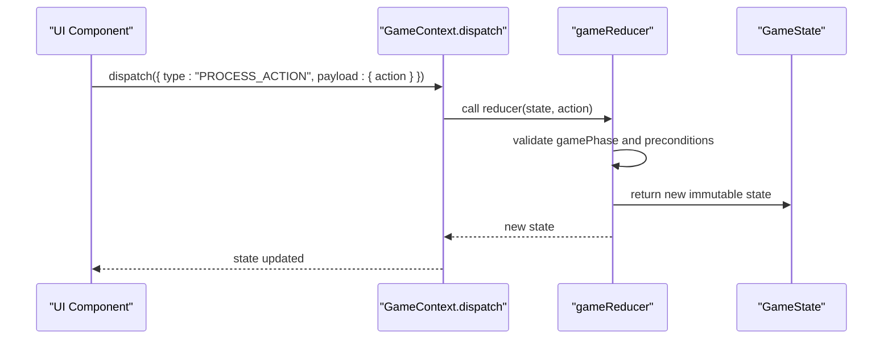

**Diagram sources**
- [GameContext.tsx](file://src/context/GameContext.tsx#L818-L840)
- [GameContext.tsx](file://src/context/GameContext.tsx#L47-L548)

## Detailed Component Analysis

### PEEK_CARD
Purpose: Allows the current peeking player to reveal up to two cards from their hand during the peeking phase.

Validation checks:
- gamePhase must be "peeking".
- peekingState must exist.
- peekedCount must be less than 2.
- The targeted player must be the current peeker.
- The selected card must not already be face-up.

Processing logic:
- Clone players and the current player’s hand.
- Flip the selected card face-up and mark it peeked.
- Increment peekedCount in peekingState.

Immutability:
- Players array is cloned.
- Player object is cloned.
- Hand array is cloned.
- Individual card object is cloned and updated.

Edge cases:
- If the action is invalid, the reducer returns the original state unchanged.

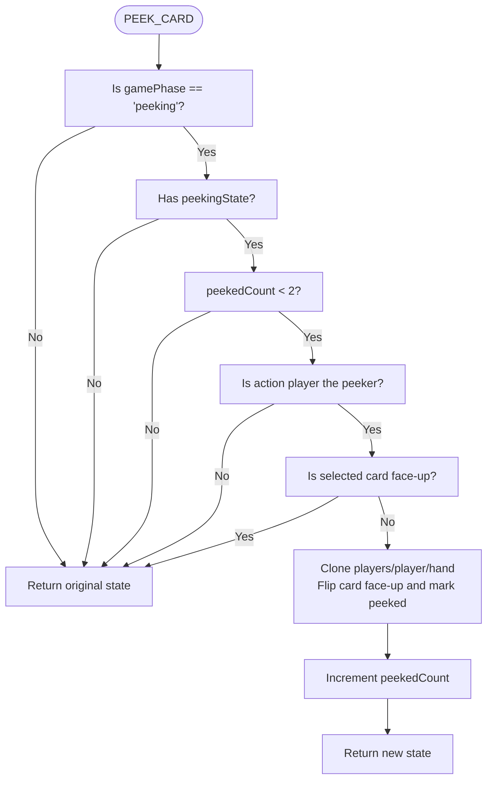

**Diagram sources**
- [GameContext.tsx](file://src/context/GameContext.tsx#L176-L207)

**Section sources**
- [GameContext.tsx](file://src/context/GameContext.tsx#L176-L207)
- [PlayerHand.tsx](file://src/components/PlayerHand.tsx#L83-L91)

### FINISH_PEEKING
Purpose: Concludes the peeking phase for the current player and advances to the next player or ends peeking.

Validation checks:
- gamePhase must be "peeking".
- peekingState must exist.

Processing logic:
- Reset all cards in the current player’s hand to face-down.
- Advance to the next player index.
- If the next player wraps back to the starting index, end peeking and set gamePhase to "playing".
- Otherwise, continue peeking for the next player.

Immutability:
- Clone players array and the current player’s hand.
- Update peekingState or clear it.

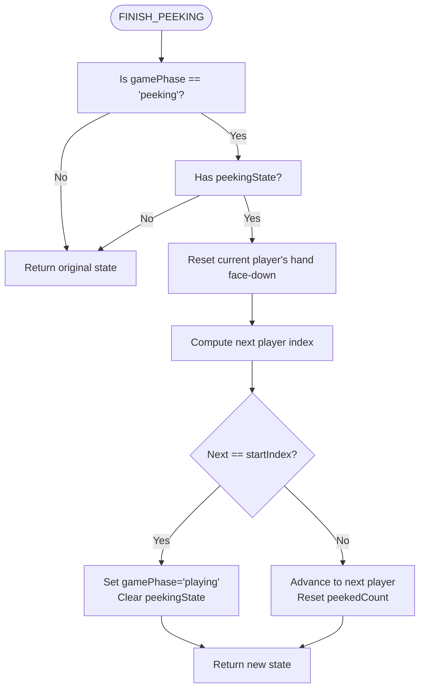

**Diagram sources**
- [GameContext.tsx](file://src/context/GameContext.tsx#L208-L254)

**Section sources**
- [GameContext.tsx](file://src/context/GameContext.tsx#L208-L254)
- [GameActions.tsx](file://src/components/GameActions.tsx#L27-L31)

### DRAW_FROM_DECK
Purpose: Draw a card from the draw pile when the current player’s phase is "playing".

Validation checks:
- gamePhase must be "playing".
- Ensure draw pile is not empty.

Processing logic:
- Pop a card from the draw pile.
- If the draw pile is empty, end the round immediately (no POBUDKA penalty).
- Otherwise, set drawnCard, drawSource to "deck", gamePhase to "holding_card", and record lastMove.

Immutability:
- Clone draw pile.
- Set drawnCard and drawSource.
- Advance to "holding_card" phase.

Edge cases:
- Empty draw pile triggers immediate round end via endRoundWithScores.

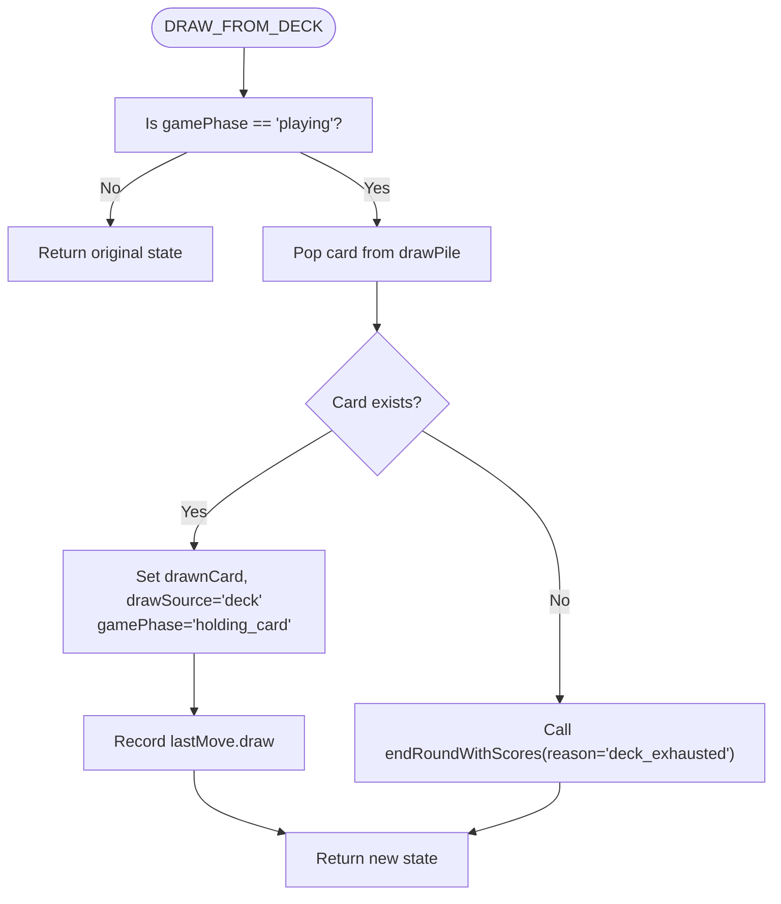

**Diagram sources**
- [GameContext.tsx](file://src/context/GameContext.tsx#L255-L279)

**Section sources**
- [GameContext.tsx](file://src/context/GameContext.tsx#L255-L279)

### DRAW_FROM_DISCARD
Purpose: Draw the top discard card when the current player’s phase is "playing" and the discard pile is not empty.

Validation checks:
- gamePhase must be "playing".
- Discard pile must not be empty.

Processing logic:
- Pop the top card from the discard pile.
- Set drawnCard, drawSource to "discard", gamePhase to "holding_card", and record lastMove.
- Enforce mandatory swap behavior when discarding from the discard pile.

Immutability:
- Clone discard pile.
- Set drawnCard and drawSource.
- Advance to "holding_card" phase.

Edge cases:
- If the discard pile is empty, the action is ignored.

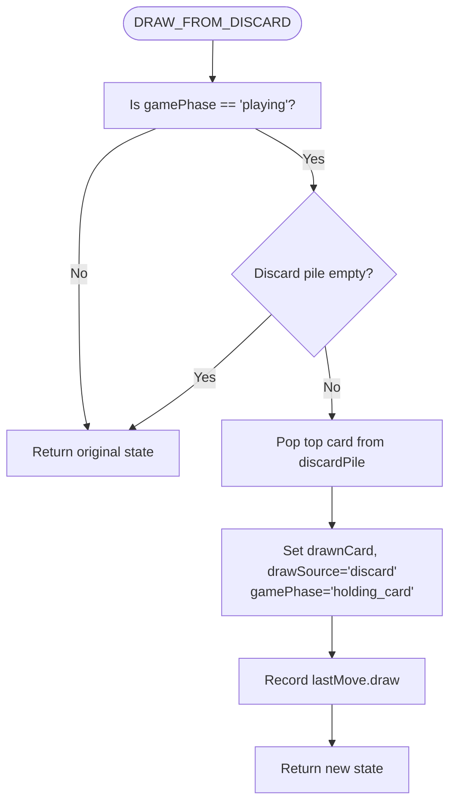

**Diagram sources**
- [GameContext.tsx](file://src/context/GameContext.tsx#L281-L299)

**Section sources**
- [GameContext.tsx](file://src/context/GameContext.tsx#L281-L299)

### DISCARD_HELD_CARD
Purpose: Discard the currently held card when the game phase is "holding_card".

Validation checks:
- gamePhase must be "holding_card".
- drawnCard must exist.

Processing logic:
- Append drawnCard to the discard pile.
- Advance the turn using the internal advanceTurn helper.

Immutability:
- Clone discard pile and append drawnCard.
- Use advanceTurn to rotate to next player and reset temporary fields.

Edge cases:
- If drawnCard is missing, the action is ignored.

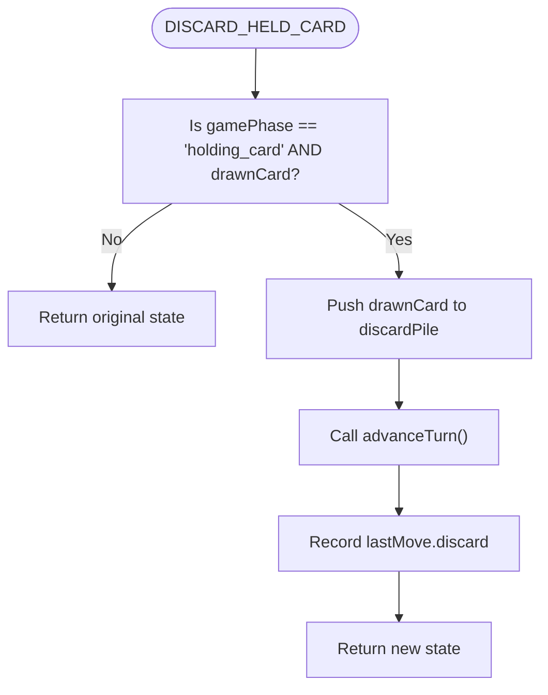

**Diagram sources**
- [GameContext.tsx](file://src/context/GameContext.tsx#L301-L316)

**Section sources**
- [GameContext.tsx](file://src/context/GameContext.tsx#L301-L316)

### SWAP_HELD_CARD
Purpose: Replace a card in the current player’s hand with the drawn card when the game phase is "holding_card".

Validation checks:
- gamePhase must be "holding_card".
- drawnCard must exist.
- The selected card index must be valid.

Processing logic:
- Capture the card to be swapped out.
- Replace the selected hand card with drawnCard (face down, not peeked).
- Append the old card to the discard pile.
- Advance the turn and record lastMove.swap with source information.

Immutability:
- Clone players array, current player, and hand.
- Update hand element and replace the old card in discard pile.

Edge cases:
- If drawnCard is missing, the action is ignored.

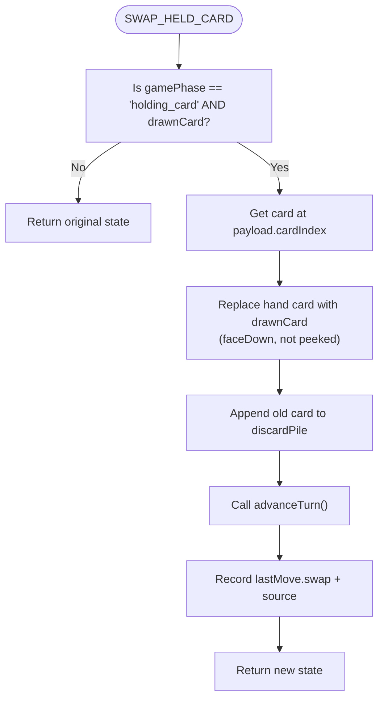

**Diagram sources**
- [GameContext.tsx](file://src/context/GameContext.tsx#L317-L351)

**Section sources**
- [GameContext.tsx](file://src/context/GameContext.tsx#L317-L351)
- [PlayerHand.tsx](file://src/components/PlayerHand.tsx#L93-L97)

### USE_SPECIAL_ACTION
Purpose: Use a special action from a drawn card when the game phase is "holding_card", the drawn card is special, and it was drawn from the deck.

Validation checks:
- gamePhase must be "holding_card".
- drawnCard must be special.
- drawSource must be "deck".

Processing logic:
- Move drawnCard to the discard pile.
- Branch by specialAction:
  - peek_1: Transition to "action_peek_1" phase.
  - swap_2: Transition to "action_swap_2_select_1" phase.
  - take_2: Draw two additional cards from the deck; if any are available, enter "action_take_2" with tempCards; otherwise, advance turn without taking extra cards.

Immutability:
- Clone discard pile and append drawnCard.
- For take_2, clone draw pile and pop two cards into tempCards.

Edge cases:
- If the deck runs out during take_2, the reducer falls back to advancing the turn without extra cards.

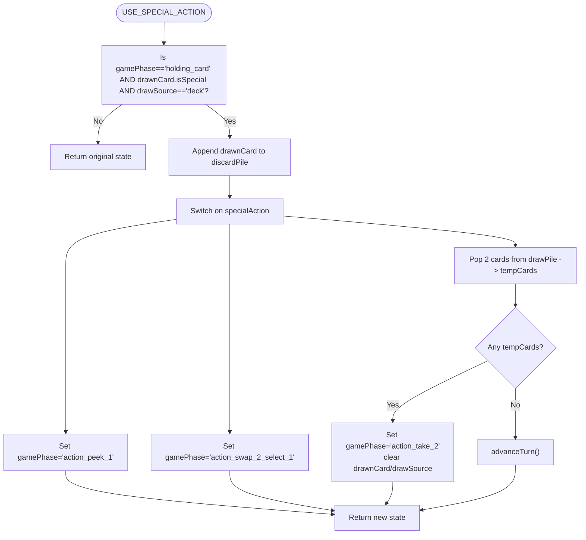

**Diagram sources**
- [GameContext.tsx](file://src/context/GameContext.tsx#L352-L407)

**Section sources**
- [GameContext.tsx](file://src/context/GameContext.tsx#L352-L407)

### ACTION_PEEK_1_SELECT
Purpose: Select a target player and card during the "action_peek_1" phase.

Validation checks:
- gamePhase must be "action_peek_1".

Processing logic:
- Mark the selected card as peeked in the target player’s hand.
- Advance the turn and record lastMove.peek with targetPlayerId.

Immutability:
- Clone players array and update the target hand.

Edge cases:
- If the action is invalid, the reducer returns the original state.

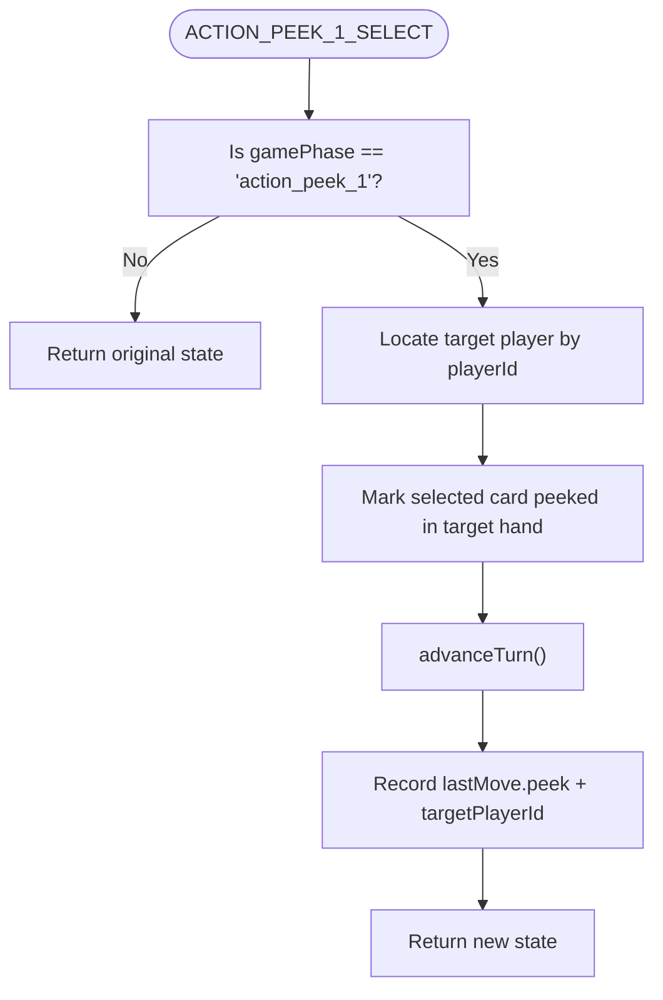

**Diagram sources**
- [GameContext.tsx](file://src/context/GameContext.tsx#L408-L433)

**Section sources**
- [GameContext.tsx](file://src/context/GameContext.tsx#L408-L433)
- [PlayerHand.tsx](file://src/components/PlayerHand.tsx#L99-L117)

### ACTION_SWAP_2_SELECT
Purpose: Perform a two-card mutual swap during the "action_swap_2" phases.

Validation checks:
- First selection: gamePhase is "action_swap_2_select_1".
- Second selection: gamePhase is "action_swap_2_select_2" and swapState exists.

Processing logic:
- First selection: store the first card’s coordinates in swapState and switch to "action_swap_2_select_2".
- Second selection: swap the two cards between players, then advance the turn.

Immutability:
- Clone players array and perform a deep-like copy for swapping cards between hands.

Edge cases:
- If selections are invalid, the reducer returns the original state.

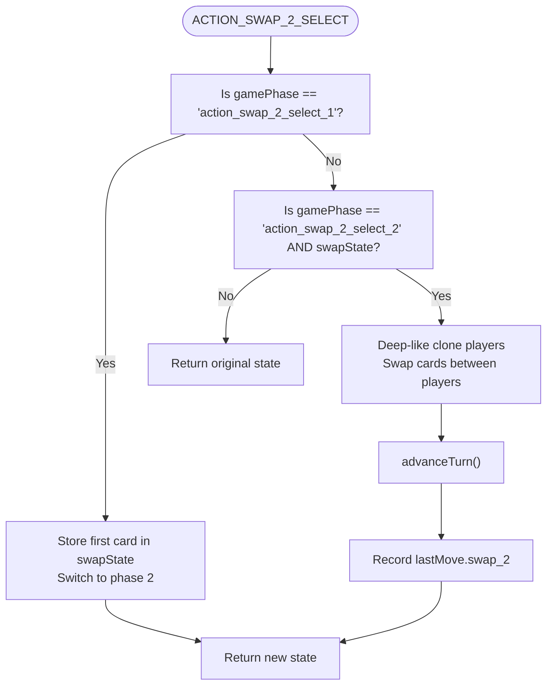

**Diagram sources**
- [GameContext.tsx](file://src/context/GameContext.tsx#L434-L475)

**Section sources**
- [GameContext.tsx](file://src/context/GameContext.tsx#L434-L475)
- [PlayerHand.tsx](file://src/components/PlayerHand.tsx#L119-L130)

### ACTION_TAKE_2_CHOOSE
Purpose: Choose one of the two drawn take_2 cards during the "action_take_2" phase.

Validation checks:
- gamePhase must be "action_take_2".
- tempCards must exist.

Processing logic:
- Remove the chosen card from tempCards and append it to the discard pile.
- Place the chosen card as drawnCard, set drawSource to "deck", and switch back to "holding_card".
- Record lastMove.take_2.

Immutability:
- Clone discard pile and update drawnCard/drawSource.

Edge cases:
- If tempCards is missing, the reducer returns the original state.

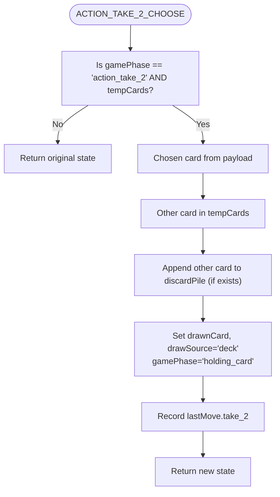

**Diagram sources**
- [GameContext.tsx](file://src/context/GameContext.tsx#L476-L498)

**Section sources**
- [GameContext.tsx](file://src/context/GameContext.tsx#L476-L498)
- [ActionModal.tsx](file://src/components/ActionModal.tsx#L21-L27)

### CALL_POBUDKA
Purpose: End the current round early and compute scores.

Processing logic:
- Delegate to endRoundWithScores with reason "pobudka" and callerId set to the current player.

Immutability:
- The reducer returns a new state computed by endRoundWithScores.

Edge cases:
- No validation beyond ensuring the action is dispatched; the reducer computes round outcomes.

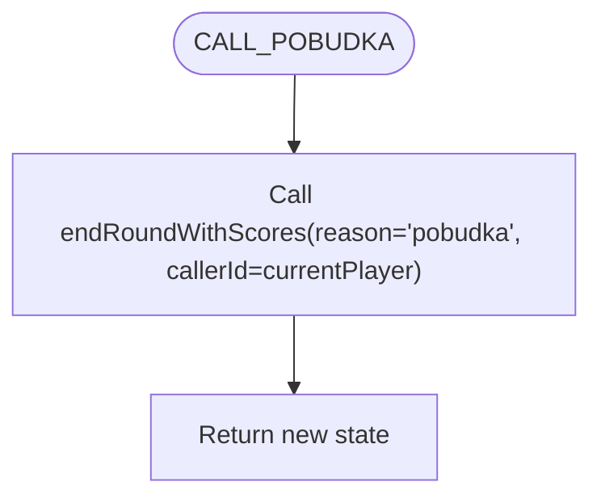

**Diagram sources**
- [GameContext.tsx](file://src/context/GameContext.tsx#L499-L504)

**Section sources**
- [GameContext.tsx](file://src/context/GameContext.tsx#L499-L504)
- [GameActions.tsx](file://src/components/GameActions.tsx#L33-L37)

### START_NEW_ROUND
Purpose: Reset the game for a new round.

Processing logic:
- Create and shuffle a fresh deck.
- Deal four cards to each player face-down.
- Initialize the discard pile with the top card.
- Rotate the starting player to the next player after the last caller.
- Enter "peeking" phase with peekingState initialized.

Immutability:
- Clone initialState and override fields with new values.

Edge cases:
- Handles missing lastCallerId by defaulting to the current player index.

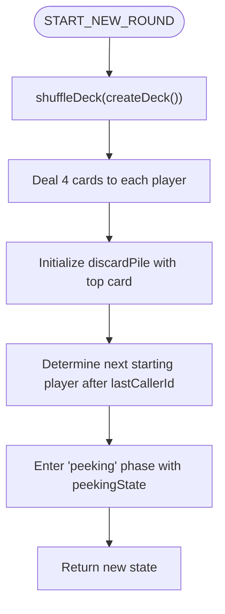

**Diagram sources**
- [GameContext.tsx](file://src/context/GameContext.tsx#L505-L539)

**Section sources**
- [GameContext.tsx](file://src/context/GameContext.tsx#L505-L539)
- [ActionModal.tsx](file://src/components/ActionModal.tsx#L25-L27)
- [game-logic.ts](file://src/lib/game-logic.ts#L1-L63)

## Dependency Analysis
The reducer depends on:
- Types for compile-time safety (GameState, GameAction, GamePhase).
- Utility functions for deck creation and shuffling.
- Internal helpers for turn advancement and round ending.

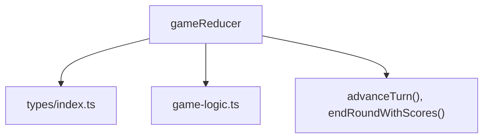

**Diagram sources**
- [GameContext.tsx](file://src/context/GameContext.tsx#L47-L548)
- [types/index.ts](file://src/types/index.ts#L37-L100)
- [game-logic.ts](file://src/lib/game-logic.ts#L1-L63)

**Section sources**
- [GameContext.tsx](file://src/context/GameContext.tsx#L47-L548)
- [types/index.ts](file://src/types/index.ts#L37-L100)
- [game-logic.ts](file://src/lib/game-logic.ts#L1-L63)

## Performance Considerations
- Immutability: The reducer clones arrays and objects before mutation. While simple and safe, frequent cloning can be costly in large hands. Consider:
  - Using structural sharing patterns for large arrays.
  - Avoiding unnecessary deep clones when shallow copies suffice.
- Special actions: Actions like swap_2 involve cloning the entire players array. For large player counts, consider optimizing by updating only the affected players’ hands.
- Round end computations: endRoundWithScores iterates players and hands. For performance, cache derived values (e.g., min score) and avoid repeated recomputation.

[No sources needed since this section provides general guidance]

## Troubleshooting Guide
Common issues and resolutions:
- Attempting an invalid action:
  - The reducer validates gamePhase and preconditions. If invalid, it returns the original state unchanged. Ensure UI components gate actions based on gamePhase and drawSource.
- Empty draw pile:
  - Drawing from deck when the pile is empty triggers immediate round end. Verify that callers handle the resulting round_end or game_over phases.
- Special action misuse:
  - USE_SPECIAL_ACTION requires drawnCard.isSpecial and drawSource == "deck". If these conditions fail, the action is ignored. Confirm that the drawn card meets these criteria before dispatching.
- Swap_2 and peek_1 flows:
  - These require multiple steps. Ensure the UI sequences through the correct phases and that the reducer transitions accordingly.

**Section sources**
- [GameContext.tsx](file://src/context/GameContext.tsx#L255-L279)
- [GameContext.tsx](file://src/context/GameContext.tsx#L352-L407)
- [GameContext.tsx](file://src/context/GameContext.tsx#L434-L475)

## Conclusion
The gameReducer implements a robust, type-safe action processing pipeline that enforces game-phase validation, maintains immutability, and gracefully handles edge cases. By structuring actions around phases and using immutable updates, the reducer preserves state consistency across single-player and online modes. Extending the reducer with new actions should follow the established patterns: validate preconditions, enforce immutability, and integrate cleanly with existing phases and helpers.