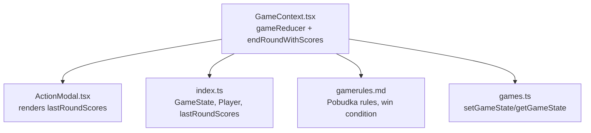
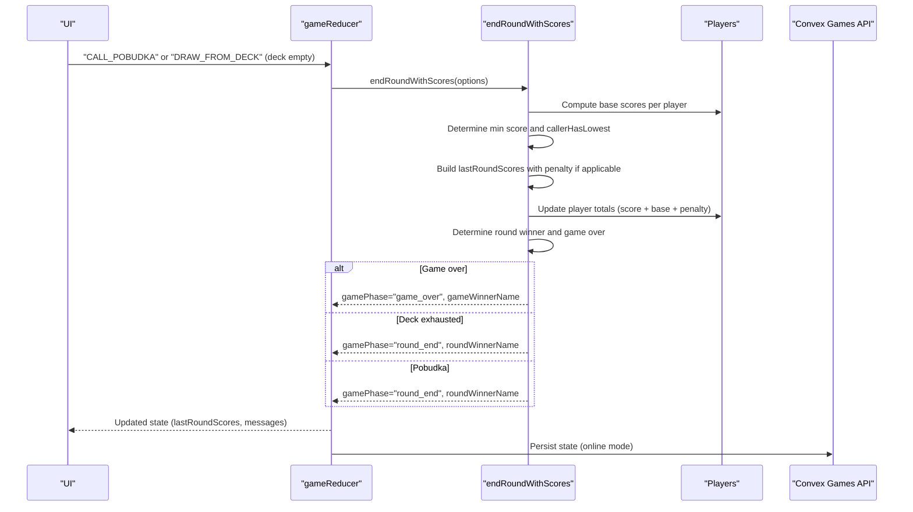
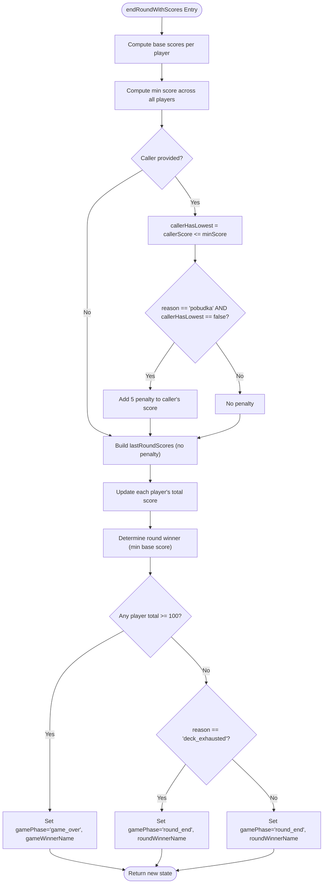
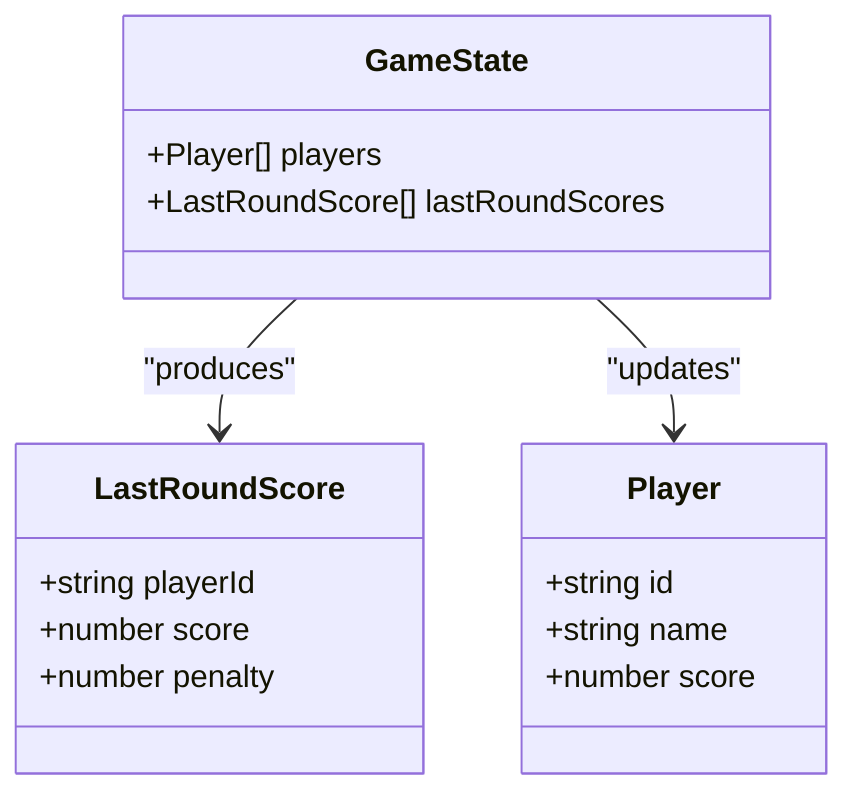
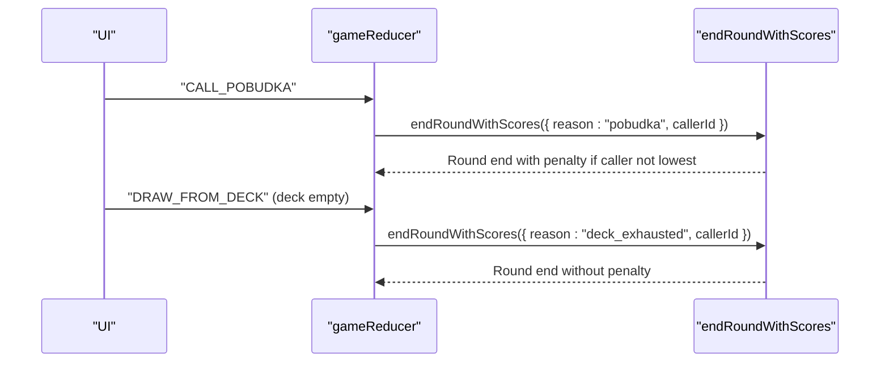
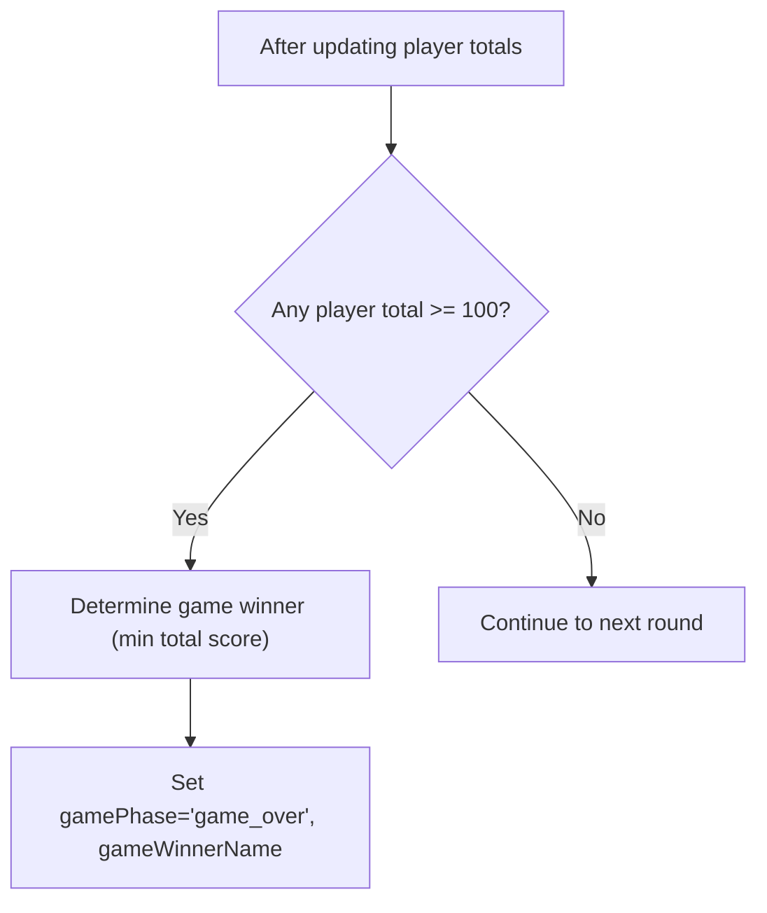
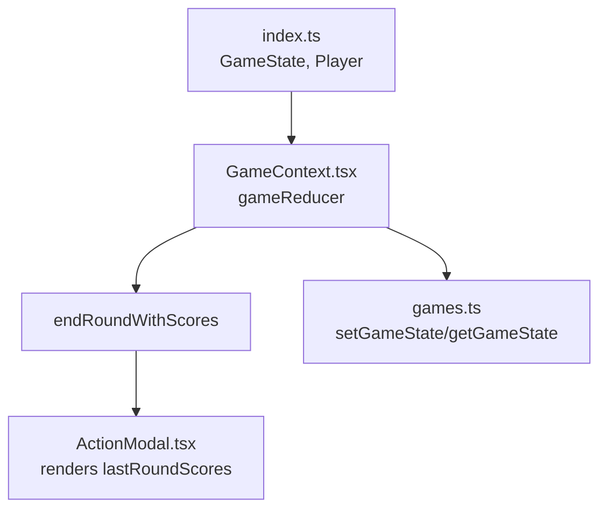

# Round Completion Logic

<cite>
**Referenced Files in This Document**
- [GameContext.tsx](file://src/context/GameContext.tsx)
- [index.ts](file://src/types/index.ts)
- [ActionModal.tsx](file://src/components/ActionModal.tsx)
- [gamerules.md](file://gamerules.md)
- [games.ts](file://convex/games.ts)
</cite>

## Table of Contents
1. [Introduction](#introduction)
2. [Project Structure](#project-structure)
3. [Core Components](#core-components)
4. [Architecture Overview](#architecture-overview)
5. [Detailed Component Analysis](#detailed-component-analysis)
6. [Dependency Analysis](#dependency-analysis)
7. [Performance Considerations](#performance-considerations)
8. [Troubleshooting Guide](#troubleshooting-guide)
9. [Conclusion](#conclusion)

## Introduction
This document explains the endRoundWithScores helper function in the gameReducer, focusing on how it computes round scores by summing card values in each player’s hand, determines the round winner, applies the Pobudka penalty when applicable, and handles both normal round endings via Pobudka and edge cases like deck exhaustion. It also covers how lastRoundScores are constructed with playerId, base score, and penalty fields, how ties in minimum scores are handled, and how the game ends when a player reaches 100 points. Finally, it addresses client-side state synchronization and common pitfalls such as floating-point precision and tie handling.

## Project Structure
The round completion logic lives in the GameContext reducer and interacts with UI components and the backend for online multiplayer. The key files are:
- GameContext.tsx: Implements the gameReducer and the endRoundWithScores helper.
- index.ts: Defines GameState and Player types, including lastRoundScores shape.
- ActionModal.tsx: Renders lastRoundScores for display.
- gamerules.md: Documents the Pobudka penalty and win condition.
- games.ts: Backend state persistence for online mode.

**Diagram sources**
- [GameContext.tsx](file://src/context/GameContext.tsx#L47-L174)
- [ActionModal.tsx](file://src/components/ActionModal.tsx#L56-L98)
- [index.ts](file://src/types/index.ts#L37-L79)
- [gamerules.md](file://gamerules.md#L75-L97)
- [games.ts](file://convex/games.ts#L1-L41)

**Section sources**
- [GameContext.tsx](file://src/context/GameContext.tsx#L47-L174)
- [index.ts](file://src/types/index.ts#L37-L79)
- [ActionModal.tsx](file://src/components/ActionModal.tsx#L56-L98)
- [gamerules.md](file://gamerules.md#L75-L97)
- [games.ts](file://convex/games.ts#L1-L41)

## Core Components
- endRoundWithScores: Computes per-player scores, applies Pobudka penalty if the caller does not have the lowest or tied-for-lowest score, updates player totals, determines round winner, checks for game over, and sets appropriate gamePhase and messages.
- lastRoundScores: An array of { playerId, score, penalty } entries produced for UI display and round summary.
- Round termination conditions:
  - Pobudka: Caller triggers endRoundWithScores with reason "pobudka".
  - Deck exhaustion: When drawing from the deck fails, endRoundWithScores is invoked with reason "deck_exhausted".

Key implementation references:
- endRoundWithScores core computation and penalties: [GameContext.tsx](file://src/context/GameContext.tsx#L78-L174)
- lastRoundScores construction and display: [GameContext.tsx](file://src/context/GameContext.tsx#L87-L123), [ActionModal.tsx](file://src/components/ActionModal.tsx#L56-L98)
- Round termination via Pobudka: [GameContext.tsx](file://src/context/GameContext.tsx#L499-L504)
- Round termination via deck exhaustion: [GameContext.tsx](file://src/context/GameContext.tsx#L255-L284)
- Game over condition (100 points): [GameContext.tsx](file://src/context/GameContext.tsx#L120-L141), [gamerules.md](file://gamerules.md#L93-L97)

**Section sources**
- [GameContext.tsx](file://src/context/GameContext.tsx#L78-L174)
- [ActionModal.tsx](file://src/components/ActionModal.tsx#L56-L98)
- [gamerules.md](file://gamerules.md#L75-L97)

## Architecture Overview
The round completion pipeline is triggered by either a Pobudka call or deck exhaustion. Both paths converge on endRoundWithScores, which:
- Sums each player’s hand to compute base scores.
- Identifies the minimum score and checks if the caller has the lowest or tied-for-lowest.
- Applies a 5-point penalty to the caller’s score if they do not have the lowest score.
- Updates each player’s total score.
- Determines the round winner and checks for game over.
- Sets gamePhase, roundWinnerName, gameWinnerName, lastCallerId, and lastRoundScores.

**Diagram sources**
- [GameContext.tsx](file://src/context/GameContext.tsx#L255-L284)
- [GameContext.tsx](file://src/context/GameContext.tsx#L499-L504)
- [GameContext.tsx](file://src/context/GameContext.tsx#L78-L174)
- [games.ts](file://convex/games.ts#L1-L41)

## Detailed Component Analysis

### endRoundWithScores: Scoring, Penalties, and Round Termination
- Base score calculation:
  - For each player, sum the values of cards in their hand. See [GameContext.tsx](file://src/context/GameContext.tsx#L82-L85).
- Minimum score and caller evaluation:
  - Compute the minimum among all base scores. See [GameContext.tsx](file://src/context/GameContext.tsx#L87-L87).
  - If callerId is provided, locate their base score and determine if they are tied-for-lowest using a less-than-or-equal comparison. See [GameContext.tsx](file://src/context/GameContext.tsx#L88-L95).
- Penalty application:
  - If reason is "pobudka", callerId is present, and callerHasLowest is false, apply a 5-point penalty to the caller’s score. See [GameContext.tsx](file://src/context/GameContext.tsx#L96-L108).
- lastRoundScores construction:
  - Produce an array of { playerId, score, penalty } for each player. See [GameContext.tsx](file://src/context/GameContext.tsx#L96-L108).
- Player score updates:
  - Update each player’s total score by adding base + penalty. See [GameContext.tsx](file://src/context/GameContext.tsx#L110-L118).
- Round winner determination:
  - Select the player with the smallest base score as the round winner. See [GameContext.tsx](file://src/context/GameContext.tsx#L120-L122).
- Game over condition:
  - If any player’s total score is greater than or equal to 100, the game ends and the player with the smallest total score wins. See [GameContext.tsx](file://src/context/GameContext.tsx#L120-L141), [gamerules.md](file://gamerules.md#L93-L97).
- Edge case: deck exhaustion:
  - When drawing from the deck fails, end the round immediately without applying the Pobudka penalty. See [GameContext.tsx](file://src/context/GameContext.tsx#L255-L284).

**Diagram sources**
- [GameContext.tsx](file://src/context/GameContext.tsx#L78-L174)

**Section sources**
- [GameContext.tsx](file://src/context/GameContext.tsx#L78-L174)

### lastRoundScores Construction and Display
- Construction:
  - lastRoundScores is built by mapping over computed scores and attaching a penalty of 5 only for the caller when callerHasLowest is false. See [GameContext.tsx](file://src/context/GameContext.tsx#L96-L108).
- Display:
  - The ActionModal renders lastRoundScores with player names and the breakdown of base score, penalty, and total contribution. See [ActionModal.tsx](file://src/components/ActionModal.tsx#L56-L98).

**Diagram sources**
- [GameContext.tsx](file://src/context/GameContext.tsx#L96-L118)
- [index.ts](file://src/types/index.ts#L37-L79)

**Section sources**
- [GameContext.tsx](file://src/context/GameContext.tsx#L96-L118)
- [ActionModal.tsx](file://src/components/ActionModal.tsx#L56-L98)
- [index.ts](file://src/types/index.ts#L37-L79)

### Round Termination Paths
- Pobudka:
  - Triggered by CALL_POBUDKA action, invokes endRoundWithScores with reason "pobudka". See [GameContext.tsx](file://src/context/GameContext.tsx#L499-L504).
- Deck exhaustion:
  - When DRAW_FROM_DECK fails due to empty deck, invokes endRoundWithScores with reason "deck_exhausted" and no Pobudka penalty. See [GameContext.tsx](file://src/context/GameContext.tsx#L255-L284).

**Diagram sources**
- [GameContext.tsx](file://src/context/GameContext.tsx#L255-L284)
- [GameContext.tsx](file://src/context/GameContext.tsx#L499-L504)
- [GameContext.tsx](file://src/context/GameContext.tsx#L78-L174)

**Section sources**
- [GameContext.tsx](file://src/context/GameContext.tsx#L255-L284)
- [GameContext.tsx](file://src/context/GameContext.tsx#L499-L504)

### Game Over and Winner Determination
- Game over occurs when any player’s total score reaches or exceeds 100. The winner is the player with the smallest total score. See [GameContext.tsx](file://src/context/GameContext.tsx#L120-L141), [gamerules.md](file://gamerules.md#L93-L97).
- The reducer sets gamePhase to "game_over" and stores gameWinnerName accordingly. See [GameContext.tsx](file://src/context/GameContext.tsx#L125-L141).

**Diagram sources**
- [GameContext.tsx](file://src/context/GameContext.tsx#L120-L141)
- [gamerules.md](file://gamerules.md#L93-L97)

**Section sources**
- [GameContext.tsx](file://src/context/GameContext.tsx#L120-L141)
- [gamerules.md](file://gamerules.md#L93-L97)

## Dependency Analysis
- Internal dependencies:
  - endRoundWithScores depends on Player.hand and Player.score structures defined in GameState. See [index.ts](file://src/types/index.ts#L37-L79).
  - The function uses Math.min and reduce to compute min score and round winner. See [GameContext.tsx](file://src/context/GameContext.tsx#L87-L122).
- External dependencies:
  - Online multiplayer relies on Convex APIs to persist and synchronize state. See [games.ts](file://convex/games.ts#L1-L41).
  - UI components consume lastRoundScores for rendering. See [ActionModal.tsx](file://src/components/ActionModal.tsx#L56-L98).

**Diagram sources**
- [index.ts](file://src/types/index.ts#L37-L79)
- [GameContext.tsx](file://src/context/GameContext.tsx#L78-L174)
- [ActionModal.tsx](file://src/components/ActionModal.tsx#L56-L98)
- [games.ts](file://convex/games.ts#L1-L41)

**Section sources**
- [index.ts](file://src/types/index.ts#L37-L79)
- [GameContext.tsx](file://src/context/GameContext.tsx#L78-L174)
- [ActionModal.tsx](file://src/components/ActionModal.tsx#L56-L98)
- [games.ts](file://convex/games.ts#L1-L41)

## Performance Considerations
- Complexity:
  - Computing base scores: O(P·C) where P is the number of players and C is the average number of cards per hand (constant in this game).
  - Finding min score and callerHasLowest: O(P).
  - Building lastRoundScores and updating player totals: O(P).
  - Winner selection: O(P).
  - Overall: O(P·C) plus O(P) operations, effectively O(P) given constant C.
- Memory:
  - Temporary arrays for scores and lastRoundScores are proportional to P; negligible overhead.
- Practical tips:
  - Keep hand sizes constant to avoid scaling issues.
  - Avoid unnecessary re-renders by relying on immutable updates and stable references.

[No sources needed since this section provides general guidance]

## Troubleshooting Guide
- Floating-point precision in scoring:
  - Scores are integer sums of card values; no floating-point arithmetic is involved. If you introduce fractional scoring later, normalize to integers (e.g., multiply by 100) and divide back consistently.
- Handling ties in minimum scores:
  - callerHasLowest uses a less-than-or-equal comparison, so ties are treated as the caller having the lowest score. If you want strict inequality, adjust the comparison accordingly.
- Ensuring consistent state updates across clients:
  - Online mode uses Convex to persist state and a synchronization mechanism that sanitizes peeked cards visibility. The reducer dispatches SET_STATE when remote state changes, and the provider sanitizes state before syncing. See [GameContext.tsx](file://src/context/GameContext.tsx#L602-L674), [GameContext.tsx](file://src/context/GameContext.tsx#L836-L846), [GameContext.tsx](file://src/context/GameContext.tsx#L877-L917), [games.ts](file://convex/games.ts#L1-L41).
- Common issues:
  - Unexpected penalties: Verify callerId is passed and callerHasLowest logic aligns with intended tie behavior.
  - Round not ending on deck exhaustion: Ensure DRAW_FROM_DECK returns the endRoundWithScores path when drawPile is empty. See [GameContext.tsx](file://src/context/GameContext.tsx#L255-L284).
  - Game not recognizing a winner: Confirm total scores reach or exceed 100 and that the reducer selects the minimum total as the winner. See [GameContext.tsx](file://src/context/GameContext.tsx#L120-L141), [gamerules.md](file://gamerules.md#L93-L97).

**Section sources**
- [GameContext.tsx](file://src/context/GameContext.tsx#L602-L674)
- [GameContext.tsx](file://src/context/GameContext.tsx#L836-L846)
- [GameContext.tsx](file://src/context/GameContext.tsx#L877-L917)
- [games.ts](file://convex/games.ts#L1-L41)
- [GameContext.tsx](file://src/context/GameContext.tsx#L255-L284)
- [GameContext.tsx](file://src/context/GameContext.tsx#L120-L141)
- [gamerules.md](file://gamerules.md#L93-L97)

## Conclusion
The endRoundWithScores helper centralizes round scoring, penalty application, and round termination logic. It correctly computes base scores, evaluates the caller against the minimum score, applies a 5-point penalty when appropriate, and updates player totals. It distinguishes between Pobudka and deck exhaustion scenarios, preserves the caller’s identity for UI and state, and determines both round winners and game winners when the 100-point threshold is reached. The design leverages immutable updates and robust online synchronization to maintain consistency across clients.

[No sources needed since this section summarizes without analyzing specific files]