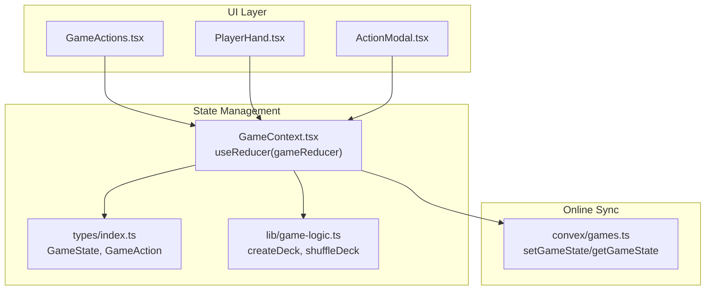
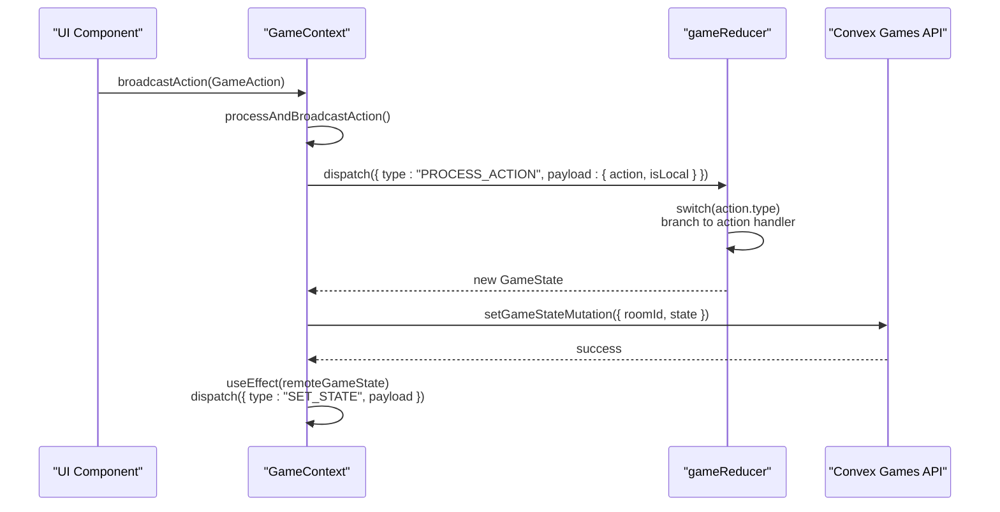
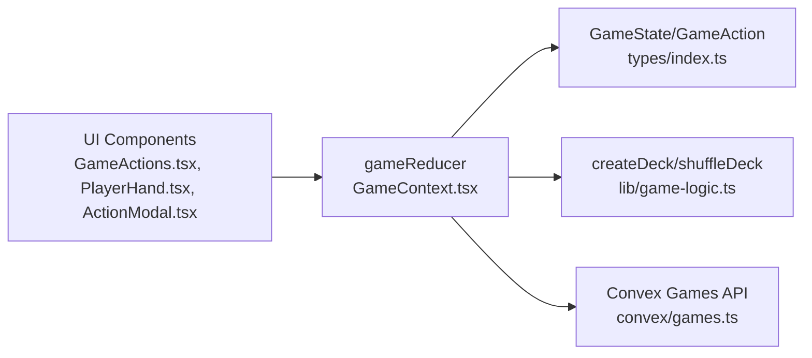

# State Reducer Logic

<cite>
**Referenced Files in This Document**
- [GameContext.tsx](file://src/context/GameContext.tsx)
- [index.ts](file://src/types/index.ts)
- [game-logic.ts](file://src/lib/game-logic.ts)
- [games.ts](file://convex/games.ts)
- [ActionModal.tsx](file://src/components/ActionModal.tsx)
- [PlayerHand.tsx](file://src/components/PlayerHand.tsx)
- [GameActions.tsx](file://src/components/GameActions.tsx)
</cite>

## Table of Contents
1. [Introduction](#introduction)
2. [Project Structure](#project-structure)
3. [Core Components](#core-components)
4. [Architecture Overview](#architecture-overview)
5. [Detailed Component Analysis](#detailed-component-analysis)
6. [Dependency Analysis](#dependency-analysis)
7. [Performance Considerations](#performance-considerations)
8. [Troubleshooting Guide](#troubleshooting-guide)
9. [Conclusion](#conclusion)

## Introduction
This document explains the state reducer logic for the game in sen-web, focusing on the gameReducer function and its role in managing game state transitions, complex mechanics (peeking, drawing, swapping, discarding, and special actions), and scoring. It also covers immutability patterns, game phases, and client synchronization strategies, with practical guidance for edge cases and performance.

## Project Structure
The game state and reducer live in the GameContext provider, which orchestrates:
- A reducer-driven state machine for game logic
- Online synchronization via Convex
- UI interactions that emit actions and trigger state updates
- Game mechanics implemented in the reducer and helpers

**Diagram sources**
- [GameContext.tsx](file://src/context/GameContext.tsx#L574-L576)
- [index.ts](file://src/types/index.ts#L37-L79)
- [game-logic.ts](file://src/lib/game-logic.ts#L1-L62)
- [games.ts](file://convex/games.ts#L1-L41)
- [GameActions.tsx](file://src/components/GameActions.tsx#L1-L44)
- [PlayerHand.tsx](file://src/components/PlayerHand.tsx#L78-L117)
- [ActionModal.tsx](file://src/components/ActionModal.tsx#L56-L98)

**Section sources**
- [GameContext.tsx](file://src/context/GameContext.tsx#L574-L576)
- [index.ts](file://src/types/index.ts#L37-L79)
- [game-logic.ts](file://src/lib/game-logic.ts#L1-L62)
- [games.ts](file://convex/games.ts#L1-L41)

## Core Components
- gameReducer: Central reducer that transforms GameState based on actions, enforcing immutability and driving game phases.
- Helper functions embedded inside the reducer:
  - advanceTurn: Progresses to the next player and resets per-turn state.
  - endRoundWithScores: Computes scores, applies penalties, detects round/game end, and transitions to appropriate phases.
- GameAction types: Typed actions that drive reducer branches.
- GameState: Immutable state shape with gamePhase, piles, players, and auxiliary fields.

Key responsibilities:
- Enforce phase gating (e.g., peeking, playing, holding_card, special action phases)
- Maintain immutability via object/array spreads
- Compute scoring and penalties for Pobudka and round end
- Manage temporary state for special actions (e.g., tempCards, swapState, peekingState)

**Section sources**
- [GameContext.tsx](file://src/context/GameContext.tsx#L47-L85)
- [index.ts](file://src/types/index.ts#L37-L79)
- [index.ts](file://src/types/index.ts#L81-L99)

## Architecture Overview
The reducer sits at the center of the game state machine. UI components emit GameAction events, which are dispatched to the reducer. The reducer computes a new immutable GameState and may trigger side effects (e.g., online sync, sound effects). Online mode uses Convex to persist and synchronize state across clients.

**Diagram sources**
- [GameContext.tsx](file://src/context/GameContext.tsx#L818-L840)
- [GameContext.tsx](file://src/context/GameContext.tsx#L883-L922)
- [games.ts](file://convex/games.ts#L1-L41)

## Detailed Component Analysis

### gameReducer: Switch-Based Action Handling
The reducer uses a switch over action.type to branch into handlers. It defines two embedded helpers:
- advanceTurn: Updates current player index, turn count, resets per-turn fields, and sets gamePhase to playing.
- endRoundWithScores: Calculates per-player scores, determines penalties (especially for Pobudka caller who does not have the lowest score), merges penalties into total scores, detects game over, and transitions to round_end or game_over.

Important behaviors:
- Immutability: Spreads state and arrays to produce new objects/arrays.
- Phase gating: Many actions only apply in specific gamePhase values.
- Temporary state: Special actions set temp fields (e.g., tempCards, swapState, drawnCard) and later clear them.

Concrete action handlers:
- SET_STATE: Replaces state wholesale (e.g., from remote sync).
- ADD_CHAT_MESSAGE / SET_CHAT_MESSAGES: Updates chatMessages immutably.
- PROCESS_ACTION: Branches into action-specific logic.

**Section sources**
- [GameContext.tsx](file://src/context/GameContext.tsx#L47-L85)
- [GameContext.tsx](file://src/context/GameContext.tsx#L78-L174)

### Drawing Mechanics: DRAW_FROM_DECK and DRAW_FROM_DISCARD
- DRAW_FROM_DECK:
  - Validates gamePhase is "playing".
  - Copies drawPile and pops a card.
  - If drawPile is empty, immediately ends the round via endRoundWithScores with reason "deck_exhausted".
  - Otherwise, sets drawnCard, drawSource, gamePhase to "holding_card", and records lastMove.
- DRAW_FROM_DISCARD:
  - Validates gamePhase is "playing" and discardPile is non-empty.
  - Draws from discard, sets drawnCard, drawSource to "discard", gamePhase to "holding_card", and records lastMove.

Edge case handling:
- Exhausted draw pile triggers immediate round end without Pobudka penalty.

**Section sources**
- [GameContext.tsx](file://src/context/GameContext.tsx#L255-L300)
- [GameContext.tsx](file://src/context/GameContext.tsx#L281-L300)

### Discarding and Swapping: DISCARD_HELD_CARD and SWAP_HELD_CARD
- DISCARD_HELD_CARD:
  - Requires gamePhase "holding_card" and a drawnCard.
  - Adds drawnCard to discardPile and calls advanceTurn to progress the turn.
- SWAP_HELD_CARD:
  - Requires gamePhase "holding_card" and a drawnCard.
  - Swaps the held card with a card from the current player’s hand at the specified index.
  - Captures drawSource before clearing it.
  - Calls advanceTurn and records lastMove with action "swap".

Immutability:
- Creates new arrays and objects for players, hands, and discardPile.

**Section sources**
- [GameContext.tsx](file://src/context/GameContext.tsx#L301-L351)
- [GameContext.tsx](file://src/context/GameContext.tsx#L317-L351)

### Special Actions: USE_SPECIAL_ACTION and Sub-Phases
Special actions are only valid when the drawn card is special and drawSource is "deck". The reducer transitions to dedicated sub-phases:

- peek_1:
  - Transitions to "action_peek_1", discards the special card, clears drawnCard/drawSource.
  - ACTION_PEEK_1_SELECT: Targets another player’s card, marks it peeked, then calls advanceTurn.
- swap_2:
  - Transitions to "action_swap_2_select_1", discards the special card, clears drawnCard/drawSource.
  - ACTION_SWAP_2_SELECT: Two-phase selection; on second selection, swaps cards between two players and calls advanceTurn.
- take_2:
  - Transitions to "action_take_2", discards the special card, clears drawnCard/drawSource.
  - ACTION_TAKE_2_CHOOSE: Chooses one of the two revealed cards, discards the other, sets drawnCard and gamePhase to "holding_card".

Temporary state:
- tempCards holds the two take-2 cards until a choice is made.
- swapState tracks the first selected card during two-card swap.

Immutability:
- Uses spreads and JSON parse/stringify for deep cloning during swap_2 to simplify swapping logic.

**Section sources**
- [GameContext.tsx](file://src/context/GameContext.tsx#L352-L419)
- [GameContext.tsx](file://src/context/GameContext.tsx#L408-L433)
- [GameContext.tsx](file://src/context/GameContext.tsx#L434-L475)
- [GameContext.tsx](file://src/context/GameContext.tsx#L476-L498)

### Peeking Mechanics: Peeking Loop and FINISH_PEEKING
- Peeking begins when gamePhase is "peeking" and peekingState is present.
- PEEK_CARD:
  - Validates gamePhase is "peeking", peekingState exists, and peekedCount < 2.
  - Marks the targeted card face up and sets hasBeenPeeked.
  - Increments peekedCount in peekingState.
- FINISH_PEEKING:
  - If the next player wraps around to the starting index, ends peeking, flips all hands face down for others, sets gamePhase to "playing", and resets peekingState.
  - Otherwise advances to next player in the loop.

Immutability:
- Spreads players and hand arrays to update individual cards.

**Section sources**
- [GameContext.tsx](file://src/context/GameContext.tsx#L176-L254)

### Scoring and Round End: endRoundWithScores
endRoundWithScores computes:
- Per-player scores by summing hand card values.
- Minimum score to determine whether the caller has the lowest score.
- Penalty logic for Pobudka:
  - If reason is "pobudka" and caller exists, and caller does not have the lowest score, adds a 5-point penalty to the caller’s round score.
- Updates players’ cumulative scores by adding score + penalty.
- Determines round winner by lowest total score.
- Detects game over when any player reaches or exceeds 100 points.

State transitions:
- gameOver: Sets gamePhase to "game_over", reveals all hands, stores lastRoundScores and gameWinnerName.
- deck_exhausted: Sets gamePhase to "round_end", reveals hands, stores lastRoundScores and roundWinnerName.
- pobudka: Sets gamePhase to "round_end", reveals hands, stores lastRoundScores and roundWinnerName.

**Section sources**
- [GameContext.tsx](file://src/context/GameContext.tsx#L78-L174)

### Turn Advancement: advanceTurn
advanceTurn:
- Computes next player index modulo number of players.
- Increments turnCount.
- Resets drawnCard, drawSource, and sets actionMessage to the next player’s turn.
- Sets gamePhase to "playing".

**Section sources**
- [GameContext.tsx](file://src/context/GameContext.tsx#L65-L76)

### New Round and Initial Setup: START_NEW_ROUND
START_NEW_ROUND:
- Shuffles a fresh deck and deals 4 cards per player face down.
- Places one card from the deck into the discard pile.
- Determines the next starting player based on lastCallerId or current player.
- Initializes peekingState and sets gamePhase to "peeking".
- Resets lastMove and sets actionMessage accordingly.

**Section sources**
- [GameContext.tsx](file://src/context/GameContext.tsx#L505-L540)

### Game Phases and Transitions
Game phases include:
- lobby, peeking, playing, holding_card, action_take_2, action_peek_1, action_swap_2_select_1, action_swap_2_select_2, round_end, game_over.

Transitions are driven by actions and helper functions:
- Drawing moves from "playing" to "holding_card".
- Special actions move to dedicated sub-phases and then back to "playing" or "holding_card".
- endRoundWithScores transitions to "round_end" or "game_over".
- START_NEW_ROUND transitions to "peeking".

**Section sources**
- [index.ts](file://src/types/index.ts#L17-L27)
- [GameContext.tsx](file://src/context/GameContext.tsx#L255-L300)
- [GameContext.tsx](file://src/context/GameContext.tsx#L352-L419)
- [GameContext.tsx](file://src/context/GameContext.tsx#L476-L498)
- [GameContext.tsx](file://src/context/GameContext.tsx#L505-L540)

### Immutability Patterns
The reducer enforces immutability by:
- Spreading state to create a new GameState object.
- Spreading arrays (players, drawPile, discardPile, hand) to create new collections.
- Spreading objects (player, card) to update specific fields.
- Using JSON parse/stringify for deep cloning during swap_2 to simplify swapping logic.

Benefits:
- Predictable state updates and easier debugging.
- Stable UI re-renders when references change.

Trade-offs:
- JSON clone is less efficient than manual spreads; consider optimizing swap_2 to avoid deep cloning.

**Section sources**
- [GameContext.tsx](file://src/context/GameContext.tsx#L176-L254)
- [GameContext.tsx](file://src/context/GameContext.tsx#L434-L475)

### Online Synchronization and State Consistency
- Sanitization: During peeking, the reducer sanitizes remote state so opponents cannot see peeked cards, while preserving local peeked cards for the current player.
- Debounced sync: Local state is synced to Convex only when it differs from last synced and remote state, with a small debounce to avoid rapid updates.
- Remote updates: useEffect listens for remoteGameState and dispatches SET_STATE to update local state, merging local peeked cards when appropriate.

Consistency:
- Prevents loops by comparing serialized states.
- Preserves lastCallerId and lastRoundScores across rounds.

**Section sources**
- [GameContext.tsx](file://src/context/GameContext.tsx#L842-L881)
- [GameContext.tsx](file://src/context/GameContext.tsx#L883-L922)
- [games.ts](file://convex/games.ts#L1-L41)

### UI Integration and Action Triggers
- GameActions and PlayerHand components emit actions based on gamePhase and current player:
  - Peeking: PEEK_CARD and FINISH_PEEKING.
  - Playing: DRAW_FROM_DECK/DRAW_FROM_DISCARD, DISCARD_HELD_CARD, SWAP_HELD_CARD, CALL_POBUDKA.
  - Special actions: USE_SPECIAL_ACTION and sub-actions ACTION_PEEK_1_SELECT, ACTION_SWAP_2_SELECT, ACTION_TAKE_2_CHOOSE.
- ActionModal displays last round scores and penalties.

**Section sources**
- [GameActions.tsx](file://src/components/GameActions.tsx#L1-L44)
- [PlayerHand.tsx](file://src/components/PlayerHand.tsx#L78-L117)
- [ActionModal.tsx](file://src/components/ActionModal.tsx#L56-L98)

## Dependency Analysis
The reducer depends on:
- GameState and GameAction types for correctness.
- createDeck and shuffleDeck for initializing and reshuffling the deck.
- i18n for localized messages.
- Convex APIs for online persistence and retrieval.

**Diagram sources**
- [GameContext.tsx](file://src/context/GameContext.tsx#L47-L85)
- [index.ts](file://src/types/index.ts#L37-L79)
- [game-logic.ts](file://src/lib/game-logic.ts#L1-L62)
- [games.ts](file://convex/games.ts#L1-L41)
- [GameActions.tsx](file://src/components/GameActions.tsx#L1-L44)
- [PlayerHand.tsx](file://src/components/PlayerHand.tsx#L78-L117)
- [ActionModal.tsx](file://src/components/ActionModal.tsx#L56-L98)

**Section sources**
- [GameContext.tsx](file://src/context/GameContext.tsx#L47-L85)
- [index.ts](file://src/types/index.ts#L37-L79)
- [game-logic.ts](file://src/lib/game-logic.ts#L1-L62)
- [games.ts](file://convex/games.ts#L1-L41)

## Performance Considerations
- Minimize object creation:
  - Prefer spreading only changed fields instead of entire objects when possible.
  - Avoid JSON parse/stringify for deep cloning in hot paths; implement manual swaps for swap_2.
- Reduce unnecessary state updates:
  - Gate actions by gamePhase to short-circuit early when invalid.
  - Debounce remote sync to limit network calls.
- Efficient scoring:
  - Compute per-player scores once per round end and reuse where possible.
- Immutable updates:
  - Keep spreads shallow; avoid deep cloning unless necessary.

[No sources needed since this section provides general guidance]

## Troubleshooting Guide
Common issues and resolutions:
- Draw pile exhausted:
  - Behavior: Immediately ends the round without Pobudka penalty. Verify deck initialization and deal logic.
  - Validation: Ensure START_NEW_ROUND creates a fresh deck and places one card in discard pile.
- Pobudka penalties:
  - Ensure endRoundWithScores calculates min score and checks callerHasLowest correctly.
  - Confirm penalties are added only when caller does not have the lowest score.
- Special action edge cases:
  - peek_1: Ensure ACTION_PEEK_1_SELECT targets the intended player and marks hasBeenPeeked.
  - swap_2: Verify two-phase selection logic and that JSON clone is not needed; prefer manual swap.
  - take_2: Ensure tempCards are cleared after ACTION_TAKE_2_CHOOSE and that discarded card is placed in discard pile.
- Online state consistency:
  - Sanitize remote state during peeking to hide opponent peeked cards.
  - Compare serialized states to prevent sync loops.
- UI state mismatch:
  - Ensure UI components only emit actions when allowed by gamePhase and current player.

**Section sources**
- [GameContext.tsx](file://src/context/GameContext.tsx#L255-L300)
- [GameContext.tsx](file://src/context/GameContext.tsx#L352-L419)
- [GameContext.tsx](file://src/context/GameContext.tsx#L434-L475)
- [GameContext.tsx](file://src/context/GameContext.tsx#L476-L498)
- [GameContext.tsx](file://src/context/GameContext.tsx#L78-L174)
- [GameContext.tsx](file://src/context/GameContext.tsx#L842-L881)
- [GameContext.tsx](file://src/context/GameContext.tsx#L883-L922)

## Conclusion
The gameReducer implements a robust, immutable state machine that drives complex game mechanics with clear phase transitions and scoring rules. By enforcing immutability, carefully gating actions by phase, and leveraging helper functions for turn advancement and round scoring, the reducer ensures predictable behavior across single-player and online modes. Proper handling of edge cases (e.g., exhausted draw piles, Pobudka penalties) and client synchronization guarantees consistency across players. Performance can be improved by reducing object creation and avoiding deep cloning in hot paths.