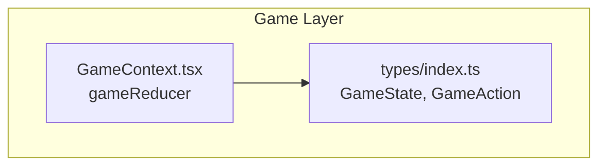
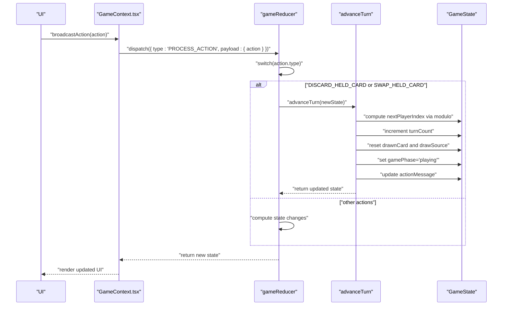
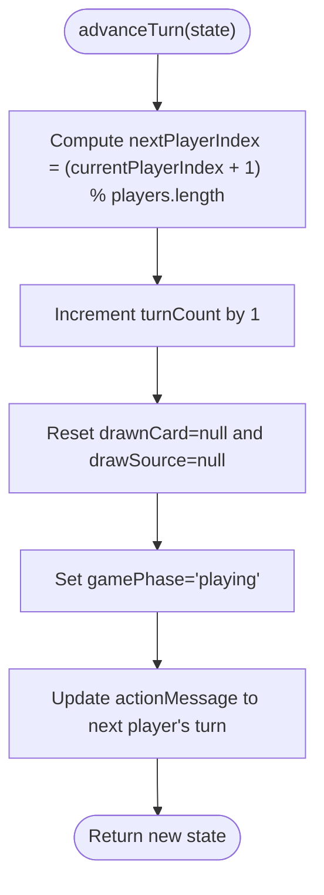
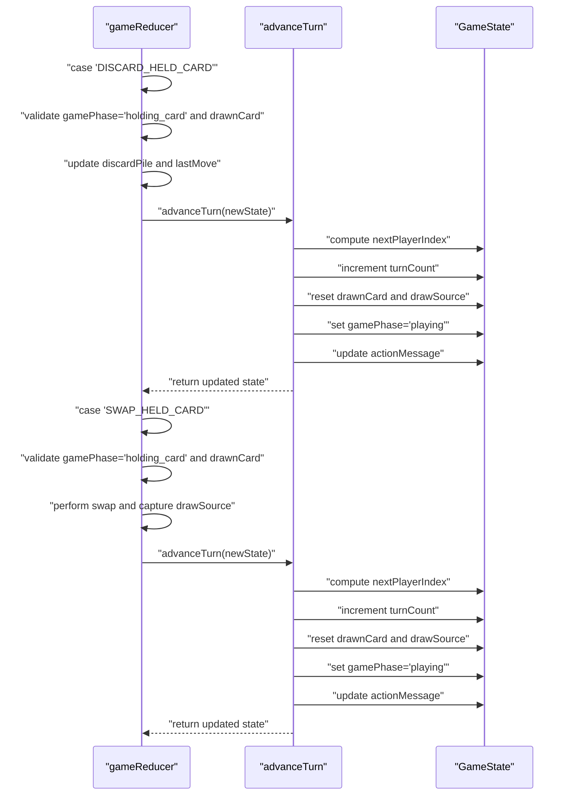
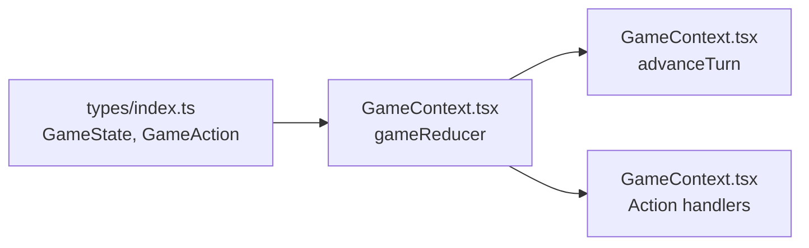

# Turn Advancement System

<cite>
**Referenced Files in This Document**
- [GameContext.tsx](file://src/context/GameContext.tsx)
- [index.ts](file://src/types/index.ts)
</cite>

## Table of Contents
1. [Introduction](#introduction)
2. [Project Structure](#project-structure)
3. [Core Components](#core-components)
4. [Architecture Overview](#architecture-overview)
5. [Detailed Component Analysis](#detailed-component-analysis)
6. [Dependency Analysis](#dependency-analysis)
7. [Performance Considerations](#performance-considerations)
8. [Troubleshooting Guide](#troubleshooting-guide)
9. [Conclusion](#conclusion)

## Introduction
This document explains the turn advancement mechanism used by the gameReducer to progress the game to the next player after a valid move. It focuses on the advanceTurn helper function, detailing how it increments the turn counter, updates the current player index in a circular manner using modulo arithmetic, resets transient state (drawnCard and drawSource), and updates the actionMessage to reflect the current player’s turn. It also documents how advanceTurn is invoked after actions such as DISCARD_HELD_CARD and SWAP_HELD_CARD, and how it contributes to maintaining game flow consistency and preventing race conditions by centralizing turn progression logic. Finally, it addresses common issues with player indexing in edge cases (e.g., dynamic player counts or disconnections) and provides best practices for reliable turn transitions in real-time multiplayer environments.

## Project Structure
The turn advancement logic resides within the gameReducer in the GameContext provider. The reducer defines the advanceTurn helper and orchestrates all game actions, including drawing, discarding, swapping, and special actions. The GameState type defines the structure of the game state, including transient fields that are reset upon turn advancement.

**Diagram sources**
- [GameContext.tsx](file://src/context/GameContext.tsx#L47-L76)
- [index.ts](file://src/types/index.ts#L37-L79)

**Section sources**
- [GameContext.tsx](file://src/context/GameContext.tsx#L1-L60)
- [index.ts](file://src/types/index.ts#L1-L79)

## Core Components
- advanceTurn helper: A pure function that advances the turn by computing the next player index using modulo arithmetic, increments the turn counter, resets transient state (drawnCard and drawSource), sets the game phase to playing, and updates the actionMessage to reflect the next player’s turn.
- gameReducer: The central reducer that handles all game actions. It invokes advanceTurn after specific actions to ensure consistent turn progression.
- GameState: The canonical state shape used across the app, including transient fields that are reset on turn advancement.

Key responsibilities:
- Circular turn progression: Uses modulo arithmetic to wrap around the player list.
- Transient state reset: Clears drawnCard and drawSource to prepare for the next player’s turn.
- Consistent messaging: Updates actionMessage to reflect whose turn it is.
- Centralized turn logic: Ensures all valid moves lead to the same turn advancement semantics.

**Section sources**
- [GameContext.tsx](file://src/context/GameContext.tsx#L61-L76)
- [index.ts](file://src/types/index.ts#L37-L79)

## Architecture Overview
The turn advancement system is part of a centralized reducer architecture. When a player performs an action, the reducer computes the resulting state and, if applicable, delegates to advanceTurn to finalize turn progression. The GameState type defines transient fields that are cleared on turn advancement, ensuring a clean slate for the next player.

**Diagram sources**
- [GameContext.tsx](file://src/context/GameContext.tsx#L818-L840)
- [GameContext.tsx](file://src/context/GameContext.tsx#L283-L360)
- [GameContext.tsx](file://src/context/GameContext.tsx#L304-L360)

## Detailed Component Analysis

### advanceTurn Helper Function
The advanceTurn helper encapsulates the turn progression logic:
- Computes the next player index using modulo arithmetic against the total number of players.
- Increments the turn counter.
- Resets transient state (drawnCard and drawSource).
- Sets the game phase to playing.
- Updates the actionMessage to reflect the next player’s turn.

It is invoked after actions that conclude a player’s turn, such as DISCARD_HELD_CARD and SWAP_HELD_CARD, ensuring consistent turn flow regardless of the specific action performed.

**Diagram sources**
- [GameContext.tsx](file://src/context/GameContext.tsx#L61-L76)

**Section sources**
- [GameContext.tsx](file://src/context/GameContext.tsx#L61-L76)

### Invocation Examples: DISCARD_HELD_CARD and SWAP_HELD_CARD
Both DISCARD_HELD_CARD and SWAP_HELD_CARD are handled within the reducer’s action switch. After performing the necessary state updates (e.g., adding the drawn card to the discard pile or swapping a hand card), the reducer delegates to advanceTurn to finalize turn progression.

- DISCARD_HELD_CARD:
  - Validates that the game phase is holding_card and a card was drawn.
  - Adds the drawn card to the discard pile.
  - Invokes advanceTurn to move to the next player.

- SWAP_HELD_CARD:
  - Validates that the game phase is holding_card and a card was drawn.
  - Swaps the selected hand card with the drawn card.
  - Captures the draw source prior to resetting transient state.
  - Invokes advanceTurn to move to the next player.

**Diagram sources**
- [GameContext.tsx](file://src/context/GameContext.tsx#L283-L360)
- [GameContext.tsx](file://src/context/GameContext.tsx#L304-L360)
- [GameContext.tsx](file://src/context/GameContext.tsx#L61-L76)

**Section sources**
- [GameContext.tsx](file://src/context/GameContext.tsx#L283-L360)
- [GameContext.tsx](file://src/context/GameContext.tsx#L304-L360)

### Role in Maintaining Game Flow Consistency
- Centralized turn logic: By invoking advanceTurn after actions that end a player’s turn, the reducer ensures consistent behavior across all valid moves.
- Transient state hygiene: Resetting drawnCard and drawSource prevents stale state from leaking into subsequent turns.
- Clear messaging: Updating actionMessage keeps players informed about whose turn it is, reducing confusion.
- Preventing race conditions: The reducer’s single-threaded nature (via useReducer) and the centralized advanceTurn logic reduce the risk of inconsistent turn progression in response to concurrent actions.

**Section sources**
- [GameContext.tsx](file://src/context/GameContext.tsx#L61-L76)
- [GameContext.tsx](file://src/context/GameContext.tsx#L283-L360)

### Edge Cases and Best Practices
Common issues and mitigations:
- Dynamic player counts: The modulo operation uses the current players length, so dynamic additions or removals are handled automatically. However, ensure that the player list is consistent across clients to avoid mismatches.
- Player disconnections: In online mode, the presence system detects inactive players. If a player disconnects, the UI may reset the game state. Ensure that any pending actions are not dispatched after a reset.
- Transient state persistence: Some actions intentionally preserve drawSource or drawnCard until the end of the turn. advanceTurn clears these fields, which is essential to prevent stale state from affecting future turns.

Best practices:
- Always delegate to advanceTurn after actions that conclude a player’s turn.
- Validate gamePhase and preconditions before invoking advanceTurn to avoid invalid state transitions.
- Keep the reducer pure and deterministic; avoid side effects inside advanceTurn.
- For multiplayer, rely on the centralized reducer and remote synchronization to maintain consistency.

**Section sources**
- [GameContext.tsx](file://src/context/GameContext.tsx#L711-L749)
- [GameContext.tsx](file://src/context/GameContext.tsx#L61-L76)

## Dependency Analysis
The gameReducer depends on the GameState type and the advanceTurn helper. The reducer’s action handlers depend on the current player and the transient fields defined in GameState.

**Diagram sources**
- [index.ts](file://src/types/index.ts#L37-L79)
- [GameContext.tsx](file://src/context/GameContext.tsx#L47-L76)
- [GameContext.tsx](file://src/context/GameContext.tsx#L283-L360)

**Section sources**
- [index.ts](file://src/types/index.ts#L37-L79)
- [GameContext.tsx](file://src/context/GameContext.tsx#L47-L76)

## Performance Considerations
- Pure transformations: advanceTurn and reducer branches perform shallow copies and minimal recomputation, keeping updates efficient.
- Deterministic updates: Centralizing turn logic avoids unnecessary re-renders caused by inconsistent state transitions.
- Transient state reset: Clearing drawnCard and drawSource reduces memory footprint and prevents accidental reuse of stale data.

## Troubleshooting Guide
- Symptom: Turn does not advance after discarding or swapping.
  - Verify that the game phase is holding_card and a drawn card exists.
  - Confirm that the action handler invokes advanceTurn.
- Symptom: Stale drawnCard or drawSource persists across turns.
  - Ensure advanceTurn is called after discarding or swapping.
  - Check that the reducer resets drawnCard and drawSource.
- Symptom: Incorrect player indexing after dynamic player changes.
  - Confirm that the player list is synchronized across clients.
  - Avoid relying on indices when players dynamically join or leave; use player IDs for targeting.

**Section sources**
- [GameContext.tsx](file://src/context/GameContext.tsx#L283-L360)
- [GameContext.tsx](file://src/context/GameContext.tsx#L61-L76)

## Conclusion
The advanceTurn helper is a cornerstone of the game’s turn progression system. It ensures consistent, deterministic turn transitions by computing the next player index via modulo arithmetic, incrementing the turn counter, resetting transient state, and updating the action message. Its centralized invocation after actions like DISCARD_HELD_CARD and SWAP_HELD_CARD maintains game flow integrity and simplifies multiplayer synchronization. By following the best practices outlined here, developers can build robust turn transitions that remain reliable under dynamic conditions such as player joins/leaves and real-time updates.