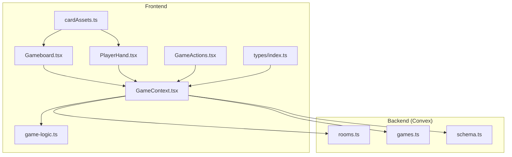
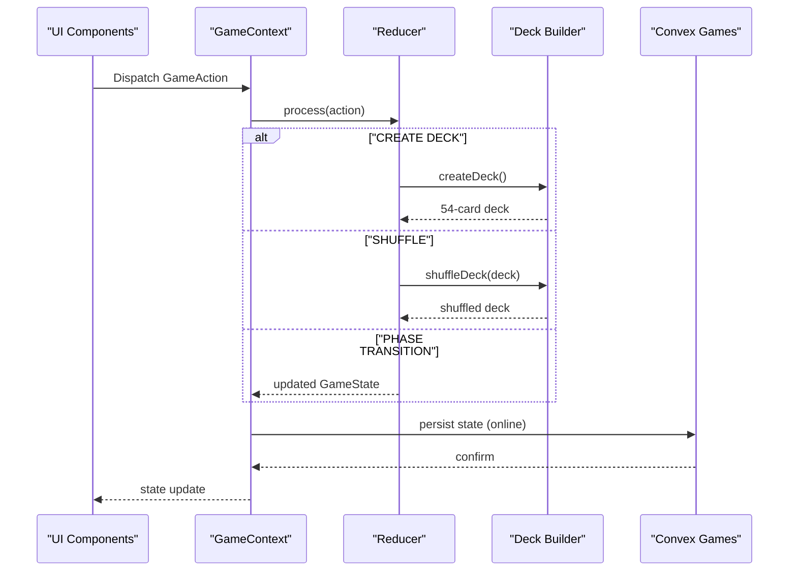
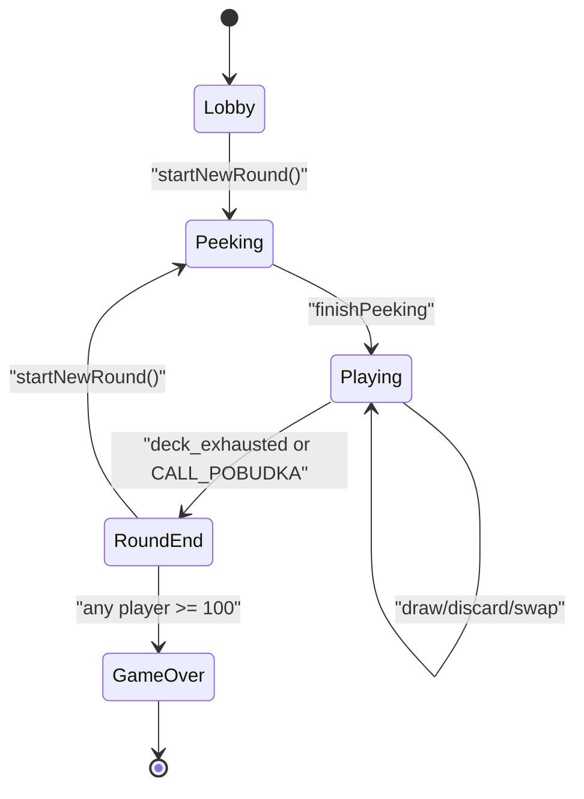
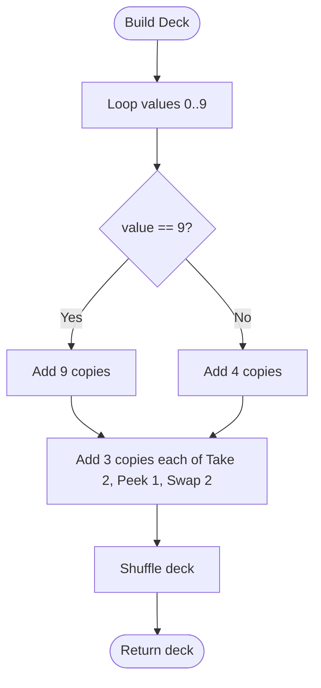
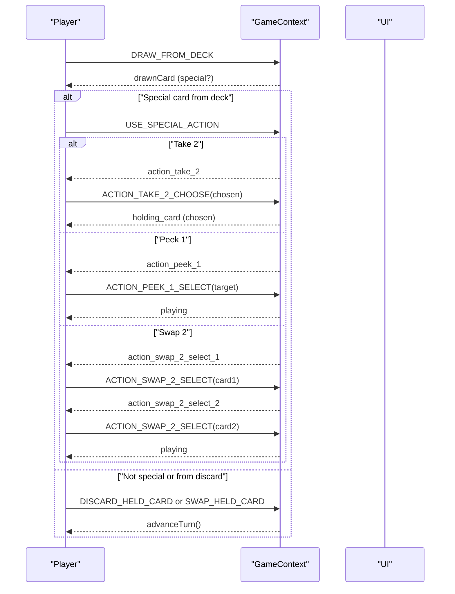
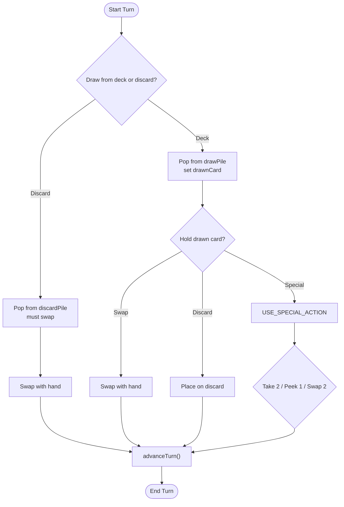
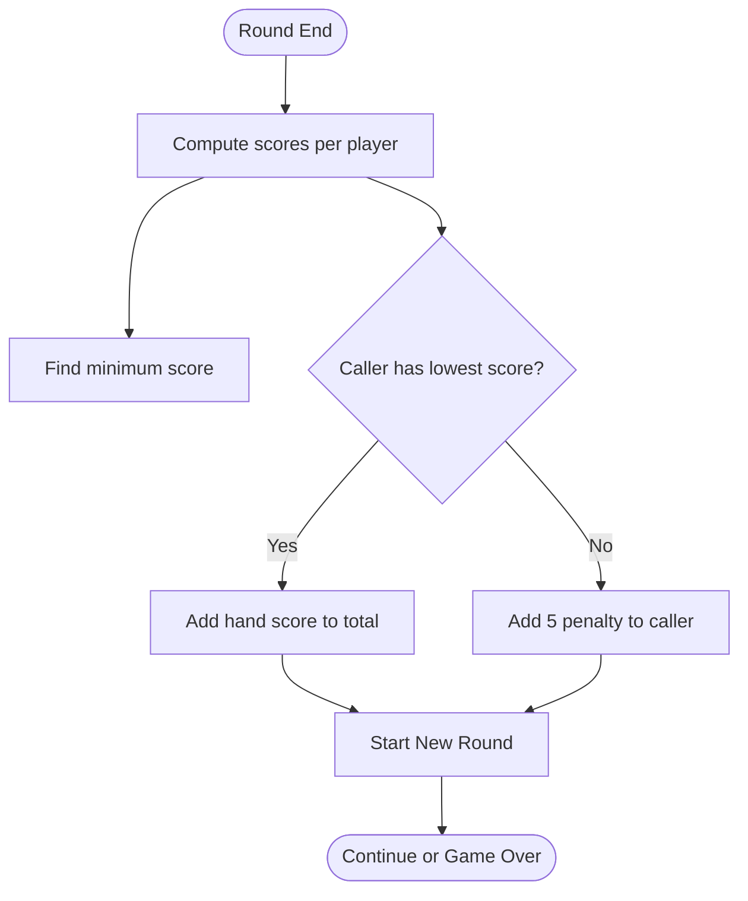
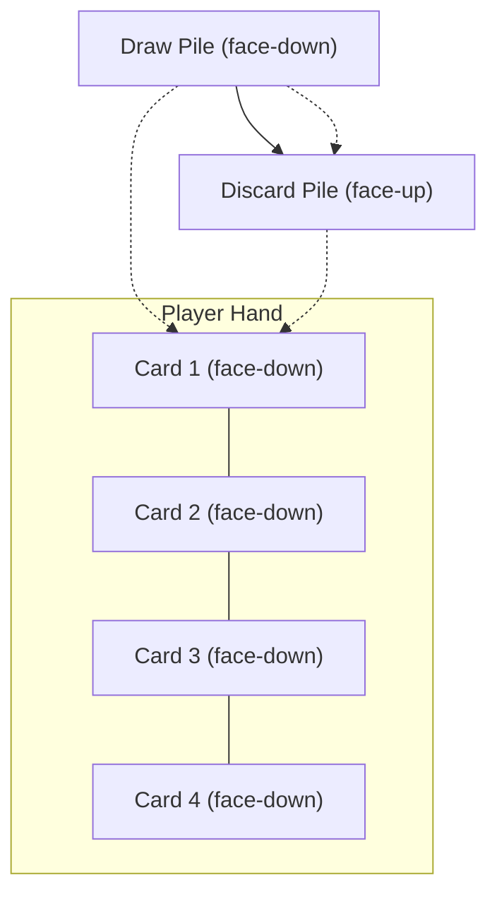
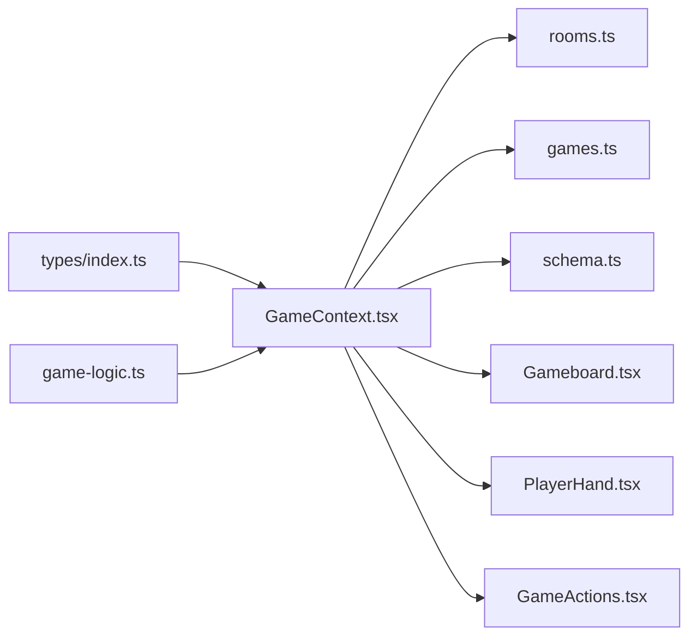

# Game Rules and Mechanics

<cite>
**Referenced Files in This Document**
- [gamerules.md](file://gamerules.md)
- [game-logic.ts](file://src/lib/game-logic.ts)
- [GameContext.tsx](file://src/context/GameContext.tsx)
- [types/index.ts](file://src/types/index.ts)
- [Gameboard.tsx](file://src/components/Gameboard.tsx)
- [PlayerHand.tsx](file://src/components/PlayerHand.tsx)
- [GameActions.tsx](file://src/components/GameActions.tsx)
- [cardAssets.ts](file://src/lib/cardAssets.ts)
- [translation.json](file://public/locales/en/translation.json)
- [rooms.ts](file://convex/rooms.ts)
- [games.ts](file://convex/games.ts)
- [schema.ts](file://convex/schema.ts)
</cite>

## Table of Contents
1. [Introduction](#introduction)
2. [Project Structure](#project-structure)
3. [Core Components](#core-components)
4. [Architecture Overview](#architecture-overview)
5. [Detailed Component Analysis](#detailed-component-analysis)
6. [Dependency Analysis](#dependency-analysis)
7. [Performance Considerations](#performance-considerations)
8. [Troubleshooting Guide](#troubleshooting-guide)
9. [Conclusion](#conclusion)
10. [Appendices](#appendices)

## Introduction
This document explains the complete gameplay of Sen, including the goal, card values, special cards, scoring, and the five game phases: Lobby, Peeking, Playing, Round End, and Game Over. It also covers turn management, win conditions, and how the rules are enforced in the codebase through game-logic.ts and GameContext. Examples and diagrams illustrate card layouts and state transitions.

## Project Structure
The game is implemented in a React frontend with a centralized GameContext reducer managing state and actions. Game logic for deck creation and shuffling resides in a dedicated module. Convex is used for online persistence and synchronization.

**Diagram sources**
- [Gameboard.tsx](file://src/components/Gameboard.tsx#L1-L355)
- [PlayerHand.tsx](file://src/components/PlayerHand.tsx#L1-L117)
- [GameActions.tsx](file://src/components/GameActions.tsx#L1-L80)
- [GameContext.tsx](file://src/context/GameContext.tsx#L1-L548)
- [game-logic.ts](file://src/lib/game-logic.ts#L1-L63)
- [types/index.ts](file://src/types/index.ts#L1-L100)
- [cardAssets.ts](file://src/lib/cardAssets.ts#L1-L57)
- [rooms.ts](file://convex/rooms.ts#L1-L43)
- [games.ts](file://convex/games.ts#L1-L43)
- [schema.ts](file://convex/schema.ts#L1-L42)

**Section sources**
- [GameContext.tsx](file://src/context/GameContext.tsx#L1-L120)
- [game-logic.ts](file://src/lib/game-logic.ts#L1-L63)
- [types/index.ts](file://src/types/index.ts#L1-L100)

## Core Components
- Deck creation and shuffling: build a 54-card deck with values 0–9 and special cards Take 2 (5), Peek 1 (6), Swap 2 (7), each with defined counts and special actions.
- Game state machine: manages phases, turns, and actions with a reducer.
- UI components: display piles, hands, and actions; enforce legal moves based on phase and ownership.
- Online persistence: Convex stores room/player lists and game state for multiplayer.

Key rule enforcement points:
- Card values and counts are defined in the deck builder.
- Turn advancement and phase transitions occur in the reducer.
- Special card effects are only usable when drawn from the deck and not when taken from the discard pile.
- Scoring and Pobudka penalty are computed in the reducer.

**Section sources**
- [game-logic.ts](file://src/lib/game-logic.ts#L1-L63)
- [GameContext.tsx](file://src/context/GameContext.tsx#L47-L123)
- [types/index.ts](file://src/types/index.ts#L1-L100)

## Architecture Overview
The game follows a centralized state model:
- GameContext maintains GameState and dispatches GameAction events.
- The reducer updates state based on actions and enforces rules.
- UI components read state and emit actions.
- Convex persists and syncs state for online play.

**Diagram sources**
- [GameContext.tsx](file://src/context/GameContext.tsx#L47-L123)
- [game-logic.ts](file://src/lib/game-logic.ts#L1-L63)
- [games.ts](file://convex/games.ts#L1-L43)

## Detailed Component Analysis

### Game Phases and Transitions
- Lobby: Host sets up players; online mode waits for players; hotseat mode initializes local players.
- Peeking: Each player may peek at two of their four cards face-down; after finishing, the game proceeds to Playing.
- Playing: Active player draws from deck or discard, decides to swap, discard, or use a special action if eligible.
- Round End: Occurs when the deck runs out or a player calls Pobudka. Scores are computed; penalties apply if Pobudka caller does not have the lowest score.
- Game Over: First to reach/exceed 100 total ravens wins.

**Diagram sources**
- [GameContext.tsx](file://src/context/GameContext.tsx#L47-L123)
- [GameContext.tsx](file://src/context/GameContext.tsx#L497-L520)
- [gamerules.md](file://gamerules.md#L75-L97)

**Section sources**
- [GameContext.tsx](file://src/context/GameContext.tsx#L47-L123)
- [GameContext.tsx](file://src/context/GameContext.tsx#L497-L520)
- [gamerules.md](file://gamerules.md#L75-L97)

### Card Values and Composition
- Normal cards: values 0–8 appear 4 times; value 9 appears 9 times.
- Special cards: Take 2 (value 5), Peek 1 (value 6), Swap 2 (value 7), each appear 3 times.
- Deck creation and shuffling are implemented in the deck builder.

**Diagram sources**
- [game-logic.ts](file://src/lib/game-logic.ts#L1-L63)

**Section sources**
- [game-logic.ts](file://src/lib/game-logic.ts#L1-L63)
- [gamerules.md](file://gamerules.md#L13-L17)

### Special Cards and Effects
- Take 2 (value 5): Draw two cards from the top of the deck; choose one to keep and perform a normal action; the other is discarded.
- Peek 1 (value 6): Look at one card in any player’s dream (including your own), then place it back in the same spot.
- Swap 2 (value 7): Swap two cards between any two players’ dreams (including your own); neither player reveals the cards.
- Special effects can only be used when the card is drawn from the face-down deck, not when taken from the discard pile.

**Diagram sources**
- [GameContext.tsx](file://src/context/GameContext.tsx#L255-L407)
- [GameContext.tsx](file://src/context/GameContext.tsx#L408-L475)
- [GameContext.tsx](file://src/context/GameContext.tsx#L476-L500)

**Section sources**
- [GameContext.tsx](file://src/context/GameContext.tsx#L255-L407)
- [GameContext.tsx](file://src/context/GameContext.tsx#L408-L475)
- [GameContext.tsx](file://src/context/GameContext.tsx#L476-L500)
- [gamerules.md](file://gamerules.md#L66-L73)

### Player Actions and Turn Management
- Drawing from deck: draw one card; if deck is empty, end round immediately.
- Drawing from discard: must swap the drawn card with one in hand; cannot use special effect.
- Swapping: replace a card in hand with the drawn card; place the old card on discard.
- Discarding: place the drawn card on discard.
- Using special actions: only allowed when drawn from deck; triggers dedicated sub-phases.
- Turn advancement: after resolving an action, move to next player; reset drawn card and draw source.

**Diagram sources**
- [GameContext.tsx](file://src/context/GameContext.tsx#L255-L351)
- [GameContext.tsx](file://src/context/GameContext.tsx#L352-L407)
- [GameContext.tsx](file://src/context/GameContext.tsx#L408-L475)

**Section sources**
- [GameContext.tsx](file://src/context/GameContext.tsx#L255-L351)
- [GameContext.tsx](file://src/context/GameContext.tsx#L352-L407)
- [GameContext.tsx](file://src/context/GameContext.tsx#L408-L475)

### Scoring and Pobudka Penalty
- Round scoring: sum of values in each player’s hand.
- Pobudka resolution:
  - Caller’s score equals the sum of their hand.
  - If caller does not have the lowest score (or ties), they receive a 5-raven penalty.
- Game over: first player to reach/exceed 100 total ravens wins.

**Diagram sources**
- [GameContext.tsx](file://src/context/GameContext.tsx#L87-L123)
- [gamerules.md](file://gamerules.md#L83-L97)

**Section sources**
- [GameContext.tsx](file://src/context/GameContext.tsx#L87-L123)
- [gamerules.md](file://gamerules.md#L83-L97)

### Card Layouts and UI
- Draw pile: face-down stack; clicking draws a card.
- Discard pile: top card face-up; clicking takes it (must swap).
- Player hand: four face-down cards; during Peeking, player may reveal two cards temporarily.
- Special card visuals: assets mapped by value and special action.

**Diagram sources**
- [Gameboard.tsx](file://src/components/Gameboard.tsx#L220-L298)
- [PlayerHand.tsx](file://src/components/PlayerHand.tsx#L1-L117)
- [cardAssets.ts](file://src/lib/cardAssets.ts#L1-L57)

**Section sources**
- [Gameboard.tsx](file://src/components/Gameboard.tsx#L220-L298)
- [PlayerHand.tsx](file://src/components/PlayerHand.tsx#L1-L117)
- [cardAssets.ts](file://src/lib/cardAssets.ts#L1-L57)

### How Rules Are Enforced in Code
- Deck composition and shuffle: implemented in the deck builder.
- Phase transitions and turn management: handled in the reducer.
- Special effects: validated to only trigger when drawn from deck.
- Scoring and penalties: computed in the reducer upon round end.
- Online synchronization: Convex persists and syncs state; UI merges local peeked cards safely.

**Section sources**
- [game-logic.ts](file://src/lib/game-logic.ts#L1-L63)
- [GameContext.tsx](file://src/context/GameContext.tsx#L47-L123)
- [GameContext.tsx](file://src/context/GameContext.tsx#L255-L407)
- [games.ts](file://convex/games.ts#L1-L43)
- [schema.ts](file://convex/schema.ts#L1-L42)

## Dependency Analysis
- Types define the shape of GameState, GameAction, and Card, ensuring consistent state and actions across components.
- GameContext depends on game-logic for deck creation/shuffling and on Convex for persistence.
- UI components depend on GameContext for state and dispatching actions.

**Diagram sources**
- [types/index.ts](file://src/types/index.ts#L1-L100)
- [GameContext.tsx](file://src/context/GameContext.tsx#L1-L120)
- [game-logic.ts](file://src/lib/game-logic.ts#L1-L63)
- [rooms.ts](file://convex/rooms.ts#L1-L43)
- [games.ts](file://convex/games.ts#L1-L43)
- [schema.ts](file://convex/schema.ts#L1-L42)
- [Gameboard.tsx](file://src/components/Gameboard.tsx#L1-L355)
- [PlayerHand.tsx](file://src/components/PlayerHand.tsx#L1-L117)
- [GameActions.tsx](file://src/components/GameActions.tsx#L1-L80)

**Section sources**
- [types/index.ts](file://src/types/index.ts#L1-L100)
- [GameContext.tsx](file://src/context/GameContext.tsx#L1-L120)
- [games.ts](file://convex/games.ts#L1-L43)
- [schema.ts](file://convex/schema.ts#L1-L42)

## Performance Considerations
- Deck building is O(n) with n=54; shuffling is O(n).
- State updates are shallow merges; avoid unnecessary re-renders by keeping payloads minimal.
- Online mode relies on Convex; batching updates reduces network overhead.

## Troubleshooting Guide
Common issues and resolutions:
- Attempting to use a special action from the discard pile: blocked by the reducer; only deck-drawn special cards are valid.
- Drawing from an empty deck: automatically ends the round without Pobudka penalty.
- Peeking phase: ensure only the designated player can peek; UI enforces this.
- Online disconnect: the client resets to lobby if an opponent leaves unexpectedly.

**Section sources**
- [GameContext.tsx](file://src/context/GameContext.tsx#L255-L351)
- [GameContext.tsx](file://src/context/GameContext.tsx#L352-L407)
- [GameContext.tsx](file://src/context/GameContext.tsx#L497-L520)
- [GameContext.tsx](file://src/context/GameContext.tsx#L711-L749)

## Conclusion
Sen combines strategic deck management, special abilities, and careful scoring to minimize ravens. The codebase enforces rules rigorously through a centralized reducer, deck builder, and online persistence. The UI clearly reflects game phases and legal actions, while the tutorial and messages guide players through the flow.

## Appendices

### Card Values and Counts
- Values 0–8: 4 copies each
- Value 9: 9 copies
- Special cards (3 copies each): Take 2 (5), Peek 1 (6), Swap 2 (7)

**Section sources**
- [gamerules.md](file://gamerules.md#L13-L17)
- [game-logic.ts](file://src/lib/game-logic.ts#L1-L63)

### Win Conditions
- Reach/exceed 100 total ravens; winner is the player with the lowest total.
- Alternative limits can be agreed upon (e.g., 70 or 150).

**Section sources**
- [gamerules.md](file://gamerules.md#L93-L97)

### Example: Round End Scenarios
- Deck exhaustion: round ends immediately; winner is the player with the lowest score.
- Pobudka: caller’s score is added; if not lowest, they receive a 5-raven penalty.

**Section sources**
- [GameContext.tsx](file://src/context/GameContext.tsx#L87-L123)
- [gamerules.md](file://gamerules.md#L75-L97)