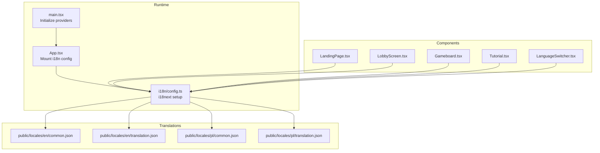
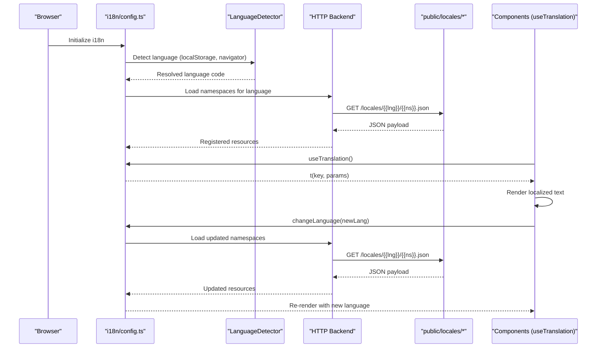
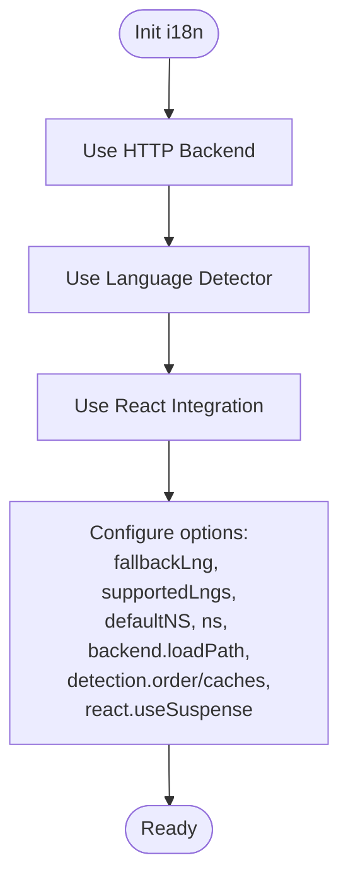
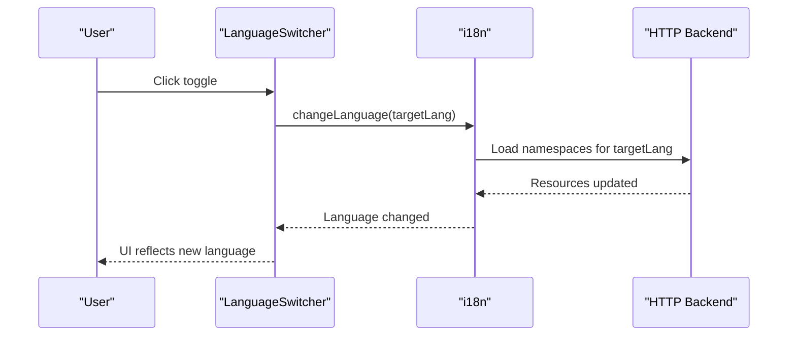
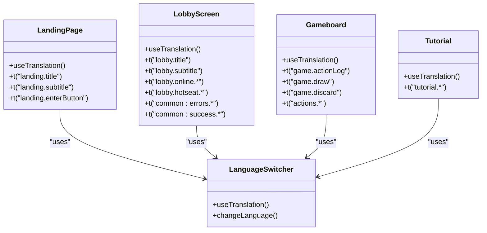
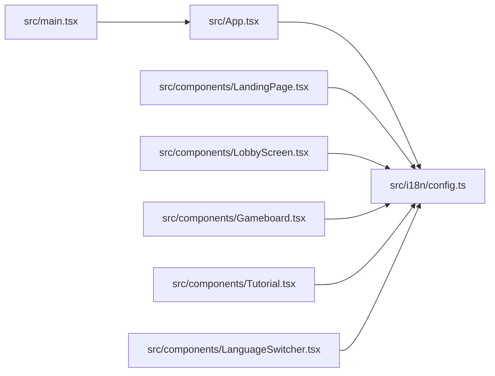

# Internationalization Guide

<cite>
**Referenced Files in This Document**
- [config.ts](file://src/i18n/config.ts)
- [LanguageSwitcher.tsx](file://src/components/LanguageSwitcher.tsx)
- [main.tsx](file://src/main.tsx)
- [App.tsx](file://src/App.tsx)
- [LandingPage.tsx](file://src/components/LandingPage.tsx)
- [LobbyScreen.tsx](file://src/components/LobbyScreen.tsx)
- [Gameboard.tsx](file://src/components/Gameboard.tsx)
- [Tutorial.tsx](file://src/components/Tutorial.tsx)
- [common.json (en)](file://public/locales/en/common.json)
- [translation.json (en)](file://public/locales/en/translation.json)
- [common.json (pl)](file://public/locales/pl/common.json)
- [translation.json (pl)](file://public/locales/pl/translation.json)
</cite>

## Table of Contents
1. [Introduction](#introduction)
2. [Project Structure](#project-structure)
3. [Core Components](#core-components)
4. [Architecture Overview](#architecture-overview)
5. [Detailed Component Analysis](#detailed-component-analysis)
6. [Dependency Analysis](#dependency-analysis)
7. [Performance Considerations](#performance-considerations)
8. [Troubleshooting Guide](#troubleshooting-guide)
9. [Conclusion](#conclusion)
10. [Appendices](#appendices)

## Introduction
This guide explains the internationalization system in sen-web, built on i18next with React integration. The system supports English and Polish languages, organizes translations into common and game-specific namespaces, and enables runtime language switching. It covers the configuration, file layout, usage in components, and best practices for extending and maintaining translations.

## Project Structure
The i18n system is configured centrally and loaded at startup. Translations are stored under public/locales/<lang>/ with two namespaces: common and translation. Components consume translations via the useTranslation hook.

**Diagram sources**
- [main.tsx](file://src/main.tsx#L1-L21)
- [App.tsx](file://src/App.tsx#L1-L80)
- [config.ts](file://src/i18n/config.ts#L1-L33)
- [common.json (en)](file://public/locales/en/common.json#L1-L25)
- [translation.json (en)](file://public/locales/en/translation.json#L1-L141)
- [common.json (pl)](file://public/locales/pl/common.json#L1-L25)
- [translation.json (pl)](file://public/locales/pl/translation.json#L1-L141)

**Section sources**
- [main.tsx](file://src/main.tsx#L1-L21)
- [App.tsx](file://src/App.tsx#L1-L80)
- [config.ts](file://src/i18n/config.ts#L1-L33)

## Core Components
- i18n configuration: Initializes i18next with HTTP backend, language detector, and React integration. Defines supported languages, namespaces, and fallback behavior.
- LanguageSwitcher: Provides a UI control to toggle between English and Polish at runtime.
- Components: Use useTranslation to render localized text and pass parameters for pluralization and interpolation.

Key configuration highlights:
- Supported languages: English and Polish
- Namespaces: translation and common
- Fallback language: English
- Backend loader: Loads JSON from public/locales/{{lng}}/{{ns}}.json
- Language detection: Persists user choice in localStorage and falls back to browser navigator

**Section sources**
- [config.ts](file://src/i18n/config.ts#L1-L33)
- [LanguageSwitcher.tsx](file://src/components/LanguageSwitcher.tsx#L1-L40)

## Architecture Overview
The i18n pipeline loads translations from static JSON files, detects the user’s preferred language, and exposes translation functions to components. LanguageSwitcher updates the active language, which triggers re-rendering of components consuming translations.

**Diagram sources**
- [config.ts](file://src/i18n/config.ts#L1-L33)
- [LanguageSwitcher.tsx](file://src/components/LanguageSwitcher.tsx#L1-L40)

## Detailed Component Analysis

### i18n Configuration
- Uses i18next-http-backend to load translation files dynamically from public/locales
- Uses i18next-browser-languagedetector to persist and detect language
- Initializes react-i18next for React integration
- Declares default namespace and supported namespaces
- Enables suspense for seamless loading

**Diagram sources**
- [config.ts](file://src/i18n/config.ts#L1-L33)

**Section sources**
- [config.ts](file://src/i18n/config.ts#L1-L33)

### LanguageSwitcher Component
- Reads current language and toggles between English and Polish
- Stores the selected language in localStorage for persistence
- Uses aria-label and visual indicators for accessibility

**Diagram sources**
- [LanguageSwitcher.tsx](file://src/components/LanguageSwitcher.tsx#L1-L40)
- [config.ts](file://src/i18n/config.ts#L1-L33)

**Section sources**
- [LanguageSwitcher.tsx](file://src/components/LanguageSwitcher.tsx#L1-L40)

### Components Using Translations
- LandingPage: Renders title, subtitle, and button text using translation keys
- LobbyScreen: Uses translation keys for lobby modes, labels, placeholders, and toast messages; demonstrates namespaced keys (common:errors.*, common:success.*)
- Gameboard: Displays action logs, piles labels, and tooltips; constructs dynamic messages using parameters
- Tutorial: Presents guided steps using translation keys for titles and descriptions

**Diagram sources**
- [LandingPage.tsx](file://src/components/LandingPage.tsx#L1-L136)
- [LobbyScreen.tsx](file://src/components/LobbyScreen.tsx#L1-L413)
- [Gameboard.tsx](file://src/components/Gameboard.tsx#L1-L355)
- [Tutorial.tsx](file://src/components/Tutorial.tsx#L1-L154)
- [LanguageSwitcher.tsx](file://src/components/LanguageSwitcher.tsx#L1-L40)

**Section sources**
- [LandingPage.tsx](file://src/components/LandingPage.tsx#L1-L136)
- [LobbyScreen.tsx](file://src/components/LobbyScreen.tsx#L1-L413)
- [Gameboard.tsx](file://src/components/Gameboard.tsx#L1-L355)
- [Tutorial.tsx](file://src/components/Tutorial.tsx#L1-L154)

### Translation Keys and Namespaces
- Namespaces:
  - translation: Game screens, actions, modal, tutorial, and card info
  - common: Errors, success messages, and theme/language labels
- File organization:
  - public/locales/en/common.json
  - public/locales/en/translation.json
  - public/locales/pl/common.json
  - public/locales/pl/translation.json

Examples of usage patterns:
- Direct keys: t("lobby.title")
- Namespaced keys: t("common:errors.enterName")
- Interpolated keys with parameters: t("lobby.hotseat.playerLabel", { number: index + 1 })

**Section sources**
- [common.json (en)](file://public/locales/en/common.json#L1-L25)
- [translation.json (en)](file://public/locales/en/translation.json#L1-L141)
- [common.json (pl)](file://public/locales/pl/common.json#L1-L25)
- [translation.json (pl)](file://public/locales/pl/translation.json#L1-L141)

## Dependency Analysis
- Initialization dependency: main.tsx imports the i18n config before mounting App
- App dependency: App imports the i18n config to ensure it is initialized before any component tries to translate
- LanguageSwitcher depends on i18n to change language and on localStorage for persistence
- Components depend on react-i18next useTranslation hook

**Diagram sources**
- [main.tsx](file://src/main.tsx#L1-L21)
- [App.tsx](file://src/App.tsx#L1-L80)
- [config.ts](file://src/i18n/config.ts#L1-L33)
- [LanguageSwitcher.tsx](file://src/components/LanguageSwitcher.tsx#L1-L40)

**Section sources**
- [main.tsx](file://src/main.tsx#L1-L21)
- [App.tsx](file://src/App.tsx#L1-L80)
- [config.ts](file://src/i18n/config.ts#L1-L33)

## Performance Considerations
- Dynamic loading: i18next-http-backend fetches translation files on demand, reducing initial bundle size.
- Namespaces: Splitting into common and translation reduces payload sizes and allows targeted loading.
- Suspense: Enabled to avoid rendering before translations are ready.
- Bundle size: Keep translation keys minimal and grouped by feature; avoid duplicating identical strings across namespaces.

[No sources needed since this section provides general guidance]

## Troubleshooting Guide
Common issues and resolutions:
- Missing translation key
  - Symptom: Fallback key appears or empty text
  - Resolution: Add the key to both English and Polish translation files; ensure correct namespace
  - References:
    - [common.json (en)](file://public/locales/en/common.json#L1-L25)
    - [translation.json (en)](file://public/locales/en/translation.json#L1-L141)
    - [common.json (pl)](file://public/locales/pl/common.json#L1-L25)
    - [translation.json (pl)](file://public/locales/pl/translation.json#L1-L141)
- Formatting and interpolation errors
  - Symptom: Incorrect parameter substitution or malformed strings
  - Resolution: Verify parameter names and counts; ensure placeholders match between keys and usage
  - References:
    - [LobbyScreen.tsx](file://src/components/LobbyScreen.tsx#L1-L413)
    - [Gameboard.tsx](file://src/components/Gameboard.tsx#L1-L355)
- Language not persisting
  - Symptom: Language resets after reload
  - Resolution: Confirm localStorage key and detection order; ensure LanguageSwitcher writes to the expected key
  - References:
    - [config.ts](file://src/i18n/config.ts#L1-L33)
    - [LanguageSwitcher.tsx](file://src/components/LanguageSwitcher.tsx#L1-L40)
- Namespaced keys not resolving
  - Symptom: Keys prefixed with common: not found
  - Resolution: Ensure both namespaces are registered and loaded; confirm the key exists in the appropriate file
  - References:
    - [config.ts](file://src/i18n/config.ts#L1-L33)
    - [common.json (en)](file://public/locales/en/common.json#L1-L25)
    - [translation.json (en)](file://public/locales/en/translation.json#L1-L141)

**Section sources**
- [config.ts](file://src/i18n/config.ts#L1-L33)
- [LanguageSwitcher.tsx](file://src/components/LanguageSwitcher.tsx#L1-L40)
- [LobbyScreen.tsx](file://src/components/LobbyScreen.tsx#L1-L413)
- [Gameboard.tsx](file://src/components/Gameboard.tsx#L1-L355)
- [common.json (en)](file://public/locales/en/common.json#L1-L25)
- [translation.json (en)](file://public/locales/en/translation.json#L1-L141)
- [common.json (pl)](file://public/locales/pl/common.json#L1-L25)
- [translation.json (pl)](file://public/locales/pl/translation.json#L1-L141)

## Conclusion
The internationalization system in sen-web is centered on i18next with React integration, using a clean file structure and namespace separation. Components consistently use the useTranslation hook, while LanguageSwitcher provides seamless runtime language switching. Following the guidelines below ensures maintainability and scalability.

## Appendices

### Adding a New Language
Steps:
1. Create a new folder under public/locales/<new_lang_code> with common.json and translation.json
2. Mirror the structure of existing files (same keys/namespaces)
3. Update supportedLngs in the i18n configuration
4. Optionally update LanguageSwitcher to include the new language option
5. Test that the new language loads and persists correctly

References:
- [config.ts](file://src/i18n/config.ts#L1-L33)
- [LanguageSwitcher.tsx](file://src/components/LanguageSwitcher.tsx#L1-L40)

### Translating Content
Best practices:
- Use meaningful keys and group related strings into namespaces
- Prefer parameters for dynamic content (names, scores, counts)
- Keep translation files synchronized across languages
- Use namespaced keys for shared messages (common)

References:
- [LandingPage.tsx](file://src/components/LandingPage.tsx#L1-L136)
- [LobbyScreen.tsx](file://src/components/LobbyScreen.tsx#L1-L413)
- [Gameboard.tsx](file://src/components/Gameboard.tsx#L1-L355)
- [Tutorial.tsx](file://src/components/Tutorial.tsx#L1-L154)