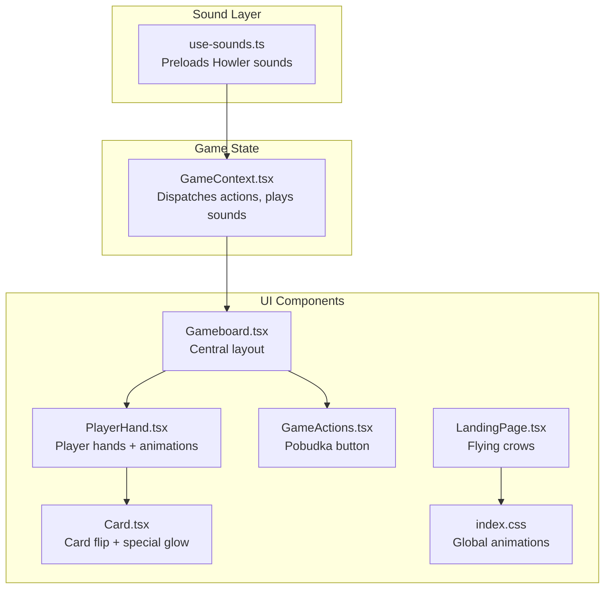
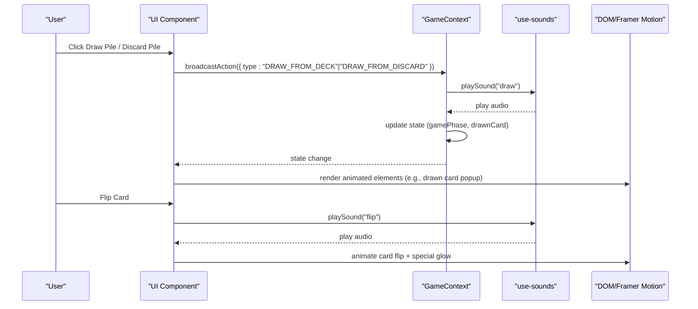
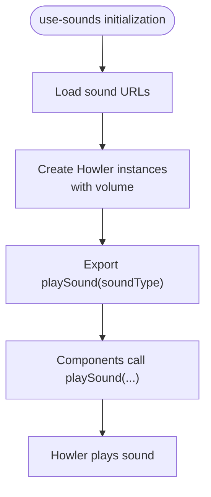
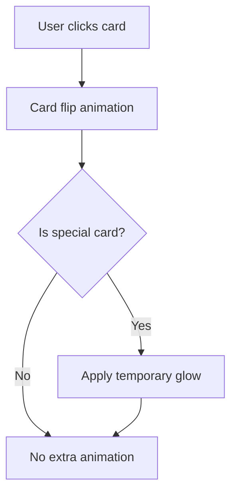
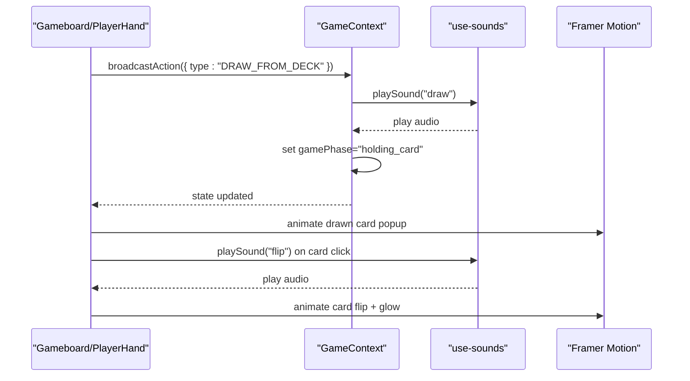
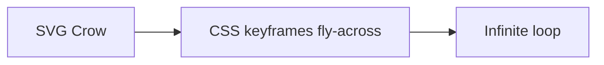
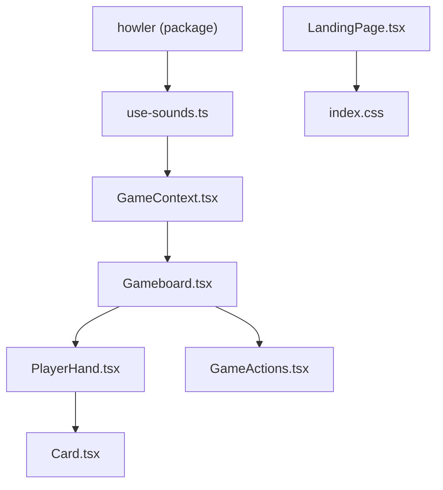

# Sound and Animation System

<cite>
**Referenced Files in This Document**
- [use-sounds.ts](file://src/hooks/use-sounds.ts)
- [GameContext.tsx](file://src/context/GameContext.tsx)
- [Gameboard.tsx](file://src/components/Gameboard.tsx)
- [Card.tsx](file://src/components/Card.tsx)
- [PlayerHand.tsx](file://src/components/PlayerHand.tsx)
- [GameActions.tsx](file://src/components/GameActions.tsx)
- [index.css](file://src/index.css)
- [LandingPage.tsx](file://src/components/LandingPage.tsx)
</cite>

## Table of Contents
1. [Introduction](#introduction)
2. [Project Structure](#project-structure)
3. [Core Components](#core-components)
4. [Architecture Overview](#architecture-overview)
5. [Detailed Component Analysis](#detailed-component-analysis)
6. [Dependency Analysis](#dependency-analysis)
7. [Performance Considerations](#performance-considerations)
8. [Troubleshooting Guide](#troubleshooting-guide)
9. [Conclusion](#conclusion)

## Introduction
This section documents the sound and animation systems in sen-web. The sound system integrates Howler.js via a custom React hook to deliver crisp, responsive audio feedback for key game actions. The animation system leverages Framer Motion to provide smooth, delightful transitions and effects, including card flips, floating draw notifications, and atmospheric flying crows. Together, these systems elevate user experience by synchronizing audio cues with game state changes and enriching the interface with fluid motion.

## Project Structure
The sound and animation systems are implemented across a small set of focused modules:
- Sound: centralized in a custom hook that preloads assets and exposes a simple play function.
- Animation: implemented with Framer Motion primitives in several UI components.
- Integration: GameContext orchestrates state changes and triggers sounds; components receive playSound callbacks and render animations.

**Diagram sources**
- [use-sounds.ts](file://src/hooks/use-sounds.ts#L1-L33)
- [GameContext.tsx](file://src/context/GameContext.tsx#L574-L580)
- [Gameboard.tsx](file://src/components/Gameboard.tsx#L1-L355)
- [PlayerHand.tsx](file://src/components/PlayerHand.tsx#L1-L276)
- [Card.tsx](file://src/components/Card.tsx#L1-L187)
- [GameActions.tsx](file://src/components/GameActions.tsx#L1-L109)
- [LandingPage.tsx](file://src/components/LandingPage.tsx#L1-L114)
- [index.css](file://src/index.css#L146-L217)

**Section sources**
- [use-sounds.ts](file://src/hooks/use-sounds.ts#L1-L33)
- [GameContext.tsx](file://src/context/GameContext.tsx#L574-L580)
- [Gameboard.tsx](file://src/components/Gameboard.tsx#L1-L355)

## Core Components
- use-sounds hook: Preloads a curated set of sound effects and exposes a playSound(soundType) function. Sound types include flip, draw, click, win, lose, chat, and pobudka.
- GameContext: Centralizes game state and action dispatch. It injects playSound into the GameContext provider so components can trigger sounds without managing audio themselves.
- UI components: Gameboard, PlayerHand, and Card integrate sound and animation to reflect game state changes and user interactions.

Key responsibilities:
- Sound: load once, reuse, and avoid redundant loading overhead.
- Animation: use Framer Motion for declarative, performant transitions and gestures.

**Section sources**
- [use-sounds.ts](file://src/hooks/use-sounds.ts#L1-L33)
- [GameContext.tsx](file://src/context/GameContext.tsx#L574-L580)
- [Gameboard.tsx](file://src/components/Gameboard.tsx#L1-L355)
- [PlayerHand.tsx](file://src/components/PlayerHand.tsx#L1-L276)
- [Card.tsx](file://src/components/Card.tsx#L1-L187)

## Architecture Overview
The sound and animation pipeline connects user interactions to state changes and back to UI feedback:

**Diagram sources**
- [Gameboard.tsx](file://src/components/Gameboard.tsx#L224-L278)
- [Card.tsx](file://src/components/Card.tsx#L48-L53)
- [GameContext.tsx](file://src/context/GameContext.tsx#L820-L834)
- [use-sounds.ts](file://src/hooks/use-sounds.ts#L1-L33)

## Detailed Component Analysis

### Sound System with Howler.js
- Preloading: All sound assets are preloaded into Howler instances keyed by sound type. This reduces latency and avoids blocking user interactions.
- Volume: A consistent volume level is applied across all sounds.
- Exposed API: The hook returns a playSound(soundType) callback suitable for passing down to components.

Integration points:
- GameContext injects playSound into the context provider so any component can trigger sounds.
- Components call playSound on user interactions or state transitions.

**Diagram sources**
- [use-sounds.ts](file://src/hooks/use-sounds.ts#L1-L33)

**Section sources**
- [use-sounds.ts](file://src/hooks/use-sounds.ts#L1-L33)
- [GameContext.tsx](file://src/context/GameContext.tsx#L574-L580)

### Animation System with Framer Motion
- Card flip: The Card component uses Framer Motion to animate a 3D card flip with spring physics for realism.
- Special glow: When a special card is revealed, the component applies a temporary, pulsing glow effect synchronized with the flip animation.
- Floating notifications: PlayerHand renders floating labels when a player draws from the deck or discard pile, using AnimatePresence and motion for smooth enter/exit.
- Global animations: index.css defines keyframe-based animations for floating and flying crows, used in the landing page.

**Diagram sources**
- [Card.tsx](file://src/components/Card.tsx#L94-L126)
- [PlayerHand.tsx](file://src/components/PlayerHand.tsx#L210-L235)
- [index.css](file://src/index.css#L146-L217)

**Section sources**
- [Card.tsx](file://src/components/Card.tsx#L1-L187)
- [PlayerHand.tsx](file://src/components/PlayerHand.tsx#L1-L276)
- [index.css](file://src/index.css#L146-L217)

### Synchronization of Sound and Animation with Game State
- Drawing from deck/discard: When a player draws, the GameContext dispatches DRAW_FROM_DECK or DRAW_FROM_DISCARD and triggers a draw sound. The Gameboard displays a floating drawn card preview and animates it into place.
- Flipping cards: Clicking a card triggers a flip sound and a 3D flip animation in the Card component.
- Pobudka: When a player calls pobudka, the GameContext dispatches CALL_POBUDKA and triggers the pobudka sound. The UI reacts with a round-end state and scoring display.

**Diagram sources**
- [Gameboard.tsx](file://src/components/Gameboard.tsx#L241-L256)
- [Card.tsx](file://src/components/Card.tsx#L48-L53)
- [GameContext.tsx](file://src/context/GameContext.tsx#L820-L834)

**Section sources**
- [Gameboard.tsx](file://src/components/Gameboard.tsx#L241-L256)
- [Card.tsx](file://src/components/Card.tsx#L48-L53)
- [GameContext.tsx](file://src/context/GameContext.tsx#L820-L834)

### Flying Crows Animation (Atmospheric Effect)
- The LandingPage component renders multiple SVG crows with CSS keyframes to simulate cross-screen flight.
- These animations are theme-aware and use low opacity for subtlety, enhancing the game’s atmosphere without distracting from gameplay.

**Diagram sources**
- [LandingPage.tsx](file://src/components/LandingPage.tsx#L81-L114)
- [index.css](file://src/index.css#L146-L217)

**Section sources**
- [LandingPage.tsx](file://src/components/LandingPage.tsx#L1-L114)
- [index.css](file://src/index.css#L146-L217)

## Dependency Analysis
- use-sounds depends on Howler.js for audio playback.
- GameContext depends on use-sounds to provide playSound to the rest of the app.
- UI components depend on GameContext for state and playSound.

**Diagram sources**
- [use-sounds.ts](file://src/hooks/use-sounds.ts#L1-L33)
- [GameContext.tsx](file://src/context/GameContext.tsx#L574-L580)
- [Gameboard.tsx](file://src/components/Gameboard.tsx#L1-L355)
- [PlayerHand.tsx](file://src/components/PlayerHand.tsx#L1-L276)
- [Card.tsx](file://src/components/Card.tsx#L1-L187)
- [GameActions.tsx](file://src/components/GameActions.tsx#L1-L109)
- [LandingPage.tsx](file://src/components/LandingPage.tsx#L1-L114)
- [index.css](file://src/index.css#L146-L217)

**Section sources**
- [use-sounds.ts](file://src/hooks/use-sounds.ts#L1-L33)
- [GameContext.tsx](file://src/context/GameContext.tsx#L574-L580)
- [Gameboard.tsx](file://src/components/Gameboard.tsx#L1-L355)

## Performance Considerations
- Audio loading and memory:
  - Preloading sounds avoids runtime latency and reduces repeated network requests. This is implemented in the hook by constructing Howler instances at module load time.
  - Volume normalization keeps audio consistent and avoids unnecessary re-initialization.
- Animation performance:
  - Framer Motion leverages hardware acceleration for transforms and opacity. Prefer transform and opacity for smoothness.
  - Avoid animating heavy DOM subtrees; keep animations scoped to small components (e.g., card flip).
  - Use AnimatePresence to remove nodes after exit animations complete, preventing lingering DOM.
- Network and UX:
  - Sound URLs are loaded from a CDN. Ensure reliable connectivity; consider lazy-loading fallbacks if needed.
  - For mobile devices, test autoplay policies and user gesture requirements for audio.

[No sources needed since this section provides general guidance]

## Troubleshooting Guide
Common issues and resolutions:
- Sound does not play:
  - Verify that playSound is passed down correctly from GameContext to components.
  - Confirm that the sound type exists in the hook and that the Howler instance was created.
  - Check browser autoplay policies; ensure a user gesture occurs before playing audio.
- Sound delay or stutter:
  - Ensure sounds are preloaded (already handled by the hook).
  - Avoid triggering many sounds rapidly; batch or debounce events if necessary.
- Animation jank:
  - Reduce the number of animated components on screen at once.
  - Keep animations simple (e.g., scale/rotate/opacity) and avoid layout thrashing.
  - Use motion variants and springs judiciously; tune stiffness and damping appropriately.
- Pobudka sound not triggered:
  - Ensure the action type is CALL_POBUDKA and that the GameContext branch for this action invokes playSound("pobudka").

**Section sources**
- [use-sounds.ts](file://src/hooks/use-sounds.ts#L1-L33)
- [GameContext.tsx](file://src/context/GameContext.tsx#L820-L834)
- [Card.tsx](file://src/components/Card.tsx#L48-L53)
- [Gameboard.tsx](file://src/components/Gameboard.tsx#L241-L256)

## Conclusion
The sound and animation systems in sen-web combine a lightweight, preloaded Howler-based hook with Framer Motion-driven UI enhancements. They are tightly integrated with GameContext to synchronize audio cues with game state changes, delivering immediate, satisfying feedback for actions like drawing, flipping cards, and calling pobudka. By following the performance and troubleshooting guidance, developers can maintain smooth, responsive experiences across devices and browsers.