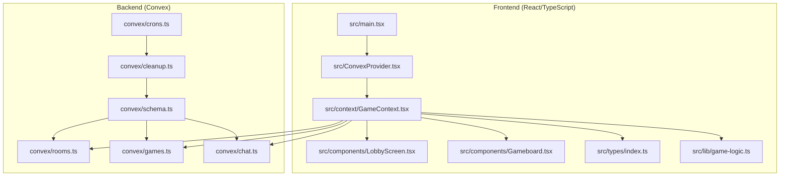
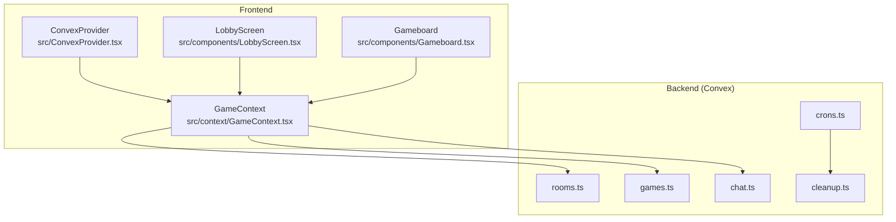
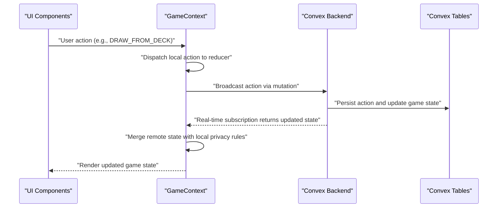
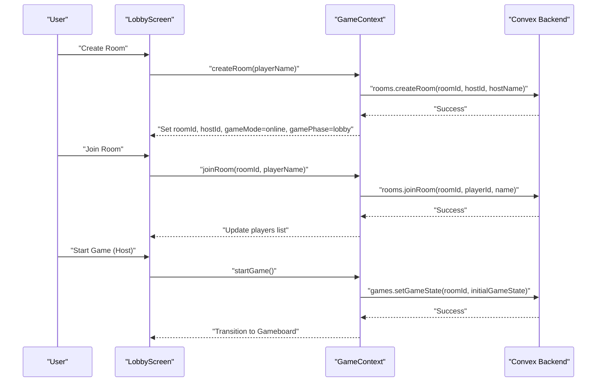
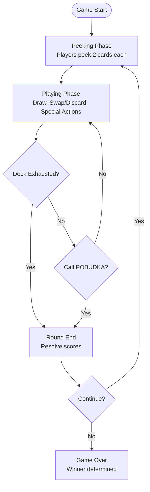
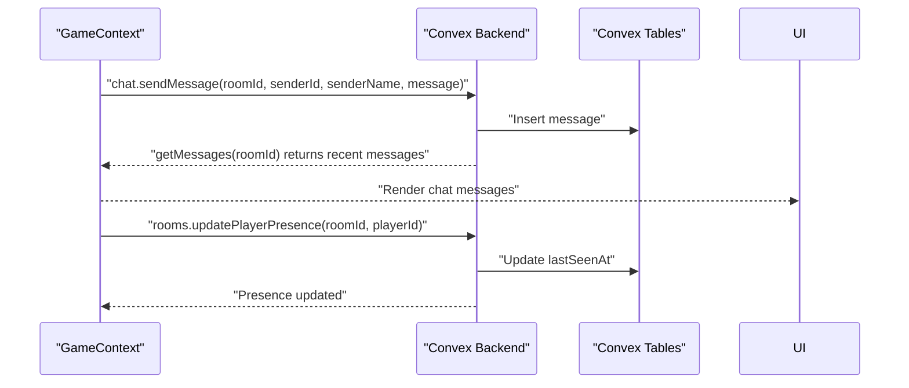
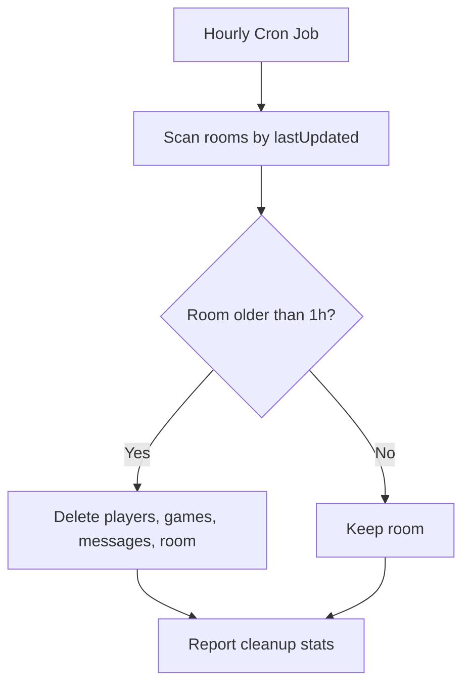
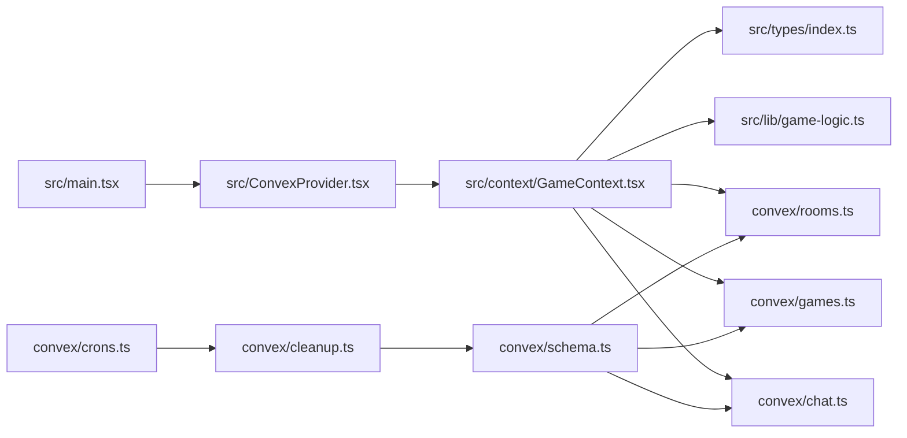

# System Overview

<cite>
**Referenced Files in This Document**
- [README.md](file://README.md)
- [schema.ts](file://convex/schema.ts)
- [rooms.ts](file://convex/rooms.ts)
- [games.ts](file://convex/games.ts)
- [chat.ts](file://convex/chat.ts)
- [cleanup.ts](file://convex/cleanup.ts)
- [crons.ts](file://convex/crons.ts)
- [GameContext.tsx](file://src/context/GameContext.tsx)
- [LobbyScreen.tsx](file://src/components/LobbyScreen.tsx)
- [Gameboard.tsx](file://src/components/Gameboard.tsx)
- [ConvexProvider.tsx](file://src/ConvexProvider.tsx)
- [main.tsx](file://src/main.tsx)
- [types/index.ts](file://src/types/index.ts)
- [game-logic.ts](file://src/lib/game-logic.ts)
- [gamerules.md](file://gamerules.md)
</cite>

## Table of Contents
1. [Introduction](#introduction)
2. [Project Structure](#project-structure)
3. [Core Components](#core-components)
4. [Architecture Overview](#architecture-overview)
5. [Detailed Component Analysis](#detailed-component-analysis)
6. [Dependency Analysis](#dependency-analysis)
7. [Performance Considerations](#performance-considerations)
8. [Troubleshooting Guide](#troubleshooting-guide)
9. [Conclusion](#conclusion)

## Introduction
This section describes the sen-web application, a multiplayer card game called Sen built with React and TypeScript, and powered by Convex for real-time state synchronization, room management, chat, and player presence tracking. The application supports two primary gameplay modes:
- Online multiplayer via Convex-managed rooms and shared game state
- Local hotseat mode for single-device multi-player

The core gameplay loop revolves around turn-based actions, including drawing from the deck or discard pile, swapping or discarding held cards, and using special card abilities. Players interact through room-based matchmaking, turn-based actions, and integrated chat. Convex ensures real-time synchronization of game state and chat messages, while automatic cleanup removes inactive rooms to prevent database bloat.

## Project Structure
The project follows a clear separation between the frontend (React/TypeScript) and the backend (Convex):
- Frontend (React/TypeScript)
  - UI components under src/components
  - Game state and logic under src/context, src/lib, and src/types
  - Convex client initialization under src/ConvexProvider.tsx
  - Application bootstrap under src/main.tsx
- Backend (Convex)
  - Schema and tables under convex/schema.ts
  - Room management, game state, and chat under convex/rooms.ts, convex/games.ts, convex/chat.ts
  - Maintenance and cleanup under convex/cleanup.ts and convex/crons.ts

**Diagram sources**
- [main.tsx](file://src/main.tsx#L1-L21)
- [ConvexProvider.tsx](file://src/ConvexProvider.tsx#L1-L18)
- [GameContext.tsx](file://src/context/GameContext.tsx#L1-L120)
- [LobbyScreen.tsx](file://src/components/LobbyScreen.tsx#L1-L120)
- [Gameboard.tsx](file://src/components/Gameboard.tsx#L1-L120)
- [schema.ts](file://convex/schema.ts#L1-L42)
- [rooms.ts](file://convex/rooms.ts#L1-L119)
- [games.ts](file://convex/games.ts#L1-L43)
- [chat.ts](file://convex/chat.ts#L1-L35)
- [cleanup.ts](file://convex/cleanup.ts#L1-L68)
- [crons.ts](file://convex/crons.ts#L1-L17)

**Section sources**
- [README.md](file://README.md#L1-L93)
- [main.tsx](file://src/main.tsx#L1-L21)
- [ConvexProvider.tsx](file://src/ConvexProvider.tsx#L1-L18)
- [schema.ts](file://convex/schema.ts#L1-L42)

## Core Components
- Convex schema defines the data model for rooms, players, games, and messages with appropriate indexes for efficient querying.
- Room management handles creation, joining, and player presence updates.
- Game state synchronization persists and updates the serialized GameState per room.
- Chat stores and retrieves recent messages per room.
- Cleanup and cron jobs automatically remove inactive rooms and their data.

Key responsibilities:
- Room lifecycle: createRoom, joinRoom, getRoom, getPlayers, updatePlayerPresence
- Game state: setGameState, getGameState
- Chat: sendMessage, getMessages
- Maintenance: cleanupOldRooms, hourly cron scheduling

**Section sources**
- [schema.ts](file://convex/schema.ts#L1-L42)
- [rooms.ts](file://convex/rooms.ts#L1-L119)
- [games.ts](file://convex/games.ts#L1-L43)
- [chat.ts](file://convex/chat.ts#L1-L35)
- [cleanup.ts](file://convex/cleanup.ts#L1-L68)
- [crons.ts](file://convex/crons.ts#L1-L17)

## Architecture Overview
The system architecture separates concerns between frontend and backend:
- Frontend (React/TypeScript)
  - Initializes Convex client and wraps the app with providers
  - Uses Convex hooks to subscribe to game state, chat messages, and player presence
  - Manages local game state transitions and broadcasts actions to Convex
- Backend (Convex)
  - Stores rooms, players, games, and messages
  - Exposes mutations and queries for room/game/chat operations
  - Runs periodic cleanup to remove inactive rooms

**Diagram sources**
- [ConvexProvider.tsx](file://src/ConvexProvider.tsx#L1-L18)
- [GameContext.tsx](file://src/context/GameContext.tsx#L574-L820)
- [LobbyScreen.tsx](file://src/components/LobbyScreen.tsx#L1-L120)
- [Gameboard.tsx](file://src/components/Gameboard.tsx#L1-L120)
- [rooms.ts](file://convex/rooms.ts#L1-L119)
- [games.ts](file://convex/games.ts#L1-L43)
- [chat.ts](file://convex/chat.ts#L1-L35)
- [cleanup.ts](file://convex/cleanup.ts#L1-L68)
- [crons.ts](file://convex/crons.ts#L1-L17)

## Detailed Component Analysis

### GameContext: State Management and Real-Time Sync
GameContext orchestrates the game state, integrates Convex for persistence and synchronization, and coordinates multiplayer interactions:
- Maintains local GameState and dispatches actions to update it
- Subscribes to remote game state, chat messages, and player presence
- Synchronizes remote state to local state while preserving privacy (e.g., hiding opponent peeked cards)
- Broadcasts actions to Convex for other clients to observe
- Handles player presence updates and detects leaving players
- Implements reconnection logic using session storage

**Diagram sources**
- [GameContext.tsx](file://src/context/GameContext.tsx#L574-L820)
- [rooms.ts](file://convex/rooms.ts#L1-L119)
- [games.ts](file://convex/games.ts#L1-L43)
- [chat.ts](file://convex/chat.ts#L1-L35)

Key implementation highlights:
- Real-time subscriptions for game state and chat messages
- Privacy-aware merging during peeking phase
- Presence updates and player leaving detection
- Reconnection handling using session storage

**Section sources**
- [GameContext.tsx](file://src/context/GameContext.tsx#L574-L820)

### Room-Based Matchmaking and Lobby Flow
The lobby screen supports creating/joining rooms and transitioning to gameplay:
- Online mode: createRoom, joinRoom, display room ID, manage player list, and start game
- Hotseat mode: configure local players and start a single-device game
- Host-only initiation of online games

**Diagram sources**
- [LobbyScreen.tsx](file://src/components/LobbyScreen.tsx#L1-L120)
- [GameContext.tsx](file://src/context/GameContext.tsx#L574-L820)
- [rooms.ts](file://convex/rooms.ts#L1-L119)
- [games.ts](file://convex/games.ts#L1-L43)

**Section sources**
- [LobbyScreen.tsx](file://src/components/LobbyScreen.tsx#L1-L120)
- [GameContext.tsx](file://src/context/GameContext.tsx#L574-L820)

### Gameplay Loop and Turn-Based Actions
The game proceeds through distinct phases with turn-based actions:
- Initial peeking phase: each player peeks at two cards in their dream
- Playing phase: draw from deck or discard, swap or discard held card, use special actions
- Round end: resolve deck exhaustion or POBUDKA call
- New round: reshuffle, deal new hands, and continue until reaching the win condition

**Diagram sources**
- [GameContext.tsx](file://src/context/GameContext.tsx#L1-L548)
- [types/index.ts](file://src/types/index.ts#L1-L100)
- [game-logic.ts](file://src/lib/game-logic.ts#L1-L63)
- [gamerules.md](file://gamerules.md#L1-L97)

**Section sources**
- [GameContext.tsx](file://src/context/GameContext.tsx#L1-L548)
- [types/index.ts](file://src/types/index.ts#L1-L100)
- [game-logic.ts](file://src/lib/game-logic.ts#L1-L63)
- [gamerules.md](file://gamerules.md#L1-L97)

### Chat Integration and Presence Tracking
- Chat messages are persisted and retrieved per room for real-time display
- Player presence is tracked via periodic updates; inactive players are detected and removed from the lobby
- Leaving detection triggers a reset when a player disconnects during active gameplay

**Diagram sources**
- [chat.ts](file://convex/chat.ts#L1-L35)
- [rooms.ts](file://convex/rooms.ts#L100-L119)
- [GameContext.tsx](file://src/context/GameContext.tsx#L684-L781)

**Section sources**
- [chat.ts](file://convex/chat.ts#L1-L35)
- [rooms.ts](file://convex/rooms.ts#L100-L119)
- [GameContext.tsx](file://src/context/GameContext.tsx#L684-L781)

### Automatic Room Cleanup
Convex runs a scheduled cron job to clean up rooms inactive for more than one hour, removing associated players, game state, and messages.

**Diagram sources**
- [crons.ts](file://convex/crons.ts#L1-L17)
- [cleanup.ts](file://convex/cleanup.ts#L1-L68)

**Section sources**
- [crons.ts](file://convex/crons.ts#L1-L17)
- [cleanup.ts](file://convex/cleanup.ts#L1-L68)

## Dependency Analysis
- Frontend depends on Convex client initialization and GameContext for state management
- GameContext depends on Convex mutations and queries for rooms, games, and chat
- Convex schema defines the data model and indexes used by backend functions
- Cleanup and cron jobs depend on the schema and tables to remove stale data

**Diagram sources**
- [main.tsx](file://src/main.tsx#L1-L21)
- [ConvexProvider.tsx](file://src/ConvexProvider.tsx#L1-L18)
- [GameContext.tsx](file://src/context/GameContext.tsx#L574-L820)
- [schema.ts](file://convex/schema.ts#L1-L42)
- [rooms.ts](file://convex/rooms.ts#L1-L119)
- [games.ts](file://convex/games.ts#L1-L43)
- [chat.ts](file://convex/chat.ts#L1-L35)
- [cleanup.ts](file://convex/cleanup.ts#L1-L68)
- [crons.ts](file://convex/crons.ts#L1-L17)

**Section sources**
- [main.tsx](file://src/main.tsx#L1-L21)
- [ConvexProvider.tsx](file://src/ConvexProvider.tsx#L1-L18)
- [GameContext.tsx](file://src/context/GameContext.tsx#L574-L820)
- [schema.ts](file://convex/schema.ts#L1-L42)

## Performance Considerations
- Real-time updates: Subscribe to game state and chat only when online and in a room to minimize unnecessary network traffic
- Privacy merges: During peeking, merge only local peeked cards to avoid transmitting sensitive information
- Presence updates: Periodic presence updates reduce bandwidth while maintaining responsiveness
- Cleanup: Hourly cleanup prevents database bloat and maintains query performance
- Client-side caching: Use refs to track last synced state and avoid redundant renders

[No sources needed since this section provides general guidance]

## Troubleshooting Guide
Common issues and resolutions:
- Convex URL not configured: Ensure VITE_CONVEX_URL is set; otherwise, Convex features will not work
- Room not found when joining: Verify room ID and that the room exists
- Player presence timeouts: Presence updates occur every 10 seconds; ensure connectivity remains stable
- Opponent leaving during gameplay: The system resets the game state when a player disconnects during active play
- Reconnection handling: On reconnect, the system restores player ID, room ID, and player name from session storage

**Section sources**
- [ConvexProvider.tsx](file://src/ConvexProvider.tsx#L1-L18)
- [rooms.ts](file://convex/rooms.ts#L1-L119)
- [GameContext.tsx](file://src/context/GameContext.tsx#L793-L820)

## Conclusion
The sen-web application provides a robust multiplayer card game experience with real-time synchronization powered by Convex. The frontend and backend are cleanly separated, enabling scalable multiplayer gameplay with room-based matchmaking, turn-based actions, and integrated chat. Automatic cleanup and presence tracking enhance reliability and performance, while the GameContext centralizes state management and synchronization for both online and local hotseat modes.

[No sources needed since this section summarizes without analyzing specific files]