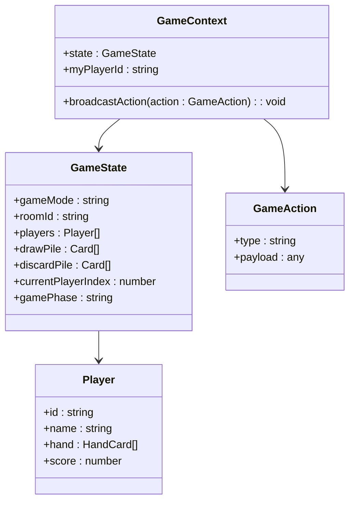
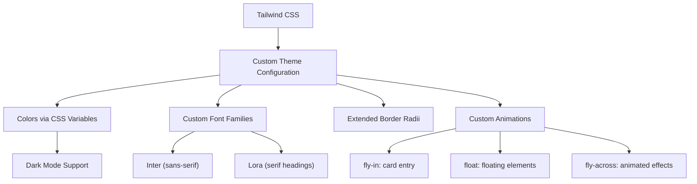
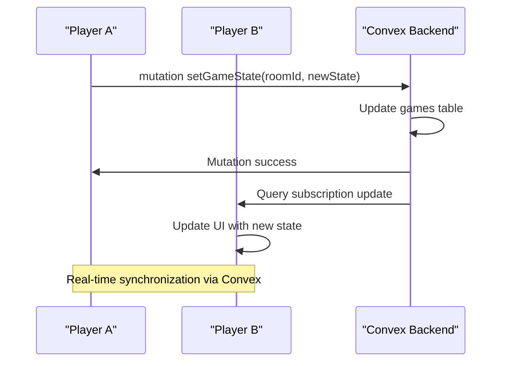
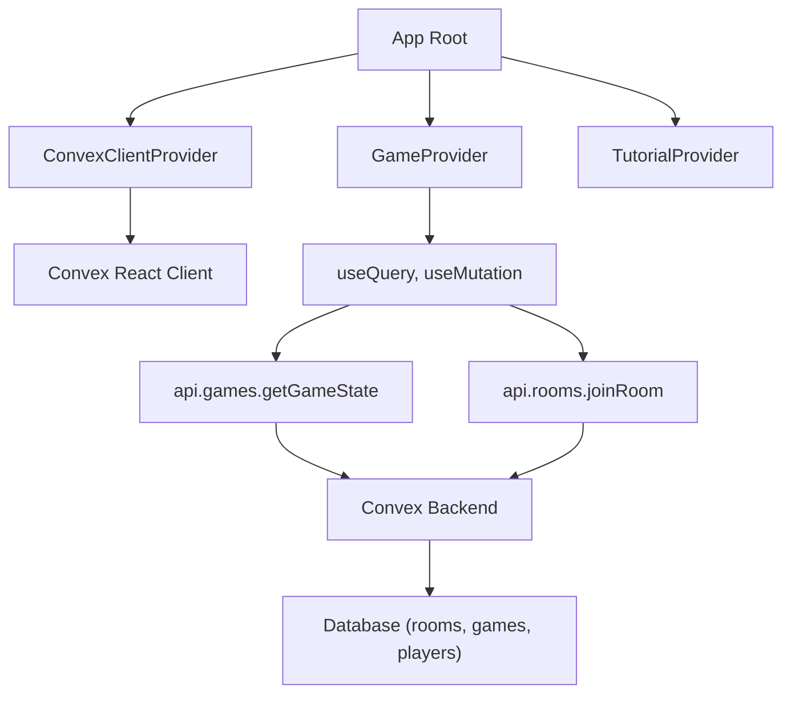

# Technology Stack

<cite>
**Referenced Files in This Document**   
- [package.json](file://package.json)
- [vite.config.ts](file://vite.config.ts)
- [tailwind.config.js](file://tailwind.config.js)
- [tsconfig.json](file://tsconfig.json)
- [tsconfig.app.json](file://tsconfig.app.json)
- [convex/tsconfig.json](file://convex/tsconfig.json)
- [src/ConvexProvider.tsx](file://src/ConvexProvider.tsx)
- [src/i18n/config.ts](file://src/i18n/config.ts)
- [src/main.tsx](file://src/main.tsx)
- [src/App.tsx](file://src/App.tsx)
- [convex/schema.ts](file://convex/schema.ts)
- [convex/games.ts](file://convex/games.ts)
- [convex/rooms.ts](file://convex/rooms.ts)
- [src/context/GameContext.tsx](file://src/context/GameContext.tsx)
- [src/components/Gameboard.tsx](file://src/components/Gameboard.tsx)
</cite>

## Table of Contents
1. [Introduction](#introduction)
2. [Core Frameworks and Libraries](#core-frameworks-and-libraries)
3. [Build and Development Tooling](#build-and-development-tooling)
4. [Styling and UI Infrastructure](#styling-and-ui-infrastructure)
5. [Real-Time Backend with Convex](#real-time-backend-with-convex)
6. [Internationalization with i18next](#internationalization-with-i18next)
7. [Integration Patterns](#integration-patterns)
8. [Performance and Debugging](#performance-and-debugging)
9. [Conclusion](#conclusion)

## Introduction
The sen-web application leverages a modern, full-stack JavaScript architecture designed for real-time multiplayer gameplay with rich UI interactions and international support. This document details the technology stack, focusing on how React, TypeScript, Convex, Vite, Tailwind CSS, and i18next work together to deliver a seamless gaming experience. The stack emphasizes type safety, real-time synchronization, responsive design, and multi-language support, enabling players to engage in the traditional Polish card game "Sen" across devices and regions.

**Section sources**
- [package.json](file://package.json)
- [src/main.tsx](file://src/main.tsx)

## Core Frameworks and Libraries

### React for UI Components
React serves as the foundation for the UI layer, enabling component-based development with declarative rendering. The application uses React 19 with concurrent features like Suspense for loading states and StrictMode for detecting side effects. Components such as `LobbyScreen`, `Gameboard`, and `PlayerHand` encapsulate game-specific UI logic, while React Context (`GameContext`, `TutorialContext`) manages global state without prop drilling.

React Router is not used, as navigation is handled through conditional rendering in `App.tsx`, transitioning between landing, lobby, and gameboard views using state and animations from Framer Motion.

**Section sources**
- [src/App.tsx](file://src/App.tsx)
- [src/components/Gameboard.tsx](file://src/components/Gameboard.tsx)
- [src/context/GameContext.tsx](file://src/context/GameContext.tsx)

### TypeScript for Type Safety
TypeScript provides static typing across the entire codebase, ensuring type safety from the frontend through to Convex backend functions. The configuration uses `tsconfig.json` as a base with project references to `tsconfig.app.json` (frontend) and `tsconfig.node.json` (backend), allowing independent type checking for client and server code.

Key types are defined in `src/types/index.ts`, including `GameState`, `Player`, and `GameAction`, which are used consistently across React components and Convex functions. The Convex SDK generates TypeScript types from the database schema in `convex/schema.ts`, enabling end-to-end type safety for database operations.

**Diagram sources**
- [src/types/index.ts](file://src/types/index.ts)
- [src/context/GameContext.tsx](file://src/context/GameContext.tsx)

## Build and Development Tooling

### Vite for Build Tooling
Vite is the build tool and development server, providing fast hot module replacement (HMR) and optimized production builds. The configuration in `vite.config.ts` includes the React plugin and sets up path aliases using `@/` to reference the `src` directory, improving import readability.

The `optimizeDeps.exclude` option excludes `lucide-react` from pre-bundling, which helps avoid issues with tree-shaking for icon components. Vite's native ES module support enables rapid startup and efficient code splitting.

**Section sources**
- [vite.config.ts](file://vite.config.ts)
- [package.json](file://package.json)

## Styling and UI Infrastructure

### Tailwind CSS for Styling
Tailwind CSS provides utility-first styling with a custom configuration in `tailwind.config.js`. The design system uses CSS variables for theming (light/dark mode), with colors defined via `hsl(var(--color))` syntax for dynamic color manipulation.

The configuration extends the default theme with custom fonts (Inter for sans, Lora for headings), border radii, animations, and shadows. Key animations like `fly-in`, `float`, and `fly-across` enhance the game's visual feedback. The `tailwindcss-animate` plugin integrates with Radix UI components for consistent transitions.

**Diagram sources**
- [tailwind.config.js](file://tailwind.config.js)

## Real-Time Backend with Convex

### Convex for Real-Time Backend and Database
Convex serves as the full-stack serverless platform, providing a real-time backend, database, and server functions. It enables automatic synchronization of game state across clients through query subscriptions and mutations.

The database schema in `convex/schema.ts` defines collections for `rooms`, `players`, `games`, and `messages`, each with indexed fields for efficient querying. For example, `games` are indexed by `roomId` to quickly retrieve game state for a specific room.

#### Real-Time Game State Synchronization
Game state synchronization is implemented through Convex's reactive queries. In `GameContext.tsx`, `useQuery(api.games.getGameState)` subscribes to the game state for the current room. When any client calls `setGameState` mutation, all subscribed clients receive the update automatically.

The `games.ts` file defines `getGameState` (query) and `setGameState` (mutation) functions. The mutation upserts the game state, while the query retrieves it. This pattern ensures all players see the same game state in real time.

**Diagram sources**
- [convex/schema.ts](file://convex/schema.ts)
- [convex/games.ts](file://convex/games.ts)
- [src/context/GameContext.tsx](file://src/context/GameContext.tsx)

### Convex Configuration
The backend TypeScript configuration in `convex/tsconfig.json` is optimized for Convex requirements, targeting ESNext with isolated modules and no emit. It includes strict type checking while allowing JS files and synthetic default imports for flexibility.

**Section sources**
- [convex/tsconfig.json](file://convex/tsconfig.json)

## Internationalization with i18next

### i18next for Internationalization
i18next enables multi-language support with translations for English (`en`) and Polish (`pl`) stored in `public/locales`. The configuration in `src/i18n/config.ts` sets up the i18next instance with HTTP backend for loading translation files, language detector for automatic locale detection, and React integration.

Languages are detected via `localStorage` or browser settings, with `en` as the fallback. Translation files are loaded on demand from `/locales/{{lng}}/{{ns}}.json`. The `react-i18next` library provides the `useTranslation` hook used in components like `Gameboard.tsx` to display localized text.

**Section sources**
- [src/i18n/config.ts](file://src/i18n/config.ts)
- [public/locales/en/translation.json](file://public/locales/en/translation.json)
- [public/locales/pl/translation.json](file://public/locales/pl/translation.json)

## Integration Patterns

### React-Convex Integration
The integration between React and Convex is orchestrated through the `ConvexProvider` component. Defined in `ConvexProvider.tsx`, it wraps the app with `ConvexProvider` from the Convex React client, making the Convex client available to all components via React context.

In `main.tsx`, the app is wrapped with `ConvexClientProvider`, `GameProvider`, and `TutorialProvider`, establishing the dependency chain. Components use `useQuery` and `useMutation` hooks from `convex/react` to interact with backend functions, such as `api.games.getGameState` and `api.rooms.joinRoom`.

**Diagram sources**
- [src/ConvexProvider.tsx](file://src/ConvexProvider.tsx)
- [src/main.tsx](file://src/main.tsx)
- [src/context/GameContext.tsx](file://src/context/GameContext.tsx)

## Performance and Debugging

### Version Compatibility
The stack maintains compatibility across major versions:
- React 19 with Vite 6 and TypeScript 5
- Convex SDK v1.29.2 with generated types
- Tailwind CSS v3.4 with PostCSS
- i18next v25 with React integration

Dependencies are managed via npm, with `package-lock.json` ensuring reproducible installs.

### Performance Implications
- **Vite**: Enables fast development startup and HMR
- **Tailwind**: Utility classes are purged in production for minimal CSS
- **Convex**: Real-time sync reduces need for manual polling
- **React 19**: Concurrent rendering improves UI responsiveness
- **TypeScript**: Compile-time checks reduce runtime errors

### Debugging Tools
- **Vite Dev Server**: Hot module replacement and error overlay
- **React DevTools**: Component inspection and state debugging
- **Convex Console**: Real-time database inspection and function logging
- **i18next Debug**: Translation key visualization in UI
- **ESLint**: Code quality enforcement via `eslint.config.js`

**Section sources**
- [package.json](file://package.json)
- [vite.config.ts](file://vite.config.ts)
- [tailwind.config.js](file://tailwind.config.js)
- [eslint.config.js](file://eslint.config.js)

## Conclusion
The sen-web technology stack combines modern frontend frameworks with a powerful real-time backend to deliver a responsive, type-safe, and internationalized gaming experience. React and TypeScript provide a robust foundation for UI development, Vite ensures fast builds, Tailwind CSS enables consistent and customizable styling, and Convex handles real-time state synchronization with minimal boilerplate. i18next supports multi-language gameplay, making the application accessible to both English and Polish speakers. The integration between these technologies is seamless, leveraging React context, Convex's reactive queries, and standardized configuration to create a cohesive and maintainable codebase.