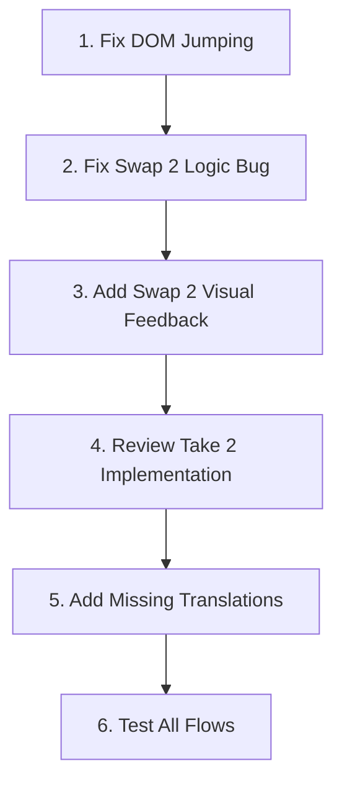

# Sen Game Fix Plan

## Overview

This plan addresses DOM jumping issues, missing visual feedback for special actions, and game logic bugs based on RULES.md.

---

## Issue 1: DOM Layout Jumping

### Root Causes
1. **GSAP entrance animations** in PlayerHand cause cards to animate from `y: 50` on every re-render
2. **Conditional rendering** of GameActions component based on `gamePhase`
3. **Drawn card overlay** changes page structure
4. **`isCompact` state** dynamically changes layout classes

### Fixes Required

#### 1.1 Prevent GSAP re-animation on every render
- **File:** `src/components/PlayerHand.tsx`
- **Problem:** Lines 61-73 animate cards on mount, but React re-renders trigger this repeatedly
- **Solution:** Use a ref to track if initial animation has played; only animate once

#### 1.2 Reserve space for GameActions
- **File:** `src/components/Gameboard.tsx`
- **Problem:** GameActions conditionally renders different heights
- **Solution:** Always render a fixed-height container wrapper; use opacity/visibility instead of conditional rendering

#### 1.3 Stabilize drawn card overlay
- **File:** `src/components/Gameboard.tsx`
- **Problem:** Overlay structure changes DOM
- **Solution:** Keep overlay always mounted with `opacity-0 pointer-events-none` when inactive

---

## Issue 2: Swap 2 Visual Feedback

### Missing Feature
When a player uses "Swap 2", other players should see which cards were involved in the swap.

### Current State
- `lastMove` type for `swap_2` only tracks `playerId`, `action`, and `timestamp`
- No card indices stored for the two swapped cards

### Fixes Required

#### 2.1 Extend lastMove type to include swap details
- **File:** `src/types/index.ts`
- Add `swap2Details?: { card1: { playerId: string; cardIndex: number }; card2: { playerId: string; cardIndex: number } }`

#### 2.2 Store swap details in reducer
- **File:** `src/state/gameReducer.ts`
- In `ACTION_SWAP_2_SELECT` case, populate `swap2Details` in `lastMove`

#### 2.3 Display swap indicators on cards
- **File:** `src/components/PlayerHand.tsx`
- Check if `lastMove.action === "swap_2"` and highlight the affected card indices

---

## Issue 3: Swap 2 Logic Bug

### Problem
In `gameReducer.ts` line 431-435:
```typescript
const currentPlayerId = state.players[state.currentPlayerIndex].id;
const card1 = {
  playerId: currentPlayerId,  // BUG: Should be gameAction.payload.playerId
  cardIndex: gameAction.payload.cardIndex,
};
```

This always stores the current player as card1 owner, but Swap 2 allows selecting ANY card including opponents.

### Fix Required
- **File:** `src/state/gameReducer.ts`
- Change line 432 to use `gameAction.payload.playerId` instead of `currentPlayerId`

---

## Issue 4: Take 2 Implementation Review

### Per RULES.md
1. Draw 2 cards from deck
2. Look at both, choose 1 to keep
3. Discard the other
4. With kept card: swap into hand OR discard OR use if special

### Current State
- `ACTION_TAKE_2_CHOOSE` logic seems incorrect - it replaces a hand card directly

### Fixes Required
- **File:** `src/state/gameReducer.ts`
- Review and fix Take 2 flow to match rules
- After choosing, player should have the card in `drawnCard` state, then decide what to do

---

## Issue 5: Missing Translation Keys

### Keys to add
- `game.drewSpecial` - When drawing a special card
- `game.specialAction` - When using a special action
- `game.drewFromDiscard` - When drawing from discard pile
- `game.peekResult` - After peeking at a card

---

## Implementation Order



---

## Detailed Task List

### Phase 1: Stabilize Layout - Prevent DOM Jumping
- [ ] 1.1 Add animation guard ref in PlayerHand to prevent re-animation
- [ ] 1.2 Create fixed-height wrapper for GameActions area
- [ ] 1.3 Always mount drawn card overlay with visibility toggle instead of conditional render
- [ ] 1.4 Remove or stabilize `isCompact` layout jumps

### Phase 2: Fix Game Logic Bugs
- [ ] 2.1 Fix Swap 2 first card selection to use payload playerId not currentPlayerId
- [ ] 2.2 Review and test Take 2 card flow against RULES.md

### Phase 3: Add Visual Feedback for Swap 2
- [ ] 3.1 Extend `lastMove` type with `swap2Details` field
- [ ] 3.2 Update reducer to populate swap2Details
- [ ] 3.3 Add card highlighting in PlayerHand for recently swapped cards
- [ ] 3.4 Add animation/glow effect for swap indication

### Phase 4: Polish and Translations
- [ ] 4.1 Add all missing translation keys to EN and PL files
- [ ] 4.2 Test all game phases in browser
- [ ] 4.3 Run lint and fix any errors

---

## Files to Modify

| File | Changes |
|------|---------|
| `src/components/PlayerHand.tsx` | Animation guard, swap highlighting |
| `src/components/Gameboard.tsx` | Fixed GameActions container, stable overlay |
| `src/state/gameReducer.ts` | Swap 2 logic fix, Take 2 review, lastMove updates |
| `src/types/index.ts` | Add swap2Details to lastMove type |
| `public/locales/en/translation.json` | Add missing keys |
| `public/locales/pl/translation.json` | Add missing keys |